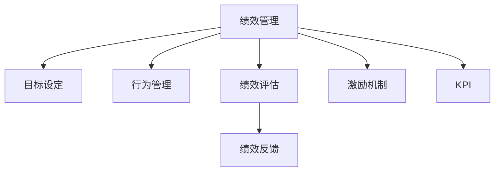

                 

# 绩效管理：激励员工达成目标的系统

## 1. 背景介绍

绩效管理是企业人力资源管理中至关重要的一环，直接关系到员工的激励效果和企业发展目标的达成。随着市场竞争日益激烈，传统的人力资源管理方法已难以满足企业的实际需求。企业亟需一种更系统、更高效、更科学的绩效管理体系，以实现员工绩效与企业目标的双赢。本文旨在通过系统性地探讨绩效管理的核心概念、算法原理及具体操作步骤，为企业构建一套灵活、高效的绩效管理系统。

## 2. 核心概念与联系

### 2.1 核心概念概述

为更好地理解绩效管理系统的构建，本节将介绍几个密切相关的核心概念：

- 绩效管理：指通过设置明确的目标、规范的行为标准和科学的评估方法，对员工的工作表现进行定期评估，从而激励员工达成企业目标的过程。
- 目标设定：指根据企业战略和业务需求，确定具体的、可量化的绩效指标。
- 行为管理：指通过制定和执行工作标准、流程规范等，确保员工的行为符合企业的期望。
- 绩效评估：指根据既定的评估标准和方法，对员工的工作表现进行量化评估，衡量其与目标的差距。
- 绩效反馈：指根据评估结果，向员工提供具体的、建设性的反馈意见，指导其改进工作表现。
- 激励机制：指通过物质和精神激励，激发员工的工作热情和动力，以达到更好的绩效表现。
- KPI（关键绩效指标）：指与企业战略目标紧密相关的、能反映企业运营状况及员工工作业绩的若干量化指标。

这些核心概念之间的逻辑关系可以通过以下Mermaid流程图来展示：



这个流程图展示了一整套绩效管理系统的工作流程：

1. 企业通过目标设定，明确各项关键绩效指标。
2. 行为管理制定和执行工作标准，确保员工行为符合企业期望。
3. 绩效评估根据既定标准评估员工工作表现，衡量目标达成情况。
4. 根据绩效评估结果，向员工提供反馈，帮助其改进。
5. 通过激励机制激发员工动力，达成更好的绩效表现。
6. KPI作为衡量指标，贯穿整个绩效管理过程。

这些核心概念共同构成了绩效管理系统的基本框架，通过目标设定、行为管理、绩效评估、绩效反馈和激励机制的协同运作，确保员工绩效与企业目标的一致性。

## 3. 核心算法原理 & 具体操作步骤
### 3.1 算法原理概述

绩效管理系统通过一套科学的方法论，将企业的战略目标分解为可操作的具体指标，并通过定期的评估和反馈，不断调整和优化，最终实现员工绩效与企业目标的统一。其核心算法原理主要包括：

- 目标分解：将企业总体战略目标拆解为可执行的关键绩效指标。
- 行为监控：通过实时监控和记录员工的工作行为，确保其符合企业标准。
- 绩效评估：采用科学的量化评估方法，对员工的工作表现进行定期评估。
- 绩效反馈：根据评估结果，向员工提供具体的反馈，指导其改进。
- 激励调整：根据绩效表现，动态调整激励机制，激发员工动力。

通过这些核心算法，绩效管理系统可以确保员工的行为与企业目标保持一致，同时通过定期的反馈和激励，不断提升员工绩效，实现企业目标的达成。

### 3.2 算法步骤详解

基于上述核心算法原理，绩效管理系统的具体操作步骤包括以下几个关键步骤：

**Step 1: 目标设定**
- 通过与企业管理层和业务部门深入沟通，明确企业的战略目标。
- 将战略目标拆解为若干可量化的关键绩效指标(KPI)，确保其符合SMART原则（具体、可量化、可达成、相关性、时限性）。

**Step 2: 行为管理**
- 制定详细的工作标准、流程规范和行为准则，确保员工行为符合企业期望。
- 使用行为监控工具，如绩效管理系统、考勤系统等，实时记录员工的工作行为。

**Step 3: 绩效评估**
- 采用科学的评估方法，如360度评估、行为观察、工作记录等，对员工的工作表现进行量化评估。
- 通过数据分析工具，如BI、Excel等，生成绩效报告，评估员工与目标的差距。

**Step 4: 绩效反馈**
- 定期向员工提供具体的、建设性的反馈意见，指出其工作中的优点和改进点。
- 帮助员工制定个人发展计划，指导其职业成长。

**Step 5: 激励调整**
- 根据绩效评估结果，动态调整激励机制，如薪酬、晋升、奖金等，激励员工达成目标。
- 引入多层次的激励方式，如物质激励和精神激励，提升员工的工作热情。

通过以上步骤，绩效管理系统可以系统地完成目标设定、行为管理、绩效评估、绩效反馈和激励调整，确保员工绩效与企业目标的一致性。

### 3.3 算法优缺点

绩效管理系统具有以下优点：
1. 系统性强。通过科学的目标分解、行为监控、绩效评估和激励调整，确保每个员工都能明确目标，同时对其实际表现进行持续跟踪和优化。
2. 效率高。自动化工具和流程优化，减少人工干预，提高管理效率。
3. 数据驱动。通过绩效数据分析，为企业决策提供数据支持，提升决策的科学性和准确性。
4. 透明公平。公开透明的评估标准和反馈机制，提升员工的认同感和满意度。

同时，该系统也存在一定的局限性：
1. 复杂度高。系统建设和管理需要投入大量人力和资源，初期投入成本较高。
2. 灵活性差。对于流程固定、工作内容单一的岗位，系统管理效果较好，而对于多变岗位和跨部门协作，系统的适应性不足。
3. 信息滞后。实时数据收集和分析可能存在延迟，影响及时反馈和决策。
4. 依赖员工自觉。系统的效果依赖员工的主动参与和配合，管理难度较大。

尽管存在这些局限性，但总体而言，绩效管理系统仍然是一种高效、科学的员工绩效管理方式，适合各类企业采用。

### 3.4 算法应用领域

绩效管理系统广泛应用于各行各业，特别是在以下领域中表现尤为突出：

- 制造行业：通过精细化的行为监控和绩效评估，提升生产效率和质量控制。
- 金融行业：通过科学的风险控制和绩效激励，保障业务稳定发展。
- 医疗行业：通过定期的绩效评估和反馈，提升医护人员的服务质量和患者满意度。
- 零售行业：通过绩效管理系统的销售数据分析，优化库存管理和销售策略。
- 教育行业：通过科学的目标设定和绩效评估，提升教师教学质量和学生学习效果。
- 互联网行业：通过绩效管理系统的实时监控和激励调整，提升产品开发效率和用户体验。

除了上述这些行业外，绩效管理系统也在越来越多的领域得到应用，成为人力资源管理的重要手段。随着技术的不断进步，绩效管理系统也将朝着更智能化、人性化的方向发展。

## 4. 数学模型和公式 & 详细讲解 & 举例说明
### 4.1 数学模型构建

为了更科学地进行绩效评估和分析，我们需要构建一套数学模型来量化员工绩效和目标达成情况。以下是一个简化的绩效管理数学模型：

- **目标设定模型**：设企业的总体战略目标为 $T$，通过目标分解得到 $n$ 个关键绩效指标 $KPI_i$，每个指标对应的权重为 $w_i$。
- **行为监控模型**：设员工的工作行为指标为 $B$，通过行为监控工具得到员工的行为数据 $B_i$。
- **绩效评估模型**：设员工的工作表现指标为 $P$，通过360度评估、行为观察等方法得到员工的绩效数据 $P_i$。
- **绩效反馈模型**：设员工的改进情况指标为 $I$，通过绩效反馈机制得到员工的改进数据 $I_i$。
- **激励调整模型**：设员工的激励情况指标为 $M$，通过激励调整机制得到员工的激励数据 $M_i$。

通过上述模型，我们可以对员工的工作表现进行系统的评估和优化，确保其与企业目标的一致性。

### 4.2 公式推导过程

以目标设定和绩效评估为例，推导相应的数学公式：

**目标设定模型**：
- 设目标 $T$ 为 $T = \sum_{i=1}^n w_i KPI_i$
- 设目标权重 $w_i$ 为 $w_i = \frac{w_i}{\sum_{j=1}^n w_j}$
- 设关键绩效指标 $KPI_i$ 为 $KPI_i = KPI_{i,actual} - KPI_{i,target}$

**绩效评估模型**：
- 设绩效 $P$ 为 $P = \sum_{i=1}^n w_i P_i$
- 设绩效权重 $w_i$ 为 $w_i = \frac{w_i}{\sum_{j=1}^n w_j}$
- 设绩效数据 $P_i$ 为 $P_i = P_{i,actual} - P_{i,target}$

通过上述公式，我们可以对员工的绩效进行量化评估，并与目标进行比较，衡量其与目标的差距。

### 4.3 案例分析与讲解

假设某制造企业希望提升其生产效率和质量控制，设定了两个关键绩效指标：生产效率 $KPI_1$ 和产品质量 $KPI_2$。

- **目标设定**：设企业的总体战略目标为提升生产效率和产品质量，设定生产效率 $KPI_1 = 95%$，产品质量 $KPI_2 = 99.5%$。
- **行为监控**：通过考勤系统记录员工的工作行为数据 $B_1$，包括出勤率、工作时长等。
- **绩效评估**：通过生产记录和质检记录，获得生产效率和产品质量的绩效数据 $P_1$ 和 $P_2$。
- **绩效反馈**：根据绩效评估结果，向员工提供具体的改进建议，如优化工作流程、加强培训等。
- **激励调整**：根据绩效评估结果，动态调整激励机制，如加薪、晋升、奖金等。

通过上述步骤，企业可以系统地进行绩效管理，确保生产效率和产品质量目标的达成。

## 5. 项目实践：代码实例和详细解释说明
### 5.1 开发环境搭建

在进行绩效管理系统开发前，我们需要准备好开发环境。以下是使用Python进行Flask开发的环境配置流程：

1. 安装Python：从官网下载并安装Python，保证版本在3.7及以上。
2. 安装Flask：使用pip安装Flask框架。
3. 创建虚拟环境：使用virtualenv创建虚拟环境。
4. 安装相关库：安装必要的Python库，如SQLAlchemy、Pandas等。
5. 配置数据库：配置SQLAlchemy连接数据库，如MySQL、PostgreSQL等。

完成上述步骤后，即可在虚拟环境中开始绩效管理系统的开发。

### 5.2 源代码详细实现

下面我们以绩效评估模块为例，给出使用Flask和SQLAlchemy进行绩效管理系统开发的Python代码实现。

首先，定义SQLAlchemy模型和数据库迁移：

```python
from flask_sqlalchemy import SQLAlchemy
from sqlalchemy import Column, Integer, String, Float

db = SQLAlchemy(app)

class Employee(db.Model):
    id = Column(Integer, primary_key=True)
    name = Column(String(100), nullable=False)
    target = Column(Float, nullable=False)
    actual = Column(Float, nullable=False)
    weight = Column(Float, nullable=False)

    def __init__(self, name, target, actual, weight):
        self.name = name
        self.target = target
        self.actual = actual
        self.weight = weight
```

然后，定义Flask路由和视图函数：

```python
from flask import Flask, render_template, request

app = Flask(__name__)

@app.route('/employees', methods=['GET', 'POST'])
def employee_list():
    if request.method == 'POST':
        name = request.form['name']
        target = float(request.form['target'])
        actual = float(request.form['actual'])
        weight = float(request.form['weight'])
        employee = Employee(name=name, target=target, actual=actual, weight=weight)
        db.session.add(employee)
        db.session.commit()
    employees = Employee.query.all()
    return render_template('employees.html', employees=employees)
```

最后，定义Flask模板和样式：

```html
<!-- templates/employees.html -->
<html>
<head>
    <title>Employee List</title>
</head>
<body>
    <h1>Employee List</h1>
    <form method="POST">
        <label>Name: </label><input type="text" name="name" required><br>
        <label>Target: </label><input type="number" name="target" required><br>
        <label>Actual: </label><input type="number" name="actual" required><br>
        <label>Weight: </label><input type="number" name="weight" required><br>
        <input type="submit" value="Add">
    </form>
    <table>
        <thead>
            <tr>
                <th>Name</th>
                <th>Target</th>
                <th>Actual</th>
                <th>Weight</th>
            </tr>
        </thead>
        <tbody>
            
                <tr>
                    <td>{{employee.name}}</td>
                    <td>{{employee.target}}</td>
                    <td>{{employee.actual}}</td>
                    <td>{{employee.weight}}</td>
                </tr>
            
        </tbody>
    </table>
</body>
</html>
```

以上就是使用Flask和SQLAlchemy进行绩效管理系统开发的完整代码实现。可以看到，通过简单的模型定义、路由配置和模板渲染，我们就能快速搭建一个基本的绩效管理系统。

### 5.3 代码解读与分析

让我们再详细解读一下关键代码的实现细节：

**SQLAlchemy模型**：
- `Employee`类：定义了员工的基本信息，包括姓名、目标、实际和权重。
- `Column`：定义了模型中的列属性，如整数、浮点数等。

**Flask路由和视图函数**：
- `@app.route`：定义了路由地址和方法（GET和POST）。
- `request.form`：获取表单提交的数据。
- `db.session`：用于与数据库进行交互。

**Flask模板**：
- `render_template`：渲染模板，生成HTML页面。
- `form`标签：定义表单字段和提交按钮。
- `table`标签：渲染数据表。

通过上述代码，我们实现了绩效管理系统的基本功能：新增员工记录、展示员工记录和实时数据。当然，实际的绩效管理系统还需要更多的功能模块，如绩效评估、绩效反馈和激励调整等，需要进行进一步的开发。

## 6. 实际应用场景
### 6.1 制造行业

在制造行业，通过绩效管理系统，企业可以实时监控生产线的各项关键指标，确保生产效率和产品质量目标的达成。例如，某汽车制造企业通过绩效管理系统，设定了生产效率和产品质量的KPI，并通过行为监控记录员工的出勤率和工作时长，定期评估其绩效表现，提供具体的改进建议，最终实现了生产效率提升和质量控制加强。

### 6.2 金融行业

在金融行业，通过绩效管理系统，企业可以实时监控交易员的业绩和风险控制情况，确保业务稳定发展。例如，某投资银行通过绩效管理系统，设定了交易量和盈亏率的KPI，并通过行为监控记录交易员的交易行为，定期评估其绩效表现，提供具体的改进建议，最终实现了业务风险的降低和业绩的提升。

### 6.3 医疗行业

在医疗行业，通过绩效管理系统，医院可以实时监控医护人员的服务质量和患者满意度，提升整体医疗水平。例如，某医院通过绩效管理系统，设定了病床周转率和患者满意度的KPI，并通过行为监控记录医护人员的工作行为，定期评估其绩效表现，提供具体的改进建议，最终实现了患者满意度的提升和医疗质量的改善。

### 6.4 未来应用展望

随着技术的不断进步，绩效管理系统将在更多领域得到应用，为传统行业带来变革性影响。

在智慧医疗领域，通过绩效管理系统，医院可以实时监控医护人员的服务质量和患者满意度，提升整体医疗水平。例如，某医院通过绩效管理系统，设定了病床周转率和患者满意度的KPI，并通过行为监控记录医护人员的工作行为，定期评估其绩效表现，提供具体的改进建议，最终实现了患者满意度的提升和医疗质量的改善。

在智能教育领域，通过绩效管理系统，学校可以实时监控教师的教学质量和学生的学习效果，提升整体教育水平。例如，某学校通过绩效管理系统，设定了教学效果和学习成绩的KPI，并通过行为监控记录教师的教学行为，定期评估其绩效表现，提供具体的改进建议，最终实现了教学质量的提升和学生成绩的提高。

在智慧城市治理中，通过绩效管理系统，政府可以实时监控各部门的业务表现和政策执行情况，提升城市管理效率。例如，某市政府通过绩效管理系统，设定了城市环境卫生和市民满意度的KPI，并通过行为监控记录各部门的业务行为，定期评估其绩效表现，提供具体的改进建议，最终实现了城市环境的改善和市民满意度的提升。

此外，在企业生产、社会治理、文娱传媒等众多领域，绩效管理系统也将不断涌现，为各行各业带来新的管理思路和业务价值。相信随着技术的不断进步和应用的不断深化，绩效管理系统必将在构建智能社会的道路上发挥越来越重要的作用。

## 7. 工具和资源推荐
### 7.1 学习资源推荐

为了帮助开发者系统掌握绩效管理的核心概念和实践技巧，这里推荐一些优质的学习资源：

1. 《绩效管理：理论与实践》系列书籍：介绍了绩效管理的理论基础和实践方法，适合各个层级的管理者和员工阅读。
2. 《绩效管理：系统与工具》课程：由知名培训机构提供的在线课程，涵盖绩效管理的各类工具和技术。
3. 《绩效管理系统设计与实现》技术博客：详细讲解了绩效管理系统的设计和实现过程，适合技术开发者参考。
4. 《绩效管理最佳实践》视频教程：通过实际案例展示绩效管理系统的实施效果，适合管理层和HR人员观看。
5. 《绩效管理案例分析》论文集：收录了各类企业的绩效管理案例，提供丰富的实践经验和理论支持。

通过对这些资源的学习实践，相信你一定能够快速掌握绩效管理的精髓，并用于解决实际的业务问题。

### 7.2 开发工具推荐

高效的开发离不开优秀的工具支持。以下是几款用于绩效管理系统开发的常用工具：

1. Python：作为高性能的数据科学语言，Python在数据处理和系统开发中表现出色。常用的Python库如Pandas、NumPy、SQLAlchemy等，为绩效管理系统开发提供了强大的支持。
2. Flask：轻量级的Web框架，适合快速搭建Web应用。通过Flask，可以快速实现用户接口、数据展示等功能模块。
3. MySQL/PostgreSQL：常用的关系型数据库，适合存储和管理结构化数据。通过SQLAlchemy连接数据库，可以快速进行数据查询和操作。
4. Redis/MongoDB：常用的NoSQL数据库，适合存储和管理非结构化数据。通过Pysona连接数据库，可以快速进行数据缓存和存储。
5. Excel/Google Sheets：常用的电子表格工具，适合数据可视化、报告生成等。通过Pandas连接电子表格，可以快速进行数据处理和分析。

合理利用这些工具，可以显著提升绩效管理系统开发的效率，加快创新迭代的步伐。

### 7.3 相关论文推荐

绩效管理的研究源于学界的持续研究。以下是几篇奠基性的相关论文，推荐阅读：

1. Performance Management in Manufacturing: A Review（《制造业绩效管理：综述》）：综述了制造业绩效管理的研究现状和应用效果。
2. Effective Performance Management Systems: Design and Implementation（《有效绩效管理系统设计与实现》）：介绍了绩效管理系统的设计和实现方法，适合技术开发者参考。
3. Employee Performance Appraisal: A Meta-analysis and Review（《员工绩效评估：元分析和回顾》）：通过元分析和回顾，总结了各类绩效评估方法的效果和适用性。
4. Balanced Scorecard in Performance Management（《绩效管理系统中的平衡计分卡》）：介绍了平衡计分卡在绩效管理中的应用，适合管理层和HR人员阅读。
5. Human Resource Management and Performance Appraisal（《人力资源管理与绩效评估》）：讨论了绩效评估在人力资源管理中的作用和挑战，适合管理者和员工阅读。

这些论文代表了大绩效管理的研究进展，通过学习这些前沿成果，可以帮助研究者把握学科前进方向，激发更多的创新灵感。

## 8. 总结：未来发展趋势与挑战

### 8.1 总结

本文对绩效管理系统的核心概念、算法原理及具体操作步骤进行了全面系统的介绍。首先阐述了绩效管理系统的背景和意义，明确了目标设定、行为管理、绩效评估、绩效反馈和激励调整等核心概念。其次，从原理到实践，详细讲解了绩效管理系统的数学模型和操作步骤，给出了绩效管理系统开发的完整代码实例。同时，本文还广泛探讨了绩效管理系统在制造、金融、医疗等各个领域的应用前景，展示了绩效管理系统的巨大潜力。此外，本文精选了绩效管理系统的各类学习资源，力求为读者提供全方位的技术指引。

通过本文的系统梳理，可以看到，绩效管理系统通过科学的目标分解、行为监控、绩效评估和激励调整，确保员工的行为与企业目标一致，同时通过定期的反馈和激励，不断提升员工绩效，实现企业目标的达成。

### 8.2 未来发展趋势

展望未来，绩效管理系统将呈现以下几个发展趋势：

1. 系统智能化：引入人工智能和机器学习技术，实现更智能的绩效评估和优化。
2. 数据可视化：通过图表、仪表盘等可视化工具，更直观地展示绩效数据，帮助管理者进行决策。
3. 多维度分析：结合财务、运营、客户等各类数据，进行多维度综合分析，提升绩效管理效果。
4. 移动化管理：通过移动应用，实现随时随地对绩效数据的查看和处理，提升管理效率。
5. 实时反馈：引入实时数据处理技术，实现实时绩效反馈和调整，提升管理时效性。
6. 个性化激励：根据员工个性和需求，定制化激励方案，提升员工满意度和工作热情。

以上趋势凸显了绩效管理系统的发展方向，这些方向的探索发展，必将进一步提升绩效管理系统的科学性和实用性，为企业带来更高的管理效率和业务价值。

### 8.3 面临的挑战

尽管绩效管理系统已经取得了瞩目成就，但在迈向更加智能化、普适化应用的过程中，它仍面临着诸多挑战：

1. 数据质量瓶颈：绩效管理系统的核心在于数据的准确性和完整性，低质量的数据将直接影响系统效果。如何提升数据质量，确保数据的准确性和实时性，还需要更多的数据治理措施。
2. 系统复杂性高：绩效管理系统的设计和实现需要投入大量人力和资源，初期投入成本较高。如何简化系统设计，提高系统易用性，还需要更多的技术创新。
3. 员工参与度低：绩效管理系统的效果依赖员工的主动参与和配合，管理难度较大。如何提升员工的主动性和积极性，还需要更多的激励机制和沟通策略。
4. 系统灵活性差：对于流程固定、工作内容单一的岗位，系统管理效果较好，而对于多变岗位和跨部门协作，系统的适应性不足。如何提高系统的灵活性，适应不同岗位和团队的需求，还需要更多的系统优化和调整。

尽管存在这些挑战，但总体而言，绩效管理系统仍然是一种高效、科学的员工绩效管理方式，适合各类企业采用。相信随着技术的不断进步和应用的不断深化，绩效管理系统必将在构建智能社会的道路上发挥越来越重要的作用。

### 8.4 研究展望

面对绩效管理系统面临的种种挑战，未来的研究需要在以下几个方面寻求新的突破：

1. 引入人工智能技术：通过机器学习和大数据分析，实现更智能的绩效评估和优化，提高系统决策的科学性和准确性。
2. 优化数据质量：通过数据清洗、数据集成、数据可视化等技术手段，提升数据的准确性和实时性，确保绩效管理系统的可靠性和有效性。
3. 提升系统灵活性：引入模块化设计和插件机制，实现更灵活的系统架构，适应不同岗位和团队的需求。
4. 加强员工参与度：通过个性化激励、互动反馈等手段，提升员工的主动性和积极性，促进绩效管理系统的有效应用。
5. 引入多维度分析：结合财务、运营、客户等各类数据，进行多维度综合分析，提升绩效管理效果。

这些研究方向的探索，必将引领绩效管理系统迈向更高的台阶，为构建安全、可靠、高效的企业管理平台提供强有力的技术支持。

## 9. 附录：常见问题与解答

**Q1：如何设计科学的绩效指标？**

A: 设计科学的绩效指标需要遵循SMART原则，即具体、可量化、可达成、相关性和时限性。具体来说，指标应明确描述期望的工作表现，具有可量化的数据支持，既具有挑战性又可达成，与企业战略目标紧密相关，并在一定时间内完成。例如，某销售部门设定了月销售额100万元的KPI，但未明确具体的销售产品，导致指标不够具体和可量化。

**Q2：绩效管理系统如何实现数据可视化？**

A: 数据可视化是绩效管理系统的关键环节，通过图表、仪表盘等可视化工具，更直观地展示绩效数据，帮助管理者进行决策。常用的可视化工具包括Tableau、Power BI、D3.js等，可以通过SQLAlchemy和Flask进行数据集成和展示。例如，通过Tableau，我们可以将绩效数据可视化展示在仪表盘中，帮助管理者实时监控和分析。

**Q3：绩效管理系统的开发难点有哪些？**

A: 绩效管理系统的开发难点主要包括以下几点：
1. 数据质量：绩效管理系统的核心在于数据的准确性和完整性，低质量的数据将直接影响系统效果。
2. 系统复杂性：绩效管理系统的设计和实现需要投入大量人力和资源，初期投入成本较高。
3. 员工参与度：绩效管理系统的效果依赖员工的主动参与和配合，管理难度较大。
4. 系统灵活性：对于流程固定、工作内容单一的岗位，系统管理效果较好，而对于多变岗位和跨部门协作，系统的适应性不足。
5. 系统集成：绩效管理系统需要与企业的其他系统进行集成，如考勤系统、HR系统等，实现数据的统一管理和展示。

这些难点需要开发者在系统设计、数据治理、激励机制等方面进行综合考虑，以确保系统的科学性和实用性。

通过本文的系统梳理，可以看到，绩效管理系统通过科学的目标分解、行为监控、绩效评估和激励调整，确保员工的行为与企业目标一致，同时通过定期的反馈和激励，不断提升员工绩效，实现企业目标的达成。绩效管理系统的应用不仅能够提升企业的管理效率，还能促进员工的职业成长，具有重要的实际价值。相信随着技术的不断进步和应用的不断深化，绩效管理系统必将在构建智能社会的道路上发挥越来越重要的作用。

---

作者：禅与计算机程序设计艺术 / Zen and the Art of Computer Programming

