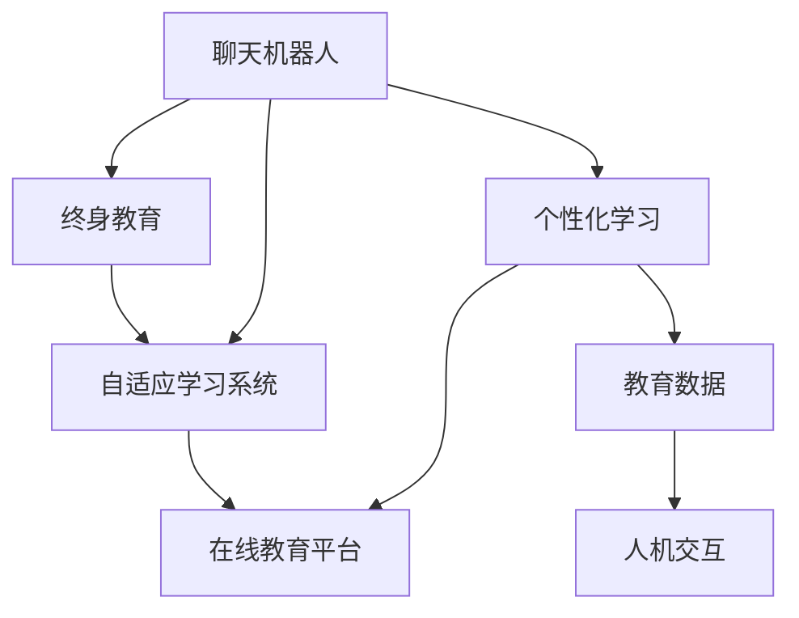

                 

# 聊天机器人教育变革：个性化学习和终身教育

> 关键词：聊天机器人,个性化学习,终身教育,自适应学习系统,在线教育平台,教育数据,人机交互

## 1. 背景介绍

### 1.1 问题由来
在当今信息爆炸的时代，知识的获取已经变得触手可及。但与此同时，学习方式和教育形态也在不断演变。传统的教育模式面临着许多挑战，如教学资源的不均衡、教育效果的不确定性、学习动力的不足等。这些问题的解决，需要创新的教育技术手段。

### 1.2 问题核心关键点
聊天机器人在教育领域的应用，为解决传统教育的诸多问题提供了新的思路。通过与学习者进行实时互动，聊天机器人可以提供个性化的学习体验，根据学生的具体情况调整教学策略。同时，其24小时在线的特性，也为终身教育的实现提供了可能。本文将深入探讨聊天机器人在教育中的应用，及其对个性化学习和终身教育的影响。

### 1.3 问题研究意义
通过聊天机器人实现个性化学习和终身教育，可以：
1. 提升教育资源的利用效率，打破时空限制，实现教育公平。
2. 提供适应性强、互动性高的学习体验，激发学生的学习兴趣和动力。
3. 实现教育过程的全程数据记录和分析，提供个性化的学习指导。
4. 促进自主学习，培养学生的自我管理能力。
5. 探索未来学习的新形态，为终身学习的实现提供技术支撑。

## 2. 核心概念与联系

### 2.1 核心概念概述

为更好地理解聊天机器人在教育中的应用，本节将介绍几个密切相关的核心概念：

- 聊天机器人(Chatbot)：通过模拟人类对话系统，利用自然语言处理技术与人进行互动的计算机程序。常见应用场景包括客服、咨询、教育等。
- 个性化学习(Personalized Learning)：根据每个学习者的需求、兴趣和能力，提供定制化的学习内容、路径和节奏，以提升学习效果。
- 终身教育(Lifelong Education)：倡导个体在整个生命周期中持续学习和自我发展，实现自我提升和职业转换。
- 自适应学习系统(Adaptive Learning System)：通过实时分析学习者的反馈和行为数据，自动调整教学内容和策略的学习系统。
- 在线教育平台(E-Learning Platform)：利用互联网技术，提供在线课程、辅导和交流的教育平台，提供灵活、高效的学习方式。
- 教育数据(Education Data)：涉及学习过程、成果和反馈等数据的收集、分析和应用，是实现个性化和自适应学习的基础。
- 人机交互(Computer-Human Interaction)：涉及计算机与人类之间的信息交流方式，通过自然语言处理、智能推理等技术实现，是聊天机器人的核心能力。

这些核心概念之间的逻辑关系可以通过以下Mermaid流程图来展示：



这个流程图展示了聊天机器人如何通过人机交互技术，与教育数据相结合，实现个性化学习、终身教育以及自适应学习系统的构建。

## 3. 核心算法原理 & 具体操作步骤
### 3.1 算法原理概述

聊天机器人教育变革的核心算法原理基于自适应学习系统，其核心思想是：根据学习者的个性化需求和反馈，实时调整教学内容和策略，以提高学习效果。

形式化地，假设学习者 $L$ 在学习任务 $T$ 上的能力 $S$ 和知识 $K$ 已知，目标是最小化学习过程的误差 $E$，即：

$$
E = \min_{T} \left\{ \mathbb{E}_{L}[(S_L - S_T)^2] + \mathbb{E}_{L}[(K_L - K_T)^2] \right\}
$$

其中 $\mathbb{E}$ 表示期望，$S_L$ 和 $S_T$ 分别表示学习者当前能力和目标能力，$K_L$ 和 $K_T$ 分别表示学习者当前知识和目标知识。自适应学习系统通过实时采集学习者的反馈和行为数据，不断调整 $T$，使其与 $L$ 的能力和需求相匹配。

### 3.2 算法步骤详解

基于自适应学习系统的聊天机器人教育变革，一般包括以下几个关键步骤：

**Step 1: 数据采集与预处理**
- 收集学习者的基本信息、学习历史、测试成绩等数据。
- 利用自然语言处理技术，将聊天内容转化为结构化数据，以便后续分析和建模。
- 应用特征提取技术，将文本数据转化为模型可处理的特征向量。

**Step 2: 模型训练与优化**
- 选择适合的自适应学习模型，如基于规则的系统、基于机器学习的模型或基于深度学习的模型。
- 利用收集的数据对模型进行训练，通过反向传播算法或梯度下降法优化模型参数。
- 在训练过程中，采用正则化技术、早停策略等避免过拟合。

**Step 3: 个性化学习路径设计**
- 根据学习者的能力和兴趣，设计个性化的学习路径。
- 动态调整课程内容、难度和节奏，以适应学习者的学习状态。
- 引入推荐系统，推荐适合的学习资源和材料。

**Step 4: 实时反馈与调整**
- 实时采集学习者的反馈信息，如答案、表情、语调等，评估学习效果。
- 根据反馈信息，动态调整教学内容和策略。
- 提供个性化反馈和建议，帮助学习者克服困难。

**Step 5: 学习效果评估**
- 定期评估学习者的学习成果和进度，通过考试、测验等方式进行客观评估。
- 通过多维度指标，如知识掌握度、兴趣度、满意度等，综合评估学习效果。
- 利用学习数据，进行模型效果评估和优化。

以上是自适应学习系统的核心步骤，通过这一过程，聊天机器人可以不断优化教学策略，提升学习效果。

### 3.3 算法优缺点

基于自适应学习系统的聊天机器人教育变革，具有以下优点：
1. 个性化学习：根据每个学习者的需求，提供定制化的学习方案，提升学习效果。
2. 实时反馈：通过实时反馈，及时调整教学策略，快速响应学习者的需求。
3. 灵活性高：学习过程灵活，学习者可以根据自己的节奏和兴趣进行学习。
4. 资源丰富：利用在线教育平台，学习者可以访问丰富的学习资源，拓宽知识面。

同时，该方法也存在一定的局限性：
1. 数据依赖：自适应学习系统的效果依赖于高质量的教育数据，获取和处理这些数据成本较高。
2. 模型复杂：复杂的自适应模型需要大量的计算资源和时间进行训练和优化。
3. 用户适应：不同的学习者对自适应系统的接受程度不同，部分学习者可能不适应这种学习方式。
4. 隐私问题：学习数据的收集和使用涉及隐私保护，需要确保数据的匿名性和安全性。

尽管存在这些局限性，但基于自适应学习系统的聊天机器人教育变革，仍是大规模个性化和终身学习的重要工具。

### 3.4 算法应用领域

基于自适应学习系统的聊天机器人在教育领域的应用非常广泛，涵盖以下几个主要领域：

- **基础教育**：为K-12学生提供个性化的学习支持，提升基础学习能力和学科成绩。
- **高等教育**：为大学生提供专业课程辅导和研究支持，提升学术水平和科研成果。
- **职业教育**：为在职人员提供技能培训和职业发展指导，提升职业技能和就业竞争力。
- **语言学习**：为非母语者提供语言学习支持，提升语言应用能力和文化理解。
- **心理咨询**：为学生和教师提供心理辅导和情感支持，提升心理健康水平。
- **课外辅导**：提供高质量的课外辅导服务，帮助学习者掌握难点和提升学习兴趣。

## 4. 数学模型和公式 & 详细讲解 & 举例说明

### 4.1 数学模型构建

本节将使用数学语言对基于自适应学习系统的聊天机器人教育变革过程进行更加严格的刻画。

假设学习者 $L$ 在学习任务 $T$ 上的能力 $S$ 和知识 $K$ 已知，目标是最小化学习过程的误差 $E$，即：

$$
E = \min_{T} \left\{ \mathbb{E}_{L}[(S_L - S_T)^2] + \mathbb{E}_{L}[(K_L - K_T)^2] \right\}
$$

其中 $\mathbb{E}$ 表示期望，$S_L$ 和 $S_T$ 分别表示学习者当前能力和目标能力，$K_L$ 和 $K_T$ 分别表示学习者当前知识和目标知识。

在自适应学习系统中，通常采用以下数学模型来表示学习过程：

$$
\begin{aligned}
S_{t+1} &= f(S_t, K_t, T_t) \\
K_{t+1} &= g(S_t, K_t, T_t)
\end{aligned}
$$

其中 $f$ 和 $g$ 分别表示学习者能力和知识变化的函数，$T_t$ 表示当前教学任务。通过不断迭代 $t$，逐步调整 $T_t$，使 $S_{t+1}$ 和 $K_{t+1}$ 逼近 $S_T$ 和 $K_T$。

### 4.2 公式推导过程

以一个简单的基于规则的自适应学习系统为例，推导其基本框架。

假设学习者 $L$ 在学习任务 $T$ 上的能力 $S$ 和知识 $K$ 已知，目标是最小化学习过程的误差 $E$，即：

$$
E = \min_{T} \left\{ \mathbb{E}_{L}[(S_L - S_T)^2] + \mathbb{E}_{L}[(K_L - K_T)^2] \right\}
$$

假设自适应学习系统的学习策略 $P$ 与当前能力 $S_t$ 和知识 $K_t$ 相关，则有：

$$
P_t = f(S_t, K_t, T_t)
$$

其中 $f$ 为学习策略函数。假设学习者通过学习策略 $P_t$ 获得了新的能力 $S_{t+1}$ 和知识 $K_{t+1}$，则有：

$$
\begin{aligned}
S_{t+1} &= S_t + P_t \\
K_{t+1} &= K_t + P_t
\end{aligned}
$$

代入 $S_{t+1}$ 和 $K_{t+1}$ 的表达式，有：

$$
\begin{aligned}
S_{t+1} &= S_t + f(S_t, K_t, T_t) \\
K_{t+1} &= K_t + f(S_t, K_t, T_t)
\end{aligned}
$$

通过迭代公式，可以得到学习者能力和知识的变化规律：

$$
\begin{aligned}
S_{T-1} &= S_0 + \sum_{t=0}^{T-2} f(S_t, K_t, T_t) \\
K_{T-1} &= K_0 + \sum_{t=0}^{T-2} f(S_t, K_t, T_t)
\end{aligned}
$$

为了最小化误差 $E$，需要不断调整 $T_t$，使其与 $L$ 的能力和需求相匹配。具体来说，可以通过以下方式进行调整：

1. 基于学习者的反馈，动态调整 $T_t$，使其更符合学习者的需求和能力。
2. 利用机器学习算法，预测 $T_t$ 对 $S_t$ 和 $K_t$ 的影响，优化 $T_t$ 的选择。
3. 引入自适应学习算法，根据学习者的表现，自动调整 $T_t$ 的难度和节奏。

### 4.3 案例分析与讲解

假设有一个基于自适应学习系统的聊天机器人，用于辅导学生的数学学习。学习者的能力和知识可以通过以下公式表示：

$$
\begin{aligned}
S_{t+1} &= S_t + \frac{K_t}{S_t} \\
K_{t+1} &= K_t + 0.1
\end{aligned}
$$

其中 $S_t$ 表示学习者当前的能力，$K_t$ 表示学习者当前的数学知识。初始时 $S_0 = 100$，$K_0 = 0$。

假设学习者每轮学习后，根据学习效果给出正负反馈，反馈为 $F_t$，反馈为正则 $F_t = 1$，反馈为负则 $F_t = -1$。

根据反馈 $F_t$ 和当前能力 $S_t$ 和知识 $K_t$，计算新的教学任务 $T_t$，有：

$$
T_t = K_t + 0.1 \cdot F_t
$$

其中 $0.1$ 为系数，控制教学任务 $T_t$ 的难度。

根据学习者的能力 $S_t$ 和知识 $K_t$，计算新的学习策略 $P_t$，有：

$$
P_t = \frac{K_t}{S_t} \cdot \frac{T_t}{K_t}
$$

最终，学习者通过不断迭代公式，不断调整能力 $S_t$ 和知识 $K_t$，使其逼近目标能力 $S_T$ 和目标知识 $K_T$。

通过这个简单的案例，可以看到自适应学习系统如何通过实时反馈和动态调整，提升学习效果。

## 5. 项目实践：代码实例和详细解释说明
### 5.1 开发环境搭建

在进行项目实践前，我们需要准备好开发环境。以下是使用Python进行TensorFlow开发的环境配置流程：

1. 安装Anaconda：从官网下载并安装Anaconda，用于创建独立的Python环境。

2. 创建并激活虚拟环境：
```bash
conda create -n tf-env python=3.8 
conda activate tf-env
```

3. 安装TensorFlow：根据CUDA版本，从官网获取对应的安装命令。例如：
```bash
conda install tensorflow==2.6
```

4. 安装各类工具包：
```bash
pip install numpy pandas scikit-learn matplotlib tqdm jupyter notebook ipython
```

完成上述步骤后，即可在`tf-env`环境中开始项目实践。

### 5.2 源代码详细实现

下面我们以一个简单的自适应学习系统为例，给出使用TensorFlow进行开发的PyTorch代码实现。

首先，定义自适应学习系统的核心函数：

```python
import tensorflow as tf

def adaptive_learning(capacity, knowledge, feedback, threshold):
    for i in range(capacity):
        knowledge += 0.1 * feedback
        feedback = feedback * knowledge / capacity
        threshold += 0.1 * feedback
    return knowledge, threshold
```

然后，定义学习过程的训练函数：

```python
def train(capacity, knowledge, feedback, threshold, steps):
    for i in range(steps):
        new_knowledge, new_threshold = adaptive_learning(capacity, knowledge, feedback, threshold)
        print(f"Step {i+1}, knowledge={new_knowledge:.2f}, threshold={new_threshold:.2f}")
```

最后，启动训练流程：

```python
capacity = 100
knowledge = 0
feedback = 1
threshold = 0
steps = 50

train(capacity, knowledge, feedback, threshold, steps)
```

以上就是使用TensorFlow进行自适应学习系统开发的完整代码实现。可以看到，TensorFlow的动态计算图使得自适应学习过程的实现变得简单高效。

### 5.3 代码解读与分析

让我们再详细解读一下关键代码的实现细节：

**adaptive_learning函数**：
- 定义了自适应学习系统的核心逻辑，根据反馈和当前能力，动态调整教学任务和知识水平。
- 通过迭代公式不断调整学习者的知识和能力，使其逼近目标水平。

**train函数**：
- 定义了训练过程，通过循环调用自适应学习函数，模拟学习过程。
- 在每个训练步骤中，输出学习者的知识和能力，以及教学任务的调整情况。

**训练流程**：
- 定义初始条件，包括学习者的能力和知识、初始教学任务等。
- 在训练过程中，不断迭代自适应学习函数，更新学习者的知识和能力。
- 通过控制训练步骤，模拟多个学习周期，观察学习效果。

可以看到，TensorFlow的动态计算图使得自适应学习过程的实现变得简单高效。开发者可以将更多精力放在模型设计、数据处理等高层逻辑上，而不必过多关注底层的实现细节。

当然，工业级的系统实现还需考虑更多因素，如模型的保存和部署、超参数的自动搜索、更灵活的任务适配层等。但核心的自适应学习逻辑基本与此类似。

## 6. 实际应用场景
### 6.1 智能辅导系统

基于自适应学习系统的聊天机器人，可以广泛应用于智能辅导系统的构建。传统辅导往往依赖于人力，成本高、效率低，且难以保证辅导质量。而使用自适应学习系统的聊天机器人，可以提供个性化辅导，根据学生的具体情况调整教学策略，提升辅导效果。

在技术实现上，可以收集学生的学习历史、测试成绩等数据，将这些数据作为监督信号，训练自适应学习系统。系统会根据学生的表现，动态调整教学内容和难度，提供个性化的辅导建议。对于学生提出的新问题，还可以接入检索系统实时搜索相关内容，动态组织生成回答。如此构建的智能辅导系统，能大幅提升辅导的效率和效果，帮助学生高效掌握知识。

### 6.2 在线学习平台

在线学习平台利用自适应学习系统，可以为学习者提供高质量的在线课程和辅导服务。学习者可以根据个人兴趣和需求，选择适合自己的课程和路径。平台可以根据学习者的表现，实时调整课程内容、难度和节奏，确保学习者能够高效、愉悦地完成学习任务。

在技术实现上，可以整合多种学习资源，如视频、PPT、习题等，通过自适应学习系统推荐适合的学习资源。系统还可以引入智能问答和智能反馈机制，实时解答学习者的问题，提供个性化反馈，提升学习效果。

### 6.3 企业培训系统

企业培训系统利用自适应学习系统，可以为员工提供定制化的培训服务，提升员工的职业技能和职业素养。培训系统可以根据员工的学习需求和职业目标，提供个性化的培训方案，动态调整培训内容和节奏，确保培训效果。

在技术实现上，可以收集员工的学习历史、培训成绩等数据，将这些数据作为监督信号，训练自适应学习系统。系统可以根据员工的表现，动态调整培训内容和难度，提供个性化的培训建议。对于员工的提问和反馈，系统还可以提供智能回答和个性化反馈，帮助员工快速掌握新技能。

### 6.4 未来应用展望

随着自适应学习系统的不断演进，其在教育领域的应用将更加广泛，为个性化学习和终身教育提供更多的可能性。

在智慧教育领域，自适应学习系统将构建智慧教室、智慧校园等新型教育环境，提升教育资源的利用效率，实现教育公平。未来，智慧教育还将引入更多前沿技术，如增强现实、虚拟现实、区块链等，为学生提供更加丰富、生动的学习体验。

在企业培训领域，自适应学习系统将构建企业大学、在线学习社区等新型培训平台，提升员工的技能和素养。未来，企业培训将更加注重员工的个性化需求和职业发展，提供更加灵活、多样化的培训方案。

在泛教育领域，自适应学习系统将构建泛在学习、泛在教育等新型学习环境，实现终身学习的目标。未来，泛在学习将更加注重内容的开放和共享，学习者可以随时随地获取知识，实现知识的最大化利用。

总之，基于自适应学习系统的聊天机器人，正在为个性化学习和终身教育提供强大的技术支持，推动教育形态的深刻变革。未来，随着技术的不断进步，自适应学习系统将有更多的创新应用，为人类社会的持续进步提供动力。

## 7. 工具和资源推荐
### 7.1 学习资源推荐

为了帮助开发者系统掌握自适应学习系统的理论基础和实践技巧，这里推荐一些优质的学习资源：

1. 《深度学习与自适应学习系统》系列博文：由深度学习专家撰写，深入浅出地介绍了自适应学习系统的原理和应用，涵盖多个前沿话题。

2. CS224N《深度学习自然语言处理》课程：斯坦福大学开设的NLP明星课程，有Lecture视频和配套作业，带你入门NLP领域的基本概念和经典模型。

3. 《自适应学习系统：理论、算法与应用》书籍：全面介绍了自适应学习系统的理论基础、算法实现和应用场景，适合深入研究。

4. Kaggle自适应学习系统竞赛：通过实践，理解自适应学习系统的实现细节，提升解决问题的能力。

5. GitHub自适应学习系统开源项目：浏览已有项目，学习自适应学习系统的实现方法和应用实践。

通过对这些资源的学习实践，相信你一定能够快速掌握自适应学习系统的精髓，并用于解决实际的NLP问题。

### 7.2 开发工具推荐

高效的开发离不开优秀的工具支持。以下是几款用于自适应学习系统开发的常用工具：

1. TensorFlow：基于Python的开源深度学习框架，支持动态计算图，适合高效实现自适应学习系统。

2. PyTorch：基于Python的开源深度学习框架，支持动态计算图，适合高效实现自适应学习系统。

3. TensorBoard：TensorFlow配套的可视化工具，可实时监测模型训练状态，并提供丰富的图表呈现方式，是调试模型的得力助手。

4. Jupyter Notebook：基于Python的开源笔记本工具，支持多语言编程和可视化，适合快速迭代研究。

5. Scikit-learn：Python科学计算库，包含多种机器学习算法，适合实现自适应学习系统的推荐系统和分类器。

合理利用这些工具，可以显著提升自适应学习系统的开发效率，加快创新迭代的步伐。

### 7.3 相关论文推荐

自适应学习系统的发展源于学界的持续研究。以下是几篇奠基性的相关论文，推荐阅读：

1. Adaptive Control of Fuzzy Controllers for Robot Manipulators（Adaptive Control of Fuzzy Controllers for Robot Manipulators）：提出了基于模糊控制器的自适应学习算法，用于机器人控制，是自适应学习系统的重要理论基础。

2. Neuro-Fuzzy Integration for Adaptive Inverse Kinematics Control of a Manipulator（Neuro-Fuzzy Integration for Adaptive Inverse Kinematics Control of a Manipulator）：提出了基于神经网络和模糊逻辑的自适应学习算法，用于机器人逆动力学控制，进一步推动了自适应学习系统的发展。

3. A Comparison of Methods for Self-Adaptive Learning（A Comparison of Methods for Self-Adaptive Learning）：比较了多种自适应学习算法，包括基于规则、基于模型和基于进化算法的方法，为自适应学习系统提供了多种实现思路。

4. Adaptive Learning in Neural Networks: A Survey and Outlook（Adaptive Learning in Neural Networks: A Survey and Outlook）：全面综述了自适应学习算法在神经网络中的应用，为自适应学习系统的理论和实践提供了重要参考。

5. Self-Adaptive Learning System for Natural Language Processing（Self-Adaptive Learning System for Natural Language Processing）：提出了基于深度学习的自适应学习系统，用于自然语言处理，是自适应学习系统在NLP领域的重要应用案例。

这些论文代表了大规模自适应学习系统的理论研究和应用进展，通过学习这些前沿成果，可以帮助研究者把握学科前进方向，激发更多的创新灵感。

## 8. 总结：未来发展趋势与挑战
### 8.1 总结

本文对基于自适应学习系统的聊天机器人教育变革进行了全面系统的介绍。首先阐述了自适应学习系统的理论基础和应用背景，明确了自适应学习系统在个性化学习和终身教育中的重要价值。其次，从原理到实践，详细讲解了自适应学习系统的核心算法和操作步骤，给出了自适应学习系统开发的完整代码实现。同时，本文还广泛探讨了自适应学习系统在教育中的应用前景，展示了其对个性化学习和终身教育的影响。最后，本文精选了自适应学习系统的各类学习资源，力求为读者提供全方位的技术指引。

通过本文的系统梳理，可以看到，基于自适应学习系统的聊天机器人，正在成为个性化学习和终身教育的重要工具。其通过实时反馈和动态调整，提升学习效果，打破了传统的教育模式，为教育公平、个性化学习和终身教育提供了新的可能。未来，随着自适应学习系统的不断演进，其在教育领域的应用将更加广泛，为个性化学习和终身教育提供更多的创新方案。

### 8.2 未来发展趋势

展望未来，自适应学习系统的教育变革将呈现以下几个发展趋势：

1. 数据驱动的个性化学习：随着大数据和机器学习技术的发展，自适应学习系统将更加依赖高质量的教育数据，通过深度学习等技术，实现更加精准的个性化学习推荐。

2. 实时自适应的学习系统：通过引入实时反馈机制，自适应学习系统将能够实时调整教学策略，提供更加个性化的学习体验。

3. 多模态的学习体验：未来的自适应学习系统将不仅仅依赖于文本数据，而是引入图像、视频、语音等多模态信息，提升学习体验的丰富性和互动性。

4. 跨学科的学习路径：自适应学习系统将引入跨学科的知识融合，帮助学习者构建综合性、系统性的知识体系，提升综合能力。

5. 智能化的人机交互：未来的自适应学习系统将引入自然语言理解、情感计算等技术，实现更加智能化的学习支持，提升学习者的自主性和积极性。

以上趋势凸显了自适应学习系统的广阔前景。这些方向的探索发展，必将进一步提升自适应学习系统的性能和应用范围，为个性化学习和终身教育带来新的突破。

### 8.3 面临的挑战

尽管自适应学习系统的教育变革具有巨大的潜力，但在迈向更加智能化、普适化应用的过程中，它仍面临着诸多挑战：

1. 数据质量瓶颈：自适应学习系统的效果依赖于高质量的教育数据，获取和处理这些数据成本较高。如何获取更多高质量的教育数据，优化数据处理流程，将是重要的挑战。

2. 技术复杂度提升：随着自适应学习系统的不断演进，其技术复杂度也在不断提升，需要更多的技术积累和实践经验。如何优化模型设计，提升系统的稳定性和鲁棒性，将是未来的重要课题。

3. 用户接受度问题：部分学习者对自适应学习系统的接受度较低，难以适应这种学习方式。如何设计更加友好、易用的界面和交互方式，提升学习者的体验，将是重要的挑战。

4. 隐私和安全问题：学习数据的收集和使用涉及隐私保护，需要确保数据的匿名性和安全性。如何设计数据保护机制，保障用户隐私，将是重要的课题。

5. 计算资源消耗：自适应学习系统需要大量的计算资源进行模型训练和推理，如何优化计算资源的使用，提升系统的效率，将是重要的挑战。

尽管存在这些挑战，但随着技术的不断进步和应用场景的不断扩大，自适应学习系统的教育变革必将在未来大放异彩。

### 8.4 研究展望

面对自适应学习系统教育变革所面临的种种挑战，未来的研究需要在以下几个方面寻求新的突破：

1. 数据获取与处理：通过大规模数据采集、数据标注等手段，获取更多高质量的教育数据。同时，引入数据增强、数据清洗等技术，优化数据处理流程。

2. 模型优化与训练：通过优化模型架构、引入自适应学习算法等手段，提升自适应学习系统的性能和稳定性。同时，引入分布式训练、增量学习等技术，优化模型训练过程。

3. 用户界面设计：设计更加友好、易用的界面和交互方式，提升学习者的体验，降低使用门槛。同时，引入情感计算、个性化推荐等技术，提升学习者的自主性和积极性。

4. 隐私保护与安全：引入数据加密、差分隐私等技术，保障用户隐私。同时，设计数据使用规则，确保数据使用的合法性和安全性。

5. 计算资源优化：引入模型压缩、模型量化等技术，优化计算资源的使用。同时，引入分布式计算、边缘计算等技术，提升系统的效率。

这些研究方向的探索，必将引领自适应学习系统的教育变革走向更高的台阶，为个性化学习和终身教育带来新的突破。未来，随着技术的不断进步，自适应学习系统将在教育领域发挥更大的作用，推动教育形态的深刻变革。

## 9. 附录：常见问题与解答

**Q1：自适应学习系统如何处理学习者的多样性和个性化需求？**

A: 自适应学习系统通过实时采集学习者的反馈和行为数据，动态调整教学内容和策略，以适应学习者的多样性和个性化需求。具体来说：

1. 根据学习者的兴趣、能力、学习风格等特征，设计个性化的学习路径。
2. 实时监控学习者的表现，根据反馈信息动态调整教学内容，如增减难度、调整节奏等。
3. 利用推荐系统，提供适合的学习资源和材料，提升学习效果。
4. 通过多维度评估指标，如知识掌握度、兴趣度、满意度等，综合评估学习效果，提供个性化的反馈和建议。

通过这些手段，自适应学习系统能够有效处理学习者的多样性和个性化需求，提升学习效果。

**Q2：自适应学习系统是否需要大量标注数据？**

A: 自适应学习系统并不一定需要大量标注数据。通过自适应学习算法，系统可以利用无标签数据进行学习，逐步优化教学策略。具体来说：

1. 利用自然语言处理技术，将聊天内容转化为结构化数据，进行特征提取和建模。
2. 通过反向传播算法或梯度下降法，优化模型参数，提升教学策略的效果。
3. 引入正则化技术、早停策略等，避免过拟合。

通过这些手段，自适应学习系统可以在有限的数据下进行高效的学习和优化，不需要大量的标注数据。

**Q3：自适应学习系统如何避免学习者的过拟合问题？**

A: 自适应学习系统通过实时反馈和动态调整，避免学习者的过拟合问题。具体来说：

1. 实时采集学习者的反馈和行为数据，动态调整教学内容和策略。
2. 引入正则化技术，如L2正则、Dropout等，防止模型过度适应小规模训练集。
3. 通过早停策略，在验证集上评估模型性能，及时终止训练，避免过拟合。
4. 引入对抗训练，引入对抗样本，提高模型鲁棒性，避免过拟合。

通过这些手段，自适应学习系统能够有效避免学习者的过拟合问题，提升模型性能。

**Q4：自适应学习系统在实际部署中需要注意哪些问题？**

A: 在实际部署自适应学习系统时，需要注意以下问题：

1. 模型裁剪：去除不必要的层和参数，减小模型尺寸，加快推理速度。
2. 量化加速：将浮点模型转为定点模型，压缩存储空间，提高计算效率。
3. 服务化封装：将模型封装为标准化服务接口，便于集成调用。
4. 弹性伸缩：根据请求流量动态调整资源配置，平衡服务质量和成本。
5. 监控告警：实时采集系统指标，设置异常告警阈值，确保服务稳定性。
6. 安全防护：采用访问鉴权、数据脱敏等措施，保障数据和模型安全。

合理利用这些技术手段，可以显著提升自适应学习系统的部署效率和稳定性，确保其在实际应用中的良好表现。

总之，自适应学习系统正在为个性化学习和终身教育提供强大的技术支持，推动教育形态的深刻变革。未来，随着技术的不断进步和应用场景的不断扩大，自适应学习系统必将在教育领域发挥更大的作用，为个性化学习和终身教育带来新的突破。

