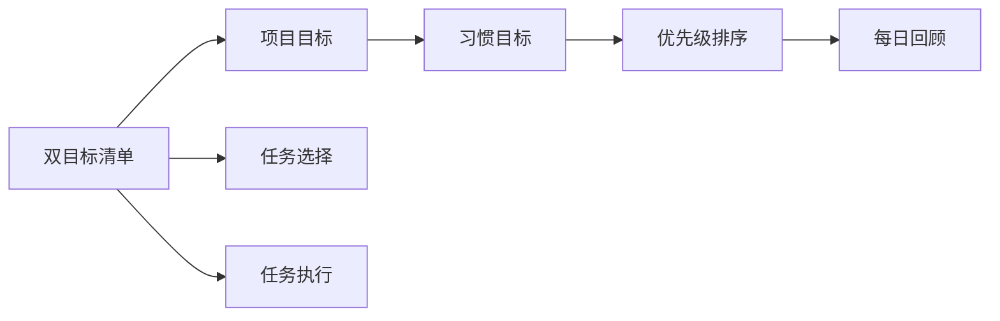

                 

# 聚焦要事:双目标清单的正确用法

## 1. 背景介绍

### 1.1 问题由来
在当今快速变化和复杂多样的工作环境中，高效的时间管理变得尤为重要。在处理日益增长的任务和信息流时，许多人都发现自己难以保持专注，频繁地切换任务，导致工作效率低下。为了解决这个问题，双目标清单（Dual-Target Checklist）应运而生，旨在帮助个人和企业将复杂任务拆解为可管理的子任务，并通过同时关注两个目标来提高效率和专注度。

### 1.2 问题核心关键点
双目标清单的核心在于其同时关注两个相互关联的目标：项目目标（Project Goals）和习惯目标（Habit Goals）。通过这种方式，个体不仅专注于当前的任务，还持续培养有益的习惯，从而实现长期目标和短期任务的平衡。

### 1.3 问题研究意义
研究双目标清单的正确用法，对提升个人和企业的时间管理效率、促进员工健康和幸福感具有重要意义。它不仅能提高工作效率，还能帮助个体建立持续改进和自我发展的正向循环。

## 2. 核心概念与联系

### 2.1 核心概念概述
双目标清单（Dual-Target Checklist）是一种时间管理工具，旨在通过同时关注项目目标和习惯目标，帮助个体和企业提升工作效率，实现短期和长期目标的平衡。

#### 2.1.1 项目目标（Project Goals）
项目目标是具体、可衡量、可实现的短期任务，通常与当前的工作任务或项目紧密相关。这些目标通常是任务的直接结果，例如完成报告、开发新功能等。

#### 2.1.2 习惯目标（Habit Goals）
习惯目标旨在培养长期的习惯，如每日阅读、定期锻炼等。这些目标关注于日常行为的持续改进，有助于建立稳定、健康的生活习惯。

#### 2.1.3 双目标清单的组成
双目标清单包括两个并列的清单，一个用于项目目标，一个用于习惯目标。通过同时在两个清单上标记任务，个体可以平衡当前任务和长期习惯的培养。

### 2.2 核心概念原理和架构的 Mermaid 流程图



### 2.3 核心概念的联系
双目标清单通过同时关注项目目标和习惯目标，构建了一个动态平衡的系统。项目目标提供了即时的反馈和成就感，而习惯目标则确保了个人在追求短期目标的同时，不忽视长期的发展和改进。

## 3. 核心算法原理 & 具体操作步骤
### 3.1 算法原理概述
双目标清单的原理基于心理学中的行为经济学和习惯形成理论，通过同时关注短期任务和长期习惯，利用人类的多任务处理能力和行为习惯的可塑性，提升工作效率和生活质量。

### 3.2 算法步骤详解
1. **创建双目标清单**：首先，创建一个包含项目目标和习惯目标的清单，分别记录每日需要完成的任务和需要养成的习惯。
2. **设置优先级**：为每个目标设定优先级，确定哪些任务和习惯需要优先完成。
3. **每日任务选择**：每天早上，从项目目标和习惯目标中各选择一个任务，并按照优先级顺序完成。
4. **任务执行和回顾**：在一天结束时，回顾当天的任务完成情况，并对未完成的任务进行复盘分析，以改进未来的任务选择和执行。
5. **习惯培养**：定期检查习惯目标的进展，确保习惯的持续培养和改进。

### 3.3 算法优缺点
#### 3.3.1 优点
- **提升效率**：通过同时关注项目目标和习惯目标，个体可以更有效地利用时间，提升工作效率。
- **平衡发展**：确保在追求短期任务的同时，不忽视长期习惯的培养，实现全面发展。
- **增强动力**：即时的项目目标反馈和持续的习惯目标培养，能够增强个体的成就感和动力。

#### 3.3.2 缺点
- **复杂性**：对于习惯养成的新手，双目标清单可能需要一段时间来适应和优化。
- **任务冲突**：在资源有限的情况下，项目目标和习惯目标可能存在冲突，需要灵活调整优先级。

### 3.4 算法应用领域
双目标清单适用于各种工作和生活场景，包括项目管理、个人健康管理、职业发展等。它不仅适用于个人，也适用于企业，帮助团队和个人在繁忙的工作环境中保持高效和平衡。

## 4. 数学模型和公式 & 详细讲解 & 举例说明
### 4.1 数学模型构建
设 $G$ 为项目目标的集合，$H$ 为习惯目标的集合。每个目标 $g \in G$ 和 $h \in H$ 都具有一个权重 $w_g$ 和 $w_h$，分别表示其在清单中的重要性。每个目标 $g$ 和 $h$ 都有一个完成度 $c_g$ 和 $c_h$，表示其在当天的完成情况。

目标完成度 $c_g$ 和 $c_h$ 计算公式如下：
$$
c_g = \frac{\text{完成的任务数}}{\text{总任务数}}
$$
$$
c_h = \frac{\text{连续完成的天数}}{\text{设定的连续天数}}
$$

### 4.2 公式推导过程
通过上述定义，我们可以构建一个目标完成度的计算模型。设 $t$ 为一天的时间，$T$ 为一天的工作时长，$P$ 为一天可以处理的项目目标数量，$H$ 为一天可以养成的习惯目标数量。则项目目标和习惯目标的完成度计算公式如下：
$$
c_g = \frac{t \cdot P}{T}
$$
$$
c_h = \frac{t \cdot H}{T}
$$

### 4.3 案例分析与讲解
假设一天的工作时间为8小时，能够处理的项目目标数量为5个，需要养成的习惯目标数量为3个。那么，项目目标的完成度为：
$$
c_g = \frac{8 \cdot 5}{8} = 5
$$
习惯目标的完成度为：
$$
c_h = \frac{8 \cdot 3}{8} = 3
$$

## 5. 项目实践：代码实例和详细解释说明
### 5.1 开发环境搭建
为了实现双目标清单的自动化管理，可以使用Python编程语言，结合Google Calendar等工具，开发一个简单的项目和习惯管理应用。

### 5.2 源代码详细实现

以下是一个基本的Python代码示例，用于创建和更新双目标清单：

```python
import calendar
from datetime import datetime, timedelta

class DualTargetChecklist:
    def __init__(self):
        self.project_goals = []
        self.habit_goals = []
        self.task_count = 0
        self.habit_count = 0

    def add_project_goal(self, goal, priority=1):
        self.project_goals.append((goal, priority))
        self.task_count += 1

    def add_habit_goal(self, goal, priority=1):
        self.habit_goals.append((goal, priority))
        self.habit_count += 1

    def get_project_goals(self):
        return self.project_goals

    def get_habit_goals(self):
        return self.habit_goals

    def update_project_goals(self, goal, status):
        for g in self.project_goals:
            if g[0] == goal:
                g[1] = status
                return

    def update_habit_goals(self, goal, status):
        for g in self.habit_goals:
            if g[0] == goal:
                g[1] = status
                return

    def get_daily_goals(self, today):
        project_goals = []
        habit_goals = []
        for g in self.project_goals:
            if g[1] == 1:
                project_goals.append(g[0])
        for g in self.habit_goals:
            if g[1] == 1:
                habit_goals.append(g[0])
        return project_goals, habit_goals

# 创建一个双目标清单对象
checklist = DualTargetChecklist()

# 添加项目目标和习惯目标
checklist.add_project_goal('完成报告', 1)
checklist.add_habit_goal('阅读30分钟', 2)
checklist.add_project_goal('开发新功能', 1)
checklist.add_habit_goal('每日锻炼', 2)

# 获取今天需要完成的项目目标和习惯目标
today = datetime.today()
project_goals, habit_goals = checklist.get_daily_goals(today)

# 输出今天的项目目标和习惯目标
print('Project Goals:', project_goals)
print('Habit Goals:', habit_goals)
```

### 5.3 代码解读与分析
上述代码实现了一个简单的双目标清单类 `DualTargetChecklist`，包括添加目标、更新目标状态、获取每日目标等方法。通过调用这些方法，个体可以在每天开始前确定需要完成的项目目标和习惯目标，并在一天结束时更新目标完成度。

## 6. 实际应用场景
### 6.1 项目管理
在项目管理中，双目标清单可以帮助团队成员在项目进度和日常工作之间保持平衡。通过同时关注项目目标和习惯目标，团队成员可以在紧张的项目期内保持高效，同时维护良好的工作习惯。

### 6.2 个人健康管理
在个人健康管理中，双目标清单有助于个体建立和维护健康的生活习惯。例如，通过在清单中设置每日锻炼、健康饮食等习惯目标，个体可以逐步建立健康的生活方式，同时不影响日常工作和学业。

### 6.3 职业发展
在职业发展中，双目标清单可以帮助个体在提升技能和积累经验的同时，培养有益的工作习惯。例如，通过在清单中设置每日学习新技能、参加行业会议等习惯目标，个体可以不断提升自己的职业竞争力，同时养成持续学习的习惯。

### 6.4 未来应用展望
随着技术的发展，双目标清单的应用场景将进一步拓展。例如，结合人工智能和机器学习技术，可以通过分析个体的工作习惯和任务完成情况，动态调整目标优先级和任务分配，从而实现更加个性化的管理。

## 7. 工具和资源推荐
### 7.1 学习资源推荐
1. **《高效能人士的七个习惯》**：史蒂芬·柯维的经典著作，深入浅出地介绍了习惯培养和目标管理的核心理念。
2. **《时间管理之道》**：大卫·艾伦的时间管理方法论，详细介绍了时间管理的各个方面，包括双目标清单的应用。
3. **Coursera《高效能习惯》**：由犹他大学开设的在线课程，帮助个体培养高效能的习惯。

### 7.2 开发工具推荐
1. **Google Calendar**：强大的日历工具，支持多任务管理和时间同步，是双目标清单管理的利器。
2. **Todoist**：优秀的任务管理工具，支持习惯追踪和项目目标管理，适合个人和企业使用。
3. **Trello**：灵活的项目管理工具，可以通过看板的方式直观地展示项目目标和习惯目标的进展。

### 7.3 相关论文推荐
1. **《目标与习惯：实现自我控制和改善生活》**：詹姆斯·克莱尔的心理学研究，探讨了目标和习惯在提升个人幸福感和生活质量方面的作用。
2. **《行为经济学中的时间管理：理论、模型和应用》**：莫顿·施瓦茨等人的行为经济学研究，提供了时间管理和习惯形成的理论基础。

## 8. 总结：未来发展趋势与挑战
### 8.1 总结
本文详细介绍了双目标清单的正确用法，从背景、核心概念、算法原理到具体操作步骤，全面展示了其在工作、健康和职业发展中的应用。双目标清单通过同时关注项目目标和习惯目标，帮助个体和企业提升效率，实现短期任务和长期发展的平衡。

### 8.2 未来发展趋势
随着技术的发展，双目标清单的应用将进一步拓展。例如，结合人工智能和机器学习技术，可以更加智能地调整目标优先级和任务分配，实现更加个性化的管理。

### 8.3 面临的挑战
尽管双目标清单具有诸多优点，但在实际应用中也面临一些挑战：
1. **适应性**：对于习惯了传统时间管理方式的人来说，可能需要一段时间来适应双目标清单。
2. **灵活性**：在复杂多变的工作环境中，如何灵活调整目标优先级，仍是一个需要进一步优化的课题。
3. **数据隐私**：在收集和分析个体习惯数据时，如何保护数据隐私和安全，是一个需要谨慎处理的问题。

### 8.4 研究展望
未来的研究将集中在以下几个方面：
1. **个性化优化**：开发更加智能的双目标清单管理系统，根据个体的行为数据动态调整目标和优先级。
2. **多渠道整合**：整合不同时间管理工具和习惯追踪工具，实现更加全面的时间管理。
3. **数据隐私保护**：研究如何在保护数据隐私的前提下，收集和分析习惯数据，实现更加个性化的管理。

## 9. 附录：常见问题与解答

**Q1: 双目标清单与传统时间管理工具有何区别？**

A: 双目标清单通过同时关注项目目标和习惯目标，帮助个体和企业提升效率，实现短期任务和长期发展的平衡。与传统的时间管理工具相比，双目标清单更加注重习惯的培养和行为的持续改进，从而实现更全面、更深远的发展。

**Q2: 如何确定项目目标和习惯目标的优先级？**

A: 项目目标和习惯目标的优先级可以根据其对当前任务和长期发展的重要性进行评估。通常，优先级较高的目标需要优先完成。在实际应用中，可以根据个体的实际情况和任务紧急程度，灵活调整优先级。

**Q3: 双目标清单是否适用于所有类型的任务？**

A: 双目标清单适用于大多数类型的任务，特别是那些具有明确短期目标和长期目标的任务。对于一些需要高度专注和深度工作的任务，如写作、研究等，建议采用更加专注的时间管理方法。

**Q4: 如何在一天内同时完成项目目标和习惯目标？**

A: 可以通过合理规划和优化时间管理，确保一天内有足够的时间来完成项目目标和习惯目标。例如，将高优先级的项目目标安排在精力最充沛的时间段完成，而将习惯目标安排在一天的末尾。

**Q5: 双目标清单是否适用于团队管理？**

A: 双目标清单不仅适用于个人，也适用于团队管理。通过将团队的目标和习惯目标纳入双目标清单，团队成员可以更好地协同工作，提升团队效率和凝聚力。

---

作者：禅与计算机程序设计艺术 / Zen and the Art of Computer Programming

