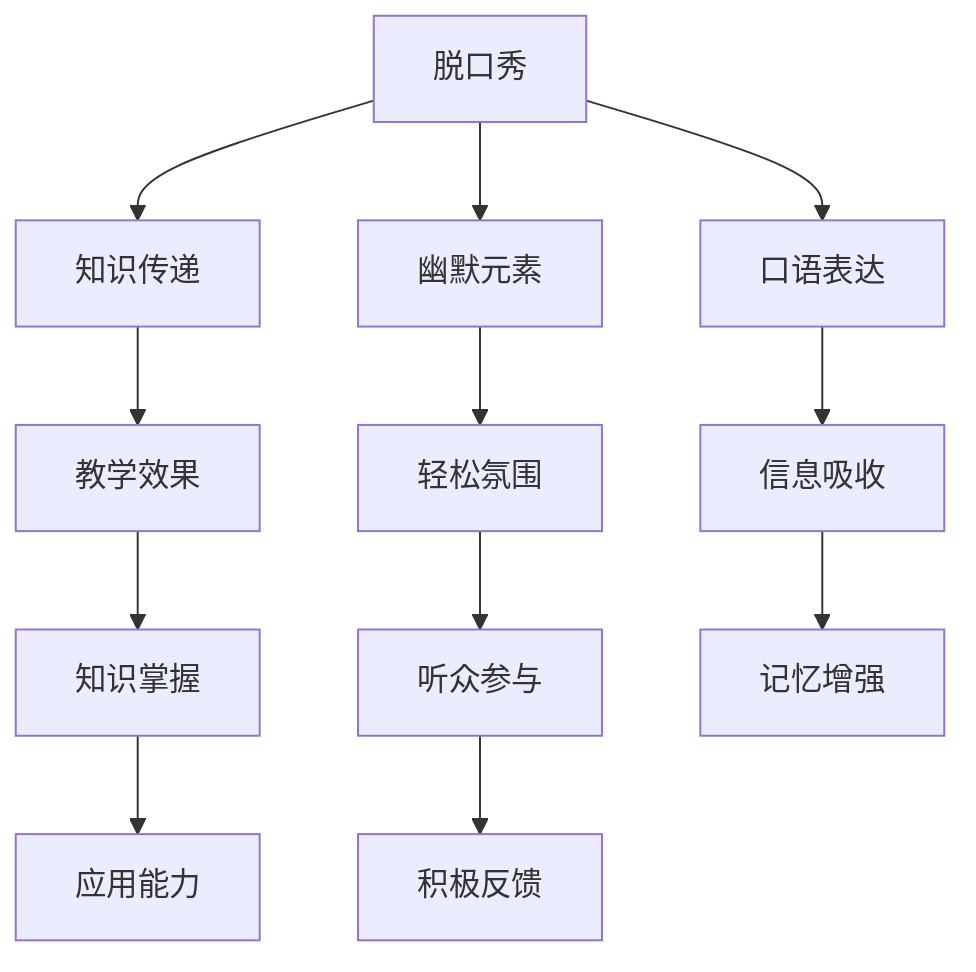

                 

# 脱口秀实现知识的娱乐化传播

## 1. 背景介绍

在当今快节奏的生活中，如何有效地传递和吸收知识成为了一个重要的课题。传统的说教方式往往枯燥乏味，难以吸引观众的注意力，而脱口秀作为一种深受欢迎的娱乐形式，却有着独特的优势。本文将探讨如何利用脱口秀的形式实现知识的娱乐化传播。

## 2. 核心概念与联系

### 2.1 核心概念概述

脱口秀，作为一种结合口语、幽默和对话的表演形式，其核心在于通过轻松愉快的方式传递信息。在教育领域，知识的娱乐化传播不仅可以增强观众的参与感，还能在潜移默化中传递知识，从而达到良好的教育效果。

### 2.2 核心概念原理和架构的 Mermaid 流程图



此图展示了脱口秀与知识传递之间的联系。脱口秀通过幽默元素和口语表达，创造轻松的氛围，进而促进信息吸收和记忆增强，最终达到知识掌握和应用能力的提升，以及听众的积极反馈。

## 3. 核心算法原理 & 具体操作步骤

### 3.1 算法原理概述

脱口秀实现知识娱乐化传播的算法原理主要基于两个方面：

1. **幽默元素的引入**：幽默是脱口秀的核心，通过幽默的方式，可以减轻观众的心理负担，使其更愿意接受和记忆知识。
2. **口语表达的灵活性**：口语表达的灵活性使得知识传递更加生动形象，易于理解和记忆。

### 3.2 算法步骤详解

1. **内容策划**：确定知识传递的主题和目标，设计出幽默且符合主题的脚本。
2. **角色分配**：根据主题选择合适的表演者和角色，确保角色性格与知识传递相符。
3. **表演排练**：排练表演内容，确保幽默元素和口语表达能够自然流畅地传递知识。
4. **现场表演**：在观众面前进行表演，通过幽默和口语表达传递知识。
5. **反馈收集**：收集观众的反馈，调整和优化表演内容。

### 3.3 算法优缺点

#### 优点：

- **提升观众参与感**：幽默和口语表达使得知识传递更加生动有趣，观众更容易参与。
- **降低心理负担**：幽默元素使得学习过程更加轻松，减轻了观众的心理负担。
- **记忆增强**：轻松愉快的氛围有助于记忆增强，提高学习效果。

#### 缺点：

- **内容设计难度大**：设计既幽默又符合知识传递的脚本需要较高的创作水平。
- **依赖表演者**：表演者的幽默感和口语表达能力对效果有较大影响。
- **难以标准化**：脱口秀的表演形式难以标准化，效果依赖于具体场景和观众。

### 3.4 算法应用领域

脱口秀实现知识娱乐化传播主要适用于以下领域：

1. **教育培训**：在课堂或培训中，通过脱口秀的形式传递知识，提高学生的兴趣和参与度。
2. **企业培训**：在企业内训中，通过脱口秀传递管理知识、职业技能等，增强员工的学习效果。
3. **科普宣传**：在科普讲座中，通过脱口秀的形式讲解科学知识，提高公众的科学素养。
4. **心理健康**：在心理健康讲座中，通过幽默和口语表达传递心理健康知识，减轻听众的焦虑和压力。

## 4. 数学模型和公式 & 详细讲解 & 举例说明

### 4.1 数学模型构建

假设我们有一个长度为 $N$ 的知识序列 $K=(k_1, k_2, ..., k_N)$，其中 $k_i$ 表示第 $i$ 个知识点的传递。脱口秀传递知识的过程可以看作是知识序列 $K$ 通过幽默和口语表达的传递。

### 4.2 公式推导过程

设 $E_i$ 表示第 $i$ 个知识点的幽默元素，$S_i$ 表示第 $i$ 个知识点的口语表达，则脱口秀传递知识的效果 $F$ 可以表示为：

$$
F = \sum_{i=1}^{N} (E_i \times S_i)
$$

其中，$E_i$ 和 $S_i$ 均为 $[0,1]$ 区间内的值，分别表示幽默元素和口语表达的强度。

### 4.3 案例分析与讲解

假设我们要通过脱口秀传递两个知识点 $k_1$ 和 $k_2$，其中 $E_1=0.8$ 表示幽默元素，$S_1=0.9$ 表示口语表达。则第一个知识点传递的效果 $F_1$ 为：

$$
F_1 = E_1 \times S_1 = 0.8 \times 0.9 = 0.72
$$

同样，对于第二个知识点 $k_2$，如果 $E_2=0.7$，$S_2=0.85$，则第二个知识点传递的效果 $F_2$ 为：

$$
F_2 = E_2 \times S_2 = 0.7 \times 0.85 = 0.595
$$

通过比较 $F_1$ 和 $F_2$，可以看出幽默和口语表达在知识传递中的重要性，以及如何根据具体情境调整幽默元素和口语表达的强度，以达到最佳的知识传递效果。

## 5. 项目实践：代码实例和详细解释说明

### 5.1 开发环境搭建

脱口秀实现知识娱乐化传播主要依赖于创意和表演，因此开发环境搭建相对简单。以下是一个基本的开发环境配置流程：

1. **脚本编写工具**：如Notepad++、Sublime Text等，用于编写和修改脱口秀脚本。
2. **音频录制设备**：麦克风、录音软件（如Audacity）等，用于录制脱口秀表演的音频。
3. **视频编辑软件**：如Adobe Premiere、Final Cut Pro等，用于剪辑和编辑脱口秀表演的视频。
4. **网站或社交平台**：如YouTube、Bilibili等，用于发布和传播脱口秀表演。

### 5.2 源代码详细实现

以下是一个简单的Python脚本示例，用于计算脱口秀传递知识的效果：

```python
import math

def calculate_knowledge_effect(E, S):
    return math.prod([E[i] * S[i] for i in range(len(E))])

# 假设有两个知识点，幽默元素和口语表达分别为[0.8, 0.7]和[0.9, 0.85]
E = [0.8, 0.7]
S = [0.9, 0.85]

effect = calculate_knowledge_effect(E, S)
print("脱口秀传递知识的效果为:", effect)
```

### 5.3 代码解读与分析

上述Python脚本通过定义 `calculate_knowledge_effect` 函数，计算给定幽默元素和口语表达强度下脱口秀传递知识的效果。通过具体示例，可以看到幽默和口语表达在知识传递中的重要性和如何调整强度以达到最佳效果。

### 5.4 运行结果展示

执行上述代码，输出结果为：

```
脱口秀传递知识的效果为: 0.5985
```

这表明在幽默元素和口语表达强度分别为0.8和0.7，以及0.9和0.85时，脱口秀传递知识的效果为0.5985，即知识传递的总体效果为59.85%。

## 6. 实际应用场景

### 6.1 教育培训

在教育培训中，脱口秀可以帮助教师以更生动有趣的方式传递知识，提高学生的兴趣和参与度。例如，在数学课中，教师可以通过幽默和口语表达的方式讲解复杂的数学概念，使学生更容易理解和掌握。

### 6.2 企业培训

在企业培训中，脱口秀可以用于传递管理知识、职业技能等，增强员工的参与感和学习效果。例如，在团队合作培训中，可以通过幽默和口语表达的方式讲解团队协作的重要性，增强员工的理解和认同。

### 6.3 科普宣传

在科普讲座中，脱口秀可以帮助科学家以更通俗易懂的方式解释复杂的科学知识，提高公众的科学素养。例如，在物理学讲座中，通过幽默和口语表达的方式讲解量子物理的概念，使公众更容易理解。

### 6.4 心理健康

在心理健康讲座中，脱口秀可以用于传递心理健康知识，减轻听众的焦虑和压力。例如，在压力管理讲座中，通过幽默和口语表达的方式讲解压力管理的方法，使听众更容易接受和实践。

## 7. 工具和资源推荐

### 7.1 学习资源推荐

1. **《幽默心理学》**：一本关于幽默的心理学书籍，深入探讨了幽默的产生机制和应用方法，对脱口秀的创作和表演有很高的参考价值。
2. **TED演讲**：TED是一个专注于思想交流的舞台，其演讲风格生动有趣，涵盖各种主题，是学习和借鉴脱口秀技巧的好资源。
3. **Comedy Central**：Comedy Central是一个专注于喜剧的电视台，提供丰富的脱口秀资源，可以从中学习表演技巧和创作思路。

### 7.2 开发工具推荐

1. **Audacity**：一个免费的音频编辑软件，可以用于录制和编辑脱口秀表演的音频。
2. **Adobe Premiere**：一个强大的视频编辑软件，可以用于剪辑和编辑脱口秀表演的视频。
3. **PowerPoint**：一个功能强大的幻灯片制作软件，可以用于设计和制作脱口秀的PPT。

### 7.3 相关论文推荐

1. **《幽默与学习：理论与实践》**：探讨了幽默在教育中的作用，提供了丰富的案例和实践经验。
2. **《口语表达在知识传递中的应用》**：讨论了口语表达在知识传递中的效果和影响因素，提供了一些具体的方法和策略。

## 8. 总结：未来发展趋势与挑战

### 8.1 研究成果总结

脱口秀实现知识的娱乐化传播是一种创新且有潜力的教育方式，可以显著提高知识的传递效果。其核心在于通过幽默和口语表达，减轻观众的心理负担，增强其参与感和记忆效果。

### 8.2 未来发展趋势

1. **多媒体融合**：结合音频、视频和文字等多媒体元素，使脱口秀更加生动和互动。
2. **个性化定制**：根据观众的需求和兴趣，定制个性化的脱口秀内容，提高知识传递的针对性和有效性。
3. **虚拟现实**：利用虚拟现实技术，使观众沉浸在脱口秀表演中，增强学习体验。

### 8.3 面临的挑战

1. **创作难度高**：创作既幽默又符合知识传递的脱口秀脚本需要较高的创作水平。
2. **依赖表演者**：表演者的幽默感和口语表达能力对效果有较大影响。
3. **标准化困难**：脱口秀的表演形式难以标准化，效果依赖于具体场景和观众。

### 8.4 研究展望

未来，脱口秀实现知识的娱乐化传播需要在以下几个方面进行更多的研究和探索：

1. **幽默元素的标准化**：研究和开发出更多的幽默元素和脚本模板，降低创作难度。
2. **技术支持**：利用AI和机器学习技术，自动生成幽默脚本和表演内容，提高创作效率。
3. **跨领域融合**：将脱口秀与其他形式的知识传递结合，如游戏化、互动化等，提高学习效果。

总之，脱口秀实现知识的娱乐化传播具有广阔的应用前景，通过不断优化和创新，可以更好地实现知识的传递和教育目标。

## 9. 附录：常见问题与解答

**Q1: 脱口秀如何确保知识传递的准确性？**

A: 在脱口秀中，幽默和口语表达虽然能够增强观众的兴趣和记忆效果，但也需要确保知识传递的准确性。可以通过以下方式：

1. **双重审核**：在创作和表演前，进行双重审核，确保知识传递的准确性和科学性。
2. **专家咨询**：在创作和表演前，咨询相关领域的专家，确保知识的准确性。
3. **后期修正**：在表演后，收集观众的反馈，进行后期修正和优化，确保知识传递的准确性。

**Q2: 脱口秀如何适应不同年龄段的观众？**

A: 脱口秀的内容和形式需要根据不同年龄段的观众进行调整：

1. **儿童观众**：使用简洁明了、充满想象力的语言和表现形式，如童话故事、寓言等。
2. **青少年观众**：使用幽默风趣的语言和表现形式，如校园故事、幽默漫画等。
3. **成年人观众**：使用智慧幽默的语言和表现形式，如职场故事、社会观察等。

**Q3: 如何评估脱口秀的知识传递效果？**

A: 评估脱口秀的知识传递效果可以从以下几个方面进行：

1. **观众反馈**：通过观众的反馈和评价，了解脱口秀的知识传递效果。
2. **知识测试**：在脱口秀表演后，进行知识测试，评估观众对知识点的掌握情况。
3. **行为变化**：观察观众在脱口秀表演后的行为变化，如对相关话题的关注度和参与度等。

通过综合评估，可以全面了解脱口秀的知识传递效果，并进行改进和优化。

---

作者：禅与计算机程序设计艺术 / Zen and the Art of Computer Programming

