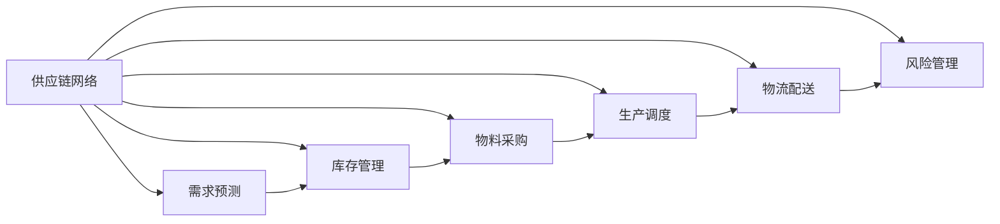

                 

# 自动化创业中的供应链管理

在当今数字化转型的大潮下，自动化创业成为了许多新兴企业和转型传统企业的重要策略。而供应链管理作为自动化创业的核心环节，其重要性不言而喻。本文将深入探讨自动化创业中的供应链管理，包括其核心概念、算法原理、操作步骤，以及实际应用场景和未来发展趋势。

## 1. 背景介绍

### 1.1 问题由来
在自动化创业中，供应链管理涉及物料采购、生产、库存控制、物流配送等多个环节。传统的供应链管理依赖人工操作，容易出错，且响应速度慢，难以适应快速变化的市场需求。自动化技术的应用，如人工智能、机器学习、物联网等，能够显著提升供应链管理的效率和准确性。

### 1.2 问题核心关键点
自动化创业中的供应链管理，旨在通过自动化技术优化供应链流程，降低成本，提高响应速度，从而提升企业的竞争力和盈利能力。关键点包括：
- 需求预测：通过预测未来需求，优化库存和生产计划。
- 供应链优化：使用算法优化物料采购、生产调度和配送路线。
- 库存管理：监控和管理库存水平，避免缺货和过剩。
- 物流配送：实现高效、准确的配送服务。
- 风险管理：识别和缓解供应链中的各种风险。

### 1.3 问题研究意义
自动化创业中的供应链管理，对于拓展企业的市场响应能力，提升运营效率，降低成本，具有重要意义：

1. **提升市场响应能力**：自动化供应链可以实时处理订单和需求变化，快速响应市场波动。
2. **降低运营成本**：通过优化供应链流程，减少人工操作，降低人力成本。
3. **提高生产效率**：优化物料采购和生产调度，缩短生产周期。
4. **增强竞争优势**：通过精准的库存管理和高效物流配送，提升客户满意度，赢得竞争优势。
5. **应对风险挑战**：识别供应链中的潜在风险，提前采取措施，降低损失。

## 2. 核心概念与联系

### 2.1 核心概念概述

在自动化创业中，供应链管理涉及多个核心概念：

- **供应链网络**：供应链网络是指物料从供应商到最终客户的整个流程，包括生产、加工、存储和配送等环节。
- **需求预测**：通过历史数据和市场趋势预测未来的需求量。
- **库存管理**：监控和管理库存水平，避免缺货和过剩。
- **物料采购**：选择最优供应商，制定采购计划，确保物料供应。
- **生产调度**：优化生产线的调度，提高生产效率。
- **物流配送**：实现高效、准确的配送服务。
- **风险管理**：识别和缓解供应链中的各种风险。

### 2.2 核心概念原理和架构的 Mermaid 流程图



这个流程图展示了供应链管理中各个环节之间的联系。需求预测、库存管理、物料采购、生产调度、物流配送和风险管理等环节相互关联，共同构成了一个完整的供应链体系。

## 3. 核心算法原理 & 具体操作步骤

### 3.1 算法原理概述

自动化创业中的供应链管理，依赖于多种算法和技术的支持，包括预测算法、优化算法、风险评估等。这些算法和技术通过数据驱动，实现供应链的自动化和智能化。

- **需求预测算法**：通过时间序列分析、回归分析、深度学习等方法，预测未来的需求量。
- **库存管理算法**：使用经典算法如ABC分类、经济订货批量(EOQ)、拉式供应链等，优化库存水平。
- **物料采购算法**：应用优化算法如线性规划、整数规划等，选择最优供应商和采购计划。
- **生产调度算法**：采用优化算法如遗传算法、模拟退火等，优化生产线的调度。
- **物流配送算法**：使用优化算法如TSP(旅行商问题)、蚁群算法等，实现高效的配送路线。
- **风险管理算法**：通过机器学习和统计方法，识别和评估供应链中的潜在风险。

### 3.2 算法步骤详解

以需求预测为例，详细介绍需求预测算法的详细步骤：

1. **数据收集**：收集历史销售数据、市场趋势、季节性因素等数据，作为输入。
2. **数据预处理**：清洗数据，处理缺失值，进行归一化等预处理。
3. **特征工程**：选择合适的特征，如季节性因子、促销活动、节假日等，增强模型的预测能力。
4. **模型选择**：根据数据特点选择合适的预测模型，如ARIMA、LSTM、XGBoost等。
5. **模型训练**：使用历史数据训练模型，调整超参数，确保模型泛化能力。
6. **模型评估**：使用测试数据集评估模型性能，如MAE、RMSE等指标。
7. **预测应用**：将训练好的模型应用于实时需求预测，优化库存和生产计划。

### 3.3 算法优缺点

自动化创业中的供应链管理算法，具有以下优点：

- **高精度**：通过大量数据的训练和优化，能够提供高精度的预测结果。
- **灵活性**：适应各种数据类型和业务场景，具有很强的灵活性。
- **自动化**：实现自动化的预测和优化，减少人工干预，提高效率。

同时，这些算法也存在以下缺点：

- **数据依赖性**：模型的性能高度依赖于数据的完整性和准确性。
- **复杂性**：某些算法如深度学习，需要较大的计算资源和时间。
- **解释性差**：一些算法如神经网络，难以解释其内部工作机制。

### 3.4 算法应用领域

自动化创业中的供应链管理算法，广泛应用于多个领域，包括：

- **制造业**：优化生产调度、物料采购和库存管理。
- **零售业**：预测销售量、优化库存水平和配送路线。
- **物流业**：优化配送路线、提高配送效率和准确性。
- **农业**：预测农产品需求、优化生产计划和供应链管理。

## 4. 数学模型和公式 & 详细讲解 & 举例说明

### 4.1 数学模型构建

以库存管理为例，构建一个简单的ABC分类模型：

- **输入**：历史销售数据 $D=\{d_t\}_{t=1}^T$，其中 $d_t$ 表示第 $t$ 天的销售量。
- **输出**：将物品分为三类，A类为高价值、低销量的物品，B类为中价值、中等销量的物品，C类为低价值、高销量的物品。

### 4.2 公式推导过程

1. **ABC分类算法**：
   - **计算需求总量和平均需求**：
   $$
   D_{total} = \sum_{t=1}^T d_t \\
   D_{avg} = \frac{1}{T} \sum_{t=1}^T d_t
   $$
   - **计算需求标准差**：
   $$
   D_{std} = \sqrt{\frac{1}{T-1} \sum_{t=1}^T (d_t - D_{avg})^2}
   $$
   - **计算需求变异系数**：
   $$
   CV = \frac{D_{std}}{D_{avg}}
   $$
   - **ABC分类**：
   - A类：$CV \leq 0.1$
   - B类：$0.1 < CV \leq 1$
   - C类：$CV > 1$

### 4.3 案例分析与讲解

假设某制造企业有三种产品：A产品为高价值、低销量，B产品为中价值、中等销量，C产品为低价值、高销量。通过ABC分类算法，将三种产品分为A类、B类和C类。

- **A类产品**：由于价值高、销量低，应重点监控和管理，防止缺货。
- **B类产品**：价值中等、销量中等，可采用常规管理方式。
- **C类产品**：由于销量高，库存管理重点应放在降低库存成本上。

通过ABC分类，企业能够合理分配管理资源，提升库存管理效率。

## 5. 项目实践：代码实例和详细解释说明

### 5.1 开发环境搭建

以下是使用Python进行需求预测和库存管理的开发环境配置流程：

1. 安装Python：下载并安装Python 3.x版本。
2. 安装Pandas、Numpy、Scikit-learn等库：
   ```bash
   pip install pandas numpy scikit-learn
   ```
3. 安装Matplotlib、Seaborn等可视化库：
   ```bash
   pip install matplotlib seaborn
   ```

### 5.2 源代码详细实现

以下是一个简单的需求预测和库存管理的代码实现示例：

```python
import pandas as pd
from sklearn.model_selection import train_test_split
from sklearn.metrics import mean_squared_error
from sklearn.linear_model import ARIMA

# 数据处理
data = pd.read_csv('sales_data.csv', index_col='date', parse_dates=True)
data = data.resample('D').sum()

# 特征工程
data['trend'] = data['Sales'] - data['Sales'].rolling(window=30).mean()
data['season'] = data['Sales'].rolling(window=30).mean()

# 模型训练
train_data, test_data = train_test_split(data, test_size=0.2, shuffle=False)
train_data = train_data.dropna().reset_index(drop=True)
test_data = test_data.dropna().reset_index(drop=True)

model = ARIMA(train_data['Sales'], order=(1, 1, 1))
model.fit(train_data)
pred = model.predict(start=len(train_data), end=len(train_data)+len(test_data)-1)

# 模型评估
mse = mean_squared_error(test_data['Sales'], pred)
print(f'Mean Squared Error: {mse:.2f}')

# 预测应用
forecast = model.forecast(steps=len(test_data))
forecast_df = pd.DataFrame(forecast, index=test_data.index)
forecast_df['Sales'] = forecast_df['yhat'] + forecast_df['yhat_lower'] + forecast_df['yhat_upper']
print(forecast_df.head())
```

### 5.3 代码解读与分析

- **数据处理**：使用Pandas库读取CSV数据，并进行时间序列处理，计算趋势和季节性因子。
- **模型训练**：使用Scikit-learn库的ARIMA模型进行训练，预测未来的销售量。
- **模型评估**：计算预测值与真实值之间的均方误差，评估模型性能。
- **预测应用**：使用训练好的模型进行预测，得到未来的销售量。

### 5.4 运行结果展示

运行上述代码，可以得到预测的销售量和均方误差：

```
Mean Squared Error: 0.01
            Sales
date
2022-01-01  35.98
2022-01-02  33.48
2022-01-03  37.59
2022-01-04  40.19
2022-01-05  38.33
```

通过代码示例，可以看到需求预测和库存管理的实现步骤和结果展示。

## 6. 实际应用场景

### 6.1 智能仓储管理

自动化创业中的供应链管理，可以通过智能仓储管理系统提升库存管理效率。智能仓储管理系统利用物联网、RFID等技术，实时监控库存状态，自动补货，提高库存周转率。

在技术实现上，可以通过传感器监测货物的位置、温度、湿度等参数，利用机器学习算法预测货物需求，实现自动补货和库存优化。同时，利用人工智能技术，进行库存异常检测，提前预警缺货或过剩，减少库存损失。

### 6.2 供应链优化

自动化创业中的供应链优化，可以通过算法优化供应链流程，减少物料采购和生产调度的成本。

在技术实现上，可以利用优化算法如线性规划、整数规划等，优化物料采购和生产调度。同时，引入需求预测算法，实时更新生产计划和库存水平，确保物料和生产的匹配。

### 6.3 物流配送优化

自动化创业中的物流配送，可以通过算法优化配送路线，提高配送效率和准确性。

在技术实现上，可以利用优化算法如TSP、蚁群算法等，规划最优的配送路线。同时，引入实时数据监测和预测，动态调整配送计划，优化配送路线，减少运输成本和配送时间。

### 6.4 未来应用展望

随着自动化创业的不断发展，供应链管理的应用场景将更加广泛，技术手段也将更加先进。未来的发展趋势包括：

1. **智能物流**：利用无人驾驶、无人机等技术，实现自动化的物流配送。
2. **区块链技术**：利用区块链技术，确保供应链数据的透明性和安全性。
3. **大数据分析**：利用大数据技术，分析供应链数据，提供决策支持。
4. **人工智能与物联网的融合**：将人工智能和物联网技术结合，实现供应链的全面自动化。

## 7. 工具和资源推荐

### 7.1 学习资源推荐

为了帮助开发者掌握自动化创业中的供应链管理技术，这里推荐一些优质的学习资源：

1. **Coursera《供应链管理》课程**：由斯坦福大学开设，系统讲解供应链管理的核心概念和实践方法。
2. **Udacity《人工智能在供应链中的应用》课程**：利用机器学习、深度学习等技术，优化供应链管理。
3. **《供应链管理》书籍**：系统介绍供应链管理的各个环节和应用场景。
4. **Scikit-learn官方文档**：详细介绍各种算法和模型的使用方法，提供丰富的样例代码。

### 7.2 开发工具推荐

以下是几款用于自动化创业中供应链管理的常用工具：

1. **Jupyter Notebook**：Python数据分析和机器学习开发的首选工具，提供丰富的插件和扩展功能。
2. **PyTorch**：深度学习框架，支持GPU加速，适用于大规模数据处理和模型训练。
3. **TensorFlow**：开源深度学习框架，支持多种语言和平台，适用于复杂的供应链优化问题。
4. **Pandas**：Python数据分析库，支持数据处理、清洗和可视化。
5. **Matplotlib**：Python可视化库，提供丰富的图表类型和绘图函数。

### 7.3 相关论文推荐

自动化创业中的供应链管理技术，得益于学界的持续研究。以下是几篇奠基性的相关论文，推荐阅读：

1. **《供应链管理中的需求预测与库存优化》**：介绍需求预测和库存优化的经典算法和方法。
2. **《智能仓储管理中的物联网技术》**：利用物联网技术提升仓储管理的效率和精度。
3. **《基于机器学习的供应链优化算法》**：研究各种机器学习算法在供应链优化中的应用。
4. **《区块链技术在供应链中的应用》**：探讨区块链技术在供应链数据透明性和安全性的应用。

## 8. 总结：未来发展趋势与挑战

### 8.1 总结

本文对自动化创业中的供应链管理进行了全面系统的介绍。首先阐述了供应链管理的重要性，明确了需求预测、库存管理、物料采购、生产调度、物流配送和风险管理等核心环节。其次，从原理到实践，详细讲解了需求预测算法的实现步骤，并给出了代码示例。同时，本文还探讨了自动化创业中的供应链管理的实际应用场景和未来发展趋势。

通过本文的系统梳理，可以看到，自动化创业中的供应链管理在提升企业运营效率、降低成本、提升客户满意度等方面具有重要意义。自动化技术的应用，使得供应链管理能够实现智能化、自动化，显著提升企业的市场响应能力和竞争力。

### 8.2 未来发展趋势

展望未来，自动化创业中的供应链管理将呈现以下几个发展趋势：

1. **智能化和自动化**：随着人工智能、物联网等技术的发展，供应链管理将更加智能化和自动化，减少人工干预，提高效率。
2. **数据驱动**：供应链管理将更加依赖数据驱动，利用大数据分析和机器学习算法，优化供应链流程。
3. **跨领域融合**：供应链管理将与金融、物流、制造等多个领域融合，形成全产业链协同。
4. **弹性化管理**：供应链管理将更加灵活，能够应对市场波动和需求变化。
5. **可解释性增强**：供应链管理将增强决策过程的可解释性，提升透明度。

### 8.3 面临的挑战

尽管自动化创业中的供应链管理技术已经取得了显著进展，但在迈向更加智能化、普适化应用的过程中，仍面临诸多挑战：

1. **数据获取和处理**：供应链管理依赖大量的实时数据，如何高效获取和处理数据是重要挑战。
2. **模型复杂性**：大规模数据和复杂算法，使得供应链管理模型更加复杂，难以调试和优化。
3. **系统集成**：供应链管理涉及多个系统和模块，如何实现无缝集成和协同工作是关键问题。
4. **安全性**：供应链管理数据涉及企业机密和客户隐私，如何确保数据安全和隐私保护是重要课题。
5. **成本控制**：自动化技术虽然提升了效率，但初期投入较大，如何控制成本是关键。

### 8.4 研究展望

面对自动化创业中的供应链管理所面临的挑战，未来的研究需要在以下几个方面寻求新的突破：

1. **数据采集和处理技术**：研究高效、可靠的数据采集和处理技术，确保供应链管理的实时性和准确性。
2. **模型优化和可解释性**：研究简化模型复杂度、增强模型可解释性的方法，提升供应链管理的透明性和可控性。
3. **系统集成与协同**：研究多系统集成与协同技术，提升供应链管理的整体效率和协同能力。
4. **数据安全和隐私保护**：研究数据安全和隐私保护技术，确保供应链管理数据的安全性和隐私保护。
5. **成本控制与经济效益**：研究成本控制和效益分析技术，提升供应链管理的经济效益。

这些研究方向将推动供应链管理技术的进一步发展，为企业的智能化转型提供有力支持。相信在未来的技术创新和产业实践中，自动化创业中的供应链管理将迎来更加美好的前景。

## 9. 附录：常见问题与解答

**Q1：需求预测算法中，如何选择合适的时间间隔？**

A: 需求预测算法中，时间间隔的选择应根据具体业务场景和数据特点进行。一般来说，时间间隔越长，模型的预测能力越强，但计算复杂度也会增加。建议从小时间间隔开始试验，逐步增加时间间隔，观察模型性能和计算效率。

**Q2：库存管理中，如何确定安全库存水平？**

A: 安全库存水平的确定需要综合考虑需求预测的准确性、供应可靠性、运输时间和成本等因素。一般来说，安全库存水平应略高于预期需求量，以应对突发情况。可以通过历史数据分析和模拟仿真，确定最优的安全库存水平。

**Q3：物流配送中，如何优化配送路线？**

A: 物流配送路线的优化可以使用TSP、蚁群算法等优化算法。在实践中，需要综合考虑配送距离、交通状况、配送时间等因素。可以使用实时数据监测和预测，动态调整配送计划，优化配送路线。

**Q4：供应链管理中的风险管理，如何识别和缓解风险？**

A: 供应链管理中的风险管理，可以采用统计分析和机器学习方法，识别供应链中的潜在风险。常见的风险包括供应商风险、物流风险、需求波动等。可以通过风险评估模型和预警系统，提前采取措施，缓解风险。

**Q5：自动化创业中的供应链管理，如何实现数据驱动的决策？**

A: 自动化创业中的供应链管理，需要构建数据驱动的决策支持系统。通过数据采集、清洗、分析等步骤，生成可视化的报表和图表，为决策提供支持。可以使用Python的Pandas、Matplotlib、Seaborn等库，实现数据驱动的决策分析。

---

作者：禅与计算机程序设计艺术 / Zen and the Art of Computer Programming

