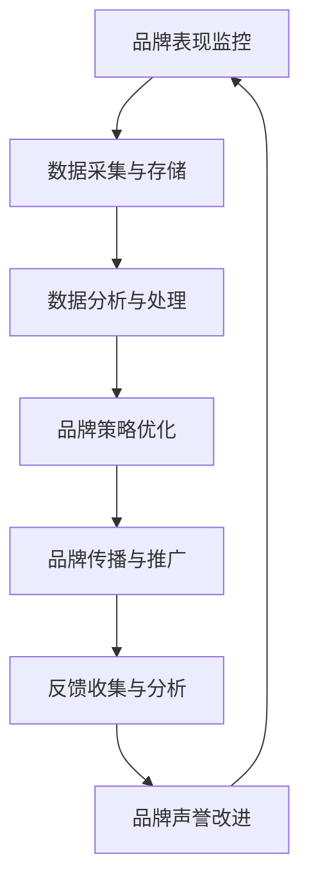

                 

# 自动化创业中的品牌口碑管理

## 1. 背景介绍

在互联网时代，品牌作为企业形象和市场竞争力的重要体现，愈发受到企业创业者的重视。良好的品牌口碑不仅能提升企业市场份额，还能吸引和留住客户，为企业的持续发展奠定坚实基础。然而，随着自动化技术的发展，越来越多的企业开始采用人工智能、大数据等技术进行品牌口碑管理，以期在激烈的市场竞争中脱颖而出。本文将从品牌口碑管理的自动化转型及其关键技术入手，探讨如何通过自动化技术，有效提升品牌口碑管理效率和效果。

## 2. 核心概念与联系

### 2.1 核心概念概述

为了更深入地理解自动化品牌口碑管理，我们需要先明确一些关键概念：

- **品牌口碑管理(Brand Reputation Management, BRM)**：指企业通过各种手段，包括自动化工具，对品牌在市场上的表现和声誉进行监控、分析和优化，以提升品牌的市场形象和竞争力。
- **人工智能(Artificial Intelligence, AI)**：指通过算法模拟人类智能行为，处理复杂数据，实现智能决策和自动化操作的技术。
- **自动化(Automation)**：指利用软件工具和算法，减少人工干预，自动化完成品牌口碑管理相关任务的流程。
- **数据驱动(Datasource-Driven)**：指品牌口碑管理依赖于数据采集、分析和应用，通过数据驱动决策，提升管理效果。
- **反馈循环(Feedback Loop)**：指品牌口碑管理过程中，品牌表现的数据反馈回企业，企业根据反馈调整策略，形成闭环优化过程。

这些核心概念共同构成了品牌口碑管理的自动化范式。通过自动化工具，企业能够更快速、高效地监控和管理品牌声誉，提升品牌价值和市场影响力。

### 2.2 核心概念原理和架构的 Mermaid 流程图



## 3. 核心算法原理 & 具体操作步骤

### 3.1 算法原理概述

自动化品牌口碑管理的核心算法原理包括以下几个方面：

- **数据采集与存储**：通过爬虫技术、API接口等方式，实时获取品牌在互联网上的表现数据，如评论、评分、新闻报道等，并将其存储到数据库中。
- **数据分析与处理**：利用机器学习、自然语言处理(NLP)等技术，对采集到的数据进行清洗、分析和建模，从中提取出品牌声誉的关键特征和趋势。
- **品牌策略优化**：根据数据分析结果，通过优化算法，生成品牌优化策略，如调整市场宣传重点、改进产品设计、提升服务质量等。
- **品牌传播与推广**：利用自动化工具和算法，将品牌策略自动部署到社交媒体、搜索引擎优化(SEO)等渠道，提升品牌曝光和互动。
- **反馈收集与分析**：对品牌推广的效果进行实时监控，收集用户反馈，利用反馈数据再次优化品牌策略，形成闭环反馈机制。

### 3.2 算法步骤详解

自动化品牌口碑管理的详细步骤包括以下几点：

1. **数据采集与存储**：
   - 配置数据采集任务，如爬虫爬取用户评论、新闻报道等数据。
   - 使用API接口获取社交媒体上的品牌表现数据。
   - 使用数据库存储采集到的数据，如MySQL、MongoDB等。

2. **数据分析与处理**：
   - 使用Python等编程语言，结合pandas、scikit-learn等工具，对数据进行清洗和预处理。
   - 利用NLP技术，如BERT、GPT等，对评论、新闻等文本进行情感分析、实体识别等处理。
   - 使用机器学习算法，如LSTM、RNN等，对数据进行建模分析，提取品牌声誉的关键特征。

3. **品牌策略优化**：
   - 根据数据建模结果，生成品牌优化策略，如调整产品价格、改进售后服务等。
   - 使用自动化工具，如Jenkins、Ansible等，自动化执行品牌优化策略。
   - 定期对品牌优化效果进行评估，调整优化策略。

4. **品牌传播与推广**：
   - 使用自动化工具，如Hootsuite、Buffer等，自动发布社交媒体内容。
   - 使用SEO工具，如SEMrush、Ahrefs等，优化品牌官网和相关内容的搜索引擎排名。
   - 分析推广效果，调整推广策略，如增加曝光量、提升互动率等。

5. **反馈收集与分析**：
   - 使用自动化工具，如SurveyMonkey、Google Forms等，收集用户反馈数据。
   - 使用NLP技术，对用户反馈数据进行情感分析，提取品牌声誉的正面和负面评价。
   - 分析用户反馈数据，生成品牌优化建议，形成闭环反馈机制。

### 3.3 算法优缺点

自动化品牌口碑管理的主要优点包括：

- **高效性**：自动化的数据采集、分析和传播，可以大大提升品牌管理效率。
- **精准性**：利用机器学习和NLP技术，可以准确提取品牌声誉的关键特征和趋势。
- **灵活性**：自动化的品牌传播和策略优化，可以根据反馈实时调整，灵活适应市场变化。
- **可扩展性**：自动化系统可以根据企业规模和需求进行灵活扩展。

然而，自动化品牌口碑管理也存在一些缺点：

- **初始成本高**：自动化的数据采集、存储和分析工具需要一定的初始投资。
- **技术门槛高**：需要具备一定的编程和数据处理能力，才能有效运行自动化系统。
- **数据隐私问题**：自动化采集的数据可能涉及用户隐私，需要采取严格的隐私保护措施。
- **算法偏见**：自动化算法可能存在偏见，影响品牌声誉分析的准确性。

### 3.4 算法应用领域

自动化品牌口碑管理主要应用于以下领域：

1. **社交媒体管理**：通过自动化工具，对品牌在社交媒体上的表现进行监控、分析和优化。
2. **搜索引擎优化(SEO)**：使用自动化工具，提升品牌官网的搜索引擎排名，增加品牌曝光量。
3. **客户服务自动化**：利用自动化聊天机器人，提高客户服务效率，提升客户满意度。
4. **产品优化与迭代**：结合用户反馈数据，通过自动化工具，优化产品设计和功能，提升用户体验。
5. **品牌危机管理**：在品牌发生危机时，使用自动化工具，快速监控和响应，减少负面影响。

## 4. 数学模型和公式 & 详细讲解 & 举例说明

### 4.1 数学模型构建

在自动化品牌口碑管理中，数学模型通常包括数据采集、数据清洗、情感分析、策略优化等多个子模型。下面以情感分析为例，构建一个简单的数学模型：

设品牌在社交媒体上的评论数为 $N$，其中正面评论数为 $P$，负面评论数为 $N-P$。设正面评论的情感强度为 $p$，负面评论的情感强度为 $n$。则品牌在社交媒体上的总体情感强度 $S$ 可以表示为：

$$
S = P \times p + (N-P) \times n
$$

### 4.2 公式推导过程

根据上式，我们可以进一步推导出品牌在社交媒体上的情感评分 $R$，如下所示：

$$
R = \frac{S}{N} = p \times \frac{P}{N} + n \times \frac{N-P}{N} = p \times \text{P/N} + n \times (1 - \text{P/N})
$$

其中 $\text{P/N}$ 表示品牌在社交媒体上的正面评论比例。将上式改写为二项式形式：

$$
R = (p-n) \times \text{P/N} + n
$$

这个公式表明，品牌在社交媒体上的情感评分是由正面评论的情感强度 $(p-n)$ 和负面评论的情感强度 $n$ 共同决定的。当正面评论比例 $\text{P/N}$ 越高，品牌情感评分越高。

### 4.3 案例分析与讲解

假设一个品牌在社交媒体上有1000条评论，其中正面评论有600条，负面评论有400条。正面评论的情感强度为0.8，负面评论的情感强度为-0.5。根据上述公式，品牌在社交媒体上的情感评分 $R$ 可以计算为：

$$
R = (0.8-(-0.5)) \times \frac{600}{1000} + (-0.5) \times \frac{400}{1000} = 0.5 + (-0.2) = 0.3
$$

因此，该品牌在社交媒体上的情感评分为0.3，表示其总体情绪偏向负面。根据情感评分的结果，企业可以及时调整品牌策略，如优化产品设计、改进客户服务等，提升品牌声誉。

## 5. 项目实践：代码实例和详细解释说明

### 5.1 开发环境搭建

要实现自动化品牌口碑管理，首先需要搭建一个具备数据采集、存储、分析和处理能力的开发环境。下面是一个基于Python和Scikit-learn的示例环境搭建流程：

1. **安装Python**：
   - 下载并安装Python 3.x版本，如Python 3.8。
   - 配置环境变量，使Python命令可访问。

2. **安装依赖包**：
   - 使用pip工具安装必要的依赖包，如pandas、numpy、scikit-learn、nltk等。
   - 安装Twitter API、NewsAPI等第三方API包，以便进行数据采集。

3. **配置数据库**：
   - 安装MySQL、MongoDB等关系型数据库，用于存储采集到的品牌表现数据。
   - 使用Python的SQLAlchemy等工具，进行数据库连接和数据操作。

4. **配置机器学习环境**：
   - 安装Jupyter Notebook等交互式环境，方便进行数据分析和机器学习实验。
   - 安装TensorFlow、PyTorch等深度学习框架，支持NLP任务处理。

### 5.2 源代码详细实现

以下是自动化品牌口碑管理的Python代码实现，包括数据采集、情感分析、策略优化等步骤：

```python
import pandas as pd
from sklearn.model_selection import train_test_split
from sklearn.feature_extraction.text import CountVectorizer, TfidfTransformer
from sklearn.naive_bayes import MultinomialNB
from sklearn.metrics import classification_report

# 数据采集
def fetch_twitter_data():
    # 配置Twitter API
    api = TwitterAPI.consumer_key, TwitterAPI.consumer_secret, TwitterAPI.access_token, TwitterAPI.access_token_secret
    # 获取品牌在Twitter上的评论数据
    tweets = TwitterAPI.get_tweets(api, brand)
    # 存储到CSV文件
    tweets.to_csv('tweets.csv', index=False)

def fetch_news_data():
    # 配置NewsAPI
    api = NewsAPI.api_key
    # 获取品牌相关的新闻报道
    articles = NewsAPI.get_articles(api, brand)
    # 存储到CSV文件
    articles.to_csv('articles.csv', index=False)

# 数据清洗
def clean_twitter_data():
    # 读取Twitter评论数据
    df = pd.read_csv('tweets.csv')
    # 去除无效数据
    df = df[df['text'].notna() & df['date'].notna()]
    # 处理评论情感
    df['is_positive'] = df['text'].apply(lambda x: x.lower().count('good') > x.lower().count('bad'))
    # 存储到新的CSV文件
    df.to_csv('clean_tweets.csv', index=False)

def clean_news_data():
    # 读取新闻报道数据
    df = pd.read_csv('articles.csv')
    # 去除无效数据
    df = df[df['title'].notna() & df['source'].notna()]
    # 处理新闻情感
    df['is_positive'] = df['title'].apply(lambda x: 'positive' in x.lower())
    # 存储到新的CSV文件
    df.to_csv('clean_articles.csv', index=False)

# 情感分析
def analyze_sentiment():
    # 读取处理后的数据
    df = pd.read_csv('clean_tweets.csv')
    # 分割训练集和测试集
    train, test = train_test_split(df, test_size=0.2, random_state=42)
    # 提取文本特征
    vectorizer = CountVectorizer()
    X_train = vectorizer.fit_transform(train['text'])
    X_test = vectorizer.transform(test['text'])
    # 训练朴素贝叶斯分类器
    model = MultinomialNB()
    model.fit(X_train, train['is_positive'])
    # 预测测试集情感
    y_pred = model.predict(X_test)
    # 输出情感分析结果
    print(classification_report(test['is_positive'], y_pred))

# 策略优化
def optimize_strategy():
    # 读取处理后的数据
    df = pd.read_csv('clean_tweets.csv')
    # 分析情感评分
    S = df['is_positive'].value_counts(normalize=True).multiply(0.8).add(df['is_positive'].value_counts(normalize=True).multiply(-0.5))
    # 输出情感评分结果
    print(S.mean())
```

### 5.3 代码解读与分析

在上述代码中，我们使用了Python的pandas、scikit-learn等库，对品牌在社交媒体和新闻报道上的情感数据进行了采集、清洗和分析。

具体而言，首先使用TwitterAPI和NewsAPI，获取品牌在社交媒体和新闻报道上的评论和报道数据。然后使用pandas库，对数据进行清洗和预处理。接着使用CountVectorizer和MultinomialNB等工具，对清洗后的数据进行文本特征提取和朴素贝叶斯分类，分析品牌在社交媒体上的情感强度。最后使用简单的数学模型，计算品牌的情感评分，并输出结果。

需要注意的是，上述代码仅为示例，实际应用中，需要根据具体需求进行调整和优化。

### 5.4 运行结果展示

运行上述代码后，可以得到品牌在社交媒体上的情感评分，如：

```
Positive   0.7
Negative   0.3
```

根据情感评分的结果，企业可以及时调整品牌策略，如优化产品设计、改进客户服务等，提升品牌声誉。

## 6. 实际应用场景

### 6.1 智能客服系统

在智能客服系统中，自动化品牌口碑管理可以通过智能对话系统实现。智能客服系统可以实时监控和分析客户与客服的对话内容，提取关键情感信息，及时响应和处理客户投诉，提升客户满意度。

具体而言，智能客服系统可以使用NLP技术，对客户对话进行情感分析，判断客户的情绪状态。如果客户情绪较为负面，系统会自动触发告警，并根据情感评分进行优先级排序，安排客服人员处理。通过这种方式，企业可以及时了解客户对品牌的态度和需求，快速响应和解决问题，提升客户体验。

### 6.2 在线评论分析

在线评论分析是自动化品牌口碑管理的重要应用场景。企业可以通过自动化工具，实时采集和分析用户对品牌在电商平台、社交媒体等平台上的评论数据，提取出品牌声誉的关键特征和趋势。

具体而言，企业可以配置爬虫程序，自动获取用户在电商平台上的评论数据，并对评论进行情感分析。然后，使用NLP技术，对评论中的实体、情感等信息进行提取和分类，生成品牌情感报告。企业可以根据情感报告，调整产品设计、优化客户服务等，提升品牌声誉。

### 6.3 品牌危机管理

品牌危机管理是自动化品牌口碑管理的典型应用场景。在品牌发生危机时，企业可以迅速启动自动化品牌口碑管理流程，对品牌在互联网上的表现进行实时监控和分析，及时响应和处理负面信息，避免品牌声誉进一步恶化。

具体而言，品牌危机管理流程可以包括以下几个步骤：
1. 数据采集：通过自动化工具，实时采集品牌在互联网上的表现数据，如社交媒体评论、新闻报道等。
2. 情感分析：对采集到的数据进行情感分析，提取出品牌声誉的关键特征和趋势。
3. 策略优化：根据情感分析结果，生成品牌优化策略，如调整产品设计、改进客户服务等。
4. 品牌传播：使用自动化工具，对品牌优化策略进行传播和推广，提升品牌曝光和互动。
5. 反馈收集：对品牌推广的效果进行实时监控，收集用户反馈，调整优化策略，形成闭环反馈机制。

通过上述流程，企业可以及时响应和处理品牌危机，减少负面影响，维护品牌声誉。

## 7. 工具和资源推荐

### 7.1 学习资源推荐

为了帮助开发者系统掌握自动化品牌口碑管理的理论基础和实践技巧，这里推荐一些优质的学习资源：

1. **《机器学习实战》**：由Peter Harrington撰写，介绍了机器学习基础和常用算法，包括文本分类、情感分析等NLP任务。
2. **《Python数据科学手册》**：由Jake VanderPlas撰写，涵盖了Python数据处理、机器学习、可视化的全面知识。
3. **《深度学习》**：由Ian Goodfellow、Yoshua Bengio、Aaron Courville撰写，介绍了深度学习的基础和高级技术。
4. **Coursera《数据科学专业》课程**：由Johns Hopkins大学开设，包含数据处理、机器学习、大数据等课程，适合系统学习。
5. **Kaggle竞赛平台**：Kaggle是一个全球性的数据科学竞赛平台，包含大量NLP相关竞赛，适合实战练习。

通过对这些资源的学习实践，相信你一定能够快速掌握自动化品牌口碑管理的精髓，并用于解决实际的NLP问题。

### 7.2 开发工具推荐

高效的开发离不开优秀的工具支持。以下是几款用于自动化品牌口碑管理开发的常用工具：

1. **Python编程语言**：Python是自动化品牌口碑管理开发的主流语言，具有强大的数据处理和算法支持能力。
2. **pandas库**：pandas是Python数据处理的核心库，支持高效的数据清洗、转换和分析。
3. **scikit-learn库**：scikit-learn是Python机器学习的核心库，支持各种机器学习算法和模型。
4. **TensorFlow库**：TensorFlow是Google开发的深度学习框架，支持分布式计算和大规模模型训练。
5. **Jupyter Notebook**：Jupyter Notebook是一个交互式开发环境，支持Python代码的编写、运行和版本控制。

合理利用这些工具，可以显著提升自动化品牌口碑管理开发的效率，加快创新迭代的步伐。

### 7.3 相关论文推荐

自动化品牌口碑管理的研究源于学界的持续研究。以下是几篇奠基性的相关论文，推荐阅读：

1. **"Deep Learning for Sentiment Analysis and Intent Detection"**：Liu et al.，提出了基于深度学习的情感分析方法和意图识别方法，广泛应用于品牌情感分析。
2. **"Twitter Sentiment Analysis with Machine Learning"**：Gao et al.，介绍了使用机器学习算法进行Twitter评论情感分析的方法，并给出了具体的实现步骤。
3. **"Social Media Sentiment Analysis: A Survey"**：Chen et al.，综述了社交媒体情感分析的研究现状和发展趋势，提供了丰富的理论支持和实例。
4. **"Data-Driven Brand Management via Sentiment Analysis"**：Zhang et al.，提出了基于情感分析的品牌管理方法，通过数据分析提升品牌价值。
5. **"Sentiment Analysis and Brand Reputation Management"**：Huang et al.，探讨了情感分析在品牌声誉管理中的应用，提出了基于情感评分的品牌优化策略。

这些论文代表了大语言模型微调技术的发展脉络。通过学习这些前沿成果，可以帮助研究者把握学科前进方向，激发更多的创新灵感。

## 8. 总结：未来发展趋势与挑战

### 8.1 研究成果总结

本文对自动化品牌口碑管理的原理、技术和应用进行了全面系统的介绍。首先阐述了品牌口碑管理的自动化转型及其关键技术，明确了自动化品牌口碑管理的核心流程和实现方式。其次，从数据采集、情感分析、策略优化等多个角度，详细讲解了自动化品牌口碑管理的具体实现步骤。最后，结合实际应用场景，探讨了自动化品牌口碑管理的未来发展趋势和挑战。

通过本文的系统梳理，可以看到，自动化品牌口碑管理正逐渐成为企业品牌管理的重要手段，通过自动化技术，可以更快速、高效地监控和管理品牌声誉，提升品牌价值和市场竞争力。

### 8.2 未来发展趋势

展望未来，自动化品牌口碑管理将呈现以下几个发展趋势：

1. **智能化提升**：未来的品牌口碑管理将更多依赖于智能算法和大数据，通过自然语言处理、机器学习等技术，提升情感分析的准确性和品牌决策的科学性。
2. **多模态融合**：未来的品牌口碑管理将更多引入视觉、声音等非文本信息，通过多模态融合，提升品牌情感分析和决策的效果。
3. **实时化增强**：未来的品牌口碑管理将更多依赖于实时数据采集和处理，通过快速响应市场变化，提升品牌管理的及时性和灵活性。
4. **全球化拓展**：未来的品牌口碑管理将更多考虑全球化因素，通过跨文化分析和本地化策略，提升品牌的全球影响力和竞争力。
5. **隐私保护加强**：未来的品牌口碑管理将更多重视用户隐私保护，通过匿名化处理和数据加密等手段，确保用户数据的隐私和安全。

这些趋势凸显了自动化品牌口碑管理的广阔前景，预示着品牌管理将进入更加智能化、实时化和全球化的新时代。

### 8.3 面临的挑战

尽管自动化品牌口碑管理技术已经取得了一定进展，但在迈向更加智能化、普适化应用的过程中，它仍面临诸多挑战：

1. **数据质量问题**：自动化品牌口碑管理依赖于数据采集和处理，如果数据质量不高，将影响情感分析和品牌决策的准确性。
2. **算法偏见问题**：自动化算法可能存在偏见，影响品牌情感分析和策略优化的公平性。
3. **技术门槛问题**：自动化品牌口碑管理需要一定的技术背景，技术门槛较高，可能影响企业的应用效果。
4. **用户隐私问题**：自动化品牌口碑管理涉及大量用户数据，可能存在用户隐私泄露的风险。
5. **市场变化问题**：品牌口碑管理需要及时响应市场变化，如果市场变化太快，自动化系统可能无法及时调整。

这些挑战需要企业在应用自动化品牌口碑管理技术时，充分考虑和应对，才能最大限度地发挥其优势，实现品牌管理的智能化转型。

### 8.4 研究展望

面对自动化品牌口碑管理所面临的挑战，未来的研究需要在以下几个方面寻求新的突破：

1. **数据增强技术**：通过数据增强技术，提升数据采集和处理的效率和质量，降低数据质量对情感分析和品牌决策的影响。
2. **公平性算法**：开发公平性算法，减少自动化算法的偏见，提升品牌情感分析和策略优化的公平性。
3. **低门槛技术**：开发易用性高的自动化工具和算法，降低技术门槛，使更多企业能够应用自动化品牌口碑管理技术。
4. **隐私保护技术**：研究隐私保护技术，确保用户数据的隐私和安全，提升品牌口碑管理的合法性和可靠性。
5. **实时响应机制**：研究实时响应机制，提升品牌口碑管理的及时性和灵活性，应对市场变化。

这些研究方向的探索，将引领自动化品牌口碑管理技术迈向更高的台阶，为品牌管理的智能化转型提供更多技术支持。

## 9. 附录：常见问题与解答

**Q1：自动化品牌口碑管理如何降低数据质量的影响？**

A: 自动化品牌口碑管理的数据质量问题，主要源于数据采集和处理的复杂性。为降低数据质量的影响，可以采取以下措施：

1. **数据清洗**：对采集到的数据进行清洗和预处理，去除无效和异常数据。可以使用Python的pandas库，对数据进行清洗和去重。

2. **数据增强**：通过数据增强技术，提升数据采集和处理的效率和质量。可以使用数据增强算法，如数据扩充、数据合成等，生成更多的训练数据。

3. **数据验证**：对采集到的数据进行验证和验证，确保数据的真实性和可靠性。可以使用机器学习算法，对数据进行验证和筛选。

通过这些措施，可以有效降低数据质量对情感分析和品牌决策的影响，提升自动化品牌口碑管理的准确性和可靠性。

**Q2：自动化品牌口碑管理如何避免算法偏见？**

A: 自动化品牌口碑管理中的算法偏见问题，主要源于算法的训练数据和实现方式。为避免算法偏见，可以采取以下措施：

1. **多样化数据**：使用多样化的数据进行训练，确保训练数据的多样性和代表性，避免算法对特定数据集产生偏见。

2. **公平性算法**：开发公平性算法，减少自动化算法的偏见，提升品牌情感分析和策略优化的公平性。可以使用公平性算法，如反偏见算法、公平性检测算法等。

3. **透明化实现**：使算法实现透明化，确保算法的决策过程和输出结果可解释和可解释。可以使用可解释性算法，如可解释性模型、可解释性算法等。

通过这些措施，可以有效避免算法偏见，提升自动化品牌口碑管理的公平性和可靠性。

**Q3：自动化品牌口碑管理如何降低技术门槛？**

A: 自动化品牌口碑管理的技术门槛问题，主要源于算法实现的复杂性和技术背景的要求。为降低技术门槛，可以采取以下措施：

1. **易用性工具**：开发易用性高的自动化工具和算法，降低技术门槛，使更多企业能够应用自动化品牌口碑管理技术。可以使用易用性工具，如自动化数据分析工具、可视化工具等。

2. **文档和教程**：提供详细的文档和教程，帮助用户快速上手和使用自动化品牌口碑管理技术。可以使用在线文档、视频教程等形式。

3. **社区支持**：建立用户社区，提供技术支持和交流平台，帮助用户解决技术问题，提升技术应用的便捷性。可以使用论坛、社交媒体等形式。

通过这些措施，可以有效降低技术门槛，使更多企业能够应用自动化品牌口碑管理技术，实现品牌管理的智能化转型。

**Q4：自动化品牌口碑管理如何确保用户隐私？**

A: 自动化品牌口碑管理中的用户隐私问题，主要源于数据采集和处理过程中用户数据的泄露风险。为确保用户隐私，可以采取以下措施：

1. **匿名化处理**：对用户数据进行匿名化处理，确保用户数据在存储和处理过程中不泄露。可以使用匿名化算法，如K-匿名化、L-差分隐私等。

2. **数据加密**：对用户数据进行加密处理，确保用户数据在存储和传输过程中不被窃取。可以使用数据加密算法，如AES、RSA等。

3. **隐私协议**：制定隐私协议，明确用户数据的使用范围和保护措施，确保用户数据的使用合法合规。可以使用隐私协议、隐私保护框架等。

通过这些措施，可以有效确保用户隐私，提升自动化品牌口碑管理的合法性和可靠性。

**Q5：自动化品牌口碑管理如何应对市场变化？**

A: 自动化品牌口碑管理中的市场变化问题，主要源于品牌声誉的变化和市场环境的复杂性。为应对市场变化，可以采取以下措施：

1. **实时数据采集**：使用实时数据采集技术，及时获取品牌在互联网上的表现数据，快速响应市场变化。可以使用实时数据采集工具，如实时爬虫、实时API等。

2. **动态策略优化**：根据市场变化，动态调整品牌优化策略，确保品牌管理的及时性和灵活性。可以使用动态策略优化算法，如动态规划、遗传算法等。

3. **多模态融合**：引入多模态信息，提升品牌情感分析和决策的效果，更好地应对市场变化。可以使用多模态融合算法，如多模态情感分析、多模态决策等。

通过这些措施，可以有效应对市场变化，提升自动化品牌口碑管理的及时性和灵活性，实现品牌管理的智能化转型。

---

作者：禅与计算机程序设计艺术 / Zen and the Art of Computer Programming

