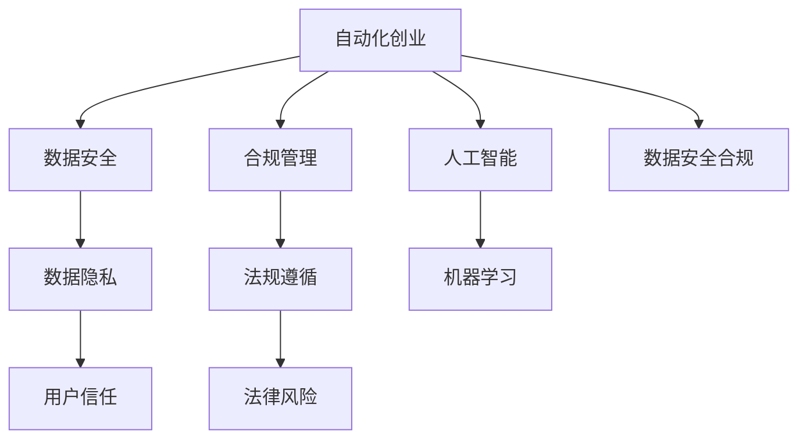

                 

# 自动化创业中的数据安全合规管理

> 关键词：自动化创业, 数据安全, 合规管理, 人工智能, 机器学习

## 1. 背景介绍

### 1.1 问题由来
在数字化时代，自动化创业成为企业增长的新引擎，从智能客服到自动驾驶，从智能制造到智慧零售，自动化技术无处不在。然而，伴随着自动化应用的广泛部署，数据安全合规问题也日益凸显。如何在自动化创业中确保数据的安全合规，成为摆在企业面前的重要课题。

### 1.2 问题核心关键点
数据安全合规的核心在于保护企业资产，确保业务运营的连续性和稳定性，同时保障用户的隐私权益，遵循国家和地区的法律法规。自动化创业涉及的数据类型和处理流程多样，不同应用场景下的安全合规要求也各不相同。因此，构建一套适用于自动化创业的数据安全合规管理体系，是企业可持续发展的关键。

### 1.3 问题研究意义
数据安全合规是自动化创业成功与否的关键因素之一。良好的数据安全合规管理能够：
- 保护企业核心数据，防范数据泄露和损失风险。
- 确保业务系统可靠运行，避免因数据安全事件导致的服务中断。
- 增强用户信任，提升品牌形象和市场竞争力。
- 遵循法律规定，避免因数据违规引发的法律纠纷和惩罚。
- 构建安全生态，提升企业与用户的互信和合作。

## 2. 核心概念与联系

### 2.1 核心概念概述

为更好地理解自动化创业中的数据安全合规管理，本节将介绍几个密切相关的核心概念：

- **自动化创业**：指利用自动化技术进行企业创新和业务增长的新型创业模式。如通过智能制造、智能客服、自动驾驶等技术实现业务优化和产品升级。

- **数据安全**：指保护数据资产免受未授权访问、篡改、破坏或泄露，确保数据的完整性、机密性和可用性。

- **合规管理**：指企业确保其业务运营和数据处理活动符合法律法规、行业标准和内部政策，避免违规行为。

- **人工智能(AI)**：指通过模拟人类智能行为，实现数据分析、预测和决策的技术。AI在自动化创业中扮演着关键角色，通过大数据和算法驱动业务创新。

- **机器学习(ML)**：指让机器通过数据学习规律和模式，自动提升性能和效率。ML技术在数据处理、分析、建模中应用广泛。

- **数据隐私**：指个人或组织对其个人信息的控制权和隐私权的保护。数据隐私管理是企业合规管理的核心环节。

- **法规遵循**：指企业遵守国家和地区的法律法规要求，如GDPR、CCPA等。

这些核心概念之间的逻辑关系可以通过以下Mermaid流程图来展示：



这个流程图展示了几组核心概念之间的联系：

1. 自动化创业依赖数据安全合规，保障业务运营的稳定性和安全性。
2. 数据隐私是数据安全合规的重要组成部分，直接关系到用户信任和品牌形象。
3. 法规遵循是企业合规管理的基石，确保业务的合法合规运营。
4. 人工智能和机器学习技术的深度应用，带来更多数据安全和合规挑战。
5. 良好的数据安全合规管理，能够构建企业与用户间的互信关系。

## 3. 核心算法原理 & 具体操作步骤
### 3.1 算法原理概述

自动化创业中的数据安全合规管理，本质上是一个综合性的问题，涉及到数据收集、存储、处理、传输等各个环节。其核心算法原理可以概括为以下几个方面：

1. **数据加密**：使用加密技术保护数据在存储和传输过程中的机密性，防止未授权访问。
2. **访问控制**：通过身份认证和权限管理，限制数据访问的权限，确保数据仅被授权用户访问。
3. **数据审计**：记录和监控数据访问和使用行为，及时发现和响应异常操作。
4. **数据脱敏**：对敏感数据进行匿名化或模糊化处理，减少数据泄露风险。
5. **数据生命周期管理**：定义数据的存储、使用和销毁规则，确保数据在生命周期内的合规性。
6. **合规检查**：定期检查数据处理流程和系统架构，确保符合法规要求。
7. **风险评估**：评估数据安全合规风险，制定相应的应对措施。

### 3.2 算法步骤详解

基于以上算法原理，自动化创业中的数据安全合规管理可以分为以下几个关键步骤：

**Step 1: 制定数据安全合规策略**
- 评估企业数据资产和业务运营依赖，识别敏感数据和关键业务流程。
- 确定数据安全合规目标和优先级，制定详细的数据安全合规策略。
- 制定数据安全合规政策和流程，包括数据收集、存储、传输、使用和销毁等各个环节。

**Step 2: 技术部署和实施**
- 部署数据加密技术，对敏感数据进行加密保护。
- 实现访问控制机制，如身份认证、权限管理、审计记录等。
- 采用数据脱敏和匿名化技术，减少数据泄露风险。
- 实施数据生命周期管理策略，定义数据存储和使用规则。
- 引入合规检查工具，定期审计数据处理流程和系统架构。
- 进行风险评估和威胁建模，识别潜在的安全合规风险。

**Step 3: 持续监控和改进**
- 建立数据安全合规监控机制，实时监测数据访问和使用行为。
- 定期进行数据安全合规培训和演练，提高员工的安全意识和应急响应能力。
- 根据法规变化和业务需求，动态调整数据安全合规策略和措施。
- 引入自动化工具和算法，提升数据安全合规管理的效率和精度。

### 3.3 算法优缺点

自动化创业中的数据安全合规管理方法具有以下优点：
1. 全面性和系统性：覆盖数据生命周期的各个环节，确保数据安全合规的全面性。
2. 技术先进性：利用最新的数据加密、访问控制、审计等技术，提升数据安全保障能力。
3. 合规效率：引入自动化工具和算法，提高合规检查和监控的效率和精度。
4. 灵活性和适应性：能够根据业务需求和法规变化，灵活调整合规策略和措施。

同时，该方法也存在一些局限性：
1. 技术复杂性：需要综合应用多种技术手段，对技术要求较高。
2. 成本高：初始部署和持续维护需要较大的资金投入。
3. 人才需求：需要具备数据安全、合规管理、技术研发等多方面专业知识的人才。
4. 风险不可预测：尽管采取了多项防护措施，仍可能面临未知的风险和威胁。

### 3.4 算法应用领域

数据安全合规管理在自动化创业中广泛应用于以下几个领域：

- **智能制造**：保障生产数据和设备信息的安全，确保工业系统稳定运行。
- **智能客服**：保护用户隐私和对话记录，确保客服系统合规运营。
- **自动驾驶**：保护车辆数据和驾驶行为记录，确保驾驶数据的安全性和隐私性。
- **智慧零售**：保障用户交易和行为数据的安全，确保零售系统合规运营。
- **健康医疗**：保护患者隐私和医疗数据，确保医疗系统的安全和合规。

以上领域的数据安全合规管理，涉及多个环节和复杂的数据处理流程，需要综合应用多种技术手段和策略，确保数据的安全和合规。

## 4. 数学模型和公式 & 详细讲解  
### 4.1 数学模型构建

在自动化创业中，数据安全合规管理涉及大量的技术指标和合规要求。以下是几个常见的数学模型和公式：

- **数据加密强度模型**：评估加密算法和密钥长度的强度，衡量加密后的数据安全性。
- **访问控制策略模型**：定义用户身份和权限的管理策略，确保数据访问的合法性。
- **数据审计记录模型**：记录和分析数据访问和使用行为，评估合规性。
- **风险评估模型**：量化数据安全合规风险，评估潜在威胁和漏洞。
- **合规检查指标**：定义合规检查的具体指标，如加密算法使用、访问控制机制、审计记录等。

### 4.2 公式推导过程

以数据加密强度模型为例，我们可以定义一个简单的公式来评估加密强度：

$$
E = \frac{1}{S \times L \times K}
$$

其中，$E$ 表示加密强度，$S$ 表示数据敏感度，$L$ 表示数据长度，$K$ 表示密钥长度。

根据该公式，我们可以计算不同敏感度、不同长度和不同密钥长度的数据加密强度，从而制定合理的加密策略。

### 4.3 案例分析与讲解

假设某企业在进行智能制造系统建设时，需要对关键生产数据进行加密保护。根据公式，如果敏感度$S$为5，数据长度$L$为1MB，密钥长度$K$为256位，则该数据的加密强度为：

$$
E = \frac{1}{5 \times 1MB \times 256位} = \frac{1}{1280MB}
$$

根据计算结果，如果企业希望达到一个较高的加密强度，可以考虑使用更长的密钥或更复杂的加密算法。

## 5. 项目实践：代码实例和详细解释说明
### 5.1 开发环境搭建

在进行数据安全合规管理项目实践前，我们需要准备好开发环境。以下是使用Python进行开发的环境配置流程：

1. 安装Anaconda：从官网下载并安装Anaconda，用于创建独立的Python环境。

2. 创建并激活虚拟环境：
```bash
conda create -n cybersecurity-env python=3.8 
conda activate cybersecurity-env
```

3. 安装必要的Python库：
```bash
pip install cryptography json web3 requests
```

4. 安装其他开发工具：
```bash
pip install tqdm
```

完成上述步骤后，即可在`cybersecurity-env`环境中开始项目实践。

### 5.2 源代码详细实现

下面是一个简单的数据安全合规管理系统的代码实现，用于实现基本的加密和访问控制功能。

首先，定义加密模块：

```python
from cryptography.fernet import Fernet

def encrypt_data(data):
    key = Fernet.generate_key()
    cipher_suite = Fernet(key)
    cipher_text = cipher_suite.encrypt(data.encode())
    return cipher_text, key
```

接着，定义访问控制模块：

```python
from flask import Flask, request

app = Flask(__name__)

def check_access_token(token):
    # 检查access_token是否有效
    pass

@app.route('/data', methods=['POST'])
def access_data():
    token = request.headers.get('Authorization')
    if not check_access_token(token):
        return 'Unauthorized', 401
    
    data = request.json.get('data')
    if not data:
        return 'Missing data', 400
    
    encrypted_data, key = encrypt_data(data)
    return {'encrypted_data': encrypted_data, 'key': key}
```

最后，启动Flask应用：

```python
if __name__ == '__main__':
    app.run(debug=True)
```

### 5.3 代码解读与分析

让我们再详细解读一下关键代码的实现细节：

**加密模块**：
- 使用`cryptography`库的`Fernet`算法生成密钥，并使用该密钥进行数据加密。
- 将加密后的数据和密钥以二进制形式返回。

**访问控制模块**：
- 使用Flask框架定义API接口，接收POST请求，并检查请求头中的access_token是否有效。
- 如果access_token有效，则调用加密模块对数据进行加密，并返回加密后的数据和密钥。
- 如果access_token无效或请求体中没有数据，则返回相应的错误信息。

**启动Flask应用**：
- 启动Flask应用，接收来自客户端的POST请求，处理并返回加密后的数据和密钥。

可以看到，通过Flask框架结合`cryptography`库，我们能够快速实现一个基本的数据安全合规管理应用，提供加密和访问控制功能。

当然，工业级的系统实现还需考虑更多因素，如安全认证、权限管理、审计记录等。但核心的加密和访问控制逻辑基本与此类似。

## 6. 实际应用场景
### 6.1 智能制造系统

在智能制造系统中，数据安全合规管理至关重要。生产数据和设备信息通常包含敏感信息，一旦泄露将导致严重的经济损失和安全隐患。

具体而言，智能制造系统可以通过以下方式实现数据安全合规管理：
- 对生产数据进行加密存储和传输，确保数据在传输过程中的机密性和完整性。
- 实施严格的访问控制机制，限制设备访问权限，防止未授权设备接入系统。
- 记录和监控数据访问行为，及时发现和响应异常操作。
- 定期审计数据处理流程，确保符合国家和地区的法规要求。

### 6.2 智能客服系统

智能客服系统涉及大量的用户对话数据，保护用户隐私和对话记录是合规管理的重点。

具体而言，智能客服系统可以通过以下方式实现数据安全合规管理：
- 对用户对话数据进行加密保护，确保对话记录的机密性和隐私性。
- 实施访问控制机制，确保只有授权用户和设备可以访问对话数据。
- 记录和监控对话数据访问和使用行为，及时发现和响应异常操作。
- 定期审计对话数据处理流程，确保符合国家和地区的法规要求。

### 6.3 自动驾驶系统

自动驾驶系统涉及大量的车辆数据和驾驶行为记录，保护这些数据的安全和隐私至关重要。

具体而言，自动驾驶系统可以通过以下方式实现数据安全合规管理：
- 对车辆数据和驾驶行为记录进行加密存储和传输，确保数据在传输过程中的机密性和完整性。
- 实施严格的访问控制机制，限制设备访问权限，防止未授权设备接入系统。
- 记录和监控数据访问行为，及时发现和响应异常操作。
- 定期审计数据处理流程，确保符合国家和地区的法规要求。

### 6.4 未来应用展望

随着自动化创业的深入发展，数据安全合规管理将面临更多挑战和机遇。未来，数据安全合规管理将呈现以下几个发展趋势：

1. **自动化工具的普及**：随着人工智能和机器学习技术的发展，自动化工具将逐步普及，提升数据安全合规管理的效率和精度。

2. **数据隐私保护技术**：隐私保护技术将进一步发展，如差分隐私、联邦学习等，确保数据在共享和利用过程中不泄露用户隐私。

3. **合规性法规的完善**：随着数据隐私和安全问题的日益严重，各国和地区将不断完善数据保护法规，推动数据安全合规管理的发展。

4. **跨平台和跨行业协作**：不同行业和平台之间的数据安全合规管理将更加紧密，形成统一的安全标准和协作机制。

5. **AI和ML的应用**：AI和ML技术将进一步应用于数据安全合规管理，提升系统的智能化和自动化水平。

6. **风险管理和应急响应**：数据安全合规管理将更加注重风险评估和应急响应，提高系统的韧性和可靠性。

## 7. 工具和资源推荐
### 7.1 学习资源推荐

为了帮助开发者系统掌握数据安全合规管理的理论基础和实践技巧，这里推荐一些优质的学习资源：

1. **《数据安全合规管理指南》**：系统介绍数据安全合规管理的理论和实践，涵盖法规遵循、数据加密、访问控制、审计记录等多个方面。

2. **《AI安全与隐私保护》课程**：斯坦福大学开设的AI安全课程，讲解AI在数据隐私和安全中的作用和挑战，提供全面的学习资源。

3. **《数据保护与隐私工程》书籍**：深入讲解数据保护法规和技术，帮助开发者构建安全可靠的数据系统。

4. **《数据隐私与安全技术》系列博文**：系列博客文章，讲解数据隐私和安全技术的最新进展和最佳实践，适合初学者和进阶开发者。

5. **Hacking with Python书籍**：介绍了Python在网络安全、数据隐私和安全方面的应用，适合实战训练。

通过对这些资源的学习实践，相信你一定能够快速掌握数据安全合规管理的精髓，并用于解决实际的数据安全合规问题。

### 7.2 开发工具推荐

高效的开发离不开优秀的工具支持。以下是几款用于数据安全合规管理开发的常用工具：

1. **Python**：Python是一种高效、灵活的编程语言，广泛应用于数据安全合规管理的各个环节。

2. **Flask**：Flask是一个轻量级的Web框架，适合快速开发API接口，实现访问控制和数据加密等功能。

3. **SQLite**：SQLite是一个轻量级的关系型数据库，适合存储加密后的数据和访问日志，提供快速的数据访问和查询。

4. **Elasticsearch**：Elasticsearch是一个分布式搜索引擎，适合存储和搜索大量数据记录，提供高效的查询和分析功能。

5. **TensorFlow**：TensorFlow是一个强大的机器学习框架，适合在数据安全合规管理中应用AI和ML技术，提升系统的智能化水平。

6. **OpenSSL**：OpenSSL是一个开源的加密工具集，支持多种加密算法和协议，适合实现数据加密和访问控制功能。

合理利用这些工具，可以显著提升数据安全合规管理的开发效率，加快创新迭代的步伐。

### 7.3 相关论文推荐

数据安全合规管理的发展源于学界的持续研究。以下是几篇奠基性的相关论文，推荐阅读：

1. **《数据安全管理的理论和实践》**：详细介绍数据安全管理的理论和实践，涵盖数据加密、访问控制、审计记录等多个方面。

2. **《数据隐私保护技术综述》**：综述数据隐私保护技术的最新进展，提供系统的理论基础和实践指南。

3. **《合规性检查技术》**：介绍合规性检查技术的应用和实现方法，涵盖数据加密、访问控制、审计记录等多个环节。

4. **《AI在数据安全合规中的应用》**：探讨AI和ML技术在数据安全合规管理中的应用，提供新的解决方案和思路。

5. **《跨行业数据安全合规管理》**：介绍跨行业数据安全合规管理的挑战和解决方案，提供系统的协作机制和实践指南。

这些论文代表了大数据安全合规管理的发展脉络。通过学习这些前沿成果，可以帮助研究者把握学科前进方向，激发更多的创新灵感。

## 8. 总结：未来发展趋势与挑战
### 8.1 总结

本文对自动化创业中的数据安全合规管理进行了全面系统的介绍。首先阐述了数据安全合规管理在自动化创业中的重要性和研究意义，明确了数据安全合规管理的核心内容和方法。其次，从原理到实践，详细讲解了数据安全合规管理的数学模型和算法步骤，给出了数据安全合规管理项目开发的完整代码实例。同时，本文还广泛探讨了数据安全合规管理在智能制造、智能客服、自动驾驶等自动化创业中的应用前景，展示了数据安全合规管理的广泛应用潜力。此外，本文精选了数据安全合规管理的各类学习资源，力求为读者提供全方位的技术指引。

通过本文的系统梳理，可以看到，数据安全合规管理是自动化创业成功与否的关键因素之一。良好的数据安全合规管理能够：
- 保护企业核心数据，防范数据泄露和损失风险。
- 确保业务系统可靠运行，避免因数据安全事件导致的服务中断。
- 增强用户信任，提升品牌形象和市场竞争力。
- 遵循法律规定，避免因数据违规引发的法律纠纷和惩罚。
- 构建安全生态，提升企业与用户的互信和合作。

### 8.2 未来发展趋势

展望未来，数据安全合规管理将呈现以下几个发展趋势：

1. **自动化工具的普及**：随着人工智能和机器学习技术的发展，自动化工具将逐步普及，提升数据安全合规管理的效率和精度。

2. **数据隐私保护技术**：隐私保护技术将进一步发展，如差分隐私、联邦学习等，确保数据在共享和利用过程中不泄露用户隐私。

3. **合规性法规的完善**：随着数据隐私和安全问题的日益严重，各国和地区将不断完善数据保护法规，推动数据安全合规管理的发展。

4. **跨平台和跨行业协作**：不同行业和平台之间的数据安全合规管理将更加紧密，形成统一的安全标准和协作机制。

5. **AI和ML的应用**：AI和ML技术将进一步应用于数据安全合规管理，提升系统的智能化和自动化水平。

6. **风险管理和应急响应**：数据安全合规管理将更加注重风险评估和应急响应，提高系统的韧性和可靠性。

以上趋势凸显了数据安全合规管理的广阔前景。这些方向的探索发展，必将进一步提升数据安全合规管理的性能和应用范围，为自动化创业带来更强的竞争力。

### 8.3 面临的挑战

尽管数据安全合规管理已经取得了瞩目成就，但在迈向更加智能化、普适化应用的过程中，它仍面临着诸多挑战：

1. **技术复杂性**：数据安全合规管理涉及多个技术环节，对技术要求较高，需要综合应用多种技术手段和策略。

2. **成本高**：初始部署和持续维护需要较大的资金投入，小型企业和初创公司可能面临较大的财务压力。

3. **人才需求**：需要具备数据安全、合规管理、技术研发等多方面专业知识的人才，但这些人才相对稀缺。

4. **风险不可预测**：尽管采取了多项防护措施，仍可能面临未知的风险和威胁，难以完全消除。

5. **法规变化**：各国和地区的法规政策不断变化，企业需要及时跟进并调整合规策略。

6. **用户教育**：用户对数据安全合规管理的认知不足，难以形成良好的数据安全习惯。

正视数据安全合规管理面临的这些挑战，积极应对并寻求突破，将是大数据安全合规管理走向成熟的必由之路。相信随着学界和产业界的共同努力，这些挑战终将一一被克服，数据安全合规管理必将在构建安全可靠的系统方面发挥重要作用。

### 8.4 研究展望

面对数据安全合规管理所面临的挑战，未来的研究需要在以下几个方面寻求新的突破：

1. **引入更多先进技术**：利用区块链、边缘计算、AI等新技术，提升数据安全合规管理的效率和精度。

2. **增强自动化水平**：开发更加智能化和自动化的工具和算法，减少人工干预，提高数据安全合规管理的可靠性。

3. **制定标准和规范**：制定统一的数据安全合规标准和规范，确保不同系统和平台之间的互操作性和一致性。

4. **优化用户体验**：提供更加友好和安全的使用体验，帮助用户更好地理解和应用数据安全合规管理技术。

5. **加强跨行业协作**：建立跨行业的协作机制，共享数据安全合规管理的最佳实践和经验，提升整体的安全水平。

6. **推动法规建设**：积极参与数据隐私和安全法规的制定和推广，推动数据保护法规的完善和发展。

这些研究方向和创新点，将引领数据安全合规管理技术的不断进步，为自动化创业带来更强的数据安全保障和合规性保障。面向未来，数据安全合规管理需要更多的技术创新和行业合作，共同构建更加安全可靠的数字生态。

## 9. 附录：常见问题与解答
### Q1：数据安全合规管理需要投入大量资源，企业如何平衡成本和收益？

A: 企业可以通过以下几种方式平衡数据安全合规管理的成本和收益：
- **分阶段实施**：根据业务需求和安全风险，分阶段逐步实施数据安全合规管理策略，避免一次性投入过大。
- **优先保护关键数据**：先对企业核心数据和关键业务流程进行保护，优先解决高风险问题，再逐步扩展到其他领域。
- **采用开源工具和算法**：利用开源工具和算法，降低初始部署和维护成本，同时获得广泛的技术支持和社区资源。
- **自动化和智能化**：引入自动化工具和算法，提高数据安全合规管理的效率和精度，降低人力和时间成本。

### Q2：数据安全合规管理是否需要人工干预？

A: 尽管自动化工具和算法可以提高数据安全合规管理的效率，但人工干预仍然必不可少。人工干预可以帮助识别和解决自动化工具无法处理的复杂问题，如异常行为分析、数据隐私审查等。因此，数据安全合规管理应结合自动化和人工干预，形成综合性的防护体系。

### Q3：数据安全合规管理能否与其他安全措施结合使用？

A: 数据安全合规管理可以与其他安全措施结合使用，如防火墙、入侵检测、漏洞扫描等，形成综合性的安全防护体系。这些安全措施互为补充，可以提升整体的安全保障能力。

### Q4：数据安全合规管理对业务运营的影响有多大？

A: 良好的数据安全合规管理可以显著提升业务运营的稳定性和安全性，避免因数据泄露和违规引发的损失和风险。但实施过程中可能会带来一定的业务中断和运营成本，因此需要权衡利弊，合理规划。

### Q5：数据安全合规管理对企业风险管理有哪些帮助？

A: 数据安全合规管理可以帮助企业建立全面的风险管理体系，从数据安全合规的角度评估和控制业务运营风险。通过定期审计和风险评估，及时发现和响应潜在威胁，提升企业的韧性和稳定性。

---

作者：禅与计算机程序设计艺术 / Zen and the Art of Computer Programming

