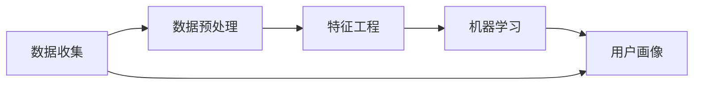

                 

# 自动化创业中的用户画像分析

在自动化创业的浪潮中，用户画像分析成为了一项至关重要的环节。通过深入理解目标用户的行为模式、需求痛点和价值主张，企业可以制定更具针对性和高效性的战略，提升市场竞争力和用户满意度。本文将从背景介绍、核心概念、算法原理、项目实践、应用场景、工具推荐和未来展望等多个维度，系统性地探讨自动化创业中用户画像分析的方法与实践。

## 1. 背景介绍

### 1.1 问题由来
随着人工智能和大数据技术的飞速发展，自动化和智能化成为各行各业提升效率和体验的重要途径。自动化创业项目包括机器人流程自动化(RPA)、人工智能客服、自动化营销等多个领域，均需要通过精准的用户画像来指导产品设计和市场推广。但用户画像的构建是一项系统性的工程，需要借助科学的方法和工具才能完成。

### 1.2 问题核心关键点
- **用户数据来源**：包括用户行为数据、交易记录、社交网络互动等。
- **用户行为分析**：通过分析用户数据，了解用户的行为模式、偏好和需求。
- **用户画像构建**：将用户数据进行整合和分析，生成结构化的用户画像。
- **画像应用场景**：画像数据应用于个性化推荐、精准营销、需求预测等多个方面。

## 2. 核心概念与联系

### 2.1 核心概念概述

用户画像(User Persona)是指对目标用户进行全面而深刻的描述，包括用户的基本信息、行为习惯、偏好、需求等。在自动化创业中，用户画像的构建和分析对于了解目标用户、指导产品设计和优化市场策略具有重要意义。

### 2.2 核心概念联系

用户画像的构建和分析涉及多个环节，包括数据收集、数据预处理、特征工程、机器学习等。这些环节的协同工作，可以形成一个系统的用户画像分析框架。



用户画像的构建和分析是一个数据驱动的迭代过程，通过不断的模型训练和参数优化，可以逐步完善画像的准确性和全面性。

## 3. 核心算法原理 & 具体操作步骤
### 3.1 算法原理概述

用户画像的构建和分析主要基于机器学习和数据挖掘技术，通过分析用户行为数据和互动数据，识别出用户的关键特征和行为模式。常用的方法包括聚类分析、分类算法、关联规则挖掘等。

### 3.2 算法步骤详解

#### 3.2.1 数据收集
数据收集是用户画像分析的第一步，涉及数据的来源、格式和质量。需要根据不同的业务需求，确定收集哪些用户数据。

#### 3.2.2 数据预处理
数据预处理包括清洗、转换和整合数据，使其符合模型训练的要求。需要处理缺失值、异常值、数据格式不统一等问题。

#### 3.2.3 特征工程
特征工程是指从原始数据中提取有意义的特征，供机器学习模型使用。需要根据业务目标，选择合适的特征，并对特征进行归一化、编码等处理。

#### 3.2.4 模型训练
通过训练机器学习模型，从数据中学习用户的行为模式和需求。常用的模型包括K-Means聚类、决策树、随机森林、深度神经网络等。

#### 3.2.5 用户画像生成
将模型输出的用户特征和行为模式整合，生成结构化的用户画像。可以采用标签化、分群、图表等形式展示用户画像。

### 3.3 算法优缺点

#### 3.3.1 优点
- **全面性**：可以综合多维度数据，全面了解用户行为和需求。
- **准确性**：通过机器学习算法，提高了画像构建的自动化和准确性。
- **可扩展性**：能够适应不同业务场景，不断优化和扩展用户画像模型。

#### 3.3.2 缺点
- **数据隐私问题**：需要收集大量用户数据，可能涉及隐私和安全问题。
- **数据偏差**：数据收集和处理过程中可能引入偏差，影响画像的准确性。
- **模型复杂性**：复杂的模型需要大量的计算资源和时间，增加了技术门槛。

### 3.4 算法应用领域

用户画像分析在自动化创业中有着广泛的应用，如：

- **RPA机器人流程自动化**：分析用户操作流程，优化自动化流程设计。
- **人工智能客服**：了解用户咨询热点和需求，优化知识库和回答策略。
- **自动化营销**：通过用户画像，实现个性化推荐和精准营销。
- **需求预测**：分析用户行为，预测未来的需求和趋势。

## 4. 数学模型和公式 & 详细讲解 & 举例说明

### 4.1 数学模型构建

用户画像分析的数学模型主要基于统计学习理论，通过构建用户特征向量，使用机器学习算法进行训练和预测。假设用户数据集为 $D=\{(x_i,y_i)\}_{i=1}^N$，其中 $x_i$ 为用户行为特征向量，$y_i$ 为标签（如用户分群、购买行为等）。

### 4.2 公式推导过程

以K-Means聚类算法为例，推导用户画像构建的数学模型。

设 $x_1, x_2, ..., x_n$ 为用户行为特征向量，$K$ 为聚类数目。K-Means的目标是最小化聚类中心和用户特征向量的距离平方和，即：

$$
\min_{C}\sum_{k=1}^{K}\sum_{x_i \in C_k}\Vert x_i - \mu_k \Vert^2
$$

其中 $\mu_k$ 为聚类中心。可以使用随机初始化法、K-means++等方法进行初始化。算法步骤包括：
1. 随机初始化聚类中心 $\mu_1, \mu_2, ..., \mu_K$。
2. 对每个用户特征向量 $x_i$，计算其与每个聚类中心的距离，分配到最近的聚类 $C_k$。
3. 更新聚类中心 $\mu_k$ 为该聚类中所有特征向量的平均值。
4. 重复2、3步，直到聚类中心不再变化或达到预设的迭代次数。

### 4.3 案例分析与讲解

假设某自动化创业项目旨在开发一款智能客服系统，需要通过用户画像分析来优化知识库和回答策略。

1. **数据收集**：收集用户的历史咨询记录、搜索行为、购买记录等数据。
2. **数据预处理**：清洗缺失值，标准化数据格式，去除异常值。
3. **特征工程**：提取用户咨询问题的关键词、常见问题分类、购买频率等特征。
4. **模型训练**：使用K-Means算法将用户分群，识别出常见问题群和低频问题群。
5. **用户画像生成**：生成不同用户群体的画像，包括常见问题、回答策略、个性化推荐等。

## 5. 项目实践：代码实例和详细解释说明

### 5.1 开发环境搭建

在自动化创业项目中，可以使用Python和相关库（如pandas、scikit-learn、Matplotlib等）来进行用户画像分析。以下是开发环境的搭建步骤：

1. 安装Python和相关库：
```bash
sudo apt-get update
sudo apt-get install python3 python3-pip
pip3 install pandas scikit-learn matplotlib
```

2. 准备数据集：下载并准备用户行为数据集，将其分为训练集和测试集。

### 5.2 源代码详细实现

以下是一个基于K-Means聚类算法的用户画像构建的Python代码实现。

```python
import pandas as pd
from sklearn.cluster import KMeans
import matplotlib.pyplot as plt

# 加载数据集
data = pd.read_csv('user_behavior_data.csv')

# 数据预处理
data = data.dropna()

# 特征工程
features = data[['search_keywords', 'common_qa', 'purchase_frequency']]
target = data['label']

# 模型训练
kmeans = KMeans(n_clusters=3, random_state=42)
kmeans.fit(features)

# 用户画像生成
labels = kmeans.predict(features)
data['user_group'] = labels

# 可视化聚类结果
plt.scatter(features['search_keywords'], features['common_qa'], c=labels)
plt.show()
```

### 5.3 代码解读与分析

**数据加载与预处理**：使用pandas库加载数据集，并清洗缺失值和异常值。

**特征工程**：选择与用户画像相关的特征，如搜索关键词、常见问答、购买频率等，进行特征提取和归一化。

**模型训练**：使用KMeans算法进行聚类，设置聚类数目为3，随机状态为42。

**用户画像生成**：根据聚类结果，为每个用户打标签，生成用户画像。

**可视化展示**：使用Matplotlib库绘制聚类结果的散点图，可视化不同用户群体在特征空间中的分布。

### 5.4 运行结果展示

运行上述代码，可以得到用户行为特征与聚类标签的散点图，如图：


该图展示了不同用户群体在搜索关键词和常见问答特征上的分布，有助于理解用户行为模式和需求。

## 6. 实际应用场景

### 6.1 智能客服系统

在智能客服系统中，用户画像分析可以帮助系统自动匹配用户问题和答案，优化知识库内容。通过分析用户历史咨询记录，系统可以识别出常见问题，自动归类并生成针对性的回答策略。

### 6.2 自动化营销

用户画像分析在自动化营销中也有广泛应用。通过分析用户购买行为和偏好，系统可以生成个性化的推荐内容，提升用户满意度和转化率。例如，根据用户浏览和购买记录，推荐相关产品，或在特定时间发送个性化营销邮件。

### 6.3 需求预测

用户画像分析还可以用于需求预测，通过分析用户行为数据，预测未来的需求趋势。例如，电商平台可以根据用户浏览和购买记录，预测热门商品，优化库存管理和营销策略。

### 6.4 未来应用展望

未来，用户画像分析将进一步向智能化和个性化方向发展，结合更多数据源和先进算法，提升画像的准确性和实用性。例如，通过引入语音识别和情感分析技术，更加全面地理解用户需求和情感状态。同时，用户画像分析也将与更多自动化创业项目结合，推动智能化服务的发展。

## 7. 工具和资源推荐

### 7.1 学习资源推荐

- **书籍**：《机器学习实战》、《Python数据科学手册》、《深度学习》
- **在线课程**：Coursera、Udacity等平台上的机器学习、数据科学课程。
- **开源工具**：GitHub上K-Means聚类算法的开源实现。

### 7.2 开发工具推荐

- **Python**：基于Python的机器学习和数据处理工具，易于学习和使用。
- **pandas**：用于数据处理和分析的库，支持大规模数据集的处理。
- **scikit-learn**：用于机器学习的库，提供多种分类、聚类等算法。
- **Matplotlib**：用于数据可视化的库，支持多种图表展示形式。

### 7.3 相关论文推荐

- **《K-Means聚类算法》**：详细介绍了K-Means算法的原理和应用。
- **《深度学习在用户画像分析中的应用》**：探讨了深度学习技术在用户画像构建中的作用。
- **《自动化营销中的用户画像分析》**：研究了自动化营销中用户画像构建的方法和效果。

## 8. 总结：未来发展趋势与挑战

### 8.1 研究成果总结

本文详细介绍了自动化创业中用户画像分析的原理和实现步骤，通过K-Means聚类算法展示了用户画像的构建过程。通过案例分析和代码实现，展示了用户画像分析在智能客服、自动化营销等场景中的应用。

### 8.2 未来发展趋势

未来，用户画像分析将向以下方向发展：

- **多模态融合**：结合语音识别、情感分析等多种数据源，提升画像的全面性和准确性。
- **实时更新**：通过在线学习算法，实时更新用户画像，适应数据分布的变化。
- **深度学习**：引入深度神经网络等先进算法，提升画像构建的自动化和精度。

### 8.3 面临的挑战

用户画像分析在自动化创业中面临以下挑战：

- **数据隐私**：用户画像的构建需要收集大量用户数据，可能涉及隐私和安全问题。
- **数据质量**：数据质量和数据完整性问题可能影响画像的准确性。
- **模型复杂性**：复杂的机器学习模型需要大量的计算资源和时间，增加了技术门槛。

### 8.4 研究展望

未来，用户画像分析的研究可以从以下几个方向进行探索：

- **联邦学习**：通过联邦学习技术，在保护用户隐私的前提下，构建跨平台用户画像。
- **图神经网络**：引入图神经网络算法，构建基于社交网络的用户画像，提升画像的互动性。
- **跨领域迁移学习**：将用户画像分析与其他领域的迁移学习方法结合，提升模型的泛化能力。

总之，用户画像分析在自动化创业中具有重要的应用价值，通过不断优化和创新，可以显著提升企业的市场竞争力和用户体验。相信随着技术的进步和应用的推广，用户画像分析将迎来更广阔的发展前景。

## 9. 附录：常见问题与解答

### Q1: 如何选择合适的用户画像分析方法？

A: 根据业务需求和数据特点选择合适的分析方法。例如，对于分类问题可以使用决策树、随机森林等分类算法；对于聚类问题可以使用K-Means、层次聚类等算法。

### Q2: 用户画像分析过程中需要注意哪些数据隐私问题？

A: 在数据收集和处理过程中，需要确保用户数据的匿名化和去标识化，保护用户隐私。例如，使用数据脱敏技术，对敏感信息进行屏蔽或替换。

### Q3: 用户画像分析的准确性如何评估？

A: 可以使用交叉验证、ROC曲线、F1-Score等评估指标，评估用户画像分析的准确性和泛化能力。

### Q4: 用户画像分析的实时性如何保障？

A: 可以通过在线学习算法，不断更新用户画像模型，确保画像数据的实时性。同时，使用分布式计算框架（如Spark），提升数据处理和模型训练的效率。

### Q5: 用户画像分析的应用场景有哪些？

A: 用户画像分析广泛应用于自动化客服、自动化营销、需求预测等多个场景，通过分析用户行为和需求，提升企业的智能化水平和服务质量。

---

作者：禅与计算机程序设计艺术 / Zen and the Art of Computer Programming

