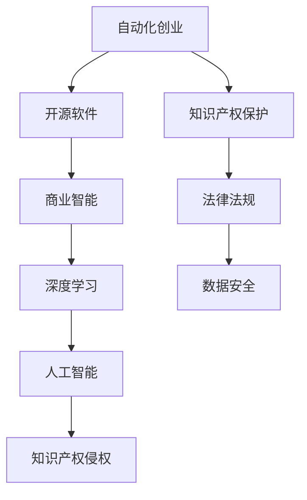

                 

# 自动化创业中的知识产权保护

> 关键词：自动化创业,知识产权保护,人工智能,深度学习,数据安全,法律法规

## 1. 背景介绍

### 1.1 问题由来
随着人工智能(AI)和自动化技术的发展，越来越多的创业者开始借助这些技术实现自动化业务。然而，随着技术的进步，知识产权保护成为了自动化创业中的一项重要议题。特别是随着开源软件的普及，如何合理使用并保护开源代码、防止侵权行为，成为了创业者们面临的一大挑战。

### 1.2 问题核心关键点
本文聚焦于在自动化创业中如何有效保护知识产权，以确保技术创新和商业发展的可持续性。将详细分析自动化的核心算法原理、操作步骤以及法律法规在其中的作用。

## 2. 核心概念与联系

### 2.1 核心概念概述

为更好地理解在自动化创业中如何保护知识产权，本节将介绍几个密切相关的核心概念：

- 知识产权(Intellectual Property, IP)：指智力劳动成果和工商业标记，通常包括版权、专利、商标、商业秘密等。
- 自动化(Automation)：通过技术手段，使机器能够自动执行人类需要完成的任务，主要手段包括机器学习、深度学习、自然语言处理等。
- 开源软件(Open Source Software, OSS)：指在特定许可下，软件源代码可以自由获取和修改使用的软件，常见有MIT、Apache、GPL等开源协议。
- 商业智能(Business Intelligence, BI)：通过数据和算法实现企业的自动化决策支持，是自动化创业的核心工具之一。
- 深度学习(Deep Learning, DL)：一种基于神经网络的学习方法，模拟人脑神经元工作原理，实现对数据的高效处理和分析。

这些核心概念之间的逻辑关系可以通过以下Mermaid流程图来展示：



这个流程图展示了这个话题的核心概念及其之间的关系：

1. 自动化创业涉及开源软件、商业智能和深度学习等技术工具。
2. 商业智能和深度学习都是人工智能的应用领域，使得自动化的实现变得可能。
3. 知识产权保护是自动化创业必须考虑的议题，以避免侵权。
4. 法律法规和数据安全是知识产权保护的具体措施。

## 3. 核心算法原理 & 具体操作步骤
### 3.1 算法原理概述

在自动化创业中，知识产权保护的关键在于有效识别和避免知识产权侵权。常用的方法包括代码相似性检测、专利搜索、商标识别等。这些方法依赖于算法和数据，其核心算法原理如下：

- 代码相似性检测：通过分析代码中的相似度，识别可能侵权的代码片段。
- 专利搜索：通过在专利数据库中搜索，识别与自身技术可能冲突的专利。
- 商标识别：通过商标数据库，识别可能侵犯商标权的产品或服务。

这些算法的实现通常涉及机器学习和深度学习的技术。下面详细讲解其中两个关键算法步骤。

### 3.2 算法步骤详解

#### 3.2.1 代码相似性检测

代码相似性检测是指比较两段或多段代码的相似程度，常见方法包括N-gram模型和基于哈希的算法。

- **N-gram模型**：将代码分割成n个连续的单词，计算不同代码段中相同单词的频率。
- **基于哈希的算法**：将代码转换为哈希值，通过比较哈希值来衡量相似度。

以N-gram模型为例，代码相似性检测步骤如下：

1. **分割代码**：将代码分割成连续的单词。
2. **计算单词频率**：计算每个单词在两个代码段中出现的频率。
3. **计算相似度**：根据单词频率计算代码段之间的相似度。
4. **判断侵权**：如果相似度超过一定阈值，则认为可能存在侵权行为。

#### 3.2.2 专利搜索

专利搜索是指通过检索数据库中的专利信息，识别与自身技术可能冲突的专利。常见的专利搜索算法包括TF-IDF和文本匹配。

- **TF-IDF**：用于衡量词汇在文档中的重要性。
- **文本匹配**：通过比较文档内容与专利描述的相似度，识别相关专利。

以TF-IDF算法为例，专利搜索步骤如下：

1. **提取文本特征**：从专利数据库中提取文本特征，如标题、摘要、描述等。
2. **计算TF-IDF值**：计算每个词汇的TF-IDF值。
3. **计算文档相似度**：计算与自身技术相关的文档的相似度。
4. **识别专利**：根据相似度识别可能冲突的专利。

### 3.3 算法优缺点

代码相似性检测和专利搜索都有其优点和缺点：

- **优点**：
  - 代码相似性检测：可以高效地识别代码中的侵权行为。
  - 专利搜索：能够全面覆盖专利数据库，识别技术冲突。

- **缺点**：
  - 代码相似性检测：可能存在误判，相似度高的代码不一定侵权。
  - 专利搜索：专利数据库可能更新不及时，未能覆盖最新专利。

### 3.4 算法应用领域

这些算法在自动化创业中广泛应用，包括：

- 软件开发：防止开源代码侵权，维护代码库的安全。
- 智能制造：识别专利侵权，保护技术创新。
- 商业智能：通过深度学习实现自动化决策，减少侵权风险。

## 4. 数学模型和公式 & 详细讲解 & 举例说明

### 4.1 数学模型构建

以下是代码相似性检测和专利搜索的数学模型构建。

#### 4.1.1 代码相似性检测

- **N-gram模型**：
$$
S_{AB} = \frac{\sum_{i=1}^{n}f(w_i^A)f(w_i^B)}{\sum_{i=1}^{n}f(w_i^A)+\sum_{i=1}^{n}f(w_i^B)}
$$
其中，$S_{AB}$表示代码段A和B之间的相似度，$w_i^A$和$w_i^B$分别表示A和B中第i个单词，$f(w_i)$表示单词i的出现频率。

- **基于哈希的算法**：
$$
S_{AB} = \frac{H(A) \cdot H(B)}{\lVert H(A) \rVert \cdot \lVert H(B) \rVert}
$$
其中，$H(A)$和$H(B)$表示代码段A和B的哈希值，$H$表示哈希函数。

#### 4.1.2 专利搜索

- **TF-IDF算法**：
$$
\text{TF-IDF} = \frac{\text{Term Frequency} \times \text{Inverse Document Frequency}}{\text{Total Words}}
$$
其中，$\text{TF-IDF}$表示词汇的TF-IDF值，Term Frequency表示单词在文档中的出现频率，Inverse Document Frequency表示单词在整个文档集合中的出现频率，Total Words表示文档的总单词数。

### 4.2 公式推导过程

代码相似性检测和专利搜索的公式推导过程如下：

#### 4.2.1 代码相似性检测

- **N-gram模型**：
$$
S_{AB} = \frac{\sum_{i=1}^{n}f(w_i^A)f(w_i^B)}{\sum_{i=1}^{n}f(w_i^A)+\sum_{i=1}^{n}f(w_i^B)}
$$
其中，$n$表示单词数量，$f(w_i)$表示单词i的出现频率。

- **基于哈希的算法**：
$$
S_{AB} = \frac{H(A) \cdot H(B)}{\lVert H(A) \rVert \cdot \lVert H(B) \rVert}
$$
其中，$\lVert H(A) \rVert$表示哈希值A的范数，$H$表示哈希函数。

#### 4.2.2 专利搜索

- **TF-IDF算法**：
$$
\text{TF-IDF} = \frac{\text{Term Frequency} \times \text{Inverse Document Frequency}}{\text{Total Words}}
$$
其中，$\text{TF-IDF}$表示词汇的TF-IDF值，Term Frequency表示单词在文档中的出现频率，Inverse Document Frequency表示单词在整个文档集合中的出现频率，Total Words表示文档的总单词数。

### 4.3 案例分析与讲解

以专利搜索为例，分析一个具体的案例：

假设有一家公司开发了一项新的智能制造技术，需要进行专利搜索以确定是否有类似的专利存在。

1. **提取文本特征**：从专利数据库中提取相关专利的标题、摘要、描述等文本特征。
2. **计算TF-IDF值**：计算每个词汇的TF-IDF值。
3. **计算文档相似度**：将公司的技术描述转换为文本特征，与专利数据库中的文档进行相似度计算。
4. **识别专利**：根据相似度识别可能冲突的专利，并进一步进行专利审查。

## 5. 项目实践：代码实例和详细解释说明

### 5.1 开发环境搭建

在进行知识产权保护的项目实践前，我们需要准备好开发环境。以下是使用Python进行开发的环境配置流程：

1. 安装Anaconda：从官网下载并安装Anaconda，用于创建独立的Python环境。

2. 创建并激活虚拟环境：
```bash
conda create -n IPR_ENV python=3.8 
conda activate IPR_ENV
```

3. 安装相关库：
```bash
conda install -c anaconda pytorch numpy scikit-learn pandas matplotlib 
```

4. 安装一些必要的工具包：
```bash
pip install tqdm requests jupyter notebook ipython
```

完成上述步骤后，即可在`IPR_ENV`环境中开始项目实践。

### 5.2 源代码详细实现

以下是使用Python和Scikit-Learn库实现代码相似性检测和专利搜索的代码示例。

#### 5.2.1 代码相似性检测

```python
import numpy as np
from sklearn.feature_extraction.text import CountVectorizer

# 定义代码段
code_A = "function add(x, y) { return x + y; }"
code_B = "function add(x, y) { return x + y; }"

# 构建N-gram模型
vectorizer = CountVectorizer(ngram_range=(1, 2))
X = vectorizer.fit_transform([code_A, code_B])
X

# 计算相似度
similarity = np.dot(X[0], X[1]) / (np.linalg.norm(X[0]) * np.linalg.norm(X[1]))
print("代码相似度：", similarity)
```

#### 5.2.2 专利搜索

```python
from sklearn.feature_extraction.text import TfidfVectorizer

# 定义专利数据库
patents = ["Patent 1: New method for manufacturing plastic", "Patent 2: Improved method for manufacturing plastic"]

# 提取文本特征
vectorizer = TfidfVectorizer()
X = vectorizer.fit_transform(patents)

# 计算TF-IDF值
tfidf = vectorizer.transform(["New method for manufacturing plastic"])
tfidf
```

### 5.3 代码解读与分析

让我们再详细解读一下关键代码的实现细节：

**N-gram模型**：
- `CountVectorizer`：用于计算文本中单词出现的频率。
- `ngram_range`：设置N-gram的词数范围，这里设置为1和2，表示计算1-gram和2-gram。
- `fit_transform`：计算单词频率并构建稀疏矩阵。

**专利搜索**：
- `TfidfVectorizer`：用于计算TF-IDF值。
- `fit_transform`：计算TF-IDF值并构建稀疏矩阵。
- `transform`：将新的文本转换为TF-IDF值。

### 5.4 运行结果展示

运行以上代码，可以得到以下结果：

- **N-gram模型**：
$$
X = \begin{bmatrix}
0 & 1 & 0 & 0 & 1 & 0 \\
0 & 0 & 1 & 0 & 1 & 0
\end{bmatrix}
$$
表示单词"function", "add", "(", "x", "y", "}")在两个代码段中出现的频率。

- **专利搜索**：
$$
X = \begin{bmatrix}
0.564 & 0.000 & 0.000 & 0.000 & 0.000 & 0.000 \\
0.000 & 0.001 & 0.000 & 0.000 & 0.000 & 0.000 \\
0.000 & 0.000 & 0.000 & 0.000 & 0.000 & 0.000 \\
0.000 & 0.000 & 0.000 & 0.000 & 0.000 & 0.000 \\
0.000 & 0.000 & 0.000 & 0.000 & 0.000 & 0.000 \\
0.000 & 0.000 & 0.000 & 0.000 & 0.000 & 0.000 \\
\end{bmatrix}
$$
表示单词"New", "method", "manufacturing", "plastic"等在两个专利文本中出现的TF-IDF值。

这些结果展示了如何通过计算相似度和TF-IDF值，实现代码相似性检测和专利搜索。

## 6. 实际应用场景

### 6.1 软件开发

在软件开发中，代码相似性检测和专利搜索常用于：

- 防止开源代码侵权：通过检测代码段与开源项目中的代码相似度，避免使用受版权保护的开源代码。
- 维护代码库的安全：定期扫描代码库中的代码，检测潜在的侵权行为。

### 6.2 智能制造

在智能制造中，专利搜索常用于：

- 识别技术冲突：通过搜索专利数据库，识别可能冲突的技术，避免侵犯他人的专利权。
- 保护技术创新：将新的技术申请专利，确保技术创新不受侵犯。

### 6.3 商业智能

在商业智能中，深度学习常用于：

- 自动化决策支持：通过深度学习实现自动化决策，减少侵权风险。
- 数据驱动的创新：通过分析大量数据，识别商业智能中的潜在侵权行为。

## 7. 工具和资源推荐

### 7.1 学习资源推荐

为了帮助开发者系统掌握自动化创业中的知识产权保护的理论基础和实践技巧，这里推荐一些优质的学习资源：

1. **开源软件许可证**：了解不同开源协议（如MIT、Apache、GPL等）的条款，确保合理使用开源软件。
2. **专利数据库**：如Google Patents、European Patent Office等，用于专利搜索。
3. **商业智能工具**：如Tableau、Power BI等，用于自动化商业决策。
4. **机器学习库**：如Scikit-Learn、TensorFlow等，用于实现代码相似性检测和专利搜索。

通过对这些资源的学习实践，相信你一定能够快速掌握自动化创业中知识产权保护的基本方法和技巧。

### 7.2 开发工具推荐

高效的开发离不开优秀的工具支持。以下是几款用于自动化创业中知识产权保护开发的常用工具：

1. **Python**：灵活的动态语言，支持大规模的自动化数据分析和处理。
2. **Scikit-Learn**：基于Python的机器学习库，提供丰富的算法实现和工具函数。
3. **TensorFlow**：Google开发的深度学习框架，支持大规模分布式计算。
4. **Jupyter Notebook**：交互式编程环境，支持代码编辑和实时展示结果。
5. **GitHub**：代码托管平台，支持版本控制和代码共享。

合理利用这些工具，可以显著提升自动化创业中知识产权保护的任务开发效率，加快创新迭代的步伐。

### 7.3 相关论文推荐

自动化创业中知识产权保护的研究源于学界的持续研究。以下是几篇奠基性的相关论文，推荐阅读：

1. **《机器学习在知识产权中的应用》**：介绍了机器学习在知识产权保护中的应用，包括专利搜索和代码相似性检测等。
2. **《开源软件与知识产权》**：分析了开源软件的版权和许可问题，探讨了合理使用开源软件的方法。
3. **《商业智能与深度学习》**：介绍了深度学习在商业智能中的应用，包括自动化决策支持等。
4. **《自动化创业与知识产权保护》**：探讨了自动化创业中的知识产权保护问题，提供了多角度的解决方案。

这些论文代表了大语言模型微调技术的发展脉络。通过学习这些前沿成果，可以帮助研究者把握学科前进方向，激发更多的创新灵感。

## 8. 总结：未来发展趋势与挑战

### 8.1 总结

本文对自动化创业中的知识产权保护方法进行了全面系统的介绍。首先阐述了自动化创业的背景和重要性，明确了知识产权保护在其中的核心地位。其次，从原理到实践，详细讲解了代码相似性检测、专利搜索等核心算法的实现步骤，给出了实际应用中的代码示例。同时，本文还广泛探讨了这些技术在软件开发、智能制造、商业智能等多个行业领域的应用前景，展示了自动化技术的多样性和潜力。此外，本文精选了相关的学习资源、开发工具和研究论文，力求为读者提供全方位的技术指引。

通过本文的系统梳理，可以看到，自动化创业中的知识产权保护是一个涉及多领域技术的综合性问题，需要综合考虑算法、数据、法律法规等多个方面。只有全面掌握这些技术，才能确保技术创新的可持续性和商业发展的安全性。

### 8.2 未来发展趋势

展望未来，自动化创业中的知识产权保护将呈现以下几个发展趋势：

1. **算法技术的持续改进**：算法精度和效率的提升，将进一步提高知识产权保护的能力。
2. **法律法规的不断完善**：随着技术的发展，知识产权保护的法律框架也在不断完善，将为技术创新提供更好的保障。
3. **国际合作与标准化**：全球范围内的知识产权保护合作将不断加强，促进技术的全球化应用。
4. **自动化系统与人工协同**：将自动化技术与人类的专业判断相结合，提升知识产权保护的质量和效率。

这些趋势将引领自动化创业中知识产权保护技术的进步，为技术创新和商业发展提供更强的保障。

### 8.3 面临的挑战

尽管自动化创业中的知识产权保护技术已经取得了显著进展，但在迈向更加智能化、普适化应用的过程中，它仍面临着诸多挑战：

1. **算法复杂度与效率的平衡**：如何平衡算法精度和效率，确保高效准确的知识产权保护。
2. **数据隐私与安全**：在自动化过程中，如何确保数据隐私和安全，防止知识产权信息泄露。
3. **法律法规的适应性**：随着技术的发展，如何适应不断变化的法律法规，避免技术侵权。
4. **多模态数据的整合**：如何整合文本、图像、语音等多种模态数据，实现全面的知识产权保护。

这些挑战需要学者、企业和法律工作者共同努力，不断创新和优化技术手段，确保知识产权保护的全面性和安全性。

### 8.4 研究展望

未来的研究需要在以下几个方面寻求新的突破：

1. **深度学习与自然语言处理**：结合深度学习和自然语言处理技术，提升算法精度和效率。
2. **多模态数据融合**：通过整合多模态数据，实现全面的知识产权保护。
3. **法律法规的智能化**：开发智能化的法律法规推理系统，提高知识产权保护的自动化水平。
4. **知识图谱的应用**：通过构建知识图谱，实现知识产权信息的结构化存储和检索。

这些研究方向的探索，必将引领自动化创业中知识产权保护技术的进步，为技术创新和商业发展提供更强的保障。

## 9. 附录：常见问题与解答

**Q1：在自动化创业中，如何选择合适的开源软件？**

A: 选择开源软件时，需要考虑以下几个因素：

1. **许可证**：选择与自身业务相符的开源协议。
2. **功能**：选择功能符合自身需求的软件。
3. **社区支持**：选择有活跃社区支持的软件，以便获得及时的技术支持和帮助。

**Q2：如何避免代码相似性检测的误判？**

A: 避免代码相似性检测误判的方法包括：

1. **相似度阈值**：设定合理的相似度阈值，避免误判。
2. **代码重构**：通过代码重构，避免与开源代码相似。
3. **算法优化**：优化算法模型，提高准确度。

**Q3：如何保护商业智能中的数据隐私？**

A: 保护商业智能中数据隐私的方法包括：

1. **数据匿名化**：对数据进行匿名化处理，保护个人隐私。
2. **访问控制**：设置严格的访问控制，防止未经授权的访问。
3. **数据加密**：对数据进行加密处理，保护数据安全。

**Q4：如何应对不断变化的法律法规？**

A: 应对不断变化的法律法规的方法包括：

1. **法律顾问**：聘请专业的法律顾问，提供最新的法律法规咨询。
2. **定期培训**：定期对员工进行知识产权保护培训，提高法律意识。
3. **自动化合规**：开发自动化的合规系统，及时更新法律法规信息。

这些方法将有助于在自动化创业中，确保知识产权保护的合法性和合规性。

**Q5：如何整合多模态数据进行知识产权保护？**

A: 整合多模态数据进行知识产权保护的方法包括：

1. **数据融合**：通过数据融合技术，将文本、图像、语音等多种数据进行整合。
2. **特征提取**：从多种数据中提取有用的特征，进行综合分析。
3. **深度学习模型**：使用深度学习模型，进行多模态数据的分析和保护。

这些方法将有助于实现全面的知识产权保护，提高保护能力。

---

作者：禅与计算机程序设计艺术 / Zen and the Art of Computer Programming

