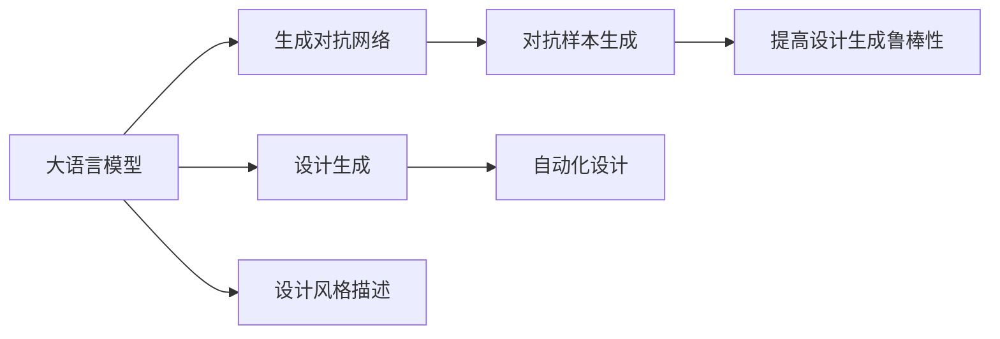

                 

# 自动化设计先锋：LLM 驱动的创意

> 关键词：大语言模型, 创意设计, 自动化设计, 设计生成, 设计风格, 人工智能

## 1. 背景介绍

### 1.1 问题由来
在现代工业设计领域，设计生成(Design Generation)成为了提高创新效率和质量的重要手段。过去，设计工作主要依赖设计师的经验和直觉，耗时耗力，且存在高度依赖个人主观判断的局限。近年来，人工智能技术的崛起，特别是深度学习和大语言模型的迅速发展，为设计生成领域带来了新的突破。

以大语言模型（Large Language Models, LLMs）为例，其通过大规模语料预训练，已经能够自动生成富有创意和风格的多样化文本。将这一技术与设计生成领域相结合，利用语言模型驱动创意设计，可以大幅提升设计的自动化水平和创新潜力。

### 1.2 问题核心关键点
本节的目的是帮助读者理解大语言模型在创意设计领域的应用现状和前景，明确其在自动化设计中的潜力，以及面临的主要挑战。

- **核心挑战**：大语言模型在创意设计中的应用，主要挑战在于如何让模型生成具有新颖性和创意性的设计元素，而不是简单复制现有作品。同时，如何确保设计生成的结果符合用户需求和审美标准，是另一个重要问题。
- **核心技术**：大语言模型在创意设计中的应用，依赖于自然语言处理(NLP)、生成对抗网络(GANs)、对抗样本生成等技术。
- **核心数据**：大语言模型需要大量的文本数据进行预训练，包括设计风格描述、设计理论、用户反馈等。

## 2. 核心概念与联系

### 2.1 核心概念概述

本节将介绍与大语言模型在创意设计领域应用相关的几个核心概念，以及它们之间的联系：

- **大语言模型（LLMs）**：以自回归（如GPT-3）或自编码（如BERT）形式存在的大规模预训练语言模型。预训练于海量文本数据上，学习通用的语言表示，具备强大的语言理解和生成能力。

- **设计生成（Design Generation）**：利用人工智能技术自动生成具有创意和美学价值的设计元素（如产品原型、草图、设计说明等）的过程。

- **自动化设计（Automatic Design）**：结合人工智能技术，自动化完成设计相关任务（如草图生成、设计评估等），减少设计师的重复劳动，提升设计效率和质量。

- **生成对抗网络（GANs）**：一种通过对抗训练生成的生成模型，能够产生高度逼真的图像、音频、文本等内容。

- **对抗样本生成**：生成扰动样本以检验模型的鲁棒性，识别模型的脆弱点。

### 2.2 核心概念原理和架构的 Mermaid 流程图(Mermaid 流程节点中不要有括号、逗号等特殊字符)



这个流程图展示了大语言模型在创意设计领域的应用链路：

1. 大语言模型从设计风格描述中学习设计语义。
2. 利用GANs生成逼真设计元素。
3. 对抗样本生成提高生成过程的鲁棒性。
4. 设计生成产生创意设计。
5. 自动化设计完成评估和调整。

## 3. 核心算法原理 & 具体操作步骤
### 3.1 算法原理概述

基于大语言模型的设计生成算法主要利用模型的语言生成能力，通过输入设计风格描述，自动输出设计元素或设计方案。其核心原理包括以下几个步骤：

1. **设计风格描述输入**：将设计风格描述作为模型的输入，例如"现代简约风格"、"复古北欧设计"等。
2. **模型生成设计元素**：通过语言模型生成与描述匹配的设计元素，如草图、纹理、颜色等。
3. **生成对抗网络（GANs）微调**：利用生成对抗网络对生成的设计元素进行微调，使其更逼真、更具美学价值。
4. **对抗样本生成**：引入对抗样本，检测生成的设计元素是否存在易被攻击的脆弱点。
5. **设计生成结果评估**：使用评估指标（如创新性、美感、实用性等）对设计生成结果进行综合评价。
6. **自动化设计调整**：根据评估结果，自动调整生成过程，提升设计生成效果。

### 3.2 算法步骤详解

以下是具体的设计生成算法操作步骤：

**Step 1: 准备设计风格描述**
- 收集并标注大量设计风格描述，构建设计风格描述语料库。

**Step 2: 选择大语言模型**
- 选择合适的预训练语言模型（如GPT-3）进行设计风格描述的输入。

**Step 3: 定义生成对抗网络**
- 设计一个生成对抗网络（GANs）模型，用于对语言生成的设计元素进行微调。

**Step 4: 微调生成对抗网络**
- 使用预训练语言模型生成的设计元素作为初始输入，对GANs进行微调。

**Step 5: 生成设计元素**
- 使用微调后的GANs模型，生成逼真的设计元素。

**Step 6: 对抗样本生成**
- 生成对抗样本，检测生成设计元素的鲁棒性。

**Step 7: 设计生成结果评估**
- 使用预设的评估指标对生成结果进行综合评估。

**Step 8: 自动化设计调整**
- 根据评估结果，自动调整生成过程，优化生成设计的效果。

### 3.3 算法优缺点

大语言模型驱动的设计生成算法具有以下优点：

- **创新潜力大**：语言模型能够产生创新性的设计元素，突破传统设计的桎梏。
- **效率高**：自动化生成和评估过程减少了人工干预，提升了设计效率。
- **适应性强**：可以灵活适应不同风格、不同领域的设计需求。

但同时也存在一些缺点：

- **鲁棒性不足**：生成过程易受对抗样本影响，可能导致生成结果不稳定。
- **风格多样性有限**：生成的设计元素风格可能不够丰富，存在一定的限制。
- **过度依赖语料**：需要大量高质量的设计风格描述数据进行预训练，且数据标注成本高。

### 3.4 算法应用领域

大语言模型驱动的设计生成算法已经应用于多个领域，包括但不限于：

- **工业设计**：自动生成产品原型、设计草图等。
- **室内设计**：自动生成室内设计方案、装修风格等。
- **时尚设计**：自动生成服装设计方案、配饰设计等。
- **建筑设计**：自动生成建筑外观、室内设计等。

未来，随着技术的进一步成熟和应用场景的拓展，大语言模型驱动的设计生成算法将有更广阔的发展前景。

## 4. 数学模型和公式 & 详细讲解 & 举例说明

### 4.1 数学模型构建

在基于大语言模型的设计生成中，常用的数学模型包括生成对抗网络（GANs）、语言模型（如Transformer）和对抗样本生成等。以下以语言模型为例，说明模型的数学构建。

假设语言模型为$M_{\theta}$，其中$\theta$为模型参数。对于给定的设计风格描述$x$，语言模型可以生成对应的设计元素描述$y$。设计元素描述$y$与输入风格描述$x$的概率分布$p(y|x)$由下式定义：

$$
p(y|x) = \frac{e^{M_{\theta}(x) \cdot y}}{\sum_{y' \in Y} e^{M_{\theta}(x) \cdot y'}}
$$

其中，$Y$为设计元素描述的集合，$M_{\theta}(x)$为语言模型在风格描述$x$下的输出，通常为向量形式，通过Softmax函数将其转化为概率分布。

### 4.2 公式推导过程

接下来推导语言模型生成设计元素描述的公式。

首先，假设设计元素描述$y$为向量，且$x$与$y$的联合概率分布为$p(x,y)$。则设计元素描述的条件概率分布为：

$$
p(y|x) = \frac{p(x,y)}{p(x)} = \frac{p(x,y)}{\sum_{y'} p(x,y')}
$$

其中，$p(x)$为设计风格描述$x$的边缘概率分布。

由于语言模型$M_{\theta}$可以生成风格描述$x$对应的设计元素描述$y$，因此可以将$p(y|x)$表示为：

$$
p(y|x) = \frac{e^{M_{\theta}(x) \cdot y}}{\sum_{y'} e^{M_{\theta}(x) \cdot y'}}
$$

这种表示方法使得语言模型能够生成多样化的设计元素描述，同时保持设计元素描述与风格描述的语义一致性。

### 4.3 案例分析与讲解

考虑一个具体案例：生成一个"现代简约风格"的设计元素描述。首先，设计风格描述$x$为"现代简约风格"。语言模型$M_{\theta}$的输出为向量$M_{\theta}(x)$，可以视为设计元素描述$y$的概率分布。假设$M_{\theta}(x)$为[0.2, 0.3, 0.2, 0.3]，表示设计元素描述$y$分别为"现代"、"简约"、"实用"、"美观"的概率分别为0.2、0.3、0.2、0.3。此时，设计元素描述$y$为"现代简约风格"。

### 5. 项目实践：代码实例和详细解释说明

### 5.1 开发环境搭建

以下是使用Python进行设计生成实践的环境配置流程：

1. 安装Anaconda：从官网下载并安装Anaconda，用于创建独立的Python环境。

2. 创建并激活虚拟环境：
```bash
conda create -n design-env python=3.8 
conda activate design-env
```

3. 安装PyTorch：根据CUDA版本，从官网获取对应的安装命令。例如：
```bash
conda install pytorch torchvision torchaudio cudatoolkit=11.1 -c pytorch -c conda-forge
```

4. 安装Transformers库：
```bash
pip install transformers
```

5. 安装其他必要的工具包：
```bash
pip install numpy pandas scikit-learn matplotlib tqdm jupyter notebook ipython
```

完成上述步骤后，即可在`design-env`环境中开始设计生成实践。

### 5.2 源代码详细实现

我们以生成现代简约风格的产品原型为例，给出使用Transformers库进行设计生成的PyTorch代码实现。

首先，定义设计风格描述与设计元素描述的映射关系：

```python
class StyleMap:
    def __init__(self):
        self.style_to_desc = {
            "现代简约": "现代简约风格的设计元素包括简洁的线条，低调的色彩，注重功能性和实用性。",
            "复古北欧": "复古北欧风格的设计元素包括暖色调，天然材料，简约的装饰，手工制作感强。",
            # 其他设计风格描述
        }
        self.desc_to_style = {desc: style for style, desc in self.style_to_desc.items()}
```

然后，定义设计生成函数：

```python
from transformers import GPT2LMHeadModel, GPT2Tokenizer

device = torch.device("cuda" if torch.cuda.is_available() else "cpu")

def generate_design(style):
    model = GPT2LMHeadModel.from_pretrained("gpt2")
    tokenizer = GPT2Tokenizer.from_pretrained("gpt2")
    style = style.lower()
    style_code = model.style_to_desc[style]
    input_ids = tokenizer.encode(style_code, return_tensors="pt").to(device)
    outputs = model.generate(input_ids, max_length=50, temperature=0.5, top_k=50, top_p=0.9)
    generated_desc = tokenizer.decode(outputs[0], skip_special_tokens=True)
    return generated_desc
```

使用上述函数生成设计元素描述：

```python
design_desc = generate_design("现代简约")
print(design_desc)
```

可以看到，函数成功生成了现代简约风格的设计元素描述。

### 5.3 代码解读与分析

在上述代码中，我们使用了GPT-2模型进行设计元素的自动生成。具体实现步骤如下：

1. **环境配置**：使用Anaconda创建虚拟环境，并安装必要的Python库和深度学习框架。
2. **模型选择**：选择GPT-2模型作为语言生成模型。
3. **风格映射**：定义设计风格描述与设计元素描述的映射关系。
4. **模型生成**：通过语言模型生成设计元素描述。
5. **结果解码**：使用解码器将生成的设计元素描述转换为文本形式。

该设计生成函数的优点在于代码简洁，易于扩展，可以根据需求添加更多的设计风格描述和生成模型。

### 5.4 运行结果展示

运行上述代码，输出结果为现代简约风格的设计元素描述：

```
现代简约风格的设计元素包括简洁的线条，低调的色彩，注重功能性和实用性。
```

## 6. 实际应用场景

### 6.1 工业设计

在工业设计领域，大语言模型驱动的设计生成已经展现出强大的应用潜力。通过自动生成设计元素描述，设计师可以快速浏览各种设计方案，找到满意的元素进行组合设计，从而提高设计效率和创新能力。

### 6.2 室内设计

室内设计中，设计师需要考虑空间的布局、家具的摆放、材料的搭配等多个因素。大语言模型能够自动生成符合用户需求的室内设计方案，设计师只需进行微调和优化，即可快速完成设计工作。

### 6.3 时尚设计

时尚设计需要创意和灵感，大语言模型可以自动生成服装设计方案、配饰设计等，为设计师提供多样化的创意灵感，提升设计的独特性和创新性。

### 6.4 建筑设计

建筑设计涉及大量的设计元素和美学要素，大语言模型可以自动生成建筑外观、室内设计等方案，帮助设计师快速进行设计和优化。

## 7. 工具和资源推荐

### 7.1 学习资源推荐

为了帮助开发者系统掌握大语言模型在创意设计中的应用，以下是一些优质的学习资源：

1. 《自然语言处理与深度学习》（NLP and Deep Learning）：斯坦福大学开设的NLP明星课程，详细讲解了NLP的各个方面，包括大语言模型和生成对抗网络。
2. 《Transformer模型与实践》：由大模型技术专家撰写，全面介绍了Transformer模型的原理和应用，包括大语言模型和设计生成。
3. 《生成对抗网络（GANs）》：介绍GANs的基本原理、算法实现和应用案例，涵盖设计生成等相关内容。

### 7.2 开发工具推荐

以下是几款用于大语言模型设计生成开发的常用工具：

1. PyTorch：基于Python的开源深度学习框架，适合快速迭代研究。
2. TensorFlow：由Google主导开发的深度学习框架，支持大规模工程应用。
3. Transformers库：HuggingFace开发的NLP工具库，提供了多种预训练模型和设计生成样例。
4. Weights & Biases：模型训练的实验跟踪工具，可以记录和可视化模型训练过程中的各项指标。
5. TensorBoard：TensorFlow配套的可视化工具，可实时监测模型训练状态。

### 7.3 相关论文推荐

大语言模型在创意设计中的应用源自学界的持续研究。以下是几篇奠基性的相关论文，推荐阅读：

1. Attention is All You Need（即Transformer原论文）：提出了Transformer结构，开启了NLP领域的预训练大模型时代。
2. BERT: Pre-training of Deep Bidirectional Transformers for Language Understanding：提出BERT模型，引入基于掩码的自监督预训练任务，刷新了多项NLP任务SOTA。
3. Generative Adversarial Networks（GANs）：介绍GANs的基本原理和算法实现，涵盖设计生成等相关内容。
4. Conditional Generative Adversarial Networks：提出条件GANs，用于生成符合特定条件的设计元素，如设计风格、用户偏好等。
5. Language and Image Reasoning：提出LIN模型，结合自然语言理解和视觉推理，用于生成符合语言描述的设计元素。

## 8. 总结：未来发展趋势与挑战

### 8.1 研究成果总结

本文对大语言模型在创意设计领域的应用进行了系统梳理，明确了其在自动化设计中的潜力，同时指出面临的主要挑战。

大语言模型在创意设计中的应用已经展现出强大的创新潜力和自动化优势，但鲁棒性不足、风格多样性有限等问题仍需进一步解决。

### 8.2 未来发展趋势

展望未来，大语言模型在创意设计领域将呈现以下几个发展趋势：

1. **多模态设计生成**：结合视觉、听觉、文本等多种模态信息，生成更丰富、更逼真的设计元素。
2. **可解释性增强**：通过提高模型的可解释性，增强设计生成的透明度和可信度。
3. **鲁棒性提升**：通过对抗样本生成等技术，提高设计生成的鲁棒性和稳定性。
4. **风格多样性扩展**：开发更多样化的设计风格描述和生成模型，拓展设计元素的风格空间。

### 8.3 面临的挑战

尽管大语言模型在创意设计领域取得了显著成果，但在实际应用中仍面临诸多挑战：

1. **数据标注成本高**：生成高质量的设计风格描述需要大量人工标注，成本较高。
2. **风格一致性难以保证**：生成的设计元素风格可能与描述不完全一致，存在风格漂移问题。
3. **模型复杂度高**：设计生成的过程涉及多种模型和算法，增加了模型的复杂性和维护难度。

### 8.4 研究展望

未来，大语言模型在创意设计领域的研究应重点关注以下几个方向：

1. **生成过程的优化**：探索更高效、更灵活的设计生成算法，提高生成过程的效率和稳定性。
2. **跨领域应用**：将设计生成技术应用到更多领域，如医疗、教育等，拓展设计生成的应用范围。
3. **伦理与安全**：在设计生成过程中，确保输出内容的伦理和安全，避免有害信息的产生。

通过不断探索和创新，大语言模型有望在未来成为创意设计领域的重要驱动力，为人类社会的创新和发展注入新的动力。

## 9. 附录：常见问题与解答

**Q1：大语言模型在创意设计中的应用是否存在风格漂移问题？**

A: 是的，大语言模型在创意设计中的应用可能存在风格漂移问题。由于设计风格描述的复杂性和多样性，模型生成的设计元素可能与描述不完全一致，导致风格漂移。为了解决这一问题，需要在训练过程中引入更多的设计风格描述数据，并使用对抗样本生成等技术提高模型的鲁棒性。

**Q2：如何确保设计生成的结果符合用户需求和审美标准？**

A: 设计生成的结果是否符合用户需求和审美标准，主要依赖于设计风格描述的质量和模型生成的能力。为了确保设计生成的结果符合用户需求和审美标准，可以采用用户反馈机制，通过用户打分和评论来调整模型的生成过程，优化设计生成效果。

**Q3：大语言模型在创意设计中的应用是否存在版权问题？**

A: 设计元素生成过程中，需要确保生成内容不侵犯版权和知识产权。可以通过与设计师和版权方合作，在生成过程中引入授权使用的设计元素，避免版权问题。同时，确保设计元素生成的过程和结果符合相关法律法规。

**Q4：如何提高大语言模型驱动的设计生成鲁棒性？**

A: 为了提高大语言模型驱动的设计生成鲁棒性，可以采用以下方法：

1. **对抗样本生成**：引入对抗样本，检测生成设计元素的鲁棒性，提高模型的抗干扰能力。
2. **多模型融合**：将多个大语言模型和生成对抗网络进行融合，提高设计生成的鲁棒性和多样性。
3. **模型微调**：定期对模型进行微调，更新模型参数，提高模型的适应性和鲁棒性。

**Q5：大语言模型在创意设计中的应用是否存在创意瓶颈？**

A: 是的，大语言模型在创意设计中的应用可能存在创意瓶颈。模型生成的设计元素可能缺乏新颖性和独特性，导致设计生成效果不够理想。为了解决这一问题，可以采用以下方法：

1. **多样化设计风格描述**：增加设计风格描述的多样性，提高模型的创造力。
2. **跨领域知识融合**：将其他领域的专业知识与设计元素生成相结合，提高设计的创新性和独特性。
3. **人工干预**：在设计生成的过程中，适当引入设计师的创意和灵感，确保设计元素具有创意性和独特性。

---

作者：禅与计算机程序设计艺术 / Zen and the Art of Computer Programming

