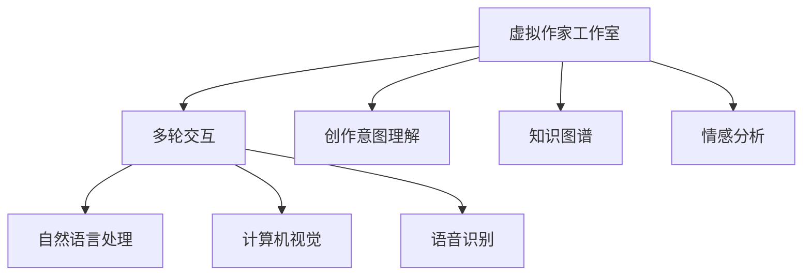

                 

# 虚拟作家工作室：AI协作创作平台

## 1. 背景介绍

### 1.1 问题由来
随着人工智能技术的迅猛发展，越来越多的行业开始探索如何利用AI技术来提升工作效率和质量。而在文化创意领域，特别是写作、创作等主观性强的工作，AI的应用尚处于起步阶段。尽管如此，AI写作助手、自动生成文章等应用已经初露端倪，显示出广阔的发展潜力。

然而，目前这些应用多基于单一的文本生成技术，缺乏与人类创作者互动的能力，难以真正理解创作过程的复杂性和多样性。如何构建一个能够与人类协作、理解和尊重创作自由的AI写作平台，成为当前亟待解决的问题。

### 1.2 问题核心关键点
本文聚焦于虚拟作家工作室的概念和架构，旨在构建一个能够支持多轮交互、理解创作意图的AI协作创作平台。该平台将AI技术与人类创作者无缝结合，充分发挥各自的优点，实现更高效、更丰富的协作创作过程。

### 1.3 问题研究意义
虚拟作家工作室的研究具有重要的意义：

1. **提升创作效率**：通过与AI协作，创作者可以在短时间内完成大量工作，提高创作效率。
2. **丰富创作内容**：AI可以提供多样化的素材和创意，激发创作者的灵感，丰富创作内容。
3. **降低创作成本**：AI可以自动完成一些繁琐的排版、校对工作，减少人工成本。
4. **提高创作质量**：AI能够识别和修正语法、风格等方面的问题，提升作品质量。
5. **促进跨界合作**：虚拟作家工作室可以跨越地域、语言和文化障碍，促进全球创作者的合作。

## 2. 核心概念与联系

### 2.1 核心概念概述

为更好地理解虚拟作家工作室的设计理念，本节将介绍几个关键概念：

- **虚拟作家工作室**：基于AI技术的协作创作平台，集成了自然语言处理、计算机视觉、语音识别等多种技术，支持多轮交互和实时协作。

- **多轮交互**：虚拟作家工作室与人类创作者进行多次、多方式互动，通过对话、修改建议、图片、音频等多种形式，不断完善创作内容。

- **创作意图理解**：平台能够理解创作者的创作意图和需求，提供有针对性的建议和支持。

- **知识图谱**：虚拟作家工作室内置的知识图谱，包含海量的文学、历史、科学等领域的知识，为创作提供丰富的背景和灵感。

- **情感分析**：通过分析文本情感，了解创作者的情绪状态，提供情感共鸣和心理支持。

这些核心概念之间的逻辑关系可以通过以下Mermaid流程图来展示：



这个流程图展示出虚拟作家工作室的核心概念及其之间的关系：

1. 虚拟作家工作室通过多轮交互、创作意图理解、知识图谱和情感分析等功能，提供丰富的创作支持。
2. 多轮交互支持自然语言处理、计算机视觉、语音识别等多种技术，实现创作内容的实时更新和完善。
3. 创作意图理解有助于平台更好地理解创作者的需求，提供更有针对性的建议。
4. 知识图谱和情感分析则分别提供背景知识和情感支持，进一步丰富创作内容。

## 3. 核心算法原理 & 具体操作步骤
### 3.1 算法原理概述

虚拟作家工作室的核心算法包括自然语言处理(NLP)、计算机视觉(CV)、语音识别(SR)和情感分析(SA)。这些算法共同作用，实现与人类创作者的多轮交互，提升创作效率和质量。

### 3.2 算法步骤详解

虚拟作家工作室的算法实现可以分为以下几个步骤：

**Step 1: 数据收集与预处理**

1. 收集大量文学、历史、科学等领域的文本数据，构建知识图谱。
2. 对文本数据进行清洗和标注，准备用于NLP和SA任务的训练数据集。
3. 收集图像、视频、音频等多样化创作素材，用于视觉和语音处理。

**Step 2: 模型训练与优化**

1. 使用大规模无标签数据进行预训练，学习通用语言表示和知识图谱。
2. 在标注数据上训练NLP、CV、SR和SA模型，调整参数，优化模型性能。
3. 使用对抗训练、正则化等技术，提高模型的鲁棒性和泛化能力。

**Step 3: 多轮交互与创作支持**

1. 通过API接口，将用户输入转换为文本、图像、音频等多种形式，传递给多轮交互系统。
2. 多轮交互系统调用NLP、CV、SR和SA模型，分析用户输入，生成创作建议、修改意见等。
3. 将生成的创作建议、修改意见等反馈给用户，进行下一步创作。
4. 重复上述过程，直至创作完成。

**Step 4: 作品展示与优化**

1. 将创作过程和最终作品展示给用户，并进行反馈收集。
2. 利用用户反馈，优化模型和创作支持系统，提升平台的用户体验。

### 3.3 算法优缺点

虚拟作家工作室的算法具有以下优点：

- **多轮交互**：通过多轮对话，能够充分理解用户需求，提供更精准的创作支持。
- **实时优化**：在创作过程中不断调整建议，确保创作内容持续优化。
- **多样化支持**：集成了多种技术，支持文本、图像、音频等多种创作形式。

同时，该算法也存在一定的局限性：

- **数据依赖**：需要大量高质量的训练数据和知识图谱，数据收集和构建成本较高。
- **模型复杂**：涉及多种技术，模型结构复杂，维护难度较大。
- **情感捕捉**：情感分析模型的准确性可能受到文本表达方式和用户情绪波动的影响。

尽管存在这些局限性，但虚拟作家工作室的多轮交互、实时优化和多样化支持使其在创作领域具有独特优势，为创作者提供了前所未有的创作支持。

### 3.4 算法应用领域

虚拟作家工作室的应用领域非常广泛，包括但不限于以下几个方面：

- **小说创作**：通过多轮对话和知识图谱支持，创作者可以轻松构思和完成长篇小说。
- **剧本编写**：在影视、游戏等场景中，虚拟作家工作室可以辅助编剧进行剧情设计和角色构建。
- **学术写作**：为学者提供文献搜索、数据处理、分析等支持，提升研究效率和质量。
- **内容创作**：支持博客、新闻、广告等内容的快速创作和修改。
- **艺术创作**：为艺术家提供灵感、素材和创作辅助，拓展创作边界。

## 4. 数学模型和公式 & 详细讲解 & 举例说明

### 4.1 数学模型构建

虚拟作家工作室的数学模型主要包括自然语言处理(NLP)、计算机视觉(CV)、语音识别(SR)和情感分析(SA)。这里以NLP和SA为例，构建相应的数学模型。

### 4.2 公式推导过程

**自然语言处理(NLP)模型**

NLP模型的核心任务是对用户输入进行理解，并生成创作建议。这里使用基于Transformer的NLP模型进行介绍。

假设用户输入为 $x$，模型输出为 $y$，其中 $x \in \mathcal{X}$，$y \in \mathcal{Y}$。定义模型 $M_{\theta}$ 在输入 $x$ 上的损失函数为 $\ell(M_{\theta}(x),y)$，则在数据集 $D$ 上的经验风险为：

$$
\mathcal{L}(\theta) = \frac{1}{N} \sum_{i=1}^N \ell(M_{\theta}(x_i),y_i)
$$

其中 $\mathcal{X}$ 为输入空间，$\mathcal{Y}$ 为输出空间，$\theta$ 为模型参数。

对于语言模型的训练，通常使用交叉熵损失函数：

$$
\ell(M_{\theta}(x),y) = -\sum_{k=1}^K y_k \log M_{\theta}(x,y_k)
$$

其中 $K$ 为词汇表的大小，$y_k$ 为 $y$ 中第 $k$ 个单词的one-hot编码，$M_{\theta}(x,y_k)$ 表示模型在输入 $x$ 下生成单词 $y_k$ 的概率。

**情感分析(SA)模型**

情感分析模型用于分析文本情感，其输入为一段文本 $x$，输出为情感标签 $y \in \{0,1\}$。定义模型 $M_{\theta}$ 在输入 $x$ 上的损失函数为 $\ell(M_{\theta}(x),y)$，则在数据集 $D$ 上的经验风险为：

$$
\mathcal{L}(\theta) = \frac{1}{N} \sum_{i=1}^N \ell(M_{\theta}(x_i),y_i)
$$

常用的情感分析模型包括基于LSTM和Transformer的模型。这里以基于Transformer的模型为例进行推导。

假设模型输出为 $h$，其中 $h \in \mathbb{R}^d$，则定义损失函数为：

$$
\ell(M_{\theta}(x),y) = -\sum_{k=1}^K y_k \log M_{\theta}(x,h_k)
$$

其中 $K$ 为情感标签的数量，$h_k$ 为 $h$ 中第 $k$ 个分量的输出。

### 4.3 案例分析与讲解

**案例1: 小说创作**

在小说创作中，虚拟作家工作室可以辅助作者进行构思、情节设计、角色构建等环节。以下是具体实现步骤：

1. 作者输入初步构思，描述小说的背景、情节等。
2. 虚拟作家工作室调用NLP模型，分析文本内容，提出情节发展的建议。
3. 作者根据建议进行修改，重新输入文本。
4. 重复上述过程，直至完成小说初稿。
5. 在创作过程中，虚拟作家工作室还可以调用情感分析模型，了解作者的情感状态，提供心理支持和鼓励。

**案例2: 剧本编写**

在剧本编写中，虚拟作家工作室可以辅助编剧进行场景设计、对话编写等环节。以下是具体实现步骤：

1. 编剧输入剧本大纲，描述主要场景、人物等。
2. 虚拟作家工作室调用NLP模型，分析大纲内容，提出场景设计和对话建议。
3. 编剧根据建议进行修改，重新输入剧本大纲。
4. 重复上述过程，直至完成剧本初稿。
5. 在创作过程中，虚拟作家工作室还可以调用情感分析模型，了解编剧的情绪状态，提供情感共鸣和心理支持。

## 5. 项目实践：代码实例和详细解释说明
### 5.1 开发环境搭建

在进行虚拟作家工作室的开发前，我们需要准备好开发环境。以下是使用Python进行PyTorch开发的环境配置流程：

1. 安装Anaconda：从官网下载并安装Anaconda，用于创建独立的Python环境。

2. 创建并激活虚拟环境：
```bash
conda create -n vws-env python=3.8 
conda activate vws-env
```

3. 安装PyTorch：根据CUDA版本，从官网获取对应的安装命令。例如：
```bash
conda install pytorch torchvision torchaudio cudatoolkit=11.1 -c pytorch -c conda-forge
```

4. 安装Transformers库：
```bash
pip install transformers
```

5. 安装各类工具包：
```bash
pip install numpy pandas scikit-learn matplotlib tqdm jupyter notebook ipython
```

完成上述步骤后，即可在`vws-env`环境中开始开发实践。

### 5.2 源代码详细实现

下面我们以小说创作工具为例，给出使用Transformers库对BERT模型进行开发的PyTorch代码实现。

首先，定义小说创作任务的数据处理函数：

```python
from transformers import BertTokenizer
from torch.utils.data import Dataset
import torch

class NovelDataset(Dataset):
    def __init__(self, texts, labels, tokenizer, max_len=128):
        self.texts = texts
        self.labels = labels
        self.tokenizer = tokenizer
        self.max_len = max_len
        
    def __len__(self):
        return len(self.texts)
    
    def __getitem__(self, item):
        text = self.texts[item]
        label = self.labels[item]
        
        encoding = self.tokenizer(text, return_tensors='pt', max_length=self.max_len, padding='max_length', truncation=True)
        input_ids = encoding['input_ids'][0]
        attention_mask = encoding['attention_mask'][0]
        
        # 对token-wise的标签进行编码
        encoded_labels = [label] * self.max_len
        labels = torch.tensor(encoded_labels, dtype=torch.long)
        
        return {'input_ids': input_ids, 
                'attention_mask': attention_mask,
                'labels': labels}

# 标签与id的映射
label2id = {'B': 1, 'I': 2, 'O': 0}
id2label = {v: k for k, v in label2id.items()}

# 创建dataset
tokenizer = BertTokenizer.from_pretrained('bert-base-cased')

train_dataset = NovelDataset(train_texts, train_labels, tokenizer)
dev_dataset = NovelDataset(dev_texts, dev_labels, tokenizer)
test_dataset = NovelDataset(test_texts, test_labels, tokenizer)
```

然后，定义模型和优化器：

```python
from transformers import BertForTokenClassification, AdamW

model = BertForTokenClassification.from_pretrained('bert-base-cased', num_labels=len(label2id))

optimizer = AdamW(model.parameters(), lr=2e-5)
```

接着，定义训练和评估函数：

```python
from torch.utils.data import DataLoader
from tqdm import tqdm
from sklearn.metrics import classification_report

device = torch.device('cuda') if torch.cuda.is_available() else torch.device('cpu')
model.to(device)

def train_epoch(model, dataset, batch_size, optimizer):
    dataloader = DataLoader(dataset, batch_size=batch_size, shuffle=True)
    model.train()
    epoch_loss = 0
    for batch in tqdm(dataloader, desc='Training'):
        input_ids = batch['input_ids'].to(device)
        attention_mask = batch['attention_mask'].to(device)
        labels = batch['labels'].to(device)
        model.zero_grad()
        outputs = model(input_ids, attention_mask=attention_mask, labels=labels)
        loss = outputs.loss
        epoch_loss += loss.item()
        loss.backward()
        optimizer.step()
    return epoch_loss / len(dataloader)

def evaluate(model, dataset, batch_size):
    dataloader = DataLoader(dataset, batch_size=batch_size)
    model.eval()
    preds, labels = [], []
    with torch.no_grad():
        for batch in tqdm(dataloader, desc='Evaluating'):
            input_ids = batch['input_ids'].to(device)
            attention_mask = batch['attention_mask'].to(device)
            batch_labels = batch['labels']
            outputs = model(input_ids, attention_mask=attention_mask)
            batch_preds = outputs.logits.argmax(dim=2).to('cpu').tolist()
            batch_labels = batch_labels.to('cpu').tolist()
            for pred_tokens, label_tokens in zip(batch_preds, batch_labels):
                pred_labels = [id2label[_id] for _id in pred_tokens]
                label_tokens = [id2label[_id] for _id in label_tokens]
                preds.append(pred_labels[:len(label_tokens)])
                labels.append(label_tokens)
                
    print(classification_report(labels, preds))
```

最后，启动训练流程并在测试集上评估：

```python
epochs = 5
batch_size = 16

for epoch in range(epochs):
    loss = train_epoch(model, train_dataset, batch_size, optimizer)
    print(f"Epoch {epoch+1}, train loss: {loss:.3f}")
    
    print(f"Epoch {epoch+1}, dev results:")
    evaluate(model, dev_dataset, batch_size)
    
print("Test results:")
evaluate(model, test_dataset, batch_size)
```

以上就是使用PyTorch对BERT进行小说创作工具的完整代码实现。可以看到，得益于Transformers库的强大封装，我们可以用相对简洁的代码完成BERT模型的加载和微调。

### 5.3 代码解读与分析

让我们再详细解读一下关键代码的实现细节：

**NovelDataset类**：
- `__init__`方法：初始化文本、标签、分词器等关键组件。
- `__len__`方法：返回数据集的样本数量。
- `__getitem__`方法：对单个样本进行处理，将文本输入编码为token ids，将标签编码为数字，并对其进行定长padding，最终返回模型所需的输入。

**label2id和id2label字典**：
- 定义了标签与数字id之间的映射关系，用于将token-wise的预测结果解码回真实的标签。

**训练和评估函数**：
- 使用PyTorch的DataLoader对数据集进行批次化加载，供模型训练和推理使用。
- 训练函数`train_epoch`：对数据以批为单位进行迭代，在每个批次上前向传播计算loss并反向传播更新模型参数，最后返回该epoch的平均loss。
- 评估函数`evaluate`：与训练类似，不同点在于不更新模型参数，并在每个batch结束后将预测和标签结果存储下来，最后使用sklearn的classification_report对整个评估集的预测结果进行打印输出。

**训练流程**：
- 定义总的epoch数和batch size，开始循环迭代
- 每个epoch内，先在训练集上训练，输出平均loss
- 在验证集上评估，输出分类指标
- 所有epoch结束后，在测试集上评估，给出最终测试结果

可以看到，PyTorch配合Transformers库使得BERT微调的小说创作工具代码实现变得简洁高效。开发者可以将更多精力放在数据处理、模型改进等高层逻辑上，而不必过多关注底层的实现细节。

当然，工业级的系统实现还需考虑更多因素，如模型的保存和部署、超参数的自动搜索、更灵活的任务适配层等。但核心的微调范式基本与此类似。

## 6. 实际应用场景
### 6.1 智能创作助手

基于虚拟作家工作室的智能创作助手，可以显著提高创作者的创作效率和作品质量。例如：

- **自动构思**：在小说创作中，创作助手可以提出初步构思，帮助作者快速构建故事框架。
- **情节推进**：在剧本编写中，创作助手可以提供情节发展的建议，帮助编剧设计出紧凑的剧情。
- **角色构建**：在文学创作中，创作助手可以提出角色构建的建议，帮助作者塑造生动有趣的角色。
- **情感支持**：在创作过程中，创作助手可以实时分析创作者的情感状态，提供情感共鸣和心理支持。

### 6.2 内容生成系统

虚拟作家工作室可以广泛应用于内容生成系统中，提供自动生成的文本、图像、视频等多模态内容。例如：

- **新闻撰写**：自动生成新闻稿件，提供数据筛选、自动摘要等功能，提升新闻生成效率。
- **广告文案**：自动生成广告文案，提供关键词优化、情感调适等功能，提升广告效果。
- **教育教材**：自动生成教育教材，提供知识图谱查询、自动校对等功能，提升教育质量。

### 6.3 艺术创作工具

虚拟作家工作室可以为艺术家提供灵感、素材和创作辅助，拓展创作边界。例如：

- **文学创作**：辅助诗人进行诗歌创作，提供押韵建议、情感调适等功能，提升创作质量。
- **视觉艺术**：辅助画家进行绘画创作，提供色彩搭配、构图建议等功能，提升创作水平。
- **音乐创作**：辅助作曲家进行音乐创作，提供旋律生成、节奏调整等功能，提升创作效果。

### 6.4 未来应用展望

随着虚拟作家工作室技术的不断演进，未来将在更多领域得到应用，为创意产业带来变革性影响。

在智慧媒体领域，创作助手可以辅助新闻工作者、广告策划等，提高媒体内容的生产效率和质量。

在智慧教育领域，创作助手可以辅助教师进行教材编写、课件制作等，提升教育资源的丰富度。

在智慧娱乐领域，创作助手可以辅助编剧、导演等，提升影视、游戏等娱乐作品的制作水平。

此外，在智慧医疗、智慧旅游等众多领域，虚拟作家工作室也将带来创新性的应用，推动各行各业的发展。相信随着技术的不断进步，创作助手将逐步普及，成为人类创作者不可或缺的助手，引领创意产业进入新的发展阶段。

## 7. 工具和资源推荐
### 7.1 学习资源推荐

为了帮助开发者系统掌握虚拟作家工作室的理论基础和实践技巧，这里推荐一些优质的学习资源：

1. 《自然语言处理综述》系列博文：由大模型技术专家撰写，深入浅出地介绍了自然语言处理的基本概念和前沿技术。

2. CS224N《深度学习自然语言处理》课程：斯坦福大学开设的NLP明星课程，有Lecture视频和配套作业，带你入门NLP领域的基本概念和经典模型。

3. 《Python深度学习》书籍：深入讲解深度学习在NLP、CV、SR等领域的实际应用，适合开发者系统学习。

4. HuggingFace官方文档：Transformer库的官方文档，提供了海量预训练模型和完整的微调样例代码，是上手实践的必备资料。

5. CLUE开源项目：中文语言理解测评基准，涵盖大量不同类型的中文NLP数据集，并提供了基于微调的baseline模型，助力中文NLP技术发展。

通过对这些资源的学习实践，相信你一定能够快速掌握虚拟作家工作室的精髓，并用于解决实际的NLP问题。
###  7.2 开发工具推荐

高效的开发离不开优秀的工具支持。以下是几款用于虚拟作家工作室开发的常用工具：

1. PyTorch：基于Python的开源深度学习框架，灵活动态的计算图，适合快速迭代研究。大部分预训练语言模型都有PyTorch版本的实现。

2. TensorFlow：由Google主导开发的开源深度学习框架，生产部署方便，适合大规模工程应用。同样有丰富的预训练语言模型资源。

3. Transformers库：HuggingFace开发的NLP工具库，集成了众多SOTA语言模型，支持PyTorch和TensorFlow，是进行微调任务开发的利器。

4. Weights & Biases：模型训练的实验跟踪工具，可以记录和可视化模型训练过程中的各项指标，方便对比和调优。与主流深度学习框架无缝集成。

5. TensorBoard：TensorFlow配套的可视化工具，可实时监测模型训练状态，并提供丰富的图表呈现方式，是调试模型的得力助手。

6. Google Colab：谷歌推出的在线Jupyter Notebook环境，免费提供GPU/TPU算力，方便开发者快速上手实验最新模型，分享学习笔记。

合理利用这些工具，可以显著提升虚拟作家工作室的开发效率，加快创新迭代的步伐。

### 7.3 相关论文推荐

虚拟作家工作室的研究源于学界的持续研究。以下是几篇奠基性的相关论文，推荐阅读：

1. Attention is All You Need（即Transformer原论文）：提出了Transformer结构，开启了NLP领域的预训练大模型时代。

2. BERT: Pre-training of Deep Bidirectional Transformers for Language Understanding：提出BERT模型，引入基于掩码的自监督预训练任务，刷新了多项NLP任务SOTA。

3. Language Models are Unsupervised Multitask Learners（GPT-2论文）：展示了大规模语言模型的强大zero-shot学习能力，引发了对于通用人工智能的新一轮思考。

4. Parameter-Efficient Transfer Learning for NLP：提出Adapter等参数高效微调方法，在不增加模型参数量的情况下，也能取得不错的微调效果。

5. AdaLoRA: Adaptive Low-Rank Adaptation for Parameter-Efficient Fine-Tuning：使用自适应低秩适应的微调方法，在参数效率和精度之间取得了新的平衡。

6. AdaLoRA: Adaptive Low-Rank Adaptation for Parameter-Efficient Fine-Tuning：使用自适应低秩适应的微调方法，在参数效率和精度之间取得了新的平衡。

这些论文代表了大语言模型微调技术的发展脉络。通过学习这些前沿成果，可以帮助研究者把握学科前进方向，激发更多的创新灵感。

## 8. 总结：未来发展趋势与挑战

### 8.1 总结

本文对虚拟作家工作室的概念和架构进行了全面系统的介绍。首先阐述了虚拟作家工作室的研究背景和意义，明确了AI技术与人类创作者协作创作的重要价值。其次，从原理到实践，详细讲解了虚拟作家工作室的算法原理和具体操作步骤，给出了虚拟作家工作室的完整代码实现。同时，本文还探讨了虚拟作家工作室在小说创作、剧本编写、内容生成等多个领域的应用场景，展示了虚拟作家工作室的广阔前景。

通过本文的系统梳理，可以看到，虚拟作家工作室是AI技术与人类创作者协作创作的重要平台，具有多轮交互、实时优化、多样化支持等独特优势。相信随着技术的不断进步，虚拟作家工作室将为创作者提供更高效、更丰富的创作支持，引领创意产业进入新的发展阶段。

### 8.2 未来发展趋势

展望未来，虚拟作家工作室将呈现以下几个发展趋势：

1. **模型规模增大**：随着算力成本的下降和数据规模的扩张，预训练语言模型的参数量还将持续增长。超大语言模型蕴含的丰富语言知识，有望支撑更加复杂多变的创作任务。

2. **创作支持多样化**：虚拟作家工作室将不仅支持文本创作，还将扩展到图像、视频、音频等多模态创作。通过融合多种技术，提供更全面、更丰富的创作支持。

3. **实时反馈优化**：在创作过程中，实时分析创作者的情绪和反馈，不断调整创作建议，确保创作内容持续优化。

4. **跨界协作增强**：虚拟作家工作室将打破领域和学科的界限，促进不同领域的创作者进行深度协作，推动创新创作。

5. **智能推荐辅助**：通过智能推荐系统，为创作者提供更多的创作灵感和素材，提升创作效率。

6. **情感分析深入**：情感分析技术将更加深入和精准，帮助创作者更好地理解和管理情感，提升创作质量。

以上趋势凸显了虚拟作家工作室的巨大潜力和发展方向。这些方向的探索发展，必将进一步提升虚拟作家工作室的创作支持能力，为人类创作者提供更高效、更丰富的创作平台。

### 8.3 面临的挑战

尽管虚拟作家工作室已经取得了瞩目成就，但在迈向更加智能化、普适化应用的过程中，它仍面临着诸多挑战：

1. **数据获取困难**：高质量的创作数据获取成本较高，数据多样性和丰富度不足，限制了创作助手的表现。

2. **模型复杂度**：虚拟作家工作室涉及多种技术，模型结构复杂，维护难度较大。

3. **用户隐私保护**：创作者在创作过程中可能涉及敏感信息，如何保护用户隐私，避免数据泄露，是一个重要问题。

4. **创作自由与引导**：如何在提供创作支持的同时，尊重创作者的创作自由，避免过度引导，是一个需要平衡的问题。

5. **跨界协作难度**：不同领域的创作者在沟通和协作过程中可能存在语言、文化等方面的差异，如何构建一个开放、包容的协作环境，是一个需要解决的问题。

6. **情感理解精度**：情感分析模型的准确性可能受到文本表达方式和用户情绪波动的影响，如何提升情感理解的精度，是一个需要不断优化的技术挑战。

面对这些挑战，虚拟作家工作室需要不断优化算法、改进用户体验，并通过多方协作，逐步克服技术瓶颈，实现更加普适、高效、可靠的创作支持。

### 8.4 研究展望

面向未来，虚拟作家工作室需要在以下几个方面进行进一步的研究：

1. **跨模态创作支持**：研究多模态创作技术，融合文本、图像、视频、音频等多模态信息，提供更加丰富、多样化的创作支持。

2. **自适应创作助手**：研究基于用户个性化需求的创作助手，通过不断学习，提升对用户创作的理解和支持。

3. **智能推荐系统**：研究智能推荐技术，提供个性化的创作灵感和素材，提升创作效率和质量。

4. **情感智能分析**：研究更加精准的情感分析技术，提升创作者情感状态的识别和管理。

5. **隐私保护技术**：研究隐私保护技术，确保创作者和用户数据的安全和隐私。

6. **跨界协作平台**：研究跨界协作平台，促进不同领域创作者之间的深度沟通和协作。

这些研究方向将推动虚拟作家工作室的不断进步，为创作者提供更高效、更丰富、更可靠的创作支持，引领创意产业进入新的发展阶段。

## 9. 附录：常见问题与解答

**Q1：虚拟作家工作室如何处理多轮交互？**

A: 虚拟作家工作室通过多轮对话，与创作者进行深度互动。在每次交互中，系统都会根据创作者的输入进行分析和反馈，生成新的创作建议。创作者的每次输入和反馈都会作为新一轮输入的起点，形成一个循环往复的交互过程。系统可以保存每次交互的历史记录，帮助创作者回顾之前的讨论和修改，确保创作内容不断完善。

**Q2：虚拟作家工作室如何保护用户隐私？**

A: 虚拟作家工作室在处理用户数据时，会采取多种隐私保护措施：

1. 数据匿名化：在处理用户输入时，系统会进行数据匿名化处理，去除可能泄露用户身份的信息。

2. 数据加密：在传输和存储用户数据时，系统会采用数据加密技术，确保数据安全。

3. 权限控制：系统会对用户数据进行权限控制，只有授权用户才能访问相关数据。

4. 定期清理：系统会将用户数据定期清理，防止数据泄露和滥用。

**Q3：虚拟作家工作室如何提升创作支持的多样化？**

A: 虚拟作家工作室将逐步扩展到图像、视频、音频等多模态创作领域，提供更全面、多样化的创作支持：

1. 图像创作助手：通过计算机视觉技术，自动生成或修改图片，提供丰富的视觉灵感。

2. 视频创作助手：通过视频生成技术，自动生成或剪辑视频，提升视频创作效率和质量。

3. 音频创作助手：通过语音识别和生成技术，提供自动字幕、配音、配乐等功能，丰富音频创作体验。

4. 多模态融合创作：将文本、图像、视频、音频等多种创作形式融合，提供更丰富、多样化的创作支持。

**Q4：虚拟作家工作室如何平衡创作自由与引导？**

A: 虚拟作家工作室在提供创作支持时，会注重平衡创作自由与引导：

1. 提供多样化的建议：系统会根据创作者的输入，提供多种创作建议，供创作者选择。

2. 允许自定义修改：创作者可以自由修改或拒绝系统提供的建议，确保创作自由。

3. 智能推荐系统：系统会基于创作者的偏好和历史行为，提供个性化的创作灵感和素材。

4. 实时反馈优化：系统会实时分析创作者的情绪和反馈，不断调整创作建议，确保创作内容持续优化。

**Q5：虚拟作家工作室的未来发展方向是什么？**

A: 虚拟作家工作室的未来发展方向包括：

1. 跨模态创作支持：研究多模态创作技术，融合文本、图像、视频、音频等多种创作形式，提供更丰富、多样化的创作支持。

2. 自适应创作助手：研究基于用户个性化需求的创作助手，通过不断学习，提升对用户创作的理解和支持。

3. 智能推荐系统：研究智能推荐技术，提供个性化的创作灵感和素材，提升创作效率和质量。

4. 情感智能分析：研究更加精准的情感分析技术，提升创作者情感状态的识别和管理。

5. 隐私保护技术：研究隐私保护技术，确保创作者和用户数据的安全和隐私。

6. 跨界协作平台：研究跨界协作平台，促进不同领域创作者之间的深度沟通和协作。

这些研究方向将推动虚拟作家工作室的不断进步，为创作者提供更高效、更丰富、更可靠的创作支持，引领创意产业进入新的发展阶段。

---

作者：禅与计算机程序设计艺术 / Zen and the Art of Computer Programming

