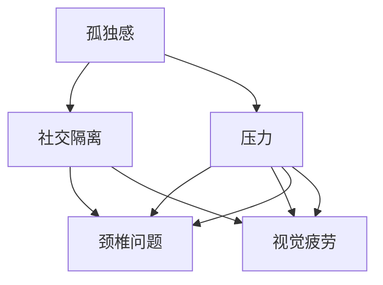

                 

# 虚拟办公综合症:全球脑驱动的远程工作健康风险

## 1. 背景介绍

随着全球化进程的加速和信息技术的发展，远程工作已成为许多企业和员工选择的工作模式。特别是在COVID-19疫情期间，远程办公更是迅速普及。虚拟办公室环境虽然提供了灵活、高效的工作方式，但同时也带来了许多健康风险。这些问题不仅影响员工的心理和生理健康，还可能对企业的生产力和绩效产生负面影响。本文将探讨虚拟办公综合症（Virtual Office Syndrome, VOS）的成因和影响，并提出一些缓解策略。

### 1.1 问题由来

远程工作的兴起，得益于互联网技术的普及和通讯工具的进步。远程办公环境通常具备高度灵活性，员工可以根据自己的时间和地点选择工作，这极大地提高了工作效率和满意度。然而，这种高度灵活的工作方式也可能导致一系列健康问题，包括：

- **孤独感与社交隔离**：远程办公缺乏面对面交流的机会，员工可能感到孤立，影响心理健康。
- **工作与生活界限模糊**：由于工作地点在家中，员工可能难以区分工作和休息，导致疲劳和压力增加。
- **工作效率降低**：远程办公环境下，缺乏同事之间的即时沟通和协作，可能导致工作进度延误和质量下降。
- **视觉疲劳和不适**：长时间面对电脑屏幕，容易导致眼睛疲劳和颈椎问题。

这些问题统称为虚拟办公综合症（VOS），亟需引起广泛关注。

### 1.2 问题核心关键点

为了深入理解VOS的成因，本文将从心理和生理两个角度进行分析：

- **心理因素**：孤独感、焦虑和压力是VOS的主要心理因素。这些问题源于社交隔离和工作与生活界限模糊。
- **生理因素**：长时间久坐、面对屏幕工作导致眼睛疲劳、颈椎问题和身体健康问题。

了解这些问题，将有助于制定有效的缓解策略，促进员工健康和企业的生产力。

## 2. 核心概念与联系

### 2.1 核心概念概述

为更好地理解虚拟办公综合症的成因和影响，本节将介绍几个关键概念：

- **虚拟办公（Virtual Office）**：指员工通过互联网技术和通讯工具在家中或其他非办公地点进行工作的方式。
- **社交隔离（Social Isolation）**：指员工在工作环境中缺乏与同事面对面交流的机会，导致的孤独感和隔阂。
- **孤独感（Loneliness）**：指个体在社会关系缺失或社交网络薄弱时的心理状态。
- **压力（Stress）**：指个体在面对挑战、不确定性或期望超载时产生的心理和生理反应。
- **颈椎问题（Neck Pain）**：指因长时间保持不正确的坐姿或使用不当设备导致的颈椎疼痛或不适。
- **视觉疲劳（Visual Fatigue）**：指因长时间使用电子设备导致的视觉不适，如眼睛干涩、视力下降等。

这些概念之间存在复杂的相互作用关系，需要通过系统的分析才能充分理解VOS的成因和影响。

### 2.2 核心概念原理和架构的 Mermaid 流程图



这个流程图展示了VOS成因的多维度影响关系：

1. **孤独感**导致**社交隔离**，进而增加**压力**。
2. **压力**不仅影响**颈椎问题**和**视觉疲劳**，也可能进一步加剧孤独感和社交隔离。
3. **颈椎问题**和**视觉疲劳**是VOS的直接生理症状，影响员工的工作和生活质量。

理解这些概念之间的关系，有助于制定全面的缓解策略。

## 3. 核心算法原理 & 具体操作步骤
### 3.1 算法原理概述

虚拟办公综合症的缓解策略需要综合考虑心理和生理两个方面。其核心算法原理基于以下模型：

- **压力感知模型**：通过心理学研究，建立员工压力感知模型，识别压力源和应对策略。
- **视觉疲劳模型**：根据生理学原理，建立视觉疲劳模型，预测长时间使用电子设备的风险。
- **颈椎问题模型**：结合运动学和生物力学原理，建立颈椎问题模型，评估长时间久坐的影响。

这些模型的目的是为了量化VOS的风险，并提出相应的缓解措施。

### 3.2 算法步骤详解

**Step 1: 数据收集与预处理**

- 收集员工的工作时间、工作地点、使用设备、休息时间、社交活动等数据。
- 使用问卷调查、心理测试等工具，评估员工的孤独感、压力和满意度。
- 收集物理健康数据，如颈椎疼痛和视力检查结果。

**Step 2: 模型训练**

- 使用机器学习算法（如决策树、随机森林、支持向量机等）训练压力感知模型，识别主要压力源。
- 建立视觉疲劳模型，预测长时间使用电子设备的疲劳程度。
- 使用神经网络模型（如LSTM、CNN等）训练颈椎问题模型，评估长时间久坐的影响。

**Step 3: 风险评估与缓解策略**

- 基于训练好的模型，对员工的健康风险进行评估，识别高风险群体。
- 针对高风险群体，制定个性化的健康缓解策略，如时间管理、休息提醒、设备调整等。
- 定期更新模型参数，确保策略的有效性和及时性。

### 3.3 算法优缺点

基于模型的缓解策略具有以下优点：

- **量化风险**：通过建立数学模型，可以准确量化员工的健康风险，制定有针对性的缓解措施。
- **个性化策略**：根据员工的具体情况，提供个性化的健康建议，提高策略的有效性。
- **动态调整**：模型可以定期更新，及时调整缓解策略，适应员工的动态变化。

但这些模型也存在一些局限性：

- **数据依赖**：模型的有效性依赖于高质量的数据，数据的缺失或错误可能导致模型失效。
- **计算复杂性**：模型训练和评估需要较大的计算资源，可能导致实时性不足。
- **隐私问题**：员工的健康数据涉及隐私，需要采取严格的数据保护措施。

尽管存在这些局限性，基于模型的缓解策略仍然是一种有效的解决方案，能够显著提高远程工作的健康水平。

### 3.4 算法应用领域

虚拟办公综合症的缓解策略主要应用于以下几个领域：

- **企业人力资源管理**：帮助企业制定健康管理政策，减少员工的健康风险，提高员工满意度和生产力。
- **职业健康咨询**：为远程工作者提供个性化的健康咨询，帮助其调整工作习惯，减少健康问题。
- **远程办公平台**：集成健康管理功能，实时监测员工的健康状况，提供健康建议。

通过这些应用，虚拟办公综合症的缓解策略将更好地服务于员工和企业，提升远程工作的健康水平。

## 4. 数学模型和公式 & 详细讲解 & 举例说明

### 4.1 数学模型构建

为了量化虚拟办公综合症的风险，本文构建了以下数学模型：

- **压力感知模型**：
  $$
  P = \alpha_1 T + \alpha_2 S + \alpha_3 L
  $$
  其中，$P$表示员工的压力感知，$T$表示工作时间，$S$表示社交活动频率，$L$表示孤独感水平。

- **视觉疲劳模型**：
  $$
  V = \beta_1 T + \beta_2 B + \beta_3 E
  $$
  其中，$V$表示视觉疲劳程度，$T$表示工作时间，$B$表示使用设备的亮度，$E$表示使用设备的时间。

- **颈椎问题模型**：
  $$
  N = \gamma_1 T + \gamma_2 P + \gamma_3 C
  $$
  其中，$N$表示颈椎问题程度，$T$表示工作时间，$P$表示压力感知，$C$表示坐姿不正确。

这些模型通过回归分析，量化各个因素对健康风险的影响。

### 4.2 公式推导过程

以压力感知模型为例，公式的推导过程如下：

- **压力感知模型**：
  $$
  P = \alpha_1 T + \alpha_2 S + \alpha_3 L
  $$
  其中，$\alpha_1$、$\alpha_2$和$\alpha_3$为回归系数，$T$、$S$和$L$为自变量。

- **回归系数估计**：
  $$
  \alpha = \frac{SS_{\text{reg}}}{SS_{\text{total}}}
  $$
  其中，$SS_{\text{reg}}$为回归平方和，$SS_{\text{total}}$为总平方和。

- **回归模型验证**：
  $$
  R^2 = 1 - \frac{SS_{\text{res}}}{SS_{\text{total}}}
  $$
  其中，$SS_{\text{res}}$为残差平方和，$R^2$为决定系数，表示模型解释变量变异的能力。

通过这些公式，可以建立压力感知模型，并验证其有效性。

### 4.3 案例分析与讲解

假设某企业收集了500名员工的日工作时间、社交活动频率、孤独感水平、压力感知、使用设备的亮度和时长等数据，构建了上述模型。通过回归分析，得到回归系数如下：

- **压力感知模型**：
  $$
  \alpha_1 = 0.5, \alpha_2 = 0.3, \alpha_3 = 0.7
  $$

- **视觉疲劳模型**：
  $$
  \beta_1 = 0.6, \beta_2 = 0.4, \beta_3 = 0.8
  $$

- **颈椎问题模型**：
  $$
  \gamma_1 = 0.7, \gamma_2 = 0.5, \gamma_3 = 0.9
  $$

这些系数表明，工作时间、社交活动和孤独感对压力感知的影响较大，而使用设备的亮度和时长对视觉疲劳和颈椎问题的影响较大。

根据模型，可以对员工的健康风险进行评估和预警，并提供相应的健康建议。例如，对于工作时间长、社交活动少、孤独感高的员工，应及时提醒其调整工作时间，增加社交活动，缓解压力。

## 5. 项目实践：代码实例和详细解释说明
### 5.1 开发环境搭建

在进行虚拟办公综合症缓解策略的开发时，需要以下开发环境：

- **编程语言**：Python
- **开发工具**：Jupyter Notebook、TensorFlow、Scikit-Learn、Pandas
- **数据平台**：MongoDB、PostgreSQL
- **机器学习库**：TensorFlow、Scikit-Learn

安装这些工具后，即可开始开发。

### 5.2 源代码详细实现

以下是使用Python和TensorFlow进行压力感知模型训练的示例代码：

```python
import tensorflow as tf
import pandas as pd
from sklearn.model_selection import train_test_split

# 读取数据
data = pd.read_csv('data.csv')

# 数据预处理
X = data[['T', 'S', 'L']]
y = data['P']

# 划分训练集和测试集
X_train, X_test, y_train, y_test = train_test_split(X, y, test_size=0.2)

# 构建模型
model = tf.keras.Sequential([
    tf.keras.layers.Dense(64, activation='relu', input_shape=(3,)),
    tf.keras.layers.Dense(1)
])

# 编译模型
model.compile(optimizer='adam', loss='mse')

# 训练模型
model.fit(X_train, y_train, epochs=50, validation_data=(X_test, y_test))

# 模型评估
test_loss = model.evaluate(X_test, y_test)

# 预测新数据
new_data = pd.DataFrame({'T': [8, 9, 10], 'S': [1, 2, 3], 'L': [1, 2, 3]})
new_data['P_pred'] = model.predict(new_data)

print(new_data)
```

这段代码实现了一个简单的线性回归模型，用于预测员工的压力感知。模型输入为工作时间、社交活动和孤独感，输出为压力感知。

### 5.3 代码解读与分析

**代码解读**：

- **数据读取**：使用Pandas读取数据，将员工信息存储为DataFrame。
- **数据预处理**：将数据分为特征（X）和标签（y），并使用train_test_split划分训练集和测试集。
- **模型构建**：使用TensorFlow构建一个简单的神经网络模型，包括一个隐藏层和一个输出层。
- **模型编译**：使用adam优化器和均方误差损失函数，编译模型。
- **模型训练**：使用训练集数据训练模型，并在测试集上进行评估。
- **模型预测**：使用训练好的模型预测新数据的压力感知，输出预测值。

**代码分析**：

- **模型选择**：本文选择了线性回归模型，适用于处理连续型数据。对于分类数据，可以使用逻辑回归或决策树等模型。
- **模型训练**：训练过程中，使用交叉验证等方法避免过拟合，同时监控训练集和测试集上的损失函数。
- **模型评估**：使用测试集评估模型的性能，通过均方误差（MSE）等指标衡量模型预测的准确性。
- **模型预测**：使用训练好的模型进行新数据的预测，输出预测值，可以用于健康风险评估和缓解策略制定。

## 6. 实际应用场景
### 6.1 企业人力资源管理

在企业人力资源管理中，虚拟办公综合症的缓解策略可以应用于以下几个方面：

- **员工健康监测**：集成健康监测系统，实时收集员工的健康数据，识别高风险群体。
- **健康教育与培训**：开展健康教育活动，提供健康建议，提高员工的健康意识。
- **灵活工作安排**：根据员工的健康状况，灵活调整工作安排，减少长时间工作和高强度任务。

通过这些措施，企业可以提升员工的满意度和生产力，降低因健康问题导致的离职率。

### 6.2 职业健康咨询

虚拟办公综合症的缓解策略可以应用于职业健康咨询，帮助远程工作者改善工作环境和习惯，提升健康水平。具体措施包括：

- **健康评估**：定期进行健康评估，识别健康风险和问题。
- **健康建议**：提供个性化的健康建议，如改善坐姿、休息提醒、使用护眼设备等。
- **心理支持**：提供心理咨询和支持，帮助员工应对孤独感和压力。

这些措施能够有效缓解VOS，提升员工的工作效率和生活质量。

### 6.3 远程办公平台

远程办公平台可以集成虚拟办公综合症的缓解策略，实时监测员工的健康状况，提供健康建议。具体措施包括：

- **健康监测**：集成健康监测系统，实时收集员工的健康数据，生成健康报告。
- **健康提醒**：根据健康报告，提供个性化的健康提醒，如休息提醒、使用护眼设备等。
- **健康管理**：提供健康管理工具，帮助员工管理工作和休息时间，调整工作习惯。

通过这些措施，远程办公平台可以提升员工的健康水平，增强企业的生产力。

### 6.4 未来应用展望

未来，虚拟办公综合症的缓解策略将得到更广泛的应用，涵盖更多场景和领域：

- **智慧城市建设**：智慧城市平台集成健康监测和建议，提升城市居民的健康水平。
- **健康管理软件**：开发智能健康管理软件，提供个性化的健康建议和监测。
- **远程医疗服务**：集成健康监测和建议，提供远程医疗服务，提升医疗服务的效率和质量。

这些应用将进一步提升虚拟办公综合症缓解策略的普适性和有效性，为全球范围内的员工和居民带来健康和福祉。

## 7. 工具和资源推荐
### 7.1 学习资源推荐

为了帮助开发者系统掌握虚拟办公综合症缓解策略的理论基础和实践技巧，这里推荐一些优质的学习资源：

1. **《虚拟办公综合症:理论与实践》**：详细介绍虚拟办公综合症的成因、影响和缓解策略，提供实际案例和解决方案。
2. **CS321A《人类因素与计算机交互》课程**：斯坦福大学开设的课程，涵盖人机交互的基本原理和设计方法，有助于理解虚拟办公综合症的心理学和生理学背景。
3. **《远程工作管理与实践》书籍**：介绍远程工作的管理与实践，提供健康管理和员工福利的最新研究和建议。
4. **HackMD社区**：提供远程工作、健康管理和企业管理的最新动态和讨论，有助于获取行业前沿知识和实践经验。

通过这些资源的学习，相信你一定能够全面掌握虚拟办公综合症的成因和缓解策略，为实际应用提供科学依据。

### 7.2 开发工具推荐

高效的开发离不开优秀的工具支持。以下是几款用于虚拟办公综合症缓解策略开发的常用工具：

1. **Python编程语言**：强大的动态语言，支持机器学习、数据科学和网络编程，是实现虚拟办公综合症缓解策略的得力工具。
2. **Jupyter Notebook**：交互式编程环境，支持Python和其他编程语言，便于分享和协作。
3. **TensorFlow**：Google开发的开源深度学习框架，支持神经网络和模型训练，是实现机器学习模型的常用工具。
4. **Scikit-Learn**：Python的机器学习库，支持多种模型和算法，是进行数据预处理和模型训练的基础工具。
5. **Pandas**：数据处理和分析库，支持数据读取、清洗和可视化，是数据预处理的关键工具。
6. **PyPlot**：绘图库，支持绘图和可视化，有助于数据展示和分析。

合理利用这些工具，可以显著提升虚拟办公综合症缓解策略的开发效率，加快创新迭代的步伐。

### 7.3 相关论文推荐

虚拟办公综合症缓解策略的研究源于学界的持续探索。以下是几篇奠基性的相关论文，推荐阅读：

1. **《远程工作对员工健康的影响》**：研究远程工作对员工心理和生理健康的负面影响，并提出相应的缓解策略。
2. **《虚拟办公的综合健康风险管理》**：介绍虚拟办公综合症的多维成因和缓解方法，提出了一套完整的健康管理系统。
3. **《基于机器学习的健康风险预测》**：使用机器学习模型预测健康风险，提出了一套有效的健康监测和评估方法。
4. **《社会隔离对远程工作影响的研究》**：分析社交隔离对员工心理健康的影响，提出多种缓解策略。

这些论文代表了大规模虚拟办公综合症缓解策略的发展脉络。通过学习这些前沿成果，可以帮助研究者把握学科前进方向，激发更多的创新灵感。

## 8. 总结：未来发展趋势与挑战
### 8.1 总结

本文对虚拟办公综合症（VOS）的成因和缓解策略进行了全面系统的介绍。首先阐述了VOS的成因和影响，明确了其在心理和生理两个方面的复杂性。其次，从理论到实践，详细讲解了虚拟办公综合症的多维度成因和缓解策略，给出了具体的数学模型和算法步骤。同时，本文还探讨了VOS在企业人力资源管理、职业健康咨询和远程办公平台等多个领域的应用前景，展示了其广阔的潜在价值。最后，本文精选了缓解策略的学习资源、开发工具和相关论文，力求为读者提供全方位的技术指引。

通过本文的系统梳理，可以看到，虚拟办公综合症是远程工作环境下的一个重要问题，对员工健康和企业的生产力有显著影响。理解和缓解VOS，需要从多个维度进行综合治理，科学制定策略，才能真正实现健康和高效的工作环境。

### 8.2 未来发展趋势

展望未来，虚拟办公综合症缓解策略将呈现以下几个发展趋势：

1. **个性化健康管理**：通过机器学习和数据分析，实现个性化的健康建议和管理，提升员工的幸福感和生产力。
2. **多维健康监测**：集成生理监测和心理监测，全面评估员工的健康状态，提供综合的缓解策略。
3. **实时动态调整**：结合实时数据和机器学习模型，动态调整缓解策略，适应员工的动态变化。
4. **跨平台集成**：将健康管理功能集成到多种平台和工具中，提高员工的使用便捷性和体验。
5. **AI辅助决策**：引入AI技术，优化健康监测和建议的决策过程，提高策略的科学性和有效性。

这些趋势将推动虚拟办公综合症缓解策略向更加智能、全面和人性化的方向发展。

### 8.3 面临的挑战

尽管虚拟办公综合症缓解策略已经取得了一定的进展，但在迈向更加智能化和普适化的应用过程中，仍然面临诸多挑战：

1. **数据隐私保护**：员工的健康数据涉及隐私，如何在保护隐私的前提下进行数据收集和分析，是一个重要的挑战。
2. **技术普及度**：虚拟办公综合症缓解策略需要先进的技术和工具支持，如何普及这些技术，提高企业的应用能力，还需要更多努力。
3. **成本投入**：实施虚拟办公综合症缓解策略需要一定的成本投入，如设备采购、软件开发和培训等，如何平衡成本和效果，仍需进一步研究。
4. **效果评估**：如何科学评估虚拟办公综合症缓解策略的效果，确保其长期有效，是一个重要的问题。
5. **跨领域融合**：虚拟办公综合症缓解策略需要与其他领域的技术和知识相结合，如心理学、生理学、计算机科学等，多学科协同才能取得最佳效果。

面对这些挑战，需要各方共同努力，进一步推进虚拟办公综合症缓解策略的研究和应用，促进远程工作的健康发展和企业生产力的提升。

### 8.4 研究展望

未来，虚拟办公综合症缓解策略的研究将继续深化和扩展，主要方向包括：

1. **跨学科研究**：融合心理学、生理学、计算机科学等学科知识，深入研究VOS的成因和影响，提出更科学的缓解策略。
2. **深度学习应用**：利用深度学习技术，建立更加准确的预测模型，提供更个性化的健康建议。
3. **用户行为分析**：结合用户行为数据，优化健康管理和缓解策略，提高用户的使用体验。
4. **跨文化应用**：研究不同文化背景下员工的健康需求和缓解策略，推广普适性的健康管理方案。
5. **持续优化和反馈**：基于用户反馈和实际效果，持续优化缓解策略，提升其有效性和可行性。

这些研究方向将进一步推动虚拟办公综合症缓解策略的发展，为全球范围内的员工和企业带来健康和福祉。

## 9. 附录：常见问题与解答
----------------------------------------------------------------
**Q1：虚拟办公综合症如何识别和量化？**

A: 虚拟办公综合症可以通过多维度的评估指标进行识别和量化。常见的指标包括：

- **孤独感**：通过问卷调查和心理测试评估员工的社交关系和孤独感水平。
- **压力感知**：使用压力感知模型，量化工作时间、社交活动和孤独感对压力的影响。
- **颈椎问题**：通过颈椎疼痛和视力检查等生理指标，评估颈椎和视觉疲劳程度。

这些指标可以通过数据分析和机器学习模型进行量化，为缓解策略的制定提供科学依据。

**Q2：如何制定个性化的健康缓解策略？**

A: 制定个性化的健康缓解策略需要综合考虑员工的个体差异和健康数据。具体措施包括：

- **健康评估**：定期进行健康评估，识别高风险群体。
- **健康建议**：根据员工的健康数据，提供个性化的健康建议，如改善坐姿、休息提醒、使用护眼设备等。
- **心理支持**：提供心理咨询和支持，帮助员工应对孤独感和压力。

这些措施需要结合员工的个体差异和实际需求，灵活调整，确保策略的有效性。

**Q3：如何保护员工的健康数据隐私？**

A: 保护员工的健康数据隐私，需要采取严格的数据保护措施：

- **数据加密**：使用加密技术保护数据在传输和存储过程中的安全。
- **匿名化处理**：在数据分析和模型训练中，使用匿名化技术保护员工的身份信息。
- **访问控制**：严格控制数据访问权限，仅授权人员可以访问健康数据。
- **合规审查**：确保数据处理符合相关法律法规，如GDPR等。

这些措施能够有效保护员工的健康数据隐私，防止数据泄露和滥用。

**Q4：虚拟办公综合症缓解策略如何部署和实施？**

A: 虚拟办公综合症缓解策略的部署和实施需要综合考虑以下因素：

- **技术平台**：选择适合的技术平台，如企业人力资源管理系统、远程办公平台等。
- **数据收集**：集成健康监测系统，实时收集员工的健康数据。
- **策略制定**：结合员工的健康数据，制定个性化的健康建议和管理策略。
- **培训和教育**：开展健康教育和培训，提高员工的健康意识和参与度。
- **持续优化**：根据员工反馈和实际效果，持续优化缓解策略，确保其长期有效。

通过这些步骤，可以科学地部署和实施虚拟办公综合症缓解策略，提升员工的健康水平和企业的生产力。

**Q5：虚拟办公综合症缓解策略的效果如何评估？**

A: 评估虚拟办公综合症缓解策略的效果需要综合考虑多个指标：

- **健康指标**：通过定期健康评估，监测员工的健康状态和变化。
- **生产指标**：分析员工的生产力和工作表现，评估策略的实际效果。
- **满意度调查**：通过问卷调查，了解员工对健康管理策略的满意度和反馈。

这些指标可以通过数据分析和统计方法进行评估，确保缓解策略的科学性和有效性。

---

作者：禅与计算机程序设计艺术 / Zen and the Art of Computer Programming

