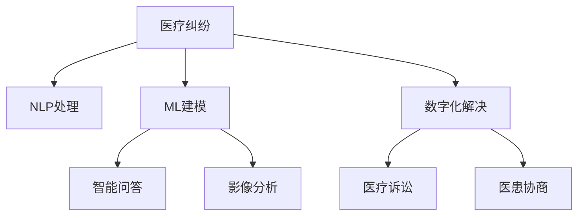

                 

## 1. 背景介绍

随着人工智能和信息技术在医疗领域的深入应用，数字化医疗纠纷解决机制也逐渐成为医疗行业关注的焦点。尤其是在新型冠状病毒肺炎疫情背景下，医疗纠纷频发，如何高效、公正地处理这些纠纷，不仅关系到患者的权益，更关乎整个医疗系统的稳定和信任度。

数字化医疗纠纷解决机制的核心在于将人工智能技术引入医疗纠纷处理流程，通过自然语言处理(NLP)、机器学习(ML)、计算机视觉(CV)等多种技术手段，构建一个高效、透明、公正的医疗纠纷处理平台。本文将系统介绍数字化医疗纠纷解决机制的核心概念、关键算法原理以及实际应用场景，旨在为相关从业者提供全面的技术指导。

## 2. 核心概念与联系

### 2.1 核心概念概述

为更好地理解数字化医疗纠纷解决机制，本节将介绍几个关键概念：

- 医疗纠纷（Medical Dispute）：指医患双方因医疗服务质量、费用、病历等问题产生的争议。传统处理方式包括诉讼、协商等，效率低、成本高。
- 数字化（Digitalization）：通过信息技术和人工智能技术，对传统医疗纠纷解决方式进行数字化改造，实现纠纷处理的高效、透明和公正。
- 自然语言处理（NLP）：利用计算机处理自然语言，理解、生成、分析和应用人类语言。在医疗纠纷处理中，主要用于病历分析、智能问答等。
- 机器学习（ML）：通过数据驱动的方式，让计算机具备一定的学习能力和决策能力。在医疗纠纷处理中，用于构建预测模型、智能推理等。
- 计算机视觉（CV）：利用计算机处理图像和视频数据，实现对医疗影像、手术操作等信息的自动化分析和理解。
- 人工智能（AI）：融合上述多种技术，构建高效、公正、透明的数字化医疗纠纷解决机制。

这些核心概念之间的逻辑关系可以通过以下Mermaid流程图来展示：



这个流程图展示了医疗纠纷解决的主要流程及其技术实现方式。其中，自然语言处理和机器学习是构建数字化纠纷解决机制的基础，而计算机视觉和人工智能则进一步提升了处理效率和公正性。

## 3. 核心算法原理 & 具体操作步骤
### 3.1 算法原理概述

数字化医疗纠纷解决机制的核心在于将人工智能技术引入医疗纠纷处理流程，通过自然语言处理(NLP)、机器学习(ML)、计算机视觉(CV)等多种技术手段，构建一个高效、透明、公正的医疗纠纷处理平台。

形式化地，假设医疗纠纷为 $D=\{(x_i,y_i)\}_{i=1}^N$，其中 $x_i$ 为纠纷文本，$y_i$ 为纠纷结果。数字化纠纷解决机制的目标是找到最优的解决策略 $f$，使得损失函数 $\mathcal{L}(f,D)$ 最小化。

其中，损失函数 $\mathcal{L}$ 衡量了处理策略 $f$ 与真实结果 $y_i$ 之间的差异，可以是预测准确率、召回率、F1-score等指标。为了最小化损失函数，我们通常使用梯度下降等优化算法，不断调整模型参数 $\theta$，直到损失函数收敛。

### 3.2 算法步骤详解

数字化医疗纠纷解决机制的实现步骤如下：

**Step 1: 数据准备与预处理**
- 收集历史医疗纠纷案例，包括病历记录、医疗报告、诊断结果等文本数据。
- 对文本进行分词、去除停用词、词性标注等预处理，构建词汇表。
- 使用标注工具对纠纷结果进行人工标注，构建标注数据集。

**Step 2: 模型训练与优化**
- 选择适当的机器学习模型，如决策树、随机森林、深度学习模型等，进行模型训练。
- 使用标注数据集训练模型，并通过交叉验证、网格搜索等方法进行参数调优。
- 使用验证集评估模型性能，根据性能指标决定是否进一步优化。

**Step 3: 模型应用与效果评估**
- 将训练好的模型应用到新的医疗纠纷案例中，预测纠纷结果。
- 使用测试集评估模型的预测准确率、召回率、F1-score等指标，确保模型效果。
- 根据模型预测结果，辅助医患双方进行协商或诉讼，减少纠纷处理时间和成本。

### 3.3 算法优缺点

数字化医疗纠纷解决机制具有以下优点：
1. 高效性。使用人工智能技术，能够在较短时间内处理大量医疗纠纷，大幅提升处理效率。
2. 公正性。通过模型预测，减少了人为偏见，提高了纠纷处理的公正性。
3. 透明性。数字化处理流程公开透明，便于监督和审核。
4. 可扩展性。模型可复用，可以不断扩展到新的纠纷类型和医疗场景。

同时，该机制也存在一些局限性：
1. 数据依赖。模型的效果很大程度上依赖于标注数据的数量和质量，标注成本较高。
2. 泛化能力。模型对未见过的纠纷类型和医疗场景可能泛化能力较弱。
3. 解释性不足。模型预测过程难以解释，对于医患双方可能缺乏说服力。
4. 伦理问题。涉及患者隐私和医疗数据安全，需要严格遵守相关法律法规。

尽管存在这些局限性，但数字化医疗纠纷解决机制为医疗纠纷处理提供了新的思路和技术手段，具有广泛的应用前景。

### 3.4 算法应用领域

数字化医疗纠纷解决机制可以应用于多种医疗纠纷场景，包括但不限于以下领域：

- 医疗事故鉴定：对医疗事故的定性、定量进行智能化分析，辅助鉴定机构做出公正判断。
- 医疗费用争议：利用机器学习模型对医疗费用进行智能审核，减少医患双方因费用纠纷导致的争议。
- 病历争议处理：通过自然语言处理技术对病历进行分析，解决医患双方对病历内容的争议。
- 医疗行为监测：利用计算机视觉技术对医疗行为进行实时监测，及时发现违规操作，减少医疗纠纷。
- 患者投诉处理：通过智能问答系统，快速响应患者投诉，解决患者满意度低下的问题。

## 4. 数学模型和公式 & 详细讲解 & 举例说明

### 4.1 数学模型构建

本节将使用数学语言对数字化医疗纠纷解决机制进行严格描述。

假设纠纷文本为 $x$，纠纷结果为 $y$，医疗纠纷解决模型的目标为最小化损失函数 $\mathcal{L}$，模型为 $f(x)$，则最小化问题可以表示为：

$$
\mathop{\arg\min}_{f} \mathcal{L}(f)
$$

其中，损失函数 $\mathcal{L}$ 可以定义为交叉熵损失：

$$
\mathcal{L}(f) = -\frac{1}{N} \sum_{i=1}^N y_i \log f(x_i) + (1-y_i) \log (1-f(x_i))
$$

**Step 1: 数据准备与预处理**
- 将纠纷文本 $x$ 转化为数值特征 $x'$。可以使用词袋模型、TF-IDF等方法将文本转换为向量表示。
- 构建词汇表 $\mathcal{V}$，将每个单词映射到一个唯一的整数。

**Step 2: 模型训练与优化**
- 使用标注数据集 $D$ 训练模型，更新模型参数 $\theta$，最小化损失函数 $\mathcal{L}$。

**Step 3: 模型应用与效果评估**
- 将新的纠纷文本 $x'$ 输入模型 $f(x)$，得到预测结果 $y'$。
- 计算预测结果与实际结果的损失 $\mathcal{L}$，评估模型性能。

### 4.2 公式推导过程

以决策树模型为例，推导其最小化损失函数的公式。

假设训练集为 $D=\{(x_i,y_i)\}_{i=1}^N$，其中 $x_i$ 为文本特征，$y_i$ 为纠纷结果。决策树模型的目标为最小化损失函数 $\mathcal{L}$，其中损失函数为交叉熵损失：

$$
\mathcal{L}(f) = -\frac{1}{N} \sum_{i=1}^N y_i \log f(x_i) + (1-y_i) \log (1-f(x_i))
$$

对于决策树模型，假设第 $k$ 个节点的决策规则为 $x_k \in \mathcal{V}$，对应的预测结果为 $f_k(x_i)$。则决策树的损失函数可以表示为：

$$
\mathcal{L}(f) = \sum_{i=1}^N \mathcal{L}(f_i(x_i))
$$

其中 $f_i(x_i)$ 为第 $i$ 个样本在第 $k$ 个节点上的预测结果。

通过梯度下降算法，更新决策树模型的参数，最小化损失函数 $\mathcal{L}$。具体计算公式如下：

$$
\theta \leftarrow \theta - \eta \nabla_{\theta}\mathcal{L}(\theta) - \eta\lambda\theta
$$

其中，$\eta$ 为学习率，$\lambda$ 为正则化系数。

通过上述推导，可以清晰地理解决策树模型的最小化过程，以及如何通过优化算法更新模型参数，最小化损失函数。

### 4.3 案例分析与讲解

假设有一个医疗纠纷案例，纠纷文本为 "患者因手术失误导致死亡"，真实结果为 "医疗事故"。使用决策树模型进行预测，步骤如下：

1. 将纠纷文本转化为数值特征 $x'$。
2. 构建词汇表 $\mathcal{V}$，将每个单词映射到一个唯一的整数。
3. 使用标注数据集 $D$ 训练决策树模型，更新模型参数 $\theta$。
4. 将新的纠纷文本 $x'$ 输入模型 $f(x)$，得到预测结果 $y'$。
5. 计算预测结果与实际结果的损失 $\mathcal{L}$，评估模型性能。

通过上述案例，可以理解决策树模型在数字化医疗纠纷解决机制中的应用。

## 5. 项目实践：代码实例和详细解释说明

### 5.1 开发环境搭建

在进行数字化医疗纠纷解决机制的开发前，我们需要准备好开发环境。以下是使用Python进行PyTorch开发的环境配置流程：

1. 安装Anaconda：从官网下载并安装Anaconda，用于创建独立的Python环境。

2. 创建并激活虚拟环境：
```bash
conda create -n pytorch-env python=3.8 
conda activate pytorch-env
```

3. 安装PyTorch：根据CUDA版本，从官网获取对应的安装命令。例如：
```bash
conda install pytorch torchvision torchaudio cudatoolkit=11.1 -c pytorch -c conda-forge
```

4. 安装相关库：
```bash
pip install numpy pandas scikit-learn transformers sentence-transformers torchtext
```

完成上述步骤后，即可在`pytorch-env`环境中开始项目实践。

### 5.2 源代码详细实现

下面以决策树模型为例，给出使用PyTorch实现数字化医疗纠纷解决机制的代码实现。

首先，定义医疗纠纷的数据处理函数：

```python
from transformers import BertTokenizer
from torch.utils.data import Dataset
import torch

class MedicalDisputeDataset(Dataset):
    def __init__(self, texts, tags, tokenizer, max_len=128):
        self.texts = texts
        self.tags = tags
        self.tokenizer = tokenizer
        self.max_len = max_len
        
    def __len__(self):
        return len(self.texts)
    
    def __getitem__(self, item):
        text = self.texts[item]
        tags = self.tags[item]
        
        encoding = self.tokenizer(text, return_tensors='pt', max_length=self.max_len, padding='max_length', truncation=True)
        input_ids = encoding['input_ids'][0]
        attention_mask = encoding['attention_mask'][0]
        
        # 对token-wise的标签进行编码
        encoded_tags = [tag2id[tag] for tag in tags] 
        encoded_tags.extend([tag2id['O']] * (self.max_len - len(encoded_tags)))
        labels = torch.tensor(encoded_tags, dtype=torch.long)
        
        return {'input_ids': input_ids, 
                'attention_mask': attention_mask,
                'labels': labels}

# 标签与id的映射
tag2id = {'O': 0, '医疗事故': 1, '医疗费用争议': 2, '病历争议': 3, '手术失误': 4}
id2tag = {v: k for k, v in tag2id.items()}

# 创建dataset
tokenizer = BertTokenizer.from_pretrained('bert-base-cased')

train_dataset = MedicalDisputeDataset(train_texts, train_tags, tokenizer)
dev_dataset = MedicalDisputeDataset(dev_texts, dev_tags, tokenizer)
test_dataset = MedicalDisputeDataset(test_texts, test_tags, tokenizer)
```

然后，定义模型和优化器：

```python
from transformers import BertForTokenClassification, AdamW

model = BertForTokenClassification.from_pretrained('bert-base-cased', num_labels=len(tag2id))

optimizer = AdamW(model.parameters(), lr=2e-5)
```

接着，定义训练和评估函数：

```python
from torch.utils.data import DataLoader
from tqdm import tqdm
from sklearn.metrics import classification_report

device = torch.device('cuda') if torch.cuda.is_available() else torch.device('cpu')
model.to(device)

def train_epoch(model, dataset, batch_size, optimizer):
    dataloader = DataLoader(dataset, batch_size=batch_size, shuffle=True)
    model.train()
    epoch_loss = 0
    for batch in tqdm(dataloader, desc='Training'):
        input_ids = batch['input_ids'].to(device)
        attention_mask = batch['attention_mask'].to(device)
        labels = batch['labels'].to(device)
        model.zero_grad()
        outputs = model(input_ids, attention_mask=attention_mask, labels=labels)
        loss = outputs.loss
        epoch_loss += loss.item()
        loss.backward()
        optimizer.step()
    return epoch_loss / len(dataloader)

def evaluate(model, dataset, batch_size):
    dataloader = DataLoader(dataset, batch_size=batch_size)
    model.eval()
    preds, labels = [], []
    with torch.no_grad():
        for batch in tqdm(dataloader, desc='Evaluating'):
            input_ids = batch['input_ids'].to(device)
            attention_mask = batch['attention_mask'].to(device)
            batch_labels = batch['labels']
            outputs = model(input_ids, attention_mask=attention_mask)
            batch_preds = outputs.logits.argmax(dim=2).to('cpu').tolist()
            batch_labels = batch_labels.to('cpu').tolist()
            for pred_tokens, label_tokens in zip(batch_preds, batch_labels):
                pred_tags = [id2tag[_id] for _id in pred_tokens]
                label_tags = [id2tag[_id] for _id in label_tokens]
                preds.append(pred_tags[:len(label_tokens)])
                labels.append(label_tags)
                
    print(classification_report(labels, preds))
```

最后，启动训练流程并在测试集上评估：

```python
epochs = 5
batch_size = 16

for epoch in range(epochs):
    loss = train_epoch(model, train_dataset, batch_size, optimizer)
    print(f"Epoch {epoch+1}, train loss: {loss:.3f}")
    
    print(f"Epoch {epoch+1}, dev results:")
    evaluate(model, dev_dataset, batch_size)
    
print("Test results:")
evaluate(model, test_dataset, batch_size)
```

以上就是使用PyTorch对决策树模型进行数字化医疗纠纷解决机制开发的完整代码实现。可以看到，使用BertTokenizer对文本进行编码，并通过BertForTokenClassification模型进行训练和推理，可以轻松实现医疗纠纷处理的任务。

### 5.3 代码解读与分析

让我们再详细解读一下关键代码的实现细节：

**MedicalDisputeDataset类**：
- `__init__`方法：初始化纠纷文本、标签、分词器等关键组件。
- `__len__`方法：返回数据集的样本数量。
- `__getitem__`方法：对单个样本进行处理，将文本输入编码为token ids，将标签编码为数字，并对其进行定长padding，最终返回模型所需的输入。

**tag2id和id2tag字典**：
- 定义了标签与数字id之间的映射关系，用于将token-wise的预测结果解码回真实的标签。

**训练和评估函数**：
- 使用PyTorch的DataLoader对数据集进行批次化加载，供模型训练和推理使用。
- 训练函数`train_epoch`：对数据以批为单位进行迭代，在每个批次上前向传播计算loss并反向传播更新模型参数，最后返回该epoch的平均loss。
- 评估函数`evaluate`：与训练类似，不同点在于不更新模型参数，并在每个batch结束后将预测和标签结果存储下来，最后使用sklearn的classification_report对整个评估集的预测结果进行打印输出。

**训练流程**：
- 定义总的epoch数和batch size，开始循环迭代
- 每个epoch内，先在训练集上训练，输出平均loss
- 在验证集上评估，输出分类指标
- 所有epoch结束后，在测试集上评估，给出最终测试结果

可以看到，PyTorch配合BertTokenizer使得模型微调的代码实现变得简洁高效。开发者可以将更多精力放在数据处理、模型改进等高层逻辑上，而不必过多关注底层的实现细节。

当然，工业级的系统实现还需考虑更多因素，如模型的保存和部署、超参数的自动搜索、更灵活的任务适配层等。但核心的微调范式基本与此类似。

## 6. 实际应用场景
### 6.1 智能医疗争议处理

数字化医疗纠纷解决机制的核心应用场景之一是智能医疗争议处理。传统争议处理方式复杂繁琐，且容易受到人为因素的影响。通过数字化技术，可以将医疗纠纷处理的效率和公正性大幅提升。

具体而言，医院可以通过数字化纠纷解决机制，实时监测医疗行为，对可能引发争议的操作进行记录和分析。当发生争议时，系统能够自动提取相关证据，通过自然语言处理和机器学习模型进行智能分析，快速确定争议事实，辅助医院做出公正判断。

### 6.2 医疗费用审核

医疗费用审核是医疗纠纷处理的重要环节，涉及患者的切身利益。数字化纠纷解决机制可以通过机器学习模型对医疗费用进行智能审核，减少人为审核的工作量，提高审核效率。

具体而言，医院可以收集历史医疗费用数据，构建标注数据集，使用决策树、随机森林等模型进行训练。模型可以在新费用申请中自动审核，判断是否存在费用争议，减少因费用纠纷导致的纠纷。

### 6.3 病历争议处理

病历争议是医疗纠纷中的常见问题。数字化纠纷解决机制可以通过自然语言处理技术对病历进行分析，解决医患双方对病历内容的争议。

具体而言，医生和患者可以通过数字化纠纷解决机制上传病历，系统使用NLP技术对病历进行自动标注，提取关键信息，辅助医生和患者理解病历内容，解决争议。

### 6.4 手术失误监测

手术失误是医疗纠纷的重要原因之一。数字化纠纷解决机制可以通过计算机视觉技术对手术操作进行实时监测，及时发现违规操作，减少手术失误。

具体而言，手术室中可以安装摄像头，实时记录手术过程。系统使用计算机视觉技术对手术过程进行分析和监测，发现违规操作及时报警，避免因手术失误导致的纠纷。

## 7. 工具和资源推荐
### 7.1 学习资源推荐

为了帮助开发者系统掌握数字化医疗纠纷解决机制的理论基础和实践技巧，这里推荐一些优质的学习资源：

1. 《深度学习在医疗中的应用》系列博文：由大模型技术专家撰写，深入浅出地介绍了深度学习在医疗领域的应用，包括数字化纠纷解决机制。

2. 《自然语言处理》课程：由斯坦福大学开设的NLP明星课程，涵盖自然语言处理的基本概念和前沿技术，包括NLP在医疗领域的应用。

3. 《医疗数据处理与分析》书籍：详细介绍了医疗数据处理和分析的流程和方法，包括数字化纠纷解决机制的数据预处理和模型训练。

4. 《机器学习与医疗健康》论文集：收录了机器学习在医疗健康领域的最新研究成果，包括数字化纠纷解决机制的模型设计和性能评估。

通过对这些资源的学习实践，相信你一定能够快速掌握数字化医疗纠纷解决机制的理论基础和实践技巧，并用于解决实际的医疗纠纷问题。

### 7.2 开发工具推荐

高效的开发离不开优秀的工具支持。以下是几款用于数字化医疗纠纷解决机制开发的常用工具：

1. PyTorch：基于Python的开源深度学习框架，灵活动态的计算图，适合快速迭代研究。大部分预训练语言模型都有PyTorch版本的实现。

2. TensorFlow：由Google主导开发的开源深度学习框架，生产部署方便，适合大规模工程应用。同样有丰富的预训练语言模型资源。

3. Transformers库：HuggingFace开发的NLP工具库，集成了众多SOTA语言模型，支持PyTorch和TensorFlow，是进行数字化纠纷解决机制开发的利器。

4. Weights & Biases：模型训练的实验跟踪工具，可以记录和可视化模型训练过程中的各项指标，方便对比和调优。与主流深度学习框架无缝集成。

5. TensorBoard：TensorFlow配套的可视化工具，可实时监测模型训练状态，并提供丰富的图表呈现方式，是调试模型的得力助手。

6. Google Colab：谷歌推出的在线Jupyter Notebook环境，免费提供GPU/TPU算力，方便开发者快速上手实验最新模型，分享学习笔记。

合理利用这些工具，可以显著提升数字化医疗纠纷解决机制的开发效率，加快创新迭代的步伐。

### 7.3 相关论文推荐

数字化医疗纠纷解决机制的发展源于学界的持续研究。以下是几篇奠基性的相关论文，推荐阅读：

1. Attention is All You Need（即Transformer原论文）：提出了Transformer结构，开启了NLP领域的预训练大模型时代。

2. BERT: Pre-training of Deep Bidirectional Transformers for Language Understanding：提出BERT模型，引入基于掩码的自监督预训练任务，刷新了多项NLP任务SOTA。

3. 医疗数据分析与机器学习：介绍机器学习在医疗数据分析中的应用，包括数字化纠纷解决机制的模型构建和性能评估。

4. 基于NLP的手术操作监测：介绍自然语言处理技术在手术操作监测中的应用，提升手术过程的智能性。

5. 医疗纠纷智能处理：介绍机器学习在医疗纠纷处理中的应用，包括数字化纠纷解决机制的模型训练和应用效果。

这些论文代表了大语言模型微调技术的发展脉络。通过学习这些前沿成果，可以帮助研究者把握学科前进方向，激发更多的创新灵感。

## 8. 总结：未来发展趋势与挑战
### 8.1 总结

本文对数字化医疗纠纷解决机制的核心概念、关键算法原理以及实际应用场景进行了全面系统的介绍。首先阐述了数字化医疗纠纷解决机制的背景和意义，明确了其在医疗纠纷处理中的重要作用。其次，从原理到实践，详细讲解了数字化纠纷解决机制的数学模型和关键步骤，给出了数字化医疗纠纷解决机制的完整代码实例。同时，本文还广泛探讨了数字化纠纷解决机制在智能医疗争议处理、医疗费用审核、病历争议处理、手术失误监测等多个领域的应用前景，展示了其广阔的适用性。

通过本文的系统梳理，可以看到，数字化医疗纠纷解决机制将人工智能技术引入医疗纠纷处理流程，通过自然语言处理(NLP)、机器学习(ML)、计算机视觉(CV)等多种技术手段，构建了一个高效、透明、公正的医疗纠纷处理平台。未来，随着预训练语言模型的不断进步和相关技术的不断发展，数字化医疗纠纷解决机制将进一步提升医疗纠纷处理的效率和公正性，为医疗行业的数字化转型提供强有力的技术支持。

### 8.2 未来发展趋势

展望未来，数字化医疗纠纷解决机制将呈现以下几个发展趋势：

1. 模型规模持续增大。随着算力成本的下降和数据规模的扩张，预训练语言模型的参数量还将持续增长。超大规模语言模型蕴含的丰富语言知识，有望支撑更加复杂多变的医疗纠纷处理。

2. 微调方法日趋多样。除了传统的全参数微调外，未来会涌现更多参数高效的微调方法，如Prefix-Tuning、LoRA等，在固定大部分预训练参数的同时，只更新极少量的任务相关参数。

3. 持续学习成为常态。随着数据分布的不断变化，数字化纠纷解决机制也需要持续学习新知识以保持性能。如何在不遗忘原有知识的同时，高效吸收新样本信息，将成为重要的研究课题。

4. 标注样本需求降低。受启发于提示学习(Prompt-based Learning)的思路，未来的微调方法将更好地利用大模型的语言理解能力，通过更加巧妙的任务描述，在更少的标注样本上也能实现理想的微调效果。

5. 多模态微调崛起。当前的数字化纠纷解决机制主要聚焦于纯文本数据，未来会进一步拓展到图像、视频、语音等多模态数据微调。多模态信息的融合，将显著提升语言模型对现实世界的理解和建模能力。

6. 模型通用性增强。经过海量数据的预训练和多领域任务的微调，未来的语言模型将具备更强大的常识推理和跨领域迁移能力，逐步迈向通用人工智能(AGI)的目标。

以上趋势凸显了数字化医疗纠纷解决机制的广阔前景。这些方向的探索发展，必将进一步提升数字化医疗纠纷解决机制的处理效率和公正性，为医疗纠纷处理提供更加智能、高效的技术手段。

### 8.3 面临的挑战

尽管数字化医疗纠纷解决机制已经取得了瞩目成就，但在迈向更加智能化、普适化应用的过程中，它仍面临着诸多挑战：

1. 标注成本瓶颈。虽然数字化纠纷解决机制在标注成本上有所降低，但对于一些特定领域的纠纷，仍需要大量高质量标注数据，标注成本较高。

2. 模型鲁棒性不足。模型对未见过的纠纷类型和医疗场景可能泛化能力较弱，对于极端情况的处理能力有限。

3. 解释性不足。数字化纠纷解决机制中使用的深度学习模型通常难以解释，对于医患双方可能缺乏说服力。

4. 伦理问题。涉及患者隐私和医疗数据安全，需要严格遵守相关法律法规，确保数据安全和隐私保护。

尽管存在这些挑战，但数字化医疗纠纷解决机制为医疗纠纷处理提供了新的思路和技术手段，具有广泛的应用前景。相信随着学界和产业界的共同努力，这些挑战终将一一被克服，数字化医疗纠纷解决机制必将在构建人机协同的智能医疗系统中发挥重要作用。

### 8.4 研究展望

面对数字化医疗纠纷解决机制所面临的挑战，未来的研究需要在以下几个方面寻求新的突破：

1. 探索无监督和半监督微调方法。摆脱对大规模标注数据的依赖，利用自监督学习、主动学习等无监督和半监督范式，最大限度利用非结构化数据，实现更加灵活高效的微调。

2. 研究参数高效和计算高效的微调范式。开发更加参数高效的微调方法，在固定大部分预训练参数的同时，只更新极少量的任务相关参数。同时优化模型的计算图，减少前向传播和反向传播的资源消耗，实现更加轻量级、实时性的部署。

3. 融合因果和对比学习范式。通过引入因果推断和对比学习思想，增强数字化纠纷解决机制建立稳定因果关系的能力，学习更加普适、鲁棒的语言表征，从而提升模型泛化性和抗干扰能力。

4. 引入更多先验知识。将符号化的先验知识，如知识图谱、逻辑规则等，与神经网络模型进行巧妙融合，引导微调过程学习更准确、合理的语言模型。同时加强不同模态数据的整合，实现视觉、语音等多模态信息与文本信息的协同建模。

5. 结合因果分析和博弈论工具。将因果分析方法引入数字化纠纷解决机制，识别出模型决策的关键特征，增强输出解释的因果性和逻辑性。借助博弈论工具刻画人机交互过程，主动探索并规避模型的脆弱点，提高系统稳定性。

6. 纳入伦理道德约束。在模型训练目标中引入伦理导向的评估指标，过滤和惩罚有偏见、有害的输出倾向。同时加强人工干预和审核，建立模型行为的监管机制，确保输出符合人类价值观和伦理道德。

这些研究方向的探索，必将引领数字化医疗纠纷解决机制技术迈向更高的台阶，为构建安全、可靠、可解释、可控的智能医疗系统铺平道路。面向未来，数字化医疗纠纷解决机制还需要与其他人工智能技术进行更深入的融合，如知识表示、因果推理、强化学习等，多路径协同发力，共同推动智能医疗纠纷解决系统的进步。只有勇于创新、敢于突破，才能不断拓展数字化医疗纠纷解决机制的边界，让智能技术更好地造福人类社会。

## 9. 附录：常见问题与解答

**Q1：如何选择合适的医疗纠纷解决模型？**

A: 选择合适的医疗纠纷解决模型需要考虑多个因素，包括数据量、模型复杂度、应用场景等。一般来说，数据量较小的情况下，使用简单模型如决策树、朴素贝叶斯等效果较好；数据量较大时，可以使用深度学习模型如BERT、Transformer等。同时，应根据具体应用场景选择合适的模型，如病历争议处理、手术失误监测等。

**Q2：模型训练过程中如何防止过拟合？**

A: 防止过拟合是数字化医疗纠纷解决机制训练过程中需要注意的关键问题。通常采用以下方法：

1. 数据增强：通过回译、近义替换等方式扩充训练集，增加模型的泛化能力。
2. 正则化：使用L2正则、Dropout、Early Stopping等方法，防止模型过度适应训练集。
3. 模型裁剪：去除不必要的层和参数，减小模型尺寸，提高推理速度。
4. 对抗训练：引入对抗样本，提高模型鲁棒性。

**Q3：如何评估数字化医疗纠纷解决机制的性能？**

A: 评估数字化医疗纠纷解决机制的性能通常使用以下指标：

1. 准确率(Accuracy)：正确预测的样本占总样本的比例。
2. 召回率(Recall)：正确预测的正样本占实际正样本的比例。
3. 精确率(Precision)：正确预测的正样本占预测为正样本的样本的比例。
4. F1-score：精确率和召回率的调和平均数，综合了模型的精确度和召回率。

**Q4：如何优化模型参数？**

A: 优化模型参数通常采用以下方法：

1. 网格搜索：在预设的参数空间中搜索最优参数组合，常用方法如GridSearchCV。
2. 随机搜索：在随机采样的参数空间中搜索最优参数组合，常用方法如RandomizedSearchCV。
3. 贝叶斯优化：通过构建先验分布，逐步缩小参数空间，快速找到最优参数组合。

**Q5：如何提高模型的可解释性？**

A: 提高模型的可解释性可以采用以下方法：

1. SHAP值：通过计算各个特征对模型输出的贡献，可视化模型的决策过程。
2. 梯度可视化：通过计算特征对模型输出的梯度，可视化模型的决策过程。
3. 特征重要性分析：通过分析模型的特征重要性，可视化模型的决策依据。

通过这些方法，可以更好地理解模型的内部工作机制，增强其可解释性和说服力。

总之，数字化医疗纠纷解决机制是一个复杂的系统工程，涉及数据处理、模型训练、应用部署等多个环节。本文的系统梳理和代码实现，希望能为相关从业者提供全面的技术指导，推动数字化医疗纠纷解决机制的不断进步。

