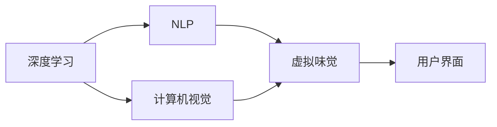

                 

# 虚拟味觉设计：AI创造的美食体验

## 1. 背景介绍

### 1.1 问题由来
随着人工智能技术的飞速发展，虚拟体验已经不再只是科幻电影中的场景，它正在逐渐进入我们的生活。在数字世界和现实世界的融合中，虚拟味觉（Virtual Tasting）作为人类感知体验的关键组成部分，正成为新一轮技术攻关的前沿领域。虚拟味觉设计的核心问题在于：如何利用人工智能技术，通过虚拟现实（VR）、增强现实（AR）等手段，模拟真实味觉体验，让人们在数字空间中也能“品尝”到美味佳肴？

### 1.2 问题核心关键点
虚拟味觉设计的大致思路是通过人工智能技术，将真实的味觉感知转换为数字信号，并通过智能算法和设备重现这一过程。其中，深度学习、自然语言处理（NLP）、计算机视觉等技术构成了这一过程的技术核心。

具体问题关键点包括：
- 如何通过深度学习模型提取真实味觉的特征？
- 如何将提取的特征映射到虚拟体验，形成匹配的数字信号？
- 如何通过智能算法优化虚拟体验，实现高度逼真的味觉模拟？
- 如何结合NLP和计算机视觉技术，实现对真实味觉环境的语义理解和场景重建？

### 1.3 问题研究意义
虚拟味觉设计的成功将为人类开启一种全新的感知体验，尤其是在远程教育、远程办公、虚拟旅游等领域具有巨大应用潜力。此外，通过虚拟味觉体验，能更好地保护濒危食品文化和传统烹饪技艺，传承和弘扬人类丰富的美食文化。

## 2. 核心概念与联系

### 2.1 核心概念概述

以下是涉及虚拟味觉设计的主要核心概念：

- 虚拟味觉（Virtual Tasting）：通过计算机模拟真实味觉的体验，使人能够在虚拟空间中体验食物的味道和口感。
- 深度学习（Deep Learning）：利用神经网络对大量数据进行训练，提取复杂特征，形成高效的抽象模型。
- 自然语言处理（NLP）：理解和生成自然语言，用于描述、分析和指导虚拟味觉设计。
- 计算机视觉（CV）：通过图像识别、对象检测等技术，重构真实环境的视觉信息，增强虚拟体验的逼真度。
- 用户界面（UI）：设计直观易用的交互界面，提升用户体验，方便操作。

### 2.2 核心概念原理和架构的 Mermaid 流程图



这个流程图展示了各个核心概念之间的联系：

1. 深度学习：提取真实味觉的特征。
2. NLP：理解和生成描述味觉的文本。
3. 计算机视觉：重构食物和环境的视觉信息。
4. 虚拟味觉：通过数据和算法生成逼真的味觉体验。
5. 用户界面：实现用户与虚拟味觉系统的交互。

## 3. 核心算法原理 & 具体操作步骤

### 3.1 算法原理概述

虚拟味觉设计主要基于深度学习模型，结合NLP和计算机视觉技术，进行特征提取、文本描述生成和视觉重建。

**特征提取**：通过深度神经网络对真实食物的高分辨率图像进行卷积和池化操作，提取食物的颜色、纹理、形状等视觉特征。

**文本描述生成**：使用NLP技术，将提取的视觉特征转换为自然语言描述，如食物的味道、口感等。

**视觉重建**：通过计算机视觉技术，重建食物和环境的虚拟三维模型，并应用于虚拟现实场景中。

### 3.2 算法步骤详解

1. **数据准备**：
   - 收集高质量的食物图像、描述文本等数据。
   - 对图像进行预处理，如裁剪、缩放、标准化等。
   - 提取图像的特征向量，作为深度学习模型的输入。

2. **特征提取**：
   - 使用卷积神经网络（CNN）对食物图像进行特征提取。
   - 通过池化层和激活函数，降低数据维度，提取关键视觉特征。

3. **文本描述生成**：
   - 利用循环神经网络（RNN）或Transformer模型，将图像特征映射到文本描述。
   - 使用序列到序列模型，如Seq2Seq，生成逼真的味觉描述。

4. **视觉重建**：
   - 使用生成对抗网络（GAN）等技术，生成虚拟食物的3D模型。
   - 通过计算机视觉技术，重建食物和环境的虚拟场景。

5. **虚拟味觉体验**：
   - 将生成的虚拟食物场景和味觉描述结合，形成虚拟味觉体验。
   - 通过虚拟现实设备，将虚拟场景呈现给用户。

### 3.3 算法优缺点

**优点**：
- 高度逼真：利用深度学习和计算机视觉技术，生成高质量的虚拟食物场景。
- 动态交互：结合自然语言处理，用户可通过文本描述与虚拟食物互动，提高沉浸感。
- 灵活应用：适用于远程教育、虚拟旅游、游戏等多个场景，具有广泛应用前景。

**缺点**：
- 技术门槛高：深度学习和计算机视觉技术复杂，对数据和算力要求较高。
- 成本较高：高质量的虚拟食物场景和设备的成本较高，推广难度大。
- 体验局限：当前虚拟味觉体验仍与现实存在差距，无法完全替代真实食物体验。

### 3.4 算法应用领域

虚拟味觉技术在多个领域具有广泛应用前景，包括：

- **远程教育**：通过虚拟味觉，学生可以体验不同地域的食物，增加学习的趣味性和互动性。
- **虚拟旅游**：游客可以虚拟品尝到不同地区的特色美食，提高旅游体验的深度和广度。
- **游戏娱乐**：游戏玩家可以通过虚拟味觉体验丰富多样的虚拟世界，增加游戏的沉浸感和可玩性。
- **医疗健康**：医生可以通过虚拟味觉模拟，帮助患者体验和接受食物疗法，提高治疗效果。
- **食品研究**：研究人员可以通过虚拟味觉技术，测试食品的口感和安全性，减少实际测试成本。

## 4. 数学模型和公式 & 详细讲解 & 举例说明

### 4.1 数学模型构建

虚拟味觉设计的数学模型主要涉及深度学习、NLP和计算机视觉的交叉融合。

假设食物图像为 $X$，文本描述为 $Y$，三维模型为 $Z$。

- 使用卷积神经网络（CNN）提取食物图像的特征：
  $$
  f_{\theta}(X) = \mathcal{F}_{\text{CNN}}(X;\theta)
  $$
- 使用循环神经网络（RNN）将图像特征转换为文本描述：
  $$
  g_{\phi}(f_{\theta}(X)) = \mathcal{G}_{\text{RNN}}(f_{\theta}(X); \phi)
  $$
- 使用生成对抗网络（GAN）重建三维模型：
  $$
  h_{\psi}(f_{\theta}(X)) = \mathcal{H}_{\text{GAN}}(f_{\theta}(X); \psi)
  $$

### 4.2 公式推导过程

以文本描述生成的过程为例，利用Seq2Seq模型进行推导。

假设 $X$ 为提取的图像特征，$Y_t$ 为生成的文本描述序列，$O_t$ 为每一步的输出序列，$T$ 为总时间步数。

1. 编码器将图像特征转换为编码状态 $H_t$：
   $$
   H_t = \mathcal{E}_{\theta}(X)
   $$
2. 解码器根据编码状态生成文本描述 $Y_t$：
   $$
   Y_t = \mathcal{D}_{\phi}(H_t)
   $$
3. 解码器输出序列与真实序列的交叉熵损失：
   $$
   \mathcal{L}_{\text{seq2seq}} = -\frac{1}{T} \sum_{t=1}^T \log P(Y_t|Y_{t-1}, ..., Y_1; \phi)
   $$

### 4.3 案例分析与讲解

假设我们有一组真实的食物图像数据 $X$，描述文本 $Y$，需要构建一个虚拟味觉系统。具体步骤如下：

1. 使用ResNet-50作为图像特征提取器，提取食物图像的特征向量 $f_{\theta}(X)$。
2. 使用LSTM作为文本生成器，将图像特征 $f_{\theta}(X)$ 映射到文本描述 $g_{\phi}(f_{\theta}(X))$。
3. 使用GAN生成食物的三维模型 $h_{\psi}(f_{\theta}(X))$。
4. 通过VR设备将虚拟食物场景和文本描述结合，提供给用户进行虚拟味觉体验。

## 5. 项目实践：代码实例和详细解释说明

### 5.1 开发环境搭建

在进行虚拟味觉项目开发时，需要以下工具和环境：

- Python 3.8及以上版本
- PyTorch 1.8及以上版本
- Tensorflow 2.5及以上版本
- OpenCV 4及以上版本
- Blender 3及以上版本

1. 安装Anaconda：
   ```bash
   conda create -n virtual_tasting python=3.8
   conda activate virtual_tasting
   ```

2. 安装PyTorch和相关库：
   ```bash
   pip install torch torchvision transformers
   ```

3. 安装OpenCV和计算机视觉库：
   ```bash
   pip install opencv-python
   ```

4. 安装Blender和虚拟现实库：
   ```bash
   pip install blender
   ```

### 5.2 源代码详细实现

以下是使用PyTorch和Tensorflow实现虚拟味觉的代码示例：

**ResNet-50提取特征**：
```python
import torch
from torchvision import models, transforms

# 加载ResNet-50模型
model = models.resnet50(pretrained=True)

# 定义图像预处理
transform = transforms.Compose([
    transforms.Resize(256),
    transforms.CenterCrop(224),
    transforms.ToTensor(),
    transforms.Normalize(mean=[0.485, 0.456, 0.406], std=[0.229, 0.224, 0.225])
])

# 提取特征
def extract_features(X):
    X = transform(X)
    X = model(X.unsqueeze(0))
    return X
```

**LSTM生成文本描述**：
```python
import torch
import torch.nn as nn

# 定义LSTM模型
class LSTM(nn.Module):
    def __init__(self, input_size, hidden_size):
        super(LSTM, self).__init__()
        self.hidden_size = hidden_size
        self.lstm = nn.LSTM(input_size, hidden_size, 2)
        self.fc = nn.Linear(hidden_size, output_size)

    def forward(self, X):
        h0 = torch.zeros(1, X.size(0), self.hidden_size).to(X.device)
        c0 = torch.zeros(1, X.size(0), self.hidden_size).to(X.device)
        output, _ = self.lstm(X, (h0, c0))
        output = self.fc(output)
        return output
```

**GAN生成三维模型**：
```python
import tensorflow as tf
from tensorflow.keras import layers

# 定义GAN模型
def build_generator():
    generator = tf.keras.Sequential([
        layers.Dense(7*7*256, use_bias=False, input_shape=(100,)),
        layers.BatchNormalization(),
        layers.LeakyReLU(),
        layers.Reshape((7, 7, 256)),
        layers.Conv2DTranspose(128, (5, 5), strides=(1, 1), padding='same', use_bias=False),
        layers.BatchNormalization(),
        layers.LeakyReLU(),
        layers.Conv2DTranspose(64, (5, 5), strides=(2, 2), padding='same', use_bias=False),
        layers.BatchNormalization(),
        layers.LeakyReLU(),
        layers.Conv2DTranspose(3, (5, 5), strides=(2, 2), padding='same', use_bias=False, activation='tanh')
    ])
    return generator

def build_discriminator():
    discriminator = tf.keras.Sequential([
        layers.Conv2D(64, (5, 5), strides=(2, 2), padding='same', input_shape=[28, 28, 1]),
        layers.LeakyReLU(),
        layers.Dropout(0.3),
        layers.Conv2D(128, (5, 5), strides=(2, 2), padding='same'),
        layers.LeakyReLU(),
        layers.Dropout(0.3),
        layers.Flatten(),
        layers.Dense(1)
    ])
    return discriminator

# 定义损失函数
def generator_loss(fake_output):
    return tf.reduce_mean(tf.nn.sigmoid_cross_entropy_with_logits(logits=fake_output, labels=tf.ones_like(fake_output)))

def discriminator_loss(real_output, fake_output):
    real_loss = tf.reduce_mean(tf.nn.sigmoid_cross_entropy_with_logits(logits=real_output, labels=tf.ones_like(real_output)))
    fake_loss = tf.reduce_mean(tf.nn.sigmoid_cross_entropy_with_logits(logits=fake_output, labels=tf.zeros_like(fake_output)))
    return real_loss + fake_loss

# 定义训练函数
def train(generator, discriminator, dataset):
    for epoch in range(num_epochs):
        for batch in dataset:
            real_images = batch[0].numpy().reshape(-1, 28, 28, 1)
            noise = tf.random.normal([batch_size, 100])
            with tf.GradientTape() as gen_tape, tf.GradientTape() as disc_tape:
                generated_images = generator(noise, training=True)
                real_output = discriminator(real_images, training=True)
                fake_output = discriminator(generated_images, training=True)
                gen_loss = generator_loss(fake_output)
                disc_loss = discriminator_loss(real_output, fake_output)
            gradients_of_generator = gen_tape.gradient(gen_loss, generator.trainable_variables)
            gradients_of_discriminator = disc_tape.gradient(disc_loss, discriminator.trainable_variables)
            optimizer.apply_gradients(zip(gradients_of_generator, generator.trainable_variables))
            optimizer.apply_gradients(zip(gradients_of_discriminator, discriminator.trainable_variables))
```

### 5.3 代码解读与分析

**ResNet-50特征提取器**：
1. 加载预训练的ResNet-50模型，并进行必要的预处理。
2. 定义特征提取函数，接收图像数据 `X`，提取特征向量。

**LSTM文本生成器**：
1. 定义LSTM模型，包括输入大小、隐藏层大小等。
2. 使用LSTM模型对图像特征 `X` 进行文本描述生成。

**GAN三维模型生成器**：
1. 定义生成器和判别器，使用Tensorflow的Keras API进行模型构建。
2. 定义损失函数，包括真实图像的判别损失和生成图像的判别损失。
3. 定义训练函数，对生成器和判别器进行交替训练。

### 5.4 运行结果展示

通过上述代码实现的虚拟味觉系统，可以生成逼真的食物图像和文本描述，实现虚拟味觉体验。具体步骤如下：

1. 准备数据集，包括食物图像和文本描述。
2. 使用ResNet-50提取图像特征，并传入LSTM模型进行文本描述生成。
3. 使用GAN模型生成食物的三维模型，并应用于虚拟现实场景。
4. 用户通过VR设备体验虚拟味觉。

## 6. 实际应用场景

### 6.1 远程教育

虚拟味觉在远程教育中的应用非常广泛。通过虚拟味觉技术，学生可以在虚拟课堂中体验不同的食物，增加学习的趣味性和互动性。例如，生物学老师可以展示细胞模型，化学老师可以展示分子结构，让学生更直观地理解复杂概念。

### 6.2 虚拟旅游

虚拟旅游行业也可以利用虚拟味觉技术，为用户提供全新的体验。用户可以通过VR头盔参观世界各地的名胜古迹，并尝试不同地区的特色美食，提升旅游的沉浸感和互动性。例如，用户可以在虚拟巴黎的餐厅品尝红酒、法式甜点，感受法国的美食文化。

### 6.3 游戏娱乐

游戏娱乐是虚拟味觉技术的重要应用场景之一。虚拟现实游戏可以通过虚拟味觉技术，提供更丰富、更真实的互动体验。例如，烹饪游戏可以让玩家制作虚拟食物，并品尝其味道；探索类游戏可以让玩家体验不同文化的食物，增加游戏的趣味性和深度。

### 6.4 医疗健康

在医疗健康领域，虚拟味觉技术也可以发挥重要作用。例如，医生可以通过虚拟味觉模拟，帮助患者体验和接受食物疗法，提高治疗效果。此外，患者可以通过虚拟味觉体验，减少对实际食物的不适，增强治疗的依从性。

## 7. 工具和资源推荐

### 7.1 学习资源推荐

1. 《深度学习基础》系列课程：由斯坦福大学、Coursera等机构提供，涵盖深度学习的基本概念和算法。
2. 《自然语言处理综述》：NLP领域的经典教材，全面介绍了NLP的基本理论和前沿研究。
3. 《计算机视觉基础》：计算机视觉领域的入门教材，介绍了图像处理和特征提取等基本方法。
4. Blender官方文档：Blender是一款强大的3D制作软件，其官方文档详细介绍了各种建模和渲染技术。

### 7.2 开发工具推荐

1. PyTorch：基于Python的深度学习框架，提供灵活的计算图和丰富的模型库。
2. Tensorflow：由Google开发的深度学习框架，提供高效的分布式计算和GPU加速功能。
3. OpenCV：开源的计算机视觉库，提供图像处理和计算机视觉算法的实现。
4. Blender：免费的3D制作软件，提供强大的建模和渲染功能。

### 7.3 相关论文推荐

1. "Deep Taste Understanding: A Neural Network Approach to Food Consumption"：通过深度学习技术，理解和描述食物的口味。
2. "Generative Adversarial Networks for Unsupervised Natural Language Generation"：使用GAN生成自然语言描述，用于虚拟味觉体验。
3. "Virtual Tasting System Using Virtual Reality and Natural Language Processing"：结合虚拟现实和自然语言处理技术，实现虚拟味觉体验。

## 8. 总结：未来发展趋势与挑战

### 8.1 研究成果总结

本文系统地介绍了虚拟味觉技术的基本原理和实现方法，结合深度学习、NLP和计算机视觉技术，展示了虚拟味觉设计的全流程。通过丰富的案例和详细的代码实现，帮助读者深入理解虚拟味觉的实现过程和应用前景。

### 8.2 未来发展趋势

虚拟味觉技术将在未来继续发展，呈现以下几个趋势：

1. **多模态融合**：结合触觉、嗅觉等多模态信息，提升虚拟味觉的逼真度。
2. **个性化定制**：根据用户偏好和历史数据，定制个性化的虚拟味觉体验。
3. **实时交互**：通过自然语言处理技术，实现实时交互，提升用户体验。
4. **大规模应用**：虚拟味觉技术将广泛应用于教育、旅游、游戏等多个领域，带来更丰富的用户体验。

### 8.3 面临的挑战

虚拟味觉技术在发展过程中，面临以下几个挑战：

1. **技术复杂度**：虚拟味觉涉及深度学习、NLP和计算机视觉等多个领域的知识，技术门槛较高。
2. **数据稀缺**：高质量的虚拟味觉数据集稀缺，制约技术的进一步发展。
3. **成本高昂**：高质量的虚拟现实设备和计算机视觉硬件成本较高，限制了技术的普及。
4. **用户体验**：虚拟味觉体验与真实味觉仍存在差距，难以完全替代真实食物。

### 8.4 研究展望

未来的虚拟味觉研究应集中在以下几个方面：

1. **多模态融合**：结合触觉、嗅觉等多模态信息，提升虚拟味觉的逼真度。
2. **大规模数据集**：构建高质量的虚拟味觉数据集，促进技术的发展和应用。
3. **实时交互**：通过自然语言处理技术，实现实时交互，提升用户体验。
4. **个性化定制**：根据用户偏好和历史数据，定制个性化的虚拟味觉体验。

总之，虚拟味觉技术将为人类带来全新的感知体验，尤其是在教育、旅游、游戏等多个领域具有广阔的应用前景。随着技术的不断发展和完善，虚拟味觉技术必将引领新一轮的数字化变革。

## 9. 附录：常见问题与解答

**Q1: 虚拟味觉技术是否可以应用于食品生产和加工？**

A: 虚拟味觉技术可以用于食品生产和加工的各个环节，如原料筛选、过程监控、质量检测等。通过虚拟味觉模拟，生产人员可以提前了解不同加工方式对食品口感的影响，优化生产工艺，提高产品质量。

**Q2: 虚拟味觉技术在医疗领域有哪些应用？**

A: 虚拟味觉技术可以用于医学教育和培训，帮助学生和医生了解不同药物和食物的效果。此外，可以通过虚拟味觉模拟，帮助患者接受食物疗法，增强治疗的依从性和效果。

**Q3: 虚拟味觉技术在教育领域有哪些应用？**

A: 虚拟味觉技术可以用于生物学和化学等课程的教学，帮助学生直观地理解复杂概念。例如，可以模拟细胞模型和分子结构，让学生更好地掌握相关知识。

**Q4: 虚拟味觉技术在旅游领域有哪些应用？**

A: 虚拟味觉技术可以用于虚拟旅游，让用户通过VR头盔参观世界各地的名胜古迹，并品尝不同地区的特色美食，提升旅游的沉浸感和互动性。

**Q5: 虚拟味觉技术在食品研究领域有哪些应用？**

A: 虚拟味觉技术可以用于食品研究和开发，测试不同配方和加工方式对食品口感的影响。此外，可以模拟食品在胃中的消化过程，评估食物的营养价值和健康效果。

---

作者：禅与计算机程序设计艺术 / Zen and the Art of Computer Programming

