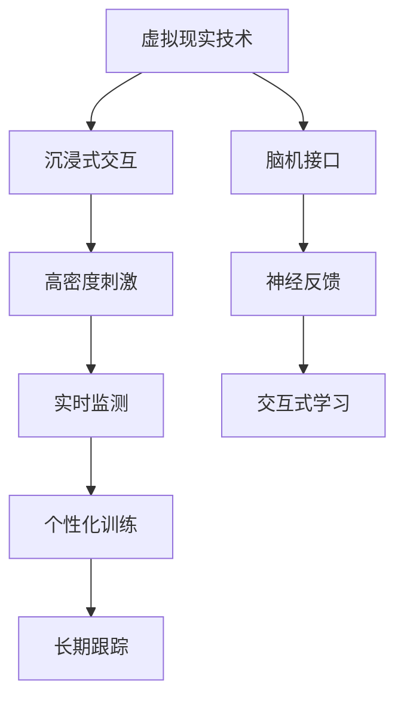

                 

# 虚拟现实技术在注意力训练中的应用

> 关键词：虚拟现实(VR)技术、注意力训练、交互式学习、沉浸式环境、脑机接口(BMI)、神经反馈、认知功能提升

## 1. 背景介绍

### 1.1 问题由来
在现代社会中，注意力缺陷多动障碍(ADHD)、抑郁症等注意力相关问题的发病率不断上升。传统的注意力训练方法，如心理治疗、药物干预等，往往效果有限，且难以长期坚持。为此，科学家们寻求新的突破，试图利用科技手段辅助注意力训练，提升注意力水平。

虚拟现实技术(Virtual Reality, VR)作为近年来的热门话题，因其沉浸式、交互式的特点，被认为具有极大的潜力应用于注意力训练。VR通过提供高仿真的虚拟环境，可以模拟各种现实场景，辅助用户进行深度沉浸式的注意力练习。

### 1.2 问题核心关键点
在注意力训练中，VR技术的关键点在于如何设计高效的训练任务，构建沉浸式的交互环境，以及如何监测和反馈用户的注意力状态。这需要综合运用脑科学、心理学、计算机视觉等领域的知识，进行科学设计和实验验证。

具体来说，VR在注意力训练中的应用涉及以下几个核心关键点：
1. 沉浸式交互：设计真实可信的虚拟环境，模拟真实世界的认知任务。
2. 高密度刺激：通过高频率、多维度的视觉、听觉、触觉刺激，提高用户的注意力水平。
3. 实时监测：利用生物电信号监测用户的注意力状态，实时反馈训练效果。
4. 个性化训练：根据用户的注意力水平动态调整训练强度和难度，进行个性化训练。
5. 长期跟踪：通过定期评估和反馈，持续监测用户的注意力水平和提升效果。

## 2. 核心概念与联系

### 2.1 核心概念概述

为更好地理解VR技术在注意力训练中的应用，本节将介绍几个关键概念：

- 虚拟现实技术(Virtual Reality, VR)：通过计算机生成的高仿真的三维视觉、听觉、触觉等环境，使用户沉浸在虚拟世界中的技术。

- 注意力训练：通过特定任务训练提升用户的注意力水平和认知功能，例如视觉注意、听觉注意、任务切换等。

- 脑机接口(Brain-Computer Interface, BMI)：利用生物电信号将人脑与计算机系统进行交互的技术。

- 神经反馈(Neural Feedback)：通过实时监测和反馈神经活动，引导用户进行有效的自我调节和训练。

- 交互式学习(Interactive Learning)：用户通过与环境的互动，完成学习任务，提升学习效果。

- 沉浸式环境(Immersive Environment)：利用视觉、听觉、触觉等感官模拟现实世界，提供深度的沉浸式体验。

这些核心概念之间通过以下Mermaid流程图进行联系：



通过这个流程图，我们可以看到，VR技术在注意力训练中的应用流程：首先通过沉浸式交互和高密度刺激，构建深度沉浸式环境，然后通过实时监测和神经反馈，进行个性化训练和长期跟踪，最后通过交互式学习，帮助用户提升注意力水平。

## 3. 核心算法原理 & 具体操作步骤

### 3.1 算法原理概述

VR技术在注意力训练中的应用，本质上是通过沉浸式环境和高密度刺激，引导用户进行深度交互和自我调节，从而提升注意力水平。其核心算法包括：

- 注意力训练模型：通过特定任务的训练，提升用户的注意力水平和认知功能。

- 注意力监测算法：利用生物电信号监测用户的注意力状态，进行实时反馈。

- 自适应训练算法：根据用户的注意力水平，动态调整训练强度和难度，实现个性化训练。

- 长期跟踪算法：通过定期评估和反馈，持续监测用户的注意力水平和提升效果。

### 3.2 算法步骤详解

VR技术在注意力训练中的具体操作步骤如下：

**Step 1: 环境设计与仿真**
- 设计符合任务要求的虚拟环境，包括虚拟场景、虚拟角色、虚拟交互等。
- 使用Unity、Unreal Engine等工具，实现虚拟环境的可视化仿真。

**Step 2: 注意力训练任务设计**
- 根据任务类型和用户需求，设计适合的注意力训练任务。如视觉搜索、空间记忆、目标追踪等。
- 定义任务的目标、规则、反馈等关键元素，确保任务的可玩性和有效性。

**Step 3: 生物电监测与神经反馈**
- 使用脑电图(EEG)、功能性磁共振成像(fMRI)等技术，监测用户的注意力状态和脑电活动。
- 根据监测结果，实时调整任务的难度和反馈信号，引导用户进行有效的自我调节和训练。

**Step 4: 个性化训练与长期跟踪**
- 根据用户的注意力水平和训练效果，动态调整训练强度和难度，进行个性化训练。
- 定期评估用户的注意力水平和认知功能，进行长期跟踪和反馈，持续优化训练方案。

**Step 5: 数据分析与优化**
- 收集和分析用户的训练数据，评估训练效果，进行优化和改进。
- 结合心理学、认知科学等领域的知识，不断优化训练任务和算法，提升训练效果。

### 3.3 算法优缺点

VR技术在注意力训练中具有以下优点：
1. 沉浸式体验：提供深度沉浸式环境，使用户更容易集中注意力。
2. 高密度刺激：通过高频率、多维度的视觉、听觉、触觉刺激，提高注意力水平。
3. 实时反馈：实时监测和反馈用户的注意力状态，帮助用户进行有效的自我调节和训练。
4. 个性化训练：根据用户的注意力水平动态调整训练强度和难度，实现个性化训练。

同时，该方法也存在一些局限性：
1. 设备成本高：VR设备和相关传感器价格较高，对用户经济负担较大。
2. 技术门槛高：需要专业的软件和硬件支持，以及相关技术人才的培训。
3. 数据隐私问题：生物电信号等个人隐私数据容易泄露，需严格保护。
4. 设备兼容性差：不同厂商的VR设备和传感器兼容性较差，影响用户体验。

尽管存在这些局限性，但就目前而言，VR技术在注意力训练中的应用前景广阔，尤其是在一些难以通过传统方法治疗的注意力相关疾病中，具有重要应用价值。

### 3.4 算法应用领域

VR技术在注意力训练中的应用，可以广泛应用于以下几个领域：

1. ADHD(注意力缺陷多动障碍)：通过沉浸式训练任务，帮助ADHD患者提升注意力水平和认知功能，缓解其注意力不集中、冲动控制差等问题。

2. 抑郁症：利用虚拟环境中的放松训练和认知任务，帮助抑郁症患者改善注意力和情绪状态。

3. 学习障碍：通过交互式学习任务和个性化训练，帮助学习障碍儿童提升注意力水平和学习能力。

4. 脑损伤康复：利用虚拟环境进行认知训练，帮助脑损伤患者恢复注意力和认知功能。

5. 职业训练：通过虚拟环境中的模拟训练，提升飞行员、军人、教师等职业人员的注意力和任务处理能力。

## 4. 数学模型和公式 & 详细讲解 & 举例说明

### 4.1 数学模型构建

在注意力训练中，VR技术的应用涉及多个维度和层面，其数学模型也较为复杂。以下是几个关键模型的简要介绍：

- 注意力监测模型：利用脑电图(EEG)等生物电信号，监测用户的注意力状态，构建数学模型进行实时反馈。
- 个性化训练模型：根据用户的注意力水平和训练效果，动态调整训练强度和难度，构建数学模型进行个性化训练。
- 长期跟踪模型：定期评估用户的注意力水平和认知功能，构建数学模型进行长期跟踪和反馈。

### 4.2 公式推导过程

以下以注意力监测模型为例，推导脑电图(EEG)监测和反馈的数学公式。

记EEG信号为$x(t)$，注意力水平为$A(t)$，定义注意力监测模型为：

$$
A(t) = f(x(t), \theta)
$$

其中$f$为模型函数，$\theta$为模型参数。例如，可以使用线性回归模型、支持向量机等算法，进行注意力监测。

利用EEG信号$x(t)$，可以计算出注意力水平$A(t)$，然后根据$A(t)$动态调整训练任务的难度和反馈信号，进行实时反馈和训练。

### 4.3 案例分析与讲解

以空间记忆任务为例，解释VR技术在注意力训练中的应用。

在虚拟环境中，设计一个空间记忆任务：用户需要在一定时间内在虚拟场景中记住并重新定位多个标记点的位置。

首先，通过EEG信号监测用户的注意力状态，如果注意力水平低于阈值，则降低任务难度，提示用户集中注意力；如果注意力水平过高，则增加任务难度，防止用户过于放松。

然后，根据用户的注意力水平和训练效果，动态调整训练强度和难度，进行个性化训练。例如，对于注意力水平较低的用户，可以使用简单的标记点记忆任务，逐步提高难度，直至达到目标水平。

最后，定期评估用户的注意力水平和认知功能，进行长期跟踪和反馈，持续优化训练方案。例如，通过记录和分析用户的任务完成时间、准确率等指标，评估训练效果，并据此调整训练方案。

## 5. 项目实践：代码实例和详细解释说明

### 5.1 开发环境搭建

在进行VR注意力训练项目的开发前，需要准备好开发环境。以下是使用Unity3D进行VR注意力训练的开发环境配置流程：

1. 安装Unity3D：从Unity官网下载并安装Unity3D，创建新的项目文件。

2. 配置VR设备：确保VR头盔、手柄等设备连接正常，并安装相应的驱动程序。

3. 安装插件：安装Unity3D的VR插件和EEG插件，如Valve Index SDK、OpenViBE等，支持VR设备和EEG信号的接入。

4. 搭建虚拟环境：使用Unity3D创建虚拟场景，包括虚拟角色、虚拟物品等。

5. 配置EEG监测：连接EEG设备，并使用Unity3D的EEG插件进行EEG信号采集和监测。

6. 调试和测试：进行项目调试和测试，确保VR环境、EEG监测和训练任务能够正常运行。

完成上述步骤后，即可在Unity3D中开始注意力训练项目的开发。

### 5.2 源代码详细实现

以下是一个简单的VR注意力训练任务的Unity3D代码实现：

```csharp
using UnityEngine;
using UnityEngine.UI;
using UnityEngine.EventSystems;
using UnityEngine.InputSystem;

public class VRAttentionTraining : MonoBehaviour
{
    public GameObject player;
    public GameObject mark;
    public Text scoreText;
    public int score = 0;
    private bool isScored = false;
    private EEGSignal eegSignal;

    void Start()
    {
        // 初始化EEG信号监测
        eegSignal = new EEGSignal();

        // 生成随机标记点
        Vector3 position = new Vector3(Random.Range(-10f, 10f), Random.Range(-10f, 10f), Random.Range(-10f, 10f));
        mark.transform.position = position;
        player.transform.position = position;

        // 开始计时
        InvokeRepeating("UpdateScore", 0.1f, 0.1f);
    }

    void UpdateScore()
    {
        if (!isScored)
        {
            // 获取EEG信号
            EEGSignal eeg = eegSignal.ReadSignal();

            // 计算注意力水平
            float attention = eeg.GetAttention();

            // 判断注意力水平是否达标
            if (attention > 0.8f)
            {
                isScored = true;
                score += 10;
                scoreText.text = "Score: " + score;
            }
        }
    }

    void OnPlayerTouch()
    {
        if (!isScored)
        {
            // 记录玩家触摸位置
            Vector3 touchPosition = Input.GetTouch(0).position;
            Vector3 playerPosition = player.transform.position;
            float distance = Vector3.Distance(touchPosition, playerPosition);

            // 判断是否触摸到标记点
            if (distance < 0.5f)
            {
                isScored = true;
                score += 10;
                scoreText.text = "Score: " + score;
            }
        }
    }
}
```

以上代码实现了简单的VR注意力训练任务：玩家需要在一定时间内在虚拟场景中触摸到随机生成的标记点，系统会实时监测EEG信号，判断玩家的注意力水平，并根据注意力水平调整任务难度和反馈。

### 5.3 代码解读与分析

让我们再详细解读一下关键代码的实现细节：

**VRAttentionTraining类**：
- `Start`方法：初始化EEG信号监测，生成随机标记点，并开启计时。
- `UpdateScore`方法：定期监测EEG信号，计算注意力水平，并根据注意力水平调整任务难度和反馈。
- `OnPlayerTouch`方法：玩家触摸标记点时，记录触摸位置，判断是否达到目标距离，并进行相应的任务完成和反馈。

**EEGSignal类**：
- 通过EEG插件获取EEG信号，并进行预处理和分析，计算注意力水平。

**注意力监测**：
- 利用EEG信号监测用户的注意力水平，判断是否达到任务要求。
- 如果注意力水平低于阈值，降低任务难度，提示用户集中注意力；如果注意力水平过高，增加任务难度，防止用户过于放松。

**个性化训练**：
- 根据用户的注意力水平和训练效果，动态调整训练强度和难度，进行个性化训练。例如，对于注意力水平较低的用户，可以使用简单的标记点记忆任务，逐步提高难度，直至达到目标水平。

**长期跟踪**：
- 定期评估用户的注意力水平和认知功能，进行长期跟踪和反馈，持续优化训练方案。例如，通过记录和分析用户的任务完成时间、准确率等指标，评估训练效果，并据此调整训练方案。

## 6. 实际应用场景

### 6.1 医疗健康

在医疗健康领域，VR技术可以应用于注意力障碍疾病的康复治疗。例如，ADHD儿童通过VR游戏进行注意力训练，可以提升其注意力水平和认知功能，减轻症状，增强学习能力和自控能力。

### 6.2 教育培训

在教育培训领域，VR技术可以应用于学生的注意力提升和认知训练。例如，通过虚拟现实游戏和任务，培养学生的空间记忆、视觉搜索等注意力能力，提升学习效果。

### 6.3 职业训练

在职业训练领域，VR技术可以应用于飞行员、军人、教师等职业人员的注意力训练。例如，通过虚拟环境中的模拟训练，提升其注意力和任务处理能力，提高工作效率和安全性。

### 6.4 未来应用展望

随着VR技术和神经科学的发展，未来VR技术在注意力训练中的应用将更加广泛和深入：

1. 高精度EEG监测：利用高精度EEG设备，实时监测和反馈用户的注意力状态，提升训练效果。
2. 多模态刺激：结合视觉、听觉、触觉等多种感官刺激，提供更丰富的训练体验。
3. 动态训练模型：通过机器学习等技术，构建动态训练模型，实现个性化和自适应训练。
4. 虚拟社交互动：通过虚拟社交互动任务，提升用户的注意力和社会认知能力。
5. 跨平台应用：实现VR设备和其他平台的交互，打破设备和技术壁垒，推广应用范围。

## 7. 工具和资源推荐

### 7.1 学习资源推荐

为了帮助开发者系统掌握VR技术在注意力训练中的应用，这里推荐一些优质的学习资源：

1. Unity官方文档：Unity3D官方文档，包含详细的VR和EEG插件使用方法，是入门VR开发的必备资料。

2. UnityVR官方教程：Unity3D官方提供的VR开发教程，涵盖VR环境搭建、EEG信号监测等关键技术。

3. Unity官方论坛：Unity3D社区论坛，汇聚了众多VR开发者的经验分享和技术交流。

4. OpenViBE官方文档：OpenViBE官方文档，介绍EEG信号监测和神经反馈的实现方法。

5. Oculus官方文档：Oculus Rift等VR设备的官方文档，提供设备连接、传感数据使用等技术细节。

通过对这些资源的学习实践，相信你一定能够快速掌握VR技术在注意力训练中的应用，并用于解决实际的注意力训练问题。

### 7.2 开发工具推荐

高效的开发离不开优秀的工具支持。以下是几款用于VR注意力训练开发的常用工具：

1. Unity3D：基于C#的开源游戏引擎，支持VR开发，易于上手且社区活跃。

2. Oculus Rift：Facebook推出的VR头盔，提供了丰富的传感器和硬件支持，是VR开发的理想设备。

3. Affectiva：一家专注于情感分析和人机交互的公司，提供丰富的面部表情识别和情感监测工具。

4. BCI2000：开源脑机接口平台，支持多种EEG设备的接入和处理，是脑电信号监测和分析的好帮手。

5. Google Cardboard：Google推出的VR硬件，价格低廉且功能强大，适合开发和测试初级VR应用。

合理利用这些工具，可以显著提升VR注意力训练任务的开发效率，加快创新迭代的步伐。

### 7.3 相关论文推荐

VR技术在注意力训练中的应用涉及多学科交叉，以下是几篇奠基性的相关论文，推荐阅读：

1. 《Virtual Reality for Attention Deficit Hyperactivity Disorder: A Systematic Review》：回顾VR在ADHD治疗中的应用，总结了多项研究成果。

2. 《Virtual Reality-Based Cognitive Training for ADHD Children: A Review of Empirical Research》：总结了VR在ADHD儿童认知训练中的应用，并提出未来研究的方向。

3. 《Virtual Reality for Attention Training in Depression: A Narrative Review》：探讨了VR在抑郁症注意力训练中的应用，展示了多项实验数据。

4. 《Virtual Reality-Based Training for Cognitive and Attentional Processes in Learning Disabilities》：总结了VR在认知和注意力训练中的应用，特别是针对学习障碍儿童。

5. 《Attention Training with Virtual Reality: A Review of the Literature》：综述了VR在注意力训练中的各类任务和算法，提出了多项改进建议。

这些论文代表了大语言模型微调技术的发展脉络。通过学习这些前沿成果，可以帮助研究者把握学科前进方向，激发更多的创新灵感。

## 8. 总结：未来发展趋势与挑战

### 8.1 研究成果总结

本文对VR技术在注意力训练中的应用进行了全面系统的介绍。首先阐述了VR技术在注意力训练中的研究背景和意义，明确了VR技术在提升用户注意力水平和认知功能方面的独特价值。其次，从原理到实践，详细讲解了VR技术在注意力训练中的数学模型和关键算法，给出了VR注意力训练任务的代码实现。同时，本文还广泛探讨了VR技术在医疗健康、教育培训、职业训练等多个领域的应用前景，展示了VR技术在注意力训练中的广阔应用空间。此外，本文精选了VR技术在注意力训练中的各类学习资源，力求为读者提供全方位的技术指引。

通过本文的系统梳理，可以看到，VR技术在注意力训练中的应用前景广阔，具有显著的注意力提升效果和广泛的应用价值。未来，伴随VR技术和神经科学的发展，VR技术在注意力训练中的应用将更加广泛和深入。

### 8.2 未来发展趋势

展望未来，VR技术在注意力训练中呈现以下几个发展趋势：

1. 高精度EEG监测：随着EEG技术的不断进步，高精度EEG监测设备将逐渐普及，实时监测和反馈用户的注意力状态，提升训练效果。

2. 多模态刺激：结合视觉、听觉、触觉等多种感官刺激，提供更丰富的训练体验，提高用户的参与感和训练效果。

3. 动态训练模型：通过机器学习等技术，构建动态训练模型，实现个性化和自适应训练，提高训练的针对性和效果。

4. 虚拟社交互动：通过虚拟社交互动任务，提升用户的注意力和社会认知能力，增强用户的参与感和训练动机。

5. 跨平台应用：实现VR设备和其他平台的交互，打破设备和技术壁垒，推广应用范围，降低用户使用成本。

6. 长期跟踪评估：结合心理学、认知科学等领域的知识，进行长期跟踪和评估，持续优化训练方案，提升用户的注意力水平和认知能力。

### 8.3 面临的挑战

尽管VR技术在注意力训练中具有巨大的应用前景，但在迈向更加智能化、普适化应用的过程中，它仍面临着诸多挑战：

1. 设备成本高：VR设备和相关传感器价格较高，对用户经济负担较大，限制了应用的普及。

2. 技术门槛高：需要专业的软件和硬件支持，以及相关技术人才的培训，增加了应用的复杂性。

3. 数据隐私问题：生物电信号等个人隐私数据容易泄露，需严格保护，增加了应用的难度。

4. 设备兼容性差：不同厂商的VR设备和传感器兼容性较差，影响用户体验，增加了应用的复杂性。

5. 训练效果评估：缺乏统一、客观的评估标准，难以客观评估用户的注意力提升效果。

尽管存在这些挑战，但通过不断的技术进步和应用推广，相信VR技术在注意力训练中的应用将逐步普及，帮助更多用户提升注意力水平和认知能力。

### 8.4 研究展望

未来，针对VR技术在注意力训练中的挑战，研究者需要在以下几个方向寻求新的突破：

1. 降低设备成本：通过技术创新和规模生产，降低VR设备和相关传感器的成本，提升应用的普及率。

2. 提高技术门槛：开发易用、高效、可靠的应用软件和工具，降低技术门槛，扩大应用受众。

3. 保护数据隐私：制定严格的数据隐私保护政策，确保用户数据的安全和隐私。

4. 提升设备兼容性：加强不同厂商之间的合作，提升设备的兼容性和互操作性，增强用户体验。

5. 制定评估标准：建立统一、客观的注意力训练评估标准，科学评估用户的注意力提升效果。

6. 引入新技术：引入虚拟现实增强现实(VR/AR)融合、脑机接口(BMI)等新技术，进一步提升注意力训练的效果。

这些研究方向的探索，将有助于VR技术在注意力训练中实现更大的应用价值，为用户的注意力提升和认知能力提升提供更多的支持。总之，VR技术在注意力训练中的研究与应用，是大数据、人工智能等技术在心理学和认知科学领域的创新应用，具有广阔的发展前景和应用价值。

## 9. 附录：常见问题与解答

**Q1: VR技术在注意力训练中是否适用于所有注意力相关问题？**

A: VR技术在注意力训练中对于注意力不集中、冲动控制差等问题具有显著效果，但对于一些特定类型的注意力障碍，如自闭症、脑损伤等，需要结合其他治疗方法。

**Q2: 如何选择合适的VR设备和传感器？**

A: 选择VR设备和传感器需要考虑设备性能、价格、舒适性、易用性等因素。一般来说，Oculus Rift、HTC Vive等高端设备适合专业应用，Google Cardboard等入门级设备适合初级测试。

**Q3: 如何评估VR注意力训练的效果？**

A: 可以通过记录和分析用户的任务完成时间、准确率等指标，评估训练效果。同时，结合EEG等生物电信号，进行科学的定量评估。

**Q4: 如何保护用户的生物电信号数据？**

A: 在数据采集和处理过程中，严格保护用户隐私，使用数据加密、匿名化等技术，确保数据的安全性和隐私性。

**Q5: 如何优化VR注意力训练的用户体验？**

A: 结合心理学和认知科学的知识，设计合适的训练任务和反馈机制，根据用户的注意力水平动态调整任务难度，提高用户体验。

总之，VR技术在注意力训练中的应用，为注意力障碍的治疗和认知能力的提升提供了新的途径。尽管存在一些技术和设备方面的挑战，但随着技术的进步和应用的普及，VR技术在注意力训练中的应用将逐步成熟，为用户的注意力提升和认知能力提升提供更多的支持。

