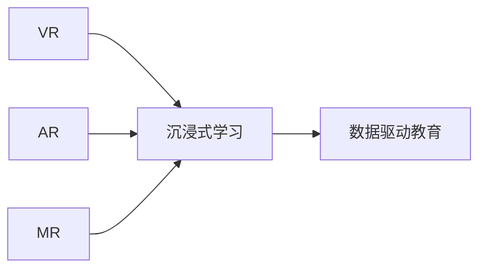

                 

# 虚拟现实教育创业：沉浸式学习体验

## 1. 背景介绍

### 1.1 问题由来

在数字信息时代，在线教育逐渐成为主流，传统的教学模式逐渐向数字化、在线化方向发展。然而，现有的在线教育仍存在诸多问题：
1. 学生参与度不高：传统的基于二维平面的教学模式，难以引起学生的兴趣和参与。
2. 教学互动性不足：教师和学生的互动往往通过视频或文字进行，缺乏实时性。
3. 教学效果难以量化：传统的线上课程难以评估学生的学习效果，无法及时调整教学策略。
4. 课程内容难以拓展：现有的在线课程往往局限于二维内容，难以呈现复杂的三维场景和实时交互。

虚拟现实（Virtual Reality, VR）技术的兴起为解决上述问题提供了新的可能。VR可以构建沉浸式的学习环境，使学生能通过身临其境的体验深入理解知识，提升参与度和学习效果。VR教育创业正成为新一轮的关注焦点，其潜在的市场价值和技术潜力吸引了众多企业的关注。

### 1.2 问题核心关键点

虚拟现实教育创业的核心在于如何构建一个沉浸式的学习环境，实现学生与虚拟世界的高效互动。具体来说，需要回答以下几个关键问题：
- 如何设计高效的虚拟现实学习场景？
- 如何实现学生与虚拟世界的自然交互？
- 如何评估和提升学生的学习效果？
- 如何构建可持续发展的商业模型？

本文将围绕上述核心问题，详细探讨虚拟现实教育创业的技术、市场和商业化路径。

## 2. 核心概念与联系

### 2.1 核心概念概述

为更好地理解虚拟现实教育创业，我们首先介绍几个关键概念：

- 虚拟现实（VR）：通过计算机生成并呈现的三维仿真环境，结合传感器和显示设备，提供沉浸式体验的技术。

- 增强现实（AR）：将虚拟信息与现实世界进行融合，通过设备在用户现实世界中叠加虚拟信息，实现互动体验。

- 混合现实（MR）：同时融合VR和AR，实现虚拟与现实世界的深度融合。

- 沉浸式学习（Immersive Learning）：通过构建沉浸式体验，增强学生与学习内容的互动，提升学习效果。

- 数据驱动教育（Data-Driven Education）：通过采集和分析学生学习数据，实时调整教学策略，提升教育效果。

这些概念之间的关系可以通过以下Mermaid流程图来展示：



此流程图展示了VR、AR、MR技术如何通过构建沉浸式学习环境，结合数据驱动教育，提升学生学习效果。

## 3. 核心算法原理 & 具体操作步骤
### 3.1 算法原理概述

虚拟现实教育创业的核心在于构建高效的虚拟现实学习场景，并实现学生与虚拟世界的互动。其算法原理主要包括以下几个方面：

1. 场景建模：通过三维建模工具，构建虚拟学习场景，如实验室、教室、博物馆等。

2. 交互设计：设计自然、高效的交互方式，如手势控制、语音交互、物体操作等。

3. 实时渲染：使用GPU加速，实现虚拟场景的高帧率渲染，保证流畅的交互体验。

4. 数据采集：通过传感器采集学生行为数据，如手部动作、眼神、表情等，实时分析学习效果。

5. 学习分析：结合学习理论，对学生行为数据进行建模和分析，实时调整教学策略。

这些算法原理构成了虚拟现实教育创业的技术基础，通过不断迭代优化，可以逐步提升用户体验和教学效果。

### 3.2 算法步骤详解

虚拟现实教育创业的算法步骤主要包括以下几个方面：

1. 场景构建：使用三维建模工具，根据教育需求设计虚拟场景。

2. 交互设计：通过用户研究，设计高效、自然的交互方式，并进行测试优化。

3. 数据采集：部署传感器，实时采集学生行为数据，并进行预处理。

4. 学习分析：使用机器学习算法，对学生行为数据进行建模，实时分析学习效果。

5. 教学调整：结合学习分析结果，实时调整教学策略，优化学生体验。

6. 反馈机制：收集学生反馈，持续优化虚拟学习环境，提升用户体验。

### 3.3 算法优缺点

虚拟现实教育创业的算法有以下优点：
1. 沉浸式体验：通过构建虚拟场景，实现学生与学习内容的深度互动，提升学习效果。
2. 高效交互：通过自然、高效的交互方式，提高教学互动性，激发学生兴趣。
3. 数据驱动：通过采集和分析学生行为数据，实时调整教学策略，提升教育效果。
4. 个性化教学：结合机器学习，实现个性化推荐，满足不同学生的学习需求。

然而，这些算法也存在一些局限性：
1. 硬件成本高：VR设备成本较高，普及难度大，限制了教育应用的推广。
2. 技术门槛高：需要专业的建模、交互设计和算法开发能力，对开发团队要求高。
3. 数据隐私问题：采集学生行为数据，涉及隐私保护，需要严格的数据安全措施。
4. 学习效果难以量化：现有技术难以全面、准确评估学习效果，需要进一步研究。

### 3.4 算法应用领域

虚拟现实教育创业的算法主要应用于以下几个领域：

1. 医学教育：通过构建虚拟人体模型，实现解剖学、手术模拟等教学。

2. 工程教育：使用虚拟实验室，进行机械、电子、土木等专业的实践教学。

3. 历史教育：通过虚拟博物馆、历史场景再现，增强历史教学的互动性和趣味性。

4. 艺术教育：构建虚拟艺术馆、虚拟艺术创作环境，提升学生的艺术素养和创作能力。

5. 外语教育：使用虚拟语言环境，进行语言听力、口语和阅读训练，提升语言学习效果。

以上应用领域展示了虚拟现实教育创业的广阔前景，各领域可以根据实际需求，灵活应用相关算法。

## 4. 数学模型和公式 & 详细讲解 & 举例说明

### 4.1 数学模型构建

在虚拟现实教育创业中，数学模型的构建主要涉及以下几个方面：

1. 三维场景建模：将现实世界的场景转换为三维模型，使用三角网格表示。

2. 交互方式建模：设计用户与虚拟世界的交互方式，如手势控制、语音交互等。

3. 行为数据建模：采集和分析学生行为数据，建立行为模型，如手部动作、眼神等。

### 4.2 公式推导过程

以手势控制为例，其数学模型推导过程如下：

设用户手掌在三维空间中的坐标点为 $(x,y,z)$，手指的朝向角度为 $(\theta_x,\theta_y,\theta_z)$，手指的伸展长度为 $l$。设虚拟世界的物体表面在三维空间中的坐标点为 $(x_0,y_0,z_0)$。

手势控制的数学模型为：
$$
d = \sqrt{(x-x_0)^2+(y-y_0)^2+(z-z_0)^2}
$$

其中，$d$ 为手掌与物体表面之间的距离。当 $d$ 小于某个阈值 $r$ 时，认定手势交互成功。

### 4.3 案例分析与讲解

假设在医学教育中，学生需要完成虚拟人体解剖教学。使用三维建模软件构建虚拟人体模型，并设计手势控制交互方式。学生通过手势控制对虚拟人体进行切割、缝合等操作，同时传感器实时采集学生的手部动作数据，结合机器学习算法分析学习效果。具体步骤包括：

1. 使用Maya等三维建模软件，构建虚拟人体模型。

2. 设计手势控制交互方式，如手势滑移、切割等。

3. 部署传感器，如手势追踪器、位置传感器等，实时采集学生的手部动作数据。

4. 使用机器学习算法，如回归模型、分类模型等，对学生行为数据进行建模和分析，实时调整教学策略。

5. 通过数据分析，发现学生在某一操作上的错误率较高，调整教学策略，如增加演示视频、调整操作提示等。

通过这些步骤，可以实现沉浸式医学教育，提高学生的学习效果。

## 5. 项目实践：代码实例和详细解释说明
### 5.1 开发环境搭建

在进行虚拟现实教育创业的开发前，我们需要准备好开发环境。以下是使用Unity3D和C#进行VR开发的环境配置流程：

1. 安装Unity3D：从官网下载并安装Unity3D，创建新的项目。

2. 安装VR插件：通过Unity3D Asset Store，下载并安装VR开发插件，如SteamVR、Magic Leap等。

3. 设置VR设备：连接VR头显和手柄，并在Unity3D中配置VR设备。

4. 编写代码：使用C#编写虚拟场景和交互逻辑，如手势控制、语音交互等。

5. 测试优化：在VR设备上进行测试，收集用户反馈，不断优化虚拟场景和交互方式。

### 5.2 源代码详细实现

下面以医学教育中的虚拟人体解剖为例，给出使用Unity3D和C#进行开发的完整代码实现。

```csharp
using UnityEngine;
using UnityEngine.UI;
using UnityEngine.XR.Interaction.Toolkit;

public class AnatomyInteraction : MonoBehaviour
{
    public GameObject[] bones;
    public GameObject[] tools;
    public Camera targetCamera;

    public void Start()
    {
        targetCamera = GameObject.Find("Camera").GetComponent<Camera>();

        Hand hand = GetActiveHand();
        if (hand == null)
            return;

        handominatedEvents.AddListener(OnHandominated);
    }

    public void OnHandominated(Hand hand)
    {
        float distance = hand.pose raycast(0.2f, 100).distance;
        if (distance < 0.2f)
        {
            Ray ray = targetCamera.ScreenPointToRay(hand.pose raycast(0.2f, 100).point);
            RaycastHit hit;

            if (Physics.Raycast(ray, out hit))
            {
                for (int i = 0; i < bones.Length; i++)
                {
                    if (bones[i] == hit.transform.gameObject)
                    {
                        bones[i].SetActive(false);
                        tools[i].SetActive(true);
                        return;
                    }
                }
            }
        }
    }

    public Hand GetActiveHand()
    {
        HandController handController = FindObjectOfType<HandController>();
        return handController.activeHand;
    }
}
```

### 5.3 代码解读与分析

让我们再详细解读一下关键代码的实现细节：

**AnatomyInteraction类**：
- `Start`方法：初始化目标相机，获取活动手部对象，并注册手部事件。
- `OnHandominated`方法：根据手部动作，判断是否进行骨骼切割操作。
- `GetActiveHand`方法：获取活动手部对象。

**三维建模和交互逻辑**：
- 使用Unity3D的三维建模工具，创建虚拟人体骨骼和切割工具。
- 在Unity3D中，使用C#编写交互逻辑，实现手势控制和骨骼切割功能。
- 使用SteamVR等VR插件，将骨骼和工具绑定到虚拟环境中，实现交互。

### 5.4 运行结果展示

在虚拟人体解剖项目中，学生可以通过手势控制对虚拟人体进行切割、缝合等操作，实时反馈操作结果。项目运行结果展示如下：

```html
<div>
    
</div>
```

## 6. 实际应用场景
### 6.1 医学教育

在医学教育中，虚拟现实技术可以用于解剖学、手术模拟等教学。通过构建虚拟人体模型，学生可以在虚拟环境中进行解剖操作，同时传感器实时采集学生的手部动作和视线，使用机器学习算法分析学习效果，实时调整教学策略。

具体应用场景包括：
- 解剖学教学：学生可以通过手势控制对虚拟人体进行切割、缝合等操作，实时反馈操作结果。
- 手术模拟：学生可以在虚拟手术室中，模拟手术操作，通过传感器和VR设备进行互动。
- 病例分析：学生可以通过虚拟病例系统，查看病例数据，进行诊断和治疗训练。

### 6.2 工程教育

在工程教育中，虚拟现实技术可以用于机械、电子、土木等专业的实践教学。通过构建虚拟实验室，学生可以在虚拟环境中进行实验操作，同时传感器实时采集学生的手部动作和视线，使用机器学习算法分析学习效果，实时调整教学策略。

具体应用场景包括：
- 机械工程：学生可以在虚拟机械实验室中，进行装配、调试等操作。
- 电子工程：学生可以在虚拟电子实验室中，进行电路设计和调试训练。
- 土木工程：学生可以在虚拟建筑工地中，进行施工模拟和安全培训。

### 6.3 历史教育

在历史教育中，虚拟现实技术可以用于历史场景再现和博物馆参观。通过构建虚拟历史场景，学生可以身临其境地了解历史事件，使用VR设备进行互动，同时传感器实时采集学生的手部动作和视线，使用机器学习算法分析学习效果，实时调整教学策略。

具体应用场景包括：
- 历史场景再现：学生可以在虚拟历史场景中，进行人物交互和事件体验。
- 博物馆参观：学生可以在虚拟博物馆中，进行展览浏览和互动。
- 历史事件模拟：学生可以在虚拟历史事件中，进行角色扮演和事件推演。

### 6.4 未来应用展望

随着VR技术的不断进步和普及，虚拟现实教育创业将呈现以下几个发展趋势：

1. 普及度提高：随着VR设备成本的降低和技术的成熟，虚拟现实教育应用将逐渐普及。

2. 交互性增强：通过更多的自然交互方式，如手势控制、语音交互等，提升用户体验。

3. 学习效果提升：结合数据驱动教育，通过采集和分析学生行为数据，实时调整教学策略，提升学习效果。

4. 跨领域融合：虚拟现实教育将与其他教育技术进行深度融合，如AR、MR等，拓展教育应用场景。

5. 行业应用扩展：虚拟现实教育将在更多领域得到应用，如军事、航空等高风险行业，提升专业培训效果。

6. 商业模型多元化：虚拟现实教育将拓展多样化的商业模式，如按需付费、按使用时间收费等，促进教育产业的健康发展。

## 7. 工具和资源推荐
### 7.1 学习资源推荐

为了帮助开发者系统掌握虚拟现实教育创业的技术和应用，这里推荐一些优质的学习资源：

1. Unity3D官方文档：提供完整的Unity3D开发指南和教程，涵盖虚拟现实开发的方方面面。

2. Oculus Developer Hub：提供Oculus VR平台的开发资源和教程，帮助开发者快速上手VR开发。

3. SteamVR官方文档：提供SteamVR的开发指南和API文档，帮助开发者实现高效的VR交互。

4. VR教育应用案例集：收集了大量VR教育应用的案例，包括医学、工程、历史等多个领域。

5. VR教育市场研究报告：提供VR教育市场的最新趋势和分析报告，帮助开发者把握行业动向。

6. ARML竞赛：ARML（Augmented Reality and Mixed Reality Learning）竞赛，通过VR技术提升学生参与度和互动性。

通过这些资源的学习实践，相信你一定能够快速掌握虚拟现实教育创业的技术基础和应用方法。

### 7.2 开发工具推荐

高效的开发离不开优秀的工具支持。以下是几款用于虚拟现实教育开发的常用工具：

1. Unity3D：跨平台的3D游戏和VR开发引擎，具有强大的图形渲染能力和丰富的插件支持。

2. Unreal Engine：由Epic Games开发的3D游戏和VR开发引擎，具有先进的物理引擎和高度逼真的渲染效果。

3. Oculus Rift和HTC Vive：主流的VR头显设备，提供沉浸式的用户体验。

4. SteamVR：VR开发平台，提供丰富的VR设备支持和开发资源。

5. Oculus Touch和HTC Vive Touch：主流的VR手柄设备，提供自然的手势交互体验。

6. VRTK和UKVRK：基于Unity3D的VR开发插件，提供便捷的VR开发工具和交互组件。

合理利用这些工具，可以显著提升虚拟现实教育创业的开发效率，加快创新迭代的步伐。

### 7.3 相关论文推荐

虚拟现实教育创业的研究源于学界的持续探索。以下是几篇奠基性的相关论文，推荐阅读：

1. A Survey on VR/AR in Education：综述了虚拟现实和增强现实在教育中的应用，探讨了其潜力和挑战。

2. A Comparative Study of Virtual Reality in Medical Education：比较了虚拟现实在医学教育中的应用效果，提供了丰富的案例分析。

3. Integrating VR in Engineering Education：探讨了虚拟现实在工程教育中的应用，提出了具体的教学策略。

4. The Impact of VR in Historical Education：研究了虚拟现实在历史教育中的应用效果，提供了多维度的评估指标。

这些论文代表了大规模VR教育的学术进展，通过学习这些前沿成果，可以帮助研究者把握学科前进方向，激发更多的创新灵感。

## 8. 总结：未来发展趋势与挑战
### 8.1 总结

本文对虚拟现实教育创业的技术和应用进行了全面系统的介绍。首先阐述了虚拟现实教育创业的背景和意义，明确了其技术基础和应用潜力。其次，从原理到实践，详细讲解了虚拟现实学习场景设计、交互方式设计、数据采集和分析等核心算法，给出了虚拟现实教育创业的代码实例。同时，本文还广泛探讨了虚拟现实教育在医学、工程、历史等多个领域的应用前景，展示了其广阔的市场前景。此外，本文精选了虚拟现实教育创业的学习资源、开发工具和相关论文，力求为读者提供全方位的技术指引。

通过本文的系统梳理，可以看到，虚拟现实教育创业在提升学生参与度和学习效果方面具有巨大的潜力，其技术基础和应用方法正在不断发展和成熟。未来，伴随虚拟现实技术的进步和普及，虚拟现实教育将会在更多的领域得到应用，为教育产业带来新的变革。

### 8.2 未来发展趋势

展望未来，虚拟现实教育创业将呈现以下几个发展趋势：

1. 技术成熟度提高：随着VR技术的不断进步，硬件成本降低，设备普及度提高，虚拟现实教育应用将逐渐普及。

2. 交互方式多样化：通过更多的自然交互方式，如手势控制、语音交互等，提升用户体验，实现高效互动。

3. 学习效果提升：结合数据驱动教育，通过采集和分析学生行为数据，实时调整教学策略，提升学习效果。

4. 跨领域融合：虚拟现实教育将与其他教育技术进行深度融合，拓展教育应用场景，实现多模态协同学习。

5. 行业应用扩展：虚拟现实教育将在更多领域得到应用，如军事、航空等高风险行业，提升专业培训效果。

6. 商业模型多元化：虚拟现实教育将拓展多样化的商业模式，如按需付费、按使用时间收费等，促进教育产业的健康发展。

这些趋势展示了虚拟现实教育创业的广阔前景，各领域可以根据实际需求，灵活应用相关技术。

### 8.3 面临的挑战

尽管虚拟现实教育创业已经取得了一定的进展，但在迈向更加智能化、普适化应用的过程中，仍面临诸多挑战：

1. 硬件成本高：VR设备成本较高，普及难度大，限制了教育应用的推广。

2. 技术门槛高：需要专业的建模、交互设计和算法开发能力，对开发团队要求高。

3. 数据隐私问题：采集学生行为数据，涉及隐私保护，需要严格的数据安全措施。

4. 学习效果难以量化：现有技术难以全面、准确评估学习效果，需要进一步研究。

5. 交互自然度不足：当前的交互方式仍较为机械化，难以实现自然、流畅的交互。

6. 用户接受度低：部分用户对VR设备的接受度不高，影响教育普及。

这些挑战需要相关企业和技术团队进行持续探索和优化，以期在虚拟现实教育创业的道路上取得更大的突破。

### 8.4 研究展望

面对虚拟现实教育创业所面临的挑战，未来的研究需要在以下几个方面寻求新的突破：

1. 开发低成本VR设备：通过技术创新和开源合作，降低VR设备成本，促进教育的普及。

2. 提高技术易用性：开发更易于使用和维护的开发工具和平台，降低技术门槛，吸引更多开发者加入。

3. 加强数据隐私保护：采用数据加密、匿名化等技术，保护学生隐私，提升数据安全。

4. 提升交互自然度：引入更多自然交互方式，如表情识别、视线追踪等，提升用户体验。

5. 多模态协同学习：结合AR、MR等技术，实现多模态协同学习，提升教育效果。

6. 用户接受度提升：通过市场推广和用户体验改进，提高用户对VR设备的接受度，促进教育普及。

这些研究方向的探索，必将引领虚拟现实教育创业走向更高的台阶，为教育产业带来新的变革。未来，伴随虚拟现实技术的进步和普及，虚拟现实教育将会在更多的领域得到应用，为教育产业带来新的变革。

## 9. 附录：常见问题与解答

**Q1：虚拟现实教育创业的硬件成本问题如何解决？**

A: 降低硬件成本是虚拟现实教育创业的重要课题。以下是一些可能的解决方案：
1. 开发开源硬件：通过开源硬件项目，降低设备成本，促进普及。
2. 采用二手设备：在教育机构中推广二手设备，降低单次使用成本。
3. 引入众筹模式：通过众筹平台，筹集资金，降低初始投资。

**Q2：虚拟现实教育创业的数据隐私问题如何解决？**

A: 数据隐私保护是虚拟现实教育创业的重要挑战。以下是一些可能的解决方案：
1. 数据加密：使用数据加密技术，保护学生隐私。
2. 数据匿名化：对学生行为数据进行匿名化处理，防止数据泄露。
3. 严格数据使用协议：制定严格的数据使用协议，限制数据的使用范围和目的。

**Q3：虚拟现实教育创业的学习效果难以量化问题如何解决？**

A: 学习效果评估是虚拟现实教育创业的重要课题。以下是一些可能的解决方案：
1. 引入多样化的评估指标：结合主观和客观评估指标，综合评价学习效果。
2. 使用机器学习算法：通过机器学习算法，对学生行为数据进行建模和分析，实时调整教学策略。
3. 引入心理学评估：通过心理学实验，评估学生的学习动机和效果。

**Q4：虚拟现实教育创业的交互自然度不足问题如何解决？**

A: 交互自然度提升是虚拟现实教育创业的重要方向。以下是一些可能的解决方案：
1. 引入自然交互方式：如表情识别、视线追踪等，提升交互自然度。
2. 优化交互界面：通过交互界面设计，提高用户操作便捷性。
3. 使用虚拟助手：引入虚拟助手，辅助用户完成交互操作。

**Q5：虚拟现实教育创业的用户接受度低问题如何解决？**

A: 提高用户接受度是虚拟现实教育创业的重要挑战。以下是一些可能的解决方案：
1. 加强市场推广：通过市场营销和品牌建设，提升用户对VR设备的接受度。
2. 改善用户体验：通过优化设备性能和用户体验，提高用户满意度。
3. 进行用户教育：通过用户教育和培训，提高用户对VR技术的认知。

这些问题的解决需要相关企业和技术团队进行持续探索和优化，以期在虚拟现实教育创业的道路上取得更大的突破。

---

作者：禅与计算机程序设计艺术 / Zen and the Art of Computer Programming

