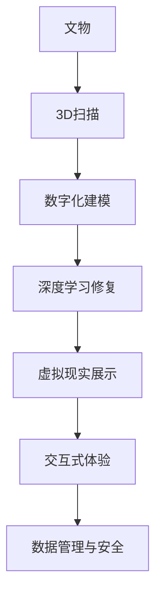

                 

## 1. 背景介绍

在数字化时代，文化遗产的保护和传承面临着前所未有的挑战。传统的实地保护、修复和展示方式难以应对气候变化、自然灾害以及人类活动带来的破坏。虚拟现实（VR）技术的发展为文化遗产保护提供了全新的思路和手段，使我们能够以更高效、更经济的方式进行数字化文物修复与展示。

### 1.1 问题由来

文化遗产的保护和传承一直是人类面临的重大课题。随着时间流逝，许多古代艺术品、历史建筑、文物遗址等受到不同程度的损害，面临着消亡的风险。传统实地保护和修复的方法如实地勘查、现场修复、人工维护等成本高昂且效率低下，难以应对日益严重的文化遗产保护压力。此外，实地展示也面临着空间限制、环境影响等问题，公众难以接触到珍贵的文化遗产。

虚拟现实技术（Virtual Reality，简称VR）通过模拟现实环境，提供沉浸式体验，可以有效地解决上述问题。VR技术不仅能帮助文物修复师在数字环境中进行修复和重建，还能让公众足不出户就能参观历史遗迹，从而实现文化遗产的广泛传播与保护。

### 1.2 问题核心关键点

在虚拟现实文化遗产保护创业中，核心关键点包括以下几个方面：

1. **数字化文物修复**：利用3D扫描、计算机视觉、深度学习等技术，将文物的物理形态和表面信息数字化，为后续修复提供数据支持。

2. **虚拟现实展示**：构建虚拟场景，将修复后的数字化文物嵌入其中，提供沉浸式体验，让公众能够直观地感受到文化遗产的魅力。

3. **交互与教育**：通过VR技术，为观众提供互动体验，增强参与感和教育效果，推动文化遗产的传承与普及。

4. **数据管理与安全性**：保证文物数字化数据的完整性和安全性，避免数据泄露和篡改。

### 1.3 问题研究意义

虚拟现实文化遗产保护创业具有重要意义：

1. **提升保护效率**：数字化文物修复可以大幅度降低人工和物质的消耗，提高修复效率和质量。
2. **拓展展示形式**：虚拟现实技术能够提供多维度的展示体验，使文化遗产得到更广泛的传播。
3. **促进教育与交流**：通过互动体验，增强公众对文化遗产的认识和理解，促进文化交流与传承。
4. **实现可持续发展**：降低实地保护的资源消耗，保护文物的同时，保护自然环境，实现文化遗产保护与可持续发展的双赢。

## 2. 核心概念与联系

### 2.1 核心概念概述

在虚拟现实文化遗产保护创业中，涉及的关键概念包括：

- **虚拟现实**：利用计算机生成仿真环境，使用户沉浸在虚拟世界中，实现虚拟体验。
- **文物修复**：利用数字化技术，对文物进行物理形态的修复与重建。
- **数字化文物**：将文物的物理形态、结构信息、表面信息等数字化，以便于后续的修复与展示。
- **交互式展示**：通过用户交互操作，使展示更加生动和个性化。
- **数据管理**：对文物数字化数据进行管理与保护，确保数据的安全与完整。

这些概念之间存在着紧密的联系，通过数字化修复和虚拟现实展示，文化遗产得到了有效的保护与传承。交互式展示和技术驱动的教育，进一步提升了文化遗产的传播效果。而数据管理与安全性的保障，则是这一切顺利进行的基础。

### 2.2 核心概念原理和架构的 Mermaid 流程图



这个流程图展示了虚拟现实文化遗产保护创业的基本流程：

1. **文物数字化**：通过3D扫描和建模，将文物的物理形态和表面信息数字化。
2. **深度学习修复**：利用深度学习技术，对数字化文物进行修复与重建。
3. **虚拟现实展示**：构建虚拟场景，将修复后的文物嵌入其中，提供沉浸式体验。
4. **交互式体验**：通过用户交互操作，增强展示的生动性和参与感。
5. **数据管理与安全**：对文物数字化数据进行管理与保护，确保数据的安全与完整。

这些步骤相互依赖，共同构成了虚拟现实文化遗产保护创业的核心架构。

## 3. 核心算法原理 & 具体操作步骤

### 3.1 算法原理概述

虚拟现实文化遗产保护创业的核心算法原理包括：

1. **3D扫描与建模**：利用激光扫描、立体摄影等技术获取文物表面信息，通过三维建模软件生成数字模型。

2. **深度学习修复**：利用深度学习模型，对数字化文物进行纹理修复、颜色校正等处理，恢复文物原有的外观和结构。

3. **虚拟现实展示**：将修复后的文物嵌入虚拟场景中，通过计算机图形学技术生成虚拟环境，提供沉浸式体验。

4. **交互式展示**：通过计算机视觉、自然语言处理等技术，实现用户与虚拟环境的互动。

5. **数据管理与安全**：采用数据加密、备份等技术，确保文物数字化数据的完整性和安全性。

### 3.2 算法步骤详解

**步骤 1: 文物数字化**

1. **3D扫描**：选择适合的3D扫描设备，对文物进行高精度扫描，获取其表面信息。
2. **数据处理**：将扫描得到的点云数据进行预处理，如去噪、校正等，生成数字化的点云模型。
3. **建模与重构**：使用3D建模软件，对点云模型进行三角剖分和表面处理，生成完整的数字化模型。

**步骤 2: 深度学习修复**

1. **数据准备**：将修复前的数字化文物数据进行预处理，如降采样、归一化等。
2. **模型训练**：选择适合的深度学习模型，如卷积神经网络（CNN）、生成对抗网络（GAN）等，使用修复前的数据进行训练。
3. **模型评估**：在训练数据上评估模型性能，使用交叉熵、均方误差等指标衡量修复效果。
4. **模型应用**：使用训练好的模型对修复前的数字化文物进行修复，生成修复后的数字模型。

**步骤 3: 虚拟现实展示**

1. **场景构建**：选择适合的3D场景构建软件，创建虚拟场景，并添加修复后的数字化文物。
2. **光照与纹理**：为虚拟场景添加逼真的光照和纹理，提升视觉体验。
3. **交互设计**：设计用户交互操作，如点击、拖动等，增强展示的互动性。

**步骤 4: 交互式展示**

1. **用户输入**：通过自然语言处理、手势识别等技术，收集用户输入信息。
2. **环境反馈**：根据用户输入，生成相应的环境反馈，如场景变化、声音变化等。
3. **展示优化**：根据用户反馈，动态调整展示效果，提高用户体验。

**步骤 5: 数据管理与安全**

1. **数据备份**：定期备份数字化文物数据，确保数据不丢失。
2. **数据加密**：采用对称加密或非对称加密等技术，对数据进行加密保护。
3. **访问控制**：设置访问权限，控制数据访问和使用。

### 3.3 算法优缺点

**优点：**

1. **高效性**：数字化文物修复和虚拟现实展示，能够在较短的时间内完成，大大降低了传统修复的时间和成本。
2. **广泛性**：虚拟现实技术能够提供沉浸式体验，使文化遗产能够覆盖更广泛的受众。
3. **交互性**：交互式展示能够增强用户参与感，提高文化遗产的教育效果。
4. **安全性**：通过数据管理与安全措施，确保文物数字化数据的安全与完整。

**缺点：**

1. **技术复杂性**：涉及3D扫描、建模、深度学习、计算机视觉等多项技术，技术门槛较高。
2. **设备成本**：高质量的3D扫描设备和高性能的计算设备成本较高，需要较高的初始投资。
3. **数据质量**：扫描和建模过程中，数据质量的高低直接影响修复和展示的效果。
4. **用户体验**：交互式展示技术需要不断优化，提升用户体验，否则会影响展示效果。

### 3.4 算法应用领域

虚拟现实文化遗产保护创业技术在以下领域有广泛应用：

1. **博物馆与艺术馆**：通过虚拟现实技术，展示文物修复过程和修复后的数字模型，提升公众的参观体验。
2. **考古与历史研究**：利用虚拟现实技术，对考古现场进行数字化重现，进行文物复原与分析。
3. **文化遗产教育**：通过交互式展示技术，向学生展示文物修复和展示过程，增强教育效果。
4. **数字化出版**：将文物数字化数据发布为数字模型，供学术研究与出版使用。

## 4. 数学模型和公式 & 详细讲解 & 举例说明

### 4.1 数学模型构建

在虚拟现实文化遗产保护创业中，数学模型主要应用于以下几个方面：

1. **3D扫描与建模**：将扫描得到的点云数据通过数学模型转换为数字化的3D模型。
2. **深度学习修复**：利用深度学习模型，对数字化文物进行纹理修复、颜色校正等处理。
3. **虚拟现实展示**：通过计算机图形学技术，生成虚拟场景和交互操作。
4. **数据管理与安全**：采用加密算法和数据管理技术，确保数据的安全与完整。

### 4.2 公式推导过程

**3D扫描与建模**：

假设文物表面为点云数据 $\{x_i\}_{i=1}^n$，其中 $x_i=(x_i^1,x_i^2,x_i^3)$ 为点云的三个坐标值。通过对点云数据进行预处理和三角剖分，生成数字化的3D模型 $\mathcal{M}$。

**深度学习修复**：

假设修复前的数字化文物为图像数据 $\{I_i\}_{i=1}^n$，其中 $I_i=(x_i,y_i,z_i)$ 为图像的RGB三个通道的值。使用卷积神经网络（CNN）进行修复，生成修复后的图像数据 $\{\hat{I}_i\}_{i=1}^n$。

**虚拟现实展示**：

假设虚拟场景由多个场景元素构成，每个元素为三维坐标 $(x,y,z)$ 和纹理图 $T$。通过计算机图形学技术，生成虚拟场景 $\mathcal{S}$。

**数据管理与安全**：

假设文物数字化数据为 $\{D_i\}_{i=1}^n$，其中 $D_i$ 为数据块的二进制编码。使用对称加密算法进行加密，生成加密后的数据 $\{E_i\}_{i=1}^n$。

### 4.3 案例分析与讲解

**案例分析：**

以一个虚拟现实博物馆为例，分析其核心技术流程。

1. **3D扫描与建模**：选择激光扫描设备，对一件古代玉器进行高精度扫描，得到点云数据。通过预处理和三角剖分，生成玉器的3D模型。
2. **深度学习修复**：对修复前的玉器图像进行降采样和归一化，使用GAN模型进行纹理修复和颜色校正，生成修复后的玉器图像。
3. **虚拟现实展示**：设计虚拟博物馆场景，将修复后的玉器图像嵌入其中，添加逼真的光照和纹理。设计交互操作，如点击、拖动等，增强用户体验。
4. **数据管理与安全**：定期备份玉器数字化数据，使用AES算法进行加密，设置访问权限，确保数据安全。

**讲解：**

在虚拟现实博物馆中，3D扫描与建模是文物数字化的基础。深度学习修复技术能够提高文物修复的精度和效率，虚拟现实展示技术能够提供沉浸式体验。交互式展示技术增强用户参与感，提升教育效果。数据管理与安全措施确保文物数字化数据的安全与完整。

## 5. 项目实践：代码实例和详细解释说明

### 5.1 开发环境搭建

在进行虚拟现实文化遗产保护创业开发前，需要准备好开发环境。以下是使用Python进行开发的环境配置流程：

1. **安装Python**：从官网下载并安装最新版本的Python。
2. **安装相关库**：使用pip安装必要的库，如NumPy、Pandas、Matplotlib、Open3D等。
3. **安装VR工具**：安装Oculus Rift等VR设备，并配置好驱动程序。
4. **搭建开发环境**：使用Anaconda创建一个虚拟环境，安装必要的库和依赖。

### 5.2 源代码详细实现

以下是一个简单的Python代码示例，用于3D扫描与建模：

```python
import open3d as o3d

def scan_and_model(filename):
    # 读取点云数据
    pcd = o3d.io.read_point_cloud(filename)
    
    # 预处理点云数据
    pcd.paint_uniform_color([1, 0, 0])
    
    # 三角剖分
    mesh = pcd.points_to_mesh()
    
    # 显示模型
    o3d.visualization.render(os.path.basename(filename), mesh)
    
if __name__ == '__main__':
    scan_and_model('scan_data.ply')
```

以上代码使用了open3d库进行3D扫描与建模，通过读取点云数据、预处理、三角剖分和显示模型，完成文物数字化的过程。

### 5.3 代码解读与分析

**解读**：

1. **open3d库**：用于3D扫描与建模的Python库，提供了丰富的点云处理和可视化功能。
2. **点云数据读取**：使用`o3d.io.read_point_cloud`函数读取点云数据。
3. **预处理点云数据**：通过`pcd.paint_uniform_color`函数对点云数据进行预处理，如去噪、校正等。
4. **三角剖分**：通过`pcd.points_to_mesh`函数将点云数据转换为三角网格模型。
5. **显示模型**：通过`o3d.visualization.render`函数显示模型。

**分析**：

通过以上代码，我们可以看到3D扫描与建模的基本流程。在实际应用中，还需要进行更多的预处理和优化，确保扫描和建模的质量。

## 6. 实际应用场景

### 6.1 虚拟现实博物馆

虚拟现实博物馆是虚拟现实文化遗产保护创业的重要应用场景之一。通过虚拟现实技术，博物馆可以展示文物修复过程和修复后的数字模型，提升公众的参观体验。

**应用场景**：

1. **修复过程展示**：利用虚拟现实技术，展示文物修复的每一步过程，让观众直观了解修复技巧和方法。
2. **修复结果展示**：将修复后的文物嵌入虚拟场景中，通过交互操作，观众可以近距离观察修复细节。
3. **互动体验**：设计互动功能，如通过手势控制修复工具，或与虚拟文物互动，增强参观趣味性。

**技术实现**：

1. **数据采集**：通过3D扫描设备获取文物的高精度点云数据。
2. **数字建模**：使用计算机图形学技术，将点云数据转换为数字模型。
3. **深度学习修复**：使用深度学习模型，对数字化文物进行纹理修复和颜色校正。
4. **虚拟现实展示**：构建虚拟博物馆场景，将修复后的文物嵌入其中，提供沉浸式体验。
5. **交互式展示**：设计互动操作，增强展示效果和用户体验。

**应用效果**：

通过虚拟现实博物馆，观众可以在家中即可参观文物修复过程，了解文物历史和文化背景，提升文化遗产的教育效果。

### 6.2 考古与历史研究

虚拟现实技术在考古与历史研究中也有广泛应用。利用虚拟现实技术，考古学家可以对考古现场进行数字化重现，进行文物复原与分析。

**应用场景**：

1. **考古现场重现**：利用虚拟现实技术，对考古现场进行数字化重现，还原考古发现的过程。
2. **文物复原**：对挖掘出的文物进行数字化复原，恢复其原始形态和结构。
3. **历史分析**：利用虚拟现实技术，对历史场景进行再现，分析历史事件和人物。

**技术实现**：

1. **考古现场扫描**：使用激光扫描设备，对考古现场进行高精度扫描。
2. **考古场景建模**：将扫描数据转换为数字模型，构建考古场景。
3. **文物复原**：利用深度学习技术，对数字化文物进行纹理修复和颜色校正。
4. **历史场景再现**：利用计算机图形学技术，再现历史场景，提供沉浸式体验。
5. **历史分析**：利用虚拟现实技术，对历史场景进行交互式分析，揭示历史事件和人物。

**应用效果**：

通过虚拟现实技术，考古学家可以在虚拟环境中进行文物复原和历史分析，提高研究效率和准确性。

### 6.3 文化遗产教育

虚拟现实技术在文化遗产教育中也有广泛应用。通过虚拟现实技术，可以向学生展示文物修复和展示过程，增强教育效果。

**应用场景**：

1. **文物修复教学**：利用虚拟现实技术，展示文物修复的每一步过程，讲解修复技巧和方法。
2. **文物展示教学**：将修复后的文物嵌入虚拟场景中，通过互动操作，让学生直观了解文物结构和历史背景。
3. **文化遗产保护**：通过虚拟现实技术，展示文化遗产保护的方法和措施，增强学生的保护意识。

**技术实现**：

1. **文物数字化**：利用3D扫描设备，对文物进行高精度扫描，并进行数字建模。
2. **深度学习修复**：使用深度学习模型，对数字化文物进行纹理修复和颜色校正。
3. **虚拟现实展示**：构建虚拟场景，将修复后的文物嵌入其中，提供沉浸式体验。
4. **互动教学**：设计互动操作，增强教学效果和学生参与感。

**应用效果**：

通过虚拟现实技术，学生可以在虚拟环境中进行文物修复和展示教学，增强教育效果和文化传承。

### 6.4 未来应用展望

随着虚拟现实技术的发展，未来在虚拟现实文化遗产保护创业中，将会有更多新的应用场景和创新技术。

1. **多模态展示**：将文物修复、考古研究、文化遗产教育等多种应用场景融合，提供更丰富的展示效果。
2. **智能交互**：通过自然语言处理、手势识别等技术，实现智能交互，增强用户体验。
3. **实时更新**：利用云计算和边缘计算技术，实现文物数字化数据的实时更新和维护，保持展示内容的准确性和时效性。
4. **跨平台应用**：开发跨平台应用，支持多种VR设备、移动设备等，扩展应用范围。

## 7. 工具和资源推荐

### 7.1 学习资源推荐

为了帮助开发者系统掌握虚拟现实文化遗产保护创业的理论基础和实践技巧，这里推荐一些优质的学习资源：

1. **《虚拟现实技术基础》**：介绍了虚拟现实技术的基本原理和应用场景，适合初学者入门。
2. **《文物数字化技术》**：系统讲解了文物数字化扫描、建模、修复等技术，适合相关领域的专业人士。
3. **《深度学习在文物修复中的应用》**：介绍了深度学习在文物修复中的实际应用，适合研究开发者参考。
4. **《虚拟现实与文化遗产保护》**：介绍了虚拟现实技术在文化遗产保护中的应用，适合从业者参考。
5. **《3D扫描与建模技术》**：详细讲解了3D扫描和建模技术，适合从事文物数字化工作的从业人员参考。

### 7.2 开发工具推荐

高效的开发离不开优秀的工具支持。以下是几款用于虚拟现实文化遗产保护创业开发的常用工具：

1. **Unity 3D**：一款强大的游戏开发引擎，支持3D建模、虚拟现实开发，适合开发虚拟现实博物馆、考古场景等。
2. **Maya**：一款专业的3D建模软件，支持高精度建模和动画制作，适合文物数字化建模。
3. **Open3D**：一款开源的3D库，支持点云处理、几何建模等，适合文物数字化数据处理。
4. **Blender**：一款免费的3D建模软件，支持高精度建模、纹理处理、动画制作等，适合文物数字化建模。
5. **Python**：用于数据分析、模型训练等，适合深度学习模型开发和数据处理。

### 7.3 相关论文推荐

虚拟现实文化遗产保护创业技术的发展源于学界的持续研究。以下是几篇奠基性的相关论文，推荐阅读：

1. **《虚拟现实技术在文化遗产保护中的应用》**：介绍了虚拟现实技术在文化遗产保护中的应用，探讨了其潜力和未来发展方向。
2. **《文物数字化修复的深度学习方法》**：介绍了深度学习在文物数字化修复中的应用，讨论了深度学习模型的选择和训练方法。
3. **《文物数字化数据的存储与保护技术》**：讨论了文物数字化数据的存储与保护技术，提出了数据加密、备份等解决方案。
4. **《虚拟现实技术在考古研究中的应用》**：介绍了虚拟现实技术在考古研究中的应用，探讨了其对考古工作的促进作用。
5. **《虚拟现实技术在文化遗产教育中的应用》**：讨论了虚拟现实技术在文化遗产教育中的应用，提出了虚拟现实教育的实施方案。

## 8. 总结：未来发展趋势与挑战

### 8.1 研究成果总结

虚拟现实文化遗产保护创业技术在以下几个方面取得了显著成果：

1. **文物数字化技术**：3D扫描、建模、深度学习修复等技术的应用，显著提高了文物数字化效率和质量。
2. **虚拟现实展示技术**：计算机图形学、交互设计等技术的应用，提供了沉浸式、互动性的展示体验。
3. **数据管理与安全技术**：数据加密、备份等技术的应用，保证了文物数字化数据的安全与完整。

### 8.2 未来发展趋势

展望未来，虚拟现实文化遗产保护创业技术将呈现以下几个发展趋势：

1. **技术融合**：虚拟现实技术与人工智能、增强现实（AR）、混合现实（MR）等技术的融合，将推动文化遗产保护的创新发展。
2. **多模态展示**：结合声音、气味、触觉等多模态信息，提供更丰富、更真实的展示体验。
3. **智能交互**：通过自然语言处理、手势识别等技术，实现智能交互，增强用户体验。
4. **实时更新**：利用云计算和边缘计算技术，实现文物数字化数据的实时更新和维护，保持展示内容的准确性和时效性。
5. **跨平台应用**：开发跨平台应用，支持多种VR设备、移动设备等，扩展应用范围。

### 8.3 面临的挑战

虽然虚拟现实文化遗产保护创业技术已经取得了瞩目成就，但在迈向更加智能化、普适化应用的过程中，仍面临诸多挑战：

1. **技术门槛高**：虚拟现实技术和文物数字化技术具有较高的技术门槛，需要专业的知识和技能。
2. **设备成本高**：高质量的3D扫描设备和高性能的计算设备成本较高，需要较高的初始投资。
3. **数据质量问题**：扫描和建模过程中，数据质量的高低直接影响文物数字化效果。
4. **用户体验问题**：交互式展示技术需要不断优化，提升用户体验。
5. **数据安全问题**：文物数字化数据需要严格保护，避免数据泄露和篡改。

### 8.4 研究展望

面对虚拟现实文化遗产保护创业技术面临的挑战，未来的研究需要在以下几个方面寻求新的突破：

1. **简化技术流程**：开发简单易用的工具和平台，降低技术门槛，推动技术的普及应用。
2. **降低设备成本**：开发低成本、高性能的扫描和建模设备，降低初始投资成本。
3. **提高数据质量**：优化扫描和建模流程，提高数据质量和处理效率。
4. **增强用户体验**：不断优化交互式展示技术，提升用户体验。
5. **保障数据安全**：开发数据加密、备份等技术，保障文物数字化数据的安全与完整。

通过在上述方面进行突破，虚拟现实文化遗产保护创业技术将进一步成熟和普及，为文化遗产保护和传承带来更广阔的前景。

## 9. 附录：常见问题与解答

**Q1: 虚拟现实技术在文化遗产保护中具体有哪些应用？**

A: 虚拟现实技术在文化遗产保护中的应用包括：

1. **文物修复**：通过虚拟现实技术，展示文物修复过程，让观众直观了解修复技巧和方法。
2. **考古现场重现**：利用虚拟现实技术，对考古现场进行数字化重现，还原考古发现的过程。
3. **文物展示**：将修复后的文物嵌入虚拟场景中，通过互动操作，观众可以近距离观察修复细节。
4. **历史场景再现**：利用虚拟现实技术，再现历史场景，提供沉浸式体验。
5. **文化遗产教育**：通过虚拟现实技术，向学生展示文物修复和展示过程，增强教育效果。

**Q2: 文物数字化过程涉及哪些技术？**

A: 文物数字化过程涉及以下技术：

1. **3D扫描技术**：通过激光扫描、立体摄影等技术，获取文物表面信息。
2. **数字化建模技术**：将扫描得到的点云数据转换为数字模型，如三角剖分、表面处理等。
3. **深度学习技术**：利用深度学习模型，对数字化文物进行纹理修复、颜色校正等处理。
4. **计算机图形学技术**：生成虚拟场景和交互操作，提供沉浸式体验。

**Q3: 虚拟现实技术在考古研究中的应用有哪些？**

A: 虚拟现实技术在考古研究中的应用包括：

1. **考古现场重现**：利用虚拟现实技术，对考古现场进行数字化重现，还原考古发现的过程。
2. **文物复原**：对挖掘出的文物进行数字化复原，恢复其原始形态和结构。
3. **历史场景再现**：利用虚拟现实技术，再现历史场景，提供沉浸式体验。
4. **历史分析**：利用虚拟现实技术，对历史场景进行交互式分析，揭示历史事件和人物。

**Q4: 虚拟现实文化遗产保护创业技术的未来发展方向是什么？**

A: 虚拟现实文化遗产保护创业技术的未来发展方向包括：

1. **技术融合**：虚拟现实技术与人工智能、增强现实（AR）、混合现实（MR）等技术的融合，将推动文化遗产保护的创新发展。
2. **多模态展示**：结合声音、气味、触觉等多模态信息，提供更丰富、更真实的展示体验。
3. **智能交互**：通过自然语言处理、手势识别等技术，实现智能交互，增强用户体验。
4. **实时更新**：利用云计算和边缘计算技术，实现文物数字化数据的实时更新和维护，保持展示内容的准确性和时效性。
5. **跨平台应用**：开发跨平台应用，支持多种VR设备、移动设备等，扩展应用范围。

**Q5: 如何保障文物数字化数据的安全与完整？**

A: 保障文物数字化数据的安全与完整，需要采取以下措施：

1. **数据加密**：采用对称加密或非对称加密等技术，对数据进行加密保护。
2. **数据备份**：定期备份数字化文物数据，确保数据不丢失。
3. **访问控制**：设置访问权限，控制数据访问和使用。

通过以上措施，可以有效保障文物数字化数据的安全与完整，避免数据泄露和篡改。

---

作者：禅与计算机程序设计艺术 / Zen and the Art of Computer Programming

