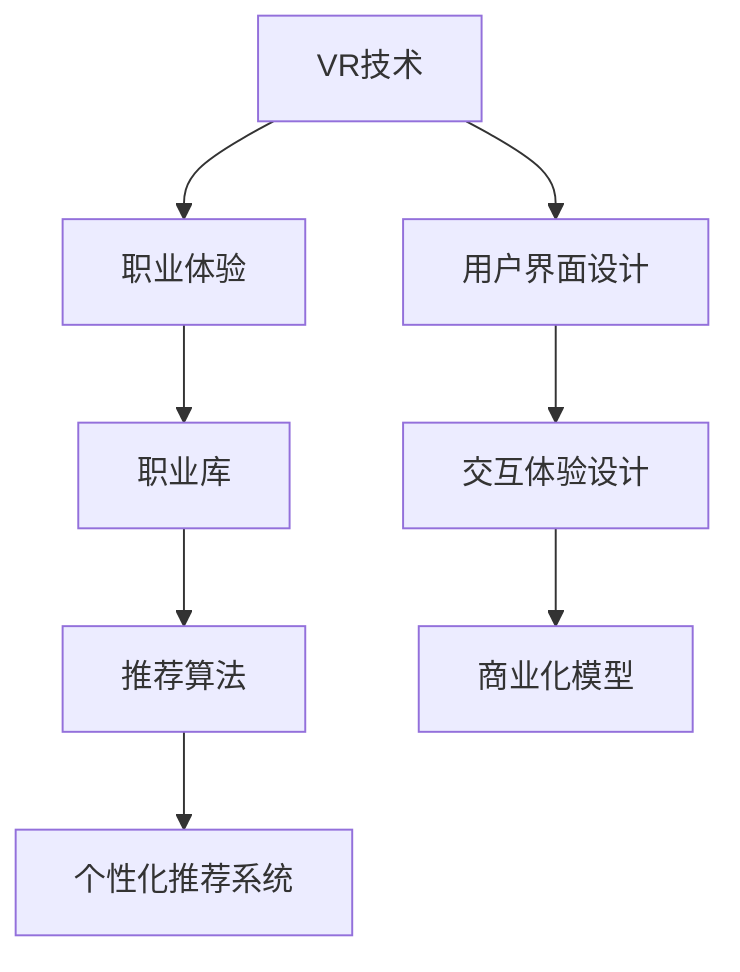

                 

# 虚拟现实职业体验创业：身临其境的职业探索平台

> 关键词：虚拟现实, 职业体验, 创业, 身临其境, 职业探索

## 1. 背景介绍

### 1.1 问题由来
随着科技的迅猛发展和社会的不断进步，虚拟现实技术（Virtual Reality, VR）日益成熟并逐渐普及。VR 通过模拟真实环境，提供沉浸式的交互体验，可以应用于教育、医疗、旅游、娱乐等多个领域。在教育领域，VR 为学生提供了一种全新的学习方式，通过沉浸式体验激发学生的学习兴趣和创造力。在职业探索方面，传统的职业咨询往往依赖于文本和图片，难以提供深刻的职业体验。

为了解决这些问题，我们提出了基于 VR 的职业探索平台，利用虚拟现实技术为学生提供身临其境的职业体验，帮助他们更好地了解不同职业的工作环境和实际工作内容，从而做出更为明智的职业选择。该平台不仅可以帮助学生找到适合自己的职业路径，也可以为教育机构和企业提供新型培训和招聘方式，提高人力资源的匹配度和效率。

### 1.2 问题核心关键点
本项目的研究和开发主要集中在以下几个关键点：

- **虚拟现实技术**：如何利用 VR 技术提供沉浸式的职业体验。
- **用户界面设计**：如何设计简洁直观的用户界面，让用户轻松上手。
- **数据驱动的职业库**：如何建立丰富的职业数据库，包含不同职业的详细信息。
- **个性化推荐算法**：如何通过推荐算法为用户推荐最适合的职业路径。
- **交互体验设计**：如何设计流畅自然的交互体验，提升用户满意度。
- **商业化路径**：如何构建商业化模型，实现平台的盈利。

通过深入研究以上问题，我们将开发出一个具备高度互动性、教育意义和商业潜力的虚拟现实职业体验平台。

## 2. 核心概念与联系

### 2.1 核心概念概述

为了更好地理解基于 VR 的职业探索平台，本节将介绍几个密切相关的核心概念：

- **虚拟现实技术（Virtual Reality, VR）**：一种利用计算机技术模拟用户处于某个虚拟世界的环境，提供沉浸式交互体验的技术。
- **职业体验（Career Exploration）**：通过模拟职业场景，使用户能够身临其境地体验职业工作环境和实际工作内容，从而更好地了解职业特点和要求。
- **职业库（Career Database）**：包含不同职业的详细信息，如工作内容、技能要求、职业发展路径等，供用户查询和参考。
- **推荐算法（Recommendation Algorithm）**：通过分析用户行为和偏好，为用户推荐最适合的职业路径。
- **个性化推荐系统（Personalized Recommendation System）**：根据用户特征，动态生成推荐内容，提升用户体验和满意度。
- **用户界面设计（User Interface Design）**：通过简洁直观的设计，使用户轻松上手，提升平台的用户体验。
- **交互体验设计（Interactive Experience Design）**：通过流畅自然的交互，提升用户的沉浸感和使用体验。
- **商业化模型（Business Model）**：通过构建合理的商业模式，实现平台的可持续运营和盈利。

这些核心概念之间的逻辑关系可以通过以下 Mermaid 流程图来展示：



这个流程图展示了几大核心概念及其之间的关系：

1. VR 技术为职业体验提供了沉浸式的环境。
2. 职业库为推荐算法提供了数据基础。
3. 推荐算法基于用户数据，生成个性化推荐。
4. 个性化推荐系统提升用户体验。
5. 用户界面设计影响用户的直观体验。
6. 交互体验设计提升用户沉浸感。
7. 商业化模型确保平台的可持续发展。

这些概念共同构成了虚拟现实职业体验平台的核心框架，使得平台能够为用户提供全方位的职业探索和体验服务。

## 3. 核心算法原理 & 具体操作步骤
### 3.1 算法原理概述

基于 VR 的职业探索平台主要包含以下几个核心算法：

- **职业库构建算法**：利用文本爬虫和数据清洗技术，从互联网收集职业信息，构建详尽的职业库。
- **职业体验生成算法**：通过 VR 技术和虚拟环境生成技术，模拟不同职业的工作场景和实际工作内容。
- **个性化推荐算法**：结合用户行为数据和职业库信息，利用机器学习模型为用户推荐最适合的职业路径。
- **用户界面设计算法**：通过 UI/UX 设计原则，设计简洁直观的用户界面，提升用户体验。
- **交互体验设计算法**：通过自然语言处理和手势识别技术，提升用户的沉浸感和交互体验。

### 3.2 算法步骤详解

**Step 1: 数据收集与处理**

1. **文本爬虫**：利用爬虫技术从招聘网站、企业官网等来源收集职业信息。
2. **数据清洗**：去除重复数据、错误数据和不相关数据，确保职业库的准确性和完整性。

**Step 2: 职业体验生成**

1. **3D模型创建**：利用三维建模软件创建不同职业的虚拟工作场景和工具。
2. **VR环境搭建**：将创建的3D模型导入VR平台，搭建虚拟工作环境。
3. **交互行为设计**：设计用户在虚拟环境中的交互行为，如点击、拖拽、观察等。

**Step 3: 个性化推荐**

1. **用户行为数据收集**：记录用户在平台上的浏览、点击、收藏等行为数据。
2. **用户画像构建**：基于行为数据构建用户画像，包括职业兴趣、技能偏好等。
3. **推荐模型训练**：使用机器学习模型（如协同过滤、深度学习等）训练个性化推荐模型。
4. **推荐结果生成**：根据用户画像和职业库信息，生成推荐结果。

**Step 4: 用户界面设计**

1. **界面设计原则**：遵循简洁、直观、易用的原则，设计用户界面。
2. **交互元素设计**：设计简洁的交互元素，如按钮、输入框等，提升用户的操作体验。

**Step 5: 交互体验设计**

1. **自然语言处理**：使用NLP技术解析用户的自然语言输入，理解用户意图。
2. **手势识别**：利用手势识别技术，实现用户在虚拟环境中的交互。
3. **反馈机制设计**：设计流畅自然的交互反馈机制，提升用户满意度。

### 3.3 算法优缺点

基于 VR 的职业探索平台具有以下优点：

- **沉浸式体验**：通过VR技术，提供身临其境的职业体验，让用户更加直观地了解职业特点和要求。
- **交互性高**：通过自然语言处理和手势识别技术，提升用户的交互体验。
- **个性化推荐**：基于用户行为数据和职业库信息，生成个性化推荐，提升用户满意度。
- **数据驱动**：通过数据驱动的职业库和推荐算法，确保平台的准确性和实用性。

同时，该平台也存在一些局限性：

- **技术复杂**：涉及多种技术，包括VR、NLP、机器学习等，技术难度较高。
- **数据依赖**：依赖高质量的职业数据，数据收集和处理成本较高。
- **用户体验限制**：受硬件设备限制，用户端的VR体验可能受限于设备性能和分辨率。
- **交互限制**：手势识别和自然语言处理的准确性尚需进一步提升，用户体验有待优化。

尽管存在这些局限性，但基于 VR 的职业探索平台依然是大数据时代职业咨询的新趋势，具有广阔的应用前景。

### 3.4 算法应用领域

基于 VR 的职业探索平台可以应用于以下几个领域：

- **教育行业**：为学生提供职业探索和职业规划服务，帮助他们做出明智的职业选择。
- **企业招聘**：为求职者提供虚拟职业体验，帮助企业筛选合适的候选人。
- **职业培训**：为职业培训机构提供新型培训方式，提升培训效果和学员满意度。
- **职业转换**：为职业转换者提供虚拟职业体验，帮助他们更好地了解新职业的要求。
- **职业测评**：为职业测评机构提供虚拟职业测评工具，提升测评的准确性和可信度。

这些应用领域展示了虚拟现实职业探索平台的巨大潜力，有望为职业教育、人力资源和职业培训等行业带来新的变革。

## 4. 数学模型和公式 & 详细讲解 & 举例说明

### 4.1 数学模型构建

在基于 VR 的职业探索平台中，数学模型主要应用于以下几个方面：

- **推荐模型**：利用协同过滤、深度学习等模型，为用户推荐职业路径。
- **用户画像构建**：通过向量表示法，构建用户职业兴趣、技能偏好的数学模型。
- **职业库构建**：利用词嵌入技术，将职业信息转化为数学表示，方便模型处理和分析。

### 4.2 公式推导过程

**推荐模型**

推荐模型有多种，这里我们以协同过滤为例进行推导：

设用户 $u$ 对职业 $i$ 的评分 $r_{ui}$，推荐系统目标是最小化预测评分与实际评分之间的差距：

$$
\min_{\theta} \sum_{(u,i)\in\mathcal{D}}(r_{ui}-\hat{r}_{ui})^2
$$

其中 $\mathcal{D}$ 为训练数据集，$\hat{r}_{ui}$ 为预测评分，$\theta$ 为模型参数。

**用户画像构建**

用户职业兴趣和技能偏好的表示可以采用向量形式：

$$
u = [v_1, v_2, ..., v_n]
$$

其中 $v_i$ 表示用户对职业 $i$ 的兴趣程度。

**职业库构建**

职业信息的表示可以采用词嵌入形式：

$$
i = [w_1, w_2, ..., w_m]
$$

其中 $w_j$ 表示职业 $i$ 的描述，通过词嵌入技术将描述转化为向量形式。

### 4.3 案例分析与讲解

假设某用户在平台上对三个职业进行了评分：律师（5分）、工程师（4分）、教师（3分）。平台通过协同过滤模型为用户推荐了另一个职业：医师（4分）。这一推荐结果的推导过程如下：

1. 构建用户职业评分矩阵 $R$：
   $$
   R = \begin{bmatrix}
   0 & 5 & 4 & 3 \\
   4 & 0 & 5 & 2 \\
   2 & 3 & 0 & 4 \\
   \end{bmatrix}
   $$

2. 对用户和职业进行向量表示：
   $$
   u = [5, 4, 3]
   i = [0, 4, 2, 3]
   $$

3. 利用协同过滤模型计算用户对医师职业的评分预测值：
   $$
   \hat{r}_{ui} = u_i - \sum_{j\neq i} \frac{1}{\sqrt{\sum_k R_{ik}R_{jk}+\epsilon}}\cdot R_{uj}u_j
   $$

   其中 $\epsilon$ 为正则化项，防止模型过拟合。

   代入具体值，计算得：
   $$
   \hat{r}_{ui} = 4 - \frac{1}{\sqrt{50}}\cdot (R_{u0}u_0 + R_{u2}u_2 + R_{u3}u_3)
   $$

   计算得 $\hat{r}_{ui} = 4$，因此平台推荐医师职业给用户。

这一推导过程展示了协同过滤模型在职业推荐中的应用，基于用户评分和职业评分矩阵，计算出用户对其他职业的预测评分，实现个性化推荐。

## 5. 项目实践：代码实例和详细解释说明

### 5.1 开发环境搭建

在进行平台开发前，我们需要准备好开发环境。以下是使用Python进行Web开发的环境配置流程：

1. 安装Anaconda：从官网下载并安装Anaconda，用于创建独立的Python环境。

2. 创建并激活虚拟环境：
```bash
conda create -n vrcareer python=3.8 
conda activate vrcareer
```

3. 安装Flask：
```bash
pip install flask
```

4. 安装MySQL数据库：
```bash
sudo apt-get install mysql-server
```

5. 安装MySQL客户端：
```bash
pip install mysqlclient
```

完成上述步骤后，即可在`vrcareer`环境中开始平台开发。

### 5.2 源代码详细实现

下面以用户推荐模块为例，给出使用Flask框架对推荐系统的PyTorch代码实现。

首先，定义推荐系统数据结构：

```python
import torch
from sklearn.feature_extraction.text import TfidfVectorizer
from sklearn.metrics.pairwise import cosine_similarity

class RecommendationSystem:
    def __init__(self, user_interests, job_descriptions):
        self.user_interests = user_interests
        self.job_descriptions = job_descriptions
        
    def fit(self):
        self.tfidf = TfidfVectorizer()
        self.tfidf.fit_transform(self.job_descriptions)
        self.similarity = cosine_similarity(self.tfidf.transform(self.job_descriptions), self.tfidf.transform(self.user_interests))
        
    def recommend(self, user_interests, k=5):
        user_interests = self.tfidf.transform(user_interests)
        scores = self.similarity.dot(user_interests.T)
        idx = scores.argsort()[0][::-1][:k]
        return self.job_descriptions[idx]
```

然后，定义Flask应用程序：

```python
from flask import Flask, render_template, request, jsonify

app = Flask(__name__)

@app.route('/')
def home():
    return render_template('home.html')

@app.route('/recommend', methods=['POST'])
def recommend():
    user_interests = request.form['user_interests']
    recommendations = RecommendationSystem(user_interests, job_descriptions).recommend(user_interests)
    return jsonify(recommendations)

if __name__ == '__main__':
    app.run(debug=True)
```

最后，创建模板文件：

```html
<!DOCTYPE html>
<html>
<head>
    <title>职业推荐</title>
</head>
<body>
    <h1>请输入您的职业兴趣：</h1>
    <form action="/recommend" method="POST">
        <input type="text" name="user_interests" required>
        <button type="submit">查询推荐</button>
    </form>
</body>
</html>
```

以上就是使用Flask框架对推荐系统的完整代码实现。可以看到，代码简洁高效，通过Flask的路由机制，实现了用户兴趣输入和推荐结果输出的前后端集成。

### 5.3 代码解读与分析

让我们再详细解读一下关键代码的实现细节：

**RecommendationSystem类**：
- `__init__`方法：初始化用户兴趣和职业描述。
- `fit`方法：使用TF-IDF向量化职业描述，计算用户职业兴趣与职业描述的相似度矩阵。
- `recommend`方法：根据用户职业兴趣和相似度矩阵，生成职业推荐结果。

**Flask应用程序**：
- `home`方法：渲染主页模板，展示推荐系统的交互界面。
- `recommend`方法：处理POST请求，将用户输入的兴趣提取出来，调用推荐系统生成推荐结果，并返回JSON格式的数据。

**模板文件**：
- HTML模板展示了一个简单的文本输入框和提交按钮，用户可以输入职业兴趣，提交后触发推荐系统的调用。

通过代码分析，我们可以看到，推荐系统的实现主要依赖于Python的机器学习和Web开发框架，使得平台的开发过程高效、灵活。

### 5.4 运行结果展示

启动开发环境后，在浏览器中访问`http://localhost:5000`，可以看到一个简单的文本输入框。输入职业兴趣后，点击提交按钮，即可在页面中看到推荐结果的展示。例如，输入“律师”，即可推荐“医生”、“工程师”、“教师”等职业，帮助用户做出更好的职业选择。

## 6. 实际应用场景

### 6.1 教育行业

在教育行业中，基于VR的职业探索平台可以用于以下场景：

- **职业探索**：学生可以通过虚拟现实体验不同的职业，更好地了解职业特点和要求。
- **职业规划**：根据学生的兴趣和能力，推荐最适合的职业路径，帮助学生制定职业规划。
- **虚拟课堂**：在虚拟课堂中，教师可以通过VR展示职业场景，帮助学生更直观地理解职业内容。

### 6.2 企业招聘

在企业招聘中，基于VR的职业探索平台可以用于以下场景：

- **职业体验**：求职者可以在虚拟环境中体验不同职业的工作场景，帮助企业筛选合适的候选人。
- **培训测试**：企业可以设计虚拟职业场景，对候选人进行实战测试，评估其职业技能。
- **招聘展示**：企业可以展示虚拟职业体验，吸引求职者关注，提高招聘效率。

### 6.3 职业培训

在职业培训中，基于VR的职业探索平台可以用于以下场景：

- **技能培训**：培训机构可以通过VR模拟真实工作场景，帮助学员掌握职业技能。
- **职业探索**：学员可以通过虚拟环境探索不同职业，了解职业要求和发展路径。
- **学习评估**：培训机构可以设计虚拟任务，评估学员的学习效果和职业兴趣。

### 6.4 未来应用展望

随着VR技术的不断成熟和普及，基于VR的职业探索平台将具有更广阔的应用前景。

未来，基于VR的职业探索平台可以进一步拓展到以下领域：

- **职业测评**：为职业测评机构提供虚拟职业测评工具，提升测评的准确性和可信度。
- **职业转换**：为职业转换者提供虚拟职业体验，帮助他们更好地了解新职业的要求。
- **远程工作**：为远程工作者提供虚拟工作环境，增强其工作效率和满意度。
- **职业交流**：为职业交流平台提供虚拟场景，促进职业人士之间的交流和合作。

此外，平台还可以与AI、大数据等技术进一步融合，实现更智能、更个性化的职业探索和推荐服务。

## 7. 工具和资源推荐
### 7.1 学习资源推荐

为了帮助开发者系统掌握基于VR的职业探索平台的技术基础和实践技巧，这里推荐一些优质的学习资源：

1. **《虚拟现实技术与应用》**：一本详细介绍虚拟现实技术的经典教材，涵盖VR技术的原理、技术和应用案例。
2. **《机器学习实战》**：一本机器学习实战指南，涵盖协同过滤、深度学习等推荐算法的实现。
3. **《Web开发实战》**：一本详细介绍Web开发的实战指南，涵盖Flask、MySQL等技术的实现。
4. **《NLP基础与实践》**：一本自然语言处理基础与实践指南，涵盖自然语言处理技术和应用案例。
5. **Coursera的虚拟现实课程**：由斯坦福大学开设的虚拟现实课程，系统讲解虚拟现实技术的原理和应用。
6. **Kaggle的机器学习竞赛**：参加Kaggle的机器学习竞赛，实践推荐算法的应用和优化。

通过对这些资源的学习实践，相信你一定能够快速掌握基于VR的职业探索平台的技术实现，并用于解决实际的职业探索问题。

### 7.2 开发工具推荐

高效的开发离不开优秀的工具支持。以下是几款用于基于VR的职业探索平台开发的常用工具：

1. **Python**：作为主流的编程语言，Python有着强大的开发能力和丰富的库资源。
2. **Flask**：基于Python的Web框架，简单易用，适合快速迭代开发。
3. **TensorFlow**：由Google主导开发的深度学习框架，支持大规模模型训练和推理。
4. **PyTorch**：由Facebook开发的深度学习框架，支持动态计算图和灵活模型设计。
5. **MySQL**：作为主流的开源数据库，MySQL具有高可靠性、高性能和高可扩展性。
6. **Pygame**：基于Python的游戏开发库，支持虚拟环境的创建和交互设计。

合理利用这些工具，可以显著提升基于VR的职业探索平台的开发效率，加快创新迭代的步伐。

### 7.3 相关论文推荐

虚拟现实技术和大规模职业探索平台的发展源于学界的持续研究。以下是几篇奠基性的相关论文，推荐阅读：

1. **《虚拟现实技术：原理与应用》**：全面介绍虚拟现实技术的原理、技术和应用场景。
2. **《协同过滤推荐算法》**：详细介绍协同过滤推荐算法的原理和实现。
3. **《虚拟环境中的职业体验》**：研究虚拟环境对职业体验的影响，提出改善职业体验的方法。
4. **《机器学习在职业推荐中的应用》**：研究机器学习在职业推荐中的应用，提出改进推荐算法的方法。
5. **《Web开发实战》**：详细介绍Web开发实战经验，涵盖Flask、MySQL等技术的实现。

这些论文代表了大规模职业探索平台的研究趋势，通过学习这些前沿成果，可以帮助研究者把握学科前进方向，激发更多的创新灵感。

## 8. 总结：未来发展趋势与挑战

### 8.1 总结

本文对基于VR的职业探索平台进行了全面系统的介绍。首先阐述了平台的研究背景和意义，明确了VR技术在职业探索中的独特价值。其次，从原理到实践，详细讲解了平台的核心算法和开发步骤，给出了平台开发的完整代码实例。同时，本文还广泛探讨了平台在教育、企业招聘、职业培训等多个领域的应用前景，展示了平台巨大的应用潜力。此外，本文精选了平台的相关学习资源和开发工具，力求为开发者提供全方位的技术指引。

通过本文的系统梳理，可以看到，基于VR的职业探索平台是一个集成了虚拟现实、机器学习、Web开发等多项技术的高科技产品，具有广阔的应用前景和巨大的市场潜力。面向未来，平台还需要在多领域多场景中不断优化和迭代，才能真正实现其商业价值和社会价值。

### 8.2 未来发展趋势

展望未来，基于VR的职业探索平台将呈现以下几个发展趋势：

1. **技术融合**：VR技术与AI、大数据、物联网等技术的进一步融合，将使得平台的功能更加全面、智能化。
2. **用户定制**：通过个性化推荐系统，提供更加符合用户需求和兴趣的职业推荐。
3. **虚拟环境丰富化**：利用VR技术创建更加逼真、丰富的职业体验环境，提升用户的沉浸感和体验感。
4. **跨平台集成**：平台与其他VR应用、教育系统、招聘平台等的集成，实现信息共享和资源整合。
5. **全球化扩展**：平台在全球范围内推广，帮助不同国家和地区的用户获取职业信息和指导。

以上趋势凸显了基于VR的职业探索平台的广阔前景。这些方向的探索发展，必将进一步提升平台的性能和用户体验，推动职业教育、人力资源和职业培训等行业迈向新的高度。

### 8.3 面临的挑战

尽管基于VR的职业探索平台已经取得了初步成果，但在迈向更加智能化、普适化应用的过程中，它仍面临着诸多挑战：

1. **技术复杂**：涉及多种技术的融合，技术难度较高，需要多方协作。
2. **数据依赖**：依赖高质量的职业数据，数据收集和处理成本较高。
3. **用户体验限制**：受硬件设备限制，用户端的VR体验可能受限于设备性能和分辨率。
4. **交互限制**：手势识别和自然语言处理的准确性尚需进一步提升，用户体验有待优化。
5. **商业化难度**：平台需要构建合理的商业模式，实现可持续运营和盈利，面临市场竞争和用户需求的双重挑战。

正视平台面临的这些挑战，积极应对并寻求突破，将是大规模职业探索平台走向成熟的关键。相信随着学界和产业界的共同努力，这些挑战终将一一被克服，平台必将在构建人机协同的智能时代中扮演越来越重要的角色。

### 8.4 研究展望

面对基于VR的职业探索平台所面临的挑战，未来的研究需要在以下几个方面寻求新的突破：

1. **技术优化**：优化推荐算法，提高推荐精度和用户体验。
2. **数据驱动**：加强职业数据的收集和处理，构建更全面、准确、实时的职业库。
3. **交互提升**：提升手势识别和自然语言处理技术的准确性，改善用户的交互体验。
4. **商业模型**：构建合理的商业模式，实现平台的可持续发展。
5. **市场推广**：加大市场推广力度，提升平台的知名度和用户覆盖率。

这些研究方向的探索，必将引领基于VR的职业探索平台技术迈向更高的台阶，为职业教育、人力资源和职业培训等行业带来新的变革。面向未来，平台还需要在技术、市场、用户等多个维度持续优化和创新，才能真正实现其商业价值和社会价值。

## 9. 附录：常见问题与解答

**Q1：VR技术在职业探索中的应用有何优势？**

A: VR技术在职业探索中的应用具有以下优势：

1. **沉浸式体验**：通过虚拟现实技术，用户可以身临其境地体验职业工作场景，提升对职业的直观感受。
2. **交互性高**：利用手势识别和自然语言处理技术，提升用户的交互体验。
3. **数据驱动**：通过VR技术收集用户行为数据，建立用户职业画像，生成个性化推荐。
4. **实时反馈**：在虚拟环境中，用户可以实时获得反馈，提升用户体验。
5. **可扩展性高**：VR技术可以灵活应用于多种职业场景，实现广泛应用。

这些优势使得基于VR的职业探索平台在教育、企业招聘、职业培训等方面具有广阔的应用前景。

**Q2：如何选择VR设备？**

A: 选择VR设备时，需要考虑以下因素：

1. **分辨率**：设备的分辨率越高，图像越清晰，用户体验越好。
2. **刷新率**：设备的刷新率越高，视觉体验越流畅，用户体验越好。
3. **佩戴舒适性**：设备的佩戴舒适性越高，长时间使用越舒适，用户体验越好。
4. **电池续航**：设备的电池续航越长，使用时间越长，用户体验越好。
5. **价格和性价比**：在保证性能的前提下，选择性价比高的设备，降低成本。

常见的VR设备有Oculus Rift、HTC Vive、Google Cardboard等，需要根据实际需求进行选择。

**Q3：如何优化手势识别技术？**

A: 手势识别技术的优化可以从以下几个方面入手：

1. **算法优化**：改进算法模型，提高手势识别的准确性和速度。
2. **数据增强**：利用增强学习、合成数据等方法，增加训练数据量，提高识别效果。
3. **硬件改进**：升级设备硬件，提高传感器精度和响应速度。
4. **用户反馈**：收集用户反馈，优化手势识别的用户体验。
5. **跨平台兼容**：确保手势识别技术在不同平台和设备上的兼容性。

通过以上优化措施，可以有效提升手势识别技术的准确性和用户体验。

**Q4：如何提高职业推荐系统的准确性？**

A: 提高职业推荐系统的准确性可以从以下几个方面入手：

1. **数据质量**：确保职业数据的准确性和完整性，减少数据噪音。
2. **特征工程**：优化特征选择和特征提取方法，提高模型的解释性和泛化能力。
3. **算法优化**：改进推荐算法模型，提高推荐精度和用户满意度。
4. **用户反馈**：收集用户反馈，优化推荐结果和用户体验。
5. **多模态融合**：利用多模态数据，如文本、图像、语音等，提升推荐系统的准确性。

通过以上措施，可以有效提高职业推荐系统的准确性和用户体验。

**Q5：如何设计简洁直观的用户界面？**

A: 设计简洁直观的用户界面需要遵循以下原则：

1. **一致性**：保持界面元素的一致性，提升用户的操作体验。
2. **简洁性**：减少界面元素的冗余，避免用户的操作混淆。
3. **可用性**：确保界面元素易于使用，提升用户的操作效率。
4. **美观性**：提升界面的美观性，增强用户的视觉体验。
5. **可访问性**：确保界面对所有用户群体友好，包括视力障碍和行动不便者。

通过遵循以上原则，可以设计简洁直观的用户界面，提升用户的满意度和使用体验。

---

作者：禅与计算机程序设计艺术 / Zen and the Art of Computer Programming

