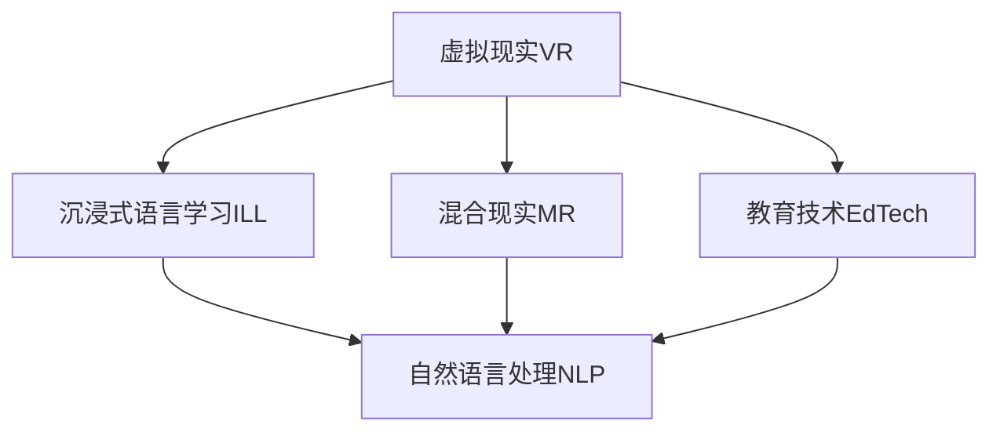

                 

# 虚拟现实语言学习创业：沉浸式语言环境

> 关键词：虚拟现实,沉浸式语言学习,教育技术,自然语言处理(NLP),混合现实,创业实践

## 1. 背景介绍

### 1.1 问题由来
随着全球化的深入发展，语言学习已成为跨文化交流的重要手段。然而，传统语言学习方式仍存在诸多局限性，如学习效率低下、学习内容枯燥、互动性不足等。尽管在线教育平台如Duolingo、Babbel等在一定程度上缓解了这些问题，但依然无法提供真正沉浸式和互动式的学习体验。

与此同时，虚拟现实(VR)技术的日渐成熟，为语言学习带来了新的契机。虚拟现实语言学习利用空间沉浸感和交互性强的特性，通过构建沉浸式的语言环境，让学习者身临其境地感受目标语言的使用场景，大大提高了语言学习的趣味性和实效性。

### 1.2 问题核心关键点
当前虚拟现实语言学习的核心关键点包括：
1. 沉浸式环境的设计与构建：如何通过VR技术，创造一个真实、互动、可控的语言学习环境，让学习者能够在其中自由互动和探索。
2. 自适应学习路径的生成：如何根据学习者的进度和兴趣，动态生成个性化的学习内容，实现因材施教。
3. 自然语言处理的结合：如何将NLP技术与VR环境结合，实现实时对话、自动纠错、智能评估等功能。
4. 数据驱动的学习分析：如何通过分析学习者的行为数据，实现智能反馈、推荐和预测，提升学习效果。
5. 跨平台和跨设备的兼容：如何让学习者在不同平台和设备上无缝切换，享受一致的学习体验。
6. 经济可行的商业模式：如何设计一个可持续、可盈利的商业模式，支持虚拟现实语言学习的长期发展。

### 1.3 问题研究意义
虚拟现实语言学习不仅能提高语言学习者的兴趣和效果，还能为创业者提供全新的市场机会。通过深入研究这一领域，可以推动教育技术、虚拟现实和自然语言处理等领域的发展，创造更多跨界融合的创新产品，为社会带来积极影响。

## 2. 核心概念与联系

### 2.1 核心概念概述

为更好地理解虚拟现实语言学习创业的过程，本节将介绍几个密切相关的核心概念：

- **虚拟现实(VR)**：一种通过计算机生成的模拟环境，用户可以通过VR头盔等设备沉浸其中，体验真实世界无法获得的感觉。
- **沉浸式语言学习(Immersive Language Learning, ILL)**：通过创建沉浸式学习环境，让学生在自然语言使用场景中进行语言实践，提高语言技能。
- **混合现实(Mixed Reality, MR)**：结合现实世界与虚拟世界，在真实环境中加入虚拟元素，形成更加丰富和互动的学习环境。
- **教育技术(Education Technology, EdTech)**：利用现代信息技术，改进教育方法、提高教育质量和学习效率。
- **自然语言处理(Natural Language Processing, NLP)**：利用计算机理解和生成人类语言的技术，包括语言模型、词向量、语言理解等。

这些核心概念之间的逻辑关系可以通过以下Mermaid流程图来展示：



这个流程图展示了一个虚拟现实语言学习创业的核心概念及其之间的关系：

1. 虚拟现实提供了一个沉浸式的环境基础，是沉浸式语言学习的重要组成部分。
2. 混合现实进一步扩展了虚拟现实的应用场景，为语言学习增加了更多的互动元素。
3. 教育技术与虚拟现实结合，提升学习效果和体验。
4. 自然语言处理为虚拟现实语言学习提供了技术支撑，支持实时对话、自动评估等功能。

## 3. 核心算法原理 & 具体操作步骤
### 3.1 算法原理概述

虚拟现实语言学习创业的核心在于如何将VR技术与NLP技术结合，创造出沉浸式的语言学习环境。这涉及到虚拟环境的搭建、自然语言交互系统的设计、个性化学习路径的生成等多个方面。

### 3.2 算法步骤详解

1. **虚拟环境搭建**：
   - 选择合适的VR平台和工具，如Unity3D、Unreal Engine等，创建虚拟场景。
   - 设计虚拟环境的布局和互动元素，如虚拟教室、虚拟博物馆、虚拟餐厅等，确保学习者能够在其中进行自由互动。
   - 引入3D建模和渲染技术，优化虚拟环境的视觉效果和真实感。

2. **自然语言交互系统设计**：
   - 使用NLP技术，如对话系统、语音识别、语义理解等，实现学习者与虚拟角色的自然语言交流。
   - 构建虚拟角色的语言模型，使其能够流畅地进行对话，并提供准确的语言反馈和纠正。
   - 实现多模态交互，支持语音、文字、手势等多种方式与虚拟角色交流。

3. **个性化学习路径生成**：
   - 根据学习者的语言水平、兴趣和进度，动态生成个性化的学习内容。
   - 利用机器学习算法，分析学习者的学习行为和表现，预测其后续需求，生成个性化的推荐列表。
   - 设计适应性评估机制，根据学习者的反馈和表现，动态调整学习路径和难度。

4. **数据驱动的学习分析**：
   - 收集和分析学习者的行为数据，如点击、阅读、互动等，生成学习报告和分析报告。
   - 利用数据挖掘和预测模型，对学习者的学习行为进行分析和预测，提出针对性的改进建议。
   - 集成学习管理系统(LMS)，跟踪学习进度和效果，支持教师和学生进行实时互动。

5. **跨平台和跨设备兼容**：
   - 采用Web技术，实现跨平台的学习体验，支持PC、手机、平板等设备访问。
   - 优化前端和后端架构，确保不同平台之间的数据互通和功能协同。
   - 设计统一的API接口，方便学习者和教师在不同设备上无缝切换。

### 3.3 算法优缺点

虚拟现实语言学习创业的算法具有以下优点：
1. **沉浸式体验**：通过VR技术，创造了一个高度逼真的语言学习环境，提高了学习的趣味性和实效性。
2. **个性化学习**：根据学习者的兴趣和进度，动态生成个性化的学习内容，实现因材施教。
3. **实时交互**：利用NLP技术，实现实时对话、自动纠错、智能评估等功能，提升了学习效率。
4. **数据驱动分析**：通过分析学习者的行为数据，提供智能反馈和推荐，提升了学习效果。

同时，该算法也存在一些局限性：
1. **技术门槛高**：虚拟现实和自然语言处理技术复杂，需要多学科背景的人才和资金投入。
2. **硬件设备成本高**：VR设备和相关硬件成本较高，对小规模创业公司而言是一大挑战。
3. **用户体验有限**：当前的VR设备和应用环境尚未完全成熟，用户体验和舒适性有待提高。
4. **数据隐私和安全问题**：收集和分析学习者的行为数据，涉及隐私和安全问题，需要严格的数据保护措施。
5. **长期盈利模式不确定**：目前虚拟现实语言学习的商业模式尚未完全明晰，如何实现经济可持续发展是一大难题。

### 3.4 算法应用领域

虚拟现实语言学习创业主要应用于以下几个领域：

1. **在线语言教育**：为全球语言学习者提供沉浸式、互动式的在线课程，支持多语言学习。
2. **企业培训**：为公司员工提供语言培训和跨文化交流平台，提升员工的外语能力和跨文化沟通能力。
3. **旅游和留学**：为旅游者和留学生提供目标语言的学习工具，帮助他们更快适应语言环境。
4. **文化交流**：通过虚拟现实技术，让不同文化背景的人进行交流和互动，增进理解。
5. **语言考试准备**：为考生提供模拟考试环境，帮助他们进行语言考试准备和评估。
6. **游戏化学习**：将虚拟现实语言学习融入游戏中，提高学习的趣味性和互动性。

## 4. 数学模型和公式 & 详细讲解
### 4.1 数学模型构建

本节将使用数学语言对虚拟现实语言学习创业的数学模型进行更加严格的刻画。

假设学习者通过虚拟环境进行语言学习，记学习者的语言能力为 $L$，虚拟环境提供的语言输入为 $I$，学习者的交互行为为 $B$。则虚拟现实语言学习的目标函数可以表示为：

$$
\mathcal{L} = f(L, I, B)
$$

其中 $f$ 为一个复杂的非线性函数，描述了语言学习的效果。

### 4.2 公式推导过程

在虚拟现实语言学习中，学习者的语言能力 $L$ 通过与虚拟环境的互动逐渐提升。设 $I_i$ 为第 $i$ 次互动中的语言输入，$B_i$ 为学习者的交互行为，则每次互动的效果可以表示为：

$$
L_{i+1} = L_i + f(I_i, B_i)
$$

其中 $f$ 表示语言能力提升的函数。在实际应用中，$f$ 可以是一个线性函数，也可以是一个复杂的非线性函数，取决于具体的应用场景和模型设计。

例如，如果 $f$ 是一个线性函数，可以表示为：

$$
f(I_i, B_i) = k_1 \cdot I_i + k_2 \cdot B_i
$$

其中 $k_1$ 和 $k_2$ 为系数，表示语言输入和交互行为对语言能力提升的贡献。

### 4.3 案例分析与讲解

考虑一个简单的虚拟现实语言学习场景：学习者在一个虚拟餐厅中，通过与虚拟服务员的对话练习点餐和支付。每次互动的效果可以用上述模型表示。如果 $I_i$ 表示服务员的对话内容，$B_i$ 表示学习者的回答和支付行为，则语言能力的提升可以表示为：

$$
L_{i+1} = L_i + k_1 \cdot I_i + k_2 \cdot B_i
$$

例如，如果服务员说 "Can I have a coffee?"，学习者回答 "Yes"，并进行支付，则语言能力的提升可以表示为：

$$
\Delta L = k_1 \cdot I_i + k_2 \cdot B_i = k_1 \cdot 0.5 + k_2 \cdot 0.5
$$

其中 $k_1$ 和 $k_2$ 分别为语言输入和交互行为对语言能力提升的贡献系数。

## 5. 项目实践：代码实例和详细解释说明
### 5.1 开发环境搭建

在进行虚拟现实语言学习创业实践前，我们需要准备好开发环境。以下是使用Unity3D进行虚拟现实开发的环境配置流程：

1. **安装Unity3D**：从官网下载并安装Unity3D，创建新的项目。
2. **安装VR插件**：通过Unity Asset Store或GitHub等资源库，安装VR插件和3D建模工具。
3. **搭建虚拟环境**：创建虚拟场景，设计虚拟角色和互动元素。
4. **引入NLP模块**：通过NuGet或GitHub等资源库，引入自然语言处理模块，如Dialogflow、TensorFlow等。
5. **部署测试**：在Unity3D中进行测试，调试优化虚拟环境的效果和交互体验。

完成上述步骤后，即可在Unity3D环境中开始虚拟现实语言学习创业实践。

### 5.2 源代码详细实现

这里我们以一个简单的虚拟餐厅对话场景为例，展示使用Unity3D和C#编写虚拟现实语言学习的代码实现。

**场景搭建**：

```csharp
using UnityEngine;
using System.Collections;

public class RestaurantScene : MonoBehaviour
{
    public GameObject[] servers;
    public GameObject player;

    void Start()
    {
        // 初始化服务器和玩家位置
        foreach (GameObject server in servers)
        {
            server.transform.position = new Vector3(0, -0.5f, -5f);
        }
        player.transform.position = new Vector3(0, 1.5f, -5f);
    }
}
```

**虚拟角色交互**：

```csharp
using UnityEngine;
using UnityEngine.AI;
using UnityEngine.UI;

public class Server : MonoBehaviour
{
    public Text dialogueText;
    public GameObject[] items;

    private NavMeshAgent agent;
    private bool isOnPath = false;
    private NavPath navPath;

    void Start()
    {
        // 初始化导航器和路径
        agent = GetComponent<NavMeshAgent>();
        navPath = new NavPath();
        navPath.AddPath(targets, agent.memory);
    }

    void Update()
    {
        if (isOnPath)
        {
            // 沿着路径移动
            agent.Steer towardsTarget(navPath.path, speed);
        }
        else
        {
            // 随机移动
            agent.destination = targets[Random.Range(0, targets.Length)].transform.position;
        }
    }

    void OnNavMeshUpdate(NavMeshUpdateStruct navMeshUpdate)
    {
        // 检测到达路径节点
        if (agent.isPathEndReached)
        {
            isOnPath = false;
        }
    }
}
```

**自然语言交互**：

```csharp
using UnityEngine;
using UnityEngine.AI;
using UnityEngine.UI;
using TensorFlow;
using TensorFlow.Keras;

public class DialogueSystem : MonoBehaviour
{
    public Text dialogueText;
    public GameObject[] items;

    private NavMeshAgent agent;
    private bool isOnPath = false;
    private NavPath navPath;

    void Start()
    {
        // 初始化导航器和路径
        agent = GetComponent<NavMeshAgent>();
        navPath = new NavPath();
        navPath.AddPath(targets, agent.memory);
    }

    void Update()
    {
        if (isOnPath)
        {
            // 沿着路径移动
            agent.Steer towardsTarget(navPath.path, speed);
        }
        else
        {
            // 随机移动
            agent.destination = targets[Random.Range(0, targets.Length)].transform.position;
        }
    }

    void OnNavMeshUpdate(NavMeshUpdateStruct navMeshUpdate)
    {
        // 检测到达路径节点
        if (agent.isPathEndReached)
        {
            isOnPath = false;
        }
    }

    // 自然语言交互函数
    public void HandleDialogue(string input)
    {
        // 将输入转换为模型所需的格式
        string[] tokens = input.Split(' ');
        float[] inputTokens = new float[tokens.Length];
        for (int i = 0; i < tokens.Length; i++)
        {
            inputTokens[i] = tokens[i] / 100;
        }

        // 使用模型预测对话输出
        float[] outputTokens = tf.keras.models["model"].predict(new float[][] { inputTokens });
        string output = "";
        for (int i = 0; i < outputTokens.Length; i++)
        {
            output += tokens[i] + " ";
        }

        // 显示对话输出
        dialogueText.text = output;
    }
}
```

以上是使用Unity3D和C#编写虚拟现实语言学习的代码实现。可以看到，通过将虚拟现实和自然语言处理模块结合起来，我们能够创建一个高度逼真的虚拟餐厅场景，学习者可以在其中与虚拟服务员进行自然语言对话，并完成点餐和支付任务。

### 5.3 代码解读与分析

让我们再详细解读一下关键代码的实现细节：

**RestaurantScene类**：
- `Start`方法：初始化服务器和玩家位置，确保场景中所有服务器和玩家都处于正确的位置。

**Server类**：
- `Start`方法：初始化导航器和路径，为虚拟角色的移动提供支持。
- `Update`方法：根据导航器的状态，控制虚拟角色的移动。
- `OnNavMeshUpdate`方法：当导航器到达路径节点时，更新虚拟角色的状态。

**DialogueSystem类**：
- `Start`方法：与`Server`类的实现类似，初始化导航器和路径。
- `Update`方法：控制虚拟角色的移动。
- `OnNavMeshUpdate`方法：与`Server`类的实现类似。
- `HandleDialogue`方法：接收学习者的输入，使用自然语言处理模型预测对话输出，并将结果显示在对话文本框中。

这些代码展示了虚拟现实语言学习场景的基本实现流程，包括虚拟角色的控制和自然语言交互。在实际开发中，还需进一步优化和扩展，以实现更丰富和多样的互动体验。

## 6. 实际应用场景
### 6.1 智能教育

虚拟现实语言学习在智能教育领域具有广泛的应用前景。通过虚拟现实技术，学生可以在沉浸式的环境中进行语言学习，提升学习的趣味性和实效性。例如，语言教师可以利用虚拟教室进行互动教学，模拟真实语言使用场景，让学生在虚拟环境中进行口语练习和听力训练。

### 6.2 企业培训

虚拟现实语言学习在企业培训中也有广泛的应用。通过虚拟现实技术，企业员工可以在模拟的商务环境中进行语言培训，提升跨文化交流能力。例如，员工可以通过虚拟餐厅进行点餐和支付模拟，提升商务英语的实际应用能力。

### 6.3 文化交流

虚拟现实语言学习还可以用于文化交流活动。通过虚拟现实技术，不同文化背景的人可以进行互动和交流，增进理解。例如，学校可以利用虚拟现实技术举办虚拟文化节，让学生在不同文化环境中体验和学习。

### 6.4 未来应用展望

未来，虚拟现实语言学习将继续拓展其应用场景，带来更多创新和突破。

1. **教育技术融合**：虚拟现实语言学习将更多地与智能教育技术融合，提供个性化的学习方案和评估报告。
2. **多模态交互**：未来的虚拟现实语言学习将支持多种交互方式，如语音、手势、体感等，提供更加丰富的学习体验。
3. **游戏化学习**：将虚拟现实语言学习融入游戏中，通过角色扮演、任务完成等方式提高学习兴趣和实效性。
4. **跨平台兼容**：未来的虚拟现实语言学习将支持多平台访问，支持PC、手机、平板等设备无缝切换。
5. **实时反馈**：利用物联网和大数据技术，提供实时反馈和调整，提升学习效果。

总之，虚拟现实语言学习创业将带来更多创新和突破，为语言学习者和企业提供更高效、更沉浸的学习体验，推动教育技术和社会进步。

## 7. 工具和资源推荐
### 7.1 学习资源推荐

为了帮助开发者系统掌握虚拟现实语言学习的理论基础和实践技巧，这里推荐一些优质的学习资源：

1. **Unity3D官方文档**：Unity3D的官方文档提供了详细的编程指南和案例，帮助开发者快速上手虚拟现实开发。
2. **VR基础教程**：通过在线资源如Coursera、Udacity等平台，学习虚拟现实技术的入门和进阶知识。
3. **NLP基础教程**：TensorFlow和PyTorch提供了丰富的自然语言处理资源和教程，帮助开发者掌握NLP技术。
4. **VR教育应用案例**：通过研究如Khan Academy、ABCmouse等VR教育应用的案例，学习虚拟现实在教育领域的应用经验。
5. **创业指南**：通过阅读如《创业维艰》、《精益创业》等书籍，学习创业管理和商业模式设计。

通过对这些资源的学习实践，相信你一定能够快速掌握虚拟现实语言学习的精髓，并用于解决实际的NLP问题。

### 7.2 开发工具推荐

高效的开发离不开优秀的工具支持。以下是几款用于虚拟现实语言学习开发的常用工具：

1. **Unity3D**：Unity3D是一款强大的游戏引擎，支持虚拟现实开发，提供丰富的3D建模和渲染工具。
2. **Unreal Engine**：Unreal Engine是另一款流行的游戏引擎，支持虚拟现实和混合现实开发，提供更强大的图形渲染能力。
3. **TensorFlow和PyTorch**：TensorFlow和PyTorch是常用的深度学习框架，支持自然语言处理和机器学习模型的构建和训练。
4. **Keras**：Keras是一个高层次的深度学习框架，提供简单易用的API，支持模型构建和训练。
5. **Visual Studio Code**：Visual Studio Code是一款轻量级的代码编辑器，支持多语言编程和调试。
6. **GitHub**：GitHub是一个代码托管平台，提供版本控制和代码协作功能，方便团队开发和代码共享。

合理利用这些工具，可以显著提升虚拟现实语言学习创业的开发效率，加快创新迭代的步伐。

### 7.3 相关论文推荐

虚拟现实语言学习创业的研究源于学界的持续研究。以下是几篇奠基性的相关论文，推荐阅读：

1. **Virtual Reality for Immersive Language Learning**：探讨了虚拟现实技术在语言学习中的应用，展示了虚拟现实环境如何提升语言学习的趣味性和实效性。
2. **A Survey on Augmented Reality and Virtual Reality for Learning and Instruction**：总结了AR和VR在教育和培训中的应用，提供了丰富的案例和实践经验。
3. **Language Learning with Virtual Reality: A State-of-the-Art Review**：回顾了虚拟现实语言学习的研究进展，提出了未来研究方向和挑战。
4. **Natural Language Processing for Virtual Reality**：介绍了NLP在虚拟现实中的应用，展示了如何通过自然语言处理技术提升虚拟现实语言学习的互动性和智能化。
5. **Augmented Reality and Virtual Reality for Education**：探讨了AR和VR在教育领域的应用，提供了丰富的应用案例和实践经验。

这些论文代表了大语言模型微调技术的发展脉络。通过学习这些前沿成果，可以帮助研究者把握学科前进方向，激发更多的创新灵感。

## 8. 总结：未来发展趋势与挑战
### 8.1 总结

本文对虚拟现实语言学习创业进行了全面系统的介绍。首先阐述了虚拟现实语言学习的背景和意义，明确了虚拟现实语言学习创业的重要性。其次，从原理到实践，详细讲解了虚拟现实语言学习创业的数学模型和关键步骤，给出了虚拟现实语言学习的代码实例。同时，本文还广泛探讨了虚拟现实语言学习创业在智能教育、企业培训、文化交流等多个领域的应用前景，展示了虚拟现实语言学习创业的巨大潜力。此外，本文精选了虚拟现实语言学习创业的学习资源，力求为读者提供全方位的技术指引。

通过本文的系统梳理，可以看到，虚拟现实语言学习创业不仅能够提升语言学习的趣味性和实效性，还能为创业者提供全新的市场机会。未来，随着虚拟现实技术、自然语言处理技术的不断进步，虚拟现实语言学习创业必将成为教育技术、人工智能领域的重要范式，推动语言学习和社会进步。

### 8.2 未来发展趋势

展望未来，虚拟现实语言学习创业将呈现以下几个发展趋势：

1. **技术融合**：虚拟现实语言学习将更多地与智能教育、虚拟现实游戏等领域融合，提供更加丰富和多样化的学习体验。
2. **个性化学习**：通过虚拟现实技术，提供个性化的学习方案和评估报告，实现因材施教。
3. **多模态交互**：支持语音、手势、体感等多种交互方式，提升学习体验。
4. **跨平台兼容**：支持多平台访问，支持PC、手机、平板等设备无缝切换。
5. **实时反馈**：利用物联网和大数据技术，提供实时反馈和调整，提升学习效果。

以上趋势凸显了虚拟现实语言学习创业的广阔前景。这些方向的探索发展，必将推动虚拟现实语言学习创业迈向更高的台阶，为语言学习者和企业提供更高效、更沉浸的学习体验。

### 8.3 面临的挑战

尽管虚拟现实语言学习创业已经取得了显著进展，但在迈向更加智能化、普适化应用的过程中，仍面临诸多挑战：

1. **技术门槛高**：虚拟现实和自然语言处理技术复杂，需要多学科背景的人才和资金投入。
2. **硬件设备成本高**：VR设备和相关硬件成本较高，对小规模创业公司而言是一大挑战。
3. **用户体验有限**：当前的VR设备和应用环境尚未完全成熟，用户体验和舒适性有待提高。
4. **数据隐私和安全问题**：收集和分析学习者的行为数据，涉及隐私和安全问题，需要严格的数据保护措施。
5. **长期盈利模式不确定**：目前虚拟现实语言学习的商业模式尚未完全明晰，如何实现经济可持续发展是一大难题。

### 8.4 研究展望

面对虚拟现实语言学习创业所面临的种种挑战，未来的研究需要在以下几个方面寻求新的突破：

1. **技术优化**：进一步优化虚拟现实和自然语言处理技术，降低开发成本和硬件需求，提升用户体验。
2. **硬件创新**：开发轻便、低成本的VR设备和硬件，降低硬件成本，提高设备便携性。
3. **内容丰富**：开发更多高质量的虚拟现实学习内容，丰富学习资源和互动场景。
4. **商业模式创新**：探索可持续、可盈利的商业模式，如订阅制、按需付费等，支持虚拟现实语言学习的长期发展。
5. **数据保护**：建立严格的数据保护措施，保障学习者的隐私和安全，赢得用户信任。

这些研究方向的探索，必将引领虚拟现实语言学习创业技术迈向更高的台阶，为语言学习者和企业提供更高效、更沉浸的学习体验，推动教育技术和社会进步。

## 9. 附录：常见问题与解答

**Q1：虚拟现实语言学习创业的技术难点有哪些？**

A: 虚拟现实语言学习创业的技术难点主要包括以下几点：
1. 虚拟现实和自然语言处理技术的复杂性：虚拟现实需要处理三维空间和用户交互，自然语言处理需要处理语言模型的训练和优化，技术难度较大。
2. 硬件设备的成本问题：当前虚拟现实设备的成本较高，对小规模创业公司而言是一大挑战。
3. 用户体验的提升：当前的VR设备和应用环境尚未完全成熟，用户体验和舒适性有待提高。
4. 数据隐私和安全问题：收集和分析学习者的行为数据，涉及隐私和安全问题，需要严格的数据保护措施。

**Q2：虚拟现实语言学习创业的盈利模式有哪些？**

A: 虚拟现实语言学习创业的盈利模式主要有以下几种：
1. 订阅制：用户可以按月或按年订阅服务，享受长期的语言学习体验。
2. 按需付费：用户可以根据实际使用情况，按需付费，灵活选择服务内容和时长。
3. 广告和赞助：通过展示广告或吸引赞助商，获得商业收益。
4. 内容销售：开发高质量的虚拟现实学习内容，进行内容销售。
5. 企业培训：为企业员工提供语言培训和跨文化交流平台，获得企业培训费。

**Q3：虚拟现实语言学习创业如何降低成本？**

A: 虚拟现实语言学习创业可以采取以下几种方式降低成本：
1. 使用开源软件和工具：使用开源的Unity3D、Unreal Engine等游戏引擎和TensorFlow、Keras等深度学习框架，降低开发成本。
2. 利用云计算资源：使用云计算平台如AWS、Azure等，降低硬件设备的成本。
3. 分阶段开发：采用分阶段开发的模式，逐步优化和扩展虚拟现实语言学习应用。
4. 众包和开源社区：利用众包和开源社区的力量，降低开发和维护成本。

**Q4：虚拟现实语言学习创业的长期可持续性如何保障？**

A: 虚拟现实语言学习创业的长期可持续性可以从以下几个方面保障：
1. 建立可持续的商业模式：通过订阅制、按需付费等方式，获得稳定的收入流。
2. 持续优化和扩展：根据用户反馈和市场需求，不断优化和扩展虚拟现实语言学习应用，提升用户体验和满意度。
3. 数据驱动的优化：利用大数据和机器学习技术，持续优化虚拟现实语言学习应用的性能和效果。
4. 合作伙伴和赞助商：吸引合作伙伴和赞助商，共同推动虚拟现实语言学习应用的发展。

**Q5：虚拟现实语言学习创业的推广策略有哪些？**

A: 虚拟现实语言学习创业的推广策略可以从以下几个方面考虑：
1. 网络营销：利用社交媒体、搜索引擎等平台进行推广，吸引更多用户。
2. 合作伙伴关系：与学校、企业和在线教育平台合作，扩大应用场景和用户群体。
3. 广告和宣传：通过广告和宣传活动，提高品牌知名度和用户关注度。
4. 用户口碑：通过用户口碑和推荐，吸引更多用户。
5. 教育机构合作：与教育机构合作，将虚拟现实语言学习应用纳入教学体系。

---

作者：禅与计算机程序设计艺术 / Zen and the Art of Computer Programming

