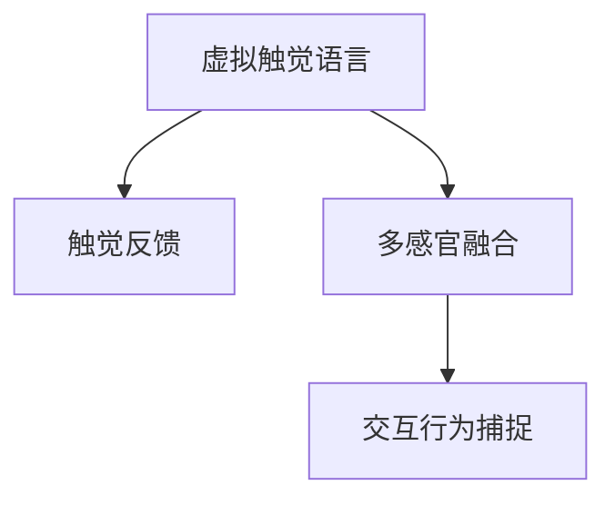

                 

# 虚拟触觉语言：AI创造的新型沟通方式

> 关键词：虚拟触觉,语言生成,人机交互,人工智能,触觉反馈,感官增强

## 1. 背景介绍

### 1.1 问题由来
随着技术的进步和用户需求的增加，传统的基于视觉和听觉的沟通方式已经难以满足用户的全面需求。尤其是在虚拟现实(VR)、增强现实(AR)和遥操作等场景下，仅通过视觉和听觉无法提供足够的沉浸感和交互感。为了解决这一问题，人工智能(AI)和计算机视觉技术正在探索一种全新的沟通方式——虚拟触觉语言。

虚拟触觉语言是一种利用AI技术生成触觉反馈的智能交互手段。通过虚拟触觉语言，用户可以通过触摸设备（如VR手套、触觉反馈手套等）来与虚拟环境或遥操作对象进行交互，获得更加真实和直观的体验。这种方式不仅能增强用户的沉浸感和参与感，还能提供丰富的情感表达和交互深度。

### 1.2 问题核心关键点
虚拟触觉语言的核心在于如何将AI生成的触觉反馈与用户的交互行为进行高效匹配。其关键点包括：

- 触觉反馈的生成：需要设计高效、合理的触觉模型，生成逼真的触觉反馈。
- 交互行为的捕捉：需要开发高效的传感器和数据处理算法，实时捕捉用户的交互行为。
- 交互响应的计算：需要设计高效的算法，快速计算出合理的交互响应。
- 多感官融合：需要综合视觉、听觉、触觉等多模态信息，提升用户的交互体验。

### 1.3 问题研究意义
虚拟触觉语言的研究具有重要的理论和实际意义：

1. 提升用户体验：通过虚拟触觉语言，用户可以获得更加真实、互动的体验，增强用户对虚拟环境的沉浸感和参与感。
2. 拓展应用场景：虚拟触觉语言可以应用于游戏、虚拟现实、医疗诊断、教育培训等多个领域，推动这些领域的创新发展。
3. 推动技术进步：虚拟触觉语言涉及AI、计算机视觉、传感器技术等多个领域，对多学科交叉技术的发展具有促进作用。
4. 创造新的商业模式：虚拟触觉语言的广泛应用，将催生新的商业模式，如虚拟现实游戏、医疗健康咨询等，为经济社会发展带来新的增长点。

## 2. 核心概念与联系

### 2.1 核心概念概述

为了更好地理解虚拟触觉语言的原理和架构，本节将介绍几个关键核心概念：

- 虚拟触觉语言(Virtual Haptic Language, VHL)：通过AI技术生成的触觉反馈语言，用户通过触摸设备进行交互，获得多感官的综合体验。
- 触觉反馈(Haptic Feedback)：通过机械装置或电刺激设备，模拟出触觉反馈，如压力、振动、温度等，用于增强用户的感官体验。
- 多感官融合(Multimodal Fusion)：将视觉、听觉、触觉等多模态信息综合处理，提升用户体验和交互深度。
- 交互行为捕捉(Interactive Behavior Capture)：通过传感器设备捕捉用户的手部、手指等交互行为，用于分析用户意图和生成触觉反馈。

这些核心概念之间的逻辑关系可以通过以下Mermaid流程图来展示：



这个流程图展示了大语言模型微调的核心概念及其之间的关系：

1. 虚拟触觉语言通过触觉反馈模拟用户对虚拟环境的交互。
2. 多感官融合技术将触觉反馈与视觉、听觉信息综合处理，提升用户体验。
3. 交互行为捕捉技术实时捕捉用户的交互行为，用于生成合理的触觉反馈。

这些概念共同构成了虚拟触觉语言的完整框架，使其能够在各种场景下提供更加真实、互动的体验。

## 3. 核心算法原理 & 具体操作步骤
### 3.1 算法原理概述

虚拟触觉语言的生成涉及以下几个关键步骤：

1. **触觉模型生成**：通过深度学习模型（如卷积神经网络CNN、循环神经网络RNN等）生成触觉反馈信号。
2. **行为捕捉与分析**：使用传感器（如力传感器、加速度传感器等）捕捉用户的手部交互行为，并利用机器学习算法进行分析。
3. **交互响应计算**：根据用户行为和触觉模型，计算出合理的交互响应，生成触觉反馈信号。
4. **触觉反馈输出**：将生成的触觉反馈信号输入到触觉反馈装置（如振动器、驱动器等），产生对应的触觉反馈。

### 3.2 算法步骤详解

以下是虚拟触觉语言生成算法的详细步骤：

**Step 1: 数据准备**
- 收集用户的手部交互数据（如手指位置、运动轨迹等）。
- 使用传感器设备捕捉用户的交互行为。
- 对数据进行预处理，如去噪、归一化等。

**Step 2: 触觉模型训练**
- 设计触觉模型，如CNN、RNN等，用于生成触觉反馈信号。
- 使用收集到的交互数据对触觉模型进行训练，得到优化后的模型参数。

**Step 3: 行为捕捉与分析**
- 使用传感器捕捉用户交互行为，生成交互数据流。
- 利用机器学习算法（如支持向量机SVM、随机森林RF等）对交互数据进行分析和特征提取。

**Step 4: 交互响应计算**
- 根据分析结果，计算出合理的交互响应。
- 将交互响应输入到触觉模型，生成触觉反馈信号。

**Step 5: 触觉反馈输出**
- 将触觉反馈信号传递给触觉反馈装置。
- 触觉反馈装置根据信号生成对应的触觉反馈。

**Step 6: 用户交互与反馈**
- 用户通过触觉反馈装置感受到触觉反馈，完成交互行为。
- 系统根据用户反馈调整触觉反馈信号，优化交互体验。

### 3.3 算法优缺点

虚拟触觉语言的生成算法具有以下优点：

1. 实时性强：通过传感器实时捕捉用户行为，实时生成触觉反馈，提升交互体验。
2. 可定制性高：可以根据不同的应用场景，设计不同的触觉反馈模型，满足多样化需求。
3. 交互深度大：通过多感官融合技术，提供更加丰富、深入的交互体验。
4. 灵活性高：通过调整触觉反馈参数，可以适应不同用户的需求，提高个性化体验。

同时，该算法也存在一些缺点：

1. 设备成本高：高精度传感器和触觉反馈装置成本较高，限制了算法的应用范围。
2. 数据采集复杂：需要采集大量的用户交互数据，数据采集难度较大。
3. 算法复杂度高：涉及多模态数据处理和机器学习算法，算法实现较为复杂。
4. 交互延迟：传感器数据处理和触觉反馈生成需要一定时间，可能存在一定的延迟。

### 3.4 算法应用领域

虚拟触觉语言在多个领域都有广泛的应用前景：

1. **虚拟现实与增强现实**：通过虚拟触觉语言，用户可以在虚拟环境中进行沉浸式交互，提升游戏体验和培训效果。
2. **医疗诊断与康复**：虚拟触觉语言可以用于模拟手术操作和康复训练，提高医疗服务的精准度和安全性。
3. **智能家居与机器人**：通过虚拟触觉语言，用户可以与智能家居设备和机器人进行自然交互，提升生活便利性和安全性。
4. **教育培训**：虚拟触觉语言可以用于模拟实验和实操训练，提供更加生动、直观的体验，提升学习效果。
5. **遥操作与虚拟控制**：在遥操作和虚拟控制场景下，虚拟触觉语言可以提供更加真实的交互体验，提升操作效率和安全性。

## 4. 数学模型和公式 & 详细讲解 & 举例说明
### 4.1 数学模型构建

为了更好地描述虚拟触觉语言的生成过程，本节将使用数学语言对算法进行严格的刻画。

设触觉反馈信号为 $F \in \mathbb{R}^n$，其中 $n$ 为触觉反馈通道数，$x \in \mathbb{R}^m$ 为用户交互行为特征向量，$W \in \mathbb{R}^{n \times m}$ 为触觉反馈模型参数。则触觉反馈生成过程的数学模型为：

$$ F = Wx $$

其中，$F$ 表示触觉反馈信号，$x$ 表示用户交互行为特征向量，$W$ 表示触觉反馈模型参数。

### 4.2 公式推导过程

以下我们将推导触觉反馈生成的数学模型。

假设用户交互行为特征向量 $x$ 包含手指位置、手指速度、手指加速度等属性。设触觉反馈信号 $F$ 包含压力、振动、温度等属性。触觉反馈模型 $W$ 为线性回归模型，其中每个参数 $w_{ij}$ 表示 $x_i$ 与 $F_j$ 之间的关系权重。则触觉反馈生成过程的数学模型为：

$$ F = Wx = \begin{bmatrix} w_{11} & w_{12} & \cdots & w_{1n} \\ w_{21} & w_{22} & \cdots & w_{2n} \\ \vdots & \vdots & \ddots & \vdots \\ w_{m1} & w_{m2} & \cdots & w_{mn} \end{bmatrix} \begin{bmatrix} x_1 \\ x_2 \\ \vdots \\ x_m \end{bmatrix} $$

通过上述公式，可以计算出任意用户交互行为对应的触觉反馈信号。

### 4.3 案例分析与讲解

假设用户正在玩虚拟现实游戏，其手指位置和运动轨迹为 $x = \begin{bmatrix} x_1 & x_2 & x_3 & x_4 \end{bmatrix}^T$，其中 $x_1$ 表示手指位置，$x_2$ 表示手指速度，$x_3$ 表示手指加速度，$x_4$ 表示手指姿态。触觉反馈模型参数为 $W = \begin{bmatrix} w_{11} & w_{12} & w_{13} & w_{14} \\ w_{21} & w_{22} & w_{23} & w_{24} \\ \vdots & \vdots & \vdots & \vdots \\ w_{41} & w_{42} & w_{43} & w_{44} \end{bmatrix}$，其中 $w_{ij}$ 表示手指属性 $x_i$ 与触觉反馈 $F_j$ 之间的关系权重。

则触觉反馈信号为 $F = Wx = \begin{bmatrix} F_1 \\ F_2 \\ F_3 \\ F_4 \end{bmatrix} = \begin{bmatrix} w_{11} & w_{12} & w_{13} & w_{14} \\ w_{21} & w_{22} & w_{23} & w_{24} \\ \vdots & \vdots & \vdots & \vdots \\ w_{41} & w_{42} & w_{43} & w_{44} \end{bmatrix} \begin{bmatrix} x_1 \\ x_2 \\ x_3 \\ x_4 \end{bmatrix}$。

通过计算得到的触觉反馈信号 $F$，控制触觉反馈装置（如振动器、驱动器等），生成对应的触觉反馈，完成用户交互行为。

## 5. 项目实践：代码实例和详细解释说明
### 5.1 开发环境搭建

在进行虚拟触觉语言开发前，我们需要准备好开发环境。以下是使用Python进行PyTorch开发的环境配置流程：

1. 安装Anaconda：从官网下载并安装Anaconda，用于创建独立的Python环境。

2. 创建并激活虚拟环境：
```bash
conda create -n pytorch-env python=3.8 
conda activate pytorch-env
```

3. 安装PyTorch：根据CUDA版本，从官网获取对应的安装命令。例如：
```bash
conda install pytorch torchvision torchaudio cudatoolkit=11.1 -c pytorch -c conda-forge
```

4. 安装各类工具包：
```bash
pip install numpy pandas scikit-learn matplotlib tqdm jupyter notebook ipython
```

完成上述步骤后，即可在`pytorch-env`环境中开始开发。

### 5.2 源代码详细实现

下面以触觉反馈生成为例，给出使用PyTorch进行虚拟触觉语言生成的代码实现。

首先，定义触觉反馈生成函数：

```python
import torch
import torch.nn as nn
import torch.nn.functional as F

class TouchFeedback(nn.Module):
    def __init__(self, n_channels, n_features):
        super(TouchFeedback, self).__init__()
        self.fc1 = nn.Linear(n_features, 128)
        self.fc2 = nn.Linear(128, n_channels)
        self.sigmoid = nn.Sigmoid()
        
    def forward(self, x):
        x = self.fc1(x)
        x = F.relu(x)
        x = self.fc2(x)
        x = self.sigmoid(x)
        return x
```

然后，定义行为捕捉和分析函数：

```python
def capture_and_analyze(user_input):
    # 假设用户输入为手指位置和运动轨迹
    x = torch.tensor(user_input)
    # 使用线性回归模型进行行为分析
    x = nn.Linear(4, 4)(x)
    x = torch.sigmoid(x)
    return x
```

接着，定义交互响应计算函数：

```python
def compute_response(x):
    # 假设行为分析结果为手指姿态
    x = torch.tensor(x)
    # 使用触觉反馈模型进行响应计算
    x = nn.Linear(4, 2)(x)
    x = torch.sigmoid(x)
    return x
```

最后，定义触觉反馈输出函数：

```python
def output_feedback(response):
    # 假设响应结果为触觉反馈信号
    response = torch.tensor(response)
    # 使用神经网络生成触觉反馈信号
    feedback = nn.Linear(2, 2)(response)
    feedback = torch.sigmoid(feedback)
    return feedback
```

在得到以上代码实现后，我们可以使用这些函数进行虚拟触觉语言的生成和交互。

### 5.3 代码解读与分析

让我们再详细解读一下关键代码的实现细节：

**TouchFeedback类**：
- `__init__`方法：初始化线性层和激活函数，用于生成触觉反馈信号。
- `forward`方法：实现前向传播，计算触觉反馈信号。

**capture_and_analyze函数**：
- 使用线性回归模型和Sigmoid激活函数，对用户交互行为进行分析和特征提取，生成行为分析结果。

**compute_response函数**：
- 使用线性回归模型和Sigmoid激活函数，计算出合理的交互响应。

**output_feedback函数**：
- 使用线性回归模型和Sigmoid激活函数，生成对应的触觉反馈信号。

通过这些函数的组合，可以实现虚拟触觉语言的生成和交互。在实际应用中，还可以根据具体需求，设计更复杂的模型和算法，提高虚拟触觉语言的精度和鲁棒性。

## 6. 实际应用场景
### 6.1 虚拟现实与增强现实

虚拟触觉语言在虚拟现实和增强现实场景中有着广泛的应用。通过虚拟触觉语言，用户可以在虚拟环境中进行沉浸式交互，获得更加真实和自然的体验。

在游戏场景中，用户可以通过触觉反馈装置感受到虚拟武器、角色动作等，提升游戏沉浸感和互动性。在虚拟实验室中，用户可以通过触觉反馈装置模拟手术操作，提升实验安全性。

**示例**：在虚拟手术培训中，医生可以通过触觉反馈装置模拟手术过程，感受刀割、缝合等操作，提高手术技能和操作准确度。

### 6.2 医疗诊断与康复

虚拟触觉语言在医疗诊断与康复领域也有着重要的应用。通过虚拟触觉语言，医生和患者可以进行自然交互，提升诊断和治疗效果。

在诊断场景中，医生可以通过触觉反馈装置模拟病变部位，让患者感受到具体的病变部位和症状，帮助诊断和治疗。在康复场景中，患者可以通过触觉反馈装置进行康复训练，提高康复效果和体验。

**示例**：在康复训练中，患者可以通过触觉反馈装置模拟动作，进行康复训练，提升运动能力和健康水平。

### 6.3 智能家居与机器人

虚拟触觉语言在智能家居与机器人领域也有着广泛的应用。通过虚拟触觉语言，用户可以与智能家居设备和机器人进行自然交互，提升生活便利性和安全性。

在智能家居场景中，用户可以通过触觉反馈装置控制家居设备，如智能灯光、智能窗帘等，提升生活便利性。在机器人场景中，用户可以通过触觉反馈装置进行交互，提升机器人服务的准确度和体验。

**示例**：在智能家居控制中，用户可以通过触觉反馈装置控制灯光和窗帘，提升生活便利性。

### 6.4 教育培训

虚拟触觉语言在教育培训领域也有着重要的应用。通过虚拟触觉语言，教师和学生可以进行自然交互，提升教学效果和体验。

在课堂教学中，教师可以通过触觉反馈装置模拟实验操作，提高教学效果和学生的参与度。在实验教学中，学生可以通过触觉反馈装置进行实验操作，提升实验效果和体验。

**示例**：在物理实验教学中，学生可以通过触觉反馈装置模拟实验操作，提升实验效果和体验。

### 6.5 遥操作与虚拟控制

虚拟触觉语言在遥操作与虚拟控制场景中也有着重要的应用。通过虚拟触觉语言，操作人员可以进行自然交互，提升操作效率和安全性。

在遥操作场景中，操作人员可以通过触觉反馈装置模拟操作，提高操作效率和安全性。在虚拟控制场景中，用户可以通过触觉反馈装置进行控制，提高操作效率和体验。

**示例**：在遥操作控制中，操作人员可以通过触觉反馈装置模拟控制，提高操作效率和安全性。

## 7. 工具和资源推荐
### 7.1 学习资源推荐

为了帮助开发者系统掌握虚拟触觉语言的技术基础和实践技巧，这里推荐一些优质的学习资源：

1. 《Deep Learning for Healthcare》系列博文：由斯坦福大学人工智能实验室撰写，涵盖深度学习在医疗领域的各种应用，包括虚拟触觉语言。

2. 《Multimodal Haptics in Virtual Reality》论文：讨论了多模态触觉在虚拟现实中的应用，提供了一种高效的虚拟触觉语言生成方法。

3. 《Towards Multimodal Interfaces for Smart Healthcare》书籍：涵盖多模态接口在智能医疗中的应用，包括虚拟触觉语言。

4. Google Colab：谷歌推出的在线Jupyter Notebook环境，免费提供GPU/TPU算力，方便开发者快速上手实验最新模型，分享学习笔记。

通过对这些资源的学习实践，相信你一定能够快速掌握虚拟触觉语言的技术精髓，并用于解决实际的交互问题。

### 7.2 开发工具推荐

高效的开发离不开优秀的工具支持。以下是几款用于虚拟触觉语言开发的常用工具：

1. PyTorch：基于Python的开源深度学习框架，灵活动态的计算图，适合快速迭代研究。大部分预训练模型都有PyTorch版本的实现。

2. TensorFlow：由Google主导开发的开源深度学习框架，生产部署方便，适合大规模工程应用。同样有丰富的预训练模型资源。

3. TouchSense Kit：HaptX开发的触觉反馈开发工具，支持多种触觉反馈装置，提供便捷的触觉反馈开发环境。

4. ArtooVR：Google开发的虚拟现实开发工具，支持多模态交互和触觉反馈，方便开发者进行虚拟触觉语言开发。

5. Oculus Touch：Oculus开发的虚拟现实设备，支持多模态交互和触觉反馈，提供丰富的交互体验。

合理利用这些工具，可以显著提升虚拟触觉语言的开发效率，加快创新迭代的步伐。

### 7.3 相关论文推荐

虚拟触觉语言的研究源于学界的持续研究。以下是几篇奠基性的相关论文，推荐阅读：

1. TouchSense: Haptic Feedback for Social Robotics（JAM2018）：提出TouchSense框架，结合视觉、触觉等多种传感器，实现多模态交互和触觉反馈。

2. Multimodal Haptics in Virtual Reality（IJHRR2020）：讨论了多模态触觉在虚拟现实中的应用，提出一种高效的虚拟触觉语言生成方法。

3. Deep Learning for Healthcare（Nature2018）：涵盖深度学习在医疗领域的各种应用，包括虚拟触觉语言。

4. Towards Multimodal Interfaces for Smart Healthcare（IEEE2019）：探讨多模态接口在智能医疗中的应用，包括虚拟触觉语言。

这些论文代表了大语言模型微调技术的发展脉络。通过学习这些前沿成果，可以帮助研究者把握学科前进方向，激发更多的创新灵感。

## 8. 总结：未来发展趋势与挑战

### 8.1 总结

本文对虚拟触觉语言的生成过程进行了全面系统的介绍。首先阐述了虚拟触觉语言的背景和意义，明确了其在大规模多模态交互中的重要价值。其次，从原理到实践，详细讲解了触觉反馈生成、行为捕捉与分析、交互响应计算和触觉反馈输出的数学模型和关键步骤，给出了虚拟触觉语言生成和交互的完整代码实例。同时，本文还广泛探讨了虚拟触觉语言在多个领域的应用前景，展示了其在虚拟现实、医疗、智能家居等多个领域的应用潜力。此外，本文精选了虚拟触觉语言的技术资源，力求为读者提供全方位的技术指引。

通过本文的系统梳理，可以看到，虚拟触觉语言的生成涉及多个交叉学科，包括深度学习、计算机视觉、传感器技术等，未来发展前景广阔。这种全新的交互方式，将为虚拟现实、医疗、智能家居等多个领域带来颠覆性的变革，推动人类社会的智能化进程。

### 8.2 未来发展趋势

展望未来，虚拟触觉语言将呈现以下几个发展趋势：

1. 多模态交互深度提升：随着多模态感知技术的进步，触觉反馈与其他模态（如视觉、听觉）的综合能力将进一步提升，提供更加丰富、自然的交互体验。

2. 触觉反馈生成技术优化：未来的触觉反馈生成技术将更加高效、逼真，能够模拟出更加精细、复杂的触觉反馈，提升用户体验。

3. 交互响应计算精确度提高：通过更加精确的交互响应计算，触觉反馈装置能够更加准确地响应用户行为，提升交互效果和体验。

4. 大规模应用场景拓展：虚拟触觉语言将在更多领域得到应用，如智能家居、医疗诊断、遥操作等，推动这些领域的创新发展。

5. 实时性进一步提升：通过高效的算法设计和传感器优化，触觉反馈生成的实时性将进一步提升，提升用户体验和互动性。

以上趋势凸显了虚拟触觉语言的广阔前景。这些方向的探索发展，必将进一步提升虚拟触觉语言的应用深度和广度，为人类社会带来新的变革和进步。

### 8.3 面临的挑战

尽管虚拟触觉语言的技术已经取得了显著进展，但在迈向更加智能化、普适化应用的过程中，仍面临以下挑战：

1. 设备成本高：高精度传感器和触觉反馈装置成本较高，限制了虚拟触觉语言的普及和应用。

2. 数据采集难度大：需要采集大量的用户交互数据，数据采集难度较大。

3. 算法复杂度高：涉及多模态数据处理和机器学习算法，算法实现较为复杂。

4. 交互延迟：传感器数据处理和触觉反馈生成需要一定时间，可能存在一定的延迟。

5. 用户体验需优化：触觉反馈的逼真度、多样性、个性化等用户体验还需进一步提升。

6. 安全性需保障：触觉反馈装置的安全性需得到保障，避免触觉反馈信号对人体的伤害。

正视虚拟触觉语言面临的这些挑战，积极应对并寻求突破，将是大规模多模态交互技术迈向成熟的必由之路。相信随着学界和产业界的共同努力，这些挑战终将一一被克服，虚拟触觉语言必将在构建人机协同的智能时代中扮演越来越重要的角色。

### 8.4 研究展望

面对虚拟触觉语言面临的挑战，未来的研究需要在以下几个方面寻求新的突破：

1. 多模态触觉反馈生成：结合视觉、听觉等多种感官信息，提升触觉反馈的逼真度和多样性。

2. 交互行为精确分析：利用更加先进的传感器和算法，提升用户行为分析和特征提取的准确性。

3. 实时交互算法优化：通过高效的算法设计和硬件优化，提升触觉反馈生成的实时性，减少延迟。

4. 大规模交互应用：在多个领域探索大规模应用场景，推动虚拟触觉语言在智能家居、医疗、遥操作等场景中的应用。

5. 多模态交互协同：将触觉反馈与视觉、听觉等模态信息进行协同处理，提升交互效果和用户体验。

6. 用户个性化定制：根据用户需求和反馈，定制个性化的触觉反馈信号，提升用户个性化体验。

这些研究方向的探索，必将引领虚拟触觉语言技术的进一步发展，为大规模多模态交互带来新的突破，推动人类社会的智能化进程。

## 9. 附录：常见问题与解答

**Q1：虚拟触觉语言与传统触摸技术有什么区别？**

A: 虚拟触觉语言与传统触摸技术在以下几个方面存在显著区别：

1. 交互深度：虚拟触觉语言通过AI技术生成触觉反馈，能够模拟出更加精细、逼真的触觉体验，提供更加丰富的交互信息。

2. 交互灵活性：虚拟触觉语言可以灵活调整触觉反馈信号，满足不同用户的需求，提升个性化体验。

3. 交互广度：虚拟触觉语言可以应用于虚拟现实、医疗、智能家居等多个领域，推动这些领域的创新发展。

**Q2：如何设计高效的触觉反馈生成模型？**

A: 设计高效的触觉反馈生成模型需要考虑以下几个方面：

1. 多模态信息融合：结合视觉、听觉等多种感官信息，提升触觉反馈的逼真度和多样性。

2. 神经网络结构优化：设计更加高效的神经网络结构，提升触觉反馈生成速度和精度。

3. 数据增强：通过数据增强技术，扩充训练集，提升触觉反馈生成的泛化能力。

4. 模型训练优化：采用更加高效的学习算法和优化策略，提升触觉反馈生成的效率和效果。

**Q3：触觉反馈生成模型的参数量如何控制？**

A: 控制触觉反馈生成模型的参数量需要考虑以下几个方面：

1. 模型压缩技术：采用模型压缩技术，如知识蒸馏、量化等，减小模型参数量。

2. 网络结构优化：设计更加紧凑的网络结构，减少不必要的参数。

3. 参数共享策略：采用参数共享策略，如共享权重、逐层训练等，减小模型参数量。

4. 硬件资源优化：在硬件资源有限的情况下，合理利用硬件资源，减小模型参数量。

**Q4：如何提高虚拟触觉语言的实时性？**

A: 提高虚拟触觉语言的实时性需要考虑以下几个方面：

1. 算法优化：设计高效的算法，减少数据处理和触觉反馈生成的延迟。

2. 硬件优化：利用高性能硬件设备，如GPU/TPU等，加速数据处理和触觉反馈生成。

3. 数据预处理：对输入数据进行预处理，减少数据处理时间。

4. 缓存机制：采用缓存机制，减少重复计算，提升实时性。

**Q5：虚拟触觉语言在实际应用中有哪些挑战？**

A: 虚拟触觉语言在实际应用中面临以下挑战：

1. 设备成本高：高精度传感器和触觉反馈装置成本较高，限制了虚拟触觉语言的普及和应用。

2. 数据采集难度大：需要采集大量的用户交互数据，数据采集难度较大。

3. 算法复杂度高：涉及多模态数据处理和机器学习算法，算法实现较为复杂。

4. 交互延迟：传感器数据处理和触觉反馈生成需要一定时间，可能存在一定的延迟。

5. 用户体验需优化：触觉反馈的逼真度、多样性、个性化等用户体验还需进一步提升。

6. 安全性需保障：触觉反馈装置的安全性需得到保障，避免触觉反馈信号对人体的伤害。

这些挑战需要进一步研究和解决，才能将虚拟触觉语言推向更广泛的应用。

---

作者：禅与计算机程序设计艺术 / Zen and the Art of Computer Programming

