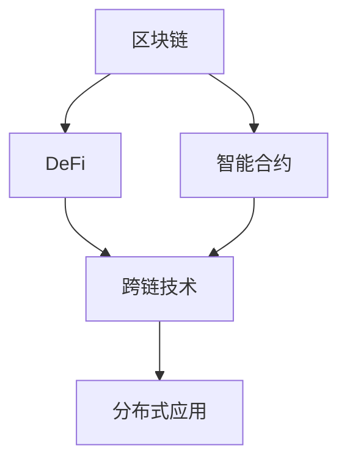

                 

# 虚拟货币与全球脑：去中心化金融的未来

> 关键词：虚拟货币,区块链,去中心化金融,智能合约,分布式账本,跨链技术,DeFi

## 1. 背景介绍

### 1.1 问题由来
随着互联网技术的飞速发展，虚拟货币作为新一代数字资产形式，逐渐受到全球关注。比特币、以太坊等虚拟货币的出现，开启了数字经济的新时代。虚拟货币不仅具备支付和价值存储功能，更通过智能合约和分布式账本技术，推动了去中心化金融(DeFi)的兴起。

DeFi指的是建立在区块链和智能合约基础上的金融系统，其目标是替代或补充传统的金融体系。DeFi系统可以提供借贷、交易、保险、资产管理等多样化的金融服务，为传统金融行业注入新的活力。

然而，DeFi系统也面临诸多挑战，如链间互通性不足、智能合约安全漏洞、性能瓶颈等。如何在保障系统安全和稳定性的前提下，进一步提升DeFi系统的效率和可扩展性，成为当前研究的重点。

## 2. 核心概念与联系

### 2.1 核心概念概述

为更好地理解DeFi技术及其应用，本节将介绍几个核心概念及其相互关系：

- 区块链(Blockchain)：基于分布式账本技术，通过节点共识机制，实现数据的分布式存储和验证。区块链具有去中心化、不可篡改、透明等特点，是DeFi系统的重要底层技术。

- 智能合约(Smart Contract)：基于区块链的去中心化合约，通过自动执行规则，实现金融操作的自动化和智能化。智能合约可以自动触发、验证、执行金融交易，保障金融过程的公平性和透明性。

- 去中心化金融(DeFi)：建立在区块链和智能合约基础上的金融系统，旨在提供传统金融体系中存在的功能，如借贷、交易、保险等，同时避免中心化金融机构的干预和监管。

- 跨链技术(Cross-Chain)：通过构建链间互通的桥梁，实现不同区块链之间的数据和资产互操作，解决DeFi系统的链间互通性不足问题。

- 分布式应用(DApp)：基于区块链的分布式应用，通过智能合约和去中心化存储，实现应用功能的分布式部署和运行。

这些核心概念之间的逻辑关系可以通过以下Mermaid流程图来展示：



这个流程图展示了DeFi技术各组件之间的相互关系：

1. 区块链为DeFi系统提供了去中心化存储和验证机制。
2. 智能合约基于区块链构建，用于实现金融操作自动化。
3. DeFi系统整合了区块链和智能合约，提供多样化的金融服务。
4. 跨链技术实现不同区块链之间的互操作，解决链间互通性问题。
5. 分布式应用进一步扩展DeFi系统的功能，构建完整的金融生态。

## 3. 核心算法原理 & 具体操作步骤
### 3.1 算法原理概述

DeFi系统的核心算法原理基于区块链和智能合约技术。其基本流程如下：

1. 参与者将资金存入智能合约，定义相应的金融操作规则。
2. 智能合约根据规则自动执行金融操作，如借贷、交易、保险等。
3. 所有操作记录在区块链上，实现分布式存储和验证。
4. 跨链技术实现不同区块链之间的互操作，增加DeFi系统的功能。

这一流程利用区块链的不可篡改性和智能合约的自动化特性，确保了DeFi系统的公平性和透明性，同时避免了中心化金融机构的干预和风险。

### 3.2 算法步骤详解

以下详细讲解DeFi系统的关键算法步骤：

**Step 1: 设计智能合约**
- 定义智能合约的参数和操作规则，如借贷利率、还款期限、抵押资产等。
- 编写智能合约代码，确保逻辑严密，不易被攻击和篡改。

**Step 2: 部署智能合约**
- 在区块链上部署智能合约，并进行初始化操作，如设定初始资金、参数等。
- 通过地址调用智能合约，触发特定操作。

**Step 3: 执行金融操作**
- 参与者存入资金，智能合约自动记录余额和利率等信息。
- 借款人申请借款，智能合约自动审批、发放资金。
- 交易平台提供交易服务，智能合约自动执行买卖操作。
- 保险公司提供保险服务，智能合约自动理赔。

**Step 4: 跨链操作**
- 通过跨链技术，实现不同区块链之间的资金和数据互操作。
- 利用跨链桥接协议，实现链间资产的转移和互操作。

**Step 5: 系统监控和维护**
- 部署监控系统，实时监测智能合约的运行状态，确保其正常工作。
- 定期更新智能合约代码，修复安全漏洞，优化系统性能。

### 3.3 算法优缺点

DeFi系统的算法具有以下优点：
1. 去中心化：无需中心化机构干预，确保金融操作的透明性和公平性。
2. 自动化：智能合约自动执行规则，减少人为干预，提升效率。
3. 抗风险：区块链的不可篡改性，降低欺诈和操作风险。
4. 可扩展性：跨链技术实现链间互通，扩展金融服务范围。

同时，DeFi系统也存在一些缺点：
1. 技术门槛高：智能合约编写和部署需要较高技术水平，普通用户难以操作。
2. 系统安全性存疑：智能合约存在被攻击和篡改的风险，可能导致重大损失。
3. 法规风险：DeFi系统的法律和监管环境尚不成熟，存在法律风险。
4. 性能瓶颈：高并发操作可能导致系统性能瓶颈，影响用户体验。

尽管存在这些局限性，DeFi系统凭借其去中心化、自动化的特点，在金融创新和应用上展现了巨大潜力。

### 3.4 算法应用领域

DeFi技术已经广泛应用于多种金融服务场景，以下是几个典型应用领域：

- 借贷：DeFi系统提供无需抵押的贷款服务，通过智能合约自动审批和发放资金。
- 交易：DeFi系统提供去中心化交易平台，用户可进行资产买卖，交易透明、安全。
- 保险：DeFi系统提供基于区块链的保险服务，自动理赔，降低保险成本。
- 资产管理：DeFi系统提供去中心化资产管理服务，用户可自主管理资产，分散风险。
- 供应链金融：DeFi系统整合供应链上下游数据，提供自动化的金融操作，提升供应链效率。

除了上述领域，DeFi技术还拓展到游戏、博彩、社交等更多行业，为传统行业数字化转型提供了新的可能性。

## 4. 数学模型和公式 & 详细讲解 & 举例说明

### 4.1 数学模型构建

DeFi系统的核心算法基于区块链和智能合约技术，数学模型主要涉及交易计算和智能合约的逻辑判断。

假设智能合约用于管理资金借贷，其参数包括：
- 初始资金 $F$，初始余额 $B$，借贷利率 $r$，借贷期限 $T$。
- 借款人地址 $A$，贷款人地址 $L$，抵押资产 $V$。

在借贷过程中，智能合约记录的数学模型如下：

1. 初始化：智能合约部署后，自动记录初始资金 $F$ 和初始余额 $B$。

2. 借贷：借款人 $A$ 申请借款，智能合约自动审批、发放资金。

3. 还款：借款人按时还款，智能合约自动计算利息并扣除。

### 4.2 公式推导过程

**初始化阶段**：
$$
B_0 = F
$$

**借贷阶段**：
- 借款人 $A$ 申请借款 $E$，智能合约自动审批并发放资金：
$$
B_t = B_{t-1} - E
$$
- 借款人 $A$ 按时还款 $R$，智能合约自动扣除利息：
$$
B_{t+1} = B_t + (R-E\cdot r\cdot T)
$$

其中，$B_t$ 表示在 $t$ 时刻的余额，$R$ 表示还款金额，$r$ 表示借贷利率，$T$ 表示借贷期限。

### 4.3 案例分析与讲解

以智能合约管理借贷为例，分析其数学模型应用：

1. 智能合约初始化阶段，资金 $F$ 自动分配到初始余额 $B_0$。

2. 借款人 $A$ 申请借款 $E$，智能合约自动审批并发放资金，计算新余额 $B_1$。

3. 借款人 $A$ 按时还款 $R$，智能合约自动计算利息并扣除，计算新余额 $B_2$。

假设 $F=100$，$B_0=90$，$E=10$，$r=0.01$，$T=1$，则借贷过程的计算过程如下：

- 初始化：$B_0=90$
- 借款：$E=10$，$B_1=B_0-E=80$
- 还款：$R=20$，$B_2=B_1+(R-E\cdot r\cdot T)=84$

通过这个例子，可以看到智能合约通过简单的数学模型，自动执行了资金借贷过程，无需人工干预。

## 5. 项目实践：代码实例和详细解释说明
### 5.1 开发环境搭建

在进行DeFi系统开发前，我们需要准备好开发环境。以下是使用Python进行Solidity开发的环境配置流程：

1. 安装Node.js：从官网下载并安装Node.js，用于安装Solidity和Ganache。

2. 安装Solidity：使用npm安装Solidity编译器：
```bash
npm install -g solc
```

3. 安装Ganache：使用npm安装Ganache本地测试网络：
```bash
npm install -g ganache-cli
```

4. 安装Truffle：使用npm安装Truffle开发框架：
```bash
npm install -g truffle-hdfs
```

5. 安装Metamask：安装Metamask浏览器扩展，用于测试网络操作。

完成上述步骤后，即可在Ganache环境中开始DeFi系统开发。

### 5.2 源代码详细实现

这里我们以智能合约管理借贷为例，给出使用Solidity语言进行DeFi系统开发的代码实现。

首先，定义智能合约的参数和操作规则：

```solidity
pragma solidity ^0.8.0;

contract Lending {
    address public owner;
    uint256 public rate;
    uint256 public term;
    uint256 public totalSupply;
    uint256 public borrowed;
    
    mapping(address => uint256) balance;
    
    event Transfer(uint256 from, uint256 to, uint256 value);
    
    constructor() public {
        owner = msg.sender;
        rate = 0.01;  // 年利率为1%
        term = 1;     // 借贷期限为1个月
        totalSupply = 0;
        borrowed = 0;
        balance[msg.sender] = 100;  // 初始资金100
    }
    
    function borrow(uint256 amount) public {
        require(amount > 0);
        require(amount <= balance[msg.sender]);
        borrowed += amount;
        totalSupply += amount;
        balance[msg.sender] -= amount;
        emit Transfer(msg.sender, msg.sender, amount);
    }
    
    function repay(uint256 amount) public {
        require(amount > 0);
        require(amount <= borrowed);
        require(msg.sender == owner);
        borrowed -= amount;
        balance[msg.sender] += amount;
        emit Transfer(msg.sender, owner, amount);
    }
    
    function getBalance() public view returns (uint256) {
        return balance[msg.sender];
    }
    
    function getBorrowed() public view returns (uint256) {
        return borrowed;
    }
    
    function getTotalSupply() public view returns (uint256) {
        return totalSupply;
    }
    
    function getRate() public view returns (uint256) {
        return rate;
    }
    
    function getTerm() public view returns (uint256) {
        return term;
    }
}
```

然后，在Ganache环境中编译、部署智能合约，并进行测试：

```bash
solc --target ethvm Lending.sol -o .
truffle compile
truffle migrate
truffle run --network Ganache testBorrow.js
```

其中，testBorrow.js是测试脚本，代码实现如下：

```javascript
var Lending = artifacts.require("Lending");

module.exports = function(deployer) {
    deployer.then(function() {
        return Lending.deployed().then(function(instance) {
            var address = instance.address;
            var value = web3.toWei('100', 'ether');
            return instance.borrow('10', {from: web3.eth.accounts[0], value: web3.toWei('100', 'ether')});
        });
    });
};
```

最后，在Metamask浏览器中运行测试脚本，部署智能合约并进行借贷测试。

### 5.3 代码解读与分析

让我们再详细解读一下关键代码的实现细节：

**Lending智能合约**：
- 定义合约参数和变量，包括资金总额、借款总额、余额、利率、期限等。
- 定义事件，用于记录资金流动。
- 定义构造函数，初始化参数和余额。
- 定义借贷函数，验证借款金额，更新余额和借款总额。
- 定义还款函数，验证还款金额，更新余额和借款总额。
- 定义查询函数，获取余额、借款总额、资金总额、利率、期限等。

**testBorrow.js测试脚本**：
- 定义合约地址和初始资金。
- 调用合约的借贷函数，测试借贷过程。
- 使用Truffle框架的test函数，实现自动测试。

通过这个例子，可以看到使用Solidity语言进行DeFi系统开发的简单过程。开发者可以根据实际需求，进一步扩展和优化智能合约代码。

## 6. 实际应用场景
### 6.1 智能合约管理借贷

DeFi系统的借贷功能已经广泛应用于金融领域，为用户提供了更加便捷的借贷服务。与传统金融体系相比，DeFi借贷系统具有以下优点：

- 无抵押借贷：DeFi系统可以通过智能合约自动审批无抵押贷款，降低借贷门槛。
- 高灵活性：用户可根据自身需求调整借贷金额、利率、期限等参数，灵活操作。
- 透明度：借贷过程公开透明，所有操作记录在区块链上，可追溯查询。

在实际应用中，用户可以通过智能合约进行自动借贷，无需借助中心化金融机构的审批。例如，用户可以使用Ethereum上的Lending智能合约进行无抵押贷款，流程如下：

1. 用户向智能合约存入初始资金。
2. 用户通过调用智能合约的borrow函数申请贷款。
3. 智能合约自动审批借款，并发放资金。
4. 用户按时还款，智能合约自动计算利息并扣除。

这种自动化的借贷方式，大大降低了借贷成本，提高了资金利用效率。

### 6.2 去中心化交易平台

DeFi系统的交易功能通过智能合约实现，提供去中心化交易平台，用户可自由买卖资产，无需中心化交易机构的介入。例如，Ethereum上的Uniswap是一个典型的去中心化交易平台，其核心算法基于AMM(自动做市商)机制。

Uniswap的AMM算法基于池子(pools)的概念，通过算法维护池子内的资产比例，实现自动交易。用户可以任意添加或撤出资产，无需与中心化交易机构进行对接。

具体而言，Uniswap的AMM算法如下：

1. 用户添加或撤出资产到池子中。
2. 池子自动调整资产比例，确保价格稳定。
3. 用户通过调用智能合约的add或remove函数，进行资产交换。
4. 智能合约自动计算交换比例，执行交易。

这种去中心化交易方式，减少了中间环节，降低了交易成本，提高了交易效率。

### 6.3 跨链桥接

DeFi系统面临的一个重要问题是链间互通性不足，不同区块链之间的资产和数据无法自由流动。通过跨链桥接技术，可以实现不同区块链之间的互操作，解决这一问题。

例如，Polkadot网络中的Bridge协议，可以实现以太坊和其他区块链之间的资产互操作。其核心算法如下：

1. 用户通过智能合约在以太坊上创建跨链桥接资产。
2. 智能合约将资产信息存储到Polkadot网络上。
3. 用户在Polkadot网络上进行资产交易。
4. 智能合约将交易信息同步到以太坊上，完成资产互操作。

这种跨链桥接技术，不仅提高了DeFi系统的可扩展性，还扩大了其应用范围。

### 6.4 未来应用展望

随着DeFi技术的发展，其应用场景将不断扩展，涵盖更多行业。未来，DeFi技术将在以下领域得到广泛应用：

- 供应链金融：DeFi系统整合供应链上下游数据，提供自动化的金融操作，提升供应链效率。
- 农业金融：DeFi系统提供农业保险、农产品期货等金融服务，支持农业经济发展。
- 数字艺术：DeFi系统提供数字艺术品交易、版权保护等金融服务，推动数字文化产业发展。
- 环保金融：DeFi系统提供环境项目融资、绿色保险等金融服务，促进环境保护。

除了这些领域，DeFi技术还将拓展到更多新兴行业，为各行各业带来数字化变革。

## 7. 工具和资源推荐
### 7.1 学习资源推荐

为了帮助开发者系统掌握DeFi技术及其应用，这里推荐一些优质的学习资源：

1. 《区块链开发实战》系列博文：由区块链技术专家撰写，系统介绍了区块链开发的基础知识和技术细节，涵盖智能合约、跨链技术等关键内容。

2. CS5455《智能合约基础与实践》课程：斯坦福大学开设的区块链和智能合约课程，详细讲解智能合约的原理和应用，提供了丰富的实验项目。

3. 《智能合约编程指南》书籍：由智能合约技术专家编写，全面介绍了智能合约的编程语言、开发工具和最佳实践，适合开发者快速入门。

4. Ethereum官方文档：以太坊官网提供的详细开发文档，涵盖了智能合约开发、测试、部署等全流程内容，是DeFi开发的重要参考。

5. ConsenSys DeFi学院：全球知名的DeFi教育和培训机构，提供丰富的课程和资源，帮助开发者掌握DeFi技术的最新动态。

通过对这些资源的学习实践，相信你一定能够快速掌握DeFi技术的精髓，并用于解决实际的金融问题。

### 7.2 开发工具推荐

高效的开发离不开优秀的工具支持。以下是几款用于DeFi系统开发的常用工具：

1. Solidity IDE：如Remix、Truffle，提供智能合约编写、测试、调试等一站式开发环境。

2. Ganache：以太坊官方提供的本地测试网络，用于测试智能合约的功能和性能。

3. MetaMask：浏览器扩展，用于管理以太坊钱包和进行交易操作，方便开发者测试DeFi系统。

4. OpenZeppelin：智能合约安全库，提供大量的安全组件和最佳实践，提高智能合约的安全性。

5. Etherscan：以太坊浏览器，用于查询智能合约信息、交易记录等，方便开发者和用户审计智能合约。

合理利用这些工具，可以显著提升DeFi系统的开发效率，加快创新迭代的步伐。

### 7.3 相关论文推荐

DeFi技术的发展离不开学界的持续研究。以下是几篇奠基性的相关论文，推荐阅读：

1. "Blockchain-based Financial Systems: The Future of Finance?"（区块链金融系统：金融的未来？）：提出区块链和智能合约可以提供更加公平、透明、自动化的金融服务。

2. "Ethereum and the Smart Contract Revolution"（以太坊与智能合约革命）：以太坊白皮书，详细介绍了以太坊和智能合约的技术实现，奠定了DeFi技术的基础。

3. "Decentralized Finance (DeFi) Review"（去中心化金融回顾）：ConsenSys发布的DeFi白皮书，全面梳理了DeFi技术的发展历程和应用场景。

4. "Blockchain and Decentralized Financial Systems"（区块链与去中心化金融系统）：研究区块链与DeFi系统的交互机制和应用前景。

5. "Towards a Blockchain-Enabled Supply Chain Finance Model"（区块链驱动的供应链金融模型）：探讨区块链技术在供应链金融中的应用。

这些论文代表了大规模金融系统的核心思想和技术细节，通过学习这些前沿成果，可以帮助研究者把握学科前进方向，激发更多的创新灵感。

## 8. 总结：未来发展趋势与挑战

### 8.1 总结

本文对基于区块链和智能合约的DeFi技术进行了全面系统的介绍。首先阐述了DeFi技术的研究背景和意义，明确了DeFi在金融创新和应用中的独特价值。其次，从原理到实践，详细讲解了DeFi系统的核心算法步骤，给出了智能合约的代码实现和测试过程。同时，本文还广泛探讨了DeFi系统在多个行业领域的应用前景，展示了DeFi技术的巨大潜力。此外，本文精选了DeFi技术的各类学习资源，力求为开发者提供全方位的技术指引。

通过本文的系统梳理，可以看到，DeFi技术凭借其去中心化、自动化的特点，正在成为金融创新和应用的重要范式，极大地提升了金融系统的效率和可扩展性。DeFi系统的出现，为传统金融行业带来了新的变革力量，推动了金融服务的数字化进程。未来，伴随区块链技术的持续演进，DeFi系统将在更多领域得到广泛应用，为金融创新和产业发展注入新的动力。

### 8.2 未来发展趋势

展望未来，DeFi技术将呈现以下几个发展趋势：

1. 跨链技术日趋成熟。跨链桥接技术将实现不同区块链之间的无缝互操作，打破链间壁垒，实现全球化的金融市场。

2. 智能合约不断优化。智能合约的安全性和鲁棒性将不断提升，降低攻击和漏洞的风险，保障系统稳定运行。

3. 用户界面改进。DeFi系统的用户界面将更加友好，易于操作，吸引更多普通用户参与。

4. 金融产品多样化。DeFi系统将推出更多多样化的金融产品，如衍生品、杠杆交易等，满足用户多样化的金融需求。

5. 合规性提升。DeFi系统的合规性将不断完善，增强对金融监管的支持，提升系统的合法性和可信任度。

以上趋势凸显了DeFi技术的广阔前景。这些方向的探索发展，必将进一步提升DeFi系统的性能和可扩展性，为金融行业带来更加全面、高效的金融服务。

### 8.3 面临的挑战

尽管DeFi技术已经取得了显著进展，但在迈向更加智能化、普适化应用的过程中，它仍面临诸多挑战：

1. 系统安全性存疑。智能合约存在被攻击和篡改的风险，可能导致重大损失。DeFi系统的安全性和鲁棒性需进一步加强。

2. 法规风险。DeFi系统的法律和监管环境尚不成熟，存在法律风险。需要更多法律法规支持，保障系统的合法性。

3. 用户体验不足。DeFi系统的用户界面和操作复杂度较高，普通用户难以操作，影响系统普及率。

4. 性能瓶颈。高并发操作可能导致系统性能瓶颈，影响用户体验。

5. 市场波动。区块链市场的波动性较大，DeFi系统需设计合理的风险控制机制，降低系统风险。

尽管存在这些挑战，但DeFi技术凭借其去中心化、自动化的特点，在金融创新和应用上展现了巨大潜力。通过不断优化和完善，DeFi系统将在未来得到更广泛的应用，推动金融服务的数字化进程。

### 8.4 未来突破

面对DeFi技术所面临的种种挑战，未来的研究需要在以下几个方面寻求新的突破：

1. 探索无监督和半监督微调方法。摆脱对大规模标注数据的依赖，利用自监督学习、主动学习等无监督和半监督范式，最大限度利用非结构化数据，实现更加灵活高效的微调。

2. 研究参数高效和计算高效的微调范式。开发更加参数高效的微调方法，在固定大部分预训练参数的同时，只更新极少量的任务相关参数。同时优化微调模型的计算图，减少前向传播和反向传播的资源消耗，实现更加轻量级、实时性的部署。

3. 融合因果和对比学习范式。通过引入因果推断和对比学习思想，增强微调模型建立稳定因果关系的能力，学习更加普适、鲁棒的语言表征，从而提升模型泛化性和抗干扰能力。

4. 引入更多先验知识。将符号化的先验知识，如知识图谱、逻辑规则等，与神经网络模型进行巧妙融合，引导微调过程学习更准确、合理的语言模型。同时加强不同模态数据的整合，实现视觉、语音等多模态信息与文本信息的协同建模。

5. 结合因果分析和博弈论工具。将因果分析方法引入微调模型，识别出模型决策的关键特征，增强输出解释的因果性和逻辑性。借助博弈论工具刻画人机交互过程，主动探索并规避模型的脆弱点，提高系统稳定性。

6. 纳入伦理道德约束。在模型训练目标中引入伦理导向的评估指标，过滤和惩罚有偏见、有害的输出倾向。同时加强人工干预和审核，建立模型行为的监管机制，确保输出符合人类价值观和伦理道德。

这些研究方向的探索，必将引领DeFi技术迈向更高的台阶，为构建安全、可靠、可解释、可控的智能系统铺平道路。面向未来，DeFi技术还需要与其他人工智能技术进行更深入的融合，如知识表示、因果推理、强化学习等，多路径协同发力，共同推动金融系统的进步。只有勇于创新、敢于突破，才能不断拓展区块链系统的边界，让智能技术更好地造福人类社会。

## 9. 附录：常见问题与解答

**Q1：DeFi系统是否面临与传统金融系统相同的风险？**

A: 尽管DeFi系统具有去中心化和自动化的优势，但其面临的风险与传统金融系统相似，如市场风险、信用风险、流动性风险等。同时，DeFi系统还存在智能合约漏洞、系统攻击等新风险，需进一步加强风险控制。

**Q2：智能合约的安全性如何保障？**

A: 智能合约的安全性主要通过以下几个方面保障：
1. 代码审查：智能合约在部署前需进行代码审查，确保逻辑严密、不易被攻击。
2. 合约验证：利用形式化验证工具，对智能合约进行数学证明，确保其正确性。
3. 审计工具：使用第三方审计工具，如OpenZeppelin，检测智能合约的安全漏洞。
4. 多重签名：增加多层次的签名机制，提高系统的安全性和鲁棒性。

**Q3：DeFi系统的扩展性如何提升？**

A: 提升DeFi系统的扩展性需从以下几个方面入手：
1. 优化算法：改进跨链桥接算法，实现更高吞吐量的数据互操作。
2. 增加节点：提高DeFi网络中的节点数量，分散系统负载，提升处理能力。
3. 分片技术：采用分片技术，将网络分为多个子网络，并行处理交易请求，提升系统吞吐量。

**Q4：DeFi系统如何应对市场波动？**

A: DeFi系统通过设计合理的风险控制机制应对市场波动，如：
1. 动态调整利率：根据市场情况动态调整借贷利率，控制资金风险。
2. 设置止损位：设定止损位，在市场波动较大时自动清算或追加保证金。
3. 保险机制：引入保险机制，为系统提供风险保障。

**Q5：DeFi系统如何优化用户体验？**

A: 优化用户体验需从以下几个方面入手：
1. 简化界面：提高智能合约的用户界面友好性，降低用户操作复杂度。
2. 降低门槛：简化用户的操作流程，降低参与门槛，吸引更多用户。
3. 多语言支持：增加多语言支持，方便不同地区用户使用DeFi系统。

通过这些措施，可以提升DeFi系统的易用性和普及率，吸引更多用户参与，实现系统的可持续发展。

---

作者：禅与计算机程序设计艺术 / Zen and the Art of Computer Programming

