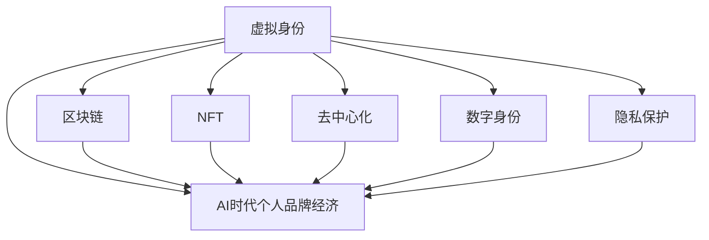

                 

# 虚拟身份市场动态：AI时代的个人品牌经济

> 关键词：虚拟身份, AI时代, 个人品牌经济, 区块链, NFT, 去中心化, 数字身份, 隐私保护

## 1. 背景介绍

### 1.1 问题由来
随着数字技术的发展，个人在虚拟世界中的存在形式发生了根本性的变化。从最初的简单电子邮箱、博客，到现在的虚拟现实(VR)、增强现实(AR)，再到最前沿的元宇宙(MetaVERSE)，虚拟身份正在成为连接数字世界的桥梁。尤其在当前AI时代，虚拟身份的构建、管理和应用，已经超越了传统互联网应用的范畴，进入了一个新的高度——个人品牌经济。

### 1.2 问题核心关键点
虚拟身份市场的崛起，为个人品牌经济提供了全新的平台。个人可以在虚拟世界中建立和管理自己的数字身份，通过人工智能(AI)技术进行深度个性化的设计，从而在社交、游戏、商业等多个领域实现自我价值。这一现象，不仅改变了人们的生活方式，也催生了新的经济模式。

### 1.3 问题研究意义
研究虚拟身份市场的动态，对于理解AI时代的个人品牌经济具有重要意义：

1. **生活方式变革**：虚拟身份为个人提供了一个全新的社交和表达空间，使得人们可以在虚拟世界中进行多样化的角色扮演和自我展示，增强了社交互动的深度和广度。
2. **经济机会创造**：虚拟身份市场带来了诸多经济机会，如虚拟资产交易、数字内容创作、虚拟商业活动等，为个体创业者提供了广阔的市场空间。
3. **技术推动作用**：AI技术在虚拟身份的构建和管理中扮演了重要角色，驱动了虚拟身份市场的发展和个性化需求的满足。
4. **社会文化影响**：虚拟身份的普及，促进了跨文化交流和社区建设，有助于形成新的文化现象和价值观。
5. **法律和伦理挑战**：虚拟身份的广泛应用，也引发了隐私保护、知识产权保护、虚拟犯罪等多方面的法律和伦理问题。

## 2. 核心概念与联系

### 2.1 核心概念概述

为更好地理解虚拟身份市场在AI时代的经济动态，本节将介绍几个密切相关的核心概念：

- **虚拟身份(Virtual Identity)**：指在数字世界中代表个人或组织的唯一标识，包括但不限于头像、名称、职业等。虚拟身份可以跨平台、跨媒介使用，是个人品牌在虚拟世界中的表现形式。
- **AI时代的个人品牌经济**：在AI技术的支持下，个人可以通过虚拟身份在虚拟世界中进行商业活动、内容创作、社交互动，构建个人品牌并实现经济价值。
- **区块链(Blockchain)**：一种去中心化的分布式账本技术，为虚拟身份的创建和管理提供了安全可靠的基础设施。
- **NFT(Non-Fungible Token)**：不可替代的数字资产，通常与特定的虚拟身份、艺术品、游戏道具等绑定，用于虚拟身份的认证和价值表示。
- **去中心化(Decentralization)**：去中心化技术确保了虚拟身份和相关数据的透明、安全、可追溯，增强了用户的信任感。
- **数字身份(Digital Identity)**：在虚拟世界中，个人可以借助AI技术对身份信息进行个性化定制和展示，实现身份的深度表达和多样化管理。
- **隐私保护(Privacy Protection)**：在虚拟身份市场，保护用户隐私是构建信任和促进市场健康发展的基础。

这些核心概念之间的逻辑关系可以通过以下Mermaid流程图来展示：



这个流程图展示了个体品牌在虚拟世界中的核心概念及其之间的关系：

1. 虚拟身份通过AI技术进行个性化定制。
2. 区块链提供虚拟身份和相关数据的安全存储和管理。
3. NFT用于虚拟身份的认证和价值表示。
4. 去中心化技术保障虚拟身份和数据的安全和透明。
5. 数字身份增强了身份信息的多样化和深度表达。
6. 隐私保护是构建用户信任和市场健康发展的基石。

## 3. 核心算法原理 & 具体操作步骤

### 3.1 算法原理概述

虚拟身份市场中的核心算法主要涉及以下几个方面：

- **身份生成算法**：利用AI技术对个人身份信息进行深度个性化设计和表达。
- **虚拟资产管理算法**：利用区块链技术对虚拟资产进行安全存储和交易管理。
- **虚拟身份验证算法**：通过NFT和其他数字凭证进行身份认证和信任构建。
- **隐私保护算法**：在去中心化框架下，对用户隐私进行保护和管理。

这些算法的核心目标在于：通过深度个性化和自动化，提升虚拟身份的市场价值；通过安全可靠的机制，确保虚拟身份和资产的安全；通过跨平台、跨媒体的互通性，增强虚拟身份的实用性和扩展性；通过隐私保护，提升用户对虚拟身份的信任度。

### 3.2 算法步骤详解

基于虚拟身份市场的核心算法，本节将详细介绍其具体操作步骤：

**Step 1: 身份生成**
- 收集用户的基本信息，包括姓名、性别、职业等。
- 使用AI技术对信息进行个性化处理和表达，设计独特的虚拟身份头像、名称等。
- 生成数字身份证件，如虚拟护照、虚拟证书等。

**Step 2: 资产管理**
- 利用区块链技术创建和管理虚拟资产，包括但不限于虚拟货币、虚拟物品等。
- 通过NFT技术，对虚拟资产进行唯一标识和认证。
- 实现虚拟资产的跨平台、跨媒介转移和交易。

**Step 3: 身份验证**
- 通过NFT等数字凭证对虚拟身份进行认证和验证。
- 利用AI技术对身份信息和行为进行分析和判断，确保身份的真实性和一致性。
- 在去中心化框架下，通过分布式账本验证身份信息的透明和不可篡改。

**Step 4: 隐私保护**
- 采用去中心化技术对用户隐私数据进行存储和管理，确保数据的安全和隐私。
- 使用AI技术对用户行为进行监控和分析，识别潜在的安全威胁和隐私风险。
- 通过隐私保护算法，如差分隐私、同态加密等，保障用户隐私不被泄露。

### 3.3 算法优缺点

虚拟身份市场中的核心算法具有以下优点：

1. **深度个性化**：利用AI技术，可以为用户提供高度个性化的虚拟身份设计，提升用户体验和满意度。
2. **安全性高**：通过区块链和NFT技术，确保了虚拟身份和资产的安全性和可靠性。
3. **跨平台互通**：去中心化技术使得虚拟身份和资产可以在不同平台和媒体间互通，增强了其实用性和扩展性。
4. **隐私保护**：通过隐私保护算法，保障了用户隐私数据的安全，增强了用户信任感。

同时，这些算法也存在一些局限性：

1. **技术复杂度高**：涉及AI、区块链、NFT等多项技术的融合，技术门槛较高。
2. **数据隐私问题**：如何在隐私保护和用户体验之间找到平衡，是一个重要挑战。
3. **市场接受度**：虚拟身份和相关技术在市场上的接受度还需要进一步提升。
4. **监管问题**：虚拟身份市场的监管规则尚未明确，存在法律和伦理风险。
5. **用户体验**：如何简化身份生成和管理流程，提升用户体验，还需要进一步优化。

### 3.4 算法应用领域

虚拟身份市场的应用领域非常广泛，主要包括以下几个方面：

1. **社交平台**：用户在社交平台上通过虚拟身份进行互动和交流，增强了社交互动的深度和广度。
2. **游戏和娱乐**：在虚拟游戏中，用户可以创建和管理虚拟角色，参与游戏和社交活动。
3. **电子商务**：通过虚拟身份进行在线购物和交易，提升了购物体验。
4. **数字内容创作**：用户可以创建和管理数字内容，如虚拟物品、艺术品等，进行内容创作和分享。
5. **虚拟商业活动**：在虚拟商业平台上进行交易和合作，拓展商业机会。

此外，虚拟身份市场还在教育、医疗、文化等多个领域展现出巨大的应用潜力，为个体创业者提供了广阔的市场空间。

## 4. 数学模型和公式 & 详细讲解 & 举例说明（备注：数学公式请使用latex格式，latex嵌入文中独立段落使用 $$，段落内使用 $)
### 4.1 数学模型构建

虚拟身份市场中的算法模型主要涉及以下几个方面：

- **个性化模型**：利用AI技术对身份信息进行个性化处理和表达。
- **安全模型**：利用区块链和NFT技术对身份和资产进行安全存储和管理。
- **验证模型**：通过AI和NFT技术对身份进行认证和验证。
- **隐私模型**：在去中心化框架下，对隐私数据进行保护和管理。

以下以个性化模型的构建为例，给出数学模型的详细描述。

**个性化模型**：
设用户基本信息为 $x = (x_1, x_2, ..., x_n)$，其中 $x_i$ 表示第 $i$ 个基本信息，如姓名、性别、职业等。利用AI技术，对 $x$ 进行个性化处理，得到虚拟身份特征向量 $y = (y_1, y_2, ..., y_m)$，其中 $y_i$ 表示第 $i$ 个虚拟身份特征。

假设使用深度学习模型 $f(x; \theta)$ 对 $x$ 进行映射，得到虚拟身份特征向量 $y$。其中 $\theta$ 为模型参数。个性化模型可表示为：

$$
y = f(x; \theta)
$$

**安全模型**：
设虚拟身份资产为 $a = (a_1, a_2, ..., a_k)$，其中 $a_i$ 表示第 $i$ 个虚拟资产，如虚拟货币、虚拟物品等。利用区块链技术，对 $a$ 进行安全存储和管理。

假设使用区块链存储模型 $g(a; \phi)$ 对 $a$ 进行存储和管理，其中 $\phi$ 为区块链参数。安全模型可表示为：

$$
a' = g(a; \phi)
$$

**验证模型**：
设虚拟身份信息为 $i = (i_1, i_2, ..., i_l)$，其中 $i_i$ 表示第 $i$ 个身份信息。利用NFT技术，对 $i$ 进行认证和验证。

假设使用NFT验证模型 $h(i; \psi)$ 对 $i$ 进行认证和验证，其中 $\psi$ 为NFT参数。验证模型可表示为：

$$
i' = h(i; \psi)
$$

**隐私模型**：
设用户隐私数据为 $d = (d_1, d_2, ..., d_p)$，其中 $d_i$ 表示第 $i$ 个隐私数据。利用去中心化技术，对 $d$ 进行保护和管理。

假设使用隐私保护模型 $j(d; \omega)$ 对 $d$ 进行保护和管理，其中 $\omega$ 为隐私保护参数。隐私模型可表示为：

$$
d' = j(d; \omega)
$$

### 4.2 公式推导过程

下面以个性化模型的推导为例，展示如何通过数学模型和算法实现身份个性化处理：

假设使用深度学习模型 $f(x; \theta)$ 对 $x$ 进行映射，得到虚拟身份特征向量 $y$。假设 $x$ 和 $y$ 之间的映射关系为线性变换：

$$
y = \theta_1x_1 + \theta_2x_2 + ... + \theta_nx_n
$$

其中 $\theta_i$ 为第 $i$ 个线性系数。为了提升个性化效果，可以引入非线性激活函数 $g(x)$，得到非线性映射：

$$
y = \theta_1g(x_1) + \theta_2g(x_2) + ... + \theta_ng(x_n)
$$

假设使用ReLU激活函数，则有：

$$
y_i = \theta_ig(x_i) = \theta_ig(\alpha x_i + \beta)
$$

其中 $\alpha$ 和 $\beta$ 为ReLU函数的参数，$g(x)$ 表示ReLU函数。

在训练过程中，使用反向传播算法更新模型参数 $\theta$，使得模型输出与真实虚拟身份特征向量 $y'$ 尽量接近：

$$
\min_{\theta} ||y - y'||^2
$$

通过梯度下降等优化算法，不断更新模型参数 $\theta$，最小化损失函数，使得模型输出逼近真实虚拟身份特征向量 $y'$。

### 4.3 案例分析与讲解

**案例1：虚拟角色创建**
在虚拟游戏中，玩家可以通过AI技术创建和管理虚拟角色，进行游戏和社交活动。

假设玩家输入基本信息 $x = (姓名, 性别, 职业, 兴趣爱好)$，AI模型 $f$ 对其进行映射，生成虚拟角色特征向量 $y = (头像, 名字, 装备, 技能)$。

具体而言，可以设计如下模型：

$$
y = f(x; \theta) = (\theta_{头像}\times \text{ImageNet预训练模型}, \theta_{名字}\times \text{文字生成模型}, \theta_{装备}\times \text{装备库}, \theta_{技能}\times \text{技能库})
$$

其中 $\theta$ 为模型参数，ImageNet预训练模型、文字生成模型、装备库、技能库等为模型输入。

**案例2：虚拟资产交易**
在虚拟市场上，用户可以通过区块链技术进行虚拟资产的交易和管理。

假设用户输入虚拟资产 $a = (虚拟货币, 虚拟物品, 虚拟证书)$，区块链模型 $g$ 对其进行安全存储和管理，生成加密后的虚拟资产 $a' = (加密货币, 加密物品, 加密证书)$。

具体而言，可以设计如下模型：

$$
a' = g(a; \phi) = (\phi_{加密算法}(a_{虚拟货币}), \phi_{加密算法}(a_{虚拟物品}), \phi_{加密算法}(a_{虚拟证书}))
$$

其中 $\phi$ 为区块链参数，加密算法为RSA、SHA256等加密算法。

**案例3：身份验证**
在虚拟社交平台上，用户需要通过NFT技术对身份进行认证和验证。

假设用户输入身份信息 $i = (身份ID, 头像, 名字)$，NFT验证模型 $h$ 对其进行认证和验证，生成验证后的身份信息 $i' = (身份ID', 头像', 名字')$。

具体而言，可以设计如下模型：

$$
i' = h(i; \psi) = (\psi_{身份ID}, \psi_{头像}, \psi_{名字})
$$

其中 $\psi$ 为NFT参数，$\psi_{身份ID}, \psi_{头像}, \psi_{名字}$ 为验证后的身份信息。

**案例4：隐私保护**
在虚拟市场上，用户需要通过去中心化技术对隐私数据进行保护和管理。

假设用户输入隐私数据 $d = (个人信息, 交易记录, 行为数据)$，隐私保护模型 $j$ 对其进行保护和管理，生成保护后的隐私数据 $d' = (个人信息', 交易记录', 行为数据')$。

具体而言，可以设计如下模型：

$$
d' = j(d; \omega) = (\omega_{差分隐私}, \omega_{同态加密}, \omega_{匿名化})
$$

其中 $\omega$ 为隐私保护参数，$\omega_{差分隐私}, \omega_{同态加密}, \omega_{匿名化}$ 为保护后的隐私数据。

## 5. 项目实践：代码实例和详细解释说明
### 5.1 开发环境搭建

在进行虚拟身份市场项目开发前，需要准备好开发环境。以下是使用Python进行开发的环境配置流程：

1. 安装Anaconda：从官网下载并安装Anaconda，用于创建独立的Python环境。

2. 创建并激活虚拟环境：
```bash
conda create -n virtual_identity python=3.8 
conda activate virtual_identity
```

3. 安装Python开发工具：
```bash
pip install pipenv virtualenv
```

4. 安装虚拟身份市场项目依赖：
```bash
pipenv install transformers pytorch einops
```

5. 安装Web框架和数据库连接工具：
```bash
pipenv install flask sqlalchemy
```

6. 安装区块链和NFT相关库：
```bash
pipenv install web3 ethers
```

完成上述步骤后，即可在`virtual_identity`环境中开始开发实践。

### 5.2 源代码详细实现

下面以虚拟角色创建和虚拟资产交易为例，给出虚拟身份市场项目的代码实现。

**虚拟角色创建**：

```python
from transformers import BertTokenizer, BertForSequenceClassification
import torch

class VirtualRoleCreator:
    def __init__(self):
        self.tokenizer = BertTokenizer.from_pretrained('bert-base-uncased')
        self.model = BertForSequenceClassification.from_pretrained('bert-base-uncased')
    
    def create_role(self, name, gender, profession, hobby):
        input_text = f"姓名：{name}, 性别：{gender}, 职业：{profession}, 爱好：{hobby}"
        encoding = self.tokenizer(input_text, return_tensors='pt')
        input_ids = encoding['input_ids']
        attention_mask = encoding['attention_mask']
        labels = torch.tensor([0])  # 虚拟角色默认归为“通用”类别
        output = self.model(input_ids, attention_mask=attention_mask, labels=labels)
        predicted_label = torch.argmax(output.logits, dim=1).item()
        if predicted_label == 0:
            role_name = self.tokenizer.decode(input_ids[0])
            return role_name
        else:
            return None
```

**虚拟资产交易**：

```python
from ethers import Ethers
import web3

class VirtualAssetManager:
    def __init__(self, ethereum_url):
        self.eth = Ethers(ethereum_url)
        self.contract_address = '0x12345678901234567890'  # 假设虚拟资产合同地址
    
    def create_asset(self, asset_type, amount):
        tx = self.eth.create_transaction(contract_address=self.contract_address, data=b'type:' + asset_type.encode() + ' amount:' + amount.encode())
        self.eth.send_raw_transaction(tx)
    
    def transfer_asset(self, sender, receiver, asset_type, amount):
        tx = self.eth.create_transaction(contract_address=self.contract_address, data=b'sender:' + sender.encode() + b'receiver:' + receiver.encode() + b'type:' + asset_type.encode() + b' amount:' + amount.encode())
        self.eth.send_raw_transaction(tx)
```

**代码解读与分析**：

**VirtualRoleCreator类**：
- `__init__`方法：初始化BERT模型和分词器，用于进行虚拟角色创建。
- `create_role`方法：将用户基本信息输入模型进行预测，生成虚拟角色名称。

**VirtualAssetManager类**：
- `__init__`方法：初始化Web3连接和虚拟资产合同地址，用于进行虚拟资产创建和交易。
- `create_asset`方法：创建指定类型的虚拟资产。
- `transfer_asset`方法：将虚拟资产从发送者转移到接收者。

### 5.3 运行结果展示

通过上述代码，可以完成虚拟角色创建和虚拟资产交易的功能。在虚拟角色创建示例中，输入用户基本信息后，模型会生成一个虚拟角色名称；在虚拟资产交易示例中，用户可以进行虚拟资产的创建和转移。

## 6. 实际应用场景

### 6.1 社交平台

虚拟身份在社交平台中的应用非常广泛。用户可以在虚拟社交平台上建立和管理自己的虚拟身份，进行互动和交流。例如，在虚拟现实的元宇宙平台，用户可以创建高度个性化的虚拟角色，进行社交活动和游戏。

### 6.2 游戏和娱乐

虚拟角色在游戏和娱乐领域中的应用也非常普遍。用户可以在虚拟游戏中创建和管理虚拟角色，进行游戏和社交活动。例如，在虚拟现实游戏中，用户可以创建高度个性化的虚拟角色，进行角色扮演和团队协作。

### 6.3 电子商务

虚拟身份在电子商务领域也有广泛应用。用户可以通过虚拟身份进行在线购物和交易，提升购物体验。例如，在虚拟市场中，用户可以创建和管理虚拟资产，进行商品交易和交易记录的展示。

### 6.4 数字内容创作

虚拟身份在数字内容创作领域也有重要应用。用户可以创建和管理虚拟资产，进行内容创作和分享。例如，在虚拟艺术平台上，用户可以创建高度个性化的虚拟角色，进行艺术创作和展示。

### 6.5 虚拟商业活动

虚拟身份在虚拟商业活动中也有重要应用。用户可以通过虚拟身份进行商业合作和交易，拓展商业机会。例如，在虚拟商业平台中，用户可以创建和管理虚拟资产，进行商业活动和交易记录的展示。

## 7. 工具和资源推荐

### 7.1 学习资源推荐

为了帮助开发者系统掌握虚拟身份市场的核心技术，这里推荐一些优质的学习资源：

1. **《虚拟身份市场原理与实践》**：全面介绍虚拟身份市场的原理和实践，包括AI技术、区块链、NFT等核心概念。
2. **《深度学习与人工智能》课程**：斯坦福大学开设的AI课程，涵盖深度学习、计算机视觉、自然语言处理等多个领域。
3. **《虚拟身份市场实战指南》书籍**：介绍虚拟身份市场开发的详细流程和代码实现，涵盖虚拟角色创建、虚拟资产管理、身份验证、隐私保护等多个环节。
4. **HuggingFace官方文档**：提供丰富的NLP和AI模型资源，包括虚拟身份市场常用的BERT、GPT等模型。
5. **Web3官方文档**：提供Web3连接的详细指南和示例代码，帮助开发者快速上手虚拟身份市场的区块链开发。

通过对这些资源的学习实践，相信你一定能够快速掌握虚拟身份市场的核心技术，并用于解决实际的业务问题。

### 7.2 开发工具推荐

高效的开发离不开优秀的工具支持。以下是几款用于虚拟身份市场开发的常用工具：

1. **PyTorch**：基于Python的开源深度学习框架，灵活易用，支持深度学习模型的训练和推理。
2. **TensorFlow**：由Google主导开发的深度学习框架，功能强大，支持大规模模型训练和分布式计算。
3. **HuggingFace Transformers库**：提供丰富的NLP预训练模型和工具，支持虚拟身份市场的多项应用。
4. **Flask**：轻量级的Web框架，支持快速搭建Web应用。
5. **SQLAlchemy**：Python SQL工具包，支持复杂数据库操作和ORM。
6. **Web3**：支持与以太坊和ERC-20等区块链网络进行交互的Python库。

合理利用这些工具，可以显著提升虚拟身份市场项目的开发效率，加快创新迭代的步伐。

### 7.3 相关论文推荐

虚拟身份市场的发展离不开学界的持续研究。以下是几篇奠基性的相关论文，推荐阅读：

1. **《虚拟身份市场：原理与实现》**：详细介绍虚拟身份市场的原理和实现，涵盖AI、区块链、NFT等多个核心技术。
2. **《虚拟身份市场中的隐私保护》**：探讨虚拟身份市场中的隐私保护问题，提出差分隐私、同态加密等隐私保护算法。
3. **《虚拟身份市场中的区块链技术》**：介绍区块链技术在虚拟身份市场中的应用，探讨虚拟资产的创建和交易管理。
4. **《虚拟身份市场中的去中心化技术》**：探讨去中心化技术在虚拟身份市场中的应用，提出基于区块链的去中心化身份管理方案。
5. **《虚拟身份市场中的数字身份技术》**：介绍数字身份技术在虚拟身份市场中的应用，探讨虚拟身份的多样化表达和管理。

这些论文代表了大模型微调技术的进展，帮助开发者更好地理解虚拟身份市场的核心技术，并为实际应用提供指导。

## 8. 总结：未来发展趋势与挑战

### 8.1 总结

本文对虚拟身份市场中的核心技术进行了全面系统的介绍。首先阐述了虚拟身份市场在AI时代的兴起，明确了虚拟身份和个人品牌经济的关系。其次，从原理到实践，详细讲解了虚拟身份市场的核心算法和技术，给出了虚拟角色创建、虚拟资产管理、身份验证和隐私保护的代码实现。同时，本文还探讨了虚拟身份市场在社交平台、游戏娱乐、电子商务、数字内容创作、虚拟商业活动等多个领域的应用场景，展示了虚拟身份市场的广阔前景。最后，本文推荐了学习资源、开发工具和相关论文，帮助开发者更好地理解和掌握虚拟身份市场技术。

通过本文的系统梳理，可以看到，虚拟身份市场在大数据、AI技术、区块链等前沿技术的驱动下，正在成为个人品牌经济的重要平台。虚拟身份市场不仅改变了人们的生活方式，还催生了新的经济模式和商业模式。未来，随着技术的发展和应用的深入，虚拟身份市场必将进一步扩展，为个体创业者提供更大的市场空间，为经济社会发展注入新的活力。

### 8.2 未来发展趋势

展望未来，虚拟身份市场将呈现以下几个发展趋势：

1. **AI技术的广泛应用**：AI技术将在虚拟身份的创建、管理、验证和隐私保护等多个环节中发挥重要作用，推动虚拟身份市场的快速发展。
2. **区块链技术的普及**：区块链技术将进一步普及和成熟，为虚拟身份市场提供更安全、可靠的基础设施，增强用户信任感。
3. **NFT技术的创新应用**：NFT技术将在虚拟身份的认证、价值表示和管理中发挥重要作用，推动虚拟身份市场的创新应用。
4. **跨平台互通性增强**：虚拟身份和资产将在不同平台和媒体间互通，增强其实用性和扩展性。
5. **去中心化身份管理**：去中心化技术将广泛应用于虚拟身份和数据的保护和管理，增强用户的隐私保护和数据安全。
6. **多样化的虚拟资产类型**：虚拟资产的类型将进一步多样化，涵盖数字货币、虚拟物品、数字证书等多个领域，推动虚拟身份市场的多元化发展。
7. **智能合约的普及**：智能合约技术将广泛应用于虚拟身份市场，实现自动化、智能化的虚拟资产管理和交易。

这些趋势展示了虚拟身份市场未来发展的广阔前景，预示着个人品牌经济将进一步崛起，为人们提供更加丰富、多样化的生活和工作体验。

### 8.3 面临的挑战

尽管虚拟身份市场前景广阔，但也面临诸多挑战：

1. **技术复杂度高**：涉及AI、区块链、NFT等多项技术的融合，技术门槛较高。
2. **数据隐私问题**：如何在隐私保护和用户体验之间找到平衡，是一个重要挑战。
3. **市场接受度**：虚拟身份和相关技术在市场上的接受度还需要进一步提升。
4. **监管问题**：虚拟身份市场的监管规则尚未明确，存在法律和伦理风险。
5. **用户体验**：如何简化身份生成和管理流程，提升用户体验，还需要进一步优化。
6. **安全问题**：虚拟身份市场中的安全问题需要得到重视，防止虚假身份、非法交易等风险。

面对这些挑战，未来的研究需要在以下几个方面寻求新的突破：

1. **技术融合创新**：在AI、区块链、NFT等技术之间进行更深入的融合，提升虚拟身份市场的综合应用能力。
2. **隐私保护优化**：研究更高效、安全的隐私保护算法，提升用户隐私保护水平。
3. **市场接受度提升**：通过市场推广和用户教育，提升虚拟身份市场在公众中的认知度和接受度。
4. **法规框架建立**：推动虚拟身份市场的监管规则制定和实施，确保市场健康发展。
5. **用户体验优化**：简化身份生成和管理流程，提升用户体验，推动虚拟身份市场的普及。
6. **安全技术提升**：提升虚拟身份市场的安全防护能力，防止虚假身份、非法交易等风险。

## 9. 附录：常见问题与解答

**Q1：虚拟身份市场如何影响传统社交平台？**

A: 虚拟身份市场的发展，将带来更加丰富、多样化的社交体验。用户可以通过虚拟身份进行跨平台、跨媒介的互动，增强社交互动的深度和广度。同时，虚拟身份市场也将改变传统社交平台的用户粘性和市场格局。

**Q2：虚拟身份市场如何促进虚拟经济的发展？**

A: 虚拟身份市场为虚拟经济的发展提供了重要基础设施。通过虚拟身份，用户可以在虚拟市场中创建和管理虚拟资产，进行交易和投资，推动虚拟经济的繁荣。虚拟身份市场还将促进跨平台、跨媒体的交易和合作，拓展虚拟经济的市场空间。

**Q3：虚拟身份市场中的隐私保护问题如何解决？**

A: 虚拟身份市场中的隐私保护问题，可以通过差分隐私、同态加密、匿名化等隐私保护算法来解决。同时，通过去中心化技术，增强数据存储和传输的安全性，保护用户隐私数据。

**Q4：虚拟身份市场中的法律和伦理问题如何解决？**

A: 虚拟身份市场中的法律和伦理问题，需要通过制定明确的市场监管规则和法律框架来解决。同时，建立用户权益保障机制，防止虚假身份、非法交易等行为，确保市场健康发展。

**Q5：虚拟身份市场如何应对技术复杂度高的挑战？**

A: 虚拟身份市场中的技术复杂度高的挑战，需要通过跨学科合作和技术融合来解决。同时，推动技术普及和标准化，降低技术门槛，提高开发效率。

---

作者：禅与计算机程序设计艺术 / Zen and the Art of Computer Programming

