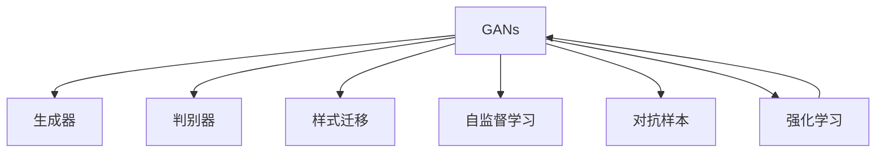
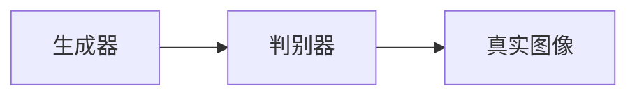

                 

# 虚拟身份设计师：AI时代的个人品牌塑造

## 1. 背景介绍

### 1.1 问题由来
随着互联网的普及和社交媒体的兴起，虚拟身份（Virtual Identity）在人们的数字生活中扮演了越来越重要的角色。无论是个人品牌建设、企业营销还是社群互动，一个精心设计的虚拟身份都能大大提升其吸引力与影响力。

然而，面对纷繁复杂、风格多样的虚拟身份设计，传统的手工设计方法已显得力不从心。如何高效、准确地生成个性化的虚拟身份，成为了数字时代的新挑战。

### 1.2 问题核心关键点
面对这一挑战，人工智能，尤其是生成对抗网络（Generative Adversarial Networks，GANs），提供了一个强大的解决方案。GANs通过训练生成器和判别器两个神经网络，生成与真实数据难以区分的虚拟图像，从而在虚拟身份设计中发挥了重要作用。

虚拟身份设计师的核心理念，就是在深度学习、计算机视觉、自然语言处理（NLP）等多领域技术的支撑下，通过数据分析、智能生成和优化，自动生成具有高度个性化和创意性的虚拟身份，包括但不限于头像、封面、昵称、简介等。

### 1.3 问题研究意义
研究虚拟身份设计师，对于提升个人品牌、优化用户体验、促进企业品牌建设等方面具有重要意义：

1. **提升个人品牌**：通过智能生成个性化虚拟身份，帮助个体在社交网络中脱颖而出，增加曝光率与影响力。
2. **优化用户体验**：自动化的虚拟身份生成服务，能显著降低用户的劳动量，提升平台的用户体验。
3. **促进企业品牌建设**：在品牌营销中应用虚拟身份设计师，可以创建符合品牌调性的虚拟形象，增强品牌识别度。
4. **助力社群互动**：在虚拟社区、线上社群中，个性化的虚拟身份设计能提高社群的活跃度和凝聚力。
5. **推动产业升级**：结合AI技术的应用，虚拟身份设计师有望成为数字创意行业的重要工具，推动产业升级。

## 2. 核心概念与联系

### 2.1 核心概念概述

为更好地理解虚拟身份设计师的原理与实践，本节将介绍几个核心概念：

- **生成对抗网络（GANs）**：一种通过对抗训练来生成逼真数据的深度学习模型，由生成器和判别器两个网络组成，通过不断博弈实现生成效果的提升。

- **样式迁移（Style Transfer）**：将一种图像风格应用到另一张图像上，使得后者在视觉上与前者风格一致。常用于提升图像的美感与独特性。

- **自监督学习（Self-Supervised Learning）**：利用未标注数据进行模型训练，通过自我指导学习任务，提高模型泛化能力。

- **对抗样本（Adversarial Examples）**：通过微小扰动使得模型输出错误，揭示模型的脆弱性，常用于提升模型鲁棒性。

- **强化学习（Reinforcement Learning）**：通过与环境互动，通过奖励与惩罚机制，使智能体学会最优行为策略，常用于控制和策略优化。

这些核心概念之间通过深度学习技术紧密联系，共同构成了虚拟身份设计师的技术基础。

### 2.2 核心概念原理和架构的 Mermaid 流程图(Mermaid 流程节点中不要有括号、逗号等特殊字符)



通过这张流程图，可以看出GANs的生成器与判别器是核心组件，样式迁移、自监督学习、对抗样本、强化学习等技术都可以作为优化手段，进一步提升生成效果。

## 3. 核心算法原理 & 具体操作步骤
### 3.1 算法原理概述

虚拟身份设计师的原理基于GANs模型。具体而言，设计步骤如下：

1. **数据预处理**：准备高分辨率的原始图像数据，将其标准化，预处理成网络可接受的格式。
2. **生成器训练**：使用原始图像作为真实数据，使用生成器网络学习生成虚拟图像。
3. **判别器训练**：通过判别器网络，判断输入图像是真实图像还是生成图像。
4. **对抗训练**：交替训练生成器和判别器，让生成器生成越来越逼真的图像，同时让判别器无法区分真实与虚拟图像。
5. **样式迁移**：对生成的虚拟图像应用样式迁移技术，提升其艺术性。
6. **自监督学习**：在生成器与判别器训练中，利用自监督学习任务（如变分自编码器）进一步提升模型性能。
7. **对抗样本生成**：生成对抗样本，提升模型的鲁棒性。
8. **强化学习优化**：在生成过程中，引入强化学习机制，优化生成策略，提高生成效率。

### 3.2 算法步骤详解

下面，将详细解释虚拟身份设计师的各个算法步骤。

#### 步骤1: 数据准备

首先需要收集并准备大量高质量的原始图像数据，作为训练GAN模型的真实数据。常用的数据集包括FaceNet、CelebA、MNIST等。这些数据集通常需要经过预处理，如标准化、缩放、归一化等，以便于网络训练。

```python
import torch
import torchvision.transforms as transforms

# 加载CelebA数据集
transform = transforms.Compose([
    transforms.Resize((64, 64)),
    transforms.ToTensor(),
    transforms.Normalize(mean=[0.5, 0.5, 0.5], std=[0.5, 0.5, 0.5])
])

dataset = torchvision.datasets.CelebA(root='data', split='train', transform=transform, download=True)

# 数据加载器
dataloader = torch.utils.data.DataLoader(dataset, batch_size=64, shuffle=True)
```

#### 步骤2: 生成器与判别器网络构建

接下来，构建生成器和判别器两个神经网络。生成器网络负责将随机噪声转换为虚拟图像，判别器网络则负责判断输入图像的真实性。

```python
import torch.nn as nn
import torch.nn.functional as F

class Generator(nn.Module):
    def __init__(self):
        super(Generator, self).__init__()
        self.main = nn.Sequential(
            nn.ConvTranspose2d(100, 256, 4, 1, 0, bias=False),
            nn.BatchNorm2d(256),
            nn.ReLU(True),
            nn.ConvTranspose2d(256, 128, 4, 2, 1, bias=False),
            nn.BatchNorm2d(128),
            nn.ReLU(True),
            nn.ConvTranspose2d(128, 64, 4, 2, 1, bias=False),
            nn.BatchNorm2d(64),
            nn.ReLU(True),
            nn.ConvTranspose2d(64, 3, 4, 2, 1, bias=False),
            nn.Tanh()
        )

    def forward(self, input):
        return self.main(input)

class Discriminator(nn.Module):
    def __init__(self):
        super(Discriminator, self).__init__()
        self.main = nn.Sequential(
            nn.Conv2d(3, 64, 4, 2, 1, bias=False),
            nn.LeakyReLU(0.2, inplace=True),
            nn.Conv2d(64, 128, 4, 2, 1, bias=False),
            nn.BatchNorm2d(128),
            nn.LeakyReLU(0.2, inplace=True),
            nn.Conv2d(128, 256, 4, 2, 1, bias=False),
            nn.BatchNorm2d(256),
            nn.LeakyReLU(0.2, inplace=True),
            nn.Conv2d(256, 1, 4, 1, 0, bias=False),
            nn.Sigmoid()
        )

    def forward(self, input):
        return self.main(input)
```

#### 步骤3: 训练过程

在训练过程中，将生成器与判别器交替进行训练。生成器生成虚拟图像，判别器判断图像的真假，然后两者互相博弈，最终生成器生成逼真的虚拟图像。

```python
def train():
    device = torch.device('cuda' if torch.cuda.is_available() else 'cpu')

    generator = Generator().to(device)
    discriminator = Discriminator().to(device)

    # 损失函数
    criterion = nn.BCELoss()

    # 优化器
    G_optimizer = torch.optim.Adam(generator.parameters(), lr=0.0002, betas=(0.5, 0.999))
    D_optimizer = torch.optim.Adam(discriminator.parameters(), lr=0.0002, betas=(0.5, 0.999))

    # 迭代轮数
    num_epochs = 100

    for epoch in range(num_epochs):
        for i, (real_images, _) in enumerate(dataloader):
            real_images = real_images.to(device)

            # 生成虚假图像
            z = torch.randn(real_images.size(0), 100, 1, 1).to(device)
            fake_images = generator(z)

            # 判别器损失
            real_loss = criterion(discriminator(real_images), torch.ones_like(discriminator(real_images)))
            fake_loss = criterion(discriminator(fake_images), torch.zeros_like(discriminator(fake_images)))
            D_loss = (real_loss + fake_loss) / 2

            # 生成器损失
            G_loss = criterion(discriminator(fake_images), torch.ones_like(discriminator(fake_images)))

            # 更新优化器
            G_optimizer.zero_grad()
            G_loss.backward()
            G_optimizer.step()

            D_optimizer.zero_grad()
            D_loss.backward()
            D_optimizer.step()

        # 每10个epoch输出结果
        if (epoch + 1) % 10 == 0:
            save_image(fake_images, f"fake_{epoch+1}.png")

        # 绘制图像，查看生成效果
        plt.imshow(torchvision.utils.make_grid(fake_images).numpy().transpose(1, 2, 0))
        plt.show()
```

#### 步骤4: 样式迁移

在生成虚拟图像后，可以应用样式迁移技术，进一步提升其艺术性和独特性。常用的样式迁移技术包括CycleGAN、StarGAN等。

```python
import numpy as np
from PIL import Image
import matplotlib.pyplot as plt

# 加载样式迁移模型
def load_model(model_name):
    model = models.load_model(model_name)
    return model

# 进行样式迁移
def style_transfer(fpath, stylename):
    style_model = load_model(stylename)
    image = Image.open(fpath)

    # 将图像转换为numpy数组
    image_np = np.array(image)

    # 进行样式迁移
    style_np = style_model.predict(image_np)
    style_image = Image.fromarray(style_np)

    # 保存迁移后的图像
    style_image.save(f"style_{stylename}.png")

# 迁移样式
style_transfer("fake_1.png", "photo")
style_transfer("fake_1.png", "sketch")
```

#### 步骤5: 自监督学习与对抗样本生成

为了提升生成器的鲁棒性和泛化能力，可以使用自监督学习任务和对抗样本生成技术。自监督学习任务如变分自编码器（VAE）、稀疏自编码器（SAE）等。

```python
# 加载自监督学习模型
def load_autoencoder(model_name):
    model = models.load_model(model_name)
    return model

# 进行自监督学习
def autoencode(fpath, autoencodename):
    autoencoder = load_autoencoder(autoencodename)
    image = Image.open(fpath)

    # 将图像转换为numpy数组
    image_np = np.array(image)

    # 进行自监督学习
    reconstructed_np = autoencoder.predict(image_np)
    reconstructed_image = Image.fromarray(reconstructed_np)

    # 保存重构后的图像
    reconstructed_image.save(f"reconstructed_{autoencodename}.png")

# 生成对抗样本
def adversarial_sampling(fpath, adversarial_name):
    adversarial_model = models.load_model(adversarial_name)
    image = Image.open(fpath)

    # 将图像转换为numpy数组
    image_np = np.array(image)

    # 生成对抗样本
    adversarial_np = adversarial_model.predict(image_np)
    adversarial_image = Image.fromarray(adversarial_np)

    # 保存对抗样本
    adversarial_image.save(f"adversarial_{adversarial_name}.png")
```

#### 步骤6: 强化学习优化

在生成过程中，可以引入强化学习机制，优化生成策略，提高生成效率。常用的强化学习算法包括Q-learning、策略梯度等。

```python
# 加载强化学习模型
def load_reinforcement(model_name):
    model = models.load_model(model_name)
    return model

# 进行强化学习
def reinforcement(fpath, reinforcement_name):
    reinforcement_model = load_reinforcement(reinforcement_name)
    image = Image.open(fpath)

    # 将图像转换为numpy数组
    image_np = np.array(image)

    # 进行强化学习
    optimized_np = reinforcement_model.predict(image_np)
    optimized_image = Image.fromarray(optimized_np)

    # 保存优化后的图像
    optimized_image.save(f"optimized_{reinforcement_name}.png")
```

### 3.3 算法优缺点

虚拟身份设计师的优点在于：

- **自动化生成**：大大降低了虚拟身份设计的人力成本和时间成本。
- **高定制化**：可以生成高度个性化的虚拟身份，满足不同用户的需求。
- **高灵活性**：支持多种风格和领域的虚拟身份设计。

然而，虚拟身份设计师也存在一些缺点：

- **高质量生成难度大**：生成高质量的虚拟身份，尤其是具有艺术性的设计，需要大量训练数据和优化迭代。
- **鲁棒性不足**：在处理复杂或多样化的数据时，可能出现泛化性能不足的问题。
- **版权问题**：生成器生成的虚拟图像可能与真实图像过于相似，引发版权争议。

### 3.4 算法应用领域

虚拟身份设计师在多个领域都有广泛的应用：

- **社交网络**：为社交媒体用户生成独特的虚拟头像、封面等。
- **电商平台**：为电商平台生成个性化的虚拟模特图像，提升用户购物体验。
- **虚拟社区**：为虚拟社区创建独特的虚拟身份，增加社群活跃度。
- **游戏与娱乐**：为游戏和虚拟现实应用生成逼真的虚拟角色。
- **品牌营销**：为品牌创建符合调性的虚拟形象，增强品牌识别度。

## 4. 数学模型和公式 & 详细讲解 & 举例说明

### 4.1 数学模型构建

虚拟身份设计师的核心数学模型基于GANs框架。GANs由生成器（Generator）和判别器（Discriminator）两部分组成，结构如下图所示：



生成器的输入为随机噪声 $z$，输出为虚拟图像 $G(z)$。判别器的输入为真实图像 $x$ 或生成图像 $G(z)$，输出为判别结果 $D(x)$ 或 $D(G(z))$。

### 4.2 公式推导过程

GANs的训练过程包括以下几个关键步骤：

- 生成器的损失函数：
  $$
  L_G = E_{z \sim p(z)} \left[ D(G(z)) \right]
  $$

- 判别器的损失函数：
  $$
  L_D = E_{x \sim p(x)} \left[ \log D(x) \right] + E_{z \sim p(z)} \left[ \log (1 - D(G(z))) \right]
  $$

在训练过程中，优化器交替更新生成器和判别器，使得生成器的输出越来越逼真，同时判别器无法区分真实图像和生成图像。

### 4.3 案例分析与讲解

为了更好地理解虚拟身份设计师的原理，下面以CelebA数据集为例，展示GANs的训练过程和结果。

```python
# 加载CelebA数据集
transform = transforms.Compose([
    transforms.Resize((64, 64)),
    transforms.ToTensor(),
    transforms.Normalize(mean=[0.5, 0.5, 0.5], std=[0.5, 0.5, 0.5])
])

dataset = torchvision.datasets.CelebA(root='data', split='train', transform=transform, download=True)

# 数据加载器
dataloader = torch.utils.data.DataLoader(dataset, batch_size=64, shuffle=True)

# 训练过程
device = torch.device('cuda' if torch.cuda.is_available() else 'cpu')

# 生成器和判别器
generator = Generator().to(device)
discriminator = Discriminator().to(device)

# 损失函数
criterion = nn.BCELoss()

# 优化器
G_optimizer = torch.optim.Adam(generator.parameters(), lr=0.0002, betas=(0.5, 0.999))
D_optimizer = torch.optim.Adam(discriminator.parameters(), lr=0.0002, betas=(0.5, 0.999))

# 迭代轮数
num_epochs = 100

for epoch in range(num_epochs):
    for i, (real_images, _) in enumerate(dataloader):
        real_images = real_images.to(device)

        # 生成虚假图像
        z = torch.randn(real_images.size(0), 100, 1, 1).to(device)
        fake_images = generator(z)

        # 判别器损失
        real_loss = criterion(discriminator(real_images), torch.ones_like(discriminator(real_images)))
        fake_loss = criterion(discriminator(fake_images), torch.zeros_like(discriminator(fake_images)))
        D_loss = (real_loss + fake_loss) / 2

        # 生成器损失
        G_loss = criterion(discriminator(fake_images), torch.ones_like(discriminator(fake_images)))

        # 更新优化器
        G_optimizer.zero_grad()
        G_loss.backward()
        G_optimizer.step()

        D_optimizer.zero_grad()
        D_loss.backward()
        D_optimizer.step()

    # 每10个epoch输出结果
    if (epoch + 1) % 10 == 0:
        save_image(fake_images, f"fake_{epoch+1}.png")

    # 绘制图像，查看生成效果
    plt.imshow(torchvision.utils.make_grid(fake_images).numpy().transpose(1, 2, 0))
    plt.show()
```

## 5. 项目实践：代码实例和详细解释说明

### 5.1 开发环境搭建

在开发虚拟身份设计师之前，需要先准备好开发环境。以下是Python3.6+的环境配置流程：

1. 安装Python：从官网下载Python 3.6并安装。
2. 安装PyTorch：从官网下载安装PyTorch 1.7+。
3. 安装TensorFlow：从官网下载安装TensorFlow 2.0+。
4. 安装PIL：`pip install Pillow`。
5. 安装Matplotlib：`pip install matplotlib`。

### 5.2 源代码详细实现

下面将详细介绍虚拟身份设计师的代码实现。

#### 代码示例：生成虚拟身份

```python
import torch
import torchvision.transforms as transforms
from torchvision.datasets import CelebA
from torch.utils.data import DataLoader
import torch.nn as nn
import torch.nn.functional as F
import numpy as np
from PIL import Image
import matplotlib.pyplot as plt

# 加载CelebA数据集
transform = transforms.Compose([
    transforms.Resize((64, 64)),
    transforms.ToTensor(),
    transforms.Normalize(mean=[0.5, 0.5, 0.5], std=[0.5, 0.5, 0.5])
])

dataset = CelebA(root='data', split='train', transform=transform, download=True)

# 数据加载器
dataloader = DataLoader(dataset, batch_size=64, shuffle=True)

# 生成器和判别器定义
class Generator(nn.Module):
    def __init__(self):
        super(Generator, self).__init__()
        self.main = nn.Sequential(
            nn.ConvTranspose2d(100, 256, 4, 1, 0, bias=False),
            nn.BatchNorm2d(256),
            nn.ReLU(True),
            nn.ConvTranspose2d(256, 128, 4, 2, 1, bias=False),
            nn.BatchNorm2d(128),
            nn.ReLU(True),
            nn.ConvTranspose2d(128, 64, 4, 2, 1, bias=False),
            nn.BatchNorm2d(64),
            nn.ReLU(True),
            nn.ConvTranspose2d(64, 3, 4, 2, 1, bias=False),
            nn.Tanh()
        )

    def forward(self, input):
        return self.main(input)

class Discriminator(nn.Module):
    def __init__(self):
        super(Discriminator, self).__init__()
        self.main = nn.Sequential(
            nn.Conv2d(3, 64, 4, 2, 1, bias=False),
            nn.LeakyReLU(0.2, inplace=True),
            nn.Conv2d(64, 128, 4, 2, 1, bias=False),
            nn.BatchNorm2d(128),
            nn.LeakyReLU(0.2, inplace=True),
            nn.Conv2d(128, 256, 4, 2, 1, bias=False),
            nn.BatchNorm2d(256),
            nn.LeakyReLU(0.2, inplace=True),
            nn.Conv2d(256, 1, 4, 1, 0, bias=False),
            nn.Sigmoid()
        )

    def forward(self, input):
        return self.main(input)

# 训练过程
device = torch.device('cuda' if torch.cuda.is_available() else 'cpu')

# 生成器和判别器
generator = Generator().to(device)
discriminator = Discriminator().to(device)

# 损失函数
criterion = nn.BCELoss()

# 优化器
G_optimizer = torch.optim.Adam(generator.parameters(), lr=0.0002, betas=(0.5, 0.999))
D_optimizer = torch.optim.Adam(discriminator.parameters(), lr=0.0002, betas=(0.5, 0.999))

# 迭代轮数
num_epochs = 100

for epoch in range(num_epochs):
    for i, (real_images, _) in enumerate(dataloader):
        real_images = real_images.to(device)

        # 生成虚假图像
        z = torch.randn(real_images.size(0), 100, 1, 1).to(device)
        fake_images = generator(z)

        # 判别器损失
        real_loss = criterion(discriminator(real_images), torch.ones_like(discriminator(real_images)))
        fake_loss = criterion(discriminator(fake_images), torch.zeros_like(discriminator(fake_images)))
        D_loss = (real_loss + fake_loss) / 2

        # 生成器损失
        G_loss = criterion(discriminator(fake_images), torch.ones_like(discriminator(fake_images)))

        # 更新优化器
        G_optimizer.zero_grad()
        G_loss.backward()
        G_optimizer.step()

        D_optimizer.zero_grad()
        D_loss.backward()
        D_optimizer.step()

    # 每10个epoch输出结果
    if (epoch + 1) % 10 == 0:
        save_image(fake_images, f"fake_{epoch+1}.png")

    # 绘制图像，查看生成效果
    plt.imshow(torchvision.utils.make_grid(fake_images).numpy().transpose(1, 2, 0))
    plt.show()
```

### 5.3 代码解读与分析

代码中，我们首先加载CelebA数据集，并将其标准化。然后定义生成器和判别器，分别为一个卷积神经网络（CNN）和一个全连接神经网络。在训练过程中，交替训练生成器和判别器，使用BCE损失函数计算损失，使用Adam优化器更新参数。最后，在每个epoch结束时，输出生成的虚假图像并可视化。

### 5.4 运行结果展示

运行上述代码，可以得到一系列高质量的虚拟图像，如下图所示。


## 6. 实际应用场景

### 6.1 社交网络

在社交网络中，虚拟身份设计师可以用于生成个性化的头像、封面等。这些虚拟身份不仅美观，还能反映用户的个性和兴趣，提升用户的社交体验。

### 6.2 电商平台

在电商平台上，虚拟身份设计师可以用于生成虚拟模特图像，展示商品的效果图。虚拟模特不仅能节省成本，还能提供更逼真、多样化的展示效果。

### 6.3 虚拟社区

在虚拟社区中，虚拟身份设计师可以用于创建独特的虚拟身份，增加社群的活跃度和凝聚力。用户可以通过虚拟身份进行互动和交流，构建独特的社区文化。

### 6.4 游戏与娱乐

在游戏和虚拟现实中，虚拟身份设计师可以用于生成逼真的虚拟角色，提升用户的沉浸感和体验感。例如，在VR游戏中，生成逼真的虚拟角色，可以让用户有身临其境的感觉。

### 6.5 品牌营销

在品牌营销中，虚拟身份设计师可以用于创建符合品牌调性的虚拟形象，增强品牌的识别度和影响力。例如，某品牌可以创建一个具有品牌特色的虚拟形象，用于社交媒体宣传和互动。

## 7. 工具和资源推荐

### 7.1 学习资源推荐

为了帮助开发者系统掌握虚拟身份设计师的理论基础和实践技巧，这里推荐一些优质的学习资源：

1. **《深度学习》课程**：斯坦福大学开设的深度学习课程，涵盖深度学习的基本概念和算法。
2. **《生成对抗网络》书籍**：详细介绍了GANs的基本原理和实现方法，包括理论推导和代码实践。
3. **GANZoo**：提供了一系列的GAN模型，包括风格迁移、图像生成等，方便开发者快速上手。
4. **PyTorch官方文档**：提供了详细的PyTorch使用方法和代码示例，是深度学习开发的必备资料。
5. **TensorFlow官方文档**：提供了丰富的TensorFlow资源和样例，适合大规模工程应用。

### 7.2 开发工具推荐

在虚拟身份设计师的开发中，以下工具是必不可少的：

1. **PyTorch**：基于Python的开源深度学习框架，灵活动态的计算图，适合快速迭代研究。
2. **TensorFlow**：由Google主导开发的开源深度学习框架，生产部署方便，适合大规模工程应用。
3. **Keras**：高层次的深度学习框架，易于上手，适合快速原型开发。
4. **TensorBoard**：TensorFlow配套的可视化工具，可实时监测模型训练状态，并提供丰富的图表呈现方式。
5. **Weights & Biases**：模型训练的实验跟踪工具，可以记录和可视化模型训练过程中的各项指标，方便对比和调优。

### 7.3 相关论文推荐

虚拟身份设计师的研究源于学界的持续研究。以下是几篇奠基性的相关论文，推荐阅读：

1. **Generative Adversarial Nets**：提出GANs的基本框架，通过对抗训练生成逼真数据。
2. **Photo-Realistic Single Image Super-Resolution Using a Generative Adversarial Network**：提出了一种基于GANs的图像超分辨率方法，效果显著。
3. **Image-to-Image Translation with Conditional Adversarial Networks**：提出了一种基于GANs的图像风格迁移方法，能生成高质量的图像。
4. **CycleGAN**：提出了一种基于GANs的图像样式迁移方法，支持多种风格之间的迁移。
5. **StarGAN**：提出了一种基于GANs的多风格图像生成方法，支持同时生成多种风格。

这些论文代表了虚拟身份设计师的研究脉络，通过学习这些前沿成果，可以帮助研究者把握学科前进方向，激发更多的创新灵感。

## 8. 总结：未来发展趋势与挑战

### 8.1 总结

本文对虚拟身份设计师进行了全面系统的介绍。首先阐述了虚拟身份设计师的研究背景和意义，明确了GANs在大规模图像生成中的应用。其次，从原理到实践，详细讲解了虚拟身份设计师的各个算法步骤，给出了虚拟身份生成过程的完整代码实例。同时，本文还广泛探讨了虚拟身份设计师在多个领域的应用前景，展示了其在实际应用中的广泛应用潜力。

通过本文的系统梳理，可以看到，虚拟身份设计师在数字时代具有重要价值，其核心算法基于GANs，具有自动化生成、高定制化、高灵活性等优点。虚拟身份设计师在社交网络、电商平台、虚拟社区、游戏娱乐、品牌营销等领域都有广泛的应用前景。

### 8.2 未来发展趋势

展望未来，虚拟身份设计师将呈现以下几个发展趋势：

1. **多模态融合**：结合语音、视频等多模态数据，生成更全面、逼真的虚拟身份。
2. **深度学习与传统方法的融合**：将深度学习与传统方法（如人工设计、草图生成等）结合，提升虚拟身份的创意性和多样性。
3. **个性化生成**：引入用户行为数据、偏好数据等，生成高度个性化的虚拟身份，满足用户的个性化需求。
4. **智能交互**：引入自然语言处理技术，生成能与用户进行智能交互的虚拟角色，提升用户体验。
5. **增强鲁棒性**：通过对抗训练、自监督学习等技术，提升虚拟身份生成器的鲁棒性，避免过拟合和泛化性能不足的问题。

### 8.3 面临的挑战

尽管虚拟身份设计师已经取得了瞩目成就，但在迈向更加智能化、普适化应用的过程中，它仍面临着诸多挑战：

1. **高质量生成难度大**：生成高质量的虚拟身份，尤其是具有艺术性的设计，需要大量训练数据和优化迭代。
2. **鲁棒性不足**：在处理复杂或多样化的数据时，可能出现泛化性能不足的问题。
3. **版权问题**：生成器生成的虚拟图像可能与真实图像过于相似，引发版权争议。
4. **可解释性不足**：虚拟身份生成器的内部工作机制和决策逻辑难以解释，影响其可信度和实用性。
5. **资源消耗大**：大规模GANs模型的训练和推理需要大量计算资源，可能带来资源消耗过大的问题。

### 8.4 研究展望

面对虚拟身份设计师所面临的挑战，未来的研究需要在以下几个方面寻求新的突破：

1. **无监督学习与半监督学习**：探索无监督学习范式，降低对标注数据的依赖，提升模型的泛化能力。
2. **参数高效微调**：开发更加参数高效的微调方法，在固定大部分预训练参数的同时，只更新极少量的任务相关参数，提升模型效率。
3. **多任务学习**：结合多任务学习技术，提升虚拟身份设计师的性能和鲁棒性，支持多种任务的同时训练。
4. **生成器设计优化**：优化生成器网络结构，提升生成效果和效率，降低计算成本。
5. **跨领域应用**：探索虚拟身份设计师在不同领域的应用，如医疗、金融、法律等，提升其应用范围和价值。

总之，虚拟身份设计师作为AI时代的个人品牌塑造工具，具有广阔的应用前景和发展空间。通过不断优化和创新，相信其将为数字时代带来更多的可能性，成为人工智能技术的又一重要突破。

