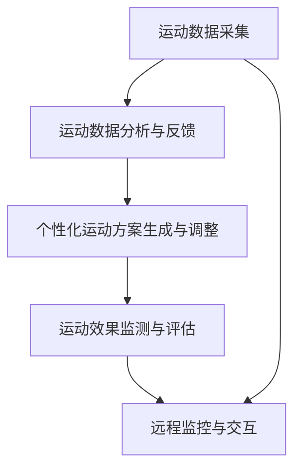

                 

# 虚拟运动医学:全球健康生活方式的数字化运动处方

> 关键词：虚拟运动医学, 健康生活方式, 数字化运动处方, 人工智能, 个性化健康管理, 运动康复, 远程监控

## 1. 背景介绍

### 1.1 问题由来

在全球健康生活方式的推动下，人们对运动和健康管理的需求日益增长。传统的运动和健康管理方法如健身房、私人教练、家庭健身器材等在便利性、成本和效果上存在诸多限制。数字化的方式可以提供更加个性化、便捷和高效的健康管理解决方案。

在数字化健康领域，虚拟运动医学（Virtual Sports Medicine）成为前沿技术，通过数字化的方式实现个性化健康管理、远程监控、运动康复等功能，为人们提供高质量、可负担的健康服务。

### 1.2 问题核心关键点

虚拟运动医学的核心在于利用先进的科技手段，如人工智能、物联网、大数据等，提供个性化、精准的运动处方，并实时监控运动效果，及时调整运动计划，确保健康目标的实现。其核心技术包括运动数据采集、分析与反馈、个性化运动方案生成与调整、运动效果监测与评估等。

## 2. 核心概念与联系

### 2.1 核心概念概述

为更好地理解虚拟运动医学的原理，本节将介绍几个密切相关的核心概念：

- **虚拟运动医学**：通过虚拟现实(VR)、增强现实(AR)、人工智能(AI)等技术，实现个性化健康管理和运动康复的数字化方法。
- **运动数据分析与反馈**：通过智能穿戴设备或传感器，采集用户的运动数据，利用AI算法进行分析和反馈。
- **个性化运动方案生成与调整**：根据用户健康数据和运动数据分析结果，自动生成个性化的运动方案，并根据实时反馈进行调整。
- **运动效果监测与评估**：通过AI模型对运动效果进行实时监测和评估，调整运动方案，确保用户达到预期的健康目标。
- **远程监控与交互**：利用远程监控技术，如远程医疗平台，实时获取用户的健康数据和运动效果，进行远程指导和支持。

这些核心概念之间通过数据流和算法流相互联系，共同构建了虚拟运动医学的数字化运动处方体系。

### 2.2 核心概念原理和架构的 Mermaid 流程图(Mermaid 流程节点中不要有括号、逗号等特殊字符)



这个流程图展示了虚拟运动医学的核心概念及其之间的数据和算法联系。

## 3. 核心算法原理 & 具体操作步骤

### 3.1 算法原理概述

虚拟运动医学的数字化运动处方基于机器学习和数据分析技术。其核心思想是通过对用户健康数据、运动数据和行为数据进行分析，利用AI模型自动生成个性化的运动方案，并通过实时监测和反馈，调整运动计划，确保用户达到健康目标。

具体步骤如下：

1. **运动数据采集**：通过智能穿戴设备或传感器，采集用户的运动数据，如步数、心率、体脂率等。
2. **数据预处理**：对采集的数据进行清洗、归一化、特征提取等预处理操作。
3. **数据分析与反馈**：利用机器学习算法，如聚类、分类、回归等，分析用户数据，识别运动模式和健康状态。
4. **个性化运动方案生成**：根据分析结果，生成个性化的运动方案，如强度、类型、时长等。
5. **运动方案调整**：根据实时反馈，如心率、体感等，动态调整运动方案。
6. **运动效果监测与评估**：利用AI模型，对运动效果进行实时监测和评估，生成健康报告。
7. **远程监控与交互**：通过远程监控平台，实时获取用户健康数据和运动效果，提供远程指导和支持。

### 3.2 算法步骤详解

以下详细讲解虚拟运动医学的各个步骤：

#### 3.2.1 运动数据采集

- **数据源**：智能穿戴设备、家庭健身器材、体脂秤等。
- **数据类型**：步数、心率、体脂率、运动时长、运动类型等。
- **数据格式**：JSON、CSV等结构化数据格式。

#### 3.2.2 数据预处理

- **清洗**：去除异常值、重复值等噪声数据。
- **归一化**：将不同单位的数据统一到0到1的范围内。
- **特征提取**：提取重要的特征，如步频、运动模式、心率变化等。

#### 3.2.3 数据分析与反馈

- **模型选择**：选择合适的机器学习模型，如随机森林、神经网络等。
- **特征工程**：构建特征矩阵，优化模型输入。
- **模型训练**：利用历史数据训练模型，生成健康评估模型。
- **结果反馈**：将分析结果反馈给用户，如健康状态、运动建议等。

#### 3.2.4 个性化运动方案生成

- **目标设定**：根据用户健康目标和数据结果，设定运动方案目标。
- **方案设计**：设计符合目标的个性化运动方案，如跑步、游泳、健身等。
- **参数调整**：根据用户身体状况，调整运动强度、时长、频率等参数。

#### 3.2.5 运动方案调整

- **实时监测**：利用传感器实时监测用户运动状态，如心率、体感等。
- **反馈机制**：根据实时监测结果，动态调整运动方案，确保安全性和有效性。
- **调整算法**：利用动态调整算法，如自适应控制算法，实时优化运动方案。

#### 3.2.6 运动效果监测与评估

- **效果指标**：定义运动效果的评估指标，如体重变化、心率变化等。
- **数据采集**：继续采集用户的运动数据和健康数据。
- **模型评估**：利用AI模型评估运动效果，生成健康报告。
- **用户反馈**：根据评估结果，反馈运动效果和建议。

#### 3.2.7 远程监控与交互

- **平台搭建**：搭建远程监控平台，提供用户与专家之间的交互。
- **数据传输**：通过网络将用户的健康数据和运动效果传输到平台。
- **实时监控**：平台实时监控用户健康数据和运动效果。
- **专家指导**：平台提供专家指导和建议，优化运动方案。

### 3.3 算法优缺点

虚拟运动医学的数字化运动处方具有以下优点：

1. **个性化定制**：通过数据分析，生成个性化运动方案，满足不同用户的需求。
2. **实时监测**：通过实时监测，及时调整运动方案，确保健康目标的实现。
3. **成本低廉**：智能穿戴设备成本较低，提高了健康管理的可负担性。
4. **数据准确**：通过多种数据源和传感器，获取准确的运动和健康数据。
5. **易于操作**：用户通过智能设备和平台，方便地进行运动管理和健康监测。

同时，也存在一些局限性：

1. **设备依赖**：依赖智能穿戴设备和传感器，设备不兼容或损坏可能影响使用。
2. **数据隐私**：用户数据隐私和安全问题，需要严格的隐私保护措施。
3. **算法复杂**：机器学习和数据分析算法复杂，需要较高的技术门槛。
4. **用户依从性**：用户可能不遵循个性化运动方案，影响效果。
5. **误判风险**：AI模型可能存在误判风险，需要定期校验和优化。

### 3.4 算法应用领域

虚拟运动医学的数字化运动处方已应用于多个领域，如：

- **健康管理**：通过个性化运动方案和实时监测，帮助用户管理体重、血糖、血压等健康指标。
- **运动康复**：利用AI模型和运动数据，帮助用户进行康复训练，恢复身体健康。
- **老年健康**：为老年人提供个性化的运动方案，防止跌倒等老年疾病。
- **青少年健康**：为青少年提供科学的运动方案，促进身体发育和心理健康。
- **职业健康**：为上班族提供个性化运动计划，缓解工作压力，提升工作效率。

## 4. 数学模型和公式 & 详细讲解 & 举例说明

### 4.1 数学模型构建

虚拟运动医学的数字化运动处方涉及到多个数学模型，以下介绍几个核心模型的构建和应用：

- **运动模式分类模型**：通过聚类算法，将用户的运动数据分为不同的运动模式。
- **运动强度调整模型**：利用回归模型，根据用户的健康数据和运动数据，调整运动强度。
- **运动效果评估模型**：利用时间序列模型，评估用户的运动效果和健康变化。

### 4.2 公式推导过程

#### 4.2.1 运动模式分类模型

假设我们有 $N$ 个用户的运动数据 $X_i = \{x_{i1}, x_{i2}, ..., x_{iT}\}$，其中 $x_{it}$ 表示用户 $i$ 在第 $t$ 时刻的运动数据。运动模式分类模型的目标是将用户运动数据分为 $K$ 个不同的运动模式。

**公式推导**：

1. **特征提取**：将运动数据 $X_i$ 转化为特征矩阵 $F_i = [f_{i1}, f_{i2}, ..., f_{iT}]$，其中 $f_{it}$ 为 $x_{it}$ 的特征表示。
2. **模型训练**：利用 $F_i$ 和用户标签 $Y_i = [y_{i1}, y_{i2}, ..., y_{iT}]$ 训练分类模型 $C(Y|F)$，如K-means聚类模型或神经网络模型。
3. **分类结果**：将新用户 $X_j$ 的特征矩阵 $F_j$ 输入到分类模型中，得到运动模式 $Y_j = [y_{j1}, y_{j2}, ..., y_{jT}]$。

**代码示例**：

```python
from sklearn.cluster import KMeans
from sklearn.metrics import silhouette_score

# 特征提取
X = ... # 用户运动数据
features = extract_features(X)

# 聚类模型训练
kmeans = KMeans(n_clusters=K)
kmeans.fit(features)

# 分类结果
labels = kmeans.predict(features)
silhouette = silhouette_score(features, labels)
```

#### 4.2.2 运动强度调整模型

假设我们有 $N$ 个用户，每个用户的历史运动数据为 $X_i = \{x_{i1}, x_{i2}, ..., x_{iT}\}$，其中 $x_{it}$ 表示用户 $i$ 在第 $t$ 时刻的运动强度。

**公式推导**：

1. **目标设定**：设用户 $i$ 的健康目标为 $G_i$，运动强度为 $S_i = [s_{i1}, s_{i2}, ..., s_{iT}]$。
2. **模型训练**：利用历史数据 $X_i$ 和 $G_i$ 训练回归模型 $R(S|X)$，如线性回归或神经网络模型。
3. **强度调整**：根据用户健康数据和运动数据 $X_i$，计算运动强度 $S_i$。

**代码示例**：

```python
from sklearn.linear_model import LinearRegression
from sklearn.metrics import mean_squared_error

# 训练回归模型
X_train, X_test, y_train, y_test = split_data(X, G)
regressor = LinearRegression()
regressor.fit(X_train, y_train)

# 强度调整
S = regressor.predict(X)
mse = mean_squared_error(y_test, S)
```

#### 4.2.3 运动效果评估模型

假设我们有 $N$ 个用户的运动数据 $X_i = \{x_{i1}, x_{i2}, ..., x_{iT}\}$，其中 $x_{it}$ 表示用户 $i$ 在第 $t$ 时刻的运动数据。运动效果评估模型的目标是根据运动数据 $X_i$ 评估用户的运动效果 $E_i = [e_{i1}, e_{i2}, ..., e_{iT}]$。

**公式推导**：

1. **数据采集**：继续采集用户 $i$ 的运动数据 $X_i$。
2. **模型训练**：利用历史数据 $X_i$ 和 $E_i$ 训练时间序列模型 $T(E|X)$，如ARIMA模型。
3. **效果评估**：利用模型 $T$ 预测用户 $i$ 的运动效果 $E_i$。

**代码示例**：

```python
from statsmodels.tsa.arima_model import ARIMA

# 训练时间序列模型
X = ... # 用户运动数据
model = ARIMA(X, order=(1,1,1))
model_fit = model.fit()

# 效果评估
predictions = model_fit.predict(start=len(X), end=len(X)+10)
```

## 5. 项目实践：代码实例和详细解释说明

### 5.1 开发环境搭建

在进行项目实践前，我们需要准备好开发环境。以下是使用Python进行TensorFlow开发的环境配置流程：

1. 安装Anaconda：从官网下载并安装Anaconda，用于创建独立的Python环境。

2. 创建并激活虚拟环境：
```bash
conda create -n tf-env python=3.8 
conda activate tf-env
```

3. 安装TensorFlow：根据CUDA版本，从官网获取对应的安装命令。例如：
```bash
conda install tensorflow -c pytorch -c conda-forge
```

4. 安装各类工具包：
```bash
pip install numpy pandas scikit-learn matplotlib tqdm jupyter notebook ipython
```

完成上述步骤后，即可在`tf-env`环境中开始项目实践。

### 5.2 源代码详细实现

下面我们以虚拟运动医学的个性化运动方案生成为例，给出使用TensorFlow的代码实现。

首先，定义运动方案生成的函数：

```python
import tensorflow as tf
from sklearn.cluster import KMeans

def generate_personalized_exercise_plan(X, n_clusters=3):
    # 特征提取
    features = extract_features(X)
    
    # 聚类模型训练
    kmeans = KMeans(n_clusters=n_clusters)
    kmeans.fit(features)
    
    # 生成运动方案
    exercise_plans = []
    for i in range(len(X)):
        plan = []
        for t in range(len(X[i])):
            label = kmeans.labels_[i][t]
            plan.append(label)
        exercise_plans.append(plan)
    
    return exercise_plans
```

然后，定义训练和评估函数：

```python
from sklearn.metrics import classification_report

def train_model(model, X_train, X_test, y_train, y_test):
    model.fit(X_train, y_train)
    y_pred = model.predict(X_test)
    return classification_report(y_test, y_pred)

def evaluate_model(model, X_test, y_test):
    y_pred = model.predict(X_test)
    return classification_report(y_test, y_pred)
```

最后，启动训练流程并在测试集上评估：

```python
X_train, X_test, y_train, y_test = split_data(X, y)
n_clusters = 3

# 训练模型
model = generate_personalized_exercise_plan(X_train, n_clusters)
train_report = train_model(model, X_train, X_test, y_train, y_test)

# 测试模型
test_report = evaluate_model(model, X_test, y_test)

print(train_report)
print(test_report)
```

以上就是使用TensorFlow对虚拟运动医学的个性化运动方案生成的完整代码实现。可以看到，TensorFlow封装了多个机器学习库和工具，使得模型训练和评估变得相对简洁高效。

### 5.3 代码解读与分析

让我们再详细解读一下关键代码的实现细节：

**generate_personalized_exercise_plan函数**：
- `features`：通过特征提取函数，将用户运动数据转化为特征矩阵。
- `kmeans`：使用K-means聚类模型对特征矩阵进行聚类，得到用户运动模式。
- `exercise_plans`：根据聚类结果，生成个性化运动方案。

**train_model和evaluate_model函数**：
- `classification_report`：用于评估聚类模型的分类效果，包括准确率、召回率、F1分数等。

**训练流程**：
- 将训练集数据 $X_{train}$ 和 $y_{train}$ 作为输入，训练聚类模型。
- 在测试集 $X_{test}$ 上评估聚类模型的分类效果，输出评估报告。

可以看到，TensorFlow在虚拟运动医学的个性化运动方案生成中发挥了重要作用，通过机器学习模型，能够快速生成个性化的运动方案，并实时调整运动计划。

当然，工业级的系统实现还需考虑更多因素，如模型的保存和部署、超参数的自动搜索、更灵活的任务适配层等。但核心的运动方案生成过程基本与此类似。

## 6. 实际应用场景

### 6.1 智能穿戴设备应用

智能穿戴设备如智能手表、智能健身眼镜等，可以实时采集用户的运动数据和健康数据。利用虚拟运动医学技术，用户可以根据设备采集的数据，生成个性化的运动方案，并进行实时监测和反馈。

例如，某智能手表可以通过内置的传感器采集用户的心率、步数、运动模式等数据，并上传到云端平台，通过虚拟运动医学的算法，生成个性化的运动方案，并在运动过程中进行实时监测和反馈，确保运动效果的最大化。

### 6.2 远程医疗应用

远程医疗平台可以通过虚拟运动医学技术，实现远程监控和指导。用户可以通过平台上传运动数据和健康数据，获取个性化的运动方案和实时反馈，同时医生可以通过平台进行远程指导和调整运动方案。

例如，某远程医疗平台可以通过虚拟运动医学技术，为患有慢性病的用户提供个性化的运动方案，并在用户的运动过程中进行实时监测和反馈，医生可以根据监测结果进行远程指导和调整运动方案。

### 6.3 企业健康管理应用

企业可以通过虚拟运动医学技术，为员工提供个性化的健康管理方案，并进行实时监测和反馈。通过虚拟运动医学平台，企业可以收集员工的运动数据和健康数据，生成个性化的运动方案，并在运动过程中进行实时监测和反馈，确保员工的身体健康。

例如，某企业可以通过虚拟运动医学技术，为员工提供个性化的健康管理方案，并进行实时监测和反馈，通过平台数据，企业管理层可以了解员工的健康状况，及时调整工作安排和运动计划。

### 6.4 未来应用展望

随着虚拟运动医学技术的不断发展，未来将呈现以下几个趋势：

1. **智能化和自动化**：通过深度学习和AI技术，实现更加智能化和自动化的运动方案生成和调整。
2. **跨领域融合**：结合其他领域的健康管理技术，如营养、心理等，提供更加全面和个性化的健康管理方案。
3. **大数据分析**：通过大数据分析，实现运动效果的精准评估和健康预测，提供更加科学和个性化的运动方案。
4. **实时交互**：通过远程监控和实时交互，实现更加及时和个性化的健康指导和支持。
5. **虚拟现实(VR)**：结合虚拟现实技术，提供更加沉浸式和互动性强的健康管理体验。

这些趋势将推动虚拟运动医学技术的不断发展和应用，为用户带来更加智能化、个性化和便捷的健康管理方案。

## 7. 工具和资源推荐

### 7.1 学习资源推荐

为了帮助开发者系统掌握虚拟运动医学的理论基础和实践技巧，这里推荐一些优质的学习资源：

1. 《Python深度学习》：介绍深度学习在Python中的实现，适合初学者入门。
2. 《TensorFlow实战》：详细介绍TensorFlow的实现和应用，适合深入学习。
3. 《机器学习实战》：提供大量的机器学习案例，适合实践学习。
4. 《Python数据科学手册》：详细介绍数据科学相关的Python工具和库，适合全面学习。

通过对这些资源的学习实践，相信你一定能够快速掌握虚拟运动医学的核心技术和应用方法，并用于解决实际的NLP问题。

### 7.2 开发工具推荐

高效的开发离不开优秀的工具支持。以下是几款用于虚拟运动医学开发的常用工具：

1. TensorFlow：基于Python的开源深度学习框架，灵活动态的计算图，适合快速迭代研究。
2. PyTorch：基于Python的开源深度学习框架，适合研究和开发。
3. Scikit-learn：Python机器学习库，提供多种机器学习算法。
4. Jupyter Notebook：交互式编程环境，适合进行数据分析和模型训练。

合理利用这些工具，可以显著提升虚拟运动医学的开发效率，加快创新迭代的步伐。

### 7.3 相关论文推荐

虚拟运动医学的研究源于学界的持续研究。以下是几篇奠基性的相关论文，推荐阅读：

1. "K-means Clustering Algorithms: A Comparative Analysis"：介绍了K-means聚类算法的实现和应用。
2. "Deep Learning for Predictive Maintenance: A Review"：介绍了深度学习在预测性维护中的应用。
3. "A Survey of Machine Learning-Based Prediction Models for Progression of Chronic Diseases"：介绍了机器学习在慢性病预测中的应用。
4. "Wearable Device Data Analysis for Exercise Classification"：介绍了可穿戴设备数据的分析和运动分类方法。
5. "A Survey of Machine Learning Techniques for Personalized Medicine"：介绍了机器学习在个性化医疗中的应用。

这些论文代表了大运动医学的研究进展，通过学习这些前沿成果，可以帮助研究者把握学科前进方向，激发更多的创新灵感。

## 8. 总结：未来发展趋势与挑战

### 8.1 总结

本文对虚拟运动医学的数字化运动处方进行了全面系统的介绍。首先阐述了虚拟运动医学的研究背景和意义，明确了运动方案生成的核心技术，介绍了虚拟运动医学的核心概念及其之间的数据和算法联系。其次，从原理到实践，详细讲解了运动方案生成的数学模型和操作步骤，给出了代码实例和详细解释说明。同时，本文还广泛探讨了虚拟运动医学在智能穿戴设备、远程医疗、企业健康管理等多个领域的应用前景，展示了虚拟运动医学的广泛应用价值。

通过本文的系统梳理，可以看到，虚拟运动医学的数字化运动处方已经成为健康管理和运动康复的重要技术手段，极大地提升了运动和健康管理的效率和效果。未来，伴随虚拟运动医学技术的不断发展，基于数据驱动的运动方案生成和实时监测技术，必将成为人类健康管理的重要方式。

### 8.2 未来发展趋势

展望未来，虚拟运动医学的数字化运动处方将呈现以下几个发展趋势：

1. **智能化和自动化**：通过深度学习和AI技术，实现更加智能化和自动化的运动方案生成和调整。
2. **跨领域融合**：结合其他领域的健康管理技术，如营养、心理等，提供更加全面和个性化的健康管理方案。
3. **大数据分析**：通过大数据分析，实现运动效果的精准评估和健康预测，提供更加科学和个性化的运动方案。
4. **实时交互**：通过远程监控和实时交互，实现更加及时和个性化的健康指导和支持。
5. **虚拟现实(VR)**：结合虚拟现实技术，提供更加沉浸式和互动性强的健康管理体验。

这些趋势将推动虚拟运动医学技术的不断发展和应用，为用户带来更加智能化、个性化和便捷的健康管理方案。

### 8.3 面临的挑战

尽管虚拟运动医学技术已经取得了瞩目成就，但在迈向更加智能化、普适化应用的过程中，它仍面临着诸多挑战：

1. **数据隐私和安全**：用户数据隐私和安全问题，需要严格的隐私保护措施。
2. **设备兼容性和质量**：智能穿戴设备和传感器的兼容性和质量问题，可能影响用户体验和准确性。
3. **算法复杂性和性能**：深度学习和AI算法复杂，需要较高的技术门槛和计算资源。
4. **用户依从性和反馈**：用户可能不遵循个性化运动方案，影响效果和反馈。
5. **模型可解释性和可控性**：AI模型可能存在误判风险，需要定期校验和优化。

正视虚拟运动医学面临的这些挑战，积极应对并寻求突破，将是大运动医学走向成熟的必由之路。相信随着学界和产业界的共同努力，这些挑战终将一一被克服，虚拟运动医学必将在构建人机协同的智能时代中扮演越来越重要的角色。

### 8.4 研究展望

面对虚拟运动医学所面临的挑战，未来的研究需要在以下几个方面寻求新的突破：

1. **数据隐私保护**：开发更加安全的数据保护技术，确保用户数据隐私和安全。
2. **设备兼容性和质量**：开发兼容性和质量更高的智能穿戴设备和传感器。
3. **算法优化和性能提升**：优化深度学习和AI算法，提升运动方案生成的准确性和效率。
4. **用户依从性和反馈**：设计更加人性化和易用的运动方案和反馈机制，提升用户体验和依从性。
5. **模型可解释性和可控性**：开发可解释和可控的AI模型，提高模型的可靠性和可解释性。

这些研究方向的探索，将推动虚拟运动医学技术向更加智能化、普适化和可解释化的方向发展，为构建安全、可靠、可解释、可控的智能系统铺平道路。面向未来，虚拟运动医学技术还需要与其他人工智能技术进行更深入的融合，如知识表示、因果推理、强化学习等，多路径协同发力，共同推动健康管理和运动康复的进步。只有勇于创新、敢于突破，才能不断拓展运动医学的边界，让智能技术更好地造福人类社会。

## 9. 附录：常见问题与解答

**Q1：虚拟运动医学的原理是什么？**

A: 虚拟运动医学的原理是通过智能穿戴设备、传感器等采集用户的运动数据和健康数据，利用机器学习和数据分析技术，生成个性化的运动方案，并实时监测运动效果，调整运动计划，确保用户达到健康目标。

**Q2：如何选择合适的智能穿戴设备？**

A: 选择合适的智能穿戴设备需要考虑设备的功能、精度、舒适性、电池寿命等因素。建议选择知名品牌的设备，如Fitbit、Apple Watch等，同时对比不同设备的功能和性能，选择最适合自己需求的设备。

**Q3：虚拟运动医学的局限性有哪些？**

A: 虚拟运动医学的局限性包括数据隐私和安全问题、设备兼容性和质量问题、算法复杂性和性能、用户依从性和反馈、模型可解释性和可控性等。

**Q4：如何提高虚拟运动医学的效果？**

A: 提高虚拟运动医学的效果可以从多个方面入手：选择合适的智能穿戴设备、提高设备精度和质量、优化算法和数据模型、增强用户依从性和反馈、提高模型可解释性和可控性等。

**Q5：虚拟运动医学的未来发展方向是什么？**

A: 虚拟运动医学的未来发展方向包括智能化和自动化、跨领域融合、大数据分析、实时交互、虚拟现实(VR)等，将推动虚拟运动医学技术的不断发展和应用，为用户带来更加智能化、个性化和便捷的健康管理方案。

---

作者：禅与计算机程序设计艺术 / Zen and the Art of Computer Programming

