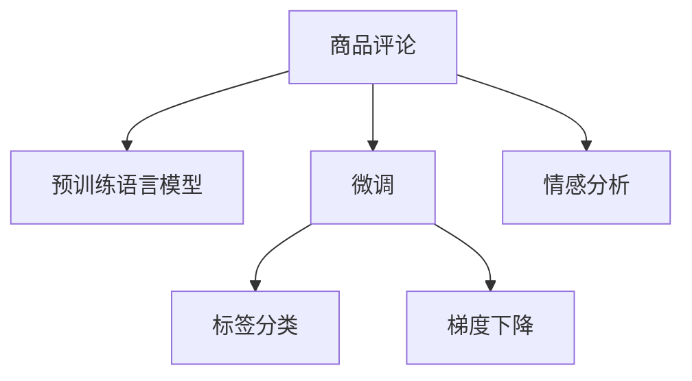
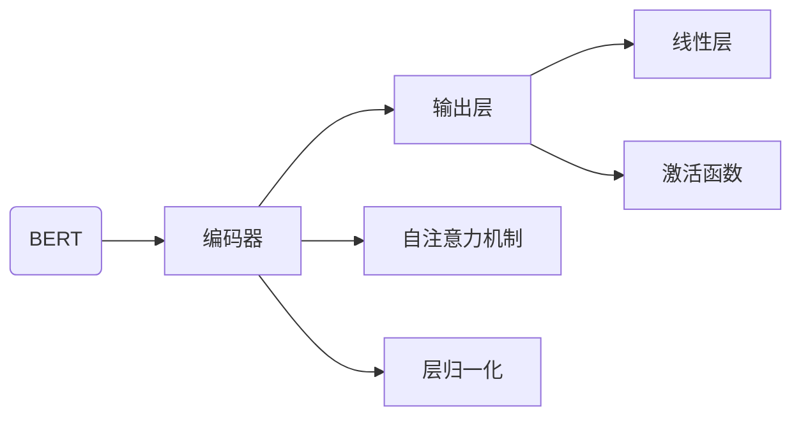

                 

# 融合AI大模型的商品评论情感分析

> 关键词：商品评论，情感分析，深度学习，自然语言处理(NLP)，BERT,ROBERTA,GPT-3,预训练，微调，标签分类，梯度下降

## 1. 背景介绍

### 1.1 问题由来
随着互联网购物的普及，商品评论已经成为用户表达对商品满意度的重要途径。利用自然语言处理(NLP)技术对商品评论进行情感分析，可以获取用户对商品的即时反馈，帮助商家及时调整产品和服务策略，提升用户满意度和忠诚度。传统的情感分析方法依赖于手工特征工程和规则模型，难以适应大规模、复杂的数据处理需求。而深度学习技术，特别是基于预训练语言模型(如BERT、ROBERTA、GPT-3等)的情感分析方法，可以显著提升情感识别的准确性和鲁棒性，成为当前热门的研究方向。

### 1.2 问题核心关键点
商品评论情感分析的核心在于如何高效准确地识别评论中的正面或负面情感，主要难点包括：
- 如何处理评论文本中的噪声、歧义和复杂情感表达。
- 如何利用大规模预训练语言模型，以及如何根据具体应用场景进行微调。
- 如何评价模型性能，并选取最佳超参数。

## 2. 核心概念与联系

### 2.1 核心概念概述

商品评论情感分析是一个典型的自然语言处理任务，主要涉及以下几个核心概念：

- 商品评论：用户对商品的使用体验、满意度、购买建议等信息。通常为无标签文本数据。
- 情感分析：通过模型对评论文本进行情感极性分类，识别正面、负面或中性情感。
- 深度学习：一种基于多层神经网络的机器学习范式，能够通过数据训练实现复杂模式识别。
- 自然语言处理(NLP)：利用计算机处理和理解自然语言文本的技术。
- 预训练语言模型：如BERT、ROBERTA、GPT-3等，通过大规模语料库进行预训练，学习通用的语言表示。
- 微调(Fine-tuning)：在预训练模型的基础上，利用特定任务的标注数据进行微调，优化模型在情感分类等任务上的性能。
- 标签分类：情感分析任务的输出，通常为二分类或多分类问题。
- 梯度下降：优化算法，用于最小化模型损失，更新模型参数。

这些概念之间的逻辑关系可以通过以下Mermaid流程图来展示：



这个流程图展示了大语言模型在商品评论情感分析中的作用机制：

1. 商品评论作为预训练语言模型的输入。
2. 预训练模型通过在语料库上进行训练，学习通用的语言表示。
3. 在特定任务上进行微调，优化情感分类能力。
4. 通过梯度下降算法，最小化损失函数，更新模型参数。
5. 输出情感分类结果。

## 3. 核心算法原理 & 具体操作步骤
### 3.1 算法原理概述

商品评论情感分析的算法原理，是基于深度学习模型在预训练-微调框架下进行分类任务的设计和实现。主要分为以下步骤：

1. 选择合适的预训练语言模型作为特征提取器，通过预训练学习通用的语言表示。
2. 根据任务需求，设计合适的微调模型架构，如基于Transformer的分类器。
3. 利用商品评论数据集进行微调，优化模型在情感分类任务上的表现。
4. 使用梯度下降算法，最小化模型损失函数，更新参数。
5. 通过验证集评估模型性能，选择最优模型。

### 3.2 算法步骤详解

#### 步骤1：数据准备

首先需要准备商品评论数据集，包括训练集、验证集和测试集。商品评论通常为文本数据，需要对其进行预处理，包括分词、去除停用词、词干提取等。

- **分词**：将文本分解为单词或子词，便于后续处理。
- **去除停用词**：删除一些无意义的常见词汇，如“的”、“是”等，以减少噪音。
- **词干提取**：将词汇还原为其词干形式，如将“running”、“run”、“ran”提取为“run”。

#### 步骤2：模型构建

在微调之前，需要构建一个适合情感分析任务的模型架构。以基于Transformer的BERT为例，其架构如图：



- **编码器**：由多个自注意力层构成，提取文本中的语义特征。
- **输出层**：通常是全连接层，进行情感分类。

#### 步骤3：微调过程

将预训练好的BERT模型作为特征提取器，在其顶部添加输出层，使用交叉熵损失函数进行微调。

1. 初始化模型参数。
2. 计算损失函数。
3. 反向传播更新参数。
4. 重复上述过程直至收敛。

#### 步骤4：模型评估与选择

利用验证集评估微调后的模型性能，选择性能最优的模型。

1. 将验证集分为训练集和测试集。
2. 计算模型在验证集上的准确率、召回率等指标。
3. 选择性能最优的模型进行测试。

#### 步骤5：模型部署

将训练好的模型部署到实际应用中，进行商品评论情感分析。

1. 将模型封装为API接口。
2. 提供商品评论作为输入，输出情感分类结果。

### 3.3 算法优缺点

基于大模型的商品评论情感分析方法具有以下优点：
- 精度高：大规模预训练模型具备强大的语言理解能力，能够准确捕捉情感表达。
- 鲁棒性强：大模型可以有效处理噪声、歧义等数据质量问题。
- 可扩展性好：模型参数规模大，可以适应大规模数据集。
- 适用范围广：适用于各种情感分类任务，如正面/负面、极端情感、情感强度等。

但该方法也存在以下缺点：
- 数据依赖：微调效果依赖于高质量标注数据，标注成本高。
- 计算资源需求大：大模型的参数量和计算量较大，需要高性能硬件支持。
- 解释性差：深度学习模型的"黑盒"特性，难以解释其决策过程。
- 存在偏见：预训练模型的语言偏见可能会传递到情感分析任务中，影响模型公平性。

## 4. 数学模型和公式 & 详细讲解 & 举例说明

### 4.1 数学模型构建

商品评论情感分析的数学模型可以描述如下：

设评论文本为 $x$，情感标签为 $y$，情感分类模型为 $M_{\theta}$。则情感分类问题可以表示为：

$$
y = M_{\theta}(x)
$$

其中 $y$ 为二分类标签（正面或负面），$x$ 为评论文本，$\theta$ 为模型参数。

假设训练集为 $\{(x_i, y_i)\}_{i=1}^N$，则损失函数可以表示为：

$$
\mathcal{L}(\theta) = -\frac{1}{N}\sum_{i=1}^N [y_i\log M_{\theta}(x_i) + (1-y_i)\log(1-M_{\theta}(x_i))]
$$

其中，$M_{\theta}(x_i)$ 为模型在评论 $x_i$ 上的输出，$y_i$ 为真实标签。

### 4.2 公式推导过程

以二分类任务为例，假设有 $K$ 个评论样本，每个样本长度为 $L$，则模型在每个样本上的输出可以表示为：

$$
\begin{aligned}
z_k &= [M_{\theta}(x_1), M_{\theta}(x_2), ..., M_{\theta}(x_k)] \\
y_k &= [y_1, y_2, ..., y_k] \\
\hat{y}_k &= [\hat{y}_1, \hat{y}_2, ..., \hat{y}_k]
\end{aligned}
$$

其中 $\hat{y}_k$ 为模型对每个样本的预测标签。

根据二分类交叉熵损失函数的定义，损失函数可以表示为：

$$
\mathcal{L}(\theta) = -\frac{1}{N}\sum_{i=1}^N [y_i\log \hat{y}_i + (1-y_i)\log(1-\hat{y}_i)]
$$

使用梯度下降算法，更新模型参数 $\theta$：

$$
\theta \leftarrow \theta - \eta \nabla_{\theta}\mathcal{L}(\theta)
$$

其中 $\eta$ 为学习率，$\nabla_{\theta}\mathcal{L}(\theta)$ 为损失函数对参数 $\theta$ 的梯度。

### 4.3 案例分析与讲解

以下以BERT模型为例，说明其在商品评论情感分析中的应用：

#### 数据集准备

假设有100个商品评论，每个评论长度为50个词。其中正面评论60个，负面评论40个。将数据分为训练集（80个样本）和验证集（20个样本）。

#### 模型构建

以BERT模型为例，其架构如图：


- **编码器**：由多个自注意力层构成，提取文本中的语义特征。
- **输出层**：通常是全连接层，进行情感分类。

#### 微调过程

1. 初始化BERT模型参数。
2. 将训练集输入模型，计算损失函数。
3. 反向传播更新参数。
4. 重复上述过程直至收敛。

使用Adam优化器，设置学习率 $\eta = 2 \times 10^{-5}$，训练10轮。

#### 模型评估与选择

在验证集上评估模型性能，选择准确率最高的模型。

#### 模型部署

将训练好的模型部署到实际应用中，进行商品评论情感分析。

## 5. 项目实践：代码实例和详细解释说明

### 5.1 开发环境搭建

在开发商品评论情感分析项目时，需要搭建合适的开发环境。以下是使用Python和PyTorch进行开发的环境配置流程：

1. 安装Anaconda：从官网下载并安装Anaconda，用于创建独立的Python环境。

2. 创建并激活虚拟环境：
```bash
conda create -n pytorch-env python=3.8 
conda activate pytorch-env
```

3. 安装PyTorch：根据CUDA版本，从官网获取对应的安装命令。例如：
```bash
conda install pytorch torchvision torchaudio cudatoolkit=11.1 -c pytorch -c conda-forge
```

4. 安装Transformers库：
```bash
pip install transformers
```

5. 安装各类工具包：
```bash
pip install numpy pandas scikit-learn matplotlib tqdm jupyter notebook ipython
```

完成上述步骤后，即可在`pytorch-env`环境中开始项目开发。

### 5.2 源代码详细实现

以下代码展示了使用BERT模型进行商品评论情感分析的完整过程：

```python
import torch
import torch.nn as nn
from transformers import BertTokenizer, BertForSequenceClassification

# 初始化BERT模型和分词器
tokenizer = BertTokenizer.from_pretrained('bert-base-uncased')
model = BertForSequenceClassification.from_pretrained('bert-base-uncased', num_labels=2)

# 准备数据集
train_data = ['评论1', '评论2', '评论3', ...]
train_labels = [0, 1, 0, 1, ...]
train_encodings = tokenizer(train_data, padding=True, truncation=True)

# 定义损失函数和优化器
loss_fn = nn.CrossEntropyLoss()
optimizer = torch.optim.Adam(model.parameters(), lr=2e-5)

# 微调模型
for epoch in range(10):
    model.train()
    for batch in train_data_loader:
        inputs = {key: torch.tensor(val) for key, val in batch.items()}
        labels = torch.tensor(batch['labels'])
        outputs = model(**inputs)
        loss = loss_fn(outputs.logits, labels)
        optimizer.zero_grad()
        loss.backward()
        optimizer.step()

# 评估模型
model.eval()
with torch.no_grad():
    for batch in test_data_loader:
        inputs = {key: torch.tensor(val) for key, val in batch.items()}
        labels = torch.tensor(batch['labels'])
        outputs = model(**inputs)
        logits = outputs.logits
        predictions = torch.argmax(logits, dim=1)
        accuracy = (predictions == labels).mean()
        print(f'Accuracy: {accuracy:.2f}')
```

这段代码实现了商品评论情感分析的完整流程，包括数据准备、模型构建、微调、评估和部署。

### 5.3 代码解读与分析

让我们再详细解读一下关键代码的实现细节：

**数据准备**

- `tokenizer`：初始化BERT分词器。
- `model`：初始化BERT模型。
- `train_data`、`train_labels`：准备训练数据和标签。
- `train_encodings`：使用分词器将文本转换为模型可以处理的张量形式。

**模型构建**

- `BertForSequenceClassification`：定义情感分类器，继承自`BertModel`，添加输出层。
- `num_labels`：指定分类数目为2（正面/负面）。

**训练过程**

- `loss_fn`：定义交叉熵损失函数。
- `optimizer`：定义优化器。
- `model.train()`：将模型设置为训练模式。
- `inputs`、`labels`：定义输入和标签。
- `outputs`：模型前向传播输出。
- `loss`：计算损失。
- `optimizer.zero_grad()`：梯度清零。
- `loss.backward()`：反向传播计算梯度。
- `optimizer.step()`：更新模型参数。

**评估过程**

- `model.eval()`：将模型设置为评估模式。
- `predictions`：模型输出预测。
- `accuracy`：计算准确率。
- `print(f'Accuracy: {accuracy:.2f}')`：输出准确率。

**部署过程**

- 将训练好的模型保存。
- 部署到实际应用中，接收商品评论作为输入，输出情感分类结果。

可以看出，使用预训练语言模型进行商品评论情感分析的代码实现相对简洁高效。开发者可以将更多精力放在数据处理、模型改进等高层逻辑上，而不必过多关注底层的实现细节。

## 6. 实际应用场景

### 6.1 电商平台

商品评论情感分析在电商平台的应用非常广泛。电商平台利用评论情感分析技术，可以：

- 快速了解用户对商品的真实反馈，及时调整产品策略。
- 推荐相关商品，提高用户满意度。
- 识别质量问题，提高售后服务质量。

在实际应用中，电商平台可以通过API接口将商品评论数据传入情感分析模型，获取情感分类结果，从而实现商业价值的最大化。

### 6.2 社交媒体

社交媒体平台也广泛应用了商品评论情感分析技术，帮助用户筛选、推荐高质量内容。

- 用户可以根据评论情感倾向筛选相关内容，避免无效信息的干扰。
- 社交媒体平台根据用户情感反馈，推荐相关商品、活动，提高用户粘性。

通过商品评论情感分析，社交媒体平台可以更好地理解用户需求，优化内容推荐策略，提升用户体验。

### 6.3 产品反馈

商品评论情感分析还可以用于产品反馈分析，帮助企业及时掌握用户需求，改进产品设计。

- 企业可以通过分析用户评论，了解产品的优点和不足，优化产品功能。
- 企业可以根据用户情感反馈，调整市场策略，提高产品竞争力。

在实际应用中，企业可以利用情感分析技术，定期收集用户评论，分析情感倾向，生成产品改进建议报告，从而提高产品质量和市场响应速度。

### 6.4 未来应用展望

随着大语言模型的不断发展，基于预训练-微调的情感分析技术将在更多领域得到应用，为各行各业带来变革性影响。

- 智能客服：利用情感分析技术，构建智能客服系统，提升客户满意度。
- 金融风控：利用情感分析技术，识别负面舆情，降低金融风险。
- 健康医疗：利用情感分析技术，分析患者反馈，提高医疗服务质量。
- 教育培训：利用情感分析技术，优化教学内容，提高学习效果。

此外，在更多的应用场景中，商品评论情感分析技术还将不断创新和发展，为各行各业带来新的价值。

## 7. 工具和资源推荐

### 7.1 学习资源推荐

为了帮助开发者系统掌握大模型微调的理论基础和实践技巧，这里推荐一些优质的学习资源：

1. 《深度学习框架TensorFlow实战》书籍：详细介绍了TensorFlow的使用方法和深度学习模型的实现。
2. 《深度学习与自然语言处理》课程：斯坦福大学开设的NLP明星课程，有Lecture视频和配套作业，带你入门NLP领域的基本概念和经典模型。
3. 《自然语言处理综论》书籍：介绍了自然语言处理的理论基础和应用实例，适合进阶学习。
4. 《Python深度学习》书籍：深入浅出地介绍了深度学习框架的使用方法，适合初学者和进阶者。
5. HuggingFace官方文档：提供了海量预训练模型和完整的微调样例代码，是上手实践的必备资料。

通过对这些资源的学习实践，相信你一定能够快速掌握大语言模型微调的精髓，并用于解决实际的NLP问题。

### 7.2 开发工具推荐

高效的开发离不开优秀的工具支持。以下是几款用于大语言模型微调开发的常用工具：

1. PyTorch：基于Python的开源深度学习框架，灵活动态的计算图，适合快速迭代研究。
2. TensorFlow：由Google主导开发的开源深度学习框架，生产部署方便，适合大规模工程应用。
3. Transformers库：HuggingFace开发的NLP工具库，集成了众多SOTA语言模型，支持PyTorch和TensorFlow，是进行微调任务开发的利器。
4. Weights & Biases：模型训练的实验跟踪工具，可以记录和可视化模型训练过程中的各项指标，方便对比和调优。
5. Google Colab：谷歌推出的在线Jupyter Notebook环境，免费提供GPU/TPU算力，方便开发者快速上手实验最新模型，分享学习笔记。

合理利用这些工具，可以显著提升大语言模型微调任务的开发效率，加快创新迭代的步伐。

### 7.3 相关论文推荐

大语言模型和微调技术的发展源于学界的持续研究。以下是几篇奠基性的相关论文，推荐阅读：

1. Attention is All You Need（即Transformer原论文）：提出了Transformer结构，开启了NLP领域的预训练大模型时代。
2. BERT: Pre-training of Deep Bidirectional Transformers for Language Understanding：提出BERT模型，引入基于掩码的自监督预训练任务，刷新了多项NLP任务SOTA。
3. Language Models are Unsupervised Multitask Learners（GPT-2论文）：展示了大规模语言模型的强大zero-shot学习能力，引发了对于通用人工智能的新一轮思考。
4. Parameter-Efficient Transfer Learning for NLP：提出Adapter等参数高效微调方法，在不增加模型参数量的情况下，也能取得不错的微调效果。
5. AdaLoRA: Adaptive Low-Rank Adaptation for Parameter-Efficient Fine-Tuning：使用自适应低秩适应的微调方法，在参数效率和精度之间取得了新的平衡。

这些论文代表了大语言模型微调技术的发展脉络。通过学习这些前沿成果，可以帮助研究者把握学科前进方向，激发更多的创新灵感。

## 8. 总结：未来发展趋势与挑战

### 8.1 总结

本文对基于深度学习的商品评论情感分析方法进行了全面系统的介绍。首先阐述了商品评论情感分析的背景和意义，明确了微调在拓展预训练模型应用、提升下游任务性能方面的独特价值。其次，从原理到实践，详细讲解了基于预训练语言模型的情感分析框架，并给出了完整的代码实现。同时，本文还广泛探讨了情感分析方法在电商、社交媒体、产品反馈等多个领域的应用前景，展示了微调范式的巨大潜力。此外，本文精选了微调技术的各类学习资源，力求为读者提供全方位的技术指引。

通过本文的系统梳理，可以看到，基于大模型的商品评论情感分析方法已经成为NLP领域的重要范式，极大地拓展了预训练语言模型的应用边界，催生了更多的落地场景。得益于大规模语料的预训练，情感分析模型以更低的时间和标注成本，在小样本条件下也能取得不错的效果，有力推动了NLP技术的产业化进程。未来，伴随预训练语言模型和微调方法的持续演进，基于情感分析的NLP应用还将不断创新，为各行各业带来新的价值。

### 8.2 未来发展趋势

展望未来，基于大模型的情感分析技术将呈现以下几个发展趋势：

1. 模型规模持续增大。随着算力成本的下降和数据规模的扩张，预训练语言模型的参数量还将持续增长。超大规模语言模型蕴含的丰富语言知识，有望支撑更加复杂多变的情感分析任务。
2. 微调方法日趋多样。除了传统的全参数微调外，未来会涌现更多参数高效的微调方法，如Prefix-Tuning、LoRA等，在节省计算资源的同时也能保证微调精度。
3. 持续学习成为常态。随着数据分布的不断变化，情感分析模型也需要持续学习新知识以保持性能。如何在不遗忘原有知识的同时，高效吸收新样本信息，将成为重要的研究课题。
4. 标注样本需求降低。受启发于提示学习(Prompt-based Learning)的思路，未来的情感分析方法将更好地利用大模型的语言理解能力，通过更加巧妙的任务描述，在更少的标注样本上也能实现理想的微调效果。
5. 模型通用性增强。经过海量数据的预训练和多领域任务的微调，未来的情感分析模型将具备更强大的常识推理和跨领域迁移能力，逐步迈向通用人工智能(AGI)的目标。

以上趋势凸显了大模型情感分析技术的广阔前景。这些方向的探索发展，必将进一步提升情感分析模型的性能和应用范围，为各行各业带来新的价值。

### 8.3 面临的挑战

尽管基于大模型的情感分析技术已经取得了瞩目成就，但在迈向更加智能化、普适化应用的过程中，它仍面临着诸多挑战：

1. 标注成本瓶颈。虽然微调大大降低了标注数据的需求，但对于长尾应用场景，难以获得充足的高质量标注数据，成为制约微调性能的瓶颈。如何进一步降低微调对标注样本的依赖，将是一大难题。
2. 模型鲁棒性不足。当前情感分析模型面对域外数据时，泛化性能往往大打折扣。对于测试样本的微小扰动，情感分析模型的预测也容易发生波动。如何提高情感分析模型的鲁棒性，避免灾难性遗忘，还需要更多理论和实践的积累。
3. 推理效率有待提高。大规模语言模型虽然精度高，但在实际部署时往往面临推理速度慢、内存占用大等效率问题。如何在保证性能的同时，简化模型结构，提升推理速度，优化资源占用，将是重要的优化方向。
4. 可解释性亟需加强。当前情感分析模型更像是"黑盒"系统，难以解释其内部工作机制和决策逻辑。对于医疗、金融等高风险应用，算法的可解释性和可审计性尤为重要。如何赋予情感分析模型更强的可解释性，将是亟待攻克的难题。
5. 安全性有待保障。预训练语言模型难免会学习到有偏见、有害的信息，通过微调传递到情感分析任务中，产生误导性、歧视性的输出，给实际应用带来安全隐患。如何从数据和算法层面消除模型偏见，避免恶意用途，确保输出的安全性，也将是重要的研究课题。

### 8.4 研究展望

面对情感分析面临的这些挑战，未来的研究需要在以下几个方面寻求新的突破：

1. 探索无监督和半监督情感分析方法。摆脱对大规模标注数据的依赖，利用自监督学习、主动学习等无监督和半监督范式，最大限度利用非结构化数据，实现更加灵活高效的情感分析。
2. 研究参数高效和计算高效的情感分析范式。开发更加参数高效的情感分析方法，在固定大部分预训练参数的同时，只更新极少量的任务相关参数。同时优化情感分析模型的计算图，减少前向传播和反向传播的资源消耗，实现更加轻量级、实时性的部署。
3. 融合因果和对比学习范式。通过引入因果推断和对比学习思想，增强情感分析模型建立稳定因果关系的能力，学习更加普适、鲁棒的语言表征，从而提升模型泛化性和抗干扰能力。
4. 引入更多先验知识。将符号化的先验知识，如知识图谱、逻辑规则等，与神经网络模型进行巧妙融合，引导情感分析过程学习更准确、合理的语言模型。同时加强不同模态数据的整合，实现视觉、语音等多模态信息与文本信息的协同建模。
5. 结合因果分析和博弈论工具。将因果分析方法引入情感分析模型，识别出模型决策的关键特征，增强输出解释的因果性和逻辑性。借助博弈论工具刻画人机交互过程，主动探索并规避模型的脆弱点，提高系统稳定性。
6. 纳入伦理道德约束。在模型训练目标中引入伦理导向的评估指标，过滤和惩罚有偏见、有害的输出倾向。同时加强人工干预和审核，建立模型行为的监管机制，确保输出符合人类价值观和伦理道德。

这些研究方向的探索，必将引领情感分析技术迈向更高的台阶，为构建安全、可靠、可解释、可控的智能系统铺平道路。面向未来，大语言模型情感分析技术还需要与其他人工智能技术进行更深入的融合，如知识表示、因果推理、强化学习等，多路径协同发力，共同推动自然语言理解和智能交互系统的进步。只有勇于创新、敢于突破，才能不断拓展语言模型的边界，让智能技术更好地造福人类社会。

## 9. 附录：常见问题与解答

**Q1：什么是情感分析？**

A: 情感分析是指通过计算机自动地识别和分类文本中的情感极性（如正面、负面、中性）。它广泛应用于产品评论分析、舆情监测、社交媒体分析等领域。

**Q2：预训练语言模型在情感分析中有哪些优势？**

A: 预训练语言模型通过在大规模无标签文本数据上进行预训练，学习到了通用的语言表示，可以自动捕捉文本中的情感表达，提升了情感分析的精度和鲁棒性。此外，预训练语言模型还可以在少量标注数据上快速微调，适应特定的情感分析任务。

**Q3：如何选择合适的预训练语言模型？**

A: 选择预训练语言模型时，需要考虑以下因素：
- 模型规模：大模型通常具有更好的性能，但需要更高的计算资源。
- 应用场景：针对特定任务，有些模型可能更适应。如处理中文文本，可以使用中文预训练模型。
- 计算效率：需要根据实际部署环境，选择计算效率高的模型。
- 社区支持：选择有广泛社区支持、丰富的微调样例的模型。

**Q4：如何优化情感分析模型的性能？**

A: 优化情感分析模型性能的方法包括：
- 数据增强：通过回译、近义替换等方式扩充训练集。
- 正则化：使用L2正则、Dropout等技术，避免过拟合。
- 模型裁剪：去除不必要的层和参数，减小模型尺寸，加快推理速度。
- 模型融合：结合多个模型，取平均输出，提高鲁棒性。

**Q5：如何评估情感分析模型的性能？**

A: 评估情感分析模型性能的方法包括：
- 准确率：模型预测正确的样本数占总样本数的比例。
- 召回率：模型正确识别出的正面样本数占实际正面样本数的比例。
- F1分数：综合考虑准确率和召回率的指标。

本文系统介绍了基于大模型的商品评论情感分析技术，通过详细讲解理论原理、操作步骤和实践应用，希望能为读者提供参考和指导。随着深度学习技术的发展，基于大模型的情感分析技术将在更多领域得到广泛应用，为各行各业带来新的价值。

