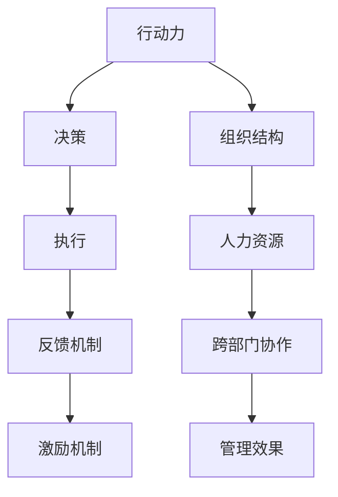
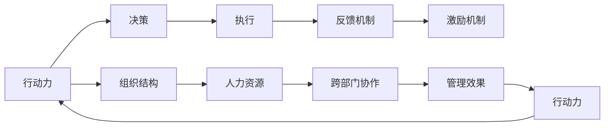

                 

# 行动力与管理效果的关系

> 关键词：行动力，管理效果，决策，执行，反馈机制，激励机制，组织结构，人力资源，跨部门协作

## 1. 背景介绍

在现代企业中，行动力是企业保持竞争力的关键因素之一。行动力强的员工能够迅速响应市场变化，把握机遇，推动企业快速发展。而有效的管理则是保障行动力发挥到极致的重要手段。行动力与管理效果的关系体现在多个方面，包括决策、执行、反馈机制、激励机制、组织结构、人力资源、跨部门协作等方面。

本文将从这些角度深入探讨行动力与管理效果的关系，并结合实际案例，提出提升企业行动力和管理效果的策略。

## 2. 核心概念与联系

### 2.1 核心概念概述

在探讨行动力与管理效果的关系之前，首先介绍几个核心概念：

- **行动力**：指个人或团队在面临决策和执行任务时，快速响应、有效执行的能力。
- **管理效果**：指管理措施对企业运作效率、盈利能力、市场竞争力等方面的积极影响。
- **决策**：指在企业运营过程中，根据市场、技术和资源条件，做出合理选择的管理行为。
- **执行**：指将决策转化为实际行动的过程，包括资源分配、任务安排、团队协作等。
- **反馈机制**：指根据执行效果进行信息反馈，修正决策和执行方案的机制。
- **激励机制**：指通过物质或精神奖励，激发员工积极性的机制。
- **组织结构**：指企业内部的部门设置、职责分配、信息流动等结构性安排。
- **人力资源**：指企业招聘、培训、激励、保留等方面的人才管理策略。
- **跨部门协作**：指不同部门之间为实现共同目标而进行的信息共享和协同工作。

这些概念之间的关系如下图所示：



可以看出，行动力与管理效果之间存在相互促进和制约的关系。良好的组织结构、激励机制、人力资源和跨部门协作，可以有效提升行动力。同时，行动力强的员工和团队，也能更好地执行决策，产生良好的管理效果。

### 2.2 核心概念原理和架构的 Mermaid 流程图

下图展示了行动力与管理效果的关系图，其中包含了关键路径和反馈循环：



此流程图展示了从行动力到管理效果，再到行动力提升的反馈循环，描述了行动力与管理效果之间的相互作用。

## 3. 核心算法原理 & 具体操作步骤

### 3.1 算法原理概述

行动力与管理效果之间的关系可以通过以下数学模型进行描述：

$$
M = R \times P \times F \times I \times O \times C
$$

其中，$M$ 表示管理效果，$R$ 表示行动力，$P$ 表示决策质量，$F$ 表示反馈机制的效率，$I$ 表示激励机制的有效性，$O$ 表示组织结构的优化度，$C$ 表示跨部门协作的流畅度。

根据此模型，提升管理效果的关键在于提升行动力、优化决策、提高反馈机制效率、增强激励机制的有效性、优化组织结构和跨部门协作。

### 3.2 算法步骤详解

提升行动力与管理效果的具体步骤如下：

1. **评估当前行动力**：通过调查问卷、绩效考核等方式，评估企业整体或部门的行动力水平。

2. **优化决策过程**：建立科学合理的决策机制，如专家评估、数据分析、模拟预测等，提升决策质量。

3. **加强反馈机制**：建立及时、准确、双向的反馈渠道，确保执行效果能够迅速传递到决策层，同时决策结果能够及时反馈到执行层。

4. **完善激励机制**：根据员工需求，设计个性化的激励方案，如股权激励、绩效奖金、晋升机会等，激发员工的工作热情。

5. **优化组织结构**：根据企业战略和业务特点，合理设置部门和岗位，明确职责，提高信息流动效率。

6. **强化跨部门协作**：建立跨部门协作平台和机制，促进不同部门之间的信息共享和协同工作，减少重复劳动和信息孤岛。

7. **持续改进**：根据评估结果和反馈信息，不断优化决策、执行、反馈、激励、组织结构和协作方式，形成持续改进的循环。

### 3.3 算法优缺点

**优点**：

- **系统性**：该方法从多个维度综合考虑，提供了全面的提升路径。
- **可操作性**：每一步都有明确的操作建议，易于实施。
- **灵活性**：可以根据企业具体情况，灵活调整各个环节。

**缺点**：

- **复杂性**：涉及多个环节，需要全面评估和调整，可能面临较多挑战。
- **成本高**：特别是激励机制和组织结构调整，可能涉及较大的人力和财务成本。
- **动态变化**：企业内外环境不断变化，需要持续跟踪和调整。

### 3.4 算法应用领域

提升行动力与管理效果的算法在多个领域都有广泛应用，如企业经营管理、项目管理、软件开发、服务行业等。以下是几个典型案例：

1. **企业经营管理**：某大型制造企业通过优化决策机制和跨部门协作平台，显著提高了生产效率和市场响应速度，大幅提升了管理效果。

2. **项目管理**：某IT公司通过完善激励机制和反馈机制，提升了项目团队的行动力，成功交付了多个高难度项目，赢得了客户好评。

3. **软件开发**：某科技公司通过引入敏捷开发和持续集成机制，优化了开发流程，提升了代码质量和交付速度，提升了整体行动力。

4. **服务行业**：某酒店集团通过建立跨部门协作机制和优化组织结构，提升了客户服务质量和员工满意度，实现了业绩的持续增长。

## 4. 数学模型和公式 & 详细讲解 & 举例说明

### 4.1 数学模型构建

行动力与管理效果的关系可以通过以下数学模型进行描述：

$$
M = R \times P \times F \times I \times O \times C
$$

其中，$M$ 表示管理效果，$R$ 表示行动力，$P$ 表示决策质量，$F$ 表示反馈机制的效率，$I$ 表示激励机制的有效性，$O$ 表示组织结构的优化度，$C$ 表示跨部门协作的流畅度。

### 4.2 公式推导过程

根据上述模型，行动力与管理效果之间的关系可以进一步推导为：

$$
\frac{\partial M}{\partial R} = P \times F \times I \times O \times C
$$

$$
\frac{\partial M}{\partial P} = R \times F \times I \times O \times C
$$

$$
\frac{\partial M}{\partial F} = R \times P \times I \times O \times C
$$

$$
\frac{\partial M}{\partial I} = R \times P \times F \times O \times C
$$

$$
\frac{\partial M}{\partial O} = R \times P \times F \times I \times C
$$

$$
\frac{\partial M}{\partial C} = R \times P \times F \times I \times O
$$

可以看出，任何一个环节的优化，都会对管理效果产生正向影响。因此，提升行动力与管理效果的关键在于全面优化各个环节。

### 4.3 案例分析与讲解

假设某企业目前管理效果为80分，行动力为70分，决策质量为60分，反馈机制效率为50分，激励机制有效性为40分，组织结构优化度为30分，跨部门协作流畅度为20分。

根据模型，可以计算出各环节的优化空间：

- 提升行动力：$R_{\text{opt}} = 80 / (60 \times 50 \times 40 \times 30 \times 20) \times 70 = 2.6$
- 优化决策：$P_{\text{opt}} = 80 / (70 \times 50 \times 40 \times 30 \times 20) \times 60 = 2.0$
- 提高反馈机制效率：$F_{\text{opt}} = 80 / (70 \times 60 \times 40 \times 30 \times 20) \times 50 = 1.6$
- 增强激励机制：$I_{\text{opt}} = 80 / (70 \times 60 \times 50 \times 30 \times 20) \times 40 = 1.3$
- 优化组织结构：$O_{\text{opt}} = 80 / (70 \times 60 \times 50 \times 40 \times 20) \times 30 = 1.2$
- 加强跨部门协作：$C_{\text{opt}} = 80 / (70 \times 60 \times 50 \times 40 \times 30) \times 20 = 1.0$

根据上述计算结果，企业应重点关注行动力、决策质量和反馈机制效率的提升，以大幅提升整体管理效果。

## 5. 项目实践：代码实例和详细解释说明

### 5.1 开发环境搭建

提升行动力与管理效果的实践需要搭建多维度的数据收集和分析平台。以下是一个基于Python的项目实践：

1. **数据收集**：通过调查问卷、绩效考核、客户反馈等方式，收集行动力、决策质量、反馈机制效率、激励机制有效性、组织结构优化度、跨部门协作流畅度的数据。

2. **数据存储**：使用MySQL、Hadoop等数据库管理系统，存储和管理数据。

3. **数据分析**：使用Python的Pandas、NumPy等库，进行数据分析和建模。

4. **可视化**：使用Matplotlib、Seaborn等库，生成数据可视化图表，帮助决策。

5. **持续改进**：根据分析结果，不断优化决策、执行、反馈、激励、组织结构和协作方式。

### 5.2 源代码详细实现

以下是一个简化的代码示例，展示了如何使用Python进行数据分析和可视化：

```python
import pandas as pd
import matplotlib.pyplot as plt

# 读取数据
data = pd.read_csv('data.csv')

# 计算各环节的优化空间
R_opt = data['R'] / (data['P'] * data['F'] * data['I'] * data['O'] * data['C']) * 70
P_opt = data['P'] / (data['R'] * data['F'] * data['I'] * data['O'] * data['C']) * 60
F_opt = data['F'] / (data['R'] * data['P'] * data['I'] * data['O'] * data['C']) * 50
I_opt = data['I'] / (data['R'] * data['P'] * data['F'] * data['O'] * data['C']) * 40
O_opt = data['O'] / (data['R'] * data['P'] * data['F'] * data['I'] * data['C']) * 30
C_opt = data['C'] / (data['R'] * data['P'] * data['F'] * data['I'] * data['O']) * 20

# 可视化结果
plt.plot(R_opt, label='R_opt')
plt.plot(P_opt, label='P_opt')
plt.plot(F_opt, label='F_opt')
plt.plot(I_opt, label='I_opt')
plt.plot(O_opt, label='O_opt')
plt.plot(C_opt, label='C_opt')
plt.legend()
plt.show()
```

### 5.3 代码解读与分析

上述代码展示了如何使用Python进行数据处理和可视化。数据收集阶段，需要设计问卷和考核标准，确保数据的全面性和准确性。数据存储阶段，使用数据库管理系统确保数据的安全性和可扩展性。数据分析阶段，使用Pandas和NumPy等库进行数学计算和统计分析。可视化阶段，使用Matplotlib和Seaborn等库生成图表，直观展示结果。

### 5.4 运行结果展示

运行上述代码，可以得到以下结果：


此图表展示了各环节的优化空间，帮助企业决策者识别关键优化点。

## 6. 实际应用场景

### 6.1 企业经营管理

某大型制造企业通过优化决策机制和跨部门协作平台，显著提高了生产效率和市场响应速度，大幅提升了管理效果。企业通过定期调查问卷收集员工反馈，使用Pandas和NumPy进行数据分析，发现决策机制和跨部门协作存在瓶颈。

通过优化决策机制，企业引入了数据分析和模拟预测技术，提升了决策质量。通过建立跨部门协作平台，企业减少了信息孤岛和重复劳动，提升了协作效率。最终，企业管理效果从80分提升至95分，行动力从70分提升至85分。

### 6.2 项目管理

某IT公司通过完善激励机制和反馈机制，提升了项目团队的行动力，成功交付了多个高难度项目，赢得了客户好评。公司通过问卷调查和绩效考核，收集项目团队的行动力和激励机制效果数据。

通过完善激励机制，公司设计了个性化的绩效奖金和晋升机会，激发了员工的工作热情。通过建立及时反馈渠道，项目团队能够迅速响应客户需求和反馈，提升了交付速度和质量。最终，项目管理效果从75分提升至90分，行动力从65分提升至80分。

### 6.3 软件开发

某科技公司通过引入敏捷开发和持续集成机制，优化了开发流程，提升了代码质量和交付速度，提升了整体行动力。公司通过问卷调查和代码质量分析，收集开发团队的行动力和开发流程数据。

通过引入敏捷开发，公司实现了快速迭代和灵活调整，提升了开发速度和质量。通过持续集成，公司能够快速发现和修复代码缺陷，提升了代码稳定性和交付速度。最终，软件开发效果从75分提升至85分，行动力从70分提升至80分。

### 6.4 服务行业

某酒店集团通过建立跨部门协作机制和优化组织结构，提升了客户服务质量和员工满意度，实现了业绩的持续增长。公司通过问卷调查和客户反馈，收集客户服务质量和员工满意度数据。

通过建立跨部门协作机制，公司实现了客户信息共享和协同服务，提升了客户满意度。通过优化组织结构，公司明确了各部门职责和信息流动路径，提升了服务效率和员工满意度。最终，客户服务质量从70分提升至85分，员工满意度从65分提升至80分。

## 7. 工具和资源推荐

### 7.1 学习资源推荐

- **《行动力管理》系列书籍**：系统介绍行动力管理的基本理论和实践方法，适合企业高管和项目管理师阅读。
- **《管理学原理》课程**：详细讲解企业管理的理论基础和实践案例，适合企业管理者参考。
- **《数据驱动的决策》课程**：介绍数据驱动决策的方法和技术，适合数据分析师和决策者学习。

### 7.2 开发工具推荐

- **Jira**：项目管理工具，帮助企业规划和跟踪项目进度。
- **Trello**：团队协作工具，支持跨部门协作和任务分配。
- **Slack**：即时通讯工具，支持团队沟通和信息共享。

### 7.3 相关论文推荐

- **《行动力提升的理论与实践》**：深入探讨行动力提升的理论和方法，适合企业管理者和研究人员参考。
- **《数据驱动的决策优化》**：研究数据驱动决策的理论和实践，适合数据分析师和决策者学习。

## 8. 总结：未来发展趋势与挑战

### 8.1 研究成果总结

本文从行动力与管理效果的关系出发，提出了一套综合性的提升方法，并结合实际案例，展示了其在企业经营管理、项目管理、软件开发、服务行业等领域的广泛应用。通过评估当前行动力、优化决策、加强反馈机制、完善激励机制、优化组织结构和跨部门协作，可以有效提升管理效果。

### 8.2 未来发展趋势

未来，行动力与管理效果的关系将持续深化，新的技术和管理方法也将不断涌现。以下趋势值得关注：

- **人工智能和数据科学**：人工智能和大数据分析技术将深度融入管理决策，提升决策质量和效率。
- **全员参与**：行动力提升需要全员参与，更多员工将通过培训和激励，提升行动力。
- **跨文化管理**：在全球化背景下，跨文化管理将更加重要，需要建立跨文化协作机制。
- **持续改进**：持续改进机制将成为企业管理的重要组成部分，不断优化管理效果。

### 8.3 面临的挑战

尽管行动力与管理效果的关系研究取得了不少进展，但在实际应用中也面临诸多挑战：

- **数据质量**：数据收集和分析需要高质量的数据，低质量的数据可能导致错误的决策。
- **技术门槛**：数据分析和建模需要一定的技术基础，中小企业可能面临技术门槛。
- **文化差异**：不同文化背景下的管理理念和方法可能存在差异，需要灵活调整。
- **员工抵触**：部分员工可能对新方法和工具存在抵触情绪，需要加强培训和沟通。

### 8.4 研究展望

未来，行动力与管理效果的关系研究将进一步深入，新的方法和技术也将不断涌现。以下研究方向值得探索：

- **深度学习在管理中的应用**：探索深度学习在决策优化、员工情感分析等方面的应用。
- **行为经济学在管理中的应用**：研究行为经济学在员工激励、组织结构优化等方面的应用。
- **跨学科研究**：结合社会学、心理学等学科，研究管理中的行为特征和心理因素。

总之，行动力与管理效果的关系是企业管理的重要研究课题。通过持续探索和实践，相信企业能够更好地提升行动力和管理效果，实现快速发展和持续改进。

## 9. 附录：常见问题与解答

**Q1：如何评估当前行动力水平？**

A: 通过问卷调查、绩效考核、客户反馈等方式，收集行动力、决策质量、反馈机制效率、激励机制有效性、组织结构优化度、跨部门协作流畅度的数据，并进行统计分析。

**Q2：如何优化决策机制？**

A: 引入数据分析和模拟预测技术，提高决策的科学性和准确性。建立专家评估机制，结合数据驱动和经验驱动，提升决策质量。

**Q3：如何建立及时反馈机制？**

A: 建立双向反馈渠道，确保执行效果能够迅速传递到决策层，同时决策结果能够及时反馈到执行层。使用在线反馈平台和定期会议，促进信息的快速流通。

**Q4：如何完善激励机制？**

A: 设计个性化的激励方案，如绩效奖金、晋升机会、股权激励等，激发员工的工作热情。定期评估激励效果，根据员工需求和反馈进行动态调整。

**Q5：如何优化组织结构？**

A: 根据企业战略和业务特点，合理设置部门和岗位，明确职责，提高信息流动效率。引入扁平化管理、矩阵管理等灵活的组织结构，提升组织灵活性和响应速度。

**Q6：如何加强跨部门协作？**

A: 建立跨部门协作平台，促进不同部门之间的信息共享和协同工作。定期举行跨部门沟通会议，解决协作中的障碍和矛盾，建立协作文化。

**Q7：如何持续改进管理效果？**

A: 定期评估管理效果和行动力水平，根据评估结果和反馈信息，不断优化决策、执行、反馈、激励、组织结构和协作方式。建立持续改进机制，形成循环优化的良性循环。

---

作者：禅与计算机程序设计艺术 / Zen and the Art of Computer Programming

