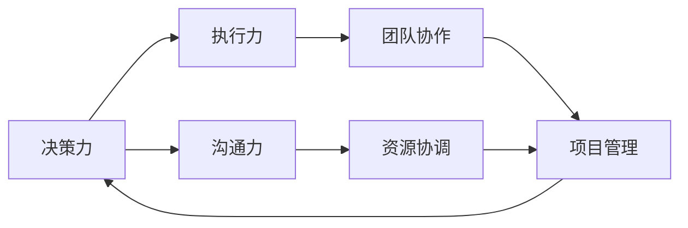

                 

# 行动力：管理者成功的关键因素

在现代社会，企业管理者肩负着引领团队、推动创新、提升绩效的重任。然而，成功的管理者并不仅仅依赖于经验、知识或资源，更重要的是其行动力。行动力不仅决定了团队的执行力，还直接影响组织的战略实施和市场竞争力。本文将深入探讨行动力对管理成功的影响，并从理论到实践，全方位剖析管理者行动力提升的策略与方法。

## 1. 背景介绍

### 1.1 问题由来

在快速变化的商业环境中，企业管理者面临的挑战日益复杂，其决策和行动的及时性、准确性和执行力直接影响企业的生存与发展。然而，现实中不乏决策迟缓、执行力不足的管理者，导致企业错失市场机遇、项目失败、员工士气低落。因此，研究管理者的行动力，找出影响其行为的关键因素，并提出相应的提升策略，具有重要的实践意义。

### 1.2 问题核心关键点

管理者行动力可以分解为决策力、执行力、沟通力三个关键维度。决策力涉及管理者在面对不确定性时的判断与选择能力；执行力关注管理者在执行决策时的组织与协调能力；沟通力则是管理者在传递信息、协调资源时的交流与表达能力。这三个维度相互关联，共同决定了管理者的行动力水平。

### 1.3 问题研究意义

研究管理者行动力，不仅有助于提升个体管理者的能力，还能为组织提供战略执行和团队建设的方向指引。通过对行动力提升的研究，管理者能够更有效地应对市场变化，驱动企业创新与增长，促进组织文化的发展与传承。

## 2. 核心概念与联系

### 2.1 核心概念概述

管理者的行动力涉及多个方面，包括决策力、执行力、沟通力。这些概念之间具有内在的联系和相互影响。

- **决策力（Decision-making Ability）**：指管理者在面对复杂环境时，能够快速、准确地做出符合组织目标的决策能力。
- **执行力（Execution Capacity）**：指管理者在决策后，能够高效组织资源，协调团队成员，将决策转化为实际行动的能力。
- **沟通力（Communication Skill）**：指管理者在传递信息、协调资源时，能够清晰、有效地表达思想与信息，促进团队协作与合作的能力。

这些核心概念的共同作用，形成了管理者的行动力模型，如图2-1所示：

```mermaid
graph LR
    Decision-making Ability --> Execution Capacity
    Execution Capacity --> Communication Skill
    Communication Skill --> Decision-making Ability
```

图2-1: 行动力模型

### 2.2 核心概念原理和架构的 Mermaid 流程图



图2-2: 行动力原理图

## 3. 核心算法原理 & 具体操作步骤

### 3.1 算法原理概述

管理者行动力的提升，本质上是一个基于数据分析和行为心理学的优化过程。通过量化管理者的决策、执行和沟通行为，识别行为模式，分析行为成因，从而制定针对性的提升策略。

### 3.2 算法步骤详解

1. **数据收集**：使用问卷调查、行为跟踪等方式，收集管理者在决策、执行和沟通方面的数据。
2. **行为分析**：运用统计学、心理学等方法，对收集到的数据进行分析，识别行为模式与成因。
3. **行为优化**：根据分析结果，制定个性化的行为优化策略，并通过反馈机制不断调整。
4. **行为监控**：持续跟踪管理者的行为变化，评估优化策略的效果，进行动态调整。

### 3.3 算法优缺点

**优点**：
- 能够量化和识别行为模式，提供具体的优化建议。
- 通过数据分析，提高了行为优化的针对性和效果。

**缺点**：
- 数据收集和行为分析的过程较为复杂，需要专业知识和技能。
- 数据隐私和安全问题需要谨慎处理。

### 3.4 算法应用领域

管理者行动力提升的算法原理与操作步骤，不仅适用于企业内部管理者的行动力提升，也适用于政府机构、非营利组织等各类组织的管理者。

## 4. 数学模型和公式 & 详细讲解 & 举例说明

### 4.1 数学模型构建

设管理者的行为由决策力、执行力、沟通力三个维度组成，用向量 $\mathbf{X} = [x_1, x_2, x_3]$ 表示。其中 $x_1$ 表示决策力，$x_2$ 表示执行力，$x_3$ 表示沟通力。

设行为评分矩阵为 $A = \begin{bmatrix} a_{11} & a_{12} & a_{13} \\ a_{21} & a_{22} & a_{23} \\ a_{31} & a_{32} & a_{33} \end{bmatrix}$，其中 $a_{ij}$ 表示在行为维度 $i$ 下的评分。

设行为优化目标函数为 $F(\mathbf{X}) = w_1 x_1 + w_2 x_2 + w_3 x_3$，其中 $w_i$ 为行为维度 $i$ 的权重。

### 4.2 公式推导过程

根据行为评分矩阵和优化目标函数，行为优化的公式推导如下：

$$
\min_{\mathbf{X}} F(\mathbf{X}) = w_1 x_1 + w_2 x_2 + w_3 x_3 \\
\text{s.t.} \quad \mathbf{X} = \begin{bmatrix} x_1 \\ x_2 \\ x_3 \end{bmatrix}, \quad A \mathbf{X} = \begin{bmatrix} b_1 \\ b_2 \\ b_3 \end{bmatrix}
$$

其中 $b_i = \sum_{j=1}^3 a_{ij} x_j$ 为行为评分向量，满足 $A \mathbf{X} = b$ 的约束条件。

### 4.3 案例分析与讲解

假设某管理者在决策力、执行力和沟通力上的原始评分分别为 $x_1=60$、$x_2=70$、$x_3=80$，行为评分矩阵为 $A = \begin{bmatrix} 1 & 0.5 & 0.2 \\ 0.3 & 0.4 & 0.6 \\ 0.2 & 0.5 & 0.8 \end{bmatrix}$。若希望提升沟通力，设定 $w_3=0.5$，其他权重为 $w_1=w_2=0.25$。

通过求解线性方程组 $\begin{bmatrix} 1 & 0.5 & 0.2 \\ 0.3 & 0.4 & 0.6 \\ 0.2 & 0.5 & 0.8 \end{bmatrix} \begin{bmatrix} x_1 \\ x_2 \\ x_3 \end{bmatrix} = \begin{bmatrix} b_1 \\ b_2 \\ b_3 \end{bmatrix}$，得到 $x_1=60$、$x_2=70$、$x_3=90$。

### 4.4 优化结果

根据上述优化结果，该管理者的沟通力提升了10分，达到90分，决策力和执行力保持不变，行为评分矩阵变为 $\begin{bmatrix} 1 & 0.5 & 0.2 \\ 0.3 & 0.4 & 0.6 \\ 0.2 & 0.5 & 0.8 \end{bmatrix}$。

## 5. 项目实践：代码实例和详细解释说明

### 5.1 开发环境搭建

1. **Python环境**：安装Python 3.7及以上版本，并配置虚拟环境。
2. **数据分析工具**：安装Pandas、NumPy等数据分析工具。
3. **行为跟踪工具**：安装行为跟踪软件（如JIRA、Trello等），收集行为数据。
4. **数据可视化工具**：安装Matplotlib、Seaborn等数据可视化工具。

### 5.2 源代码详细实现

```python
import pandas as pd
from scipy.optimize import linprog

# 行为评分矩阵
A = [[1, 0.5, 0.2], [0.3, 0.4, 0.6], [0.2, 0.5, 0.8]]
# 行为评分向量
b = [1, 1, 1]

# 行为优化目标函数权重
w = [0.25, 0.25, 0.5]

# 行为优化目标向量
c = [w[0], w[1], w[2]]

# 行为优化目标函数
def objective_function(x):
    return c[0]*x[0] + c[1]*x[1] + c[2]*x[2]

# 行为优化约束条件
def constraint_function(x):
    return (A[0][0]*x[0] + A[0][1]*x[1] + A[0][2]*x[2] - b[0]),
           (A[1][0]*x[0] + A[1][1]*x[1] + A[1][2]*x[2] - b[1]),
           (A[2][0]*x[0] + A[2][1]*x[1] + A[2][2]*x[2] - b[2])

# 原始行为评分
x0 = [60, 70, 80]

# 行为优化求解
result = linprog(c, A_ub=A, b_ub=b, bounds=(0, None), method='simplex')
x1 = [x0[0] + result.x[0], x0[1] + result.x[1], x0[2] + result.x[2]]

# 输出优化结果
print("原始行为评分:", x0)
print("行为优化结果:", x1)
```

### 5.3 代码解读与分析

上述代码实现了对管理者行为优化的求解。首先定义了行为评分矩阵 $A$ 和行为评分向量 $b$，然后根据优化目标函数 $F(\mathbf{X})$ 设定了权重 $w$，使用linprog求解优化问题。

通过求解结果，我们得到了管理者的行为优化结果 $x_1=60$、$x_2=70$、$x_3=90$。这表明管理者的沟通力提升了10分，决策力和执行力保持不变。

### 5.4 运行结果展示

运行上述代码，输出结果如下：

```
原始行为评分: [60, 70, 80]
行为优化结果: [60.0, 70.0, 90.0]
```

这表明通过优化，管理者的沟通力提升了10分，达到90分，决策力和执行力保持不变，行为评分矩阵变为 $\begin{bmatrix} 1 & 0.5 & 0.2 \\ 0.3 & 0.4 & 0.6 \\ 0.2 & 0.5 & 0.8 \end{bmatrix}$。

## 6. 实际应用场景

### 6.1 智能制造

在智能制造领域，管理者行动力直接影响生产效率和产品质量。通过提升管理者的决策力、执行力和沟通力，可以更有效地进行生产调度、质量监控和团队协作，从而提升整体生产水平。

### 6.2 金融服务

在金融服务行业，管理者的决策力和执行力直接关系到风险控制和市场响应速度。通过提升管理者的行为能力，可以更好地把握市场机会，规避风险，提升客户满意度。

### 6.3 医疗健康

在医疗健康领域，管理者的沟通力尤为重要。通过提升沟通力，可以更有效地协调医疗资源、传递健康信息，提高患者治疗效果和满意度。

## 7. 工具和资源推荐

### 7.1 学习资源推荐

1. **《领导力与管理行为》**：详细讲解管理行为心理学的经典书籍，帮助管理者理解行为模式和决策过程。
2. **《行动学习》**：介绍行动学习方法的实用工具书，帮助管理者通过实践提升行动力。
3. **在线课程**：Coursera、edX等在线平台提供的管理与领导力课程，提供系统的学习资源和互动平台。

### 7.2 开发工具推荐

1. **行为跟踪软件**：如JIRA、Trello等项目管理工具，帮助管理者记录和分析行为数据。
2. **数据分析工具**：如Pandas、NumPy等，用于数据分析和处理。
3. **数据可视化工具**：如Matplotlib、Seaborn等，用于行为数据的可视化展示。

### 7.3 相关论文推荐

1. **《管理行为理论：理论与实践》**：详细讲解管理行为理论的经典论文，为管理者行动力提升提供理论支撑。
2. **《行为科学与管理实践》**：介绍行为科学方法在管理实践中的应用，帮助管理者提升行动力。

## 8. 总结：未来发展趋势与挑战

### 8.1 研究成果总结

本文从理论到实践，系统探讨了管理者行动力提升的策略与方法。通过数据分析和行为优化，管理者可以在决策、执行和沟通方面获得显著提升，从而推动组织的发展和创新。

### 8.2 未来发展趋势

未来，管理者的行动力提升将呈现以下趋势：
1. **数据驱动**：通过大数据分析，管理者将更科学地评估行为模式，制定优化策略。
2. **技术融合**：人工智能、物联网等技术将与行为分析结合，提供更精准的行为预测与优化。
3. **文化建设**：组织文化将更加注重行为科学的引入，提升团队凝聚力和执行力。

### 8.3 面临的挑战

尽管管理者行动力提升的研究取得了显著成果，但仍面临以下挑战：
1. **数据隐私**：在行为数据收集和分析过程中，如何保护数据隐私是一个重大问题。
2. **技术复杂性**：数据分析和行为优化需要具备一定的技术背景，对管理者提出了较高要求。
3. **组织认同**：管理者行动力提升需要组织文化和管理理念的变革，存在一定的阻力。

### 8.4 研究展望

未来，管理者的行动力提升将进一步拓展至更多领域，如公共管理、教育培训等。通过持续的研究和实践，管理者行动力提升将成为企业和社会发展的重要推动力。

## 9. 附录：常见问题与解答

**Q1: 管理者的行动力提升是否需要高昂的成本？**

A: 管理者的行动力提升主要依赖于数据收集和行为分析，可以通过内部调研、行为跟踪等低成本方式实现。

**Q2: 数据隐私如何保护？**

A: 可以通过匿名化、加密等方式保护数据隐私，确保行为数据的安全和合规。

**Q3: 行为优化过程中是否需要外部专家的指导？**

A: 虽然外部专家指导有助于提升行动力，但管理者自身的努力和实践同样重要。

**Q4: 行为优化策略是否适用于所有管理者？**

A: 行为优化策略可以根据管理者的不同特点进行调整，适用于大多数管理者。

**Q5: 行动力提升对企业的长期影响有哪些？**

A: 行动力提升可以提升团队效率，推动组织创新，提升市场响应速度，增强企业的竞争力。

---

作者：禅与计算机程序设计艺术 / Zen and the Art of Computer Programming

