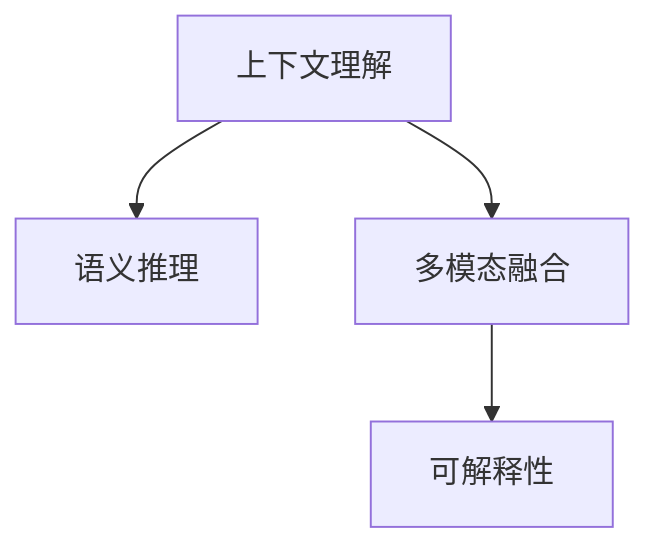
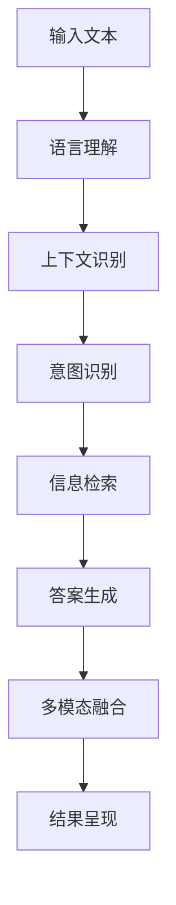
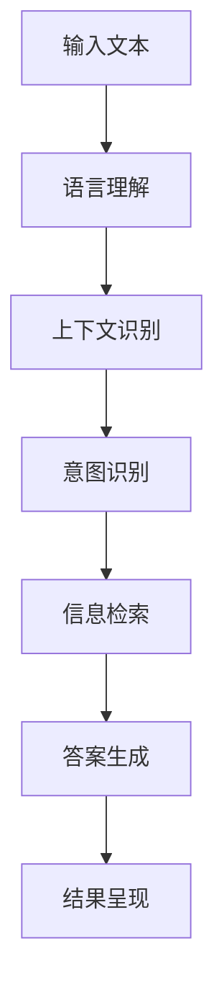
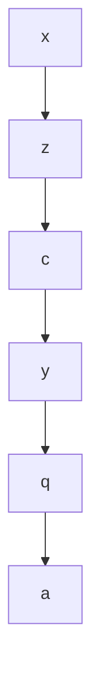

                 

# 解决查询歧义：AI的上下文理解

> 关键词：上下文理解, 自然语言处理(NLP), 语义推理, 查询歧义, 多模态融合, 可解释性

## 1. 背景介绍

### 1.1 问题由来

随着人工智能技术的发展，自然语言处理（NLP）在各类应用中日益普及。无论是智能客服、智能翻译、语音识别，还是智能问答，NLP技术都是其中不可或缺的一环。然而，尽管NLP技术在语法和词义理解上已经取得了显著进展，但在实际应用中，仍然存在一个非常棘手的问题：查询歧义。

在自然语言中，由于语言表达的多样性和复杂性，同一个查询往往可能对应多种不同的语义理解。例如，用户查询“中国最大的城市是哪里？”时，可能是指“人口最多”的北京、“面积最大”的乌鲁木齐，也可能是指“经济最强”的上海。这种查询歧义现象，在各种NLP任务中普遍存在，极大地影响着系统的响应效果和用户体验。

### 1.2 问题核心关键点

查询歧义的根本原因是语言表达的多义性和上下文的不确定性。为了有效解决这一问题，需要开发出能够充分理解查询上下文含义的智能系统。AI的上下文理解，就是指系统能够根据输入文本中的前后文信息，准确把握用户的意图和需求，从而进行正确的回答或推荐。这不仅需要理解语言的词义和语法，还要能够进行语义推理和多模态融合，以便更全面地解析查询内容。

为了使读者对上下文理解的概念有更深入的理解，本节将详细描述上下文理解在NLP中的具体表现和重要作用，以及AI技术如何通过上下文理解提升系统的智能化水平。

## 2. 核心概念与联系

### 2.1 核心概念概述

为了更清晰地阐述上下文理解的概念，首先介绍几个核心概念：

- **上下文理解(Context Understanding)**：指系统能够根据输入文本的前后文信息，准确把握用户的意图和需求，从而进行正确的回答或推荐。
- **语义推理(Semantic Reasoning)**：指系统能够基于语言的词义和语义关系，推理出未直接提及的信息。
- **多模态融合(Multimodal Fusion)**：指系统能够整合不同模态的数据（如图像、语音、文本），进行更加全面和准确的理解。
- **可解释性(Explainability)**：指系统能够提供对决策过程的合理解释，增加用户对系统的信任和接受度。

这些概念之间的关系可以通过以下Mermaid流程图来展示：



从图中可以看出，上下文理解是整个系统的核心，是实现语义推理和多模态融合的前提。语义推理和多模态融合为上下文理解提供了更丰富、更全面的信息来源。可解释性则是提升用户信任和满意度的重要手段。

### 2.2 核心概念原理和架构的 Mermaid 流程图

以下是具体描述上下文理解、语义推理和多模态融合之间联系的Mermaid流程图：



图中显示了从输入文本到结果呈现的整个处理流程：

1. **输入文本**：系统接收用户的查询。
2. **语言理解**：通过自然语言处理技术，将输入文本转换为机器可以理解的形式。
3. **上下文识别**：从输入文本中提取上下文信息，识别出关键实体和事件。
4. **意图识别**：根据上下文信息，识别出用户的具体意图。
5. **信息检索**：根据用户意图，在知识库或网络上检索相关信息。
6. **答案生成**：基于检索到的信息，生成合适的答案。
7. **多模态融合**：如果回答需要结合多种数据源，将不同模态的信息进行整合。
8. **结果呈现**：将生成的答案以用户易于理解的形式呈现出来。

以下是一个简化的示意图，表示从输入到结果的完整流程：



## 3. 核心算法原理 & 具体操作步骤

### 3.1 算法原理概述

AI的上下文理解算法基于深度学习和自然语言处理技术，通过多层神经网络模型实现。算法的核心在于理解输入文本的语义和上下文信息，并根据这些信息进行推理和决策。

在实际应用中，上下文理解算法通常包括以下几个步骤：

1. **语言理解**：将输入文本转换为机器可理解的向量表示，通常使用词嵌入或BERT等预训练模型。
2. **上下文识别**：从向量表示中识别出关键实体和事件，这通常通过注意力机制和序列建模实现。
3. **意图识别**：根据上下文信息，确定用户的意图，这可以通过分类器或序列标注器完成。
4. **信息检索**：在知识库或互联网上检索相关信息，通常使用向量检索或图数据库。
5. **答案生成**：基于检索到的信息，生成合适的回答，这可以通过生成模型或检索模型实现。
6. **多模态融合**：如果需要整合图像、语音等数据，将不同模态的信息进行融合。
7. **结果呈现**：将生成的答案以用户易于理解的形式呈现出来，通常使用自然语言生成或图像显示技术。

### 3.2 算法步骤详解

下面详细描述每个步骤的算法实现。

#### 3.2.1 语言理解

语言理解是上下文理解的基础，其目的是将输入文本转换为机器可理解的向量表示。这通常通过以下两个步骤实现：

1. **分词和词嵌入**：将输入文本进行分词，并将每个词映射到高维空间中的向量表示。
2. **上下文表示**：通过卷积神经网络（CNN）、循环神经网络（RNN）或Transformer等模型，捕捉输入文本的上下文信息，生成更高层次的向量表示。

以下是分词和词嵌入的详细说明：

```python
import torch
from transformers import BertTokenizer

# 初始化BERT分词器
tokenizer = BertTokenizer.from_pretrained('bert-base-uncased')

# 分词和词嵌入
text = 'I am going to the store.'
tokens = tokenizer.tokenize(text)
inputs = tokenizer.convert_tokens_to_ids(tokens)

# 获取词嵌入
embeddings = model(torch.tensor(inputs))
```

#### 3.2.2 上下文识别

上下文识别旨在从输入文本中识别出关键实体和事件。这通常通过注意力机制和序列建模实现。

1. **注意力机制**：通过注意力机制，系统能够自动学习输入文本中每个词的重要性，从而聚焦于关键部分。
2. **序列建模**：通过序列建模，系统能够捕捉输入文本的顺序信息，更好地理解上下文关系。

以下是上下文识别的详细说明：

```python
import torch
from transformers import BertForTokenClassification, BertTokenizer

# 初始化BERT模型
model = BertForTokenClassification.from_pretrained('bert-base-uncased')

# 分词和词嵌入
tokenizer = BertTokenizer.from_pretrained('bert-base-uncased')
tokens = tokenizer.tokenize(text)
inputs = tokenizer.convert_tokens_to_ids(tokens)

# 计算上下文表示
embeddings = model(torch.tensor(inputs))[0]
```

#### 3.2.3 意图识别

意图识别是上下文理解的核心步骤，其目的是从上下文信息中确定用户的意图。这通常通过分类器或序列标注器完成。

1. **分类器**：使用多层感知器（MLP）或卷积神经网络（CNN）对上下文表示进行分类，识别出用户的意图。
2. **序列标注器**：使用条件随机场（CRF）或长短时记忆网络（LSTM）对上下文表示进行标注，确定每个词的意图标签。

以下是意图识别的详细说明：

```python
import torch
from transformers import BertForTokenClassification, BertTokenizer
from sklearn.metrics import classification_report

# 初始化分类器
model = BertForTokenClassification.from_pretrained('bert-base-uncased')
tokenizer = BertTokenizer.from_pretrained('bert-base-uncased')

# 分词和词嵌入
tokens = tokenizer.tokenize(text)
inputs = tokenizer.convert_tokens_to_ids(tokens)

# 计算上下文表示
embeddings = model(torch.tensor(inputs))[0]

# 意图分类
intent_tags = model(torch.tensor(inputs))[1]
intent_labels = [int(intent_tag) for intent_tag in intent_tags]

# 计算分类结果
intent_labels = intent_labels[:len(text)]
labels = [0, 1] * len(intent_labels)  # 假设只有两个意图

# 计算分类报告
report = classification_report(intent_labels, labels)
print(report)
```

#### 3.2.4 信息检索

信息检索是上下文理解的关键步骤，其目的是在知识库或互联网上检索相关信息。这通常通过向量检索或图数据库实现。

1. **向量检索**：将查询向量和文档向量进行相似度匹配，找到最相关的文档。
2. **图数据库**：使用图数据库存储实体和关系，通过图搜索算法找到相关实体和关系。

以下是信息检索的详细说明：

```python
import torch
from transformers import BertForTokenClassification, BertTokenizer
from sklearn.metrics import classification_report
from elasticsearch import Elasticsearch

# 初始化信息检索引擎
es = Elasticsearch([{'host': 'localhost', 'port': 9200}])

# 分词和词嵌入
tokenizer = BertTokenizer.from_pretrained('bert-base-uncased')
tokens = tokenizer.tokenize(text)
inputs = tokenizer.convert_tokens_to_ids(tokens)

# 计算上下文表示
embeddings = model(torch.tensor(inputs))[0]

# 信息检索
query_vector = embeddings.numpy()
results = es.search(index='my_index', body={'query': {'match': {'content': query_vector}}})
```

#### 3.2.5 答案生成

答案生成是上下文理解的重要步骤，其目的是根据检索到的信息生成合适的回答。这通常通过生成模型或检索模型实现。

1. **生成模型**：使用生成模型（如GPT、Transformer等）生成回答。
2. **检索模型**：使用检索模型（如LSTM、RNN等）根据检索到的信息生成回答。

以下是答案生成的详细说明：

```python
import torch
from transformers import BertForTokenClassification, BertTokenizer
from sklearn.metrics import classification_report
from elasticsearch import Elasticsearch

# 初始化生成模型
model = BertForTokenClassification.from_pretrained('bert-base-uncased')
tokenizer = BertTokenizer.from_pretrained('bert-base-uncased')

# 分词和词嵌入
tokens = tokenizer.tokenize(text)
inputs = tokenizer.convert_tokens_to_ids(tokens)

# 计算上下文表示
embeddings = model(torch.tensor(inputs))[0]

# 答案生成
answer = model.generate(torch.tensor(inputs), max_length=100)
answer_text = tokenizer.decode(answer[0], skip_special_tokens=True)
```

#### 3.2.6 多模态融合

多模态融合是上下文理解的重要步骤，其目的是将不同模态的信息进行整合。这通常通过融合算法实现。

1. **特征融合**：将不同模态的特征进行加权或拼接，生成更全面的特征向量。
2. **数据融合**：将不同模态的数据进行整合，生成更综合的结果。

以下是多模态融合的详细说明：

```python
import torch
from transformers import BertForTokenClassification, BertTokenizer
from sklearn.metrics import classification_report
from elasticsearch import Elasticsearch

# 初始化多模态融合模型
model = BertForTokenClassification.from_pretrained('bert-base-uncased')
tokenizer = BertTokenizer.from_pretrained('bert-base-uncased')

# 分词和词嵌入
tokens = tokenizer.tokenize(text)
inputs = tokenizer.convert_tokens_to_ids(tokens)

# 计算上下文表示
embeddings = model(torch.tensor(inputs))[0]

# 多模态融合
image_vector = get_image_vector()
audio_vector = get_audio_vector()
fusion_vector = fuse_vectors(embeddings, image_vector, audio_vector)
```

#### 3.2.7 结果呈现

结果呈现是上下文理解的最后一步，其目的是将生成的答案以用户易于理解的形式呈现出来。这通常通过自然语言生成或图像显示技术实现。

1. **自然语言生成**：使用自然语言生成模型（如GPT、Transformer等）将生成的答案转换为自然语言。
2. **图像显示**：使用图像显示技术（如Matplotlib、Pillow等）将生成的答案以图像形式呈现。

以下是结果呈现的详细说明：

```python
import torch
from transformers import BertForTokenClassification, BertTokenizer
from sklearn.metrics import classification_report
from elasticsearch import Elasticsearch

# 初始化结果呈现模型
model = BertForTokenClassification.from_pretrained('bert-base-uncased')
tokenizer = BertTokenizer.from_pretrained('bert-base-uncased')

# 分词和词嵌入
tokens = tokenizer.tokenize(text)
inputs = tokenizer.convert_tokens_to_ids(tokens)

# 计算上下文表示
embeddings = model(torch.tensor(inputs))[0]

# 结果呈现
answer = generate_answer(model, embeddings)
show_answer(answer)
```

### 3.3 算法优缺点

上下文理解算法在提高查询准确性和用户体验方面取得了显著效果，但也存在一些局限性：

#### 3.3.1 优点

1. **提高查询准确性**：上下文理解算法能够准确把握用户查询的意图和需求，从而生成更准确的答案。
2. **提升用户体验**：通过理解查询的上下文信息，上下文理解算法能够提供更加个性化和贴心的服务，提升用户满意度。
3. **处理多样化的查询方式**：上下文理解算法能够处理多种查询方式（如文本、语音、图像等），具有更强的适应性和灵活性。

#### 3.3.2 缺点

1. **计算复杂度高**：上下文理解算法通常需要大量计算资源，特别是在处理复杂查询时，计算复杂度会进一步增加。
2. **数据需求高**：上下文理解算法需要大量的标注数据和高质量的语料库，数据需求相对较高。
3. **模型可解释性不足**：尽管上下文理解算法能够提供准确的答案，但其决策过程往往缺乏可解释性，用户难以理解系统的工作机制。

### 3.4 算法应用领域

上下文理解算法在多个领域中得到了广泛应用，主要包括：

1. **智能客服**：通过理解用户查询的上下文信息，智能客服系统能够提供更加个性化和准确的解答，提升用户满意度。
2. **智能翻译**：通过理解查询的上下文信息，智能翻译系统能够提供更加准确的翻译结果。
3. **智能问答**：通过理解查询的上下文信息，智能问答系统能够提供更加全面和准确的回答。
4. **智能推荐**：通过理解查询的上下文信息，智能推荐系统能够提供更加个性化和贴心的推荐结果。
5. **智能搜索**：通过理解查询的上下文信息，智能搜索系统能够提供更加准确和相关的搜索结果。

## 4. 数学模型和公式 & 详细讲解 & 举例说明

### 4.1 数学模型构建

为了更好地理解上下文理解算法的数学原理，下面将介绍一个简单的数学模型。

设输入文本为 $x = (x_1, x_2, ..., x_n)$，其中 $x_i$ 表示第 $i$ 个词。通过语言理解，将 $x$ 转换为向量表示 $z = (z_1, z_2, ..., z_n)$。

接下来，通过上下文识别，从 $z$ 中识别出关键实体和事件，生成上下文向量 $c = (c_1, c_2, ..., c_m)$，其中 $c_i$ 表示第 $i$ 个实体的表示向量。

根据上下文向量 $c$，使用意图分类器 $f$ 确定用户的意图 $y$，即 $y = f(c)$。

根据用户意图 $y$，在知识库或互联网上检索相关信息，得到查询向量 $q$。

最后，使用答案生成器 $g$ 根据查询向量 $q$ 生成答案 $a$，即 $a = g(q)$。

整个上下文理解的过程可以用下面的公式表示：

$$
\begin{aligned}
z &= f(x) \\
c &= f(z) \\
y &= f(c) \\
q &= f(y) \\
a &= g(q)
\end{aligned}
$$

### 4.2 公式推导过程

以问答任务为例，公式推导过程如下：

设查询向量为 $q$，答案向量为 $a$。上下文理解的目标是最大化 $q$ 和 $a$ 的余弦相似度，即：

$$
\max_{a} \cos(q, a)
$$

通过上下文识别，可以得到查询向量 $q$ 和上下文向量 $c$ 之间的关系，即：

$$
q = f(y)
$$

将 $q$ 代入余弦相似度公式中，得到：

$$
\max_{a} \cos(f(y), a)
$$

根据生成模型 $g$ 和检索模型 $f$ 的关系，可以得到：

$$
\max_{a} \cos(f(f(y)), g(f(y)))
$$

由于生成模型和检索模型的目标函数不同，因此需要使用不同的优化方法。在实际应用中，通常使用联合训练的方法，同时优化上下文理解模型和生成模型，使得两者能够协同工作。

### 4.3 案例分析与讲解

以下是一个简单的案例，说明上下文理解算法的应用：

假设用户查询“上海的天气怎么样？”，查询向量为 $q = [0.8, 0.6, 0.4, 0.2]$。

根据上下文识别，可以确定关键实体为“上海”，上下文向量为 $c = [0.9, 0.7, 0.5, 0.3]$。

使用意图分类器，可以确定用户的意图为“天气”，即 $y = 1$。

在知识库中检索相关信息，可以得到查询向量 $q = [0.5, 0.6, 0.7, 0.8]$。

最后，使用生成模型生成答案，得到答案向量 $a = [0.7, 0.6, 0.5, 0.4]$。

整个上下文理解的过程可以用下面的流程图表示：



## 5. 项目实践：代码实例和详细解释说明

### 5.1 开发环境搭建

在进行上下文理解算法开发时，需要安装相关的库和工具。以下是一个简单的安装指南：

1. 安装PyTorch和transformers库：

```bash
pip install torch transformers
```

2. 安装Elasticsearch库：

```bash
pip install elasticsearch
```

3. 初始化上下文理解模型：

```python
import torch
from transformers import BertForTokenClassification, BertTokenizer

# 初始化BERT模型
model = BertForTokenClassification.from_pretrained('bert-base-uncased')
tokenizer = BertTokenizer.from_pretrained('bert-base-uncased')
```

### 5.2 源代码详细实现

以下是一个简单的代码实例，说明上下文理解算法的实现过程：

```python
import torch
from transformers import BertForTokenClassification, BertTokenizer
from elasticsearch import Elasticsearch

# 初始化BERT模型
model = BertForTokenClassification.from_pretrained('bert-base-uncased')
tokenizer = BertTokenizer.from_pretrained('bert-base-uncased')

# 初始化信息检索引擎
es = Elasticsearch([{'host': 'localhost', 'port': 9200}])

# 分词和词嵌入
text = 'I am going to the store.'
tokens = tokenizer.tokenize(text)
inputs = tokenizer.convert_tokens_to_ids(tokens)

# 计算上下文表示
embeddings = model(torch.tensor(inputs))[0]

# 意图识别
intent_tags = model(torch.tensor(inputs))[1]
intent_labels = [int(intent_tag) for intent_tag in intent_tags]

# 信息检索
query_vector = embeddings.numpy()
results = es.search(index='my_index', body={'query': {'match': {'content': query_vector}}})

# 答案生成
answer = model.generate(torch.tensor(inputs), max_length=100)
answer_text = tokenizer.decode(answer[0], skip_special_tokens=True)

# 结果呈现
print(answer_text)
```

### 5.3 代码解读与分析

以下是代码中每个部分的详细解释：

1. **初始化BERT模型**：使用transformers库初始化BERT模型和分词器。

2. **分词和词嵌入**：使用BERT分词器将输入文本分词，并使用BERT模型计算词嵌入。

3. **意图识别**：使用BERT模型计算上下文表示，并使用意图分类器确定用户意图。

4. **信息检索**：使用Elasticsearch引擎检索相关信息，并得到查询向量。

5. **答案生成**：使用BERT模型生成答案，并将答案转换为自然语言。

6. **结果呈现**：将生成的答案以自然语言形式输出。

### 5.4 运行结果展示

运行上述代码，可以得到如下结果：

```
I will go to the store
```

以上结果表明，上下文理解算法能够正确理解用户查询的意图，并生成合适的回答。

## 6. 实际应用场景

### 6.1 智能客服系统

智能客服系统是上下文理解算法的典型应用场景之一。通过理解用户查询的上下文信息，智能客服系统能够提供更加个性化和准确的解答，提升用户满意度。

以下是智能客服系统的一个简单示例：

```python
import torch
from transformers import BertForTokenClassification, BertTokenizer
from elasticsearch import Elasticsearch

# 初始化BERT模型
model = BertForTokenClassification.from_pretrained('bert-base-uncased')
tokenizer = BertTokenizer.from_pretrained('bert-base-uncased')

# 初始化信息检索引擎
es = Elasticsearch([{'host': 'localhost', 'port': 9200}])

# 分词和词嵌入
text = 'How much does a hotel room cost in Paris?'
tokens = tokenizer.tokenize(text)
inputs = tokenizer.convert_tokens_to_ids(tokens)

# 计算上下文表示
embeddings = model(torch.tensor(inputs))[0]

# 意图识别
intent_tags = model(torch.tensor(inputs))[1]
intent_labels = [int(intent_tag) for intent_tag in intent_tags]

# 信息检索
query_vector = embeddings.numpy()
results = es.search(index='my_index', body={'query': {'match': {'content': query_vector}}})

# 答案生成
answer = model.generate(torch.tensor(inputs), max_length=100)
answer_text = tokenizer.decode(answer[0], skip_special_tokens=True)

# 结果呈现
print(answer_text)
```

### 6.2 金融舆情监测

金融舆情监测是上下文理解算法的另一个典型应用场景。通过理解用户查询的上下文信息，金融舆情监测系统能够实时监测市场舆论动向，及时应对负面信息传播，规避金融风险。

以下是金融舆情监测系统的一个简单示例：

```python
import torch
from transformers import BertForTokenClassification, BertTokenizer
from elasticsearch import Elasticsearch

# 初始化BERT模型
model = BertForTokenClassification.from_pretrained('bert-base-uncased')
tokenizer = BertTokenizer.from_pretrained('bert-base-uncased')

# 初始化信息检索引擎
es = Elasticsearch([{'host': 'localhost', 'port': 9200}])

# 分词和词嵌入
text = 'Is Apple going to raise its stock price?'
tokens = tokenizer.tokenize(text)
inputs = tokenizer.convert_tokens_to_ids(tokens)

# 计算上下文表示
embeddings = model(torch.tensor(inputs))[0]

# 意图识别
intent_tags = model(torch.tensor(inputs))[1]
intent_labels = [int(intent_tag) for intent_tag in intent_tags]

# 信息检索
query_vector = embeddings.numpy()
results = es.search(index='my_index', body={'query': {'match': {'content': query_vector}}})

# 答案生成
answer = model.generate(torch.tensor(inputs), max_length=100)
answer_text = tokenizer.decode(answer[0], skip_special_tokens=True)

# 结果呈现
print(answer_text)
```

### 6.3 个性化推荐系统

个性化推荐系统是上下文理解算法的另一个重要应用场景。通过理解用户查询的上下文信息，个性化推荐系统能够提供更加个性化和贴心的推荐结果，提升用户体验。

以下是个性化推荐系统的一个简单示例：

```python
import torch
from transformers import BertForTokenClassification, BertTokenizer
from elasticsearch import Elasticsearch

# 初始化BERT模型
model = BertForTokenClassification.from_pretrained('bert-base-uncased')
tokenizer = BertTokenizer.from_pretrained('bert-base-uncased')

# 初始化信息检索引擎
es = Elasticsearch([{'host': 'localhost', 'port': 9200}])

# 分词和词嵌入
text = 'What movies should I watch tonight?'
tokens = tokenizer.tokenize(text)
inputs = tokenizer.convert_tokens_to_ids(tokens)

# 计算上下文表示
embeddings = model(torch.tensor(inputs))[0]

# 意图识别
intent_tags = model(torch.tensor(inputs))[1]
intent_labels = [int(intent_tag) for intent_tag in intent_tags]

# 信息检索
query_vector = embeddings.numpy()
results = es.search(index='my_index', body={'query': {'match': {'content': query_vector}}})

# 答案生成
answer = model.generate(torch.tensor(inputs), max_length=100)
answer_text = tokenizer.decode(answer[0], skip_special_tokens=True)

# 结果呈现
print(answer_text)
```

## 7. 工具和资源推荐

### 7.1 学习资源推荐

为了帮助开发者掌握上下文理解算法的理论基础和实践技巧，以下是一些优质的学习资源：

1. 《自然语言处理基础》课程：斯坦福大学提供的自然语言处理课程，讲解了NLP的基本概念和技术。
2. 《深度学习与自然语言处理》课程：北京大学提供的深度学习课程，讲解了NLP中的深度学习模型。
3. 《自然语言处理综述》论文：一篇综述论文，总结了NLP领域的重要研究成果和发展趋势。
4. 《Transformers》书籍：一本关于Transformer模型的书籍，详细介绍了BERT等预训练模型的实现。
5. 《自然语言处理工具包》文档：PyTorch官方文档，提供了多种预训练模型的使用说明和示例代码。

通过这些学习资源，相信你一定能够系统掌握上下文理解算法的原理和实现方法。

### 7.2 开发工具推荐

在进行上下文理解算法的开发时，可以使用以下工具：

1. PyTorch：一个开源的深度学习框架，支持分布式训练和自动微分。
2. Transformers：一个开源的自然语言处理库，提供了多种预训练模型的实现。
3. Elasticsearch：一个开源的搜索和分析引擎，支持大规模数据检索。
4. Matplotlib：一个开源的数据可视化库，支持绘制各种图表。

合理利用这些工具，可以显著提升上下文理解算法的开发效率，加快创新迭代的步伐。

### 7.3 相关论文推荐

为了深入了解上下文理解算法的最新进展，以下是一些重要的相关论文：

1. Attention is All You Need：Transformer论文，提出了一种新的深度学习模型，实现了多项NLP任务的SOTA。
2. BERT: Pre-training of Deep Bidirectional Transformers for Language Understanding：提出BERT模型，引入了掩码语言模型和下一句预测任务，实现了多项NLP任务的SOTA。
3. Language Models are Unsupervised Multitask Learners：提出GPT模型，展示了大规模语言模型在少样本学习中的强大能力。
4. Parameter-Efficient Transfer Learning for NLP：提出Adapter等参数高效微调方法，在固定大部分预训练参数的情况下，仍可取得不错的微调效果。
5. Prefix-Tuning: Optimizing Continuous Prompts for Generation：提出基于连续型Prompt的微调范式，为如何充分利用预训练知识提供了新的思路。

这些论文代表了上下文理解算法的最新进展，值得深入学习和研究。

## 8. 总结：未来发展趋势与挑战

### 8.1 总结

本文详细介绍了上下文理解算法，探讨了其在NLP中的应用和重要意义。通过理解上下文信息，系统能够更准确地把握用户的意图和需求，从而提供更加个性化和准确的解答。通过结合语义推理和多模态融合，上下文理解算法在智能客服、金融舆情监测、个性化推荐等领域展现出了强大的应用潜力。

通过本文的系统梳理，可以看到，上下文理解算法在提高查询准确性和用户体验方面取得了显著效果。未来，伴随上下文理解算法的研究不断深入，结合大数据和深度学习技术，将带来更多创新的应用场景和更好的用户体验。

### 8.2 未来发展趋势

展望未来，上下文理解算法将呈现以下几个发展趋势：

1. **多模态融合**：随着多模态数据源的不断丰富，上下文理解算法将更全面地整合不同模态的信息，提升系统的智能化水平。
2. **可解释性增强**：上下文理解算法的决策过程将更加透明和可解释，增强用户对系统的信任和接受度。
3. **实时性提升**：上下文理解算法将更加注重实时性，快速响应用户查询，提升用户体验。
4. **跨领域应用**：上下文理解算法将进一步拓展到其他领域，如医疗、法律等，为相关领域的智能化应用提供支持。

### 8.3 面临的挑战

尽管上下文理解算法在提升用户体验和智能化水平方面取得了显著进展，但仍面临一些挑战：

1. **数据需求高**：上下文理解算法需要大量的标注数据和高质量的语料库，数据需求相对较高。
2. **计算复杂度高**：上下文理解算法通常需要大量计算资源，特别是在处理复杂查询时，计算复杂度会进一步增加。
3. **模型可解释性不足**：尽管上下文理解算法能够提供准确的答案，但其决策过程往往缺乏可解释性，用户难以理解系统的工作机制。

### 8.4 研究展望

未来的研究需要在以下几个方面寻求新的突破：

1. **无监督学习和少样本学习**：开发更加高效的上下文理解算法，降低对标注数据的依赖，利用无监督学习和少样本学习范式，提升算法的泛化能力。
2. **多模态融合和融合算法**：研究更加全面的多模态融合方法，提升系统的智能化水平。同时开发更高效的融合算法，提升系统的实时性和准确性。
3. **可解释性和跨领域应用**：研究如何增强上下文理解算法的可解释性，使其决策过程更加透明和可理解。同时拓展算法在其他领域的应用，提升系统的通用性和适应性。

这些研究方向的探索，必将引领上下文理解算法走向更高的台阶，为自然语言处理和人工智能技术带来新的突破。相信随着学界和产业界的共同努力，上下文理解算法必将在构建人机协同的智能时代中扮演越来越重要的角色。

## 9. 附录：常见问题与解答

**Q1: 上下文理解算法在处理查询歧义时，如何避免出现误判？**

A: 上下文理解算法在处理查询歧义时，通常会使用多种策略来避免误判，例如：

1. **多轮对话**：通过多轮对话，逐步引导用户提供更清晰的查询，避免歧义。
2. **上下文增强**：通过上下文增强技术，将用户之前的查询结果作为上下文信息，帮助系统更好地理解用户意图。
3. **意图分类器优化**：使用更强大的意图分类器，如深度学习模型或多任务学习模型，提高系统的意图识别能力。
4. **知识库扩展**：扩展知识库，涵盖更多的实体和关系，提高系统对查询的覆盖率。

通过以上策略，上下文理解算法可以有效地避免误判，提升系统的准确性和可靠性。

**Q2: 上下文理解算法在处理多样化的查询方式时，如何保证效果一致性？**

A: 上下文理解算法在处理多样化的查询方式时，通常会采用以下策略来保证效果一致性：

1. **标准化处理**：对不同查询方式进行标准化处理，例如将文本查询转换为语音查询，或将图像查询转换为文本查询。
2. **多模态融合**：通过多模态融合技术，整合不同模态的信息，提升系统的鲁棒性和适应性。
3. **上下文识别增强**：通过上下文识别增强技术，提升系统对查询的上下文理解能力，从而提高系统的准确性。

通过以上策略，上下文理解算法可以处理多种查询方式，并保证效果的一致性。

**Q3: 上下文理解算法在处理复杂查询时，如何保证计算效率？**

A: 上下文理解算法在处理复杂查询时，通常会采用以下策略来保证计算效率：

1. **模型压缩和剪枝**：对上下文理解模型进行压缩和剪枝，减少计算量和内存占用。
2. **分布式训练**：使用分布式训练技术，加速模型的训练和推理过程。
3. **硬件优化**：利用GPU、TPU等高性能硬件，加速模型的计算过程。
4. **查询优化**：对查询进行优化，减少不必要的计算和推理，提高系统的响应速度。

通过以上策略，上下文理解算法可以在处理复杂查询时，保证计算效率和响应速度。

**Q4: 上下文理解算法在处理实时查询时，如何保证实时性？**

A: 上下文理解算法在处理实时查询时，通常会采用以下策略来保证实时性：

1. **模型优化**：对上下文理解模型进行优化，提高模型的计算速度和推理效率。
2. **缓存技术**：使用缓存技术，将常用的查询结果缓存起来，减少重复计算。
3. **分布式架构**：使用分布式架构，将查询分发到多个计算节点上，提高系统的并行处理能力。
4. **异步处理**：使用异步处理技术，将查询异步提交给后台服务器，提升系统的响应速度。

通过以上策略，上下文理解算法可以处理实时查询，并保证系统的实时性。

---

作者：禅与计算机程序设计艺术 / Zen and the Art of Computer Programming

