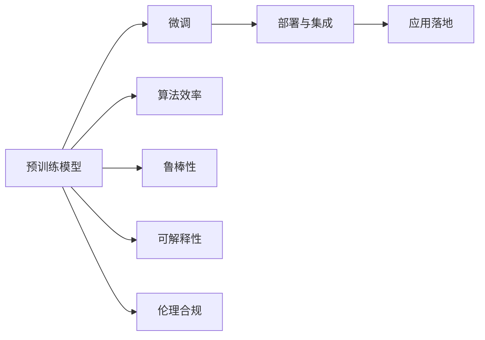

                 

# 解构LLM产业链：机遇与挑战并存

## 1. 背景介绍

### 1.1 问题由来
大型语言模型（Large Language Models, LLMs）在过去几年中迅速崛起，成为NLP领域的领头羊。从GPT-3、BERT到最新的GPT-4，LLMs不仅在文本生成、翻译、问答等传统NLP任务上取得了突破，也在代码生成、信息检索、情感分析等前沿领域大放异彩。然而，LLMs产业链的快速扩展也带来了诸多挑战。本文将从产业生态、技术演进、市场竞争等角度，深入剖析LLM产业链的机遇与挑战，探讨未来发展方向。

### 1.2 问题核心关键点
LLM产业链的机遇与挑战并存，主要体现在以下几个方面：
- 产业生态：LLMs产业链包括预训练模型、微调工具、模型部署、应用落地等多个环节，不同环节存在不同的机遇与挑战。
- 技术演进：LLMs在模型架构、训练技术、应用场景等方面持续进步，但同时也面临算法效率、鲁棒性、可解释性等技术瓶颈。
- 市场竞争：LLMs产业链市场竞争激烈，各大公司纷纷布局，但存在同质化竞争风险。
- 伦理合规：LLMs应用可能引发伦理、隐私等法律合规问题，需慎重处理。

通过深入分析这些关键点，本文将为你描绘一幅LLM产业链全貌，并提出应对策略。

## 2. 核心概念与联系

### 2.1 核心概念概述

为了更好地理解LLM产业链，本文将介绍几个关键概念及其相互联系：

- **预训练模型（Pre-trained Models）**：在大量无标签数据上进行的自监督训练，学习通用的语言表示。
- **微调（Fine-tuning）**：在预训练模型的基础上，使用下游任务的少量标注数据进行有监督训练，优化模型在该任务上的性能。
- **部署与集成（Deployment and Integration）**：将微调后的模型部署到实际应用中，并与其他系统进行集成。
- **应用落地（Application Deployment）**：将LLM技术应用于具体业务场景，解决实际问题。
- **算法效率（Algorithm Efficiency）**：优化模型训练和推理的算法，提高计算效率。
- **鲁棒性（Robustness）**：提高模型在各种数据和环境下的稳定性。
- **可解释性（Explainability）**：提升模型的决策逻辑可解释性，增强用户信任。
- **伦理合规（Ethical Compliance）**：确保模型输出符合伦理、法律要求。

这些概念之间通过特定的流程和机制相互联系，共同构成了LLM产业链的关键环节。

### 2.2 核心概念原理和架构的 Mermaid 流程图



## 3. 核心算法原理 & 具体操作步骤

### 3.1 算法原理概述

LLM产业链的核心算法原理可以归纳为预训练和微调两个阶段。预训练模型在大量无标签数据上学习语言表示，微调模型则在此基础上，通过有监督学习优化模型在特定任务上的性能。

**预训练阶段**：
- **目标**：学习语言模型的通用表示。
- **方法**：在大量无标签数据上进行自监督学习，如语言建模、掩码语言模型等。
- **模型**：使用Transformer等架构，设计合适的自监督损失函数。

**微调阶段**：
- **目标**：优化模型在特定任务上的性能。
- **方法**：使用下游任务的少量标注数据进行有监督学习。
- **模型**：在预训练模型的基础上，添加任务适配层，设计合适的损失函数。

### 3.2 算法步骤详解

**预训练模型训练**：
1. 收集大量无标签数据，如维基百科、新闻、书籍等。
2. 将数据划分为训练集和验证集。
3. 使用Transformer等架构，定义语言模型损失函数。
4. 在训练集上进行迭代训练，优化模型参数。
5. 在验证集上评估模型性能，调整超参数。

**微调模型训练**：
1. 收集下游任务的少量标注数据，如文本分类、翻译、问答等。
2. 将标注数据划分为训练集、验证集和测试集。
3. 使用预训练模型作为初始化参数。
4. 添加任务适配层，定义损失函数。
5. 在训练集上进行迭代训练，优化模型参数。
6. 在验证集上评估模型性能，调整超参数。
7. 在测试集上评估模型性能。

### 3.3 算法优缺点

**优点**：
- **高效性**：微调模型可以在少量标注数据下取得良好效果。
- **泛化性强**：预训练模型可以泛化到多种任务。
- **开发便捷**：微调过程相对简单，开发者可以快速部署。

**缺点**：
- **依赖标注数据**：微调效果依赖高质量标注数据，获取成本高。
- **模型泛化风险**：预训练模型可能不适用于所有任务。
- **资源消耗大**：预训练和微调需要大量计算资源。

### 3.4 算法应用领域

LLM在多个领域中得到了广泛应用，如：
- **自然语言处理**：文本分类、情感分析、命名实体识别等。
- **计算机视觉**：图像描述、物体检测、图像生成等。
- **语音处理**：语音识别、语音合成、对话系统等。
- **推荐系统**：个性化推荐、广告推荐等。
- **信息检索**：问答系统、文档检索等。

## 4. 数学模型和公式 & 详细讲解

### 4.1 数学模型构建

预训练和微调过程可以通过数学模型进行描述。以BERT模型为例，其数学模型可以表示为：

$$
\mathbf{Z} = \mathbf{X}W + \mathbf{b}
$$

其中 $\mathbf{Z}$ 为模型输出，$\mathbf{X}$ 为输入，$W$ 和 $b$ 为模型参数。

**预训练**：
- 使用掩码语言模型损失函数，约束模型预测被掩码的词汇。
- 使用下一句预测损失函数，约束模型预测下一个句子。

**微调**：
- 添加任务适配层，如分类器或解码器。
- 定义损失函数，如交叉熵损失或序列交叉熵损失。

### 4.2 公式推导过程

**掩码语言模型**：
- 目标函数：
$$
\mathcal{L}_{\text{masked}} = -\frac{1}{N}\sum_{i=1}^N\sum_{j=1}^{N_{\text{token}}}\log\sigma(y_j;\mathbf{Z}_j)
$$
- 其中 $\sigma$ 为softmax函数，$y_j$ 为标签，$\mathbf{Z}_j$ 为第 $j$ 个词汇的输出。

**下一句预测**：
- 目标函数：
$$
\mathcal{L}_{\text{next}} = -\frac{1}{N}\sum_{i=1}^N\log\sigma(y_j;\mathbf{Z}_j)
$$
- 其中 $\sigma$ 为softmax函数，$y_j$ 为标签，$\mathbf{Z}_j$ 为第 $j$ 个词汇的输出。

### 4.3 案例分析与讲解

**情感分析**：
- 数据集：IMDb电影评论数据集。
- 模型：BERT-base。
- 目标：预测电影评论的情感（正面或负面）。
- 微调过程：
1. 收集标注数据，划分为训练集、验证集和测试集。
2. 加载BERT-base模型，添加全连接层和softmax输出层。
3. 定义交叉熵损失函数，进行训练和验证。
4. 在测试集上评估模型性能。

## 5. 项目实践：代码实例和详细解释说明

### 5.1 开发环境搭建

**Python环境**：
- 安装Anaconda，创建虚拟环境。
- 安装PyTorch、torchtext等NLP库。

**GPU环境**：
- 安装NVIDIA CUDA Toolkit和CUDNN库。
- 配置环境变量，启动GPU加速。

### 5.2 源代码详细实现

**代码实例**：
```python
import torch
from transformers import BertForSequenceClassification, BertTokenizer
from torch.utils.data import DataLoader, Dataset

class ImdbDataset(Dataset):
    def __init__(self, data_path, tokenizer):
        self.data_path = data_path
        self.tokenizer = tokenizer
        self.data = []
        with open(data_path, 'r', encoding='utf-8') as f:
            for line in f:
                text, label = line.strip().split('\t')
                self.data.append((text, label))

    def __len__(self):
        return len(self.data)

    def __getitem__(self, index):
        text, label = self.data[index]
        tokenized_text = self.tokenizer.tokenize(text)
        return {'input_ids': self.tokenizer.convert_tokens_to_ids(tokenized_text), 
                'attention_mask': [1] * len(tokenized_text), 
                'labels': label}

# 加载数据和模型
tokenizer = BertTokenizer.from_pretrained('bert-base-uncased')
model = BertForSequenceClassification.from_pretrained('bert-base-uncased', num_labels=2)

# 训练模型
device = torch.device('cuda' if torch.cuda.is_available() else 'cpu')
model.to(device)
optimizer = torch.optim.AdamW(model.parameters(), lr=1e-5)

def train_epoch(model, data_loader, optimizer, loss_fn):
    model.train()
    epoch_loss = 0
    for batch in data_loader:
        input_ids = batch['input_ids'].to(device)
        attention_mask = batch['attention_mask'].to(device)
        labels = batch['labels'].to(device)
        outputs = model(input_ids, attention_mask=attention_mask, labels=labels)
        loss = loss_fn(outputs, labels)
        epoch_loss += loss.item()
        loss.backward()
        optimizer.step()
        optimizer.zero_grad()
    return epoch_loss / len(data_loader)

def evaluate(model, data_loader, loss_fn):
    model.eval()
    total_loss = 0
    for batch in data_loader:
        input_ids = batch['input_ids'].to(device)
        attention_mask = batch['attention_mask'].to(device)
        labels = batch['labels'].to(device)
        with torch.no_grad():
            outputs = model(input_ids, attention_mask=attention_mask, labels=labels)
            loss = loss_fn(outputs, labels)
            total_loss += loss.item()
    return total_loss / len(data_loader)

# 训练和评估
train_loader = DataLoader(train_dataset, batch_size=16)
dev_loader = DataLoader(dev_dataset, batch_size=16)
test_loader = DataLoader(test_dataset, batch_size=16)

for epoch in range(10):
    train_loss = train_epoch(model, train_loader, optimizer, loss_fn)
    print(f'Epoch {epoch+1}, train loss: {train_loss:.4f}')
    
    dev_loss = evaluate(model, dev_loader, loss_fn)
    print(f'Epoch {epoch+1}, dev loss: {dev_loss:.4f}')
    
print('Test loss:', evaluate(model, test_loader, loss_fn))
```

### 5.3 代码解读与分析

**数据集准备**：
- 使用 `torch.utils.data.Dataset` 类定义数据集。
- 对每个样本进行token化和id转换。

**模型加载与训练**：
- 使用 `transformers.BertForSequenceClassification` 加载BERT模型。
- 定义 `torch.optim.AdamW` 优化器，进行梯度更新。
- 使用 `model.train()` 和 `model.eval()` 切换训练和评估模式。

**损失函数**：
- 定义 `model(input_ids, attention_mask=attention_mask, labels=labels)` 计算预测输出。
- 定义 `loss_fn(outputs, labels)` 计算损失，如交叉熵损失。

**训练与评估**：
- 在训练集上循环迭代，计算平均损失，反向传播更新模型参数。
- 在验证集上评估模型性能，调整学习率或超参数。
- 在测试集上最终评估模型性能。

## 6. 实际应用场景

### 6.4 未来应用展望

**智能客服**：
- 通过微调模型，构建智能客服系统，提供7x24小时不间断服务，提高客户咨询体验和问题解决效率。

**金融舆情监测**：
- 利用微调模型进行情感分析和主题分类，监测市场舆情，规避金融风险。

**个性化推荐**：
- 通过微调模型，实现个性化推荐系统，提升用户满意度和平台收益。

**自动生成代码**：
- 利用微调模型，生成程序代码，提高软件开发效率。

**智能搜索**：
- 通过微调模型，提高搜索引擎的搜索结果准确度和用户体验。

**医疗问答**：
- 通过微调模型，构建医疗问答系统，帮助医生进行快速诊断和治疗建议。

**情感分析**：
- 通过微调模型，分析社交媒体和用户评论的情感倾向，获取用户反馈。

## 7. 工具和资源推荐

### 7.1 学习资源推荐

**NLP入门**：
- 《NLP入门教程》：介绍NLP基础概念和常用算法。

**微调技巧**：
- 《深度学习与NLP》：讲解微调技术及其优化策略。

**GPU加速**：
- 《PyTorch GPU编程》：指导如何使用GPU进行模型训练和推理。

**模型部署**：
- 《TensorFlow实战》：讲解TensorFlow模型的部署和集成。

### 7.2 开发工具推荐

**环境搭建**：
- Anaconda：创建虚拟环境，安装依赖包。

**计算加速**：
- NVIDIA CUDA Toolkit：加速GPU计算。

**自动化部署**：
- AWS：搭建云服务器，部署微调模型。

**日志管理**：
- ELK Stack：日志收集和分析。

**数据存储**：
- Amazon S3：大规模数据存储。

**监控告警**：
- Prometheus + Grafana：实时监控系统指标，设置告警阈值。

### 7.3 相关论文推荐

**预训练模型**：
- 《BERT: Pre-training of Deep Bidirectional Transformers for Language Understanding》

**微调算法**：
- 《A Survey on Parameter-Efficient Fine-Tuning》

**模型部署**：
- 《Model Serving with Amazon SageMaker》

**伦理合规**：
- 《Ethical Considerations in AI》

## 8. 总结：未来发展趋势与挑战

### 8.1 研究成果总结

**预训练模型**：
- BERT、GPT等大模型在NLP领域取得了显著进展，推动了预训练技术的发展。

**微调技术**：
- 通过微调，模型可以在少量标注数据下取得优异性能，成为NLP任务优化的重要手段。

**多模态融合**：
- 当前多模态融合技术不断进步，如视觉+文本、语音+文本等，提升模型综合能力。

**可解释性**：
- 提高模型的可解释性，增强用户对模型输出的信任和理解。

**伦理合规**：
- 确保模型输出符合伦理、法律要求，避免偏见和歧视。

### 8.2 未来发展趋势

**预训练模型规模**：
- 未来预训练模型规模将进一步增大，模型能力将更强。

**微调方法优化**：
- 开发更多参数高效、计算高效的微调方法，提升模型性能。

**多模态融合**：
- 提升多模态融合技术，实现视觉、语音、文本等信息的协同建模。

**可解释性和透明性**：
- 提高模型输出的可解释性和透明性，增强用户信任。

**伦理合规**：
- 确保模型输出符合伦理、法律要求，避免偏见和歧视。

### 8.3 面临的挑战

**标注数据依赖**：
- 微调模型依赖高质量标注数据，标注成本高。

**模型泛化风险**：
- 预训练模型可能不适用于所有任务，泛化性能有限。

**计算资源消耗**：
- 大规模模型的训练和推理需要大量计算资源，存在性能瓶颈。

**模型复杂性**：
- 模型复杂度高，推理速度慢，存在效率问题。

**伦理合规风险**：
- 模型输出可能引发伦理、法律问题，需要谨慎处理。

### 8.4 研究展望

**高效训练**：
- 开发更高效的训练算法，减少训练时间。

**参数效率**：
- 开发参数高效的微调方法，减小模型规模。

**多模态融合**：
- 提升多模态融合技术，实现视觉、语音、文本等信息的协同建模。

**可解释性和透明性**：
- 提高模型输出的可解释性和透明性，增强用户信任。

**伦理合规**：
- 确保模型输出符合伦理、法律要求，避免偏见和歧视。

## 9. 附录：常见问题与解答

**Q1: 大语言模型微调是否适用于所有NLP任务？**

A: 大语言模型微调在大多数NLP任务上都能取得不错的效果，但适用于特定领域的任务需要进一步预训练。

**Q2: 如何选择合适的学习率？**

A: 微调学习率一般比预训练时小1-2个数量级，建议从1e-5开始调参，逐步减小。

**Q3: 微调过程中如何缓解过拟合问题？**

A: 数据增强、正则化、对抗训练、参数高效微调等方法可以有效缓解过拟合。

**Q4: 微调模型在落地部署时需要注意哪些问题？**

A: 模型裁剪、量化加速、服务化封装、弹性伸缩、监控告警等是微调模型落地部署时需要注意的问题。

---

作者：禅与计算机程序设计艺术 / Zen and the Art of Computer Programming

