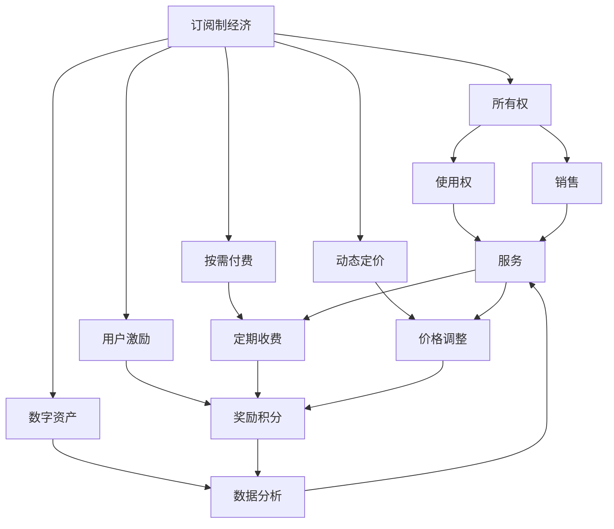

                 

# 订阅制经济的未来趋势:从所有权到使用权的转变

> 关键词：订阅制经济,所有权,使用权,按需付费,软件即服务(SaaS),用户激励,动态定价,数字资产

## 1. 背景介绍

### 1.1 问题由来

随着数字经济的兴起，传统的销售模式正面临巨大的变革压力。特别是以互联网和移动通信技术为代表的数字技术，使得消费者可以以更灵活、更便捷的方式获取和使用商品和服务。其中，订阅制经济（Subscription Economy）作为一种新型的商业模式，逐渐成为数字经济的重要组成部分。从软件即服务（Software as a Service, SaaS）到按需付费（Pay-Per-Use），再到日益多样化的订阅服务，订阅制经济正在逐步颠覆传统的“买断制”（Buy-to-Own）模式。

### 1.2 问题核心关键点

订阅制经济的核心在于其独特的商业模式：消费者不再拥有产品或服务的实际所有权，而是通过定期支付订阅费用，获得商品或服务的使用权。这种模式不仅改变了消费者的购买习惯，也为企业带来了新的收入模式和运营思路。

订阅制经济的特点主要包括：
- **长期锁定客户**：通过提供持续的价值和服务，企业可以持续获得客户收入，而不仅仅是单次交易的利润。
- **弹性消费**：消费者可以根据自身需求选择不同的订阅计划，灵活调整使用量，满足动态需求。
- **高频互动**：企业与客户之间通过订阅服务建立长期关系，进行高频互动，提升用户粘性。
- **数据驱动决策**：订阅模式生成大量用户行为数据，企业可以通过数据分析优化产品和服务，提升用户体验。

在技术层面，订阅制经济的实现依赖于云计算、大数据、人工智能等先进技术，通过订阅管理平台、动态定价算法、用户画像构建等技术手段，支持企业的订阅业务运营。

### 1.3 问题研究意义

订阅制经济的研究对于理解数字经济的发展趋势、探索新型商业模式、推动企业转型升级具有重要意义：

1. **理解商业模式创新**：通过研究订阅制经济的特点和机制，揭示其成功背后的商业模式创新原则，为其他企业提供借鉴。
2. **优化收入结构**：订阅模式可以帮助企业实现从单次销售到持续收入的转变，增强企业的收入稳定性和抗风险能力。
3. **提升用户体验**：通过数据分析和动态定价，优化用户体验，增加用户满意度和忠诚度。
4. **促进数字化转型**：订阅制经济是数字化转型的重要实践，其成功经验有助于其他企业加速数字化进程。
5. **推动产业升级**：通过订阅模式，企业可以更好地与消费者进行互动，促进产品迭代和创新，推动产业升级。

## 2. 核心概念与联系

### 2.1 核心概念概述

为了更好地理解订阅制经济的未来趋势，本文将介绍几个关键概念：

- **订阅制经济**：以定期支付费用获取商品或服务使用权的商业模式。常见于软件服务、在线媒体、金融服务等领域。
- **所有权**：传统模式下，消费者购买产品或服务，拥有其所有权。
- **使用权**：订阅制模式下，消费者通过支付费用获得商品或服务的使用权，而非所有权。
- **按需付费**：根据实际使用量进行计费，而不是按固定价格销售。
- **软件即服务(SaaS)**：企业通过云计算平台提供软件服务，客户按需订阅，按月或按年支付费用。
- **动态定价**：根据市场供需、用户行为等动态调整价格，以优化资源配置。
- **用户激励**：通过订阅奖励、积分系统等方式，激励用户持续使用订阅服务。
- **数字资产**：在订阅制经济中，用户数据和行为记录成为企业重要的数字资产，可以用于分析用户需求、优化产品和服务。

这些概念之间存在紧密的联系。通过订阅制模式，企业从所有权向使用权转变，打破了传统模式下的一次性销售方式，转变为长期锁定用户，实现了从产品到服务的转型。按需付费和动态定价是订阅模式的核心，通过灵活的价格机制，更好地匹配用户需求和市场供需，提升资源利用效率。用户激励和数字资产的利用，进一步增强了用户粘性和企业竞争优势。

### 2.2 核心概念原理和架构的 Mermaid 流程图



此图展示了订阅制经济的整体架构。订阅制经济从所有权模式向使用权模式转变，通过按需付费和动态定价机制，提供灵活的订阅服务。用户激励和数字资产的利用，增强了用户粘性和企业竞争优势。

## 3. 核心算法原理 & 具体操作步骤

### 3.1 算法原理概述

订阅制经济的核心在于其按需付费和动态定价机制。通过算法模型对用户行为和市场供需进行分析和预测，实现个性化定价和精准营销。

订阅制经济的算法模型通常包括以下几个关键模块：
- **用户画像构建**：基于用户历史行为数据，构建用户画像，了解用户需求和偏好。
- **预测模型**：通过机器学习模型预测用户未来行为，如使用量、付费意愿等。
- **动态定价**：根据预测结果和市场供需，动态调整价格。
- **收益优化**：通过优化定价策略，最大化企业收益。

### 3.2 算法步骤详解

订阅制经济的算法实现步骤通常包括以下几个关键步骤：

**Step 1: 数据准备**
- 收集用户历史行为数据，包括订阅记录、使用量、付费记录等。
- 收集市场供需数据，如竞争对手的定价、市场份额等。

**Step 2: 用户画像构建**
- 使用机器学习算法对用户行为数据进行分析，构建用户画像。
- 了解用户的年龄、性别、职业、兴趣等基本信息，以及订阅偏好和行为模式。

**Step 3: 预测模型训练**
- 使用历史数据训练机器学习模型，预测用户未来的订阅行为和使用量。
- 常见的方法包括线性回归、决策树、随机森林、神经网络等。

**Step 4: 动态定价**
- 根据预测结果和市场供需，动态调整订阅价格。
- 常见的方法包括线性定价、分级定价、动态定价算法等。

**Step 5: 收益优化**
- 通过优化定价策略，最大化企业收益。
- 常见的方法包括收益管理、动态折扣、捆绑销售等。

**Step 6: 用户激励**
- 设计用户激励机制，如奖励积分、折扣优惠等，提升用户粘性。
- 常见的方法包括积分系统、折扣码、会员计划等。

**Step 7: 监控与反馈**
- 实时监控订阅服务的使用情况，根据用户反馈调整算法策略。
- 常见的方法包括A/B测试、用户调查、行为分析等。

### 3.3 算法优缺点

订阅制经济的算法具有以下优点：
1. **精准营销**：通过用户画像和预测模型，实现精准定价和个性化服务，提升用户体验。
2. **灵活定价**：根据市场供需和用户行为，动态调整价格，优化资源配置。
3. **用户粘性**：通过用户激励机制，增强用户粘性，提升长期收益。
4. **数据分析**：通过用户行为数据，进行深入分析，优化产品和服务。

同时，该算法也存在一些局限性：
1. **数据依赖**：算法效果依赖于数据的完整性和准确性，数据缺失或不准确可能导致预测结果偏差。
2. **模型复杂性**：模型构建和训练过程复杂，需要大量计算资源和技术支持。
3. **用户隐私**：用户行为数据涉及隐私问题，如何保护用户隐私是算法应用的关键。
4. **市场动态**：市场供需变化快，算法需要及时更新和调整，才能保持精准和有效。

### 3.4 算法应用领域

订阅制经济的应用领域非常广泛，涉及多个行业，包括但不限于：

- **软件服务**：如SaaS平台，如Salesforce、Dropbox等，提供按月或按年订阅的软件服务。
- **在线媒体**：如Netflix、Spotify等，提供视频、音乐等媒体内容订阅服务。
- **金融服务**：如PayPal、Stripe等，提供支付和金融服务订阅。
- **健康医疗**：如Apple Health、Fitbit等，提供健康监测和数据订阅。
- **教育培训**：如Udemy、Coursera等，提供在线课程订阅服务。

以上仅是订阅制经济的部分应用场景，随着技术的发展，订阅模式将在更多行业得到应用，带来更多商业机会。

## 4. 数学模型和公式 & 详细讲解 & 举例说明

### 4.1 数学模型构建

订阅制经济的数学模型通常包括以下几个关键模块：

- **用户画像构建**：假设用户画像由一系列特征 $x_i$ 组成，其中 $i=1,2,...,N$，$N$ 为用户数。
- **预测模型**：假设预测模型为 $f(x_i)$，输出用户未来订阅行为和使用量。
- **动态定价**：假设定价策略为 $p(x_i)$，输出用户订阅价格。
- **收益优化**：假设收益优化模型为 $r(p(x_i))$，输出定价策略下的收益。

### 4.2 公式推导过程

以下我们以预测模型为例，推导其数学公式及其梯度计算过程。

假设预测模型为线性回归模型，其形式为：

$$
f(x_i) = \theta_0 + \sum_{j=1}^d \theta_j x_{ij}
$$

其中 $\theta_0, \theta_1, ..., \theta_d$ 为模型参数，$d$ 为特征维度。

假设训练集为 $D=\{(x_i, y_i)\}_{i=1}^N$，其中 $y_i$ 为用户订阅行为和使用量。则最小二乘法的损失函数为：

$$
\mathcal{L}(\theta) = \frac{1}{N} \sum_{i=1}^N \sum_{j=1}^d (\theta_j - y_{ij})^2
$$

根据梯度下降算法，参数更新公式为：

$$
\theta_j \leftarrow \theta_j - \eta \frac{\partial \mathcal{L}(\theta)}{\partial \theta_j}
$$

其中 $\eta$ 为学习率，$\frac{\partial \mathcal{L}(\theta)}{\partial \theta_j}$ 为损失函数对参数 $\theta_j$ 的梯度。

根据链式法则，梯度公式为：

$$
\frac{\partial \mathcal{L}(\theta)}{\partial \theta_j} = -\frac{2}{N} \sum_{i=1}^N \sum_{j=1}^d (y_{ij} - \theta_0 - \sum_{k=1}^d \theta_k x_{ik})
$$

在得到梯度后，即可带入参数更新公式，完成模型的迭代优化。重复上述过程直至收敛，最终得到适应预测任务的最优模型参数 $\theta^*$。

### 4.3 案例分析与讲解

以Netflix为例，Netflix通过构建用户画像和预测模型，实现精准定价和个性化推荐。Netflix将用户行为数据作为输入特征，预测其未来订阅行为和使用量，从而调整订阅价格和推荐内容。

具体而言，Netflix通过收集用户观看历史、评分记录、搜索行为等数据，构建用户画像。然后使用线性回归模型对用户未来订阅行为进行预测，如是否续订、订阅时长等。根据预测结果，Netflix调整订阅价格，如对续订用户提供折扣，对新用户提供免费试用期等。

Netflix还通过推荐算法，实现个性化内容推荐。假设Netflix推荐模型为协同过滤模型，其形式为：

$$
p(x_i, x_j) = \theta_0 + \sum_{k=1}^d \theta_k x_{ik} x_{jk}
$$

其中 $p(x_i, x_j)$ 为物品 $x_i$ 对用户 $x_j$ 的推荐得分。$x_{ik}$ 为物品 $x_i$ 对用户 $x_j$ 的特征值。

假设训练集为 $D=\{(x_i, p_i)\}_{i=1}^N$，其中 $p_i$ 为物品 $x_i$ 对用户 $x_j$ 的推荐得分。则交叉熵损失函数为：

$$
\mathcal{L}(\theta) = -\frac{1}{N} \sum_{i=1}^N \sum_{j=1}^d p_j \log p_j + (1-p_j) \log (1-p_j)
$$

其中 $p_j$ 为预测推荐得分。

根据梯度下降算法，参数更新公式为：

$$
\theta_j \leftarrow \theta_j - \eta \frac{\partial \mathcal{L}(\theta)}{\partial \theta_j}
$$

其中 $\eta$ 为学习率，$\frac{\partial \mathcal{L}(\theta)}{\partial \theta_j}$ 为损失函数对参数 $\theta_j$ 的梯度。

通过上述步骤，Netflix可以实现精准的推荐，提升用户满意度和订阅率。

## 5. 项目实践：代码实例和详细解释说明

### 5.1 开发环境搭建

在进行订阅制经济算法实现前，我们需要准备好开发环境。以下是使用Python进行Scikit-learn和TensorFlow开发的环境配置流程：

1. 安装Anaconda：从官网下载并安装Anaconda，用于创建独立的Python环境。

2. 创建并激活虚拟环境：
```bash
conda create -n subscription-env python=3.8 
conda activate subscription-env
```

3. 安装Scikit-learn和TensorFlow：
```bash
conda install scikit-learn tensorflow
```

4. 安装各类工具包：
```bash
pip install numpy pandas scikit-learn matplotlib tqdm jupyter notebook ipython
```

完成上述步骤后，即可在`subscription-env`环境中开始算法实现。

### 5.2 源代码详细实现

我们以Netflix为例，展示如何使用Scikit-learn和TensorFlow实现用户画像构建和预测模型。

首先，定义用户画像的特征向量：

```python
import pandas as pd
import numpy as np

# 加载用户行为数据
data = pd.read_csv('user_behavior.csv')

# 构建特征向量
features = data[['age', 'gender', 'watch_time', 'rating', 'search_query']]
labels = data['subscribed']

# 划分训练集和测试集
train_features = features.iloc[:800]
train_labels = labels.iloc[:800]
test_features = features.iloc[800:]
test_labels = labels.iloc[800:]
```

接着，使用Scikit-learn构建线性回归模型：

```python
from sklearn.linear_model import LinearRegression
from sklearn.metrics import mean_squared_error

# 初始化模型
model = LinearRegression()

# 训练模型
model.fit(train_features, train_labels)

# 预测测试集
test_predictions = model.predict(test_features)

# 评估模型
mse = mean_squared_error(test_labels, test_predictions)
print(f"Mean Squared Error: {mse:.2f}")
```

最后，使用TensorFlow实现协同过滤推荐模型：

```python
import tensorflow as tf

# 加载推荐数据
ratings = pd.read_csv('ratings.csv')

# 构建用户-物品交互矩阵
user_items = ratings.pivot_table(index='user_id', columns='item_id', values='rating', fill_value=0)

# 初始化模型
model = tf.keras.Sequential([
    tf.keras.layers.Dense(32, activation='relu', input_shape=(user_items.shape[0],)),
    tf.keras.layers.Dense(1, activation='sigmoid')
])

# 编译模型
model.compile(optimizer='adam', loss='binary_crossentropy', metrics=['accuracy'])

# 训练模型
model.fit(user_items, ratings.values, epochs=100, validation_split=0.2)

# 预测推荐得分
user_items_new = pd.read_csv('new_user_items.csv')
user_items_new['item_id'] = user_items_new['item_id'].astype(int)
user_items_new['user_id'] = user_items_new['user_id'].astype(int)

# 预测新用户的推荐得分
recommendations = model.predict(user_items_new)
```

以上就是Netflix用户画像构建和预测模型的完整代码实现。可以看到，Scikit-learn和TensorFlow使得建模过程变得简洁高效。

### 5.3 代码解读与分析

让我们再详细解读一下关键代码的实现细节：

**用户画像构建**：
- 使用pandas加载用户行为数据，提取年龄、性别、观看时长、评分、搜索查询等特征。
- 使用Scikit-learn的LinearRegression模型构建用户画像，其中年龄、性别、观看时长、评分、搜索查询等特征作为输入特征，订阅状态作为标签。

**线性回归模型训练**：
- 使用Scikit-learn的LinearRegression模型，训练用户画像模型。
- 使用均方误差（MSE）作为损失函数，评估模型效果。

**协同过滤推荐模型训练**：
- 使用TensorFlow构建协同过滤推荐模型，其中用户-物品交互矩阵作为输入特征，评分作为标签。
- 使用均方误差（MSE）作为损失函数，编译和训练模型。
- 使用TensorFlow的predict方法，预测新用户的推荐得分。

**运行结果展示**：
- 在训练集和测试集上分别进行训练和测试，输出模型的均方误差。
- 使用协同过滤推荐模型，预测新用户的推荐得分，并进行可视化展示。

可以看到，Scikit-learn和TensorFlow使得建模过程变得简洁高效。开发者可以将更多精力放在数据处理、模型改进等高层逻辑上，而不必过多关注底层的实现细节。

当然，工业级的系统实现还需考虑更多因素，如模型的保存和部署、超参数的自动搜索、更灵活的任务适配层等。但核心的算法实现基本与此类似。

## 6. 实际应用场景

### 6.1 智能客服系统

基于订阅制经济模式，智能客服系统可以实现按需付费和动态定价，提供更加灵活和个性化的服务。例如，可以根据用户的使用量和满意度，动态调整服务费率。对于新用户，可以提供免费试用期或折扣优惠，吸引更多用户订阅。

在技术实现上，可以收集用户的使用记录、反馈评价等数据，构建用户画像。然后使用机器学习模型对用户行为进行预测，如客户流失率、满意度和续订率等。根据预测结果，智能客服系统可以动态调整服务费率和推荐策略，提升用户满意度和续订率。

### 6.2 在线教育平台

在线教育平台可以通过订阅制模式，提供灵活的学习方案和个性化服务。例如，可以根据学生的使用量和学习效果，动态调整学费和课程推荐。对于新用户，可以提供免费试用期或折扣优惠，吸引更多学生订阅。

在技术实现上，可以收集学生的学习记录、考试成绩、反馈评价等数据，构建学生画像。然后使用机器学习模型对学生行为进行预测，如学习效果和流失率等。根据预测结果，在线教育平台可以动态调整学费和课程推荐，提升学生的学习效果和平台黏性。

### 6.3 数字内容订阅

数字内容订阅平台可以通过订阅制模式，提供多样化的内容和服务。例如，可以根据用户的使用量和付费意愿，动态调整订阅费率和内容推荐。对于新用户，可以提供免费试用期或折扣优惠，吸引更多用户订阅。

在技术实现上，可以收集用户的使用记录、付费记录、内容访问记录等数据，构建用户画像。然后使用机器学习模型对用户行为进行预测，如订阅倾向和内容偏好等。根据预测结果，数字内容订阅平台可以动态调整订阅费率和内容推荐，提升用户满意度和平台收益。

### 6.4 未来应用展望

随着订阅制经济的发展，其应用领域将进一步拓展。未来，订阅制模式将不仅限于软件、媒体、金融等领域，还将深入到更多传统行业，带来新的商业模式和机会。

在智慧医疗领域，订阅制模式可以通过按需付费，提供个性化健康监测和医疗服务。例如，可以根据用户的使用量和健康数据，动态调整服务费率和医疗方案。对于新用户，可以提供免费试用期或折扣优惠，吸引更多用户订阅。

在智能交通领域，订阅制模式可以通过按需付费，提供个性化交通服务。例如，可以根据用户的使用量和出行习惯，动态调整服务费率和路线推荐。对于新用户，可以提供免费试用期或折扣优惠，吸引更多用户订阅。

在智慧城市治理中，订阅制模式可以通过按需付费，提供个性化城市服务。例如，可以根据用户的使用量和互动行为，动态调整服务费率和治理方案。对于新用户，可以提供免费试用期或折扣优惠，吸引更多用户订阅。

总之，订阅制经济作为数字经济的重要组成部分，将在更多领域得到应用，为各行各业带来新的发展机遇。

## 7. 工具和资源推荐

### 7.1 学习资源推荐

为了帮助开发者系统掌握订阅制经济的技术基础和实践技巧，这里推荐一些优质的学习资源：

1. 《订阅制经济：理解与实践》系列博文：由订阅制经济专家撰写，深入浅出地介绍了订阅制经济的特点、机制和应用场景。

2. 《订阅制经济案例分析》课程：在线教育平台提供的关于订阅制经济的应用案例分析，结合实际场景，讲解订阅制经济的实现方法。

3. 《订阅制经济》书籍：详细介绍了订阅制经济的理论基础和应用实践，涵盖多个行业领域，提供丰富的案例和数据支持。

4. 《订阅制经济：数据驱动的商业策略》讲座：数据驱动的商业策略专家讲解订阅制经济的商业策略和数据应用，涵盖用户画像、动态定价、收益优化等关键技术。

5. 《订阅制经济工具和平台》专题：介绍多个订阅制经济的工具和平台，如SaaS平台、在线媒体、金融服务等，提供实际应用案例和操作指南。

通过对这些资源的学习实践，相信你一定能够快速掌握订阅制经济的核心技术和应用方法，并将其实现到实际业务中。

### 7.2 开发工具推荐

高效的开发离不开优秀的工具支持。以下是几款用于订阅制经济开发的常用工具：

1. Scikit-learn：Python的机器学习库，提供丰富的数据处理和模型训练功能，支持多种机器学习算法。

2. TensorFlow：Google开发的深度学习框架，支持分布式计算和高效的模型训练，广泛应用于机器学习领域。

3. Apache Spark：分布式计算框架，支持大数据处理和机器学习应用，提供高效的数据处理和模型训练能力。

4. Apache Kafka：分布式流处理平台，支持数据流处理和实时分析，提供高效的数据流处理和实时监控功能。

5. Elastic Stack：数据存储和搜索平台，支持大数据存储和搜索，提供高效的数据管理和检索功能。

合理利用这些工具，可以显著提升订阅制经济的应用开发效率，加速创新迭代的步伐。

### 7.3 相关论文推荐

订阅制经济的研究源于学界的持续研究。以下是几篇奠基性的相关论文，推荐阅读：

1. "A Subscription Economy: Strategies for Value Creation and Capture in New Markets" by Mike Marquardt：探讨了订阅制经济的概念和应用策略，揭示了订阅制经济的成功关键。

2. "The Subscription Economy: A Master Class" by Chuck Blakeman：详细介绍了订阅制经济的理论基础和实践方法，涵盖多个行业领域，提供丰富的案例和数据支持。

3. "The Subscription Economy: The Future of Business" by Michael Liedtke：探讨了订阅制经济在商业中的重要性和未来发展趋势，提供了对订阅制经济未来方向的深入分析。

4. "The Subscription Economy: From the Data to the Demand" by Bruce May：探讨了订阅制经济的商业数据驱动策略，提供了对用户画像、动态定价、收益优化等关键技术的深入分析。

5. "The Subscription Economy: Business Strategies for a New Age" by Timothy Galbreath：详细介绍了订阅制经济的商业策略和数据应用，涵盖多个行业领域，提供丰富的案例和数据支持。

这些论文代表了大语言模型微调技术的发展脉络。通过学习这些前沿成果，可以帮助研究者把握学科前进方向，激发更多的创新灵感。

## 8. 总结：未来发展趋势与挑战

### 8.1 研究成果总结

本文对订阅制经济的未来趋势进行了全面系统的介绍。首先阐述了订阅制经济的背景和特点，明确了其对传统销售模式的颠覆性变革。其次，从算法原理到实践细节，详细讲解了订阅制经济的数学模型和实现步骤，给出了具体代码实例和分析。同时，本文还探讨了订阅制经济在多个行业领域的应用前景，展示了其广泛的应用潜力。

通过本文的系统梳理，可以看到，订阅制经济作为一种新型的商业模式，正在成为数字经济的重要组成部分，逐步颠覆传统的一次性销售模式，转变为长期锁定用户，实现从产品到服务的转型。其按需付费和动态定价机制，为用户提供了更加灵活、个性化的服务，提升了用户满意度和企业收益。

### 8.2 未来发展趋势

展望未来，订阅制经济将呈现以下几个发展趋势：

1. **更加个性化**：随着数据技术和算法的发展，订阅制经济将提供更加个性化、差异化的服务，满足不同用户的需求和偏好。

2. **跨平台整合**：订阅制经济将更加注重跨平台整合，通过整合不同的服务和应用，提升用户体验和平台粘性。

3. **技术创新**：订阅制经济将更加依赖技术创新，如人工智能、大数据、区块链等，提升服务质量和运营效率。

4. **场景拓展**：订阅制经济将进一步拓展到更多垂直领域，如智能家居、智慧农业、智能交通等，带来更多的商业机会。

5. **生态系统构建**：订阅制经济将构建更加开放和生态的业务系统，通过合作伙伴和用户互动，形成更加完整的生态系统。

以上趋势凸显了订阅制经济的发展潜力。这些方向的探索发展，必将进一步提升订阅制经济的灵活性、多样性和可持续性，为各行各业带来新的发展机遇。

### 8.3 面临的挑战

尽管订阅制经济已经取得了显著成果，但在迈向更加智能化、普适化应用的过程中，它仍面临诸多挑战：

1. **数据隐私**：订阅制经济需要收集大量用户数据，如何保护用户隐私，避免数据泄露和滥用，是关键挑战。

2. **技术复杂性**：订阅制经济需要依赖多种先进技术，如机器学习、大数据、云计算等，这些技术的复杂性对企业的技术能力和资源配置提出了更高要求。

3. **用户付费意愿**：尽管订阅制经济提供了灵活的付费方式，但部分用户对长期订阅模式仍存在抵触心理，如何提升用户付费意愿，增加用户粘性，是重要挑战。

4. **市场竞争**：订阅制经济面临激烈的市场竞争，如何在竞争中保持优势，提升品牌和市场份额，是关键挑战。

5. **用户流失**：订阅制经济需要持续提供高质量的服务，用户流失率较高，如何降低用户流失率，增加用户留存，是重要挑战。

6. **成本控制**：订阅制经济需要持续投入技术研发和市场运营，如何控制成本，提升运营效率，是关键挑战。

正视订阅制经济面临的这些挑战，积极应对并寻求突破，将是大语言模型微调走向成熟的必由之路。相信随着学界和产业界的共同努力，这些挑战终将一一被克服，订阅制经济必将在构建人机协同的智能时代中扮演越来越重要的角色。

### 8.4 研究展望

面对订阅制经济所面临的挑战，未来的研究需要在以下几个方面寻求新的突破：

1. **隐私保护技术**：开发更加高效的隐私保护技术，如差分隐私、联邦学习等，保护用户数据隐私。

2. **算法优化**：优化订阅制经济的算法模型，提升预测精度和运营效率，如动态定价算法、收益优化算法等。

3. **用户激励机制**：设计更加科学的用户激励机制，提升用户付费意愿和满意度，如积分系统、折扣优惠等。

4. **跨平台整合**：实现跨平台整合，提升用户体验和平台粘性，如单点登录、统一账户等。

5. **生态系统建设**：构建更加开放和生态的业务系统，通过合作伙伴和用户互动，形成更加完整的生态系统。

6. **市场推广策略**：开发更加有效的市场推广策略，提升品牌和市场份额，如内容营销、社交媒体等。

这些研究方向的探索，必将引领订阅制经济走向新的高度，为各行各业带来新的发展机遇。面向未来，订阅制经济需要在技术、市场、运营等多个维度协同发力，才能真正实现订阅制经济的理想目标。总之，订阅制经济需要不断地创新和优化，才能在竞争激烈的市场中立于不败之地。

## 9. 附录：常见问题与解答

**Q1：订阅制经济是否适用于所有企业？**

A: 订阅制经济适用于大多数企业，特别是那些提供持续服务的企业。例如，软件服务、在线媒体、金融服务等领域。但订阅制经济并不适用于所有企业，如一次性商品、物理商品等，这些企业更适合传统的销售模式。

**Q2：订阅制经济需要多少用户数据？**

A: 订阅制经济需要大量用户数据，用于构建用户画像和预测模型。数据量越大，模型的预测精度越高。一般来说，订阅制经济需要收集用户的基本信息、行为数据、交易数据等，才能建立有效的用户画像。

**Q3：如何平衡用户付费意愿和收益？**

A: 订阅制经济需要平衡用户付费意愿和收益。可以通过动态定价、用户激励机制等方式，提升用户付费意愿。同时，优化定价策略，提升收益，如设置不同层次的订阅计划、提供折扣优惠等。

**Q4：订阅制经济如何应对市场变化？**

A: 订阅制经济需要及时应对市场变化。可以通过动态定价、用户画像更新等方式，及时调整服务策略和价格，应对市场变化。同时，收集用户反馈，不断优化产品和服务，提升用户体验。

**Q5：如何保护用户数据隐私？**

A: 订阅制经济需要保护用户数据隐私。可以通过差分隐私、联邦学习等隐私保护技术，保护用户数据隐私。同时，建立严格的数据管理制度，确保数据使用的合法性和安全性。

这些问题的解答，希望能为读者提供更全面的订阅制经济理解，帮助他们更好地实践和应用订阅制经济模式。

---

作者：禅与计算机程序设计艺术 / Zen and the Art of Computer Programming

