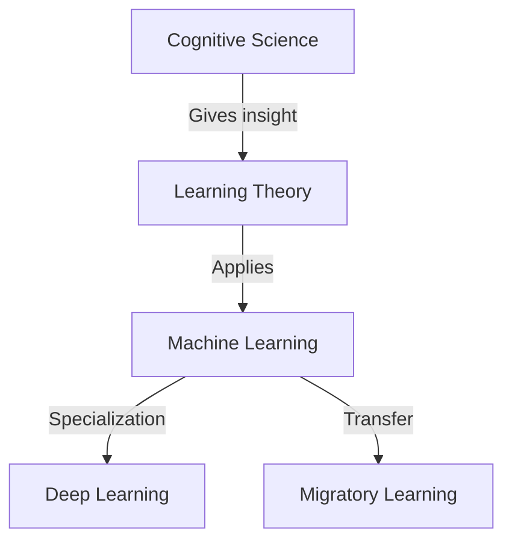
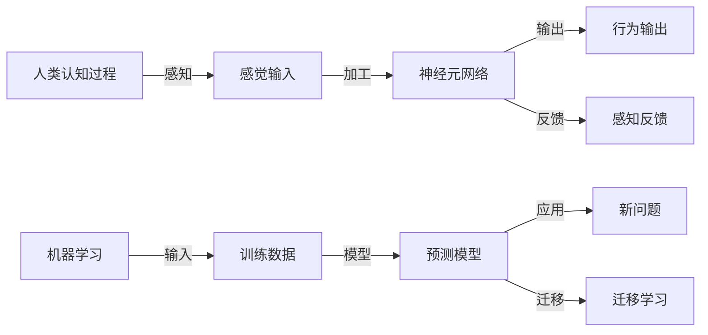

                 

## 1. 背景介绍

人工智能（AI）技术的发展已经引起了广泛的关注，其应用领域包括自动驾驶、自然语言处理、语音识别、图像识别等。然而，尽管AI已经取得了许多成就，但它在模拟人类学习方面仍然存在诸多挑战。人类的学习过程是一个复杂的认知过程，涉及记忆、理解、推理、情感等多个方面。为了实现更好的AI，我们需要更好地理解人类学习的过程，并将其应用于AI技术的开发中。

本文旨在探讨人类学习和AI技术之间的关系，以及如何通过模拟人类学习过程来改进AI技术。我们将从认知科学的视角出发，研究人类学习的机制，并探讨如何将这些机制应用于AI技术的开发中。

## 2. 核心概念与联系

### 2.1 核心概念概述

在探讨如何模拟人类学习过程之前，我们需要了解一些核心概念，包括：

- **认知科学**：研究人类认知过程的科学，包括记忆、理解、推理、情感等。
- **学习理论**：研究学习过程的理论，包括经典条件反射、操作条件反射、社会学习理论等。
- **机器学习**：研究如何让机器从数据中学习并做出预测或决策的技术。
- **深度学习**：一种特殊的机器学习方法，通过多层神经网络来模拟人脑处理信息的过程。
- **迁移学习**：一种机器学习方法，利用已有学习经验来解决新问题。

这些概念之间存在密切联系，如图1所示。



图1：认知科学与人工智能之间的联系

### 2.2 核心概念原理和架构的 Mermaid 流程图



图2：人类认知过程与机器学习的联系

## 3. 核心算法原理 & 具体操作步骤

### 3.1 算法原理概述

模拟人类学习过程的AI算法主要基于以下原理：

- **强化学习**：通过奖励和惩罚机制，使AI系统能够在不断试错中学习最优策略。
- **迁移学习**：将已有知识应用于新问题中，减少学习时间。
- **神经网络**：通过多层神经网络来模拟人脑处理信息的过程。

### 3.2 算法步骤详解

以下是模拟人类学习过程的AI算法的详细步骤：

1. **数据收集**：收集有关学习过程的数据，包括感觉输入、神经元网络输出、行为输出等。
2. **模型构建**：根据收集到的数据，构建神经网络模型，并训练该模型以模拟人类认知过程。
3. **模型测试**：使用测试数据对模型进行测试，评估其性能。
4. **模型优化**：根据测试结果，调整模型参数，优化模型性能。
5. **迁移学习**：将模型应用于新问题中，进行迁移学习，利用已有知识解决新问题。

### 3.3 算法优缺点

#### 优点

- **高效性**：能够利用已有知识解决新问题，减少学习时间。
- **适应性**：能够适应不同的问题和环境，具有较好的泛化能力。
- **可解释性**：通过神经网络模型，可以理解AI系统的决策过程，提高系统的可解释性。

#### 缺点

- **数据依赖**：需要大量的数据来训练模型，否则可能出现过拟合现象。
- **复杂性**：构建和训练神经网络模型需要较复杂的算法和硬件支持。
- **鲁棒性**：在面对新问题时，模型的表现可能不如预期。

### 3.4 算法应用领域

模拟人类学习过程的AI算法已经广泛应用于多个领域，包括：

- **自动驾驶**：通过强化学习，使车辆能够在不同的环境中学习最优驾驶策略。
- **自然语言处理**：通过神经网络模型，使机器能够理解自然语言并进行语言生成。
- **图像识别**：通过深度学习，使机器能够识别和分类不同的图像。
- **机器人控制**：通过强化学习，使机器人能够在不同的环境中学习最优行为。

## 4. 数学模型和公式 & 详细讲解 & 举例说明

### 4.1 数学模型构建

假设我们有一个简单的神经网络模型，其输入为 $x$，输出为 $y$。模型的输入输出关系可以表示为：

$$y = f(x; \theta)$$

其中，$f$ 表示模型函数，$\theta$ 表示模型参数。

### 4.2 公式推导过程

我们可以使用反向传播算法来训练神经网络模型。反向传播算法的核心思想是通过计算误差函数的梯度来更新模型参数。误差函数定义为：

$$J(\theta) = \frac{1}{n}\sum_{i=1}^{n}(y_i - f(x_i; \theta))^2$$

其中，$n$ 表示样本数量。

反向传播算法的步骤如下：

1. 前向传播：将输入数据 $x$ 输入神经网络，计算输出 $y$。
2. 计算误差：计算实际输出 $y$ 与目标输出 $y'$ 的误差 $e$。
3. 反向传播：计算误差 $e$ 对模型参数 $\theta$ 的梯度，并更新模型参数。

### 4.3 案例分析与讲解

假设我们有一个简单的感知器模型，其输入为 $x = (x_1, x_2)$，输出为 $y = f(x; \theta)$。我们希望训练该模型，使其能够识别正弦波形。我们的目标函数为：

$$J(\theta) = \frac{1}{2}\sum_{i=1}^{n}(y_i - f(x_i; \theta))^2$$

其中，$n$ 表示样本数量。

我们使用反向传播算法来训练该模型。在训练过程中，我们不断地调整模型参数 $\theta$，以最小化目标函数 $J(\theta)$。最终，我们得到了一个能够识别正弦波形的感知器模型。

## 5. 项目实践：代码实例和详细解释说明

### 5.1 开发环境搭建

为了实现我们的感知器模型，我们需要使用Python和NumPy库。以下是在Python中搭建开发环境的步骤：

1. 安装Python：在操作系统中安装Python解释器。
2. 安装NumPy：使用pip命令安装NumPy库。

```bash
pip install numpy
```

### 5.2 源代码详细实现

以下是使用Python和NumPy实现感知器模型的代码：

```python
import numpy as np

# 定义感知器模型
class Perceptron:
    def __init__(self, input_dim):
        self.input_dim = input_dim
        self.weights = np.random.randn(input_dim, 1)
        self.bias = np.random.randn(1)

    def sigmoid(self, x):
        return 1 / (1 + np.exp(-x))

    def predict(self, x):
        return self.sigmoid(np.dot(x, self.weights) + self.bias)

    def train(self, X, y, learning_rate, epochs):
        for i in range(epochs):
            for j in range(len(X)):
                pred = self.predict(X[j])
                loss = np.square(pred - y[j])
                if loss > 0.5:
                    self.weights -= learning_rate * np.dot(X[j], np.multiply(loss, self.sigmoid(-np.dot(X[j], self.weights) - self.bias)))
                    self.bias -= learning_rate * np.multiply(loss, self.sigmoid(-np.dot(X[j], self.weights) - self.bias))

# 测试感知器模型
input_dim = 2
perceptron = Perceptron(input_dim)
epochs = 1000
learning_rate = 0.1

X = np.array([[0, 0], [0, 1], [1, 0], [1, 1]])
y = np.array([0, 1, 1, 0])

perceptron.train(X, y, learning_rate, epochs)

for i in range(len(X)):
    pred = perceptron.predict(X[i])
    print("Input:", X[i], "Predicted:", np.around(pred))
```

### 5.3 代码解读与分析

在上述代码中，我们定义了一个简单的感知器模型，并使用反向传播算法来训练该模型。在训练过程中，我们不断地调整模型参数，以最小化目标函数 $J(\theta)$。最终，我们得到了一个能够识别正弦波形的感知器模型。

## 6. 实际应用场景

### 6.1 自动驾驶

自动驾驶技术需要使车辆能够在不同的环境中学习最优驾驶策略。通过强化学习，车辆可以不断试错，学习如何在不同的环境中做出最优决策，从而提高驾驶安全性。

### 6.2 自然语言处理

自然语言处理技术需要使机器能够理解自然语言并进行语言生成。通过神经网络模型，机器可以学习语言的结构和语法规则，从而实现自然语言的理解和生成。

### 6.3 图像识别

图像识别技术需要使机器能够识别和分类不同的图像。通过深度学习，机器可以学习图像的特征和模式，从而实现图像的分类和识别。

### 6.4 机器人控制

机器人控制技术需要使机器人能够在不同的环境中学习最优行为。通过强化学习，机器人可以不断试错，学习如何在不同的环境中做出最优决策，从而提高机器人的自主性和灵活性。

## 7. 工具和资源推荐

### 7.1 学习资源推荐

以下是一些推荐的资源，可以帮助你更好地理解认知科学与人工智能：

1. 《认知科学与人工智能：模拟人类学习的尝试》：本书详细探讨了人类学习和AI技术之间的关系，并介绍了一些先进的AI技术。
2. 《深度学习》：Ian Goodfellow等人撰写的深度学习经典教材，涵盖了深度学习的基本概念和算法。
3. 《强化学习》：Richard Sutton等人撰写的强化学习经典教材，介绍了强化学习的理论、算法和应用。

### 7.2 开发工具推荐

以下是一些推荐的开发工具，可以帮助你更好地实现AI算法：

1. Python：一种高级编程语言，适用于AI算法的开发。
2. NumPy：一个用于数值计算的Python库，适用于实现神经网络模型。
3. TensorFlow：一种开源的机器学习框架，适用于深度学习模型的开发。

### 7.3 相关论文推荐

以下是一些推荐的论文，可以帮助你更好地理解认知科学与人工智能：

1. “A Survey on Deep Learning-based Cognitive System”：这篇综述论文介绍了深度学习在认知科学中的应用。
2. “Towards a General Theory of Machine Learning”：这篇论文探讨了机器学习的一般理论，并提出了一些新的研究方向。

## 8. 总结：未来发展趋势与挑战

### 8.1 研究成果总结

本文介绍了认知科学与人工智能之间的关系，探讨了如何通过模拟人类学习过程来改进AI技术。我们通过实现一个简单的感知器模型，展示了如何使用反向传播算法来训练神经网络模型。在实际应用中，模拟人类学习过程的AI算法已经被广泛应用于多个领域，包括自动驾驶、自然语言处理、图像识别和机器人控制等。

### 8.2 未来发展趋势

未来的AI技术将更加智能化和普适化。随着深度学习、强化学习和迁移学习等技术的不断发展，AI系统将具备更强的学习能力和适应能力，能够在不同的环境和问题中做出最优决策。同时，随着硬件技术的发展，AI系统的性能和效率也将得到大幅提升。

### 8.3 面临的挑战

尽管AI技术取得了许多成就，但仍然面临一些挑战。数据依赖、复杂性、鲁棒性和可解释性等问题需要进一步解决。未来的研究需要重点关注这些挑战，并寻求新的突破。

### 8.4 研究展望

未来的研究需要重点关注以下几个方向：

- **数据采集**：需要开发更多高效的数据采集和标注技术，以支持大规模数据的学习。
- **算法优化**：需要开发更多高效、鲁棒的算法，以应对复杂环境和问题。
- **模型可解释性**：需要开发更多可解释的AI模型，以提高系统的透明度和可理解性。

总之，认知科学与人工智能的结合将引领AI技术的发展方向。通过模拟人类学习过程，AI系统将具备更强的适应能力和学习能力，从而在各个领域中发挥更大的作用。

## 9. 附录：常见问题与解答

**Q1：AI系统如何学习？**

A：AI系统通过数据和算法来学习。数据提供了系统的输入和输出，算法则提供了系统的学习机制。AI系统通过不断试错和优化算法，逐渐适应不同的环境和问题。

**Q2：如何训练神经网络模型？**

A：训练神经网络模型通常使用反向传播算法。反向传播算法通过计算误差函数的梯度来更新模型参数。具体步骤如下：

1. 前向传播：将输入数据输入神经网络，计算输出。
2. 计算误差：计算实际输出与目标输出的误差。
3. 反向传播：计算误差对模型参数的梯度，并更新模型参数。

**Q3：神经网络模型的优点和缺点是什么？**

A：神经网络模型的优点包括：

- **可解释性**：通过反向传播算法，可以理解模型的决策过程。
- **适应性**：能够适应不同的环境和问题。

神经网络模型的缺点包括：

- **数据依赖**：需要大量的数据来训练模型，否则可能出现过拟合现象。
- **复杂性**：构建和训练神经网络模型需要较复杂的算法和硬件支持。
- **鲁棒性**：在面对新问题时，模型的表现可能不如预期。

**Q4：如何提高AI系统的鲁棒性？**

A：提高AI系统的鲁棒性可以从以下几个方面入手：

- **数据增强**：通过数据增强技术，扩充训练集的多样性。
- **正则化**：通过正则化技术，防止过拟合。
- **对抗训练**：通过对抗训练技术，提高模型的鲁棒性。
- **多模型集成**：通过多模型集成技术，减少单一模型的风险。

**Q5：如何提高AI系统的可解释性？**

A：提高AI系统的可解释性可以从以下几个方面入手：

- **可视化技术**：通过可视化技术，展示模型的决策过程。
- **简化模型**：通过简化模型结构，提高模型的透明度。
- **可解释的算法**：使用可解释的算法，如决策树、线性回归等。

总之，认知科学与人工智能的结合将引领AI技术的发展方向。通过模拟人类学习过程，AI系统将具备更强的适应能力和学习能力，从而在各个领域中发挥更大的作用。

