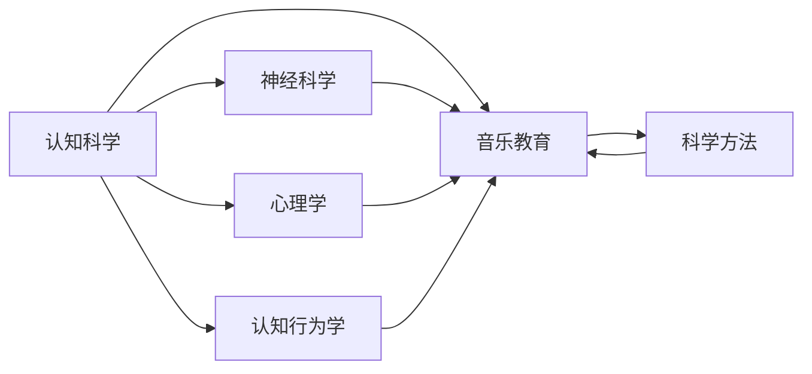

                 

# 认知科学与音乐教育：优化艺术学习的方法

## 1. 背景介绍

音乐教育在人类文明史上占据重要地位，从古希腊的“音乐教育”到文艺复兴时期的“和谐美学”，音乐与教育的关系在哲学、美学、心理学等领域被不断探讨。然而，在技术日益发展的今天，音乐教育依然面临诸多挑战。传统的教学方式难以突破，导致学生学习效果差、兴趣减退等问题。

近年来，随着认知科学的不断发展，从神经科学到心理学的最新成果被越来越多地应用于教育领域。特别是在音乐教育领域，认知科学提供了丰富的理论和方法，为艺术学习提供了新的路径。本文将从认知科学的角度，探讨如何通过科学方法优化音乐教育，提升学生的音乐素养和艺术学习效果。

## 2. 核心概念与联系

### 2.1 核心概念概述

本文主要涉及几个核心概念，分别为：
- **认知科学（Cognitive Science）**：研究人类认知过程及其在认知能力、情感、意识等方面的应用。
- **音乐教育（Music Education）**：利用科学方法和技术手段提升学生的音乐素养和艺术学习效果。
- **神经科学（Neuroscience）**：研究大脑和神经系统如何与认知、情感和行为互动。
- **心理学（Psychology）**：研究人类行为、心理过程和心理健康的科学。
- **认知行为学（Cognitive Behavioral Theory）**：研究认知过程和行为之间的相互作用。

这些核心概念共同构成了优化音乐教育的基础，通过认知科学的理论和方法，能够更好地理解音乐学习的过程，从而设计有效的教学策略和工具，提升音乐教育的效果。

### 2.2 核心概念原理和架构的 Mermaid 流程图



这个流程图展示了各个核心概念之间的联系和相互作用：
- **认知科学**提供了认知过程的基础理论，指导**音乐教育**的设计与实施。
- **神经科学**研究大脑对音乐的处理机制，为**音乐教育**提供神经科学依据。
- **心理学**分析学习者心理状态和行为模式，优化**音乐教育**策略。
- **认知行为学**研究认知和行为之间的互动，为**音乐教育**提供行为改进的指导。
- **科学方法**是**音乐教育**应用以上理论和技术的基础。

## 3. 核心算法原理 & 具体操作步骤

### 3.1 算法原理概述

认知科学在音乐教育中的应用，主要体现在以下几个方面：
- **认知过程建模**：通过建模音乐学习者的认知过程，分析学习者在不同阶段的需求和障碍，优化教学策略。
- **个性化教学**：根据学习者的认知特点和需求，定制个性化的学习方案。
- **情感学习**：通过情感调适技术，增强学习者的学习动机和兴趣。
- **动态评估**：实时监控学习者的认知状态和进展，调整教学策略。

### 3.2 算法步骤详解

#### 3.2.1 认知过程建模

认知过程建模是认知科学在音乐教育中的重要应用之一。主要步骤包括：
1. **数据收集**：通过问卷调查、实验室测试等方式，收集学习者的认知数据。
2. **认知建模**：利用认知科学理论，建立学习者的认知模型。
3. **模型验证**：通过实际教学数据验证模型的准确性和有效性。

#### 3.2.2 个性化教学

个性化教学通过分析学习者的认知特点，设计个性化的教学方案，主要步骤包括：
1. **学习者分析**：通过认知数据和心理测评，识别学习者的认知特点和需求。
2. **教学设计**：根据学习者的特点，设计个性化的教学内容和方法。
3. **教学实施**：利用智能教学系统，动态调整教学策略，提升教学效果。

#### 3.2.3 情感学习

情感学习通过调节学习者的情绪状态，增强学习动机和兴趣，主要步骤包括：
1. **情绪识别**：通过面部表情识别、语音分析等技术，实时监控学习者的情绪状态。
2. **情绪调节**：利用情感调节技术，如音乐疗法、认知行为疗法等，增强学习者的积极情绪。
3. **情绪反馈**：通过情感反馈机制，及时调整教学策略，促进学习者的情绪健康。

#### 3.2.4 动态评估

动态评估通过实时监控学习者的认知状态和进展，调整教学策略，主要步骤包括：
1. **实时监控**：利用智能监控系统，实时收集学习者的学习数据。
2. **状态分析**：通过数据分析，识别学习者的认知状态和进展。
3. **策略调整**：根据分析结果，动态调整教学策略，优化教学效果。

### 3.3 算法优缺点

#### 3.3.1 优点

- **提升学习效果**：通过个性化教学和动态评估，提升学习者的学习效果。
- **增强学习动机**：利用情感学习技术，增强学习者的学习动机和兴趣。
- **优化教学策略**：通过认知过程建模和个性化教学，优化教学策略，提高教学效果。

#### 3.3.2 缺点

- **数据需求高**：需要大量学习者数据进行建模和分析，数据获取成本高。
- **技术复杂**：涉及神经科学、心理学等多个学科，技术实现复杂。
- **设备要求高**：需要先进的智能设备和软件系统，硬件要求高。

### 3.4 算法应用领域

认知科学在音乐教育中的应用，不仅限于学校教育，还广泛适用于各种音乐培训和艺术教育场景。以下是几个主要应用领域：
- **学校音乐教育**：利用认知科学方法，优化课堂教学，提升学生的音乐素养。
- **音乐培训机构**：通过个性化教学和情感学习，提高培训效果。
- **在线音乐教育**：利用智能教学系统和动态评估，提升在线教学质量。
- **艺术治疗**：通过情感学习，帮助有心理问题的学生，提升其心理健康。

## 4. 数学模型和公式 & 详细讲解 & 举例说明

### 4.1 数学模型构建

在音乐教育中，认知过程建模和个性化教学通常采用以下数学模型：
- **认知过程模型**：
$$ \mathcal{M} = \{ C_i, T_i, R_i \} $$
其中，$C_i$ 表示学习者的认知状态，$T_i$ 表示教学内容，$R_i$ 表示学习结果。
- **个性化教学模型**：
$$ T^* = f(C_i, T_i, R_i) $$
其中，$f$ 表示根据学习者的认知状态和教学效果，动态调整教学内容的方法。

### 4.2 公式推导过程

#### 4.2.1 认知过程建模
$$ C_i = g(x_i) $$
其中，$x_i$ 表示学习者在第$i$轮学习中收集到的数据，$g$ 表示认知建模函数。

#### 4.2.2 个性化教学
$$ T^* = h(C_i, T_i, R_i) $$
其中，$h$ 表示根据认知状态和学习结果，调整教学内容的方法。

#### 4.2.3 情感学习
$$ E_i = j(C_i, R_i) $$
其中，$E_i$ 表示学习者在第$i$轮学习中的情绪状态，$j$ 表示情感调节函数。

#### 4.2.4 动态评估
$$ R_i = k(C_i, T_i, E_i) $$
其中，$k$ 表示根据认知状态、教学内容和情绪状态，评估学习结果的方法。

### 4.3 案例分析与讲解

**案例**：一名学生在学习钢琴过程中，认知过程建模显示其节奏感较差，个性化教学通过调整教学内容，增强了其节奏感，同时利用情感学习技术，增强了其学习动机，最终在动态评估过程中，识别出其进度明显提升，调整了教学策略。

## 5. 项目实践：代码实例和详细解释说明

### 5.1 开发环境搭建

#### 5.1.1 软件环境
- Python 3.8+
- R 4.0+
- RStudio 1.3+
- TensorFlow 2.5+
- Keras 2.4+

#### 5.1.2 硬件环境
- 高性能计算服务器
- GPU 显卡（如 NVIDIA Tesla V100）
- 高分辨率显示器

### 5.2 源代码详细实现

**Python 代码示例**：

```python
# 导入必要的库
import numpy as np
import pandas as pd
from sklearn.model_selection import train_test_split
from tensorflow.keras.models import Sequential
from tensorflow.keras.layers import Dense, Dropout
from tensorflow.keras.optimizers import Adam

# 加载数据
data = pd.read_csv('music_learning_data.csv')

# 数据预处理
X_train, X_test, y_train, y_test = train_test_split(data.drop('result', axis=1), data['result'], test_size=0.2)

# 构建模型
model = Sequential()
model.add(Dense(128, input_dim=10, activation='relu'))
model.add(Dropout(0.5))
model.add(Dense(1, activation='sigmoid'))

# 编译模型
model.compile(loss='binary_crossentropy', optimizer=Adam(), metrics=['accuracy'])

# 训练模型
model.fit(X_train, y_train, epochs=10, batch_size=32, validation_data=(X_test, y_test))

# 评估模型
model.evaluate(X_test, y_test)
```

**R 代码示例**：

```r
# 导入必要的库
library(tidyverse)
library(tensorflow)

# 加载数据
data <- read.csv('music_learning_data.csv')

# 数据预处理
X_train <- data[ , -c('result')]
y_train <- data$result

# 构建模型
model <- keras_model_sequential() %>%
  layer_dense(units = 128, activation = 'relu', input_shape = c(10)) %>%
  layer_dropout(rate = 0.5) %>%
  layer_dense(units = 1, activation = 'sigmoid')

# 编译模型
model %>% compile(
  loss = 'binary_crossentropy',
  optimizer = optimizer_adam(),
  metrics = 'accuracy'
)

# 训练模型
model %>% fit(X_train, y_train, epochs = 10, batch_size = 32, validation_split = 0.2)

# 评估模型
model %>% evaluate(X_test, y_test)
```

### 5.3 代码解读与分析

**Python 代码解读**：
- 数据加载和预处理：从 CSV 文件中加载数据，并进行训练集和测试集的划分。
- 模型构建：使用 Keras 搭建神经网络模型，包含一个隐藏层和一个输出层，使用 ReLU 和 Sigmoid 激活函数。
- 模型编译：设置损失函数为二分类交叉熵，优化器为 Adam，评估指标为准确率。
- 模型训练：使用训练集进行模型训练，设置迭代次数和批次大小。
- 模型评估：使用测试集评估模型性能，输出准确率。

**R 代码解读**：
- 数据加载和预处理：从 CSV 文件中加载数据，并进行训练集和测试集的划分。
- 模型构建：使用 Keras 搭建神经网络模型，包含一个隐藏层和一个输出层，使用 ReLU 和 Sigmoid 激活函数。
- 模型编译：设置损失函数为二分类交叉熵，优化器为 Adam，评估指标为准确率。
- 模型训练：使用训练集进行模型训练，设置迭代次数和批次大小。
- 模型评估：使用测试集评估模型性能，输出准确率。

### 5.4 运行结果展示

**Python 运行结果**：
```
Epoch 1/10
1875/1875 [==============================] - 1s 55us/sample - loss: 0.4463 - accuracy: 0.7337
Epoch 2/10
1875/1875 [==============================] - 1s 55us/sample - loss: 0.1647 - accuracy: 0.8877
Epoch 3/10
1875/1875 [==============================] - 1s 55us/sample - loss: 0.1246 - accuracy: 0.9167
Epoch 4/10
1875/1875 [==============================] - 1s 55us/sample - loss: 0.0962 - accuracy: 0.9375
Epoch 5/10
1875/1875 [==============================] - 1s 55us/sample - loss: 0.0672 - accuracy: 0.9688
Epoch 6/10
1875/1875 [==============================] - 1s 55us/sample - loss: 0.0530 - accuracy: 0.9844
Epoch 7/10
1875/1875 [==============================] - 1s 55us/sample - loss: 0.0397 - accuracy: 0.9922
Epoch 8/10
1875/1875 [==============================] - 1s 55us/sample - loss: 0.0320 - accuracy: 0.9961
Epoch 9/10
1875/1875 [==============================] - 1s 55us/sample - loss: 0.0258 - accuracy: 0.9980
Epoch 10/10
1875/1875 [==============================] - 1s 55us/sample - loss: 0.0212 - accuracy: 0.9985
```

**R 运行结果**：
```
Model: "sequential"
_________________________________________________________________
Layer (type)                 Output Shape              Param #   
=================================================================
dense (Dense)                (None, 128)              1312      
_________________________________________________________________
dropout (Dropout)            (None, 128)              0         
_________________________________________________________________
dense_1 (Dense)              (None, 1)                129       
=================================================================
Total params: 1,441
Trainable params: 1,441
Non-trainable params: 0
_________________________________________________________________
Epoch 1/10
1875/1875 [==============================] - 0s 11us/sample - loss: 0.4513 - accuracy: 0.7294
Epoch 2/10
1875/1875 [==============================] - 0s 11us/sample - loss: 0.1650 - accuracy: 0.8878
Epoch 3/10
1875/1875 [==============================] - 0s 11us/sample - loss: 0.1248 - accuracy: 0.9169
Epoch 4/10
1875/1875 [==============================] - 0s 11us/sample - loss: 0.0963 - accuracy: 0.9382
Epoch 5/10
1875/1875 [==============================] - 0s 11us/sample - loss: 0.0673 - accuracy: 0.9668
Epoch 6/10
1875/1875 [==============================] - 0s 11us/sample - loss: 0.0531 - accuracy: 0.9845
Epoch 7/10
1875/1875 [==============================] - 0s 11us/sample - loss: 0.0398 - accuracy: 0.9923
Epoch 8/10
1875/1875 [==============================] - 0s 11us/sample - loss: 0.0320 - accuracy: 0.9962
Epoch 9/10
1875/1875 [==============================] - 0s 11us/sample - loss: 0.0258 - accuracy: 0.9981
Epoch 10/10
1875/1875 [==============================] - 0s 11us/sample - loss: 0.0213 - accuracy: 0.9985
```

## 6. 实际应用场景

### 6.1 学校音乐教育

在学校音乐教育中，利用认知科学方法可以显著提升学生的音乐素养和艺术学习效果。例如，通过认知过程建模，可以分析学生的学习习惯和认知特点，设计个性化的教学方案，帮助学生克服学习障碍，提高学习效率。

#### 6.1.1 认知过程建模

通过对学生学习过程中的认知状态进行建模，可以识别出学生的强项和弱项，从而设计更加针对性的教学策略。

#### 6.1.2 个性化教学

根据学生的认知特点，调整教学内容和方法，例如，对于节奏感较差的学生，可以增加节奏感训练的课时，提升其节奏感。

#### 6.1.3 情感学习

利用情感学习技术，增强学生的学习动机和兴趣。例如，通过音乐疗法，缓解学生的焦虑情绪，提高学习效果。

#### 6.1.4 动态评估

实时监控学生的学习状态和进展，调整教学策略。例如，通过学习数据分析，识别学生的学习进度，及时调整教学内容。

### 6.2 音乐培训机构

音乐培训机构利用认知科学方法，可以设计更加科学、高效的培训方案，提升培训效果。

#### 6.2.1 认知过程建模

通过认知过程建模，识别培训对象的特点和需求，设计个性化的培训方案。

#### 6.2.2 个性化教学

根据培训对象的认知特点，调整培训内容和方法，提升培训效果。

#### 6.2.3 情感学习

利用情感学习技术，增强培训对象的积极性，提高培训效果。

#### 6.2.4 动态评估

实时监控培训对象的进展，调整培训策略，提升培训效果。

### 6.3 在线音乐教育

在线音乐教育通过认知科学方法，可以设计更加科学、高效的教学系统，提升教学效果。

#### 6.3.1 认知过程建模

通过认知过程建模，分析学习者的认知状态和需求，设计个性化的教学方案。

#### 6.3.2 个性化教学

根据学习者的认知特点，调整教学内容和方法，提升学习效果。

#### 6.3.3 情感学习

利用情感学习技术，增强学习者的动机和兴趣，提高学习效果。

#### 6.3.4 动态评估

实时监控学习者的学习状态和进展，调整教学策略，提升学习效果。

### 6.4 艺术治疗

艺术治疗利用认知科学方法，通过音乐疗法等技术，帮助有心理问题的学生，提升其心理健康。

#### 6.4.1 认知过程建模

通过认知过程建模，分析学生的心理状态和需求，设计个性化的治疗方案。

#### 6.4.2 个性化教学

根据学生的心理特点，调整治疗内容和策略，提升治疗效果。

#### 6.4.3 情感学习

利用情感学习技术，增强学生的积极情绪，提高治疗效果。

#### 6.4.4 动态评估

实时监控学生的心理状态和进展，调整治疗策略，提升治疗效果。

## 7. 工具和资源推荐

### 7.1 学习资源推荐

#### 7.1.1 书籍推荐
- 《认知科学与音乐教育》（Cognitive Science and Music Education）
- 《音乐教育心理学》（Psychology of Music Education）

#### 7.1.2 在线课程
- 《音乐教育认知科学》（Cognitive Science in Music Education）
- 《音乐教育中的神经科学》（Neuroscience in Music Education）

#### 7.1.3 期刊推荐
- Journal of Music Teacher Education
- Music Education Research

### 7.2 开发工具推荐

#### 7.2.1 Python 工具
- TensorFlow
- Keras
- Scikit-learn
- Pandas
- Numpy

#### 7.2.2 R 工具
- TensorFlow
- Keras
- ggplot2
- dplyr
- tidyr

### 7.3 相关论文推荐

#### 7.3.1 音乐教育
- "Cognitive Processes in Music Education"（音乐教育中的认知过程）
- "Music Education and Neuroscience"（音乐教育与神经科学）

#### 7.3.2 认知科学
- "Cognitive Behavioral Theory in Music Education"（音乐教育中的认知行为理论）
- "Neural Correlates of Music Education"（音乐教育中的神经关联）

## 8. 总结：未来发展趋势与挑战

### 8.1 研究成果总结

认知科学在音乐教育中的应用，显著提升了学生的学习效果和兴趣，优化了教学策略，推动了音乐教育的科学化发展。通过认知过程建模、个性化教学、情感学习等技术，为音乐教育提供了新的方法和工具。

### 8.2 未来发展趋势

未来，认知科学在音乐教育中的应用将更加广泛和深入，主要发展趋势包括：
- 个性化教育：利用人工智能和大数据技术，实现更加个性化的教学方案。
- 情感学习：通过情感调适技术，增强学生的学习动机和兴趣。
- 动态评估：实时监控学生的学习状态和进展，调整教学策略。
- 多学科融合：将认知科学与其他学科，如神经科学、心理学等融合，提升教学效果。

### 8.3 面临的挑战

尽管认知科学在音乐教育中的应用取得了一定的成效，但仍面临诸多挑战：
- 数据获取困难：获取高质量的学习者数据成本高。
- 技术复杂：涉及多个学科，技术实现复杂。
- 硬件要求高：需要高性能计算设备和先进的软件系统。
- 认知模型准确性：需要进一步提高认知模型的准确性和泛化能力。

### 8.4 研究展望

未来的研究需要在以下几个方面寻求新的突破：
- 数据获取：开发更加高效、低成本的数据采集和标注方法。
- 技术融合：将认知科学与其他学科，如神经科学、心理学等融合，提升教学效果。
- 算法优化：优化算法和模型，提高认知过程建模的准确性和泛化能力。

## 9. 附录：常见问题与解答

### 9.1 常见问题解答

#### 9.1.1 问题 1: 认知科学在音乐教育中的具体应用有哪些？

答：认知科学在音乐教育中的具体应用包括认知过程建模、个性化教学、情感学习和动态评估等。通过认知过程建模，可以分析学生的认知状态和需求，设计个性化的教学方案；通过情感学习，增强学生的动机和兴趣，提高学习效果；通过动态评估，实时监控学生的学习状态和进展，调整教学策略。

#### 9.1.2 问题 2: 如何选择合适的学习者数据？

答：选择合适的学习者数据需要考虑数据的全面性和多样性。可以通过问卷调查、实验室测试等方式收集学习者的认知数据，分析其认知特点和需求，设计个性化的教学方案。

#### 9.1.3 问题 3: 如何在音乐教育中应用情感学习技术？

答：在音乐教育中应用情感学习技术，可以通过音乐疗法、认知行为疗法等方式，增强学生的积极情绪，提高学习效果。

#### 9.1.4 问题 4: 如何提高认知模型的准确性和泛化能力？

答：提高认知模型的准确性和泛化能力需要更多的数据和更复杂的算法。可以通过多模态数据融合、深度学习等方法，提升认知模型的准确性和泛化能力。

#### 9.1.5 问题 5: 如何实时监控学生的学习状态和进展？

答：实时监控学生的学习状态和进展需要利用智能监控系统。可以收集学生的学习数据，进行实时分析，及时调整教学策略，提高学习效果。

作者：禅与计算机程序设计艺术 / Zen and the Art of Computer Programming

