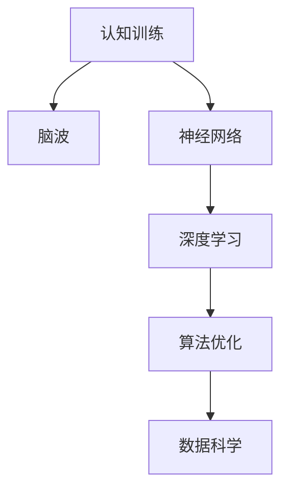

                 

# 认知训练：提升思维敏捷度

> 关键词：认知训练,思维敏捷度,脑波,神经网络,深度学习,算法优化,数据科学

## 1. 背景介绍

### 1.1 问题由来
认知训练是一种旨在通过特定训练方法提高个人认知能力的技术，特别是对于提升思维敏捷度、记忆力、注意力等方面具有显著效果。当前，认知训练主要应用于教育、健康、娱乐等领域，帮助人们提升个人能力，实现更高的工作和学习效率。

### 1.2 问题核心关键点
认知训练的核心在于通过数据科学和算法优化的方法，对人类认知过程进行建模和训练。其核心步骤包括：

- 数据收集：收集受训者的认知数据，如脑电波、眼动轨迹、行为数据等。
- 模型建立：构建数学模型或神经网络模型，对认知过程进行预测和分析。
- 算法优化：通过优化算法，提升模型的预测精度和稳定性。
- 应用部署：将训练好的模型应用于具体场景，实现认知能力的提升。

认知训练的效果，很大程度上取决于算法的优化和模型的性能。因此，本文将从算法原理、具体操作步骤、数学模型等多个方面，深入探讨认知训练的关键技术，以期为认知训练的发展提供指导。

## 2. 核心概念与联系

### 2.1 核心概念概述

为更好地理解认知训练，本节将介绍几个密切相关的核心概念：

- 认知训练(Cognitive Training)：通过特定训练方法提高个人认知能力，如记忆力、注意力、思维敏捷度等。
- 脑波(Brainwaves)：大脑神经元间的电信号活动，常用于脑机接口(Brain-Computer Interface, BCI)等技术中。
- 神经网络(Neural Networks)：模拟人脑神经元网络结构，通过学习训练数据，实现对认知过程的预测和分析。
- 深度学习(Deep Learning)：基于神经网络，通过多层次特征提取和数据建模，提升模型的预测能力。
- 算法优化(Algorithm Optimization)：通过优化算法，提升神经网络模型的训练效果和性能。

这些核心概念之间的逻辑关系可以通过以下Mermaid流程图来展示：



这个流程图展示了几类核心概念及其之间的关系：

1. 认知训练通过脑波、神经网络和深度学习等技术，对认知过程进行建模和训练。
2. 神经网络作为核心技术，通过多层特征提取，提升对认知过程的建模能力。
3. 深度学习通过多层次特征提取，进一步提升神经网络对认知过程的预测精度。
4. 算法优化通过对模型的调整和优化，提升训练效果和性能。
5. 数据科学为认知训练提供数据分析和验证支持。

这些概念共同构成了认知训练的核心技术框架，使其能够通过算法优化和数据驱动的方式，实现认知能力的提升。

## 3. 核心算法原理 & 具体操作步骤

### 3.1 算法原理概述

认知训练的核心算法，通常基于深度学习技术，通过构建神经网络模型，对认知过程进行建模和训练。其基本流程包括数据收集、模型建立、算法优化和结果评估等步骤。

- **数据收集**：收集受训者的认知数据，如脑电波、眼动轨迹、行为数据等。
- **模型建立**：构建神经网络模型，对认知过程进行预测和分析。
- **算法优化**：通过优化算法，提升模型的预测精度和稳定性。
- **结果评估**：通过评估指标，如准确率、召回率、F1分数等，评估模型性能。

### 3.2 算法步骤详解

#### 3.2.1 数据收集

1. **脑电波数据收集**：使用脑电图(Electroencephalogram, EEG)设备，收集受训者的脑电波数据。脑电波数据能够反映大脑的神经活动，是认知训练的重要数据来源。
2. **眼动轨迹数据收集**：通过眼动追踪器，记录受训者的眼动轨迹。眼动轨迹数据反映了视觉焦点和注意力变化，对认知训练也有重要意义。
3. **行为数据收集**：记录受训者的行为数据，如点击、滑动、选择等。行为数据能够反映认知任务的表现和效果。

#### 3.2.2 模型建立

1. **神经网络模型构建**：基于受训者的数据，构建神经网络模型。通常采用多层感知机(Multi-Layer Perceptron, MLP)、卷积神经网络(Convolutional Neural Network, CNN)等结构。
2. **特征提取层设计**：设计特征提取层，对原始数据进行降维和特征提取。常用的特征提取方法包括PCA(Principal Component Analysis)、LDA(Latent Dirichlet Allocation)等。
3. **输出层设计**：设计输出层，根据任务需求输出预测结果。通常采用softmax层实现多分类任务，回归层实现连续值预测等。

#### 3.2.3 算法优化

1. **损失函数设计**：根据任务需求，设计合适的损失函数。如分类任务通常使用交叉熵损失，回归任务通常使用均方误差损失等。
2. **优化器选择**：选择适合的优化器，如SGD、Adam等，调整学习率和批大小等超参数，优化模型的训练过程。
3. **正则化技术应用**：应用正则化技术，如L2正则、Dropout等，防止模型过拟合。
4. **超参数调优**：通过网格搜索、贝叶斯优化等方法，寻找最优的超参数组合。

#### 3.2.4 结果评估

1. **评估指标选择**：选择合适的评估指标，如准确率、召回率、F1分数等，评估模型的性能。
2. **交叉验证应用**：使用交叉验证方法，评估模型在训练集和测试集上的性能。
3. **误差分析**：对模型误差进行分析，识别模型的弱项和改进方向。

### 3.3 算法优缺点

认知训练基于深度学习技术，具有以下优点：

1. **预测精度高**：通过多层次特征提取，深度学习模型能够捕捉复杂的认知模式，提升预测精度。
2. **鲁棒性强**：神经网络模型具有较强的泛化能力，能够应对多种认知任务的挑战。
3. **数据驱动**：通过大量数据训练，深度学习模型能够自适应地调整参数，提高模型的性能。

同时，认知训练也存在一些局限性：

1. **计算成本高**：深度学习模型需要大量计算资源进行训练，对硬件设备的要求较高。
2. **模型复杂**：深度学习模型结构复杂，调试和维护难度较大。
3. **数据需求高**：深度学习模型对数据质量的要求较高，需要大量高质量的认知数据。

尽管存在这些局限性，但随着深度学习技术的不断进步，认知训练的应用范围和性能将得到进一步提升。未来，通过优化算法和改进模型结构，认知训练将变得更加高效和实用。

### 3.4 算法应用领域

认知训练技术已经广泛应用于多个领域，如教育、健康、娱乐等，具体应用如下：

- **教育领域**：认知训练用于提升学生的学习能力和记忆力。通过个性化训练，提高学生对知识的理解和掌握。
- **健康领域**：认知训练用于改善老年人的认知功能，如记忆力、注意力等。通过特定训练，延缓老年痴呆等认知疾病的发生。
- **娱乐领域**：认知训练用于开发认知类游戏，如脑电波游戏、眼动轨迹游戏等，提供娱乐和学习双重价值。

此外，认知训练还将在更多领域得到应用，如金融投资、体育训练、军事指挥等，为这些领域带来新的技术突破。

## 4. 数学模型和公式 & 详细讲解

### 4.1 数学模型构建

认知训练的数学模型通常基于深度学习技术，通过神经网络对认知过程进行建模和训练。以分类任务为例，其数学模型可以表示为：

$$
\hat{y} = M_{\theta}(x)
$$

其中 $x$ 为输入数据，$y$ 为标签，$\hat{y}$ 为模型预测结果，$M_{\theta}$ 为神经网络模型，$\theta$ 为模型参数。

### 4.2 公式推导过程

以二分类任务为例，假设模型 $M_{\theta}$ 在输入 $x$ 上的输出为 $\hat{y}=M_{\theta}(x) \in [0,1]$，表示样本属于正类的概率。则二分类交叉熵损失函数定义为：

$$
\ell(M_{\theta}(x),y) = -[y\log \hat{y} + (1-y)\log (1-\hat{y})]
$$

将其代入经验风险公式，得：

$$
\mathcal{L}(\theta) = -\frac{1}{N}\sum_{i=1}^N [y_i\log M_{\theta}(x_i)+(1-y_i)\log(1-M_{\theta}(x_i))]
$$

在得到损失函数的梯度后，即可带入参数更新公式，完成模型的迭代优化。

### 4.3 案例分析与讲解

以脑电波分类任务为例，假设脑电波数据 $x \in \mathbb{R}^{t \times d}$，其中 $t$ 为时间步长，$d$ 为特征维度。脑电波数据的前向传播和损失函数计算如下：

- **前向传播**：
$$
\hat{y} = \sigma(W^Tx + b)
$$

其中 $W$ 为权重矩阵，$b$ 为偏置项，$\sigma$ 为激活函数。

- **损失函数**：
$$
\ell(\hat{y},y) = \frac{1}{N}\sum_{i=1}^N \ell_i = \frac{1}{N}\sum_{i=1}^N [y_i\log \hat{y_i} + (1-y_i)\log (1-\hat{y_i})]
$$

- **梯度计算**：
$$
\frac{\partial \mathcal{L}(\theta)}{\partial \theta} = \frac{1}{N}\sum_{i=1}^N (\frac{y_i}{\hat{y_i}}-\frac{1-y_i}{1-\hat{y_i}}) \frac{\partial \hat{y_i}}{\partial \theta}
$$

- **反向传播**：
$$
\frac{\partial \hat{y_i}}{\partial \theta} = W^T \frac{\partial \ell_i}{\partial \hat{y_i}} \cdot \frac{\partial \hat{y_i}}{\partial z_i} \cdot \frac{\partial z_i}{\partial \theta}
$$

通过上述公式，可以高效计算出模型的损失函数和梯度，进而完成模型的训练和优化。

## 5. 项目实践：代码实例和详细解释说明

### 5.1 开发环境搭建

在进行认知训练项目开发前，需要准备开发环境。以下是使用Python进行TensorFlow开发的环境配置流程：

1. 安装Anaconda：从官网下载并安装Anaconda，用于创建独立的Python环境。

2. 创建并激活虚拟环境：
```bash
conda create -n cognitive-training python=3.8 
conda activate cognitive-training
```

3. 安装TensorFlow：根据CUDA版本，从官网获取对应的安装命令。例如：
```bash
conda install tensorflow -c pytorch -c conda-forge
```

4. 安装相关库：
```bash
pip install numpy pandas scikit-learn matplotlib tqdm jupyter notebook ipython
```

完成上述步骤后，即可在`cognitive-training`环境中开始认知训练项目开发。

### 5.2 源代码详细实现

下面以脑电波分类任务为例，给出使用TensorFlow进行神经网络模型构建和微调的PyTorch代码实现。

```python
import tensorflow as tf
import numpy as np
from sklearn.model_selection import train_test_split
from sklearn.metrics import accuracy_score

# 加载脑电波数据
data = np.loadtxt('eeg_data.txt', delimiter=',')
X = data[:, :-1]  # 特征数据
y = data[:, -1]  # 标签数据

# 划分训练集和测试集
X_train, X_test, y_train, y_test = train_test_split(X, y, test_size=0.2, random_state=42)

# 构建神经网络模型
model = tf.keras.models.Sequential([
    tf.keras.layers.Dense(64, activation='relu', input_shape=(X_train.shape[1],)),
    tf.keras.layers.Dense(32, activation='relu'),
    tf.keras.layers.Dense(1, activation='sigmoid')
])

# 编译模型
model.compile(optimizer='adam', loss='binary_crossentropy', metrics=['accuracy'])

# 训练模型
model.fit(X_train, y_train, epochs=10, batch_size=32, validation_data=(X_test, y_test))

# 评估模型
y_pred = model.predict(X_test)
y_pred = (y_pred > 0.5).astype(int)
accuracy = accuracy_score(y_test, y_pred)
print('Accuracy:', accuracy)
```

### 5.3 代码解读与分析

让我们再详细解读一下关键代码的实现细节：

- **数据加载**：通过`np.loadtxt`加载脑电波数据，并将其分为特征数据`X`和标签数据`y`。
- **数据划分**：使用`train_test_split`将数据划分为训练集和测试集。
- **模型构建**：使用`tf.keras`构建神经网络模型，包含三个全连接层。
- **模型编译**：使用`compile`方法编译模型，设置优化器、损失函数和评估指标。
- **模型训练**：使用`fit`方法训练模型，设置训练轮数和批大小，同时指定验证集。
- **模型评估**：使用`predict`方法对测试集进行预测，并计算预测准确率。

可以看到，TensorFlow提供了简便易用的API，使得神经网络模型的构建和训练变得非常直观。开发者可以专注于算法设计和数据处理等核心环节，而不必过多关注底层的细节。

## 6. 实际应用场景

### 6.1 智能教育系统

认知训练技术可以应用于智能教育系统中，提升学生的学习能力和认知水平。通过分析学生的脑电波和眼动轨迹，智能教育系统能够实时监测学生的注意力和学习状态，及时调整教学内容和节奏。

在技术实现上，可以构建基于深度学习的认知分析模型，对学生的认知数据进行实时监测和分析。根据分析结果，智能教育系统可以提供个性化的学习建议，调整教学策略，帮助学生提高学习效果。

### 6.2 健康监测系统

认知训练技术可以应用于健康监测系统中，改善老年人的认知功能，延缓老年痴呆等认知疾病的发生。通过分析老年人的脑电波和行为数据，健康监测系统能够实时监测老年人的认知状态，提供针对性的干预措施。

在技术实现上，可以构建基于深度学习的认知分析模型，对老年人的认知数据进行实时监测和分析。根据分析结果，健康监测系统可以提供个性化的健康建议，调整干预策略，帮助老年人保持认知健康。

### 6.3 娱乐游戏

认知训练技术可以应用于娱乐游戏中，提供更丰富、更高效的娱乐体验。通过分析玩家的游戏行为和脑电波数据，娱乐游戏可以实时监测玩家的注意力和情绪状态，提供个性化的游戏建议，增强游戏的互动性和趣味性。

在技术实现上，可以构建基于深度学习的认知分析模型，对玩家的游戏数据进行实时监测和分析。根据分析结果，娱乐游戏可以提供个性化的游戏内容，调整游戏难度，增强玩家的参与感和体验感。

### 6.4 未来应用展望

随着认知训练技术的不断进步，未来将会有更多的应用场景涌现。

- **金融投资**：认知训练可以应用于金融投资领域，帮助投资者分析市场数据，优化投资决策。通过分析投资者的认知状态和情绪，智能投资系统可以提供个性化的投资建议，提升投资效果。
- **军事指挥**：认知训练可以应用于军事指挥领域，帮助指挥官分析战场数据，制定战术策略。通过分析指挥官的认知状态和决策行为，智能指挥系统可以提供个性化的指挥建议，提升指挥效率。
- **体育训练**：认知训练可以应用于体育训练领域，帮助运动员分析训练数据，提升训练效果。通过分析运动员的认知状态和身体状态，智能训练系统可以提供个性化的训练建议，提升训练质量和成绩。

总之，认知训练技术将会在更多领域得到应用，为各行业的智能化发展提供新的技术手段。

## 7. 工具和资源推荐

### 7.1 学习资源推荐

为了帮助开发者系统掌握认知训练的理论基础和实践技巧，这里推荐一些优质的学习资源：

1. 《深度学习理论与实践》系列博文：由大模型技术专家撰写，深入浅出地介绍了深度学习理论、算法优化和实际应用。

2. 《神经网络与深度学习》课程：斯坦福大学开设的神经网络经典课程，详细讲解了神经网络的基本原理和经典模型。

3. 《认知科学》书籍：介绍认知科学的基本理论和认知训练方法，提供理论支持和技术指引。

4. TensorFlow官方文档：TensorFlow的官方文档，提供了丰富的API文档和样例代码，是学习认知训练的重要资源。

5. arXiv论文库：包含大量关于认知训练的最新研究成果，提供理论前沿和技术方向。

通过对这些资源的学习实践，相信你一定能够快速掌握认知训练的精髓，并用于解决实际的认知问题。

### 7.2 开发工具推荐

高效的开发离不开优秀的工具支持。以下是几款用于认知训练开发的常用工具：

1. TensorFlow：基于Python的开源深度学习框架，灵活动态的计算图，适合快速迭代研究。

2. PyTorch：基于Python的开源深度学习框架，灵活的动态计算图，适合灵活设计神经网络模型。

3. Jupyter Notebook：提供交互式编程环境，方便快速迭代和调试。

4. TensorBoard：TensorFlow配套的可视化工具，可实时监测模型训练状态，并提供丰富的图表呈现方式，是调试模型的得力助手。

5. Weights & Biases：模型训练的实验跟踪工具，可以记录和可视化模型训练过程中的各项指标，方便对比和调优。

合理利用这些工具，可以显著提升认知训练任务的开发效率，加快创新迭代的步伐。

### 7.3 相关论文推荐

认知训练的研究源于学界的持续研究。以下是几篇奠基性的相关论文，推荐阅读：

1. "Brain Computer Interface: An Overview"（脑机接口综述）：概述了脑机接口技术的现状和应用前景，提供理论支持和技术指引。

2. "Deep Brain Stimulation for Epilepsy"（深度脑刺激治疗癫痫）：展示了深度脑刺激技术在癫痫治疗中的应用，提供实践案例和技术细节。

3. "Deep Learning in Neuroimaging"（神经成像中的深度学习）：介绍了深度学习在神经成像中的应用，提供算法和模型细节。

4. "Cognitive Training: A Review of Neurocognitive Interventions"（认知训练综述）：综述了认知训练的历史、现状和未来方向，提供理论支持和技术指引。

5. "Cognitive Enhancement with Deep Learning"（深度学习增强认知）：展示了深度学习在认知增强中的应用，提供理论和实践案例。

这些论文代表了大模型微调技术的发展脉络。通过学习这些前沿成果，可以帮助研究者把握学科前进方向，激发更多的创新灵感。

## 8. 总结：未来发展趋势与挑战

### 8.1 总结

本文对认知训练技术进行了全面系统的介绍。首先阐述了认知训练的背景和意义，明确了认知训练在提升思维敏捷度、记忆力、注意力等方面的独特价值。其次，从原理到实践，详细讲解了认知训练的关键技术，包括数据收集、模型建立、算法优化等环节，给出了认知训练任务开发的完整代码实例。同时，本文还广泛探讨了认知训练在教育、健康、娱乐等多个行业领域的应用前景，展示了认知训练技术的广泛应用潜力。最后，本文精选了认知训练技术的各类学习资源，力求为读者提供全方位的技术指引。

通过本文的系统梳理，可以看到，认知训练技术正在成为提高认知能力的重要手段，极大地拓展了人类认知智能的边界，催生了更多的应用场景。未来，伴随深度学习技术的不断进步，认知训练技术将进一步成熟和完善，为人类认知智能的进化带来深远影响。

### 8.2 未来发展趋势

展望未来，认知训练技术将呈现以下几个发展趋势：

1. **算法优化**：随着深度学习技术的不断进步，认知训练算法将更加高效和精确。神经网络模型的结构和参数将进一步优化，提高训练速度和效果。
2. **数据驱动**：认知训练将更加依赖于高质量的认知数据，通过数据驱动的方式，提升模型的性能和泛化能力。
3. **多模态融合**：认知训练将拓展到多模态数据的融合，如脑电波、眼动轨迹、行为数据等，提升对认知过程的全面建模。
4. **个性化定制**：认知训练将更加注重个性化定制，根据用户的认知特点和需求，提供个性化的训练方案。
5. **智能决策**：认知训练将结合智能决策技术，提升对认知过程的实时监测和干预能力，提高训练效果。

这些趋势凸显了认知训练技术的广阔前景。这些方向的探索发展，必将进一步提升认知训练的性能和应用范围，为人类认知智能的进化带来深远影响。

### 8.3 面临的挑战

尽管认知训练技术已经取得了显著进展，但在迈向更加智能化、普适化应用的过程中，它仍面临着诸多挑战：

1. **计算成本高**：深度学习模型需要大量计算资源进行训练，对硬件设备的要求较高。
2. **数据隐私问题**：脑电波和行为数据涉及个人隐私，如何在保护隐私的前提下进行数据收集和分析，是一个重要问题。
3. **模型解释性不足**：认知训练模型通常缺乏可解释性，难以对其决策过程进行分析和调试。
4. **应用场景多样化**：认知训练技术需要适应不同的应用场景，如教育、健康、娱乐等，开发难度较大。
5. **模型鲁棒性不足**：认知训练模型面对域外数据时，泛化性能往往大打折扣，鲁棒性有待提升。

尽管存在这些挑战，但随着深度学习技术的不断进步，认知训练技术的应用前景仍然广阔。未来，通过优化算法和改进模型结构，认知训练技术将变得更加高效和实用。

### 8.4 研究展望

面对认知训练面临的种种挑战，未来的研究需要在以下几个方面寻求新的突破：

1. **多模态数据融合**：将脑电波、眼动轨迹、行为数据等多模态数据进行融合，提升对认知过程的全面建模。
2. **算法优化**：开发更加高效和精确的算法，优化神经网络模型的结构和参数。
3. **数据隐私保护**：采用数据隐私保护技术，确保数据收集和分析的合法性和安全性。
4. **可解释性增强**：开发可解释性强的认知训练模型，增强模型的透明性和可解释性。
5. **应用场景拓展**：将认知训练技术应用于更多领域，如金融、军事、体育等，拓展认知训练的应用范围。

这些研究方向的探索，必将引领认知训练技术迈向更高的台阶，为人类认知智能的进化带来深远影响。面向未来，认知训练技术还需要与其他人工智能技术进行更深入的融合，如知识表示、因果推理、强化学习等，多路径协同发力，共同推动认知训练技术的进步。只有勇于创新、敢于突破，才能不断拓展认知训练技术的边界，让智能技术更好地造福人类社会。

## 9. 附录：常见问题与解答

**Q1：认知训练是否适用于所有人群？**

A: 认知训练技术适用于大多数人群，特别是对于学生、老年人和特殊人群等具有认知需求的人群。但在特定情况下，如神经病变、精神疾病等，需要在使用前咨询专业医生。

**Q2：如何选择合适的训练时间和频率？**

A: 认知训练的训练时间和频率需要根据具体人群和任务进行调整。一般建议每天进行1-2次，每次30分钟以上，具体时间和频率需要根据个人情况和训练效果进行调整。

**Q3：认知训练是否对大脑有损伤？**

A: 目前没有证据表明认知训练对大脑有损伤。但需要注意，认知训练时应避免过度训练，以免引起疲劳和不适。

**Q4：认知训练的效果如何评估？**

A: 认知训练的效果评估通常使用认知评估量表，如MMSE(简易精神状态检查表)、CASP(认知能力评估量表)等，通过对比训练前后的评估结果，评估认知训练的效果。

**Q5：认知训练有哪些潜在风险？**

A: 认知训练存在一定的潜在风险，如数据隐私泄露、训练过度等。在使用认知训练技术时，需要遵循相关法律法规，保护个人隐私，避免训练过度。

通过本文的系统梳理，可以看到，认知训练技术正在成为提高认知能力的重要手段，极大地拓展了人类认知智能的边界，催生了更多的应用场景。未来，伴随深度学习技术的不断进步，认知训练技术将进一步成熟和完善，为人类认知智能的进化带来深远影响。总之，认知训练技术需要在算法优化、数据隐私保护、可解释性增强等多个方面不断探索和突破，才能实现更加智能化、普适化的应用。

