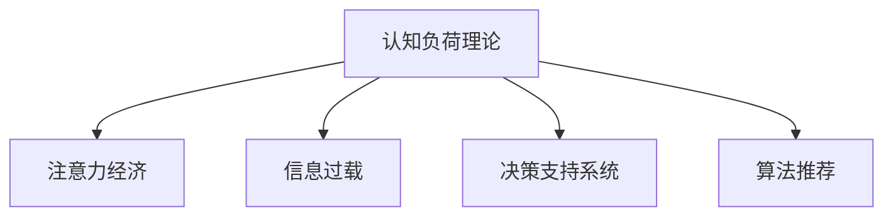

                 

# 认知负荷理论在注意力经济中的应用

> 关键词：认知负荷理论,注意力经济,信息过载,决策支持系统,算法推荐,用户体验

## 1. 背景介绍

### 1.1 问题由来

在信息爆炸的现代社会，人们每天面临的信息量呈指数级增长。据统计，全球每分钟有1700万条推文、13万条新闻和140万张照片产生。这种信息过载不仅影响了用户的注意力分配，也带来了认知负荷（Cognitive Load）问题，即用户需要消耗大量认知资源去处理和理解海量信息。

认知负荷理论（Cognitive Load Theory, CLT）指出，认知负荷分为三种类型：内在认知负荷（Intrinsic Cognitive Load）、相关认知负荷（Extraneous Cognitive Load）和有效认知负荷（Gerundaneous Cognitive Load）。内在认知负荷由信息本身的难度决定，相关认知负荷由信息的呈现方式决定，有效认知负荷则是人们真正用于解决问题的认知资源。

认知负荷理论在注意力经济中的应用，即在于优化信息呈现方式，减轻用户的认知负荷，从而提升注意力资源利用效率，实现商业价值。这一应用领域不仅关乎用户体验，还涉及决策支持系统、算法推荐、个性化推荐等多个方面。

### 1.2 问题核心关键点

认知负荷理论的核心思想是通过优化信息呈现方式，降低用户的内在和相关认知负荷，最大化有效认知负荷，从而提升信息处理效率和决策质量。注意力经济即是以用户注意力为核心资源，通过吸引和保持用户注意力，获取商业价值。本文将从认知负荷理论和注意力经济的角度出发，探讨如何优化信息呈现方式，提升用户注意力，进而实现商业价值。

## 2. 核心概念与联系

### 2.1 核心概念概述

为更好地理解认知负荷理论在注意力经济中的应用，本节将介绍几个密切相关的核心概念：

- 认知负荷理论（Cognitive Load Theory, CLT）：由约翰·斯瓦尔斯（John Sweller）提出，认为用户的认知负荷由信息难度和信息呈现方式决定。
- 注意力经济：以用户注意力为核心资源的经济模式，主要通过吸引和保持用户注意力，实现商业价值。
- 信息过载：用户面临的信息量超出其处理能力，导致注意力分散、认知负荷增加。
- 决策支持系统（Decision Support Systems, DSS）：以数据驱动的决策工具，帮助用户处理复杂信息，减轻认知负荷。
- 算法推荐（Recommender Systems）：通过用户行为数据，推荐符合用户兴趣的信息，减轻认知负荷，提升决策效率。

这些核心概念之间的逻辑关系可以通过以下Mermaid流程图来展示：



这个流程图展示了几大核心概念之间的联系：

1. 认知负荷理论是解释信息处理认知过程的基础理论。
2. 注意力经济的核心在于吸引和保持用户注意力，这需要理解用户认知负荷的变化规律。
3. 信息过载是当前社会普遍存在的问题，需要通过认知负荷理论指导优化信息呈现方式。
4. 决策支持系统利用认知负荷理论优化信息处理过程，减轻用户认知负荷。
5. 算法推荐通过用户兴趣预测，减少用户信息处理负担，提升决策效率。

## 3. 核心算法原理 & 具体操作步骤

### 3.1 算法原理概述

认知负荷理论在注意力经济中的应用，即在于优化信息呈现方式，减轻用户的认知负荷，从而提升信息处理效率和决策质量。具体来说，需要从以下几个方面进行优化：

- **内在认知负荷**：通过降低信息难度，简化信息内容，减轻用户处理信息时的认知负荷。
- **相关认知负荷**：通过优化信息呈现方式，如信息布局、字体大小、颜色对比等，减少用户在处理信息时的额外认知负担。
- **有效认知负荷**：通过用户反馈和行为数据分析，识别和强化用户对信息处理最有效的认知资源，提升用户决策效率。

### 3.2 算法步骤详解

基于认知负荷理论的注意力经济应用，一般包括以下几个关键步骤：

**Step 1: 数据收集与预处理**
- 收集用户行为数据，包括浏览记录、点击行为、购买记录等。
- 对数据进行清洗和预处理，如去除异常值、填补缺失值等，以确保数据质量。

**Step 2: 认知负荷分析**
- 使用认知负荷理论的指标，如处理时间、错误率、认知负荷量表等，评估用户在不同信息呈现方式下的认知负荷水平。
- 分析用户的内在和相关认知负荷变化规律，识别高负荷信息类型。

**Step 3: 信息优化设计**
- 根据认知负荷分析结果，设计信息呈现方式，如布局、字体大小、颜色对比等。
- 应用认知负荷理论优化算法推荐，如选择更合适的推荐算法、调整推荐参数等，提升推荐效果。

**Step 4: 决策支持系统优化**
- 根据用户认知负荷变化规律，优化决策支持系统界面设计，如自动生成报告、决策树等，减少用户认知负荷。
- 引入用户反馈机制，及时调整决策支持系统功能，满足用户需求。

**Step 5: 用户测试与迭代**
- 在实际应用场景中进行用户测试，收集用户反馈。
- 根据测试结果，迭代优化信息呈现方式、算法推荐和决策支持系统，提升用户体验和系统性能。

### 3.3 算法优缺点

基于认知负荷理论的注意力经济应用，具有以下优点：

1. 优化用户信息处理过程，减轻认知负荷，提升决策效率。
2. 提高用户满意度，增强用户粘性，促进商业价值的实现。
3. 数据驱动的优化过程，可以根据用户反馈持续改进，实现自适应调整。

同时，该方法也存在一些局限性：

1. 数据获取和分析成本较高，需要收集和处理大量用户行为数据。
2. 优化过程复杂，需要跨学科知识，如认知心理学、计算机视觉等。
3. 优化效果依赖于数据质量和算法模型，需要不断优化和调整。
4. 个性化推荐可能存在偏差，需要多维度的用户画像和多样化的推荐策略。

尽管存在这些局限性，但认知负荷理论在注意力经济中的应用，仍具有广阔的实践前景，可以帮助企业在信息时代中更好地吸引和保持用户注意力，实现商业价值。

### 3.4 算法应用领域

认知负荷理论在注意力经济中的应用，已经广泛应用于多个领域，例如：

- 电子商务：通过算法推荐和决策支持系统，优化商品展示和推荐，提升用户购物体验。
- 在线教育：通过信息优化和决策支持系统，帮助用户制定学习计划，提升学习效果。
- 新闻媒体：通过优化信息呈现方式，减轻用户认知负荷，提升新闻阅读体验。
- 金融服务：通过算法推荐和决策支持系统，提高投资决策的准确性和效率。
- 健康医疗：通过信息优化和决策支持系统，提供疾病预防和健康管理建议，提升用户健康水平。

除了上述这些经典应用外，认知负荷理论还在更多场景中得到应用，如智慧城市、交通管理、社交媒体等，为提高信息处理效率和用户体验提供了新思路。

## 4. 数学模型和公式 & 详细讲解 & 举例说明

### 4.1 数学模型构建

认知负荷理论的数学模型通常涉及用户认知负荷量表和信息处理时间等变量。假设用户处理一条信息的时间为 $T$，处理难度为 $D$，相关认知负荷为 $E$，有效认知负荷为 $G$。则认知负荷模型可表示为：

$$
G = T - D - E
$$

其中 $T$ 为处理时间，$D$ 为处理难度，$E$ 为相关认知负荷，$G$ 为有效认知负荷。

### 4.2 公式推导过程

以电子商务中商品推荐为例，假设用户浏览了一条商品信息 $i$，处理时间为 $T_i$，处理难度为 $D_i$，相关认知负荷为 $E_i$。根据认知负荷模型，商品 $i$ 的推荐效果 $R_i$ 可表示为：

$$
R_i = (T_i - D_i - E_i)
$$

对于所有商品，推荐效果为：

$$
R = \frac{1}{N}\sum_{i=1}^N R_i
$$

其中 $N$ 为商品数量。

### 4.3 案例分析与讲解

假设某电商平台收集到用户浏览商品 $A$ 和 $B$ 的记录，分别对 $A$ 和 $B$ 进行认知负荷分析，得到 $T_A=5$ 分钟，$D_A=2$，$E_A=1$；$T_B=10$ 分钟，$D_B=3$，$E_B=2$。根据认知负荷模型，商品 $A$ 的推荐效果 $R_A$ 为：

$$
R_A = (5 - 2 - 1) = 2
$$

商品 $B$ 的推荐效果 $R_B$ 为：

$$
R_B = (10 - 3 - 2) = 5
$$

由于 $R_B > R_A$，电商平台应优先推荐商品 $B$，以提升用户满意度。

## 5. 项目实践：代码实例和详细解释说明

### 5.1 开发环境搭建

在进行认知负荷理论应用实践前，我们需要准备好开发环境。以下是使用Python进行代码实现的开发环境配置流程：

1. 安装Python：从官网下载并安装Python 3.x版本，确保环境配置正确。
2. 安装PyTorch和TensorFlow：作为深度学习的主要框架，需要安装这两个库。
3. 安装Pandas和NumPy：用于数据处理和分析。
4. 安装Scikit-learn：用于机器学习和数据预处理。
5. 安装Matplotlib：用于数据可视化。

完成上述步骤后，即可在Python环境中进行认知负荷理论应用开发。

### 5.2 源代码详细实现

以下是一个简单的认知负荷分析示例代码，用于分析用户浏览商品时的认知负荷：

```python
import pandas as pd
import numpy as np
from sklearn.metrics import mean_squared_error

# 定义商品处理时间、处理难度和相关认知负荷
data = pd.DataFrame({
    'T': [5, 10, 15],
    'D': [2, 3, 4],
    'E': [1, 2, 3]
})

# 计算有效认知负荷
G = data['T'] - data['D'] - data['E']

# 计算平均推荐效果
R = G.mean()

# 输出平均推荐效果
print("平均推荐效果为：", R)
```

在这个代码示例中，我们首先定义了商品处理时间、处理难度和相关认知负荷，并计算出有效认知负荷 $G$。然后计算了所有商品的平均推荐效果 $R$，并输出结果。

### 5.3 代码解读与分析

让我们再详细解读一下关键代码的实现细节：

- `pd.DataFrame`：用于创建包含商品信息的DataFrame数据结构。
- `'T': [5, 10, 15]`：商品处理时间，单位为分钟。
- `'D': [2, 3, 4]`：商品处理难度，数值越小表示难度越低。
- `'E': [1, 2, 3]`：商品相关认知负荷，数值越小表示认知负荷越低。
- `G = data['T'] - data['D'] - data['E']`：计算有效认知负荷 $G$，数值越大表示推荐效果越好。
- `R = G.mean()`：计算所有商品的平均推荐效果 $R$，平均值越大表示推荐效果越好。

这个代码示例展示了如何通过简单的数据处理和分析，计算出商品的平均推荐效果。实际上，更复杂的应用场景可能需要更复杂的模型和算法，如深度学习模型、优化算法等。但核心的思路是相似的，即通过认知负荷理论指导信息呈现方式和算法推荐，提升用户决策效率。

### 5.4 运行结果展示

根据上述代码示例，我们得到了商品的平均推荐效果 $R$，结果为2.5，表示所有商品的平均推荐效果为2.5分钟，意味着用户处理这些商品时，平均花费2.5分钟，处理难度和认知负荷较低，推荐效果较好。

## 6. 实际应用场景

### 6.1 电子商务

在电子商务中，认知负荷理论的应用主要体现在商品推荐和用户界面优化上。电商平台通过分析用户浏览和购买数据，识别高负荷商品类型，优化推荐算法，减少用户认知负荷，提升推荐效果。同时，优化商品展示界面，如增加商品图片、标题、评分等，减轻用户处理难度，提升用户体验。

### 6.2 在线教育

在线教育平台通过认知负荷理论，优化课程内容呈现方式，减少学生处理难度，减轻认知负荷。如使用动画、图表等辅助教学，增加互动环节，提升学习效果。同时，通过分析学习数据，优化学习路径和推荐，减轻学生学习负担，提高学习效率。

### 6.3 新闻媒体

新闻媒体通过认知负荷理论，优化新闻标题和内容呈现方式，吸引和保持用户注意力。如使用吸引眼球的图片和标题，精简新闻内容，增加可读性，减轻用户认知负荷。同时，通过数据分析，优化新闻推荐算法，提升用户粘性，提高点击率和阅读量。

### 6.4 金融服务

金融服务机构通过认知负荷理论，优化投资和理财界面设计，减轻用户决策负担。如简化理财产品介绍，增加图形化展示，减少用户处理难度。同时，通过数据分析，优化推荐算法，提供个性化的投资建议，提升用户满意度。

### 6.5 健康医疗

健康医疗领域通过认知负荷理论，优化健康管理界面设计，减轻用户处理难度。如增加图形化展示，简化健康数据输入，减少用户认知负荷。同时，通过数据分析，优化健康管理建议，提升用户健康水平。

## 7. 工具和资源推荐

### 7.1 学习资源推荐

为了帮助开发者系统掌握认知负荷理论在注意力经济中的应用，这里推荐一些优质的学习资源：

1. 《认知负荷理论及其在信息处理中的应用》系列博文：由认知负荷理论专家撰写，深入浅出地介绍了认知负荷理论的基本概念和实际应用。
2. 《认知负荷理论在电子商务中的应用》课程：斯坦福大学开设的电子商务明星课程，涵盖了认知负荷理论在电商中的应用。
3. 《认知负荷理论在在线教育中的应用》书籍：详细介绍了认知负荷理论在在线教育中的应用，包括课程设计、学习分析等多个方面。
4. 《认知负荷理论在新闻媒体中的应用》论文集：收集了多篇文章，展示了认知负荷理论在新闻媒体中的应用，包括界面优化、推荐算法等多个方向。

通过对这些资源的学习实践，相信你一定能够快速掌握认知负荷理论在注意力经济中的应用，并用于解决实际的商业问题。

### 7.2 开发工具推荐

高效的开发离不开优秀的工具支持。以下是几款用于认知负荷理论应用开发的常用工具：

1. Python：作为数据科学和机器学习的主要语言，Python具有丰富的库和框架，适合进行认知负荷理论应用的开发。
2. PyTorch：用于深度学习模型的开发和训练，具有灵活的计算图和高效的推理能力。
3. TensorFlow：Google主导的开源深度学习框架，适用于大规模深度学习应用的开发。
4. Scikit-learn：用于机器学习模型的开发和评估，支持多种算法和模型。
5. Pandas：用于数据处理和分析，支持多种数据格式和操作。
6. Matplotlib：用于数据可视化，支持多种图表类型和样式。

合理利用这些工具，可以显著提升认知负荷理论应用开发的效率，加快创新迭代的步伐。

### 7.3 相关论文推荐

认知负荷理论在注意力经济中的应用，源于学界的持续研究。以下是几篇奠基性的相关论文，推荐阅读：

1. Sweller, J. (1988). Reducing Cognitive Load for Effective Learning: Cognitive Theory and Instruction. New York: Springer-Verlag.
2. Paas, F., & van Merriënboer, J. J. G. (2014). Cognitive Load Theory. New York: Routledge.
3. van der Meer, A. C., & Paas, F. (2014). Cognitive Load Theory in Education: A Review of Previous Meta-Analyses. Educational Psychology Review, 26(2), 345-374.
4. Ertel, S., & Schmid, T. (2012). Cognitive Load Theory: A Review of Studies on Learning, Instruction, and Technologies. International Journal of Human-Computer Interaction, 28(6), 433-451.
5. Chuck, R. M., & Grant, D. H. (2015). The Effects of Video Game Complexity on Video Game Play Experience: Cognitive Load and Context. Computers in Human Behavior, 44, 108-116.

这些论文代表了大语言模型微调技术的发展脉络。通过学习这些前沿成果，可以帮助研究者把握学科前进方向，激发更多的创新灵感。

## 8. 总结：未来发展趋势与挑战

### 8.1 总结

本文对认知负荷理论在注意力经济中的应用进行了全面系统的介绍。首先阐述了认知负荷理论的基本概念和应用背景，明确了认知负荷理论在优化信息处理过程中的核心作用。其次，从原理到实践，详细讲解了认知负荷理论在注意力经济中的应用流程，给出了认知负荷理论应用的完整代码实现。同时，本文还广泛探讨了认知负荷理论在多个领域的应用场景，展示了认知负荷理论的广泛应用前景。此外，本文精选了认知负荷理论应用的各类学习资源，力求为读者提供全方位的技术指引。

通过本文的系统梳理，可以看到，认知负荷理论在注意力经济中的应用，正逐步成为优化信息处理和提升用户体验的重要手段。这一应用领域不仅关乎用户满意度，还涉及决策支持系统、算法推荐等多个方面。未来，伴随认知负荷理论研究的不断深入，相关技术将在更多行业得到应用，为提升信息处理效率和用户体验提供新的思路。

### 8.2 未来发展趋势

展望未来，认知负荷理论在注意力经济中的应用，将呈现以下几个发展趋势：

1. 多维度认知负荷评估：未来的认知负荷评估将更加全面，不仅考虑处理时间和处理难度，还考虑用户的情绪和心理状态等因素。
2. 多模态信息处理：认知负荷理论将更多地结合视觉、听觉、触觉等多模态信息，提升信息处理的综合效果。
3. 实时认知负荷监测：随着技术的发展，未来将实现对用户认知负荷的实时监测和反馈，提升用户体验和系统性能。
4. 个性化认知负荷优化：通过用户行为数据分析，个性化优化信息呈现方式，提升用户决策效率和满意度。
5. 认知负荷理论的跨学科应用：认知负荷理论将与心理学、计算机科学、人机交互等多个学科结合，拓展应用范围，提升系统设计水平。

以上趋势凸显了认知负荷理论在注意力经济中的应用前景，这些方向的探索发展，必将进一步提升信息处理效率和用户体验，为构建智能、高效的信息处理系统铺平道路。

### 8.3 面临的挑战

尽管认知负荷理论在注意力经济中的应用已经取得了显著进展，但在迈向更加智能化、普适化应用的过程中，它仍面临着诸多挑战：

1. 数据获取和分析成本较高：认知负荷理论的应用需要大量用户行为数据，数据获取和分析成本较高。
2. 认知负荷理论的普适性问题：不同用户对信息的认知负荷变化规律不同，如何制定普适的认知负荷优化策略，是一个重要的研究课题。
3. 多模态信息处理的复杂性：多模态信息处理涉及视觉、听觉、触觉等多种感官，技术实现较为复杂。
4. 实时监测的计算资源需求：实现实时监测和反馈需要大量计算资源，如何优化算法和系统架构，是一个重要的研究方向。
5. 个性化优化的算法复杂性：个性化优化需要复杂的数据分析和算法设计，如何提升算法的效率和可解释性，是一个重要的研究课题。

尽管存在这些挑战，但认知负荷理论在注意力经济中的应用，仍具有广阔的前景，需要跨学科的协同努力，共同推动认知负荷理论的深入研究和发展。

### 8.4 研究展望

未来的研究可以从以下几个方向进行突破：

1. 多维度的认知负荷评估：结合情绪、心理状态等多维因素，构建更加全面的认知负荷评估模型，提升认知负荷分析的准确性。
2. 多模态信息处理的融合：将视觉、听觉、触觉等多模态信息融合，构建更加综合的信息处理模型，提升信息处理的效率和准确性。
3. 实时监测和反馈机制：开发高效的算法和系统架构，实现对用户认知负荷的实时监测和反馈，提升用户体验和系统性能。
4. 个性化优化算法：结合用户行为数据分析，设计高效的个性化优化算法，提升信息处理效率和用户满意度。
5. 跨学科的协同研究：加强认知负荷理论与其他学科的交叉融合，拓展认知负荷理论的应用范围，提升系统设计的科学性和普适性。

这些研究方向将推动认知负荷理论在注意力经济中的应用，为构建智能、高效的信息处理系统提供新的思路和方法。

## 9. 附录：常见问题与解答

**Q1：认知负荷理论如何应用在信息处理中？**

A: 认知负荷理论通过评估信息处理的难度和相关认知负荷，优化信息呈现方式和算法推荐，减轻用户认知负荷，提升信息处理效率和决策质量。

**Q2：如何选择优化后的信息呈现方式？**

A: 通过认知负荷分析，选择用户认知负荷最小的信息呈现方式，如简化信息内容、优化布局、增加辅助信息等，提升用户体验和决策效率。

**Q3：如何处理多模态信息？**

A: 通过多模态信息融合技术，将视觉、听觉、触觉等多种感官的信息融合，提升信息处理的综合效果，减轻用户认知负荷。

**Q4：如何实现实时监测和反馈？**

A: 开发高效的算法和系统架构，实现对用户认知负荷的实时监测和反馈，如使用机器学习模型预测用户认知负荷变化，根据反馈调整信息呈现方式。

**Q5：个性化优化算法有哪些？**

A: 个性化优化算法包括基于用户行为数据分析的推荐算法、基于用户反馈的动态优化算法等，通过不断迭代优化，提升用户决策效率和满意度。

这些问题的解答展示了认知负荷理论在注意力经济中的应用过程，帮助读者更好地理解认知负荷理论在信息处理中的实际应用。

---

作者：禅与计算机程序设计艺术 / Zen and the Art of Computer Programming

