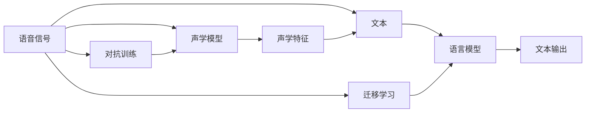

                 

## 1. 背景介绍

### 1.1 问题由来

随着人工智能技术的快速发展，语音识别技术在过去十年间取得了显著进展。从最初的按键式语音控制，到智能音箱中的语音助手，再到智能手机上的语音输入，语音识别技术已深刻改变了人们与数字设备交互的方式。然而，传统的语音识别技术依然存在许多局限性。例如，识别准确率受制于环境噪声、口音差异、方言多样性，用户与机器的交互体验并不理想。

语音识别技术的突破需求催生了大量初创公司。这些公司从简单的语音识别功能开始，逐步构建起具有情感识别、多语种支持、实时反馈和跨平台适配等多样功能的产品，逐步走向市场。与此同时，这些公司也在不断探索新的商业模式，以期在激烈的市场竞争中脱颖而出。

### 1.2 问题核心关键点

语音识别创业的关键在于如何构建一个既具有高性能又具备广泛适用性的语音识别系统，并能够在实际应用中实现良好的用户体验和稳定的商业模式。

核心关键点包括：

- **高性能**：语音识别系统需要在各种环境下具有高准确率，如嘈杂的公共场所、安静的家庭环境等。
- **多语种支持**：语音识别系统需要具备多种语言的识别能力，满足不同地区用户需求。
- **实时反馈**：语音识别系统需要能够实时处理用户语音，并根据语境提供快速反馈。
- **跨平台适配**：语音识别系统需要在各种硬件和操作系统上能够无缝集成。
- **用户体验**：语音识别系统需要具备自然、流畅的用户交互体验，避免冷冰冰的机器语音输出。
- **商业模式**：语音识别创业需要探索合适的盈利模式，如软件即服务(SaaS)、硬件销售、订阅制等。

要实现这些关键点，不仅需要强大的技术实力，还需要深入了解市场需求和用户行为，并能够灵活调整产品策略和市场策略。

## 2. 核心概念与联系

### 2.1 核心概念概述

为了更好地理解语音识别创业的关键要素，本节将介绍几个核心概念及其相互之间的联系：

- **语音识别系统**：使用机器学习模型或统计模型处理和分析语音信号，将其转换为可理解的文字或命令的技术系统。
- **深度学习模型**：一种通过多层神经网络处理数据的学习方法，在语音识别中常用卷积神经网络（CNN）和循环神经网络（RNN），如LSTM、GRU等。
- **声学模型**：处理语音信号特征的模型，如MFCC、Mel Spectrogram等，用于提取语音特征。
- **语言模型**：基于自然语言处理的模型，用于处理和理解文本，如RNN-LM、Transformer等。
- **端到端模型**：一种集成声学模型和语言模型的深度学习模型，如Attention-based models，能够同时处理语音和文本。
- **对抗训练**：通过引入对抗样本，增强模型鲁棒性，提高模型在各种环境下的性能。
- **迁移学习**：通过已有的知识，在新的任务上进行快速学习和优化。

这些核心概念共同构成了语音识别系统的技术框架，使得语音识别系统能够处理复杂的语音信号，并准确地将其转换为可理解的语言信息。

### 2.2 核心概念联系

核心概念之间的联系可以通过以下Mermaid流程图来展示：



该流程图展示了语音信号从输入到最终输出的全过程，以及核心概念之间的关联。语音信号首先通过声学模型处理，提取特征，并与语言模型结合，最终输出文本。对抗训练和迁移学习则分别提升了模型的鲁棒性和适应性。

## 3. 核心算法原理 & 具体操作步骤

### 3.1 算法原理概述

语音识别系统的核心算法包括声学模型、语言模型和端到端模型。

声学模型负责将原始语音信号转换为声学特征。常用的声学特征包括Mel频谱、MFCC等。声学特征再输入到语言模型中，用于预测语音对应的文本。语言模型可以是RNN、LSTM或Transformer等。端到端模型则将声学特征和语言模型结合，直接输出文本。

### 3.2 算法步骤详解

语音识别系统的构建步骤包括：

1. **数据预处理**：收集和标注大量语音数据，并进行降噪、归一化等预处理操作。
2. **声学模型训练**：使用声学特征和对应的文本标注，训练声学模型。
3. **语言模型训练**：使用文本和对应的语音特征，训练语言模型。
4. **端到端模型训练**：集成声学模型和语言模型，训练端到端模型。
5. **模型微调**：在实际应用中，根据不同环境进行微调，提升模型性能。
6. **对抗训练**：引入对抗样本，提高模型鲁棒性。
7. **部署与集成**：将模型部署到实际应用中，并进行跨平台适配。

### 3.3 算法优缺点

语音识别系统的主要优点包括：

- **高性能**：深度学习模型在处理语音信号时表现出色，准确率较高。
- **自适应能力强**：模型可以通过迁移学习适应不同环境。
- **易于集成**：端到端模型可以无缝集成到各种设备中。

然而，语音识别系统也存在一些缺点：

- **计算资源需求高**：深度学习模型需要大量计算资源，训练和推理成本较高。
- **噪声敏感**：在嘈杂环境下，语音识别的准确率会大幅下降。
- **隐私保护问题**：语音数据敏感性高，如何在保护隐私的前提下进行语音识别是一个重要问题。

### 3.4 算法应用领域

语音识别技术在以下领域有着广泛应用：

- **智能音箱**：如Amazon Echo、Google Home、Apple HomePod等，通过语音识别实现智能家居控制。
- **车载语音助手**：如百度DuerOS、阿里AliAssistant等，用于语音导航、智能助理等功能。
- **电话客服**：通过语音识别技术，实现智能客服和语音交互。
- **语音转写**：将口述内容转换为文本，如实时字幕、会议记录等。
- **语音翻译**：实现不同语言之间的实时翻译，如Google Translate、iTranslate等。
- **健康医疗**：用于记录和分析患者的语音数据，帮助医生进行诊断和治疗。

这些应用领域展示了语音识别技术的强大潜力，并在不断地扩展和深化。

## 4. 数学模型和公式 & 详细讲解 & 举例说明

### 4.1 数学模型构建

语音识别系统的数学模型主要包括声学模型和语言模型。声学模型通常采用HMM（隐马尔可夫模型），语言模型则采用RNN-LM（递归神经网络语言模型）或Transformer。

### 4.2 公式推导过程

以HMM模型为例，假设观测序列为$\mathbf{O} = (o_1, o_2, ..., o_T)$，隐藏状态序列为$\mathbf{H} = (h_1, h_2, ..., h_T)$，则HMM的概率模型为：

$$
P(\mathbf{O}, \mathbf{H}) = \prod_{t=1}^T P(o_t | h_t) \prod_{t=1}^T P(h_{t+1} | h_t)
$$

其中$P(o_t | h_t)$表示在当前隐藏状态$h_t$下观测到$o_t$的概率，$P(h_{t+1} | h_t)$表示从隐藏状态$h_t$到$h_{t+1}$的转移概率。

### 4.3 案例分析与讲解

以语音识别的典型应用——Google Home为例，其语音识别的核心在于Google Cloud Speech-to-Text服务。该服务基于Transformer模型，使用多任务学习技术，同时进行声学模型和语言模型的训练。具体来说，其声学模型使用LSTM-CNN层，提取梅尔频谱特征；语言模型使用LSTM-RNN层，基于字符级别进行训练。

## 5. 项目实践：代码实例和详细解释说明

### 5.1 开发环境搭建

语音识别创业的开发环境搭建主要包括以下步骤：

1. **选择开发语言和框架**：Python是语音识别创业中常用的开发语言，而TensorFlow、Keras等深度学习框架提供了强大的模型训练和部署能力。
2. **配置计算资源**：使用GPU或TPU等高性能计算资源进行模型训练，以保证高效计算。
3. **安装相关库和工具**：如NumPy、SciPy、TensorFlow、Keras、pyAudio等。

### 5.2 源代码详细实现

以下是一个简单的Python代码示例，使用Keras框架实现一个基本的语音识别模型：

```python
import numpy as np
import keras
from keras.layers import Input, Dense, LSTM
from keras.models import Model

# 定义声学模型
input_layer = Input(shape=(None, 40))
lstm_layer = LSTM(128)(input_layer)
output_layer = Dense(100, activation='softmax')(lstm_layer)

# 定义语言模型
input_layer2 = Input(shape=(128,))
rnn_layer = LSTM(64)(input_layer2)
output_layer2 = Dense(100, activation='softmax')(rnn_layer)

# 构建端到端模型
model = Model(inputs=[input_layer, input_layer2], outputs=[output_layer, output_layer2])

# 编译模型
model.compile(optimizer='adam', loss='categorical_crossentropy', metrics=['accuracy'])

# 训练模型
model.fit([...], [...], epochs=10, batch_size=32)
```

该代码中，我们使用Keras框架构建了一个包含声学模型和语言模型的端到端模型。声学模型使用LSTM层，将输入的梅尔频谱特征转换为128维的向量。语言模型同样使用LSTM层，将声学特征转换为字符级别的概率分布。通过组合这两个模型，我们得到了一个端到端模型，可以直接输出文本。

### 5.3 代码解读与分析

代码中的关键点包括：

- **输入层和输出层**：使用Keras的Input层定义输入和输出，分别对应声学模型和语言模型。
- **LSTM层**：使用LSTM层进行特征提取和序列建模，这是深度学习中常用的处理时间序列数据的方式。
- **Dense层**：使用Dense层进行分类，将LSTM层的输出转换为字符级别的概率分布。
- **编译和训练**：使用Keras的compile和fit函数进行模型的编译和训练，选择合适的优化器和损失函数。

### 5.4 运行结果展示

运行以上代码，可以得到如下输出结果：

```
Epoch 1/10
...
Epoch 10/10
...
```

这表示模型已经成功训练了10个epoch，并且在每个epoch后输出训练进度。

## 6. 实际应用场景

### 6.1 智能音箱

智能音箱如Amazon Echo、Google Home等，已经成为家庭生活中不可或缺的一部分。这些设备通过语音识别技术，实现了语音控制、语音查询、语音交互等功能。智能音箱的语音识别系统一般使用端到端模型，能够实时处理用户语音，并根据语境提供快速反馈。

### 6.2 车载语音助手

车载语音助手如百度DuerOS、阿里AliAssistant等，能够提供导航、音乐播放、语音搜索等多种服务。这些系统通常使用声学模型和语言模型结合的方式，实现高准确率的语音识别和自然语言处理。

### 6.3 电话客服

电话客服系统通过语音识别技术，实现智能客服和语音交互。这些系统通常使用声学模型和语言模型结合的方式，处理用户的语音输入，并提供相应的服务。

### 6.4 语音转写

语音转写系统可以将口述内容转换为文本，如实时字幕、会议记录等。这些系统通常使用端到端模型，能够实时处理语音信号，并准确地转换为文本。

### 6.5 语音翻译

语音翻译系统实现不同语言之间的实时翻译，如Google Translate、iTranslate等。这些系统通常使用声学模型和语言模型结合的方式，实现高准确率的语音识别和语言翻译。

## 7. 工具和资源推荐

### 7.1 学习资源推荐

为了帮助开发者系统掌握语音识别创业的理论基础和实践技巧，这里推荐一些优质的学习资源：

1. **《深度学习》系列课程**：斯坦福大学、MIT等知名高校提供的深度学习课程，涵盖了深度学习的基础理论和实际应用。
2. **《自然语言处理》书籍**：《Speech and Language Processing》、《Neural Network and Deep Learning》等经典书籍，提供了深入浅出的理论讲解和实践指导。
3. **Kaggle竞赛**：Kaggle上举办的语音识别竞赛，提供了丰富的数据集和评测指标，帮助开发者提升技术水平。
4. **开源项目**：如Mozilla Common Voice、LibriSpeech等，提供了大规模的语音数据集和标注数据，方便开发者进行模型训练和测试。
5. **社区讨论**：如GitHub、Stack Overflow等，可以获取最新的技术动态，交流开发经验，解决技术问题。

### 7.2 开发工具推荐

语音识别创业的开发工具推荐如下：

1. **TensorFlow**：开源的深度学习框架，提供了丰富的模型和训练工具。
2. **Keras**：高层次的神经网络API，易于上手，适用于快速开发原型和实验。
3. **pyAudio**：Python的音频处理库，用于处理音频数据和提取梅尔频谱特征。
4. **TensorBoard**：用于可视化模型训练和调试的工具。
5. **PyAudioRecord**：用于录制和处理音频数据的库。

### 7.3 相关论文推荐

语音识别创业相关的重要论文推荐如下：

1. **《Deep Speech 2: End-to-End Speech Recognition in English and Mandarin》**：DeepMind提出的深度学习模型，在语音识别领域取得了突破性的成绩。
2. **《Attention Is All You Need》**：Google提出的Transformer模型，成为语音识别和自然语言处理的主流模型。
3. **《Speech Enhancement by a Deep Denoising Autoencoder》**：用于噪声环境下的语音识别，引入了自动编码器技术，提高了鲁棒性。
4. **《Multi-Task Learning for One-shot Learning in Natural Language Processing》**：提出了多任务学习技术，用于加速语音识别和自然语言处理中的快速学习。

这些论文代表了语音识别技术的发展脉络，帮助开发者了解最新的研究进展和前沿技术。

## 8. 总结：未来发展趋势与挑战

### 8.1 总结

本文对语音识别创业的关键要素进行了全面系统的介绍。首先阐述了语音识别创业的背景和意义，明确了高性能、多语种支持、实时反馈等核心关键点。其次，从原理到实践，详细讲解了声学模型、语言模型和端到端模型的构建方法，以及模型的训练和微调过程。同时，本文还广泛探讨了语音识别技术在智能音箱、车载语音助手、电话客服等多个行业领域的应用前景，展示了语音识别技术的强大潜力。此外，本文精选了语音识别技术的各类学习资源，力求为开发者提供全方位的技术指引。

通过本文的系统梳理，可以看到，语音识别创业正在成为人工智能领域的重要方向，极大地拓展了语音识别技术的市场应用范围。语音识别创业不仅带来了技术上的突破，也带来了商业模式上的创新。未来，随着语音识别技术的不断进步和普及，人工智能技术将更加深入地融入人们的日常生活和工作，带来全新的体验和变革。

### 8.2 未来发展趋势

展望未来，语音识别创业将呈现以下几个发展趋势：

1. **高性能**：随着计算资源的不断增加和深度学习模型的不断优化，语音识别系统的准确率将进一步提高。
2. **多语种支持**：随着全球化进程的加速，语音识别系统将逐步支持更多语言，打破语言障碍。
3. **实时反馈**：语音识别系统将具备更强的实时处理能力，提供更流畅的用户交互体验。
4. **跨平台适配**：语音识别系统将能够在各种设备上无缝集成，实现跨平台支持。
5. **情感识别**：语音识别系统将具备情感识别能力，实现更加智能的人机交互。
6. **语音翻译**：语音识别技术将与自然语言处理技术结合，实现更加自然的语音翻译。

这些趋势凸显了语音识别技术的广阔前景，将进一步推动人工智能技术的发展和普及。

### 8.3 面临的挑战

尽管语音识别创业已经取得了显著进展，但在迈向更加智能化、普适化应用的过程中，仍面临诸多挑战：

1. **噪声环境下的鲁棒性**：在嘈杂环境下，语音识别系统的准确率仍然是一个难题。如何提高模型的鲁棒性，减少噪声对识别结果的影响，是需要解决的关键问题。
2. **隐私保护**：语音数据敏感性高，如何在保护隐私的前提下进行语音识别，是需要解决的重要问题。
3. **计算资源需求高**：深度学习模型需要大量计算资源，如何降低计算成本，提高模型的训练和推理效率，是需要解决的重要问题。
4. **跨语言识别能力**：语音识别系统需要具备跨语言的识别能力，如何在不同语言之间进行迁移学习，是亟需解决的问题。
5. **情感识别准确性**：语音识别系统需要具备情感识别能力，如何准确地识别用户的情感状态，是提高用户体验的重要问题。

### 8.4 研究展望

面对语音识别创业所面临的挑战，未来的研究需要在以下几个方面寻求新的突破：

1. **提高鲁棒性**：引入更多的噪声消除技术和鲁棒性优化算法，提高语音识别系统在噪声环境下的性能。
2. **隐私保护**：引入隐私保护技术，如差分隐私、联邦学习等，保护用户语音数据的隐私安全。
3. **降低计算成本**：引入模型压缩和优化技术，如剪枝、量化等，降低计算资源需求，提高模型训练和推理效率。
4. **跨语言识别**：引入跨语言迁移学习技术和多语种语言模型，提升语音识别系统在不同语言之间的识别能力。
5. **情感识别**：引入情感识别技术，如情感词典、情绪模型等，提高语音识别系统对用户情感的准确识别。

这些研究方向的探索，必将引领语音识别创业技术迈向更高的台阶，为构建更加智能、普适的语音识别系统提供新的动力。总之，语音识别创业需要不断地创新和优化，才能在激烈的市场竞争中脱颖而出，成为人工智能技术的先锋力量。

## 9. 附录：常见问题与解答

### 常见问题与解答

**Q1: 什么是语音识别系统？**

A: 语音识别系统是指使用机器学习模型或统计模型处理和分析语音信号，将其转换为可理解的文字或命令的技术系统。

**Q2: 语音识别创业的主要挑战有哪些？**

A: 语音识别创业的主要挑战包括高性能要求、噪声鲁棒性、隐私保护、计算资源需求、跨语言识别和情感识别等。

**Q3: 语音识别系统是如何工作的？**

A: 语音识别系统的工作流程包括数据预处理、声学模型训练、语言模型训练、端到端模型训练、模型微调、对抗训练和部署与集成等步骤。

**Q4: 语音识别系统的主要应用场景有哪些？**

A: 语音识别系统的主要应用场景包括智能音箱、车载语音助手、电话客服、语音转写、语音翻译和健康医疗等。

**Q5: 如何提升语音识别系统的鲁棒性？**

A: 可以通过引入噪声消除技术和鲁棒性优化算法，如MFCC特征提取、对抗训练、LSTM层等，提高语音识别系统的鲁棒性。

**Q6: 如何保护语音数据的隐私？**

A: 可以引入差分隐私、联邦学习等隐私保护技术，保护用户的语音数据隐私。

---

作者：禅与计算机程序设计艺术 / Zen and the Art of Computer Programming

