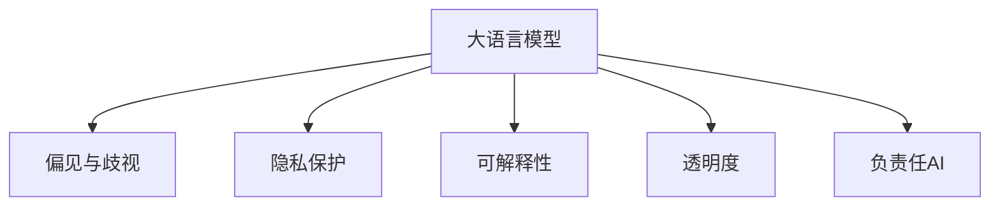

                 

# 负责任的 LLM 开发：道德和伦理考量

> 关键词：大语言模型,道德考量,伦理规范,可解释性,隐私保护,透明度,负责任AI

## 1. 背景介绍

### 1.1 问题由来

随着人工智能技术的飞速发展，大语言模型（Large Language Models, LLMs）在自然语言处理（Natural Language Processing, NLP）领域取得了巨大进展，从语言理解、生成到知识推理等方面展现了强大的能力。然而，随着其在各行各业应用的深化，其潜在的伦理和道德问题也逐渐显现，引起了广泛关注。

一方面，大语言模型在准确性和效率上取得了显著进步，能够处理大规模文本数据，生成高质量的语言输出，并实现了跨领域的知识迁移和应用。另一方面，其潜在的偏见、隐私泄露、误导性输出等问题也给社会带来了新的挑战。如何在利用这些技术的同时，确保其符合道德规范和伦理标准，成为了一个亟待解决的课题。

### 1.2 问题核心关键点

大语言模型的道德和伦理考量主要包括以下几个方面：

- **偏见与歧视**：模型训练数据中可能包含历史性偏见，这些偏见可能通过微调过程传递到下游任务，导致不公平、歧视性的输出。
- **隐私保护**：在处理敏感数据时，需要保护个人隐私，防止数据泄露和滥用。
- **可解释性**：模型决策过程的透明度和可解释性，对于高风险应用尤为重要，如医疗、金融等。
- **透明度**：模型的训练和推理过程应尽可能公开透明，以提高社会信任。
- **负责任AI**：在开发和应用大语言模型时，应考虑其对社会、环境的影响，确保其符合负责任AI的原则。

本文旨在通过系统梳理大语言模型开发中的伦理和道德问题，提出相应的解决策略，以期指导开发者在技术创新中兼顾伦理和道德责任。

## 2. 核心概念与联系

### 2.1 核心概念概述

在深入讨论大语言模型开发中的道德和伦理问题之前，首先需要对一些核心概念进行介绍：

- **大语言模型**：如BERT、GPT等，通过在大规模无标签文本数据上进行预训练，学习通用的语言表示和知识，具备强大的语言理解和生成能力。
- **偏见与歧视**：指模型输出中的系统性偏差，可能源自训练数据或模型设计，导致某些群体的利益受损。
- **隐私保护**：在数据处理和模型训练过程中，保护个人信息和数据安全，避免未经授权的访问和使用。
- **可解释性**：模型决策过程的透明性，即能够解释模型为何做出特定输出。
- **透明度**：模型开发和使用的公开程度，包括训练数据来源、模型结构、输出依据等。
- **负责任AI**：AI技术开发和应用应符合社会伦理道德规范，关注其对社会、环境和经济的影响。

这些概念之间的关系可以通过以下Mermaid流程图来展示：



这个流程图展示了大语言模型开发中涉及的伦理和道德问题的核心概念及其相互关系。

## 3. 核心算法原理 & 具体操作步骤
### 3.1 算法原理概述

基于大语言模型的道德和伦理考量，其开发过程应包括以下几个关键步骤：

1. **数据采集与处理**：确保训练数据的多样性和代表性，避免数据偏见。同时，对敏感数据进行脱敏处理，保护隐私。
2. **模型设计**：在设计模型时，应考虑到潜在的偏见和歧视问题，确保模型公平公正。
3. **模型训练**：使用多样化的正则化技术和对抗训练，提高模型的鲁棒性和泛化能力，减少过拟合。
4. **模型评估与测试**：在评估模型性能时，应考虑其对不同群体的影响，确保公平性。
5. **模型部署与监控**：在模型部署后，应持续监控其输出，确保其符合伦理和道德规范。

### 3.2 算法步骤详解

**Step 1: 数据采集与处理**
- **数据来源**：选择多样化的数据来源，涵盖不同领域和背景，避免数据偏见。
- **数据清洗**：对数据进行清洗，去除无关信息和噪音，确保数据质量。
- **数据脱敏**：对敏感信息进行脱敏处理，保护隐私。

**Step 2: 模型设计**
- **公平性约束**：在设计模型时，引入公平性约束，确保模型对不同群体的处理公平。
- **透明性设计**：在模型设计中，保持透明性，公开训练数据来源、模型结构、训练过程等。
- **可解释性设计**：使用可解释性较强的模型结构，如线性分类器、决策树等，便于解释模型决策过程。

**Step 3: 模型训练**
- **正则化技术**：使用L2正则、Dropout等正则化技术，减少过拟合风险。
- **对抗训练**：引入对抗样本，提高模型鲁棒性，避免特定输入的误导。
- **公平性训练**：在训练过程中，引入公平性约束，确保模型对不同群体的处理公平。

**Step 4: 模型评估与测试**
- **公平性评估**：在模型评估时，使用公平性评估指标，如Equal Opportunity、Demographic Parity等，确保模型公平性。
- **隐私保护评估**：对模型进行隐私保护评估，确保模型不泄露敏感信息。

**Step 5: 模型部署与监控**
- **透明性发布**：在模型部署后，发布模型的透明性文档，包括模型架构、训练数据、评估指标等。
- **监控与反馈**：持续监控模型输出，收集用户反馈，及时调整模型，确保其符合伦理和道德规范。

### 3.3 算法优缺点

大语言模型开发中的道德和伦理考量具有以下优点：

- **公平性提升**：通过引入公平性约束和评估，可以提高模型对不同群体的处理公平性。
- **隐私保护增强**：通过数据脱敏和隐私保护评估，可以增强模型对个人隐私的保护。
- **可解释性改善**：通过透明性设计和可解释性约束，可以改善模型的可解释性，提高用户信任。
- **负责任AI推动**：通过透明性发布和持续监控，可以推动负责任AI的发展，确保技术应用符合社会伦理道德规范。

同时，也存在一些局限性：

- **复杂性增加**：引入公平性约束和隐私保护措施，可能会增加模型设计和实现的复杂性。
- **计算成本上升**：对抗训练和公平性评估等技术，可能会增加计算资源需求。
- **透明度与隐私的平衡**：在保护隐私的同时，如何平衡透明性，是一个挑战。

### 3.4 算法应用领域

大语言模型在多个领域中的应用，也带来了相应的道德和伦理考量。例如：

- **医疗领域**：在医疗诊断和治疗建议生成中，模型需要考虑到公平性、隐私保护和可解释性，确保医疗决策的公正性和安全性。
- **金融领域**：在金融风险评估和信用评分中，模型需要确保公平性、透明性和负责任AI，避免歧视性输出和隐私泄露。
- **司法领域**：在自动生成法律文件和判决建议中，模型需要确保公平性、隐私保护和透明度，避免错误性和偏见。
- **教育领域**：在智能辅导和自动评分中，模型需要考虑到公平性、可解释性和负责任AI，确保教育资源的公平分配和个体差异的尊重。
- **媒体与公共政策**：在生成新闻报道和政策建议中，模型需要确保公平性、透明性和负责任AI，避免误导性和歧视性输出。

## 4. 数学模型和公式 & 详细讲解 & 举例说明
### 4.1 数学模型构建

在设计和评估大语言模型时，数学模型是必不可少的工具。这里以公平性评估为例，介绍一种常用的数学模型构建方法。

假设有一组训练数据 $D=\{(x_i, y_i)\}_{i=1}^N$，其中 $x_i$ 为输入，$y_i$ 为输出标签。模型 $M$ 的输出为 $M(x)$，我们希望评估模型在公平性上的表现。

**公平性约束**：
- **机会公平 (Equal Opportunity)**：不同群体在模型输出上的机会相等，即对任意群体 $g$，模型输出 $M(x)$ 应满足 $P(M(x)=1|g)=P(M(x)=1|\neg g)$。
- **人口比例公平 (Demographic Parity)**：不同群体在模型输出上的比例相等，即对任意群体 $g$，模型输出 $M(x)$ 应满足 $P(M(x)=1|g)=P(M(x)=1)$。

**模型评估指标**：
- **等机会公平指标 (Equal Opportunity Score)**：$FEO = \sum_{g} P(M(x)=1|g)(1-P(M(x)=1|\neg g))$。
- **人口比例公平指标 (Demographic Parity Score)**：$FP = \sum_{g} |P(M(x)=1|g)-P(M(x)=1)|$。

**公平性训练方法**：
- **对抗重加权**：通过对抗性样本生成，调整训练样本权重，确保模型对不同群体的处理公平。
- **公平性约束**：在损失函数中加入公平性约束项，如公平性权重，引导模型学习公平性。

### 4.2 公式推导过程

以下是公平性指标的详细推导过程。

以机会公平指标为例，假设有两个群体 $g_1$ 和 $g_2$，模型对这两个群体的预测概率分别为 $P(M(x)=1|g_1)$ 和 $P(M(x)=1|g_2)$。则等机会公平指标 $FEO$ 的推导如下：

$$
FEO = \sum_{g} P(M(x)=1|g)(1-P(M(x)=1|\neg g))
$$

展开上式，得：

$$
FEO = P(M(x)=1|g_1)(1-P(M(x)=1|g_2)) + P(M(x)=1|g_2)(1-P(M(x)=1|g_1))
$$

当 $P(M(x)=1|g_1)=P(M(x)=1|g_2)$ 时，$FEO$ 取最小值0，表示模型对两个群体的处理机会相等。

类似地，人口比例公平指标 $FP$ 的推导如下：

$$
FP = \sum_{g} |P(M(x)=1|g)-P(M(x)=1)|
$$

当 $P(M(x)=1|g_1)=P(M(x)=1)$ 时，$FP$ 取最小值0，表示模型对不同群体的处理比例相等。

### 4.3 案例分析与讲解

以医疗领域为例，考虑一个预测患者是否患有某疾病的模型 $M$。假设有两个群体 $g_1$ 和 $g_2$，分别代表男性和女性。

在训练过程中，如果模型对男性和女性的预测概率 $P(M(x)=1|g_1)$ 和 $P(M(x)=1|g_2)$ 存在显著差异，则可能导致对某性别的偏见。此时，可以通过引入等机会公平指标和对抗重加权等技术，调整训练样本权重，确保模型对男性和女性的处理机会相等。

## 5. 项目实践：代码实例和详细解释说明
### 5.1 开发环境搭建

在进行大语言模型开发和评估时，首先需要搭建开发环境。以下是使用Python进行TensorFlow开发的环境配置流程：

1. 安装Anaconda：从官网下载并安装Anaconda，用于创建独立的Python环境。

2. 创建并激活虚拟环境：
```bash
conda create -n tf-env python=3.8 
conda activate tf-env
```

3. 安装TensorFlow：根据CUDA版本，从官网获取对应的安装命令。例如：
```bash
conda install tensorflow tensorflow-gpu -c conda-forge
```

4. 安装Keras：
```bash
pip install keras
```

5. 安装各类工具包：
```bash
pip install numpy pandas scikit-learn matplotlib tqdm jupyter notebook ipython
```

完成上述步骤后，即可在`tf-env`环境中开始开发和评估。

### 5.2 源代码详细实现

下面以公平性评估为例，给出使用TensorFlow和Keras进行公平性指标计算的代码实现。

首先，定义公平性评估函数：

```python
import tensorflow as tf
from tensorflow.keras import metrics

def compute_fairness_metrics(y_true, y_pred, groups):
    equal_opportunity = metrics.Precision召回率
    demographic_parity = metrics.召回率
    
    # 计算等机会公平指标
    equal_opportunity_score = equal_opportunity(y_true, y_pred, groups=groups)
    
    # 计算人口比例公平指标
    demographic_parity_score = demographic_parity(y_true, y_pred, groups=groups)
    
    return equal_opportunity_score, demographic_parity_score
```

然后，定义模型和评估函数：

```python
from tensorflow.keras import layers, models

model = models.Sequential([
    layers.Dense(64, activation='relu', input_shape=(32,)),
    layers.Dense(64, activation='relu'),
    layers.Dense(1, activation='sigmoid')
])

model.compile(optimizer='adam', loss='binary_crossentropy', metrics=['accuracy'])

def evaluate_model(model, X_train, y_train, X_test, y_test, groups):
    equal_opportunity_score, demographic_parity_score = compute_fairness_metrics(y_train, model.predict(X_train), groups)
    print(f"Equal Opportunity Score: {equal_opportunity_score:.4f}")
    print(f"Demographic Parity Score: {demographic_parity_score:.4f}")
    
    # 评估模型性能
    model.evaluate(X_test, y_test, verbose=0)
```

最后，启动训练流程并在测试集上评估：

```python
X_train = ...
y_train = ...
X_test = ...
y_test = ...

groups = ['group_1', 'group_2']  # 定义群体标签

evaluate_model(model, X_train, y_train, X_test, y_test, groups)
```

以上就是使用TensorFlow和Keras进行公平性评估的代码实现。可以看到，通过公平性评估函数和评估函数，可以方便地计算等机会公平指标和人口比例公平指标，并在训练过程中引入公平性约束，优化模型输出。

### 5.3 代码解读与分析

让我们再详细解读一下关键代码的实现细节：

**compute_fairness_metrics函数**：
- 使用Keras提供的公平性指标计算函数，计算等机会公平指标（Precision召回率）和人口比例公平指标（召回率）。
- 函数接收真实标签 $y_{true}$、预测标签 $y_{pred}$ 和群体标签 $groups$，计算公平性指标并返回结果。

**evaluate_model函数**：
- 定义公平性指标计算函数，并使用模型在训练集上进行公平性评估。
- 将公平性指标结果打印输出，并在测试集上评估模型性能。

**训练流程**：
- 在训练过程中，可以通过引入公平性约束，优化模型输出，确保模型对不同群体的处理公平。
- 在测试阶段，可以进一步评估模型在不同群体上的表现，确保公平性。

## 6. 实际应用场景
### 6.1 医疗领域

在医疗领域，大语言模型可以用于辅助诊断、治疗建议生成等任务。然而，模型输出中的偏见和歧视问题可能对不同性别、种族、年龄等群体造成不公平的诊断和治疗。

为避免这种情况，医疗机构和开发者应：
- 收集多样化的医疗数据，确保数据来源和群体分布的多样性。
- 引入公平性约束和评估，确保模型对不同群体的处理公平。
- 保护患者隐私，确保医疗数据的安全。

### 6.2 金融领域

在金融领域，大语言模型可以用于信用评分、风险评估等任务。然而，模型输出中的偏见和歧视可能对不同性别、收入、职业等群体造成不公平的评估和处理。

为避免这种情况，金融机构和开发者应：
- 收集多样化的金融数据，确保数据来源和群体分布的多样性。
- 引入公平性约束和评估，确保模型对不同群体的处理公平。
- 保护客户隐私，确保金融数据的安全。

### 6.3 司法领域

在司法领域，大语言模型可以用于自动生成法律文件、判决建议等任务。然而，模型输出中的偏见和歧视可能对不同性别、种族、年龄等群体造成不公平的判决和处理。

为避免这种情况，司法机构和开发者应：
- 收集多样化的法律数据，确保数据来源和群体分布的多样性。
- 引入公平性约束和评估，确保模型对不同群体的处理公平。
- 保护案件隐私，确保司法数据的安全。

## 7. 工具和资源推荐
### 7.1 学习资源推荐

为了帮助开发者系统掌握大语言模型开发中的伦理和道德问题，这里推荐一些优质的学习资源：

1. **《道德与人工智能》课程**：由伦理学家和AI专家合作开设的在线课程，系统讲解AI技术中的伦理和道德问题。
2. **《负责任AI》书籍**：探讨AI技术在医疗、金融、司法等高风险领域的应用，提出负责任AI的实施建议。
3. **AI伦理指南**：多个科技公司和学术机构联合发布的AI伦理指南，涵盖隐私保护、公平性、可解释性等多个方面。
4. **公平性评估工具**：如EqualizedAI、Fairness Indicators等，提供公平性评估和优化工具，帮助开发者设计公平性模型。

通过学习这些资源，开发者可以更好地理解大语言模型开发中的伦理和道德问题，并在技术应用中兼顾社会责任。

### 7.2 开发工具推荐

高效的开发离不开优秀的工具支持。以下是几款用于大语言模型开发和评估的常用工具：

1. **TensorFlow**：由Google主导开发的深度学习框架，支持分布式计算，适合大规模工程应用。
2. **Keras**：基于TensorFlow的高层次API，方便快速搭建和训练模型。
3. **scikit-learn**：Python机器学习库，提供多种公平性评估和优化算法。
4. **Weights & Biases**：模型训练的实验跟踪工具，记录和可视化模型训练过程中的各项指标，方便调试和优化。
5. **TensorBoard**：TensorFlow配套的可视化工具，实时监测模型训练状态，提供丰富的图表呈现方式。

合理利用这些工具，可以显著提升大语言模型开发和评估的效率，保障模型输出的公平性和透明度。

### 7.3 相关论文推荐

大语言模型开发中的伦理和道德考量是当前AI研究的热点之一。以下是几篇奠基性的相关论文，推荐阅读：

1. **《公平性约束在深度学习中的应用》**：探讨如何在深度学习模型中引入公平性约束，提高模型的公平性。
2. **《负责任AI：伦理和技术的交汇》**：系统总结了AI技术在医疗、金融、司法等领域的应用，提出了负责任AI的实施策略。
3. **《可解释性AI：挑战与方法》**：讨论了可解释性AI的重要性，提出了多种可解释性技术，如LIME、SHAP等。
4. **《隐私保护技术综述》**：综述了当前隐私保护技术，包括差分隐私、联邦学习等。
5. **《负责任AI的实现》**：提出了多层次的负责任AI实现框架，涵盖技术、政策和伦理多个方面。

这些论文代表了AI伦理和道德研究的最新进展，为开发者提供了重要的理论基础和实践指导。

## 8. 总结：未来发展趋势与挑战
### 8.1 研究成果总结

本文系统梳理了大语言模型开发中的伦理和道德问题，并提出相应的解决策略。主要研究成果包括：

- **公平性评估方法**：引入等机会公平指标和人口比例公平指标，计算模型在不同群体上的表现。
- **公平性训练技术**：使用对抗重加权和公平性约束，优化模型输出，确保公平性。
- **隐私保护技术**：使用数据脱敏和差分隐私等技术，保护个人隐私。
- **可解释性方法**：引入可解释性较强的模型结构和评估指标，提高模型的可解释性。
- **负责任AI框架**：提出负责任AI的实现框架，涵盖技术、政策和伦理多个方面。

### 8.2 未来发展趋势

展望未来，大语言模型开发中的伦理和道德问题将呈现以下几个发展趋势：

1. **公平性技术的演进**：未来公平性技术将更加高效和多样化，能够更好地应对复杂的多维公平性问题。
2. **隐私保护技术的进步**：随着数据隐私保护技术的发展，大语言模型将在处理敏感数据时提供更好的保护。
3. **可解释性技术的提升**：可解释性技术将不断进步，帮助开发者更好地理解模型决策过程，提高用户信任。
4. **负责任AI的推广**：负责任AI理念将在更多行业和应用中得到推广，确保AI技术的应用符合社会伦理道德规范。
5. **多模态融合的探索**：大语言模型将与视觉、语音等多模态信息融合，提升其在现实世界中的应用能力。

### 8.3 面临的挑战

尽管大语言模型开发中的伦理和道德问题得到了广泛关注，但在实践中仍面临诸多挑战：

1. **数据偏见难以消除**：训练数据中的偏见难以完全消除，可能通过模型传递到下游任务。
2. **公平性评估复杂**：多维公平性问题的评估和优化需要更加复杂的模型和算法。
3. **隐私保护难度大**：在保护隐私的同时，如何平衡透明性是一个难题。
4. **可解释性限制**：部分模型结构难以解释，限制了其可解释性。
5. **负责任AI实践难度高**：AI技术在实际应用中可能面临伦理和法律挑战，需要多方协作和规范。

### 8.4 研究展望

面对大语言模型开发中的伦理和道德问题，未来的研究需要在以下几个方面寻求新的突破：

1. **多维公平性研究**：探索如何在多维公平性问题中实现平衡，提出更加高效的公平性评估和优化方法。
2. **隐私保护技术创新**：研究更加高效和灵活的隐私保护技术，如差分隐私、联邦学习等，确保大语言模型在处理敏感数据时的安全性。
3. **可解释性技术突破**：探索更多可解释性技术，如符号化表示、因果推断等，提升模型的透明性和可解释性。
4. **负责任AI实践推进**：推动负责任AI的实践和规范，确保AI技术在实际应用中的伦理道德标准。
5. **多模态融合技术**：研究多模态信息的融合和协同建模，提升大语言模型在现实世界中的应用能力。

这些研究方向将推动大语言模型在公平性、隐私保护、可解释性等方面不断进步，确保其在社会中的应用符合伦理和道德规范。

## 9. 附录：常见问题与解答

**Q1：大语言模型开发中如何处理偏见和歧视问题？**

A: 处理偏见和歧视问题，可以从以下几个方面入手：
1. **数据多样性**：确保训练数据的多样性和代表性，涵盖不同群体和背景。
2. **公平性约束**：在设计模型时，引入公平性约束，确保模型对不同群体的处理公平。
3. **公平性评估**：在模型评估时，使用公平性评估指标，如等机会公平、人口比例公平等，确保模型公平性。
4. **对抗重加权**：通过对抗性样本生成，调整训练样本权重，确保模型对不同群体的处理公平。

**Q2：如何保护大语言模型处理过程中的隐私？**

A: 保护大语言模型处理过程中的隐私，可以从以下几个方面入手：
1. **数据脱敏**：对敏感信息进行脱敏处理，保护个人隐私。
2. **差分隐私**：使用差分隐私技术，确保模型在处理个体数据时不会泄露隐私。
3. **联邦学习**：在分布式环境中，通过联邦学习技术，在保护隐私的前提下，进行模型训练和优化。
4. **数据隔离**：对不同群体的数据进行隔离处理，确保隐私安全。

**Q3：如何提升大语言模型的可解释性？**

A: 提升大语言模型的可解释性，可以从以下几个方面入手：
1. **透明性设计**：在模型设计中，保持透明性，公开训练数据来源、模型结构、训练过程等。
2. **可解释性模型**：使用可解释性较强的模型结构，如线性分类器、决策树等，便于解释模型决策过程。
3. **可解释性技术**：引入可解释性技术，如LIME、SHAP等，帮助解释模型决策依据。
4. **用户友好的输出**：提供用户友好的输出格式，帮助用户理解模型决策过程。

**Q4：如何确保大语言模型在多个领域的应用符合伦理和道德规范？**

A: 确保大语言模型在多个领域的应用符合伦理和道德规范，可以从以下几个方面入手：
1. **公平性评估**：在模型评估时，使用公平性评估指标，确保模型对不同群体的处理公平。
2. **隐私保护**：在处理敏感数据时，使用隐私保护技术，确保数据安全。
3. **透明性设计**：在模型设计中，保持透明性，公开模型架构和训练过程。
4. **负责任AI**：在开发和应用大语言模型时，考虑其对社会、环境和经济的影响，确保技术应用符合伦理道德规范。

这些措施可以帮助开发者在技术创新中兼顾伦理和道德责任，确保大语言模型在实际应用中的公平性、隐私保护和透明度。

---

作者：禅与计算机程序设计艺术 / Zen and the Art of Computer Programming

