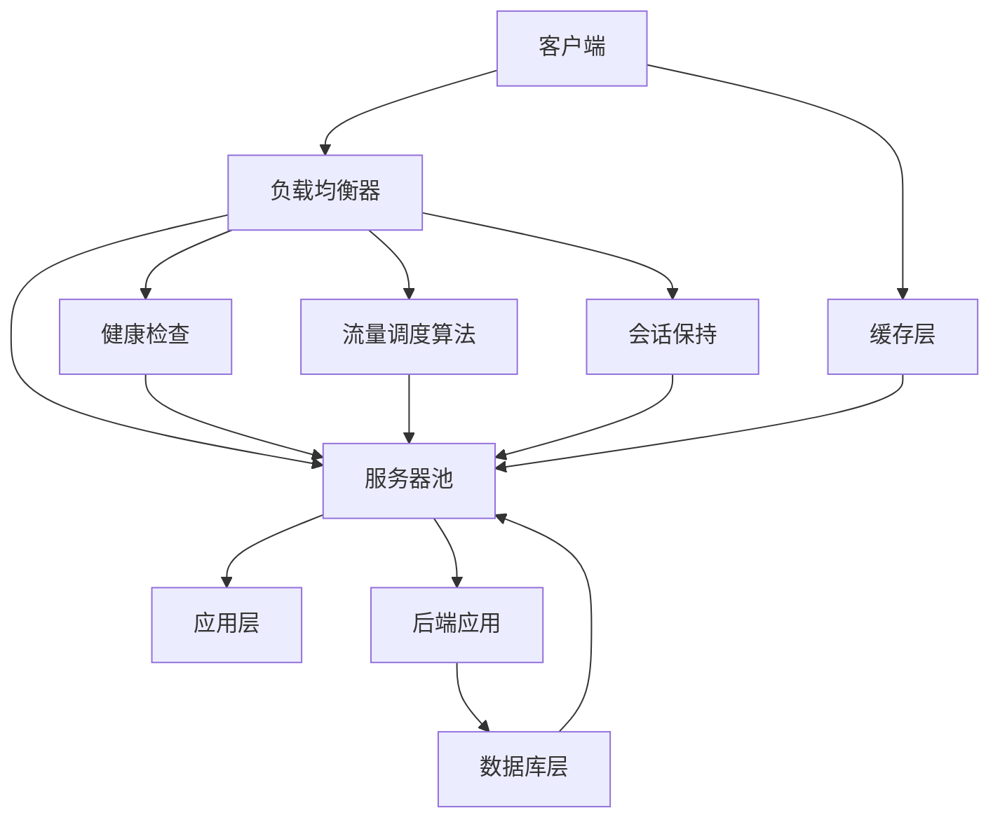

                 

# 负载均衡技术：从硬件到软件解决方案

> 关键词：负载均衡, 硬件负载均衡器, 软件负载均衡, 高可用性, 高吞吐量, 低延迟, 应用层负载均衡, 数据中心

## 1. 背景介绍

### 1.1 问题由来

在现代互联网应用中，由于用户规模的不断扩大，访问量和数据量的指数级增长，单个服务器或单台物理设备已经难以满足复杂的业务需求。为了应对这种状况，负载均衡技术应运而生。通过将客户端请求分散到多个服务器上，以实现更高效、更可靠的服务响应，负载均衡技术成为保证高性能和高可用性的关键组件。

负载均衡技术的广泛应用场景包括：Web应用、数据库、缓存、消息队列、视频流、区块链等，几乎覆盖了所有主流的互联网应用架构。为了支持各类应用场景，负载均衡技术也在不断演进，从最初的硬件负载均衡器到如今的各类软件解决方案，负载均衡技术不断扩展其功能边界，深入到应用层、数据中心等各个层面。

### 1.2 问题核心关键点

负载均衡技术涉及的核心概念主要包括：

- 负载均衡器：是承载负载均衡逻辑的物理或虚拟设备，可以基于硬件或软件实现。
- 健康检查：通过主动检测服务器的运行状态，筛选出可用的服务器。
- 会话保持：确保来自同一个客户端的所有请求都落在同一台服务器上。
- 流量调度算法：基于一定的规则和算法，决定请求的分发方式。
- 高可用性（HA）：保证系统在故障情况下仍然能提供可靠服务。
- 高吞吐量：保证系统在高并发情况下的性能。
- 低延迟：在数据传输过程中减少网络延迟，提升用户体验。

通过深入理解这些核心概念，可以更好地把握负载均衡技术的运作原理和优化方向。

## 2. 核心概念与联系

### 2.1 核心概念概述

为更好地理解负载均衡技术，本节将介绍几个密切相关的核心概念：

- 负载均衡器(Load Balancer, LB)：承载负载均衡逻辑的物理或虚拟设备，可以是硬件负载均衡器（如F5、A10等）或软件负载均衡器（如HAProxy、NGINX等）。
- 会话保持(Session Persistence)：通过一定规则（如IP哈希、Cookie哈希等）将来自同一客户端的请求转发到同一台服务器，以确保请求的连续性和一致性。
- 健康检查(Health Check)：通过定期发送探测包检查后端服务器的状态，自动将出现故障的服务器从服务列表中移除，保证系统的稳定性。
- 流量调度算法(Load Algorithms)：决定请求如何分发到后端服务器，常见的算法包括轮询、加权轮询、最少连接数、最小响应时间等。
- 高可用性(High Availability, HA)：在负载均衡器本身或后端服务器出现故障时，能够自动切换到其他可用节点，保证服务的连续性。
- 高吞吐量(High Throughput)：在处理大量并发请求时，能够保持较低的延迟和稳定的性能。
- 低延迟(Low Latency)：减少数据在网络中的传输延迟，提升用户体验。

这些核心概念之间存在紧密的联系，负载均衡器作为硬件或软件的基础，通过各种算法和策略实现会话保持和健康检查，确保系统的稳定性和可靠性，同时通过高可用性设计保障系统在故障情况下的快速恢复能力。

### 2.2 核心概念原理和架构的 Mermaid 流程图



这个流程图展示了负载均衡技术的核心架构和流程：

1. 客户端向负载均衡器发起请求。
2. 负载均衡器根据流量调度算法将请求转发到后端服务器池。
3. 服务器池中的服务器处理请求并返回结果。
4. 负载均衡器通过健康检查和会话保持策略，确保服务器可用性和请求连续性。
5. 最终结果返回给客户端，实现高效的负载均衡。

## 3. 核心算法原理 & 具体操作步骤
### 3.1 算法原理概述

负载均衡技术的核心算法原理是通过负载均衡器根据一定的规则和算法，将客户端请求分配到后端服务器上。其核心思想包括：

1. 流量分发：将客户端请求按规则分配到多个服务器上。
2. 会话保持：确保同一客户端请求的分发在同一个服务器上。
3. 健康检查：监控后端服务器状态，自动切换故障服务器。

基于以上原则，常见的负载均衡算法包括：

- 轮询算法：依次将请求分配给各个服务器，保证负载均衡。
- 加权轮询算法：根据服务器性能（如CPU负载、内存使用等）分配权重，优先选择性能好的服务器。
- 最少连接数算法：将请求分配到连接数最少的服务器，减少延迟。
- 最小响应时间算法：将请求分配到响应时间最短的服务器，提升性能。

### 3.2 算法步骤详解

1. **请求分发**：客户端发起请求，负载均衡器根据一定的算法规则，将请求分配给后端服务器。
2. **健康检查**：负载均衡器定期发送探测包给后端服务器，检查其状态。如发现故障，则立即将故障服务器从服务列表中移除。
3. **会话保持**：负载均衡器使用会话保持机制，确保同一客户端的请求始终被分配到同一台服务器。
4. **负载均衡器故障处理**：在负载均衡器本身发生故障时，系统将自动切换到备用节点或主备模式。
5. **后端服务器故障处理**：在后端服务器发生故障时，负载均衡器将请求自动转发到其他可用服务器。

### 3.3 算法优缺点

#### 优点

1. **高可用性**：负载均衡器可以实时监控后端服务器的状态，在故障时自动切换，确保系统可靠运行。
2. **高吞吐量**：通过合理的流量调度算法，负载均衡器能够均衡分配请求，减少服务器间的负载差异。
3. **低延迟**：合理使用会话保持策略，减少数据在网络中的传输，提升用户体验。

#### 缺点

1. **资源消耗**：负载均衡器本身需要消耗一定的资源，包括计算、内存、带宽等。
2. **单点故障风险**：在硬件负载均衡器的情况下，如负载均衡器本身发生故障，将导致系统无法正常工作。
3. **配置复杂**：负载均衡器的配置和管理需要一定的专业知识和经验。

### 3.4 算法应用领域

负载均衡技术广泛应用于各种互联网应用场景：

- Web应用：通过负载均衡器将用户请求均衡分配到Web服务器。
- 数据库：通过负载均衡器将读/写请求均衡分配到数据库服务器，提升性能和可用性。
- 缓存：通过负载均衡器将缓存请求均衡分配到缓存服务器，减少数据缓存层的压力。
- 消息队列：通过负载均衡器将消息生产者请求均衡分配到消息队列服务器。
- 视频流：通过负载均衡器将视频流请求均衡分配到视频流服务器，提高流量的稳定性和可靠性。
- 区块链：通过负载均衡器将区块链请求均衡分配到节点服务器，提升整个区块链网络的性能。

## 4. 数学模型和公式 & 详细讲解 & 举例说明

### 4.1 数学模型构建

为了更好地理解和实现负载均衡算法，本节将构建数学模型，并推导其计算公式。

假设负载均衡器有$N$个后端服务器，$R_i$为第$i$个服务器的请求响应时间。设$\alpha$为加权轮询算法的权重，则请求分配给第$i$个服务器的概率为：

$$
P_i = \frac{\alpha_i}{\sum_{j=1}^{N}\alpha_j}
$$

其中，$\alpha_i = \frac{1}{R_i}$，即请求响应时间的倒数。

### 4.2 公式推导过程

假设负载均衡器有3个后端服务器，其请求响应时间分别为$R_1=1$ms、$R_2=2$ms、$R_3=3$ms。设加权轮询算法的权重为$\alpha=[1, 2, 3]$。则请求分配给第$i$个服务器的概率为：

$$
P_i = \frac{\alpha_i}{\sum_{j=1}^{3}\alpha_j} = \frac{1}{1+2+3} = \frac{1}{6}
$$

### 4.3 案例分析与讲解

以Nginx为例，它是一种常用的软件负载均衡器，通过定义不同的负载均衡算法，实现对请求的高效分发。

#### 案例一：轮询算法

```nginx
upstream mybackend {
    server server1;
    server server2;
    server server3;
}
```

此配置将请求轮询分配给`server1`、`server2`和`server3`，保证负载均衡。

#### 案例二：加权轮询算法

```nginx
upstream mybackend {
    server server1 weight=1;
    server server2 weight=2;
    server server3 weight=3;
}
```

此配置将请求加权分配给`server1`、`server2`和`server3`，权重分别为1、2、3，优先选择性能好的服务器。

## 5. 项目实践：代码实例和详细解释说明
### 5.1 开发环境搭建

在进行负载均衡实践前，我们需要准备好开发环境。以下是使用Nginx进行负载均衡配置的开发环境搭建流程：

1. 安装Nginx：从官网下载并安装Nginx，或使用系统包管理器进行安装。
2. 安装并配置后端服务器：确保后端服务器能够正常响应请求。
3. 安装并配置负载均衡器：创建虚拟服务器和负载均衡池，设置健康检查和会话保持策略。

### 5.2 源代码详细实现

下面以Nginx为例，展示如何通过配置文件实现加权轮询算法。

```nginx
upstream mybackend {
    server server1 weight=1;
    server server2 weight=2;
    server server3 weight=3;
}

server {
    listen 80;
    server_name mydomain.com;

    location / {
        proxy_pass http://mybackend;
        proxy_set_header Host $host;
        proxy_set_header X-Real-IP $remote_addr;
        proxy_set_header X-Forwarded-For $proxy_add_x_forwarded_for;
        proxy_set_header X-Forwarded-Proto $scheme;
    }
}
```

配置文件中定义了一个名为`mybackend`的负载均衡池，包含3个后端服务器，每个服务器的权重分别为1、2、3。请求将被加权分配到这些服务器上。

### 5.3 代码解读与分析

**上文提到的配置文件解析：**

- `upstream mybackend`：定义名为`mybackend`的负载均衡池，包含3个后端服务器。
- `server server1 weight=1`：`server1`服务器的权重为1。
- `server server2 weight=2`：`server2`服务器的权重为2。
- `server server3 weight=3`：`server3`服务器的权重为3。
- `proxy_pass http://mybackend`：将请求转发给`mybackend`负载均衡池。
- `proxy_set_header`：设置代理请求的标头信息，确保请求的连续性和一致性。

此配置文件将请求加权分配给后端服务器，并在服务器发生故障时自动切换到其他可用节点，确保系统的稳定性和可靠性。

### 5.4 运行结果展示

通过上述配置，可以启动Nginx负载均衡器，并访问`mydomain.com`，观察请求如何被分配到后端服务器。使用`nginx -s reload`重启Nginx后，可以观察到请求分配情况，并使用健康检查工具验证后端服务器的可用性。

## 6. 实际应用场景
### 6.1 互联网应用

在互联网应用中，负载均衡技术广泛应用于Web服务器、数据库服务器、缓存服务器、消息队列服务器等，通过合理分配请求，提升系统的可用性和性能。

- **Web服务器**：通过负载均衡器将用户请求均衡分配到Web服务器，提高并发处理能力。
- **数据库服务器**：通过负载均衡器将读/写请求均衡分配到数据库服务器，提升数据库的负载能力和扩展性。
- **缓存服务器**：通过负载均衡器将缓存请求均衡分配到缓存服务器，减少缓存层的压力。
- **消息队列服务器**：通过负载均衡器将消息生产者请求均衡分配到消息队列服务器，提高消息系统的稳定性。

### 6.2 数据中心

在数据中心中，负载均衡技术也是不可或缺的组成部分，通过合理分配流量，提升数据中心的整体性能和可用性。

- **服务器负载均衡**：通过负载均衡器将用户请求均衡分配到各个数据中心的服务器，实现跨地域负载均衡。
- **网络负载均衡**：通过负载均衡器将流量均衡分配到各个网络设备，提高网络带宽利用率和网络吞吐量。
- **存储负载均衡**：通过负载均衡器将数据读写请求均衡分配到各个存储节点，提高存储系统的性能和可靠性。

### 6.3 云计算

在云计算环境中，负载均衡技术为云服务提供商提供了强大的服务保障，确保云服务的稳定性和可靠性。

- **云服务负载均衡**：通过负载均衡器将用户请求均衡分配到云服务器上，提升云服务的可用性和性能。
- **云数据库负载均衡**：通过负载均衡器将数据库读/写请求均衡分配到云数据库上，提高云数据库的扩展性和可用性。
- **云缓存负载均衡**：通过负载均衡器将缓存请求均衡分配到云缓存服务器上，提高云缓存的性能和可靠性。

### 6.4 未来应用展望

随着互联网应用和数据中心规模的不断扩大，负载均衡技术也在不断演进，未来将呈现以下几个发展趋势：

1. **更智能的算法**：通过机器学习和深度学习技术，负载均衡器能够根据实时数据动态调整负载分发策略，提升系统的智能性和灵活性。
2. **更高效的算法**：随着硬件性能的提升，负载均衡算法将更加高效，支持更大规模的流量分发。
3. **更全面的监控和分析**：通过更全面的监控和分析工具，负载均衡器能够实时掌握系统状态，及时发现和解决故障。
4. **更灵活的配置和管理**：负载均衡器将支持更灵活的配置和管理方式，能够根据实际需求快速调整负载策略。
5. **更安全的设计**：负载均衡器将具备更强大的安全防护能力，防止DDoS攻击和其他恶意行为。

## 7. 工具和资源推荐
### 7.1 学习资源推荐

为了帮助开发者掌握负载均衡技术的原理和应用，以下是几款优质的学习资源：

1. **《负载均衡技术详解》**：深入讲解了负载均衡技术的原理、应用场景、配置和管理方法，适合初学者和中级开发者。
2. **《Nginx官方文档》**：Nginx官方文档提供了详细的配置和操作说明，是学习Nginx负载均衡器的最佳资源。
3. **《HAProxy官方文档》**：HAProxy官方文档提供了详细的配置和操作说明，是学习HAProxy负载均衡器的最佳资源。
4. **《负载均衡技术课程》**：一些在线学习平台（如Coursera、Udemy等）提供了负载均衡技术的课程，涵盖负载均衡器的基本原理和高级应用。
5. **《负载均衡技术论坛》**：一些技术论坛（如Stack Overflow、Kubernetes社区等）提供了负载均衡技术的学习和讨论平台，适合开发者交流和解决问题。

通过这些学习资源，相信你一定能够系统地掌握负载均衡技术的精髓，并用于解决实际的负载均衡问题。

### 7.2 开发工具推荐

高效的工具支持是实现负载均衡技术的关键，以下是几款常用的开发工具：

1. **Nginx**：一款开源的Web服务器和反向代理服务器，支持负载均衡、HTTP/2、WebSocket等特性。
2. **HAProxy**：一款开源的负载均衡器，支持TCP/HTTP/HTTPS等协议，具备高可用性和灵活配置。
3. **F5 BIG-IP**：一款高端硬件负载均衡器，支持复杂的负载均衡算法和安全防护功能。
4. **NGINX Plus**：Nginx的商业版本，提供了高级的安全和负载均衡功能。
5. **Istio**：一款开源的服务网格解决方案，提供了流量控制、负载均衡、服务发现等功能。
6. **Kubernetes**：一款开源的容器编排系统，支持负载均衡、服务发现、自动扩展等功能。

合理利用这些工具，可以显著提升负载均衡任务的开发效率，加快创新迭代的步伐。

### 7.3 相关论文推荐

负载均衡技术的发展离不开学界的持续研究，以下是几篇奠基性的相关论文，推荐阅读：

1. **《A Survey on Load Balancing Algorithms for Internet Data Center》**：全面回顾了互联网数据中心的负载均衡算法，涵盖轮询、加权轮询、最小连接数、最小响应时间等多种算法。
2. **《Load Balancing: High Availability in Distributed Systems》**：介绍了分布式系统中的负载均衡技术，重点讨论了高可用性和故障切换机制。
3. **《HAProxy: High Availability Proxy for TCP and HTTP-based Applications》**：介绍了HAProxy负载均衡器的设计理念和实现方法，是HAProxy的官方文档。
4. **《Nginx: A Web Server with HTTP Load Balancing》**：介绍了Nginx负载均衡器的基本原理和实现方法，是Nginx的官方文档。
5. **《Kubernetes Service Mesh: A Cloud Native Solution for Microservices》**：介绍了服务网格技术，涵盖负载均衡、流量控制、服务发现等多种功能。

这些论文代表了大规模负载均衡技术的发展脉络，通过学习这些前沿成果，可以帮助研究者把握学科前进方向，激发更多的创新灵感。

## 8. 总结：未来发展趋势与挑战
### 8.1 研究成果总结

本文对负载均衡技术的原理、算法和操作步骤进行了全面系统的介绍。首先阐述了负载均衡技术的背景和应用场景，明确了负载均衡器、健康检查、会话保持等核心概念。其次，从算法原理到实际操作，详细讲解了负载均衡器的核心算法和具体操作步骤，提供了完整的Nginx配置实例。同时，本文还广泛探讨了负载均衡技术在互联网应用、数据中心、云计算等不同领域的应用前景，展示了负载均衡技术的广泛应用价值。此外，本文精选了负载均衡技术的各类学习资源，力求为读者提供全方位的技术指引。

通过本文的系统梳理，可以看到，负载均衡技术在现代互联网应用中扮演着至关重要的角色，通过合理分配流量，提升系统的可用性和性能，保障系统的稳定性和可靠性。未来，随着互联网应用和数据中心规模的不断扩大，负载均衡技术也将不断演进，拓展其功能边界，满足日益复杂的多样化需求。

### 8.2 未来发展趋势

展望未来，负载均衡技术将呈现以下几个发展趋势：

1. **更智能的算法**：通过机器学习和深度学习技术，负载均衡器能够根据实时数据动态调整负载分发策略，提升系统的智能性和灵活性。
2. **更高效的算法**：随着硬件性能的提升，负载均衡算法将更加高效，支持更大规模的流量分发。
3. **更全面的监控和分析**：通过更全面的监控和分析工具，负载均衡器能够实时掌握系统状态，及时发现和解决故障。
4. **更灵活的配置和管理**：负载均衡器将支持更灵活的配置和管理方式，能够根据实际需求快速调整负载策略。
5. **更安全的设计**：负载均衡器将具备更强大的安全防护能力，防止DDoS攻击和其他恶意行为。

### 8.3 面临的挑战

尽管负载均衡技术已经取得了显著成就，但在迈向更加智能化、普适化应用的过程中，它仍面临着诸多挑战：

1. **配置复杂性**：负载均衡器的配置和管理需要一定的专业知识和经验，对开发者的技术水平要求较高。
2. **资源消耗**：负载均衡器本身需要消耗一定的资源，包括计算、内存、带宽等，对硬件配置提出了较高要求。
3. **故障切换**：在负载均衡器或后端服务器发生故障时，系统的稳定性和可靠性仍然是一个挑战，需要高效的故障切换机制。
4. **性能瓶颈**：在处理大规模并发请求时，负载均衡器的性能和稳定性仍然是一个挑战，需要优化算法和硬件配置。

### 8.4 研究展望

面对负载均衡技术所面临的挑战，未来的研究需要在以下几个方面寻求新的突破：

1. **优化算法设计**：开发更加智能、高效的负载均衡算法，提升系统的智能性和性能。
2. **改进监控和分析**：引入更全面的监控和分析工具，实时掌握系统状态，及时发现和解决故障。
3. **增强安全性**：设计更强大的安全防护机制，防止DDoS攻击和其他恶意行为。
4. **提升配置和管理**：提供更灵活、简便的配置和管理方式，降低开发者的技术门槛。
5. **支持云原生**：支持云原生架构，实现跨云、跨地域的负载均衡和故障切换。

这些研究方向的探索，必将引领负载均衡技术迈向更高的台阶，为构建更稳定、可靠、高效的系统提供强大的技术支撑。面向未来，负载均衡技术还需要与其他技术进行更深入的融合，如云原生、容器编排、服务网格等，协同发力，共同推动系统的性能和可靠性提升。

## 9. 附录：常见问题与解答

**Q1：负载均衡器如何实现高可用性？**

A: 负载均衡器通过设置主备模式或轮询切换机制，确保系统在主节点故障时能够自动切换到备节点或并行处理请求，保障系统的稳定性和可靠性。

**Q2：负载均衡器如何处理大并发请求？**

A: 负载均衡器通过设置合理的算法和参数，均衡分配请求到各个服务器上，同时使用会话保持和健康检查机制，确保系统的稳定性和性能。

**Q3：负载均衡器如何优化性能？**

A: 负载均衡器通过优化算法、改进硬件配置、增加缓存等手段，提升系统的性能和稳定性。例如，使用缓存可以减少数据库的访问次数，提升性能。

**Q4：负载均衡器如何保证数据一致性？**

A: 负载均衡器通过使用会话保持机制，确保同一客户端的请求始终被分配到同一台服务器上，从而保证数据一致性。

**Q5：负载均衡器如何进行故障切换？**

A: 负载均衡器通过设置主备模式或轮询切换机制，确保系统在主节点故障时能够自动切换到备节点或并行处理请求，保障系统的稳定性和可靠性。

---

作者：禅与计算机程序设计艺术 / Zen and the Art of Computer Programming

