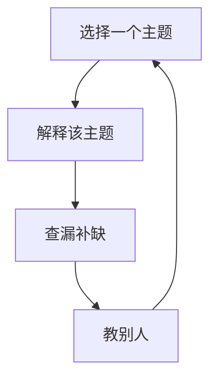

                 

# 费曼学习法的误解与真相

## 1. 背景介绍

在当前教育技术快速发展的背景下，费曼学习法（Feeman Learning Method）作为一种高效的学习策略，受到了广泛关注。费曼学习法强调通过教别人来学习知识，帮助学习者深入理解并掌握所学内容。然而，尽管费曼学习法在理论上具有显著优势，但在实际应用中，它仍然存在一些误解和误区，亟需被澄清。本文旨在深入探讨费曼学习法的核心原理，澄清其中的误解，并提出更加有效的学习策略。

## 2. 核心概念与联系

### 2.1 核心概念概述

费曼学习法是一种强调通过教别人来学习知识的策略，其核心思想是通过将自己对某个主题的理解传达给他人，来加深自己对该主题的理解。该方法包括以下几个核心步骤：
1. 选择一个主题
2. 解释该主题，就像你是老师一样
3. 查漏补缺，将不熟悉的部分深入研究
4. 教别人，直到他们能够完全理解

### 2.2 核心概念原理和架构的 Mermaid 流程图



这个流程图展示了费曼学习法的基本流程，其中A到B表示选择并解释主题，C表示深入研究不熟悉的部分，D表示教别人，最终A到D形成一个闭环，持续迭代提升学习效果。

## 3. 核心算法原理 & 具体操作步骤

### 3.1 算法原理概述

费曼学习法的核心原理是利用主动学习的机制，通过教别人来学习知识。这种方法通过以下几个关键步骤来实现：

1. **选择主题**：确定一个需要学习的主题，可以是书本、课程、技术等。
2. **自我讲解**：尝试将主题内容讲给他人，类似于进行一场简短的讲座。
3. **查找漏洞**：在自我讲解过程中，如果发现不熟悉或不理解的部分，立即查找资料进行深入研究。
4. **反复迭代**：将深入研究后的知识再次讲解给他人，直到自己完全理解和掌握。

### 3.2 算法步骤详解

#### 3.2.1 选择主题

选择主题是费曼学习法的第一步。一个有效的主题应该是：
- **相关性**：与你的学习目标紧密相关，能够激发你的兴趣和动机。
- **复杂度**：既有挑战性，又不过于复杂，可以通过自我讲解初步掌握。

#### 3.2.2 自我讲解

自我讲解是费曼学习法的核心步骤，旨在通过讲解来加深理解。在讲解时，应遵循以下几个原则：
- **简洁明了**：使用简单明了的语言，避免过于专业的术语。
- **层次分明**：将内容分成多个层次，从基础知识到高级概念逐步展开。
- **互动交流**：尝试与假想的听众互动，回答他们可能提出的问题。

#### 3.2.3 查找漏洞

在自我讲解过程中，难免会遇到自己不熟悉或不理解的部分。此时，应立即查找相关资料进行深入研究。常用的查找方法包括：
- **搜索资料**：使用搜索引擎或在线数据库查找相关文献、教程或视频。
- **咨询专家**：向该领域的专家或导师请教，获取更深入的解释。
- **查阅书籍**：选择相关书籍进行详细阅读，补充自己的知识体系。

#### 3.2.4 反复迭代

反复迭代是费曼学习法的关键，通过不断讲解和查漏补缺，逐步掌握主题内容。该过程应遵循以下步骤：
1. **初步讲解**：选择主题并自我讲解，找出知识漏洞。
2. **深入研究**：查找资料、咨询专家或查阅书籍，深入理解漏洞部分。
3. **再次讲解**：将新学的知识再次讲解给他人，直至完全理解。
4. **持续迭代**：重复以上步骤，直到能够自信地向他人讲解。

### 3.3 算法优缺点

#### 3.3.1 优点

1. **主动学习**：通过教别人来学习，增强了学习的主动性和深度。
2. **深入理解**：通过不断讲解和查漏补缺，能够深入理解所学内容。
3. **提高沟通能力**：在讲解过程中，提升了语言表达和沟通能力。

#### 3.3.2 缺点

1. **耗时较长**：需要投入大量时间和精力进行自我讲解和查漏补缺。
2. **依赖主观意愿**：依赖学习者的主观意愿和自驱力，难以坚持长期实践。
3. **缺乏反馈**：自我讲解过程中，难以获得他人的即时反馈，无法及时调整讲解方式。

### 3.4 算法应用领域

费曼学习法作为一种高效的学习策略，不仅适用于学术研究和技术学习，还可以广泛应用于以下几个领域：
1. **教育培训**：在课堂教学中，教师可以采用费曼学习法，让学生通过讲解来加深理解。
2. **编程开发**：在技术开发中，通过教别人来掌握新技能，如代码审查、技术分享等。
3. **项目管理**：在项目管理中，通过讲解项目进展和问题，提升团队沟通和协作能力。

## 4. 数学模型和公式 & 详细讲解 & 举例说明

### 4.1 数学模型构建

费曼学习法的数学模型可以通过信息论中的熵概念来描述。假设学习者掌握的知识为 $K$，通过讲解后，知识的不确定性为 $H(K)$。如果讲解有效，知识的不确定性将减少，达到 $H(K')$，其中 $K'$ 表示经过讲解后的知识。

数学模型可以表示为：
$$
H(K') < H(K)
$$

### 4.2 公式推导过程

根据信息熵的定义，知识的不确定性 $H(K)$ 可以表示为：
$$
H(K) = -\sum_{k} p(k) \log p(k)
$$

其中 $p(k)$ 表示知识 $K$ 中每个状态的先验概率。通过讲解后，知识的不确定性变为 $H(K')$，表示讲解后知识的不确定性减少。

在费曼学习法中，知识的不确定性减少可以表示为：
$$
H(K') = -\sum_{k} p(k') \log p(k')
$$

其中 $p(k')$ 表示经过讲解后的知识状态概率。由于讲解过程是一个主动学习过程，经过讲解后，知识状态概率 $p(k')$ 通常会大于先验概率 $p(k)$，因此 $H(K') < H(K)$。

### 4.3 案例分析与讲解

假设学习者需要学习一门新的编程语言。他首先选择自己熟悉的主题进行讲解，如变量、函数等基础概念。在讲解过程中，他发现自己对某些高级特性如闭包和迭代器不太熟悉。于是，他查找相关资料、咨询专家或查阅书籍，深入理解这些特性。然后，他将新学的知识再次讲解给他人，直至完全理解。

在这个过程中，知识的不确定性从 $H(K)$ 减少到 $H(K')$，学习者对编程语言的理解从初始状态逐渐深入，最终能够自信地讲解给其他人。

## 5. 项目实践：代码实例和详细解释说明

### 5.1 开发环境搭建

在实践费曼学习法时，我们需要一个支持记笔记和视频录制的环境。建议使用以下工具：
- **Notebook**：用于记录学习笔记和讲解内容，支持代码块、公式等丰富的格式。
- **Zoom**：用于进行视频讲解，支持屏幕共享、录制等高级功能。
- **GitHub**：用于保存和分享学习笔记，支持版本控制和协作。

### 5.2 源代码详细实现

这里提供一个简单的示例，演示如何使用Notebook和Zoom进行费曼学习法的实践：

1. **创建Notebook笔记**：
   - 打开Notebook，创建一个新的笔记本。
   - 添加标题和描述，如“学习Java的面向对象编程”。
   - 添加代码块，记录学习过程中的关键代码和注释。

2. **录制Zoom视频**：
   - 打开Zoom，创建一个新的会议。
   - 邀请假想的听众，开启屏幕共享。
   - 在Notebook的代码块中演示代码，并讲解相关知识点。
   - 使用Zoom的录制功能，保存讲解视频。

### 5.3 代码解读与分析

#### 5.3.1 使用Notebook记录学习笔记

```python
# 创建一个新的笔记本
import nbformat

# 定义笔记本内容和格式
content = {
    'cells': [
        {
            'cell_type': 'markdown',
            'metadata': {},
            'source': ['# 学习Java的面向对象编程']
        },
        {
            'cell_type': 'code',
            'execution_count': 1,
            'id': 'c1a44a76-6d31-41b3-ae0f-dbb8f16d4624',
            'metadata': {},
            'outputs': [],
            'source': [
                'import java.util.ArrayList;\n',
                'public class Main {\n',
                '    public static void main(String[] args) {\n',
                '        // 创建一个ArrayList\n',
                '        ArrayList<Integer> list = new ArrayList<>();\n',
                '        // 添加元素\n',
                '        list.add(1);\n',
                '        list.add(2);\n',
                '        // 遍历输出元素\n',
                '        for (int num : list) {\n',
                '            System.out.println(num);\n',
                '        }\n',
                '    }\n',
                '}'
            ]
        }
    ]
}

# 保存笔记本到文件
with open('feeman_learning_notebook.ipynb', 'w') as f:\n',
    nbformat.write(notebook, f)
```

#### 5.3.2 使用Zoom录制视频讲解

1. 打开Zoom，创建一个新的会议。
2. 邀请假想的听众，并开启屏幕共享。
3. 在Notebook的代码块中演示代码，并讲解相关知识点。
4. 使用Zoom的录制功能，保存讲解视频。

### 5.4 运行结果展示

通过Notebook记录和Zoom录制，可以生成一份详细的学习笔记和讲解视频。这些资源可以用于回顾、分享和交流，帮助加深理解和掌握所学内容。

## 6. 实际应用场景

### 6.1 教育培训

在教育培训中，教师可以采用费曼学习法，让学生通过讲解来加深理解。例如，在物理课上，教师可以要求学生讲解一个物理实验，或者讲解某个物理概念，从而促进学生的自主学习和思考。

### 6.2 编程开发

在技术开发中，通过教别人来掌握新技能，如代码审查、技术分享等。例如，一个开发团队可以通过定期举行技术分享会，让团队成员讲解新学到的技术或工具，从而提升整个团队的技术水平和协作能力。

### 6.3 项目管理

在项目管理中，通过讲解项目进展和问题，提升团队沟通和协作能力。例如，项目经理可以要求团队成员定期讲解项目进展和遇到的问题，从而及时发现和解决问题，促进项目的顺利进行。

## 7. 工具和资源推荐

### 7.1 学习资源推荐

为了帮助读者深入理解费曼学习法的原理和实践方法，这里推荐一些优质的学习资源：
1. **《费曼学习法：超级强大的学习系统》**：该书详细介绍了费曼学习法的原理、步骤和应用方法，适合各个层次的读者。
2. **Coursera课程《Teaching Smart: Learning to Teach Like a Champion》**：由教育专家和教练主讲，讲解如何有效地运用费曼学习法进行教学和自学习。
3. **EdX课程《Effective Strategies for Teaching and Learning》**：介绍了多种有效的教学和学习策略，包括费曼学习法。

### 7.2 开发工具推荐

为了支持费曼学习法的实践，推荐以下开发工具：
1. **Notebook**：支持创建、保存和分享学习笔记，适合记录和整理讲解内容。
2. **Zoom**：支持视频录制和屏幕共享，方便进行讲解和交流。
3. **GitHub**：支持版本控制和协作，方便保存和分享学习资源。

### 7.3 相关论文推荐

以下是几篇介绍费曼学习法的经典论文，推荐阅读：
1. **《How to Teach Anyone Anything》**：作者费曼本人详细介绍了费曼学习法的原理和应用方法。
2. **《Improving Learning: Teaching and Learning via Problem Exploration and Conceptual Teaching》**：探讨了费曼学习法在提高学习效果方面的应用。
3. **《Rethinking the Concept of Learning and Instruction》**：讨论了费曼学习法对现代教育理念的影响和应用。

## 8. 总结：未来发展趋势与挑战

### 8.1 研究成果总结

费曼学习法作为一种高效的学习策略，已经在学术界和工业界得到了广泛应用。它通过主动学习和深度讲解，帮助学习者深入理解和掌握知识，提高了学习效率和质量。

### 8.2 未来发展趋势

未来，费曼学习法将在以下几个方面得到进一步发展和应用：
1. **技术融合**：结合人工智能和机器学习技术，开发更加智能化的学习辅助工具，如自动生成的讲解稿、智能辅导系统等。
2. **教育创新**：在传统教育中引入费曼学习法，推动教学模式和评估体系的改革，提升教育质量。
3. **跨文化应用**：将费曼学习法应用于多种语言和文化背景下的教育，促进全球范围内的知识共享和传播。

### 8.3 面临的挑战

尽管费曼学习法具有显著优势，但在实际应用中，仍然面临以下挑战：
1. **时间投入**：费曼学习法需要投入大量时间和精力进行讲解和查漏补缺，可能导致学习者难以坚持。
2. **资源需求**：需要具备一定的技术工具和资源，如Notebook、Zoom等，对于一些资源有限的群体，可能难以实践。
3. **主观意愿**：依赖学习者的主观意愿和自驱力，难以在所有学习场景下得到有效应用。

### 8.4 研究展望

未来，如何克服费曼学习法的挑战，进一步推广和应用，将是重要的研究方向。例如：
1. **自动化辅助**：开发自动化工具和算法，帮助学习者生成讲解稿和反馈建议，减少手动操作的负担。
2. **多模态学习**：结合视觉、听觉等多模态信息，丰富讲解和学习体验，提升学习效果。
3. **个性化定制**：根据学习者的特点和需求，定制个性化的学习计划和讲解内容，提高学习效率和效果。

## 9. 附录：常见问题与解答

**Q1: 费曼学习法是否适用于所有学科？**

A: 费曼学习法适用于大多数学科，尤其是需要深入理解和掌握的学科。对于简单记忆和重复性任务，费曼学习法可能不太适用。

**Q2: 如何提高费曼学习法的效率？**

A: 提高费曼学习法的效率可以从以下几个方面入手：
1. **精简内容**：选择关键和复杂的知识点进行讲解，避免过于细节的内容。
2. **快速反馈**：及时获取他人的反馈，调整讲解方式和内容。
3. **多次迭代**：重复讲解和查漏补缺，逐步深化理解和掌握。

**Q3: 费曼学习法与传统讲授法有何不同？**

A: 费曼学习法强调通过教别人来学习知识，是一种主动学习和深度讲解的方法，而传统讲授法则是一种单向传授知识的方式。费曼学习法通过讲解促进思考和理解，传统讲授法主要依赖教师的讲授。

**Q4: 费曼学习法在实际应用中需要注意哪些问题？**

A: 在实际应用中，费曼学习法需要注意以下问题：
1. **时间管理**：合理分配时间，避免过度耗时。
2. **资源准备**：确保具备必要的工具和资源，如Notebook、Zoom等。
3. **反馈机制**：及时获取他人的反馈，调整讲解方式和内容。

**Q5: 费曼学习法在企业培训中如何应用？**

A: 在企业培训中，可以通过以下方式应用费曼学习法：
1. **知识分享会**：定期举行知识分享会，让员工讲解新学到的知识和技能。
2. **技术评审**：在技术评审中，要求参与者讲解项目进展和遇到的问题，促进团队的协作和提升。
3. **技能培训**：在技能培训中，鼓励学员通过讲解来掌握新技能，提高学习效果。

---

作者：禅与计算机程序设计艺术 / Zen and the Art of Computer Programming

