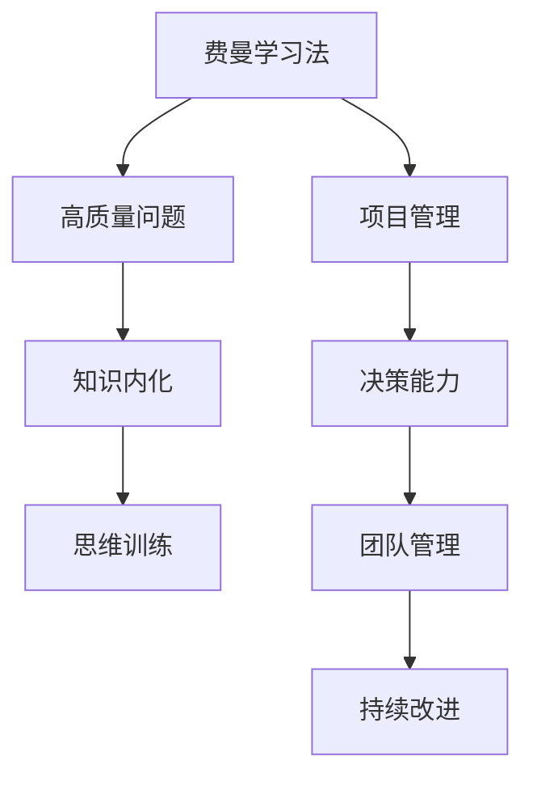

                 

# 费曼提问法:管理者思维升级的利器

> 关键词：费曼学习法,提问技巧,知识内化,思维训练,项目管理,决策能力,团队管理

## 1. 背景介绍

### 1.1 问题由来
在现代管理实践中，面对复杂的商业环境、多变的市场形势和日趋激烈的市场竞争，管理者需要不断升级自己的思维能力，以保持团队的竞争力和企业的可持续增长。然而，在快速变化的时代，知识和技能更新换代速度快，仅仅依靠传统的经验和方法，已难以有效应对。

费曼提问法（Feynman Technique），即费曼学习法，作为一种高效的知识内化与思维训练工具，近年来在教育领域广受推崇，并被逐渐应用于企业管理和项目管理中。它通过提出深度问题，帮助学习者深度思考，快速理解和掌握知识。本文旨在介绍费曼提问法的基本原理，结合实际案例，探讨其在管理思维升级中的应用。

### 1.2 问题核心关键点
费曼提问法之所以能够有效提升管理者的思维能力，其核心在于通过提出高质量的问题，引导深度思考和主动学习。这主要包括：
- 构建明确的目标和理解：通过详细描述学习目标，帮助管理者明确需要掌握的知识领域。
- 应用多维度质疑：通过提出多角度、多层次的问题，引导管理者深入思考和自我剖析。
- 运用类比和简化：通过将复杂的知识转化为易懂的形式，帮助管理者更好地理解和学习。

这些核心要点共同构成了费曼提问法的精髓，使得其在管理思维升级中展现了巨大的潜力。

### 1.3 问题研究意义
费曼提问法作为思维升级的利器，其研究意义在于：
- 加速知识内化：帮助管理者快速理解并掌握新知识，提高学习效率。
- 提升决策能力：通过深度思考和问题解决，提升管理者的决策质量。
- 增强团队合作：促进团队成员之间的知识共享和深度交流，提升团队整体能力。
- 实现持续改进：持续应用费曼提问法，推动管理者不断自我提升，实现持续改进。

## 2. 核心概念与联系

### 2.1 核心概念概述

费曼提问法是一种通过提问来驱动深度学习和思维训练的方法。它由诺贝尔物理学奖得主理查德·费曼（Richard Feynman）提出，强调通过精炼的语言表达和深入的问题挖掘，帮助学习者真正掌握知识。在管理领域，费曼提问法的应用主要包括以下几个关键概念：

- 费曼学习法（Feynman Technique）：通过精炼的语言表达和深入的问题挖掘，帮助学习者真正掌握知识。
- 高质量问题（High-Quality Questions）：针对特定目标和理解，提出多维度、多层次的问题，引导深度思考和自我剖析。
- 知识内化（Knowledge Internalization）：通过深度问题引导的思考和反思，实现知识从外到内的转化。
- 思维训练（Thought Training）：通过不断运用费曼提问法，训练和提升管理者的思维方式。

这些核心概念通过以下Mermaid流程图进行展示：



这个流程图展示了费曼提问法在项目管理、决策能力、团队管理和持续改进中的应用。通过提出高质量问题，管理者能够更好地掌握知识、提升决策能力、促进团队合作和实现持续改进。

## 3. 核心算法原理 & 具体操作步骤
### 3.1 算法原理概述

费曼提问法的核心原理是通过提出深度问题，促进学习者对知识的深度理解和掌握。其核心步骤如下：

1. **明确目标和理解**：定义学习目标，并详细描述需要掌握的知识点。
2. **应用多维度质疑**：针对目标和理解，提出多维度、多层次的问题，引导深度思考。
3. **运用类比和简化**：将复杂的知识转化为易懂的形式，帮助学习者更好地理解和学习。
4. **验证与反思**：通过自我解答或团队讨论，验证答案的准确性和有效性，并进行反思和改进。

这些步骤通过以下流程图进行展示：


### 3.2 算法步骤详解

#### 步骤1: 明确目标和理解
这一步骤旨在帮助管理者明确学习的目标和理解。具体做法包括：
- 定义学习目标：例如，“理解敏捷开发的核心原则”。
- 详细描述目标：例如，“敏捷开发的核心原则包括自组织、反馈和持续改进。其中，自组织是指团队能够自我管理和自我驱动，反馈是指团队通过持续的沟通和评估进行改进，持续改进是指团队不断优化和改进工作流程。”

#### 步骤2: 应用多维度质疑
在这一步骤中，管理者需要提出多维度、多层次的问题，引导深度思考。具体做法包括：
- 提出问题：例如，“敏捷开发的核心原则有哪些？如何理解自组织、反馈和持续改进？”
- 深入挖掘：例如，“自组织在实际管理中如何实现？如何衡量团队的自组织能力？反馈在团队协作中如何发挥作用？”
- 持续质疑：例如，“敏捷开发的核心原则如何与业务目标相结合？如何平衡敏捷开发与业务需求？”

#### 步骤3: 运用类比和简化
在这一步骤中，管理者需要将复杂的知识转化为易懂的形式，帮助自己更好地理解和学习。具体做法包括：
- 类比：例如，“敏捷开发与传统开发模式相比，有何不同？敏捷开发更像是一支快速反应的军队，团队成员就像士兵，能够快速适应变化和挑战。”
- 简化：例如，“敏捷开发的关键在于快速迭代和持续反馈，通过小步快跑，逐步优化和改进工作流程，达到更好的效果。”

#### 步骤4: 验证与反思
在这一步骤中，管理者需要通过自我解答或团队讨论，验证答案的准确性和有效性，并进行反思和改进。具体做法包括：
- 自我解答：例如，“敏捷开发的核心原则是自组织、反馈和持续改进，其中，自组织是敏捷开发的精髓，反馈是敏捷开发的保障，持续改进是敏捷开发的核心。”
- 团队讨论：例如，“在敏捷开发中，如何平衡团队的自组织和业务需求？团队的自组织能力如何提升？如何通过持续反馈和改进，实现敏捷开发的效果？”

### 3.3 算法优缺点

费曼提问法作为一种高效的知识内化与思维训练工具，具有以下优点：
- 深度思考：通过提出高质量的问题，帮助管理者进行深度思考，快速掌握知识。
- 知识内化：通过不断内化新知识，提升管理者的知识储备和应用能力。
- 思维训练：通过持续运用费曼提问法，训练和提升管理者的思维方式，增强问题解决能力。

同时，该方法也存在一些局限性：
- 耗费时间：提出高质量的问题需要大量时间和精力，对管理者的要求较高。
- 依赖个人能力：费曼提问法的效果很大程度上取决于管理者的思维能力和学习态度。

### 3.4 算法应用领域

费曼提问法作为一种高效的知识内化与思维训练工具，在多个领域中都有广泛的应用：

1. **项目管理**：帮助项目经理掌握敏捷开发、精益管理等先进管理方法，提升项目管理能力。
2. **决策能力**：通过深度问题引导的思考和反思，提升管理者的决策质量和效果。
3. **团队管理**：促进团队成员之间的知识共享和深度交流，增强团队凝聚力和协作效率。
4. **持续改进**：通过不断应用费曼提问法，推动管理者持续自我提升，实现持续改进。

## 4. 数学模型和公式 & 详细讲解 & 举例说明

### 4.1 数学模型构建

费曼提问法主要涉及知识的获取和内化，而不涉及复杂的数学模型。其核心在于通过提问引导深度思考，帮助管理者理解和掌握知识。因此，这里不再进行数学模型的构建和推导。

### 4.2 案例分析与讲解

#### 案例一：敏捷开发的学习与应用

**目标**：理解敏捷开发的核心原则。

**步骤1**：明确目标和理解
- 目标：理解敏捷开发的核心原则。
- 理解：敏捷开发的核心原则包括自组织、反馈和持续改进。其中，自组织是指团队能够自我管理和自我驱动，反馈是指团队通过持续的沟通和评估进行改进，持续改进是指团队不断优化和改进工作流程。

**步骤2**：应用多维度质疑
- 问题1：敏捷开发的核心原则有哪些？
- 问题2：如何理解自组织、反馈和持续改进？
- 问题3：自组织在实际管理中如何实现？如何衡量团队的自组织能力？反馈在团队协作中如何发挥作用？

**步骤3**：运用类比和简化
- 类比：敏捷开发更像是一支快速反应的军队，团队成员就像士兵，能够快速适应变化和挑战。
- 简化：敏捷开发的关键在于快速迭代和持续反馈，通过小步快跑，逐步优化和改进工作流程，达到更好的效果。

**步骤4**：验证与反思
- 自我解答：敏捷开发的核心原则是自组织、反馈和持续改进，其中，自组织是敏捷开发的精髓，反馈是敏捷开发的保障，持续改进是敏捷开发的核心。
- 团队讨论：在敏捷开发中，如何平衡团队的自组织和业务需求？团队的自组织能力如何提升？如何通过持续反馈和改进，实现敏捷开发的效果？

#### 案例二：精益管理的应用

**目标**：掌握精益管理的关键方法和原则。

**步骤1**：明确目标和理解
- 目标：掌握精益管理的关键方法和原则。
- 理解：精益管理的关键方法包括价值流映射、5S整理、持续改进等，核心原则包括价值最大化、快速反馈、持续改进等。

**步骤2**：应用多维度质疑
- 问题1：精益管理的关键方法有哪些？如何理解价值流映射、5S整理和持续改进？
- 问题2：价值流映射在实际操作中如何应用？如何通过5S整理提升工作环境？
- 问题3：如何通过持续改进提升生产效率和质量？

**步骤3**：运用类比和简化
- 类比：精益管理就像是一种健身训练，通过不断优化和改进，达到最佳状态。
- 简化：精益管理的关键在于识别和消除浪费，提升生产效率和质量，实现价值最大化。

**步骤4**：验证与反思
- 自我解答：精益管理的关键方法包括价值流映射、5S整理和持续改进，核心原则是价值最大化、快速反馈和持续改进。
- 团队讨论：如何在生产过程中应用精益管理方法？如何通过持续改进提升生产效率和质量？

### 4.3 举例说明

#### 举例一：敏捷开发的学习与应用

在敏捷开发的学习中，通过费曼提问法，管理者可以更深刻地理解和掌握敏捷开发的核心原则。例如：

- 问题1：敏捷开发的核心原则有哪些？
- 问题2：如何理解自组织、反馈和持续改进？
- 问题3：自组织在实际管理中如何实现？如何衡量团队的自组织能力？

通过回答这些问题，管理者可以更好地理解敏捷开发的核心思想和方法，并在实际工作中应用。

#### 举例二：精益管理的应用

在精益管理的应用中，通过费曼提问法，管理者可以更系统地掌握精益管理的关键方法和原则。例如：

- 问题1：精益管理的关键方法有哪些？如何理解价值流映射、5S整理和持续改进？
- 问题2：价值流映射在实际操作中如何应用？如何通过5S整理提升工作环境？
- 问题3：如何通过持续改进提升生产效率和质量？

通过回答这些问题，管理者可以更系统地掌握精益管理的核心思想和方法，并在实际工作中应用。

## 5. 项目实践：代码实例和详细解释说明

### 5.1 开发环境搭建

在实践中，费曼提问法的应用主要依赖于管理者的深度思考和团队讨论。因此，开发环境搭建相对简单，主要包括以下步骤：

1. **准备学习目标**：明确学习的目标和理解，编写目标描述。
2. **编写问题列表**：针对目标和理解，编写高质量的问题列表。
3. **组织讨论**：邀请团队成员进行讨论，验证和反思答案。

### 5.2 源代码详细实现

由于费曼提问法主要依赖于管理者的深度思考和团队讨论，因此并不需要编写复杂的代码。下面提供一个简单的示例，演示如何组织和管理团队讨论。

```python
# 示例：组织敏捷开发讨论

# 设置学习目标和理解
learning目标是理解敏捷开发的核心原则。
理解是敏捷开发的核心原则包括自组织、反馈和持续改进。其中，自组织是指团队能够自我管理和自我驱动，反馈是指团队通过持续的沟通和评估进行改进，持续改进是指团队不断优化和改进工作流程。

# 编写问题列表
问题列表包括：
- 敏捷开发的核心原则有哪些？
- 如何理解自组织、反馈和持续改进？
- 自组织在实际管理中如何实现？如何衡量团队的自组织能力？

# 组织团队讨论
团队成员讨论每个问题，记录讨论结果，形成学习报告。
```

### 5.3 代码解读与分析

费曼提问法的代码实现主要依赖于管理者的深度思考和团队讨论，并不需要编写复杂的代码。因此，这里主要解释如何组织和管理团队讨论。

**步骤1**：设置学习目标和理解
- 目标描述：编写学习目标和理解，明确需要掌握的知识点。

**步骤2**：编写问题列表
- 问题列表：针对目标和理解，编写高质量的问题列表，引导深度思考。

**步骤3**：组织团队讨论
- 讨论组织：邀请团队成员进行讨论，验证和反思答案，形成学习报告。

### 5.4 运行结果展示

费曼提问法的运行结果主要体现在学习报告和讨论记录中。通过组织团队讨论，管理者和团队成员可以更系统地掌握新知识，提升管理能力。

## 6. 实际应用场景

### 6.1 项目管理

费曼提问法在项目管理中的应用非常广泛。通过提出高质量的问题，项目管理团队可以更系统地掌握敏捷开发、精益管理等先进管理方法，提升项目管理能力。

#### 应用示例

- 项目经理通过费曼提问法学习敏捷开发的核心原则，理解自组织、反馈和持续改进等概念，并在实际项目中应用。
- 团队成员通过费曼提问法学习精益管理的关键方法和原则，理解价值流映射、5S整理和持续改进等方法，提升项目管理效率和质量。

### 6.2 决策能力

费曼提问法通过深度问题引导的思考和反思，提升管理者的决策质量。

#### 应用示例

- 管理者通过费曼提问法学习新知识，理解复杂的业务场景和决策模型，提升决策能力和效果。
- 管理团队通过费曼提问法讨论和分析问题，形成统一的决策思路和方法，提高决策的科学性和准确性。

### 6.3 团队管理

费曼提问法促进团队成员之间的知识共享和深度交流，增强团队凝聚力和协作效率。

#### 应用示例

- 管理团队通过费曼提问法讨论团队协作中的问题，寻找改进方法和解决方案，提升团队合作效率。
- 管理团队通过费曼提问法分享和管理知识，形成知识共享的良好氛围，增强团队凝聚力和协作效率。

### 6.4 持续改进

费曼提问法通过不断应用和反思，推动管理者持续自我提升，实现持续改进。

#### 应用示例

- 管理者通过费曼提问法不断学习新知识和技能，提升自身能力，推动个人和团队持续改进。
- 管理团队通过费曼提问法进行定期反思和改进，形成持续改进的良好习惯，提升整体能力。

## 7. 工具和资源推荐

### 7.1 学习资源推荐

为了帮助管理者系统掌握费曼提问法，这里推荐一些优质的学习资源：

1. **《费曼学习法：简单到难以置信的强大学习法》**：介绍费曼学习法的原理和应用，帮助管理者深度思考和掌握新知识。
2. **《深度思考的艺术》**：讲解深度思考的方法和技巧，帮助管理者提升思维能力和决策质量。
3. **《敏捷开发实践》**：介绍敏捷开发的核心原则和方法，帮助管理者掌握敏捷开发的关键技能。
4. **《精益管理方法论》**：讲解精益管理的关键方法和原则，帮助管理者掌握精益管理的关键技能。
5. **《项目管理与创新》**：讲解项目管理的基本方法和工具，帮助管理者提升项目管理能力。

### 7.2 开发工具推荐

费曼提问法的应用主要依赖于管理者的深度思考和团队讨论，因此并不需要复杂的开发工具。以下是一些推荐的管理工具：

1. **JIRA**：项目管理工具，帮助团队高效管理项目任务和进度。
2. **Trello**：项目管理工具，帮助团队进行任务分配和协作。
3. **Slack**：团队沟通工具，帮助团队进行高效沟通和讨论。
4. **Google Docs**：文档协作工具，帮助团队进行知识共享和讨论。
5. **Zoom**：视频会议工具，帮助团队进行远程讨论和协作。

### 7.3 相关论文推荐

费曼提问法作为管理思维升级的重要工具，其应用和研究受到了学界的广泛关注。以下是几篇相关论文，推荐阅读：

1. **《费曼学习法在企业管理中的应用》**：介绍费曼学习法在企业管理中的具体应用，帮助管理者掌握新知识，提升决策能力。
2. **《敏捷开发的核心原则与实践》**：介绍敏捷开发的核心原则和方法，帮助管理者掌握敏捷开发的关键技能。
3. **《精益管理的核心原则与实践》**：介绍精益管理的关键方法和原则，帮助管理者掌握精益管理的关键技能。
4. **《项目管理与创新》**：讲解项目管理的基本方法和工具，帮助管理者提升项目管理能力。
5. **《深度思考的艺术》**：讲解深度思考的方法和技巧，帮助管理者提升思维能力和决策质量。

## 8. 总结：未来发展趋势与挑战

### 8.1 总结

本文对费曼提问法在管理思维升级中的应用进行了全面系统的介绍。首先阐述了费曼提问法的背景和研究意义，明确了其在管理思维升级中的独特价值。其次，从原理到实践，详细讲解了费曼提问法的核心步骤和操作流程，给出了实际案例的详细解读。最后，本文还探讨了费曼提问法在项目管理、决策能力、团队管理、持续改进等多个领域的应用前景，展示了其巨大的潜力。

通过本文的系统梳理，可以看到，费曼提问法作为思维升级的利器，其研究意义在于加速知识内化、提升决策能力、增强团队合作和实现持续改进。费曼提问法通过深度问题引导的思考和反思，帮助管理者快速掌握新知识，提升决策质量，增强团队协作，推动持续改进。费曼提问法的核心在于通过提出高质量的问题，引导深度思考和自我剖析，实现知识的内化和外化。

### 8.2 未来发展趋势

展望未来，费曼提问法作为管理思维升级的重要工具，其发展趋势将呈现以下几个方向：

1. **多维度问题设计**：未来的问题设计将更加多维度、多层次，帮助管理者更全面地掌握新知识和技能。
2. **技术工具集成**：未来的费曼提问法将更加与现代技术工具集成，如AI辅助问题生成、智能讨论平台等，提升效率和效果。
3. **跨领域应用推广**：费曼提问法将从管理领域拓展到更多领域，如教育、医疗、金融等，推动跨领域知识的融合和创新。
4. **个性化定制**：未来的费曼提问法将更加注重个性化定制，根据不同管理者的需求和特点，设计定制化的问题清单。
5. **持续优化提升**：通过不断的反馈和改进，优化和提升费曼提问法的应用效果，实现持续优化和提升。

### 8.3 面临的挑战

尽管费曼提问法在管理思维升级中展现了巨大的潜力，但在实际应用中，仍面临诸多挑战：

1. **时间成本高**：提出高质量的问题需要大量时间和精力，对管理者的要求较高。
2. **依赖个人能力**：费曼提问法的效果很大程度上取决于管理者的思维能力和学习态度。
3. **团队配合度**：费曼提问法需要团队成员的积极配合和参与，缺乏合作意愿或配合度不够，会影响效果。
4. **知识跨界难**：不同领域之间的知识跨界难度较大，需要管理者具备较全面的知识储备和理解能力。

### 8.4 研究展望

面对费曼提问法在实际应用中面临的挑战，未来的研究应在以下几个方面进行深入探索：

1. **时间成本优化**：开发更高效的问题生成和解答工具，减少时间成本。
2. **个性化定制**：根据不同管理者的需求和特点，设计定制化的问题清单，提升学习效果。
3. **跨领域应用推广**：推动费曼提问法在更多领域的应用，促进跨领域知识的融合和创新。
4. **团队合作机制**：建立更加高效的团队合作机制，提升团队成员的积极性和配合度。
5. **知识跨界桥梁**：搭建知识跨界的桥梁，帮助管理者跨越不同领域之间的知识壁垒，提升跨领域能力。

通过不断探索和改进，费曼提问法将在管理思维升级中发挥更大的作用，推动管理者不断自我提升，实现持续改进。

## 9. 附录：常见问题与解答

**Q1: 费曼提问法是否适用于所有管理场景？**

A: 费曼提问法适用于大多数管理场景，尤其是涉及深度思考和知识内化的场景。例如，项目管理、决策能力、团队管理等。但对于一些简单、标准化管理任务，费曼提问法的应用效果可能不明显。

**Q2: 费曼提问法是否需要团队合作？**

A: 费曼提问法的最佳应用效果需要团队成员的积极配合和参与。通过团队讨论和反思，可以更系统地掌握新知识，提升决策能力和团队协作效率。

**Q3: 费曼提问法是否需要长期应用？**

A: 费曼提问法的最佳效果需要长期持续应用。通过不断提出高质量的问题，进行深度思考和自我剖析，才能实现知识的真正内化和外化。

**Q4: 费曼提问法是否需要修改问题清单？**

A: 费曼提问法的问题清单需要根据具体的管理目标和任务进行调整和优化。不同的管理目标和任务，需要设计不同维度、不同层次的问题清单。

**Q5: 费曼提问法是否需要引入新技术？**

A: 费曼提问法的应用可以引入新技术，如AI辅助问题生成、智能讨论平台等，提升效率和效果。但技术工具的引入并不是必需的，关键是问题的设计和讨论的深度。

通过不断探索和改进，费曼提问法将在管理思维升级中发挥更大的作用，推动管理者不断自我提升，实现持续改进。

---

作者：禅与计算机程序设计艺术 / Zen and the Art of Computer Programming

