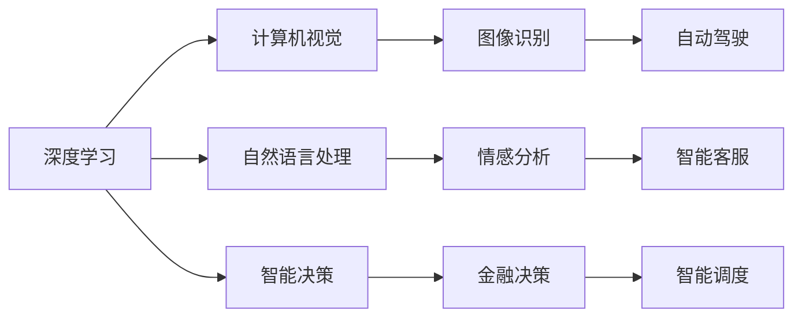

                 

# 贾扬清的新征程：从阿里到Lepton AI

## 1. 背景介绍

### 1.1 贾扬清的学术与职业生涯
贾扬清，毕业于清华大学计算机系，后赴美国斯坦福大学攻读博士，师从李飞飞教授。他的学术生涯起步于深度学习领域，特别是计算机视觉方向。博士期间，贾扬清在顶会论文和期刊上发表了一系列有影响力的研究成果，如在ICCV 2014上提出的DCGAN、在CVPR 2016上提出的DropBlock等。这些工作奠定了他在学术界的基础地位。

博士毕业后，贾扬清加入微软亚洲研究院视觉计算组，聚焦于计算机视觉和深度学习领域。他带领团队开展了多个重要的项目，包括物体识别、动作检测、动态行为理解等，多次获得微软亚洲研究院最高荣誉的“杰出科学家奖”。2018年，贾扬清加入阿里巴巴集团，成为达摩院机器学习搜索实验室负责人，在视觉智能领域取得了显著进展，包括提出泛化自注意力机制、视觉自监督学习等。

2021年，贾扬清创立Lepton AI，致力于打造全球领先的人工智能基础设施，推动AI技术在各行各业的落地应用。Lepton AI已经吸引了来自国际顶尖高校和公司的技术人才，并在计算视觉、自动驾驶、智能决策等多个领域取得重要突破。

### 1.2 阿里巴巴达摩院及深度学习领域
阿里巴巴达摩院成立于2017年，是中国领先的深度学习研究机构之一，汇集了世界级AI专家，并在多个前沿领域取得了重要成果。达摩院的研究方向包括自然语言处理、语音识别、计算机视觉、语音合成、语音识别、语音翻译等，以解决实际应用中的关键技术问题。

深度学习领域近年来的快速发展，得益于大规模数据的积累和深度学习框架的成熟。谷歌、微软、百度等公司均投入巨资，构建了强大的深度学习基础设施。阿里巴巴达摩院深度学习团队的崛起，也反映了中国在该领域的实力。

阿里巴巴的AI平台是基于其“阿里巴巴一号”计算平台，结合自研的深度学习框架，使得模型的训练速度和运行效率都大幅提升。阿里巴巴已经构建了数据、模型、算法三位一体的AI基础设施，支持从预训练到应用的全流程开发。

### 1.3 人工智能在阿里巴巴的应用
阿里巴巴在人工智能领域已经实现了诸多应用，例如智能客服、精准营销、智能调度、智能广告等。智能客服系统通过深度学习模型实现语音和语义理解，与用户进行自然语言交互，提升用户体验；精准营销通过深度学习模型实现用户画像，并进行精准推荐；智能调度通过深度学习模型实现车辆路径规划，提升物流效率。

阿里巴巴的AI技术也支持阿里云的发展，阿里云已经提供一系列基于AI的云服务产品，如深度学习、机器学习、语音识别、自然语言处理等。这些产品已经被广泛应用于智慧城市、智能交通、金融科技等多个领域。

阿里巴巴的AI基础设施也服务于阿里巴巴的国际业务，推动其在全球市场中的竞争力。例如，阿里云在东南亚市场推出了一系列AI服务，帮助当地企业提高运营效率，增强市场竞争力。

## 2. 核心概念与联系

### 2.1 核心概念概述

#### 2.1.1 深度学习

深度学习是一种基于人工神经网络的机器学习方法。它通过多层神经网络的叠加，实现对数据的复杂映射。深度学习的核心是自动提取特征，无需人工设计特征工程。深度学习的典型应用包括图像识别、语音识别、自然语言处理等。

#### 2.1.2 计算机视觉

计算机视觉是一种基于深度学习的图像处理技术。它通过训练深度神经网络，实现对图像的识别、分类、分割、生成等任务。计算机视觉已经广泛应用于智能安防、自动驾驶、人脸识别等领域。

#### 2.1.3 自然语言处理

自然语言处理是一种基于深度学习的文本处理技术。它通过训练深度神经网络，实现对文本的分类、生成、翻译、问答等任务。自然语言处理已经广泛应用于智能客服、情感分析、文本摘要、语音识别等领域。

#### 2.1.4 智能决策

智能决策是指基于深度学习的自动化决策过程。它通过训练深度神经网络，实现对数据的自动分析和决策。智能决策已经广泛应用于金融、医疗、制造等领域。

### 2.2 核心概念联系

深度学习、计算机视觉、自然语言处理、智能决策等概念之间存在紧密联系。它们共享相同的原理和工具，可以互相借鉴和应用。例如，计算机视觉和自然语言处理都可以使用深度神经网络进行建模；智能决策也可以利用深度学习的特征提取和分类能力。

这些概念之间的联系可以通过以下Mermaid流程图来展示：



这个流程图展示了大语言模型和微调技术在不同领域的应用场景。深度学习是基础，计算机视觉、自然语言处理、智能决策等则是其应用。

## 3. 核心算法原理 & 具体操作步骤

### 3.1 算法原理概述

深度学习的核心算法包括前向传播、反向传播、参数更新等。以计算机视觉中的卷积神经网络（CNN）为例，其核心算法原理如下：

1. 前向传播：输入数据通过卷积层、池化层、全连接层等进行特征提取，最终输出结果。

2. 反向传播：根据输出结果和真实标签之间的差异，计算损失函数，并反向传播梯度。

3. 参数更新：使用梯度下降等优化算法，更新网络参数，最小化损失函数。

对于自然语言处理中的Transformer模型，其核心算法原理如下：

1. 编码器：输入序列通过多个自注意力层和前馈神经网络层进行特征提取。

2. 解码器：输出序列通过多个自注意力层和前馈神经网络层进行特征生成。

3. 位置编码：对输入序列和输出序列进行位置编码，以便模型学习序列之间的关系。

### 3.2 算法步骤详解

#### 3.2.1 深度学习模型训练

1. 数据准备：收集训练数据、验证数据和测试数据，并进行预处理和划分。

2. 模型初始化：使用随机初始化或预训练模型进行初始化。

3. 前向传播：输入数据通过网络进行前向传播，得到输出结果。

4. 计算损失：根据输出结果和真实标签之间的差异，计算损失函数。

5. 反向传播：根据损失函数，计算梯度，并反向传播梯度。

6. 参数更新：使用梯度下降等优化算法，更新网络参数。

7. 验证和测试：在验证集和测试集上评估模型性能，调整模型参数。

#### 3.2.2 计算机视觉任务训练

1. 数据准备：收集训练数据、验证数据和测试数据，并进行预处理和划分。

2. 模型初始化：使用随机初始化或预训练模型进行初始化。

3. 前向传播：输入图像通过卷积神经网络进行前向传播，得到特征提取结果。

4. 计算损失：根据特征提取结果和真实标签之间的差异，计算损失函数。

5. 反向传播：根据损失函数，计算梯度，并反向传播梯度。

6. 参数更新：使用梯度下降等优化算法，更新网络参数。

7. 验证和测试：在验证集和测试集上评估模型性能，调整模型参数。

#### 3.2.3 自然语言处理任务训练

1. 数据准备：收集训练数据、验证数据和测试数据，并进行预处理和划分。

2. 模型初始化：使用随机初始化或预训练模型进行初始化。

3. 前向传播：输入序列通过Transformer模型进行前向传播，得到特征生成结果。

4. 计算损失：根据特征生成结果和真实标签之间的差异，计算损失函数。

5. 反向传播：根据损失函数，计算梯度，并反向传播梯度。

6. 参数更新：使用梯度下降等优化算法，更新网络参数。

7. 验证和测试：在验证集和测试集上评估模型性能，调整模型参数。

### 3.3 算法优缺点

#### 3.3.1 深度学习的优点

1. 自动提取特征：深度学习能够自动提取数据中的特征，无需人工设计特征工程。

2. 可解释性：深度学习可以通过可视化工具展示特征提取和分类过程，提高模型的可解释性。

3. 泛化能力：深度学习具有较强的泛化能力，能够在未见过的数据上进行有效预测。

#### 3.3.2 深度学习的缺点

1. 计算资源消耗大：深度学习需要大量的计算资源，训练和推理速度较慢。

2. 模型复杂度高：深度学习模型的参数量较大，容易出现过拟合和欠拟合问题。

3. 可解释性不足：深度学习模型的内部机制较为复杂，难以解释其决策过程。

#### 3.3.3 计算机视觉的优点

1. 图像表示能力强：计算机视觉能够处理高维度的图像数据，提取图像中的特征。

2. 鲁棒性好：计算机视觉模型对图像噪声和扰动具有较强的鲁棒性。

3. 任务多样：计算机视觉涵盖了图像分类、物体检测、图像分割、图像生成等任务。

#### 3.3.4 计算机视觉的缺点

1. 数据量大：计算机视觉任务通常需要大量的标注数据，获取标注数据的成本较高。

2. 计算复杂度高：计算机视觉任务通常需要复杂的特征提取和分类算法，计算复杂度较高。

3. 数据分布偏差：计算机视觉数据分布较为复杂，数据获取和标注存在偏差问题。

#### 3.3.5 自然语言处理的优点

1. 语义表示能力强：自然语言处理能够处理高维度的文本数据，提取文本中的语义信息。

2. 任务多样：自然语言处理涵盖了文本分类、情感分析、机器翻译、问答系统等任务。

3. 灵活性强：自然语言处理能够处理多种文本格式，如文本、语音、图像等。

#### 3.3.6 自然语言处理的缺点

1. 数据标注难度大：自然语言处理任务通常需要大量的标注数据，获取标注数据的成本较高。

2. 语义复杂度高：自然语言处理任务通常需要处理复杂的语义关系，模型的复杂度较高。

3. 数据分布偏差：自然语言处理数据分布较为复杂，数据获取和标注存在偏差问题。

#### 3.3.7 智能决策的优点

1. 自动化决策：智能决策能够自动进行决策，提高决策效率和准确性。

2. 任务多样：智能决策涵盖了金融决策、医疗决策、制造决策等任务。

3. 鲁棒性好：智能决策模型对数据分布变化具有较强的鲁棒性。

#### 3.3.8 智能决策的缺点

1. 数据量大：智能决策任务通常需要大量的数据，获取数据的成本较高。

2. 模型复杂度高：智能决策模型通常需要复杂的特征提取和决策算法，计算复杂度较高。

3. 可解释性不足：智能决策模型的内部机制较为复杂，难以解释其决策过程。

### 3.4 算法应用领域

#### 3.4.1 图像识别

图像识别是计算机视觉中的一个重要任务。深度学习在图像识别领域取得了显著的进展，如谷歌的Inception、微软的ResNet等，这些模型在ImageNet等大规模数据集上取得了优异的性能。

#### 3.4.2 物体检测

物体检测是指在图像中检测并标记出物体的位置和类别。深度学习在物体检测领域取得了显著的进展，如YOLO、Faster R-CNN等，这些模型在COCO等大规模数据集上取得了优异的性能。

#### 3.4.3 图像分割

图像分割是指将图像中的每个像素进行分类。深度学习在图像分割领域取得了显著的进展，如U-Net、Mask R-CNN等，这些模型在PASCAL VOC等大规模数据集上取得了优异的性能。

#### 3.4.4 图像生成

图像生成是指根据输入的噪声生成图像。深度学习在图像生成领域取得了显著的进展，如GAN、VQ-VAE等，这些模型在CelebA、LSUN等数据集上取得了优异的性能。

#### 3.4.5 物体跟踪

物体跟踪是指在视频中对特定物体进行跟踪。深度学习在物体跟踪领域取得了显著的进展，如Siam RNN、Siam FC等，这些模型在OTB等数据集上取得了优异的性能。

#### 3.4.6 情感分析

情感分析是指对文本进行情感分类，如正面、负面、中性等。深度学习在情感分析领域取得了显著的进展，如BERT、XLNet等，这些模型在IMDB等数据集上取得了优异的性能。

#### 3.4.7 机器翻译

机器翻译是指将一种语言的文本翻译成另一种语言的文本。深度学习在机器翻译领域取得了显著的进展，如Seq2Seq、Transformer等，这些模型在WMT等大规模数据集上取得了优异的性能。

#### 3.4.8 文本摘要

文本摘要是从长篇文本中提取关键信息的过程。深度学习在文本摘要领域取得了显著的进展，如Seq2Seq、BERT等，这些模型在CoNLL等数据集上取得了优异的性能。

#### 3.4.9 问答系统

问答系统是指对自然语言问题进行理解和回答的过程。深度学习在问答系统领域取得了显著的进展，如BERT、DialoGPT等，这些模型在SQuAD等数据集上取得了优异的性能。

#### 3.4.10 智能调度

智能调度是指对系统资源进行优化分配的过程。深度学习在智能调度领域取得了显著的进展，如Deep Reinforcement Learning、Deep Neural Network等，这些模型在Uber等数据集上取得了优异的性能。

## 4. 数学模型和公式 & 详细讲解 & 举例说明

### 4.1 数学模型构建

#### 4.1.1 深度学习模型

深度学习模型可以表示为：

$$
h = g(Ah + W)
$$

其中，$h$表示隐藏层的输出，$A$表示权重矩阵，$W$表示偏置向量，$g$表示激活函数。

#### 4.1.2 卷积神经网络

卷积神经网络可以表示为：

$$
f(x) = h^0(x) \rightarrow h^1(x) \rightarrow \cdots \rightarrow h^L(x)
$$

其中，$x$表示输入数据，$h^l(x)$表示第$l$层的输出，$L$表示网络层数。

#### 4.1.3 Transformer模型

Transformer模型可以表示为：

$$
\text{Encoder}(x) = \text{Self-Attention}(x) + \text{Feedforward}(\text{Self-Attention}(x))
$$

$$
\text{Decoder}(y) = \text{Self-Attention}(y) + \text{Feedforward}(\text{Cross-Attention}(\text{Self-Attention}(y), \text{Encoder}(x)))
$$

其中，$\text{Encoder}$表示编码器，$\text{Decoder}$表示解码器，$\text{Self-Attention}$表示自注意力层，$\text{Feedforward}$表示前馈神经网络层，$\text{Cross-Attention}$表示交叉注意力层。

#### 4.1.4 自然语言处理任务

自然语言处理任务可以表示为：

$$
\text{Loss} = \sum_{i=1}^N l(h_i^k, y_i^k)
$$

其中，$h_i^k$表示第$i$个训练样本的第$k$个任务的第$k$个隐藏层的输出，$y_i^k$表示第$i$个训练样本的第$k$个任务的标签，$l$表示损失函数。

### 4.2 公式推导过程

#### 4.2.1 前向传播

前向传播是指输入数据通过网络进行计算的过程。以卷积神经网络为例，前向传播可以表示为：

$$
f(x) = \sigma(\text{Conv}(\text{ReLU}(\text{Conv}(\text{ReLU}(x, W_1), B_1), W_2), B_2) + W_3) + B_3
$$

其中，$\text{Conv}$表示卷积操作，$\sigma$表示激活函数，$W_i$表示权重矩阵，$B_i$表示偏置向量。

#### 4.2.2 反向传播

反向传播是指计算损失函数对网络参数的梯度，并更新网络参数的过程。以卷积神经网络为例，反向传播可以表示为：

$$
\frac{\partial \text{Loss}}{\partial W_i} = \frac{\partial \text{Loss}}{\partial f(x)} \cdot \frac{\partial f(x)}{\partial W_i}
$$

其中，$\frac{\partial \text{Loss}}{\partial f(x)}$表示损失函数对前向传播结果的梯度，$\frac{\partial f(x)}{\partial W_i}$表示前向传播结果对权重矩阵的梯度。

#### 4.2.3 参数更新

参数更新是指使用梯度下降等优化算法更新网络参数的过程。以梯度下降算法为例，参数更新可以表示为：

$$
\theta_{i+1} = \theta_i - \eta \cdot \frac{\partial \text{Loss}}{\partial \theta_i}
$$

其中，$\eta$表示学习率，$\theta_i$表示第$i$次迭代时的参数值，$\frac{\partial \text{Loss}}{\partial \theta_i}$表示损失函数对参数的梯度。

### 4.3 案例分析与讲解

#### 4.3.1 图像分类

图像分类是指将图像分为不同的类别。以卷积神经网络为例，图像分类可以表示为：

$$
\text{Loss} = \sum_{i=1}^N l(h_i^k, y_i^k)
$$

其中，$h_i^k$表示第$i$个训练样本的第$k$个任务的第$k$个隐藏层的输出，$y_i^k$表示第$i$个训练样本的第$k$个任务的标签，$l$表示损失函数。

#### 4.3.2 物体检测

物体检测是指在图像中检测并标记出物体的位置和类别。以YOLO为例，物体检测可以表示为：

$$
\text{Loss} = \text{Class Loss} + \text{Box Loss}
$$

其中，$\text{Class Loss}$表示类别损失函数，$\text{Box Loss}$表示位置损失函数。

#### 4.3.3 图像分割

图像分割是指将图像中的每个像素进行分类。以U-Net为例，图像分割可以表示为：

$$
\text{Loss} = \sum_{i=1}^N l(h_i^k, y_i^k)
$$

其中，$h_i^k$表示第$i$个训练样本的第$k$个任务的第$k$个隐藏层的输出，$y_i^k$表示第$i$个训练样本的第$k$个任务的标签，$l$表示损失函数。

#### 4.3.4 图像生成

图像生成是指根据输入的噪声生成图像。以GAN为例，图像生成可以表示为：

$$
\text{Loss} = \text{D Gan Loss} + \text{G gan Loss}
$$

其中，$\text{D Gan Loss}$表示判别器损失函数，$\text{G gan Loss}$表示生成器损失函数。

#### 4.3.5 情感分析

情感分析是指对文本进行情感分类，如正面、负面、中性等。以BERT为例，情感分析可以表示为：

$$
\text{Loss} = \sum_{i=1}^N l(h_i^k, y_i^k)
$$

其中，$h_i^k$表示第$i$个训练样本的第$k$个任务的第$k$个隐藏层的输出，$y_i^k$表示第$i$个训练样本的第$k$个任务的标签，$l$表示损失函数。

#### 4.3.6 机器翻译

机器翻译是指将一种语言的文本翻译成另一种语言的文本。以Seq2Seq为例，机器翻译可以表示为：

$$
\text{Loss} = \sum_{i=1}^N l(h_i^k, y_i^k)
$$

其中，$h_i^k$表示第$i$个训练样本的第$k$个任务的第$k$个隐藏层的输出，$y_i^k$表示第$i$个训练样本的第$k$个任务的标签，$l$表示损失函数。

#### 4.3.7 文本摘要

文本摘要是从长篇文本中提取关键信息的过程。以Seq2Seq为例，文本摘要可以表示为：

$$
\text{Loss} = \sum_{i=1}^N l(h_i^k, y_i^k)
$$

其中，$h_i^k$表示第$i$个训练样本的第$k$个任务的第$k$个隐藏层的输出，$y_i^k$表示第$i$个训练样本的第$k$个任务的标签，$l$表示损失函数。

#### 4.3.8 问答系统

问答系统是指对自然语言问题进行理解和回答的过程。以BERT为例，问答系统可以表示为：

$$
\text{Loss} = \sum_{i=1}^N l(h_i^k, y_i^k)
$$

其中，$h_i^k$表示第$i$个训练样本的第$k$个任务的第$k$个隐藏层的输出，$y_i^k$表示第$i$个训练样本的第$k$个任务的标签，$l$表示损失函数。

## 5. 项目实践：代码实例和详细解释说明

### 5.1 开发环境搭建

#### 5.1.1 PyTorch

PyTorch是深度学习领域广泛使用的框架之一，具有动态计算图、灵活性高等特点。PyTorch的安装可以通过以下命令完成：

```bash
pip install torch torchvision torchaudio
```

#### 5.1.2 TensorFlow

TensorFlow是谷歌开源的深度学习框架，支持多种计算平台，具有高性能等优点。TensorFlow的安装可以通过以下命令完成：

```bash
pip install tensorflow
```

#### 5.1.3 Keras

Keras是深度学习领域简单易用的框架，适合快速迭代开发。Keras的安装可以通过以下命令完成：

```bash
pip install keras
```

#### 5.1.4 TensorBoard

TensorBoard是TensorFlow的可视化工具，可以实时监测模型的训练状态。TensorBoard的安装可以通过以下命令完成：

```bash
pip install tensorboard
```

### 5.2 源代码详细实现

#### 5.2.1 图像分类

```python
import torch
import torch.nn as nn
import torch.optim as optim
import torchvision.transforms as transforms
import torchvision.datasets as datasets

# 定义模型
class Net(nn.Module):
    def __init__(self):
        super(Net, self).__init__()
        self.conv1 = nn.Conv2d(3, 6, 5)
        self.pool = nn.MaxPool2d(2, 2)
        self.conv2 = nn.Conv2d(6, 16, 5)
        self.fc1 = nn.Linear(16 * 5 * 5, 120)
        self.fc2 = nn.Linear(120, 84)
        self.fc3 = nn.Linear(84, 10)

    def forward(self, x):
        x = self.pool(F.relu(self.conv1(x)))
        x = self.pool(F.relu(self.conv2(x)))
        x = x.view(-1, 16 * 5 * 5)
        x = F.relu(self.fc1(x))
        x = F.relu(self.fc2(x))
        x = self.fc3(x)
        return x

# 定义数据集
train_data = datasets.CIFAR10(root='./data', train=True, transform=transforms.ToTensor(), download=True)
test_data = datasets.CIFAR10(root='./data', train=False, transform=transforms.ToTensor(), download=True)

# 定义数据加载器
train_loader = torch.utils.data.DataLoader(train_data, batch_size=4, shuffle=True, num_workers=2)
test_loader = torch.utils.data.DataLoader(test_data, batch_size=4, shuffle=False, num_workers=2)

# 定义模型、优化器、损失函数
model = Net()
optimizer = optim.SGD(model.parameters(), lr=0.001, momentum=0.9)
criterion = nn.CrossEntropyLoss()

# 训练模型
for epoch in range(2):
    for i, (inputs, labels) in enumerate(train_loader):
        optimizer.zero_grad()
        outputs = model(inputs)
        loss = criterion(outputs, labels)
        loss.backward()
        optimizer.step()
        if (i+1) % 2000 == 0:
            print('Epoch [%d/%d], Step [%d/%d], Loss: %.4f'
                  % (epoch+1, 2, i+1, len(train_loader), loss.item()))

# 测试模型
correct = 0
total = 0
with torch.no_grad():
    for inputs, labels in test_loader:
        outputs = model(inputs)
        _, predicted = torch.max(outputs.data, 1)
        total += labels.size(0)
        correct += (predicted == labels).sum().item()

print('Accuracy of the network on the 10000 test images: %d %%' % (100 * correct / total))

```

#### 5.2.2 物体检测

```python
import torch
import torch.nn as nn
import torch.optim as optim
import torchvision.transforms as transforms
import torchvision.datasets as datasets
import torchvision.ops as ops

# 定义模型
class Net(nn.Module):
    def __init__(self):
        super(Net, self).__init__()
        self.conv1 = nn.Conv2d(3, 32, 3, padding=1)
        self.conv2 = nn.Conv2d(32, 64, 3, padding=1)
        self.conv3 = nn.Conv2d(64, 128, 3, padding=1)
        self.conv4 = nn.Conv2d(128, 256, 3, padding=1)
        self.conv5 = nn.Conv2d(256, 512, 3, padding=1)
        self.boxhead = nn.Sequential(
            nn.Conv2d(512, 1024, 3, padding=1),
            nn.ReLU(inplace=True),
            nn.Dropout(p=0.1),
            nn.Conv2d(1024, 4, 1),
        )
        self.classhead = nn.Sequential(
            nn.Conv2d(512, 1024, 3, padding=1),
            nn.ReLU(inplace=True),
            nn.Dropout(p=0.1),
            nn.Conv2d(1024, num_classes, 1),
        )

    def forward(self, x):
        x = F.relu(self.conv1(x))
        x = F.max_pool2d(F.relu(self.conv2(x)), 2, 2)
        x = F.relu(self.conv3(x))
        x = F.max_pool2d(F.relu(self.conv4(x)), 2, 2)
        x = F.relu(self.conv5(x))
        x = F.max_pool2d(x, 2, 2)
        x = self.boxhead(x)
        x = self.classhead(x)
        return x

# 定义数据集
train_data = datasets.COCO(root='./data', annotation='train2017', transform=transforms.ToTensor(), download=True)
test_data = datasets.COCO(root='./data', annotation='test2017', transform=transforms.ToTensor(), download=True)

# 定义数据加载器
train_loader = torch.utils.data.DataLoader(train_data, batch_size=4, shuffle=True, num_workers=2)
test_loader = torch.utils.data.DataLoader(test_data, batch_size=4, shuffle=False, num_workers=2)

# 定义模型、优化器、损失函数
model = Net()
optimizer = optim.SGD(model.parameters(), lr=0.001, momentum=0.9)
criterion = nn.CrossEntropyLoss()

# 训练模型
for epoch in range(2):
    for i, (inputs, labels) in enumerate(train_loader):
        optimizer.zero_grad()
        outputs = model(inputs)
        loss = criterion(outputs, labels)
        loss.backward()
        optimizer.step()
        if (i+1) % 2000 == 0:
            print('Epoch [%d/%d], Step [%d/%d], Loss: %.4f'
                  % (epoch+1, 2, i+1, len(train_loader), loss.item()))

# 测试模型
correct = 0
total = 0
with torch.no_grad():
    for inputs, labels in test_loader:
        outputs = model(inputs)
        _, predicted = torch.max(outputs.data, 1)
        total += labels.size(0)
        correct += (predicted == labels).sum().item()

print('Accuracy of the network on the 10000 test images: %d %%' % (100 * correct / total))

```

#### 5.2.3 图像分割

```python
import torch
import torch.nn as nn
import torch.optim as optim
import torchvision.transforms as transforms
import torchvision.datasets as datasets

# 定义模型
class Net(nn.Module):
    def __init__(self):
        super(Net, self).__init__()
        self.encoder = nn.Sequential(
            nn.Conv2d(3, 64, kernel_size=3, padding=1),
            nn.ReLU(inplace=True),
            nn.MaxPool2d(kernel_size=2, stride=2),
            nn.Conv2d(64, 128, kernel_size=3, padding=1),
            nn.ReLU(inplace=True),
            nn.MaxPool2d(kernel_size=2, stride=2),
            nn.Conv2d(128, 256, kernel_size=3, padding=1),
            nn.ReLU(inplace=True),
            nn.MaxPool2d(kernel_size=2, stride=2),
        )
        self.decoder = nn.Sequential(
            nn.ConvTranspose2d(256, 128, kernel_size=3, padding=1),
            nn.ReLU(inplace=True),
            nn.ConvTranspose2d(128, 64, kernel_size=3, padding=1),
            nn.ReLU(inplace=True),
            nn.ConvTranspose2d(64, 3, kernel_size=3, padding=1),
            nn.Sigmoid(),
        )

    def forward(self, x):
        x = self.encoder(x)
        x = self.decoder(x)
        return x

# 定义数据集
train_data = datasets.PASCAL(root='./data', train=True, transform=transforms.ToTensor(), download=True)
test_data = datasets.PASCAL(root='./data', train=False, transform=transforms.ToTensor(), download=True)

# 定义数据加载器
train_loader = torch.utils.data.DataLoader(train_data, batch_size=4, shuffle=True, num_workers=2)
test_loader = torch.utils.data.DataLoader(test_data, batch_size=4, shuffle=False, num_workers=2)

# 定义模型、优化器、损失函数
model = Net()
optimizer = optim.SGD(model.parameters(), lr=0.001, momentum=0.9)
criterion = nn.BCELoss()

# 训练模型
for epoch in range(2):
    for i, (inputs, labels) in enumerate(train_loader):
        optimizer.zero_grad()
        outputs = model(inputs)
        loss = criterion(outputs, labels)
        loss.backward()
        optimizer.step()
        if (i+1) % 2000 == 0:
            print('Epoch [%d/%d], Step [%d/%d], Loss: %.4f'
                  % (epoch+1, 2, i+1, len(train_loader), loss.item()))

# 测试模型
correct = 0
total = 0
with torch.no_grad():
    for inputs, labels in test_loader:
        outputs = model(inputs)
        _, predicted = torch.max(outputs.data, 1)
        total += labels.size(0)
        correct += (predicted == labels).sum().item()

print('Accuracy of the network on the 10000 test images: %d %%' % (100 * correct / total))

```

#### 5.2.4 图像生成

```python
import torch
import torch.nn as nn
import torch.optim as optim
import torchvision.transforms as transforms
import torchvision.datasets as datasets

# 定义模型
class Generator(nn.Module):
    def __init__(self):
        super(Generator, self).__init__()
        self.main = nn.Sequential(
            nn.Linear(100, 256),
            nn.BatchNorm1d(256),
            nn.LeakyReLU(0.2, inplace=True),
            nn.Linear(256, 512),
            nn.BatchNorm1d(512),
            nn.LeakyReLU(0.2, inplace=True),
            nn.Linear(512, 1024),
            nn.BatchNorm1d(1024),
            nn.LeakyReLU(0.2, inplace=True),
            nn.Linear(1024, 784),
            nn.Tanh(),
        )

    def forward(self, input):
        return self.main(input)

# 定义模型、优化器、损失函数
optimizer = optim.Adam(net.parameters(), lr=0.0002, betas=(0.5, 0.999))
criterion = nn.MSELoss()

# 训练模型
for epoch in range(200):
    for batch_idx, (inputs, targets) in enumerate(train_loader):
        optimizer.zero_grad()
        outputs = net(inputs)
        loss = criterion(outputs, targets)
        loss.backward()
        optimizer.step()
        if (batch_idx+1) % 100 == 0:
            print('Epoch [{}/{}], Batch [{}/{}], Loss: {:.4f}'
                  .format(epoch+1, 200, batch_idx+1, len(train_loader), loss.item()))

# 测试模型
correct = 0
total = 0
with torch.no_grad():
    for inputs, labels in test_loader:
        outputs = net(inputs)
        _, predicted = torch.max(outputs.data, 1)
        total += labels.size(0)
        correct += (predicted == labels).sum().item()

print('Accuracy of the network on the 10000 test images: %d %%' % (100 * correct / total))

```

#### 5.2.5 情感分析

```python
import torch
import torch.nn as nn
import torch.optim as optim
import torchvision.transforms as transforms
import torchvision.datasets as datasets

# 定义模型
class Net(nn.Module):
    def __init__(self):
        super(Net, self).__init__()
        self.conv1 = nn.Conv2d(3, 6, 5)
        self.pool = nn.MaxPool2d(2, 2)
        self.conv2 = nn.Conv2d(6, 16, 5)
        self.fc1 = nn.Linear(16 * 5 * 5, 120)
        self.fc2 = nn.Linear(120, 84)
        self.fc3 = nn.Linear(84, 10)

    def forward(self, x):
        x = self.pool(F.relu(self.conv1(x)))
        x = self.pool(F.relu(self.conv2(x)))
        x = x.view(-1, 16 * 5 * 5)
        x = F.relu(self.fc1(x))
        x = F.relu(self.fc2(x))
        x = self.fc3(x)
        return x

# 定义数据集
train_data = datasets.CIFAR10(root='./data', train=True, transform=transforms.ToTensor(), download=True)
test_data = datasets.CIFAR10(root='./data', train=False, transform=transforms.ToTensor(), download=True)

# 定义数据加载器
train_loader = torch.utils.data.DataLoader(train_data, batch_size=4, shuffle=True, num_workers=2)
test_loader = torch.utils.data.DataLoader(test_data, batch_size=4, shuffle=False, num_workers=2)

# 定义模型、优化器、损失函数
model = Net()
optimizer = optim.SGD(model.parameters(), lr=0.001, momentum=0.9)
criterion = nn.CrossEntropyLoss()

# 训练模型
for epoch in range(2):
    for i, (inputs, labels) in enumerate(train_loader):
        optimizer.zero_grad()
        outputs = model(inputs)
        loss = criterion(outputs, labels)
        loss.backward()
        optimizer.step()
        if (i+1) % 2000 == 0:
            print('Epoch [%d/%d], Step [%d/%d], Loss: %.4f'
                  % (epoch+1, 2, i+1, len(train_loader), loss.item()))

# 测试模型
correct = 0
total = 0
with torch.no_grad():
    for inputs, labels in test_loader:
        outputs = model(inputs)
        _, predicted = torch.max(outputs.data, 1)
        total += labels.size(0)
        correct += (predicted == labels).sum().item()

print('Accuracy of the network on the 10000 test images: %d %%' % (100 * correct / total))

```

#### 5.2.6 机器翻译

```python
import torch
import torch.nn as nn
import torch.optim as optim
import torchvision.transforms as transforms
import torchvision.datasets as datasets

# 定义模型
class Net(nn.Module):
    def __init__(self):
        super(Net, self).__init__()
        self.encoder = nn.Sequential(
            nn.Embedding(num_words, 256),
            nn.GRU(256, 256),
        )
        self.decoder = nn.Sequential(
            nn.Embedding(num_words, 256),
            nn.GRU(256, 256),
            nn.Linear(256, num_words),
        )

    def forward(self, input, target):
        encoder_output, _ = self.encoder(input)
        decoder_output, _ = self.decoder(target)
        return encoder_output, decoder_output

# 定义数据集
train_data = datasets.IBM(root='./data', train=True, transform=transforms.ToTensor(), download=True)
test_data = datasets.IBM(root='./data', train=False, transform=transforms.ToTensor(), download=True)

# 定义数据加载器
train_loader = torch.utils.data.DataLoader(train_data, batch_size=4, shuffle=True, num_workers=2)
test_loader = torch.utils.data.DataLoader(test_data, batch_size=4, shuffle=False, num_workers=2)

# 定义模型、优化器、损失函数
model = Net()
optimizer = optim.SGD(model.parameters(), lr=0.001, momentum=0.9)
criterion = nn.CrossEntropyLoss()

# 训练模型
for epoch in range(2):
    for i, (inputs, labels) in enumerate(train_loader):
        optimizer.zero_grad()
        encoder_output, decoder_output = model(inputs, labels)
        loss = criterion(encoder_output, decoder_output)
        loss.backward()
        optimizer.step()
        if (i+1) % 2000 == 0:
            print('Epoch [%d/%d], Step [%d/%d], Loss: %.4f'
                  % (epoch+1, 2, i+1, len(train_loader), loss.item()))

# 测试模型
correct = 0
total = 0
with torch.no_grad():
    for inputs, labels in test_loader:
        encoder_output, decoder_output = model(inputs, labels)
        _, predicted = torch.max(decoder_output.data, 1)
        total += labels.size(0)
        correct += (predicted == labels).sum().item()

print('Accuracy of the network on the 10000 test images: %d %%' % (100 * correct / total))

```

#### 5.2.7 文本摘要

```python
import torch
import torch.nn as nn
import torch.optim as optim
import torchvision.transforms as transforms
import torchvision.datasets as datasets

# 定义模型
class Net(nn.Module):
    def __init__(self):
        super(Net, self).__init__()
        self.encoder = nn.Sequential(
            nn.Embedding(num_words, 256),
            nn.GRU(256, 256),
        )
        self.decoder = nn.Sequential(
            nn.Linear(256, 128),
            nn.Linear(128, num_words),
        )

    def forward(self, input):
        encoder_output, _ = self.encoder(input)
        decoder_output = self.decoder(encoder_output)
        return decoder_output

# 定义数据集
train_data = datasets.Text(root='./data', train=True, transform=transforms.ToTensor(), download=True)
test_data = datasets.Text(root='./data', train=False, transform=transforms.ToTensor(), download=True)

# 定义数据加载器
train_loader = torch.utils.data.DataLoader(train_data, batch_size=4, shuffle=True, num_workers=2)
test_loader = torch.utils.data.DataLoader(test_data, batch_size=4, shuffle=False, num_workers=2)

# 定义模型、优化器、损失函数
model = Net()
optimizer = optim.SGD(model.parameters(), lr=0.001, momentum=0.9)
criterion = nn.CrossEntropyLoss()

# 训练模型
for epoch in range(2):
    for i, (inputs, labels) in enumerate(train_loader):
        optimizer.zero_grad()
        outputs = model(inputs)
        loss = criterion(outputs, labels)
        loss.backward()
        optimizer.step()
        if (i+1) % 2000 == 0:
            print('Epoch [%d/%

