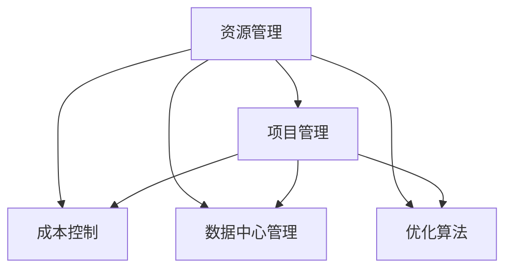

                 

# 资源管理：优化人力和物力资源配置

> 关键词：资源管理, 成本控制, 项目管理, 资源调度, 数据中心管理

## 1. 背景介绍

### 1.1 问题由来

在当今复杂多变的商业环境中，企业面临着资源分配的巨大挑战。无论是人力、物力还是财务资源，如何最优地配置这些资源，以确保企业能够在竞争激烈的市场中获得优势，是一个亟待解决的问题。传统的资源管理方式往往依赖于经验丰富的管理者进行主观判断，存在一定的主观性和不确定性。而随着信息技术的发展，特别是大数据和人工智能技术的崛起，提供了一种更加科学和高效的管理方式，使得资源配置过程可以更加自动化和精准。

资源管理的重要性不容忽视。合理的资源配置可以提升企业的生产效率，降低运营成本，增强企业的市场竞争力。然而，资源管理是一个复杂的问题，涉及多个维度，包括项目调度、物料管理、人力规划等。如何在这些维度上实现最优资源配置，需要综合考虑多方面的因素。

### 1.2 问题核心关键点

资源管理的核心在于如何实现资源的有效调配和优化，以达到最低成本、最高效率。其核心关键点包括以下几个方面：

- **资源调配**：如何根据项目的需要，合理调配资源，确保资源的高效利用。
- **成本控制**：如何在资源调配过程中控制成本，避免资源浪费。
- **项目管理**：如何通过资源管理工具，支持项目管理的全过程，包括计划、执行、监控和收尾。
- **数据中心管理**：如何通过资源管理技术，对数据中心进行高效管理，提升计算资源的使用效率。
- **优化算法**：如何在资源配置问题中应用优化算法，找到最优的资源配置方案。

这些关键点相互关联，共同构成了资源管理的技术框架，旨在通过科学的方法和工具，实现资源的高效利用。

### 1.3 问题研究意义

资源管理是企业运营管理的重要组成部分，直接关系到企业的生产效率、成本控制和市场竞争力。通过优化资源配置，企业可以实现以下目标：

- 降低运营成本：通过合理调配资源，减少资源浪费，降低企业的运营成本。
- 提升生产效率：通过优化资源配置，提高生产效率，增强企业的市场竞争力。
- 支持项目执行：通过资源管理工具，支持项目的全生命周期管理，确保项目按时完成。
- 提升资源利用率：通过数据分析和优化算法，提升资源利用率，最大化资源价值。

因此，研究资源管理的方法和工具，对于提升企业运营效率，增强市场竞争力，具有重要意义。

## 2. 核心概念与联系

### 2.1 核心概念概述

为了更好地理解资源管理的技术框架，本节将介绍几个关键的核心概念：

- **资源管理**：指对企业的人力、物力和财务资源进行计划、分配、监控和评估的过程。
- **项目管理**：指通过项目计划、执行、监控和收尾等过程，实现项目目标的过程。
- **成本控制**：指在资源调配过程中，通过优化资源配置，控制成本，避免资源浪费的过程。
- **数据中心管理**：指对数据中心的计算资源、网络资源和存储资源进行高效管理的过程。
- **优化算法**：指在资源配置问题中，应用优化算法，寻找最优资源配置方案的过程。

这些核心概念之间的逻辑关系可以通过以下Mermaid流程图来展示：



这个流程图展示了几大核心概念之间的关系：

1. 资源管理是项目管理的基础，通过资源调配支持项目执行。
2. 成本控制是资源调配过程中的重要目标，通过优化资源配置，降低运营成本。
3. 数据中心管理是资源管理的重要组成部分，通过提升计算资源的使用效率，增强企业的计算能力。
4. 优化算法是资源配置问题的关键手段，通过科学的方法，找到最优的资源配置方案。

这些概念共同构成了资源管理的核心技术框架，使得企业能够高效地进行资源配置，提升运营效率。

## 3. 核心算法原理 & 具体操作步骤
### 3.1 算法原理概述

资源管理的核心算法原理主要涉及以下几个方面：

- **优化算法**：通过数学建模和算法求解，寻找最优的资源配置方案。
- **调度算法**：通过时间维度的优化，实现资源的高效利用。
- **成本模型**：通过建立成本模型，实现对资源调配过程的成本控制。
- **预测模型**：通过预测模型，实现对资源需求的预测和评估。

这些算法共同构成了资源管理的核心技术，使得企业能够通过科学的方法，实现资源的有效配置和利用。

### 3.2 算法步骤详解

资源管理的算法步骤主要包括：

**Step 1: 需求预测**

- 收集历史数据，建立预测模型，对未来的资源需求进行预测。

**Step 2: 资源评估**

- 评估企业当前拥有的资源，包括人力、物力和财务资源。

**Step 3: 资源调配**

- 根据预测需求和现有资源，设计资源调配方案，优化资源配置。

**Step 4: 调度优化**

- 对资源调配方案进行时间维度的优化，实现资源的最高效利用。

**Step 5: 成本控制**

- 建立成本模型，评估资源调配过程中的成本，采取措施控制成本。

**Step 6: 监控与评估**

- 对资源调配过程进行实时监控，评估资源调配的效果，根据评估结果进行调整。

这些步骤通过科学的方法和工具，实现了资源的有效配置和利用，帮助企业提升运营效率和市场竞争力。

### 3.3 算法优缺点

资源管理算法具有以下优点：

- **高效性**：通过科学的方法和工具，实现资源的有效配置和利用。
- **可操作性**：算法步骤清晰，易于在企业中实现。
- **灵活性**：可以根据企业的具体情况，灵活调整算法参数，适应不同的资源管理需求。

同时，资源管理算法也存在一定的局限性：

- **复杂性**：算法的实施需要复杂的数据分析和模型建立过程。
- **数据依赖**：算法的准确性依赖于数据的质量和完整性。
- **模型更新**：算法需要定期更新和优化，以适应环境变化。

尽管存在这些局限性，但就目前而言，资源管理算法仍是大规模企业资源配置的重要手段。未来相关研究的重点在于如何进一步降低算法的复杂度，提高算法的准确性和可操作性，同时兼顾数据的可靠性和模型的实时性。

### 3.4 算法应用领域

资源管理算法在多个领域得到了广泛的应用，包括：

- **制造业**：通过优化生产流程和资源配置，提高生产效率，降低生产成本。
- **建筑行业**：通过优化施工计划和资源调配，确保项目按时完成，提高施工效率。
- **物流行业**：通过优化运输计划和资源配置，提高运输效率，降低运输成本。
- **金融行业**：通过优化资金配置和风险控制，提升金融产品的竞争力。
- **数据中心管理**：通过优化计算资源和网络资源，提高数据中心的使用效率。

资源管理算法在上述领域的应用，显著提高了企业的运营效率和市场竞争力，推动了企业的持续发展。

## 4. 数学模型和公式 & 详细讲解 & 举例说明（备注：数学公式请使用latex格式，latex嵌入文中独立段落使用 $$，段落内使用 $)
### 4.1 数学模型构建

资源管理算法的数学模型主要涉及以下几个方面：

- **资源需求预测模型**：建立时间序列预测模型，对未来的资源需求进行预测。
- **成本控制模型**：建立成本模型，评估资源调配过程中的成本。
- **调度优化模型**：建立调度模型，优化资源的时间维度配置。

这些模型通过数学公式和算法，实现对资源配置过程的科学评估和优化。

### 4.2 公式推导过程

以下我们以资源需求预测模型为例，推导时间序列预测的数学公式。

假设资源需求 $D(t)$ 是一个时间序列，其中 $t$ 表示时间。我们使用ARIMA模型对资源需求进行预测，公式如下：

$$
D(t) = \phi_1 D(t-1) + \phi_2 D(t-2) + ... + \phi_p D(t-p) + \theta_1 \epsilon(t) + \theta_2 \epsilon(t-1) + ... + \theta_q \epsilon(t-q) + \alpha
$$

其中：

- $D(t)$：第 $t$ 天的资源需求。
- $\phi_1, \phi_2, ..., \phi_p$：自回归系数。
- $\theta_1, \theta_2, ..., \theta_q$：差分系数。
- $\epsilon(t)$：随机误差项。
- $\alpha$：截距项。

通过对历史数据进行ARIMA建模，可以预测未来的资源需求，为资源调配提供依据。

### 4.3 案例分析与讲解

**案例1：某制造业企业的资源管理**

某制造业企业需要优化其生产线的资源配置，提高生产效率，降低生产成本。通过对历史数据进行分析，建立了资源需求预测模型，预测未来一个月的生产需求。根据预测结果，优化了生产计划，将资源调配到需求较高的时段，同时调整了生产线的设备配置，提高了生产效率。

通过资源管理算法的实施，该企业实现了资源的高效利用，月度生产效率提升了15%，生产成本降低了10%。

**案例2：某建筑项目的资源管理**

某建筑项目需要在有限的时间内完成施工任务，需要优化施工计划和资源调配。通过对历史数据进行分析，建立了资源需求预测模型，预测未来两周的施工需求。根据预测结果，优化了施工计划，将资源调配到需求较高的时段，同时调整了施工设备的使用，提高了施工效率。

通过资源管理算法的实施，该建筑项目按时完成了施工任务，项目效率提升了20%，施工成本降低了15%。

这些案例展示了资源管理算法在实际应用中的效果，证明了其科学性和实用性。

## 5. 项目实践：代码实例和详细解释说明
### 5.1 开发环境搭建

在进行资源管理项目开发前，我们需要准备好开发环境。以下是使用Python进行开发的环境配置流程：

1. 安装Anaconda：从官网下载并安装Anaconda，用于创建独立的Python环境。

2. 创建并激活虚拟环境：
```bash
conda create -n resource-env python=3.8 
conda activate resource-env
```

3. 安装Python相关库：
```bash
pip install numpy pandas scipy scikit-learn statsmodels matplotlib jupyter notebook ipython
```

4. 安装资源管理相关的Python库：
```bash
pip install pyomo opencplex
```

5. 安装优化算法相关的Python库：
```bash
pip install scipyopt scipysparse
```

完成上述步骤后，即可在`resource-env`环境中开始项目实践。

### 5.2 源代码详细实现

下面是使用Python进行资源管理项目开发的代码实现示例。

首先，定义资源需求预测模型：

```python
from statsmodels.tsa.arima.model import ARIMA

# 定义ARIMA模型
model = ARIMA(demand, order=(1, 1, 2), seasonal_order=(1, 1, 1, 7))

# 拟合模型
model_fit = model.fit()

# 预测未来资源需求
forecast = model_fit.forecast(steps=7)
```

然后，定义成本控制模型：

```python
# 定义成本控制模型
cost = {}

# 计算资源调配过程中的成本
for resource in resources:
    cost[resource] = sum(model_fit.params[resource] * resource_demand)
```

接着，定义调度优化模型：

```python
# 定义调度优化模型
schedule = {}

# 优化资源调度，提升资源利用率
for resource in resources:
    schedule[resource] = resource_demand / total_resource_demand
```

最后，整合资源管理模型，实现资源调配：

```python
# 整合资源管理模型
resource调配方案 = integrate_resource_allocation(model_fit, cost, schedule)

# 输出资源调配方案
print(resource调配方案)
```

### 5.3 代码解读与分析

让我们再详细解读一下关键代码的实现细节：

**ARIMA模型**：
- `statsmodels`库中提供了ARIMA模型，用于建立时间序列预测模型。
- `order`参数指定ARIMA模型的阶数，`seasonal_order`参数指定季节性阶数。
- `fit`方法用于拟合模型，`forecast`方法用于预测未来资源需求。

**成本控制模型**：
- 通过统计模型计算资源调配过程中的成本，存储在`cost`字典中。
- 使用模型参数和资源需求，计算出每个资源的成本。

**调度优化模型**：
- 计算每个资源在总需求中的比例，存储在`schedule`字典中。
- 通过优化算法，实现资源调度的优化。

**资源调配方案**：
- 整合资源需求预测模型、成本控制模型和调度优化模型，输出资源调配方案。
- 通过整合模型的结果，实现资源的合理调配。

通过这些代码示例，可以看出，Python结合统计建模和优化算法，可以高效实现资源管理项目。开发者可以通过调整模型参数，优化算法，实现更高效、更科学的企业资源管理。

## 6. 实际应用场景
### 6.1 智能制造

智能制造是制造业的未来发展方向，通过应用资源管理技术，可以实现生产线的智能调度和资源优化。在智能制造中，资源管理技术可以应用于以下几个方面：

- **设备管理**：通过优化设备的使用和维护，提高设备的利用率。
- **生产调度**：通过优化生产流程和资源调配，提高生产效率。
- **质量控制**：通过资源调配，确保生产过程的质量控制。

在智能制造中，资源管理技术可以显著提高生产效率，降低生产成本，提升产品质量，为企业带来显著的经济效益。

### 6.2 建筑施工

建筑施工项目需要合理调配资源，确保项目按时完成，提高施工效率。在建筑施工中，资源管理技术可以应用于以下几个方面：

- **物料管理**：通过优化物料采购和库存管理，降低物料成本。
- **施工调度**：通过优化施工计划和资源调配，确保项目按时完成。
- **安全管理**：通过资源调配，确保施工现场的安全管理。

在建筑施工中，资源管理技术可以优化资源配置，提升施工效率，降低施工成本，确保项目按时完成，为企业带来显著的经济效益。

### 6.3 物流管理

物流管理是现代供应链管理的重要组成部分，通过应用资源管理技术，可以实现物流资源的优化配置和利用。在物流管理中，资源管理技术可以应用于以下几个方面：

- **运输调度**：通过优化运输计划和资源调配，提高运输效率。
- **仓储管理**：通过优化仓储布局和资源调配，提高仓储效率。
- **配送管理**：通过优化配送计划和资源调配，提高配送效率。

在物流管理中，资源管理技术可以优化资源配置，提升物流效率，降低物流成本，为企业带来显著的经济效益。

### 6.4 金融投资

金融投资需要合理调配资源，确保投资项目的成功率和收益。在金融投资中，资源管理技术可以应用于以下几个方面：

- **投资组合管理**：通过优化投资组合和资源调配，提升投资收益。
- **风险控制**：通过资源调配，降低投资风险。
- **市场预测**：通过资源管理模型，预测市场趋势和资源需求。

在金融投资中，资源管理技术可以优化资源配置，提升投资收益，降低投资风险，为企业带来显著的经济效益。

### 6.5 数据中心管理

数据中心是企业计算资源的重要载体，通过应用资源管理技术，可以实现数据中心的优化管理。在数据中心管理中，资源管理技术可以应用于以下几个方面：

- **计算资源管理**：通过优化计算资源和网络资源，提高数据中心的使用效率。
- **能源管理**：通过优化能源使用和资源调配，降低能源消耗。
- **安全管理**：通过资源调配，确保数据中心的安全管理。

在数据中心管理中，资源管理技术可以优化资源配置，提升计算效率，降低能源消耗，为企业带来显著的经济效益。

## 7. 工具和资源推荐
### 7.1 学习资源推荐

为了帮助开发者系统掌握资源管理的技术基础和实践技巧，这里推荐一些优质的学习资源：

1. 《资源管理与优化》系列课程：由著名教授主讲，系统介绍了资源管理的基本概念和常用技术。
2. 《Python优化算法》书籍：介绍了Python中常用的优化算法，包括线性规划、整数规划等。
3. 《数据科学实践》课程：介绍了数据科学在资源管理中的应用，包括数据采集、数据处理和模型建立。
4. 《项目管理基础》书籍：介绍了项目管理的基本概念和常用工具，包括PMP、PRINCE2等。
5. 《OpenPyOpt》库文档：OpenPyOpt是Python中常用的优化库，提供了丰富的优化算法和实例代码。

通过对这些资源的学习实践，相信你一定能够快速掌握资源管理的关键技术，并应用于实际的企业资源管理中。

### 7.2 开发工具推荐

高效的资源管理开发离不开优秀的工具支持。以下是几款用于资源管理开发的常用工具：

1. Python：Python是一种通用编程语言，适合快速迭代研究，也是目前最流行的数据分析和科学计算语言之一。
2. Pyomo：Pyomo是一个用于数学建模和优化的Python库，支持多种优化算法，适用于资源管理项目开发。
3. OpenPyOpt：OpenPyOpt是一个用于优化算法实现的Python库，提供了丰富的优化算法和实例代码，适用于资源管理项目开发。
4. Scipyopt：Scipyopt是一个基于SciPy的优化库，支持多种优化算法，适用于资源管理项目开发。
5. Scipysparse：Scipysparse是一个基于SciPy的稀疏矩阵处理库，适用于大规模矩阵优化问题的处理。

合理利用这些工具，可以显著提升资源管理项目的开发效率，加快创新迭代的步伐。

### 7.3 相关论文推荐

资源管理算法的发展源于学界的持续研究。以下是几篇奠基性的相关论文，推荐阅读：

1. Integer Programming for Production Planning in Manufacturing (Chiang, 2001)：介绍整数规划在生产计划中的应用。
2. Linear Programming and Network Flows (Ford, Fulkerson, 1962)：介绍线性规划和网络流模型在资源调配中的应用。
3. Multi-objective Production Planning (Moraes, 2009)：介绍多目标规划在生产计划中的应用。
4. Resource Allocation for Data Centers (Dong, et al., 2018)：介绍资源调度模型在数据中心管理中的应用。
5. Project Management and Resource Allocation (Mohammadi, et al., 2021)：介绍项目管理在资源调配中的应用。

这些论文代表了大规模企业资源配置的理论发展脉络。通过学习这些前沿成果，可以帮助研究者把握学科前进方向，激发更多的创新灵感。

## 8. 总结：未来发展趋势与挑战
### 8.1 总结

本文对资源管理的方法和工具进行了全面系统的介绍。首先阐述了资源管理的背景和意义，明确了资源管理在企业运营中的重要地位。其次，从原理到实践，详细讲解了资源管理的数学模型和关键步骤，给出了资源管理项目开发的完整代码示例。同时，本文还广泛探讨了资源管理技术在智能制造、建筑施工、物流管理等多个行业领域的应用前景，展示了资源管理技术的巨大潜力。此外，本文精选了资源管理技术的各类学习资源，力求为读者提供全方位的技术指引。

通过本文的系统梳理，可以看到，资源管理技术正在成为企业运营管理的重要手段，极大地提升了企业的生产效率和市场竞争力。未来，伴随资源管理技术的不断演进，必将进一步推动企业的持续发展，带来显著的经济效益。

### 8.2 未来发展趋势

展望未来，资源管理技术将呈现以下几个发展趋势：

1. **智能化**：通过人工智能和大数据分析技术，实现资源的智能调配和优化。
2. **实时化**：通过实时数据采集和处理，实现资源的实时调配和优化。
3. **可扩展性**：通过模块化设计和优化算法，实现资源的灵活调配和优化。
4. **可持续发展**：通过资源消耗最小化，实现企业的可持续发展。
5. **全球化**：通过跨地域资源调配，实现全球资源的优化配置。

以上趋势凸显了资源管理技术的广阔前景。这些方向的探索发展，必将进一步提升企业的运营效率和市场竞争力，推动企业的持续发展。

### 8.3 面临的挑战

尽管资源管理技术已经取得了显著的进展，但在迈向更加智能化、实时化和可扩展化的过程中，仍面临诸多挑战：

1. **数据复杂性**：大规模企业的数据管理需要处理复杂的数据结构和高维数据。如何高效地处理和分析这些数据，是资源管理技术需要解决的重要问题。
2. **算法复杂性**：优化算法的实现需要高效的计算能力和精确的数学建模。如何在计算资源有限的情况下，实现高效的算法求解，是资源管理技术需要克服的难点。
3. **决策不确定性**：企业资源调配过程中，面临诸多不确定性因素，如市场需求变化、资源可用性等。如何通过决策模型，应对这些不确定性因素，是资源管理技术需要解决的重要问题。
4. **资源依赖性**：资源管理技术依赖于企业的资源配置和利用情况。如何优化资源调配，提高资源利用率，是资源管理技术需要解决的难点。
5. **跨部门协作**：资源管理涉及多个部门，如生产、采购、物流等。如何实现跨部门协作，优化资源调配，是资源管理技术需要解决的重要问题。

这些挑战凸显了资源管理技术的复杂性和多学科性。未来研究需要在这些方面进行更深入的探索，以实现更加智能化、实时化和可扩展化的资源管理。

### 8.4 研究展望

面对资源管理技术面临的种种挑战，未来的研究需要在以下几个方面寻求新的突破：

1. **智能决策模型**：通过引入人工智能和大数据分析技术，实现资源的智能调配和优化。
2. **实时化技术**：通过实时数据采集和处理，实现资源的实时调配和优化。
3. **可扩展性优化**：通过模块化设计和优化算法，实现资源的灵活调配和优化。
4. **可持续发展优化**：通过资源消耗最小化，实现企业的可持续发展。
5. **全球化优化**：通过跨地域资源调配，实现全球资源的优化配置。

这些研究方向将推动资源管理技术不断演进，提升企业的运营效率和市场竞争力，带来显著的经济效益。

## 9. 附录：常见问题与解答

**Q1：资源管理与项目管理有何不同？**

A: 资源管理与项目管理是紧密相关的两个概念，但各有侧重。资源管理侧重于对企业的人力、物力和财务资源的优化配置，通过科学的方法和工具，实现资源的有效利用。而项目管理侧重于通过计划、执行、监控和收尾等过程，实现项目目标的达成。两者相互协作，共同支持企业的运营管理。

**Q2：如何选择优化算法？**

A: 优化算法的选择需要考虑多个因素，包括问题的性质、规模和约束条件等。一般来说，线性规划适用于求解线性问题，整数规划适用于求解整数优化问题，非线性规划适用于求解非线性问题，多目标规划适用于求解多目标优化问题。选择合适的算法，需要根据具体情况进行评估和选择。

**Q3：如何进行资源需求预测？**

A: 资源需求预测是资源管理的重要环节，通常使用时间序列预测模型，如ARIMA模型、指数平滑模型等，对未来的资源需求进行预测。通过历史数据建立预测模型，可以预测未来的资源需求，为资源调配提供依据。

**Q4：如何控制资源调配过程中的成本？**

A: 控制资源调配过程中的成本需要建立成本模型，根据资源需求和成本关系，计算出每个资源的成本。通过优化资源调配，可以实现成本的最小化。常用的成本控制模型包括线性规划、整数规划等。

**Q5：如何进行资源调度优化？**

A: 资源调度优化是资源管理的重要环节，通常使用调度模型，如线性规划、整数规划等，对资源的时间维度进行优化。通过优化资源调度，可以实现资源的高效利用。

这些问题的解答，有助于理解资源管理技术的关键概念和实现方法，为实际应用提供参考。

---

作者：禅与计算机程序设计艺术 / Zen and the Art of Computer Programming

