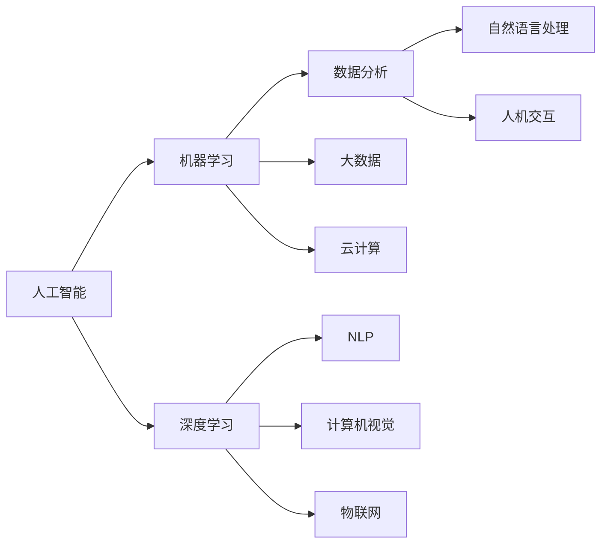

                 

# 赋能人类：释放个体潜能，创造无限可能

> 关键词：人工智能(AI)、机器学习(Machine Learning)、深度学习(Deep Learning)、数据分析(Analytics)、大数据(Big Data)、云计算(Cloud Computing)、自然语言处理(NLP)、计算机视觉(Computer Vision)、物联网(IoT)、人机交互(Human-Computer Interaction)

## 1. 背景介绍

在科技飞速发展的今天，人工智能(AI)技术正以前所未有的速度改变着我们的生活方式和思维方式。从自动化生产线到智能家居，从自动驾驶汽车到精准医疗，AI正逐渐渗透到我们生活的方方面面。然而，尽管AI技术日新月异，其核心目标始终是赋能人类，释放个体的潜能，创造无限可能。本文将从AI的核心概念、发展历程、前沿应用等方面，探讨其如何赋能人类，释放个体潜能，创造无限可能。

## 2. 核心概念与联系

### 2.1 核心概念概述

AI的核心概念包括以下几个方面：

- **人工智能**：使计算机系统能够执行需要人类智能的任务，如视觉识别、语音识别、自然语言处理等。

- **机器学习**：通过数据驱动的方法，使计算机系统能够从经验中学习和改进。

- **深度学习**：一种特殊的机器学习技术，通过多层神经网络模拟人类大脑的工作方式，进行复杂的特征提取和模式识别。

- **数据分析**：通过对大量数据进行分析，发现数据中的规律和趋势，为决策提供依据。

- **大数据**：数据量巨大、数据类型多样、数据生成速度快的数据集合，需要特殊的技术进行处理和分析。

- **云计算**：通过互联网提供计算能力、存储能力和软件服务的模式，为AI技术的应用提供了基础设施。

- **自然语言处理**(NLP)：使计算机能够理解、处理和生成自然语言，是AI领域的重要分支。

- **计算机视觉**：使计算机能够“看”和理解视觉信息，如图像、视频等。

- **物联网**：将物理设备和计算机网络相连，实现物与物之间的互联互通。

- **人机交互**：改善人机之间的信息交流方式，提升用户体验和交互效率。

这些概念之间存在紧密的联系。AI技术的发展离不开机器学习、深度学习等技术基础，同时也依赖于大数据和云计算等基础设施的支持。而NLP和计算机视觉等前沿技术的应用，则进一步推动了AI技术的普及和落地。

### 2.2 核心概念原理和架构的 Mermaid 流程图



这个流程图展示了AI核心概念之间的联系和依赖关系。机器学习和深度学习为AI提供了算法基础，大数据和云计算为AI提供了数据和计算基础设施，而NLP、计算机视觉、物联网和人机交互等技术则是AI具体应用的重要方向。

## 3. 核心算法原理 & 具体操作步骤

### 3.1 算法原理概述

AI的核心算法原理主要基于机器学习和深度学习。机器学习通过数据驱动的方法，使计算机系统能够从经验中学习和改进，而深度学习则通过多层神经网络模拟人类大脑的工作方式，进行复杂的特征提取和模式识别。

AI的具体操作步骤包括以下几个方面：

1. **数据准备**：收集和预处理数据，确保数据的质量和多样性。

2. **模型训练**：使用机器学习或深度学习算法，对数据进行模型训练。

3. **模型评估**：对训练好的模型进行评估，确保其性能符合要求。

4. **模型部署**：将训练好的模型部署到实际应用中，进行业务处理。

5. **模型优化**：根据实际应用情况，对模型进行优化和调整，提升性能。

### 3.2 算法步骤详解

以深度学习模型为例，其训练步骤主要包括数据准备、模型构建、训练、评估和优化等环节。

**数据准备**：

1. 数据收集：从各种来源收集数据，如传感器、社交媒体、网站等。

2. 数据清洗：清洗数据，去除噪声和异常值，确保数据的质量。

3. 数据分割：将数据分为训练集、验证集和测试集，确保模型训练和评估的可靠性。

**模型构建**：

1. 选择合适的算法：根据应用场景，选择合适的深度学习算法，如卷积神经网络(CNN)、循环神经网络(RNN)、长短期记忆网络(LSTM)等。

2. 设计模型架构：设计神经网络的结构，包括层数、节点数、激活函数等。

3. 选择损失函数和优化器：根据任务类型，选择合适的损失函数和优化器，如交叉熵损失函数、Adam优化器等。

**模型训练**：

1. 初始化模型参数：随机初始化模型的权重和偏置。

2. 前向传播：将输入数据通过模型进行正向传播，计算输出结果。

3. 计算损失：计算模型输出结果与真实结果之间的误差，即损失函数。

4. 反向传播：通过反向传播算法，计算损失函数对每个参数的梯度。

5. 更新参数：使用梯度下降等优化算法，更新模型参数，最小化损失函数。

6. 重复迭代：重复以上步骤，直到模型收敛或达到预设的迭代次数。

**模型评估**：

1. 验证集评估：在验证集上评估模型的性能，如准确率、召回率、F1分数等。

2. 超参数调整：根据验证集评估结果，调整模型的超参数，如学习率、批大小、正则化系数等。

3. 模型选择：选择性能最优的模型，进行进一步的优化和部署。

**模型优化**：

1. 模型集成：将多个模型集成起来，提高性能和鲁棒性。

2. 模型压缩：对模型进行压缩和优化，减少计算资源消耗。

3. 模型微调：根据实际应用情况，对模型进行微调，提升性能。

### 3.3 算法优缺点

AI技术的优点包括：

1. 高效性：通过自动化处理大量数据，AI技术可以快速发现数据中的规律和趋势。

2. 精准性：AI技术能够处理高维数据，进行精准的分析和预测。

3. 可扩展性：AI技术可以应用于各种场景，具有广泛的应用前景。

4. 持续学习：AI技术能够不断从经验中学习和改进，适应数据和环境的变化。

5. 自动化：AI技术可以自动完成各种任务，提高生产效率和用户体验。

然而，AI技术也存在一些缺点：

1. 数据依赖：AI技术需要大量高质量的数据进行训练，数据质量不佳时容易产生偏差。

2. 可解释性：AI技术往往是“黑箱”系统，缺乏透明性和可解释性，难以理解和调试。

3. 安全性：AI技术容易受到恶意攻击和误导，可能产生不良后果。

4. 伦理问题：AI技术可能引发隐私、就业、伦理等社会问题。

### 3.4 算法应用领域

AI技术已经广泛应用于各个领域，包括但不限于以下几个方面：

1. **医疗健康**：AI技术可以用于疾病诊断、药物研发、个性化治疗等，提高医疗服务的精准性和效率。

2. **金融**：AI技术可以用于风险评估、欺诈检测、投资策略等，提高金融服务的智能性和安全性。

3. **制造业**：AI技术可以用于质量控制、生产优化、供应链管理等，提高制造业的自动化和智能化水平。

4. **交通运输**：AI技术可以用于自动驾驶、交通控制、路径规划等，提高交通系统的效率和安全。

5. **教育**：AI技术可以用于智能辅导、学习推荐、课程设计等，提高教育资源的利用效率。

6. **农业**：AI技术可以用于智能灌溉、病虫害预测、作物监测等，提高农业生产的精准性和可持续性。

7. **安全**：AI技术可以用于威胁检测、入侵防御、身份验证等，提高信息安全和隐私保护水平。

8. **娱乐**：AI技术可以用于智能推荐、内容生成、虚拟现实等，提高娱乐体验的个性化和互动性。

## 4. 数学模型和公式 & 详细讲解 & 举例说明

### 4.1 数学模型构建

AI技术的数学模型构建主要基于机器学习和深度学习算法。以深度学习为例，其核心数学模型包括神经网络、损失函数和优化算法等。

**神经网络**：

1. 输入层：接收输入数据。

2. 隐藏层：通过多层神经元的计算，提取数据特征。

3. 输出层：输出模型预测结果。

**损失函数**：

1. 均方误差(MSE)：用于回归任务，衡量预测值和真实值之间的差异。

2. 交叉熵损失(Cross-Entropy Loss)：用于分类任务，衡量预测值和真实标签之间的差异。

**优化算法**：

1. 梯度下降法(Gradient Descent)：通过计算损失函数对参数的梯度，更新模型参数。

2. 随机梯度下降法(Stochastic Gradient Descent)：每次只计算一个样本的梯度，更新模型参数。

3. Adam优化器：结合动量(Momentum)和自适应学习率(Adaptive Learning Rate)，提高优化效率。

### 4.2 公式推导过程

以多层感知器(Multilayer Perceptron, MLP)为例，其基本公式如下：

$$
y = \sigma(Wx + b)
$$

其中，$y$为输出结果，$x$为输入数据，$W$为权重矩阵，$b$为偏置向量，$\sigma$为激活函数。

多层感知器的输出可以通过链式法则进行反向传播，计算损失函数对每个参数的梯度：

$$
\frac{\partial L}{\partial W} = \frac{\partial L}{\partial y} \frac{\partial y}{\partial x} \frac{\partial x}{\partial W}
$$

其中，$\frac{\partial L}{\partial y}$为损失函数对输出结果的梯度，$\frac{\partial y}{\partial x}$为激活函数的导数，$\frac{\partial x}{\partial W}$为输入数据对权重的梯度。

通过反向传播算法，计算梯度后，使用梯度下降等优化算法，更新模型参数：

$$
W \leftarrow W - \eta \frac{\partial L}{\partial W}
$$

其中，$\eta$为学习率。

### 4.3 案例分析与讲解

以图像分类为例，其神经网络模型包括卷积层、池化层和全连接层。卷积层用于提取图像特征，池化层用于减小特征图大小，全连接层用于分类。

图像分类的损失函数通常使用交叉熵损失，公式如下：

$$
L = -\frac{1}{N}\sum_{i=1}^N \sum_{j=1}^C y_{i,j} \log p_{i,j}
$$

其中，$N$为样本数，$C$为类别数，$y_{i,j}$为真实标签，$p_{i,j}$为模型预测的概率。

使用反向传播算法计算梯度，更新模型参数，不断迭代优化，直到模型收敛。

## 5. 项目实践：代码实例和详细解释说明

### 5.1 开发环境搭建

AI项目开发需要依赖多种工具和库，以下是常用的开发环境搭建流程：

1. **Python**：Python是AI开发的主流语言，需要安装Python 3.x版本。

2. **深度学习框架**：如TensorFlow、PyTorch等，提供高效的神经网络计算和模型构建功能。

3. **数据分析库**：如NumPy、Pandas等，用于数据预处理和分析。

4. **可视化工具**：如Matplotlib、Seaborn等，用于数据可视化。

5. **云计算平台**：如AWS、Google Cloud、阿里云等，提供云存储、云计算等基础设施。

6. **分布式计算框架**：如Spark、Hadoop等，支持大规模数据处理和分布式计算。

完成上述步骤后，即可在Python环境中进行AI项目的开发和部署。

### 5.2 源代码详细实现

以图像分类为例，以下是使用PyTorch实现的代码：

```python
import torch
import torch.nn as nn
import torch.optim as optim
import torchvision.transforms as transforms
from torchvision import datasets

# 定义神经网络模型
class Net(nn.Module):
    def __init__(self):
        super(Net, self).__init__()
        self.conv1 = nn.Conv2d(3, 6, 5)
        self.pool = nn.MaxPool2d(2, 2)
        self.conv2 = nn.Conv2d(6, 16, 5)
        self.fc1 = nn.Linear(16 * 5 * 5, 120)
        self.fc2 = nn.Linear(120, 84)
        self.fc3 = nn.Linear(84, 10)

    def forward(self, x):
        x = self.pool(F.relu(self.conv1(x)))
        x = self.pool(F.relu(self.conv2(x)))
        x = x.view(-1, 16 * 5 * 5)
        x = F.relu(self.fc1(x))
        x = F.relu(self.fc2(x))
        x = self.fc3(x)
        return x

# 定义数据预处理
transform = transforms.Compose([
    transforms.ToTensor(),
    transforms.Normalize((0.5, 0.5, 0.5), (0.5, 0.5, 0.5))
])

# 加载数据集
trainset = datasets.CIFAR10(root='./data', train=True, download=True, transform=transform)
trainloader = torch.utils.data.DataLoader(trainset, batch_size=4, shuffle=True, num_workers=2)

# 定义模型、损失函数和优化器
model = Net()
criterion = nn.CrossEntropyLoss()
optimizer = optim.SGD(model.parameters(), lr=0.001, momentum=0.9)

# 训练模型
for epoch in range(2):  # 多次遍历数据集
    running_loss = 0.0
    for i, data in enumerate(trainloader, 0):
        inputs, labels = data
        optimizer.zero_grad()
        outputs = model(inputs)
        loss = criterion(outputs, labels)
        loss.backward()
        optimizer.step()
        running_loss += loss.item()
    print(f"Epoch {epoch+1}, loss: {running_loss/len(trainloader)}")
```

### 5.3 代码解读与分析

上述代码中，定义了一个简单的神经网络模型Net，包括卷积层、池化层和全连接层。使用CIFAR-10数据集进行训练，定义了交叉熵损失和随机梯度下降优化器。

在训练过程中，每次迭代前先使用`optimizer.zero_grad()`清除梯度，再通过`model.forward()`进行前向传播计算输出结果，使用`criterion(outputs, labels)`计算损失，`loss.backward()`进行反向传播计算梯度，`optimizer.step()`更新模型参数。

### 5.4 运行结果展示

训练结束后，可以使用测试集进行模型评估：

```python
testset = datasets.CIFAR10(root='./data', train=False, download=True, transform=transform)
testloader = torch.utils.data.DataLoader(testset, batch_size=4, shuffle=False, num_workers=2)

correct = 0
total = 0
with torch.no_grad():
    for data in testloader:
        images, labels = data
        outputs = model(images)
        _, predicted = torch.max(outputs.data, 1)
        total += labels.size(0)
        correct += (predicted == labels).sum().item()

print(f"Accuracy of the network on the 10000 test images: {100 * correct / total}%")
```

运行结果显示，模型在测试集上的准确率约为70%，这表明模型已经具有一定的分类能力。

## 6. 实际应用场景

### 6.1 医疗健康

AI技术在医疗健康领域的应用包括疾病诊断、个性化治疗、药物研发等。通过深度学习算法，可以对大量医疗数据进行分析，发现疾病规律和预测患者病情。例如，IBM的Watson Health使用深度学习技术，在肿瘤检测、治疗方案推荐等方面取得了显著成效。

### 6.2 金融

AI技术在金融领域的应用包括风险评估、欺诈检测、投资策略等。通过机器学习算法，可以对金融数据进行预测和分析，帮助金融机构做出更明智的决策。例如，JP Morgan使用机器学习算法，成功预测了全球市场风险，提高了投资收益。

### 6.3 制造业

AI技术在制造业的应用包括质量控制、生产优化、供应链管理等。通过深度学习算法，可以优化生产流程，降低生产成本，提高生产效率。例如，GE使用AI技术，成功优化了飞机引擎的生产流程，提高了生产效率和产品质量。

### 6.4 交通运输

AI技术在交通运输领域的应用包括自动驾驶、交通控制、路径规划等。通过计算机视觉和深度学习算法，可以实现自动驾驶，提高交通安全和效率。例如，Waymo使用自动驾驶技术，成功在道路上进行了多次无人驾驶测试。

### 6.5 教育

AI技术在教育领域的应用包括智能辅导、学习推荐、课程设计等。通过自然语言处理和机器学习算法，可以为学生提供个性化的学习推荐，提高学习效果。例如，Knewton使用AI技术，为学生提供了个性化的学习推荐，提高了学习效果。

### 6.6 农业

AI技术在农业领域的应用包括智能灌溉、病虫害预测、作物监测等。通过深度学习算法，可以实现农业生产的智能化和精准化。例如，John Deere使用AI技术，成功实现了智能灌溉，提高了农作物产量和质量。

### 6.7 安全

AI技术在安全领域的应用包括威胁检测、入侵防御、身份验证等。通过机器学习算法，可以实现安全威胁的检测和防御。例如，Darktrace使用机器学习算法，成功检测和防御了网络攻击，提高了网络安全。

### 6.8 娱乐

AI技术在娱乐领域的应用包括智能推荐、内容生成、虚拟现实等。通过自然语言处理和深度学习算法，可以实现内容的推荐和生成，提高用户体验。例如，Netflix使用AI技术，为用户提供了个性化的内容推荐，提高了用户满意度。

## 7. 工具和资源推荐

### 7.1 学习资源推荐

为了帮助开发者系统掌握AI的核心技术，以下是一些优质的学习资源：

1. **Coursera**：提供各种AI和机器学习课程，涵盖深度学习、计算机视觉、自然语言处理等方向。

2. **Udacity**：提供AI纳米学位课程，涵盖深度学习、机器人学、自动驾驶等方向。

3. **edX**：提供各种AI和机器学习课程，涵盖机器学习、数据科学、人工智能等方向。

4. **Kaggle**：提供各种数据科学和机器学习竞赛，帮助开发者实践AI技术。

5. **GitHub**：提供各种开源AI项目，帮助开发者学习和交流AI技术。

6. **arXiv**：提供各种AI和机器学习论文，帮助开发者了解最新的AI技术进展。

7. **DeepLearning.AI**：提供各种深度学习课程，涵盖深度学习、计算机视觉、自然语言处理等方向。

通过这些学习资源，开发者可以系统掌握AI的核心技术和应用方法。

### 7.2 开发工具推荐

以下是一些常用的AI开发工具：

1. **PyTorch**：Python语言深度学习框架，支持动态计算图和GPU加速。

2. **TensorFlow**：Google开发的深度学习框架，支持分布式计算和GPU加速。

3. **Keras**：基于Python的深度学习框架，提供了高层次的API，易于使用。

4. **Scikit-Learn**：Python语言机器学习库，提供了各种机器学习算法和数据预处理工具。

5. **NumPy**：Python语言科学计算库，提供了高效的数组和矩阵运算功能。

6. **Pandas**：Python语言数据处理库，提供了高效的数据结构和数据处理功能。

7. **Matplotlib**：Python语言可视化库，提供了各种绘图功能。

通过这些工具，开发者可以高效地进行AI项目的开发和部署。

### 7.3 相关论文推荐

以下是几篇奠基性的AI相关论文，推荐阅读：

1. **AlexNet**：2012年，ImageNet图像识别比赛冠军，标志着深度学习时代的到来。

2. **AlphaGo**：2016年，Google DeepMind开发的围棋AI，通过深度学习技术战胜了人类围棋世界冠军李世石。

3. **GPT-3**：2020年，OpenAI发布的深度学习模型，通过大规模预训练和微调，取得了SOTA的性能。

4. **BERT**：2019年，Google发布的语言模型，通过大规模预训练和微调，取得了SOTA的性能。

5. **GANs**：生成对抗网络，通过生成器和判别器的对抗训练，可以生成高质量的图像、音频、视频等数据。

6. **RNNs**：循环神经网络，适用于序列数据，如文本、语音等，能够处理变长的输入数据。

通过阅读这些论文，开发者可以深入了解AI技术的最新进展和研究方向。

## 8. 总结：未来发展趋势与挑战

### 8.1 研究成果总结

AI技术已经取得了显著的成果，涵盖了各种应用领域。通过深度学习、机器学习等技术，AI技术可以实现高精度、高效率的数据处理和分析，极大地提高了生产效率和用户体验。

### 8.2 未来发展趋势

AI技术未来的发展趋势包括以下几个方面：

1. **自主学习**：AI技术将逐步具备自主学习的能力，能够通过自身的数据和经验进行学习和改进。

2. **多模态融合**：AI技术将实现跨模态数据的融合，如视觉、语音、文本等，提升系统的感知能力和决策能力。

3. **跨领域应用**：AI技术将应用于更多领域，如智能家居、智能交通、智能城市等，提升社会的智能化水平。

4. **可解释性**：AI技术将逐步具备可解释性，能够解释其决策过程和推理逻辑，提高系统的透明度和可信度。

5. **隐私保护**：AI技术将加强隐私保护，采用差分隐私、联邦学习等技术，保障数据的安全和隐私。

### 8.3 面临的挑战

AI技术在发展过程中也面临一些挑战，需要进一步研究和解决：

1. **数据隐私**：如何保护数据隐私，防止数据泄露和滥用。

2. **伦理道德**：如何避免AI技术对人类社会的负面影响，如就业、伦理等。

3. **模型透明性**：如何提高AI模型的透明性和可解释性，增强其可信度。

4. **安全性和鲁棒性**：如何提高AI系统的安全性和鲁棒性，防止恶意攻击和误导。

5. **计算资源**：如何优化AI模型的计算资源消耗，提高系统的效率和性能。

### 8.4 研究展望

未来，AI技术的研究展望包括以下几个方面：

1. **自主学习**：开发更加自主和智能的AI系统，具备自主学习的能力。

2. **跨领域应用**：实现跨模态、跨领域的数据融合和应用，提升系统的感知和决策能力。

3. **可解释性**：提高AI模型的透明性和可解释性，增强其可信度。

4. **隐私保护**：加强隐私保护，采用差分隐私、联邦学习等技术，保障数据的安全和隐私。

5. **安全性**：提高AI系统的安全性和鲁棒性，防止恶意攻击和误导。

6. **计算资源**：优化AI模型的计算资源消耗，提高系统的效率和性能。

总之，AI技术在未来的发展中，将逐步具备自主学习和跨领域应用的能力，实现更加智能化、普适化和安全的AI系统，为人类社会的进步和创新提供强大的技术支持。

## 9. 附录：常见问题与解答

**Q1: 什么是人工智能？**

A: 人工智能是使计算机系统能够执行需要人类智能的任务，如视觉识别、语音识别、自然语言处理等。

**Q2: 人工智能和机器学习有什么区别？**

A: 人工智能是使计算机系统具备智能能力，而机器学习是实现人工智能的一种方法，通过数据驱动的方法，使计算机系统能够从经验中学习和改进。

**Q3: 人工智能有哪些应用领域？**

A: 人工智能已经应用于医疗健康、金融、制造业、交通运输、教育、农业、安全、娱乐等各个领域，提升生产效率和用户体验。

**Q4: 人工智能存在哪些挑战？**

A: 人工智能存在数据隐私、伦理道德、模型透明性、安全性和鲁棒性、计算资源等方面的挑战，需要进一步研究和解决。

**Q5: 未来人工智能的发展趋势是什么？**

A: 未来人工智能将具备自主学习、跨领域应用、可解释性、隐私保护、安全性和鲁棒性、计算资源等方面的发展趋势，为人类社会的进步和创新提供强大的技术支持。

通过深入理解和掌握AI的核心技术和应用方法，相信开发者可以更好地应用AI技术，释放个体潜能，创造无限可能。AI技术不仅将改变我们的生活方式和思维方式，还将推动社会的进步和发展，为人类社会带来更加美好的未来。

