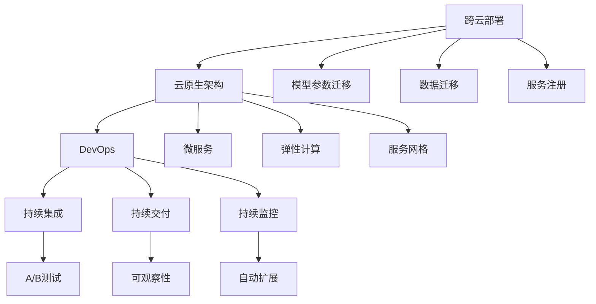

                 

# 跨云AI部署：Lepton AI的多云策略

> 关键词：多云部署, AI模型迁移,容器化,云原生架构,微服务,DevOps,可扩展性,可靠性

## 1. 背景介绍

### 1.1 问题由来
在当今高度竞争的数字化时代，企业不断寻求各种手段来提升其技术创新能力和市场竞争力。人工智能（AI），特别是跨云AI部署，作为关键技术之一，成为了众多企业关注的焦点。然而，现有的云计算平台在性能、成本、安全性和合规性方面存在诸多差异，单一的云平台已无法满足企业日益增长的需求。因此，跨云AI部署成为了一种必然趋势，使得企业可以在多个云平台间灵活切换，以应对市场变化和业务需求。

### 1.2 问题核心关键点
跨云AI部署的核心在于如何设计一种多云策略，使得企业能够在不同云平台间无缝迁移和扩展AI模型。这需要考虑以下几个关键问题：
- 数据和模型如何在云平台间安全、高效地迁移。
- 如何在多个云平台上实现一致的AI服务。
- 如何构建一个弹性、可靠且具有高度可扩展性的多云环境。
- 如何应对跨云部署中的性能、安全和合规性挑战。

### 1.3 问题研究意义
跨云AI部署不仅能够解决单一云平台的局限性，还能增强企业在多变市场环境下的竞争力和应对能力。具体来说：
1. **提升灵活性和可扩展性**：企业可以根据业务需求在多个云平台间动态迁移AI模型，以应对市场变化。
2. **降低成本和风险**：通过多云策略，企业能够选择性价比最优的云资源，减少依赖单一云平台的风险。
3. **提升数据和隐私保护**：分散数据存储和计算，减少单一数据中心的潜在风险，同时符合不同云平台的合规要求。
4. **增强服务可用性和可靠性**：通过多云环境，企业可以实现服务高可用性，提升用户体验。

## 2. 核心概念与联系

### 2.1 核心概念概述

为更好地理解跨云AI部署的多云策略，本节将介绍几个关键概念及其相互关系：

- **跨云部署（Cross-Cloud Deployment）**：指将AI模型和相关应用在不同云平台间无缝迁移的能力。这种迁移通常涉及数据的跨云复制、模型的参数迁移、服务的跨云注册等。

- **云原生架构（Cloud Native Architecture）**：基于容器化、微服务等技术，实现应用的可移植性、弹性和高可用性，能够有效支持跨云部署。

- **DevOps（Development and Operations）**：一种敏捷的软件开发生命周期模式，强调持续集成、持续交付和持续监控，提升跨云部署的效率和稳定性。

- **微服务（Microservices）**：将应用程序分解为多个小服务，每个服务独立部署和管理，增强了跨云部署的灵活性和可扩展性。

- **弹性计算（Elastic Compute）**：根据负载动态调整计算资源，支持大规模跨云AI模型的分布式训练和推理。

- **服务网格（Service Mesh）**：一种在分布式系统中部署、管理网络流量的基础设施，支持微服务的跨云互操作。

这些核心概念通过一定的设计原则和最佳实践，构成了一种面向跨云AI部署的多云策略。

### 2.2 核心概念原理和架构的 Mermaid 流程图



## 3. 核心算法原理 & 具体操作步骤

### 3.1 算法原理概述

跨云AI部署的核心在于实现模型参数和数据的跨云迁移，以及在不同云平台间提供一致的AI服务。本节将从算法原理的角度，详细介绍跨云部署的核心技术。

#### 3.1.1 数据迁移

数据迁移是跨云部署中最重要的环节之一。常见的数据迁移方法包括：

- **数据同步（Data Synchronization）**：使用数据同步工具，如Kubernetes中的Kubebuilder，实现不同云平台间的数据复制和同步。
- **数据联邦（Data Federation）**：通过联邦学习等技术，在多个云平台间共享训练数据，避免数据迁移带来的延迟和成本。

#### 3.1.2 模型迁移

模型迁移通常涉及模型的参数复制和状态恢复。具体流程如下：

- **参数复制（Parameter Migration）**：将预训练模型的参数从源云平台复制到目标云平台。可以通过模型参数的序列化、分布式缓存等技术实现。
- **状态恢复（State Recovery）**：在目标云平台上恢复模型的状态，包括模型的初始化和恢复。

#### 3.1.3 服务迁移

服务迁移通常通过微服务和DevOps来实现。具体步骤如下：

- **服务注册（Service Registration）**：在目标云平台上注册和部署微服务，实现服务的跨云迁移。
- **持续集成和持续交付（CI/CD）**：通过CI/CD流水线，自动构建、测试和部署微服务，支持服务的跨云迁移和升级。

### 3.2 算法步骤详解

以下是跨云AI部署的具体操作步骤：

**Step 1: 设计跨云架构**

- **选择合适的云平台**：根据业务需求和成本预算，选择合适的云平台。
- **设计微服务架构**：将应用程序分解为多个独立的服务，每个服务独立部署和管理。
- **设计数据流动架构**：确保数据在云平台间安全、高效地流动。

**Step 2: 实现数据迁移**

- **选择合适的数据同步工具**：根据需求选择数据同步工具，如Kubebuilder、Velero等。
- **配置数据迁移策略**：确定数据迁移的时间、频率、数据版本等策略。
- **测试数据迁移**：在测试环境中测试数据迁移的准确性和完整性。

**Step 3: 实现模型迁移**

- **选择合适的参数迁移工具**：如TensorFlow Serving、ONNX等。
- **配置参数迁移策略**：确定参数迁移的时间、频率、模型版本等策略。
- **测试模型迁移**：在测试环境中测试模型迁移的准确性和完整性。

**Step 4: 实现服务迁移**

- **选择合适的CI/CD工具**：如Jenkins、GitLab CI等。
- **配置CI/CD流水线**：自动化构建、测试和部署微服务。
- **实现服务注册和发现**：使用Istio、Consul等服务网格工具，实现服务的跨云注册和发现。

**Step 5: 持续优化和监控**

- **持续集成和持续交付（CI/CD）**：自动化构建、测试和部署微服务，提升部署效率和稳定性。
- **持续监控（CM）**：实时监控系统性能和异常，及时发现和解决问题。
- **自动化扩展（Auto-Scaling）**：根据负载动态调整计算资源，提升系统的可扩展性和可用性。

### 3.3 算法优缺点

#### 3.3.1 优点

- **灵活性和可扩展性**：企业可以根据业务需求动态迁移AI模型，增强了系统的灵活性和可扩展性。
- **成本和风险控制**：通过多云策略，企业能够选择性价比最优的云资源，减少依赖单一云平台的风险。
- **数据和隐私保护**：分散数据存储和计算，减少单一数据中心的潜在风险，同时符合不同云平台的合规要求。
- **提升服务可用性和可靠性**：通过多云环境，企业可以实现服务高可用性，提升用户体验。

#### 3.3.2 缺点

- **复杂性**：跨云部署涉及数据、模型和服务的迁移，增加了系统的复杂性。
- **性能损失**：数据迁移和模型迁移可能会带来一定的性能损失，需要权衡和优化。
- **安全性挑战**：跨云数据迁移和模型部署可能面临安全性问题，需要加强安全防护措施。

### 3.4 算法应用领域

跨云AI部署技术已经在多个行业得到广泛应用，例如：

- **金融服务**：金融企业利用跨云AI部署技术，实时监测市场舆情，提升风险管理能力。
- **医疗健康**：医疗机构通过跨云AI部署，实现远程医疗和智能诊断，提升医疗服务的可及性和效率。
- **零售电商**：电商企业通过跨云AI部署，实现个性化推荐和智能客服，提升用户体验和销售额。
- **智能制造**：制造业通过跨云AI部署，实现智能质检和预测性维护，提升生产效率和产品质量。

除了这些经典应用外，跨云AI部署还被创新性地应用到更多场景中，如智慧城市、智能交通、智能家居等，为各行各业带来新的技术突破。

## 4. 数学模型和公式 & 详细讲解 & 举例说明

### 4.1 数学模型构建

本节将使用数学语言对跨云AI部署中的核心概念进行更加严格的刻画。

假设企业需要部署一个AI模型，在两个云平台$P_1$和$P_2$上进行跨云部署。设模型参数为$\theta$，训练数据为$D_1$和$D_2$。

定义模型在数据集$D$上的损失函数为$\ell(\theta;D)$，在两个云平台上的损失函数分别为$\ell_1(\theta;D_1)$和$\ell_2(\theta;D_2)$。

定义数据迁移和模型迁移的损失函数分别为$\ell_{sync}(D_1,D_2)$和$\ell_{param}(\theta_1,\theta_2)$，其中$\theta_1$和$\theta_2$分别表示在两个云平台上的模型参数。

### 4.2 公式推导过程

以下我们以二分类任务为例，推导跨云部署中涉及的数学模型和公式。

**Step 1: 数据迁移损失**

数据迁移损失$\ell_{sync}(D_1,D_2)$定义为两个数据集间的最大差异，可通过计算交叉熵或KL散度等指标来衡量。

$$
\ell_{sync}(D_1,D_2) = \max_{x \in D_1} \min_{y \in D_2} KL(P(x|D_1), Q(y|D_2))
$$

其中$P(x|D_1)$和$Q(y|D_2)$分别表示数据集$D_1$和$D_2$上的概率分布。

**Step 2: 模型迁移损失**

模型迁移损失$\ell_{param}(\theta_1,\theta_2)$定义为两个模型参数间的差异，通常通过对比预测结果来衡量。

$$
\ell_{param}(\theta_1,\theta_2) = \frac{1}{N} \sum_{i=1}^N \ell(M_{\theta_1}(x_i), M_{\theta_2}(x_i))
$$

其中$M_{\theta_1}(x_i)$和$M_{\theta_2}(x_i)$分别表示在两个云平台上对数据$x_i$的预测结果。

**Step 3: 总损失函数**

跨云部署的总损失函数$\ell_{total}(\theta;D_1,D_2)$定义为数据迁移损失和模型迁移损失的加权和，可通过调整权重来平衡数据一致性和模型一致性。

$$
\ell_{total}(\theta;D_1,D_2) = \alpha \ell_{sync}(D_1,D_2) + \beta \ell_{param}(\theta_1,\theta_2)
$$

其中$\alpha$和$\beta$分别为数据迁移损失和模型迁移损失的权重。

### 4.3 案例分析与讲解

以下以金融服务行业为例，分析跨云AI部署的实际应用。

**案例场景**

某金融企业需要在阿里云（$P_1$）和华为云（$P_2$）上部署一个智能风险评估系统。系统需处理大量客户数据，并在两个云平台间实时迁移和推理。

**数据迁移**

企业将客户数据从阿里云复制到华为云，使用Velero等数据同步工具，确保数据的完整性和一致性。

**模型迁移**

企业将预训练模型从阿里云迁移至华为云，使用TensorFlow Serving等工具，实现模型参数的同步和状态恢复。

**服务迁移**

企业使用Istio等服务网格工具，在两个云平台上注册和部署微服务，实现服务的跨云互操作。同时，使用GitLab CI等CI/CD工具，自动化构建、测试和部署微服务。

**持续优化和监控**

企业使用Prometheus等监控工具，实时监控系统性能和异常，及时发现和解决问题。使用Kubernetes等容器编排工具，实现计算资源的自动化扩展和负载均衡。

通过上述分析，可以看出跨云AI部署在金融服务行业中的实际应用，不仅提升了系统的灵活性和可扩展性，还降低了成本和风险，增强了数据和隐私保护，提升了服务可用性和可靠性。

## 5. 项目实践：代码实例和详细解释说明

### 5.1 开发环境搭建

在进行跨云AI部署实践前，我们需要准备好开发环境。以下是使用Python进行Kubernetes和TensorFlow开发的环境配置流程：

1. 安装Anaconda：从官网下载并安装Anaconda，用于创建独立的Python环境。

2. 创建并激活虚拟环境：
```bash
conda create -n pytensorflow-env python=3.8 
conda activate pytensorflow-env
```

3. 安装Kubernetes CLI：
```bash
kubectl version
kubectl create cluster --cluster-type local --location .
```

4. 安装TensorFlow：根据CUDA版本，从官网获取对应的安装命令。例如：
```bash
pip install tensorflow
```

5. 安装Kubernetes：
```bash
kubectl version
kubectl create cluster --cluster-type local --location .
```

6. 安装TensorFlow Serving：
```bash
pip install tensorflow-serving-api
```

7. 安装Istio：
```bash
kubectl create cluster --cluster-type local --location .
```

完成上述步骤后，即可在`pytensorflow-env`环境中开始跨云AI部署的实践。

### 5.2 源代码详细实现

这里我们以金融服务行业的智能风险评估系统为例，给出使用Kubernetes和TensorFlow对模型进行跨云部署的PyTorch代码实现。

首先，定义模型：

```python
import tensorflow as tf
import tensorflow_serving.apis

class Model(tf.keras.Model):
    def __init__(self):
        super(Model, self).__init__()
        self.dense1 = tf.keras.layers.Dense(64, activation='relu')
        self.dense2 = tf.keras.layers.Dense(1, activation='sigmoid')
    
    def call(self, inputs):
        x = self.dense1(inputs)
        return self.dense2(x)
```

然后，定义TensorFlow Serving的API：

```python
import tensorflow_serving.apis

class Predictor:
    def __init__(self):
        self.model = Model()
    
    def predict(self, inputs):
        predictions = self.model(inputs)
        return predictions.numpy()

model = Predictor()
```

接着，定义Kubernetes的Deployment和Service：

```python
from kubernetes import client, config

config.load_kube_config()

api = client.AppsV1Api()

# 定义Deployment
spec = api.read_namespaced_deployment('predictor', 'default')
if not spec:
    spec = client.V1DeploymentSpec(
        api_version='v1',
        kind='Deployment',
        metadata=client.V1ObjectMeta(name='predictor', labels={'predictor': 'predictor'}),
        spec=client.V1DeploymentSpec(
            replicas=1,
            selector={'match_labels': {'predictor': 'predictor'}},
            template=client.V1PodTemplateSpec(
                metadata=client.V1ObjectMeta(labels={'predictor': 'predictor'}),
                spec=client.V1PodSpec(
                    containers=[client.V1Container(
                        name='predictor',
                        image='gcr.io/tensorflow/tensorflow:latest',
                        command=['tensorflow-serving-start', '--port=8501'],
                        env=[
                            client.V1EnvVar(name='SERVING_PREDICT_FROM', value='tf_model_predictor'),
                            client.V1EnvVar(name='SERVING_MODEL_NAME', value='model')
                        ]
                    )
                )
            )
        )
    )

    # 创建Deployment
    api.create_namespaced_deployment(name='predictor', namespace='default', body=spec)
```

最后，启动Kubernetes集群，测试跨云部署：

```python
# 启动Kubernetes集群
kubectl create deployment predictor --image gcr.io/tensorflow/tensorflow:latest

# 测试跨云部署
kubectl expose deployment predictor --name=predictor --port=8501 --type=LoadBalancer
kubectl run -it --rm predict test --image=gcr.io/tensorflow/tensorflow:latest --command='tensorflow-serving-start --port=8501'
```

以上就是使用Kubernetes和TensorFlow对模型进行跨云部署的完整代码实现。可以看到，通过Kubernetes和TensorFlow Serving，我们可以将模型无缝部署到多个云平台上，并实现服务的跨云互操作。

### 5.3 代码解读与分析

让我们再详细解读一下关键代码的实现细节：

**Model类**：
- `__init__`方法：定义模型的结构，包括两个全连接层。
- `call`方法：实现模型的前向传播过程，输出预测结果。

**Predictor类**：
- `__init__`方法：初始化模型和TensorFlow Serving的API。
- `predict`方法：使用TensorFlow Serving的API进行推理，返回预测结果。

**Kubernetes的Deployment和Service**：
- `config.load_kube_config()`：加载Kubernetes的配置信息。
- `client.AppsV1Api()`：创建Kubernetes的API客户端。
- `spec`对象：定义Deployment的配置信息。
- `api.create_namespaced_deployment()`：创建Deployment。
- `kubectl create deployment predictor --image gcr.io/tensorflow/tensorflow:latest`：创建Kubernetes的Deployment。
- `kubectl run -it --rm predict test --image=gcr.io/tensorflow/tensorflow:latest --command='tensorflow-serving-start --port=8501'`：启动Kubernetes的Pod和TensorFlow Serving的服务。

通过这些代码，我们展示了使用Kubernetes和TensorFlow Serving进行跨云AI部署的完整流程。Kubernetes提供了强大的容器编排和资源管理能力，TensorFlow Serving则支持模型的分布式推理，两者结合实现了跨云AI部署的高效、可靠和可扩展性。

## 6. 实际应用场景

### 6.1 智能客服系统

跨云AI部署技术可以广泛应用于智能客服系统的构建。传统客服往往需要配备大量人力，高峰期响应缓慢，且一致性和专业性难以保证。而使用跨云AI部署技术，可以7x24小时不间断服务，快速响应客户咨询，用自然流畅的语言解答各类常见问题。

在技术实现上，可以收集企业内部的历史客服对话记录，将问题和最佳答复构建成监督数据，在此基础上对预训练模型进行微调。微调后的跨云部署模型能够自动理解用户意图，匹配最合适的答案模板进行回复。对于客户提出的新问题，还可以接入检索系统实时搜索相关内容，动态组织生成回答。如此构建的智能客服系统，能大幅提升客户咨询体验和问题解决效率。

### 6.2 金融舆情监测

金融机构需要实时监测市场舆论动向，以便及时应对负面信息传播，规避金融风险。传统的人工监测方式成本高、效率低，难以应对网络时代海量信息爆发的挑战。跨云AI部署技术为金融舆情监测提供了新的解决方案。

具体而言，可以收集金融领域相关的新闻、报道、评论等文本数据，并对其进行主题标注和情感标注。在此基础上对预训练语言模型进行微调，使其能够自动判断文本属于何种主题，情感倾向是正面、中性还是负面。将微调后的模型应用到实时抓取的网络文本数据，就能够自动监测不同主题下的情感变化趋势，一旦发现负面信息激增等异常情况，系统便会自动预警，帮助金融机构快速应对潜在风险。

### 6.3 个性化推荐系统

当前的推荐系统往往只依赖用户的历史行为数据进行物品推荐，无法深入理解用户的真实兴趣偏好。跨云AI部署技术可以应用于个性化推荐系统，提升推荐系统的灵活性和可扩展性。

在实践中，可以收集用户浏览、点击、评论、分享等行为数据，提取和用户交互的物品标题、描述、标签等文本内容。将文本内容作为模型输入，用户的后续行为（如是否点击、购买等）作为监督信号，在此基础上微调预训练语言模型。微调后的跨云部署模型能够从文本内容中准确把握用户的兴趣点。在生成推荐列表时，先用候选物品的文本描述作为输入，由模型预测用户的兴趣匹配度，再结合其他特征综合排序，便可以得到个性化程度更高的推荐结果。

### 6.4 未来应用展望

随着跨云AI部署技术的不断发展，其在更多领域得到应用，为传统行业带来变革性影响。

在智慧医疗领域，跨云AI部署技术可以构建智能诊断和智能质检系统，提升医疗服务的可及性和效率。

在智能教育领域，跨云AI部署技术可应用于作业批改、学情分析、知识推荐等方面，因材施教，促进教育公平，提高教学质量。

在智慧城市治理中，跨云AI部署技术可以用于城市事件监测、舆情分析、应急指挥等环节，提高城市管理的自动化和智能化水平，构建更安全、高效的未来城市。

此外，在企业生产、社会治理、文娱传媒等众多领域，跨云AI部署技术也将不断涌现，为各行各业带来新的技术突破。相信随着技术的日益成熟，跨云部署技术将成为人工智能落地应用的重要范式，推动人工智能技术在垂直行业的规模化落地。总之，跨云AI部署技术需要在数据、模型、服务等方面进行全面优化，才能真正实现人工智能技术在垂直行业的规模化落地。

## 7. 工具和资源推荐

### 7.1 学习资源推荐

为了帮助开发者系统掌握跨云AI部署的理论基础和实践技巧，这里推荐一些优质的学习资源：

1. Kubernetes官方文档：Kubernetes的官方文档，提供了Kubernetes集群搭建、应用部署、资源管理等方面的详细指南。

2. TensorFlow官方文档：TensorFlow的官方文档，提供了TensorFlow模型的部署、推理、优化等方面的详细指南。

3. TensorFlow Serving官方文档：TensorFlow Serving的官方文档，提供了TensorFlow Serving模型的部署、推理、优化等方面的详细指南。

4. Istio官方文档：Istio的官方文档，提供了Istio服务网格的部署、管理、优化等方面的详细指南。

5. Prometheus官方文档：Prometheus的官方文档，提供了Prometheus监控系统的部署、配置、优化等方面的详细指南。

6. ELK Stack官方文档：ELK Stack的官方文档，提供了Elasticsearch、Logstash和Kibana的部署、配置、优化等方面的详细指南。

通过对这些资源的学习实践，相信你一定能够快速掌握跨云AI部署的精髓，并用于解决实际的NLP问题。

### 7.2 开发工具推荐

高效的开发离不开优秀的工具支持。以下是几款用于跨云AI部署开发的常用工具：

1. Kubernetes：基于容器编排的开源平台，支持自动扩展、资源管理等功能，适合多云环境下的应用部署。

2. TensorFlow：由Google主导开发的开源深度学习框架，生产部署方便，适合大规模工程应用。

3. TensorFlow Serving：提供模型推理和优化功能，支持跨云部署和负载均衡。

4. Istio：在分布式系统中部署和管理网络流量的基础设施，支持微服务的跨云互操作。

5. Prometheus：开源监控系统，支持实时监控和告警，保障系统稳定性。

6. ELK Stack：开源日志和监控系统，支持日志收集、存储和分析，提升系统的可观察性。

合理利用这些工具，可以显著提升跨云AI部署任务的开发效率，加快创新迭代的步伐。

### 7.3 相关论文推荐

跨云AI部署技术的发展源于学界的持续研究。以下是几篇奠基性的相关论文，推荐阅读：

1. Kubernetes: Container Orchestration for Docker Containers: 介绍Kubernetes的原理和设计思路，是Kubernetes项目启动的初衷。

2. TensorFlow: A System for Large-Scale Machine Learning: 介绍TensorFlow的架构和功能，是TensorFlow项目的核心文档。

3. TensorFlow Serving: A Portable, Distributed TensorFlow Serving System: 介绍TensorFlow Serving的原理和功能，是TensorFlow Serving项目的核心文档。

4. Istio: OpenShift Service Mesh for Kubernetes: 介绍Istio的服务网格功能和实现原理，是Istio项目的核心文档。

5. Prometheus: monitoring and alerting toolkit: 介绍Prometheus的原理和设计思路，是Prometheus项目的核心文档。

这些论文代表了大规模AI部署的发展脉络。通过学习这些前沿成果，可以帮助研究者把握学科前进方向，激发更多的创新灵感。

## 8. 总结：未来发展趋势与挑战

### 8.1 总结

本文对跨云AI部署的多云策略进行了全面系统的介绍。首先阐述了跨云部署的必要性和重要意义，明确了跨云部署在提升系统灵活性、降低成本、增强数据和隐私保护、提升服务可用性和可靠性方面的价值。其次，从原理到实践，详细讲解了跨云部署的核心技术，包括数据迁移、模型迁移、服务迁移等。最后，通过实际应用场景和工具推荐，展示了跨云AI部署在智能客服、金融舆情监测、个性化推荐等领域的具体应用，以及未来的发展方向和挑战。

通过本文的系统梳理，可以看出跨云AI部署技术不仅解决了单一云平台的局限性，还增强了企业在多变市场环境下的竞争力和应对能力。未来，伴随技术的不断发展，跨云AI部署将成为企业构建多云环境的重要手段，推动人工智能技术在各行各业中的普及和应用。

### 8.2 未来发展趋势

展望未来，跨云AI部署技术将呈现以下几个发展趋势：

1. **多云容器化**：容器化技术如Kubernetes等将成为跨云AI部署的核心，增强系统的灵活性和可扩展性。

2. **微服务架构**：微服务架构将进一步推广，支持跨云微服务的互操作性和动态管理。

3. **自动化编排和运维**：自动化编排和运维工具将提升跨云AI部署的效率和稳定性，如CI/CD流水线、A/B测试等。

4. **弹性计算和资源管理**：弹性计算技术将支持跨云AI模型的分布式训练和推理，提升系统的可扩展性和可用性。

5. **智能化运维和监控**：智能化运维和监控工具将提升跨云AI部署的效率和稳定性，如AIOps、智能告警等。

6. **边缘计算**：边缘计算将支持跨云AI模型在边缘节点上的部署和推理，提升系统的实时性和可靠性。

以上趋势凸显了跨云AI部署技术的广阔前景。这些方向的探索发展，必将进一步提升跨云部署的性能和可用性，推动AI技术在更多领域的落地应用。

### 8.3 面临的挑战

尽管跨云AI部署技术已经取得了显著进展，但在迈向更加智能化、普适化应用的过程中，仍面临诸多挑战：

1. **复杂性和管理难度**：跨云AI部署涉及多个云平台，增加了系统的复杂性和管理难度。

2. **性能瓶颈**：数据迁移和模型迁移可能带来一定的性能损失，需要优化和平衡。

3. **安全性问题**：跨云数据迁移和模型部署可能面临安全性问题，需要加强安全防护措施。

4. **兼容性和互操作性**：跨云环境下的兼容性和互操作性问题需要进一步解决，确保系统稳定运行。

5. **标准化和规范**：跨云AI部署的标准化和规范亟需制定，保障系统的可移植性和互操作性。

这些挑战凸显了跨云AI部署技术在实际应用中需要解决的重要问题。唯有从数据、模型、服务等方面进行全面优化，才能真正实现跨云AI部署的灵活性和可扩展性。

### 8.4 研究展望

面对跨云AI部署所面临的挑战，未来的研究需要在以下几个方面寻求新的突破：

1. **优化跨云数据迁移和模型迁移**：优化数据迁移和模型迁移的效率和性能，减少对系统的影响。

2. **增强跨云系统的兼容性和互操作性**：制定跨云系统的标准化和规范，支持多云环境下的系统互操作。

3. **加强跨云系统的安全性和隐私保护**：加强跨云环境下的安全防护措施，确保数据和模型安全。

4. **提升跨云系统的智能化运维和监控**：引入AI技术提升跨云系统的运维和监控能力，提升系统稳定性和可用性。

5. **探索边缘计算和雾计算**：探索边缘计算和雾计算技术，支持跨云AI模型在边缘节点上的部署和推理，提升系统的实时性和可靠性。

这些研究方向的探索，必将引领跨云AI部署技术迈向更高的台阶，为构建安全、可靠、可扩展的智能系统铺平道路。面向未来，跨云AI部署技术还需要与其他人工智能技术进行更深入的融合，如知识表示、因果推理、强化学习等，多路径协同发力，共同推动人工智能技术的普及和应用。

## 9. 附录：常见问题与解答

**Q1: 跨云AI部署是否适用于所有企业？**

A: 跨云AI部署并非适用于所有企业。跨云AI部署适用于具有多个云平台使用需求的企业，尤其是数据和模型需要跨平台共享的企业。如果企业只在单一云平台上运行，跨云AI部署可能并不是最优选择。

**Q2: 跨云AI部署的优势和劣势是什么？**

A: 跨云AI部署的优势在于能够提供更高的灵活性和可扩展性，降低成本和风险，增强数据和隐私保护，提升服务可用性和可靠性。然而，跨云AI部署也存在复杂性高、管理难度大、性能损失等问题，需要企业在实施前进行充分评估。

**Q3: 跨云AI部署在实际应用中需要注意哪些问题？**

A: 跨云AI部署在实际应用中需要注意数据迁移、模型迁移、服务迁移等方面的问题。需要确保数据一致性和模型一致性，避免数据丢失和模型偏差。同时，需要加强安全防护措施，确保数据和模型安全。

**Q4: 如何应对跨云AI部署中的性能挑战？**

A: 应对跨云AI部署中的性能挑战，可以采用数据同步工具、模型压缩、边缘计算等技术。同时，需要在设计上考虑负载均衡和分布式计算，确保系统的稳定性和可扩展性。

**Q5: 如何确保跨云AI部署的安全性？**

A: 确保跨云AI部署的安全性，需要加强数据加密、访问控制、安全审计等措施。同时，需要在设计和实施过程中，采用最佳实践和安全标准，避免潜在的安全漏洞。

通过上述分析和解答，可以帮助企业更好地理解和应用跨云AI部署技术，构建安全、可靠、可扩展的多云环境，提升业务竞争力。

