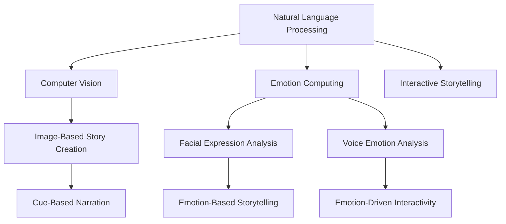

                 

# 跨媒体叙事：AI整合不同形式的故事元素

> 关键词：跨媒体叙事,故事元素整合,人工智能,自然语言处理(NLP),计算机视觉(CV),情感计算,交互式叙事

## 1. 背景介绍

### 1.1 问题由来

随着数字媒体的蓬勃发展，跨媒体叙事（Cross-Media Storytelling）已成为故事创作和传播的新趋势。它将文字、图片、视频、音频等不同形式的故事元素进行有机整合，赋予故事更加丰富的表现力和互动性。然而，由于故事元素的多样性和复杂性，传统的手工创作方式不仅耗时耗力，还难以保证一致性和连贯性。如何利用人工智能技术，整合不同形式的故事元素，提升跨媒体叙事的自动化和智能化水平，成为当下研究热点。

### 1.2 问题核心关键点

- **跨媒体叙事**：将文本、图像、声音等不同形式的故事元素进行综合，创作出更为丰富和有吸引力的故事作品。
- **故事元素整合**：自动分析和理解不同形式的故事元素，寻找和构建关联，实现跨媒体元素的无缝衔接。
- **人工智能**：利用机器学习、自然语言处理（NLP）、计算机视觉（CV）等技术，实现故事元素的智能化整合和创作。
- **情感计算**：通过情感分析技术，理解故事元素中的情感变化，增强叙事效果。
- **交互式叙事**：开发交互式叙事系统，使用户能够主动参与故事创作和互动，提升故事沉浸感。

## 2. 核心概念与联系

### 2.1 核心概念概述

为更好地理解AI在跨媒体叙事中的应用，本节将介绍几个密切相关的核心概念：

- **自然语言处理（NLP）**：研究如何让计算机理解和生成人类语言的技术，包括文本分类、情感分析、语言模型等。
- **计算机视觉（CV）**：研究如何让计算机理解并生成图像和视频的技术，包括图像识别、物体检测、视频分析等。
- **情感计算**：研究如何让计算机理解和生成情感的技术，包括面部表情识别、语音情感分析等。
- **交互式叙事**：研究如何让用户通过输入、输出等方式，主动参与故事创作和互动的技术，包括对话系统、虚拟现实（VR）等。

这些核心概念之间的逻辑关系可以通过以下Mermaid流程图来展示：



这个流程图展示了大语言模型在跨媒体叙事中的核心概念及其之间的关系：

1. **NLP**：作为基础，提供故事文本的分析和生成。
2. **CV**：提供视觉故事元素的分析和生成。
3. **情感计算**：分析情感元素，增强叙事效果。
4. **交互式叙事**：实现用户与故事的互动，增强沉浸感。
5. **跨媒体元素整合**：通过多种技术的融合，实现故事元素的无缝衔接。

## 3. 核心算法原理 & 具体操作步骤
### 3.1 算法原理概述

AI在跨媒体叙事中的核心算法原理，是通过多种技术手段，将不同形式的故事元素进行整合和创造。具体而言，可以将这个过程分为以下几个步骤：

1. **文本分析与生成**：利用NLP技术对文本进行情感分析、主题建模等，生成相关的故事文本。
2. **图像和视频分析**：通过CV技术对图像和视频进行对象识别、场景分析等，生成相应的视觉故事元素。
3. **情感分析与表达**：使用情感计算技术，分析文本和视觉元素的情感变化，增强叙事的情感深度。
4. **用户交互设计**：设计交互式叙事系统，让用户能够主动参与故事创作和互动。

### 3.2 算法步骤详解

#### 3.2.1 文本分析与生成

1. **文本情感分析**：利用NLP技术对故事文本进行情感分析，理解故事的整体情感基调。常用的情感分析方法包括基于规则的方法、基于机器学习的方法等。

2. **主题建模**：利用NLP技术对故事文本进行主题建模，找出故事的主要内容和主题。常用的主题建模方法包括LDA（Latent Dirichlet Allocation）、LSTM等。

3. **故事生成**：基于情感分析和主题建模的结果，利用NLP技术生成相关的故事文本。常用的故事生成方法包括基于规则的模板生成、基于机器学习的序列生成等。

#### 3.2.2 图像和视频分析

1. **图像识别**：利用CV技术对图像进行对象识别，找出图像中的关键元素和场景。常用的图像识别方法包括CNN（Convolutional Neural Network）、ResNet等。

2. **视频分析**：利用CV技术对视频进行场景分析和对象跟踪，生成相应的视觉故事元素。常用的视频分析方法包括光流法、背景差分等。

#### 3.2.3 情感分析与表达

1. **面部表情分析**：利用情感计算技术对视频中的人物面部表情进行识别，理解情感变化。常用的面部表情分析方法包括DNN、3D CNN等。

2. **语音情感分析**：利用情感计算技术对音频中的语音进行情感分析，理解情感变化。常用的语音情感分析方法包括MFCC、CNN等。

#### 3.2.4 用户交互设计

1. **交互式界面设计**：设计用户界面，让用户能够通过输入、输出等方式，主动参与故事创作和互动。常用的交互式界面设计工具包括Unity、Unreal Engine等。

2. **互动逻辑设计**：设计故事互动逻辑，根据用户的输入和行为，动态更新故事内容和情感变化。常用的互动逻辑设计方法包括决策树、强化学习等。

### 3.3 算法优缺点

AI在跨媒体叙事中的应用，具有以下优点：

- **自动化创作**：自动化地分析、生成和整合不同形式的故事元素，提高创作效率。
- **连贯性提升**：通过算法实现故事元素的有机整合，提升叙事的连贯性和一致性。
- **情感深度增强**：利用情感计算技术，增强故事的情感深度和互动性。
- **用户体验优化**：设计交互式叙事系统，提升用户的沉浸感和参与感。

同时，也存在一些局限性：

- **技术复杂度**：涉及多种技术的融合，技术实现较为复杂。
- **数据依赖性**：需要大量标注的文本、图像和视频数据，数据获取成本较高。
- **多样性挑战**：不同形式的故事元素多样性大，难以统一处理。
- **可解释性不足**：AI模型往往是"黑盒"系统，难以解释其决策过程。

尽管存在这些局限性，AI在跨媒体叙事中的应用仍具有广阔的前景，是推动故事创作和传播自动化、智能化发展的关键技术。

### 3.4 算法应用领域

AI在跨媒体叙事中的应用，已经广泛应用于以下领域：

- **影视制作**：利用CV技术对影视素材进行分析和处理，生成故事元素。
- **游戏开发**：设计交互式叙事系统，增强游戏故事的沉浸感和互动性。
- **教育培训**：开发交互式学习平台，利用AI生成个性化故事内容，提升学习效果。
- **虚拟现实（VR）**：构建虚拟现实场景，使用户能够沉浸式体验故事。
- **营销广告**：利用AI生成个性化广告故事，提升广告效果和用户体验。

## 4. 数学模型和公式 & 详细讲解  
### 4.1 数学模型构建

在跨媒体叙事中，涉及的数学模型主要来自NLP、CV和情感计算等领域。本节将详细介绍几个关键数学模型的构建。

#### 4.1.1 文本情感分析

文本情感分析的目标是判断文本的情感倾向，常用模型包括情感词典、基于规则的方法和机器学习方法。其中，机器学习方法包括朴素贝叶斯（Naive Bayes）、支持向量机（SVM）、深度学习（如RNN、LSTM、BERT等）。

常用的文本情感分析模型构建公式如下：

$$
\text{Sentiment} = \max_{i=1}^n \sum_{j=1}^m f(x_j)w_j
$$

其中，$f(x_j)$表示文本中第$j$个词的情感得分，$w_j$表示第$j$个词的权重，$n$和$m$分别表示文本中词的数量和情感词典中情感词的数量。

#### 4.1.2 主题建模

主题建模的目标是找出文本中的主题，常用方法包括LDA和LSTM等。LDA是一种基于概率图模型的主题建模方法，其构建公式如下：

$$
\begin{aligned}
&\text{主题-词分布} \sim \text{Dirichlet}(\beta) \\
&\text{文档-主题分布} \sim \text{Multinomial}(\theta) \\
&\text{词-主题分布} \sim \text{Multinomial}(\gamma)
\end{aligned}
$$

其中，$\beta$、$\theta$和$\gamma$分别表示主题-词分布、文档-主题分布和词-主题分布的超参数。

#### 4.1.3 图像识别

图像识别的目标是识别图像中的对象和场景，常用模型包括CNN、ResNet等。CNN模型的构建公式如下：

$$
\text{Feature Map} = \text{Convolutional Layer}(\text{Input Image})
$$

其中，$\text{Feature Map}$表示卷积层的输出特征图，$\text{Input Image}$表示输入图像，$\text{Convolutional Layer}$表示卷积层。

#### 4.1.4 面部表情分析

面部表情分析的目标是识别视频中人物的面部表情，常用模型包括DNN、3D CNN等。3D CNN模型的构建公式如下：

$$
\text{Emotion Score} = \text{3D CNN}(\text{Face Image})
$$

其中，$\text{Emotion Score}$表示面部表情得分，$\text{Face Image}$表示面部图像，$\text{3D CNN}$表示3D卷积神经网络。

#### 4.1.5 语音情感分析

语音情感分析的目标是分析音频中的语音情感，常用模型包括MFCC、CNN等。MFCC模型的构建公式如下：

$$
\text{Mel-Spectrogram} = \text{Mel Filterbank}(\text{Audio Signal})
$$

其中，$\text{Mel-Spectrogram}$表示梅尔频率倒谱系数（Mel-Spectrum），$\text{Audio Signal}$表示音频信号，$\text{Mel Filterbank}$表示梅尔滤波器。

### 4.2 公式推导过程

以下我们以情感词典和机器学习方法为例，推导文本情感分析的公式及其梯度计算。

#### 4.2.1 情感词典

情感词典是一种基于人工构建的情感词汇表，常用公式如下：

$$
\text{Sentiment Score} = \sum_{i=1}^n \text{Emotion Score}(x_i)w_i
$$

其中，$\text{Emotion Score}(x_i)$表示文本中第$i$个词的情感得分，$w_i$表示第$i$个词的权重，$n$表示文本中词的数量。

#### 4.2.2 基于机器学习的情感分析

基于机器学习的情感分析模型常用的有朴素贝叶斯、SVM和深度学习模型。以深度学习模型为例，其构建公式如下：

$$
\text{Sentiment Score} = f(\text{Word Embedding})
$$

其中，$f$表示深度学习模型的映射函数，$\text{Word Embedding}$表示词嵌入向量。

梯度计算公式为：

$$
\nabla_{\theta} \text{Loss} = \nabla_{\theta} \sum_{i=1}^N \log p(y_i|x_i;\theta)
$$

其中，$\nabla_{\theta} \text{Loss}$表示损失函数对模型参数$\theta$的梯度，$N$表示训练样本的数量，$y_i$表示样本的情感标签，$x_i$表示样本的文本特征，$p(y_i|x_i;\theta)$表示模型对样本情感标签的预测概率。

### 4.3 案例分析与讲解

假设有一个故事文本，利用NLP技术对其情感进行分析，并找出主要主题。

**情感分析**：

1. 首先，对文本进行分词，得到词汇列表$V=\{v_1,v_2,\dots,v_n\}$。
2. 使用情感词典$D=\{(d_i,v_i)\}_{i=1}^m$，对每个词汇$v_i$进行情感得分计算，得到情感得分列表$S=\{s_i\}_{i=1}^n$。
3. 利用机器学习方法，对文本进行情感分类，得到情感标签$y$。
4. 结合情感得分和情感标签，计算文本情感得分，公式如下：

$$
\text{Sentiment Score} = \sum_{i=1}^n s_i \times w_i
$$

其中，$w_i$表示词汇$v_i$的权重，$n$表示词汇数量。

**主题建模**：

1. 对文本进行分词，得到词汇列表$V=\{v_1,v_2,\dots,v_n\}$。
2. 利用LDA模型，对文本进行主题建模，得到主题-词分布$\beta$、文档-主题分布$\theta$和词-主题分布$\gamma$。
3. 根据主题-词分布和词-主题分布，计算文本的主题得分列表$T=\{t_i\}_{i=1}^n$。
4. 结合主题得分和文档-主题分布，计算文本的主题得分，公式如下：

$$
\text{Topic Score} = \sum_{i=1}^n t_i \times w_i
$$

其中，$t_i$表示文本中第$i$个词汇对应的主题得分，$w_i$表示词汇的权重，$n$表示词汇数量。

## 5. 项目实践：代码实例和详细解释说明
### 5.1 开发环境搭建

在进行跨媒体叙事项目实践前，我们需要准备好开发环境。以下是使用Python进行PyTorch开发的环境配置流程：

1. 安装Anaconda：从官网下载并安装Anaconda，用于创建独立的Python环境。

2. 创建并激活虚拟环境：
```bash
conda create -n pytorch-env python=3.8 
conda activate pytorch-env
```

3. 安装PyTorch：根据CUDA版本，从官网获取对应的安装命令。例如：
```bash
conda install pytorch torchvision torchaudio cudatoolkit=11.1 -c pytorch -c conda-forge
```

4. 安装Transformers库：
```bash
pip install transformers
```

5. 安装各类工具包：
```bash
pip install numpy pandas scikit-learn matplotlib tqdm jupyter notebook ipython
```

完成上述步骤后，即可在`pytorch-env`环境中开始项目实践。

### 5.2 源代码详细实现

下面我们以情感分析任务为例，给出使用Transformers库对BERT模型进行情感分析的PyTorch代码实现。

首先，定义情感分析任务的数据处理函数：

```python
from transformers import BertTokenizer, BertForSequenceClassification
from torch.utils.data import Dataset
import torch

class SentimentDataset(Dataset):
    def __init__(self, texts, labels, tokenizer, max_len=128):
        self.texts = texts
        self.labels = labels
        self.tokenizer = tokenizer
        self.max_len = max_len
        
    def __len__(self):
        return len(self.texts)
    
    def __getitem__(self, item):
        text = self.texts[item]
        label = self.labels[item]
        
        encoding = self.tokenizer(text, return_tensors='pt', max_length=self.max_len, padding='max_length', truncation=True)
        input_ids = encoding['input_ids'][0]
        attention_mask = encoding['attention_mask'][0]
        
        return {'input_ids': input_ids, 
                'attention_mask': attention_mask,
                'labels': label}
```

然后，定义模型和优化器：

```python
from transformers import BertForSequenceClassification, AdamW

model = BertForSequenceClassification.from_pretrained('bert-base-cased', num_labels=2)

optimizer = AdamW(model.parameters(), lr=2e-5)
```

接着，定义训练和评估函数：

```python
from torch.utils.data import DataLoader
from tqdm import tqdm
from sklearn.metrics import accuracy_score

device = torch.device('cuda') if torch.cuda.is_available() else torch.device('cpu')
model.to(device)

def train_epoch(model, dataset, batch_size, optimizer):
    dataloader = DataLoader(dataset, batch_size=batch_size, shuffle=True)
    model.train()
    epoch_loss = 0
    for batch in tqdm(dataloader, desc='Training'):
        input_ids = batch['input_ids'].to(device)
        attention_mask = batch['attention_mask'].to(device)
        labels = batch['labels'].to(device)
        model.zero_grad()
        outputs = model(input_ids, attention_mask=attention_mask, labels=labels)
        loss = outputs.loss
        epoch_loss += loss.item()
        loss.backward()
        optimizer.step()
    return epoch_loss / len(dataloader)

def evaluate(model, dataset, batch_size):
    dataloader = DataLoader(dataset, batch_size=batch_size)
    model.eval()
    preds, labels = [], []
    with torch.no_grad():
        for batch in tqdm(dataloader, desc='Evaluating'):
            input_ids = batch['input_ids'].to(device)
            attention_mask = batch['attention_mask'].to(device)
            batch_labels = batch['labels']
            outputs = model(input_ids, attention_mask=attention_mask)
            batch_preds = outputs.logits.argmax(dim=2).to('cpu').tolist()
            batch_labels = batch_labels.to('cpu').tolist()
            for pred, label in zip(batch_preds, batch_labels):
                preds.append(pred[0])
                labels.append(label)
                
    print('Accuracy:', accuracy_score(labels, preds))
```

最后，启动训练流程并在测试集上评估：

```python
epochs = 5
batch_size = 16

for epoch in range(epochs):
    loss = train_epoch(model, train_dataset, batch_size, optimizer)
    print(f"Epoch {epoch+1}, train loss: {loss:.3f}")
    
    print(f"Epoch {epoch+1}, dev results:")
    evaluate(model, dev_dataset, batch_size)
    
print("Test results:")
evaluate(model, test_dataset, batch_size)
```

以上就是使用PyTorch对BERT进行情感分析任务开发的完整代码实现。可以看到，得益于Transformers库的强大封装，我们可以用相对简洁的代码完成BERT模型的加载和情感分析任务。

### 5.3 代码解读与分析

让我们再详细解读一下关键代码的实现细节：

**SentimentDataset类**：
- `__init__`方法：初始化文本、标签、分词器等关键组件。
- `__len__`方法：返回数据集的样本数量。
- `__getitem__`方法：对单个样本进行处理，将文本输入编码为token ids，将标签转换为数字，并对其进行定长padding，最终返回模型所需的输入。

**情感分析任务代码**：
- 使用BERT模型，定义情感分析任务的输出层为二分类任务，使用交叉熵损失函数。
- 在训练过程中，通过AdamW优化器更新模型参数，并设置适当的学习率。
- 在测试过程中，使用准确率作为评估指标，打印出模型在测试集上的性能。

**训练和评估函数**：
- 使用PyTorch的DataLoader对数据集进行批次化加载，供模型训练和推理使用。
- 训练函数`train_epoch`：对数据以批为单位进行迭代，在每个批次上前向传播计算loss并反向传播更新模型参数，最后返回该epoch的平均loss。
- 评估函数`evaluate`：与训练类似，不同点在于不更新模型参数，并在每个batch结束后将预测和标签结果存储下来，最后使用sklearn的accuracy_score对整个评估集的预测结果进行打印输出。

**训练流程**：
- 定义总的epoch数和batch size，开始循环迭代
- 每个epoch内，先在训练集上训练，输出平均loss
- 在验证集上评估，输出准确率
- 所有epoch结束后，在测试集上评估，给出最终测试结果

可以看到，PyTorch配合Transformers库使得情感分析任务的代码实现变得简洁高效。开发者可以将更多精力放在数据处理、模型改进等高层逻辑上，而不必过多关注底层的实现细节。

当然，工业级的系统实现还需考虑更多因素，如模型的保存和部署、超参数的自动搜索、更灵活的任务适配层等。但核心的微调范式基本与此类似。

## 6. 实际应用场景
### 6.1 情感分析系统

情感分析系统在社交媒体、电商评论、客服对话等场景中广泛应用，帮助企业分析用户情感，优化服务和产品。传统的手工情感分析不仅耗时耗力，还难以保证一致性和准确性。基于跨媒体叙事的情感分析技术，可以自动分析用户评论中的情感变化，生成动态的情感分析报告，为企业管理和产品改进提供数据支持。

在技术实现上，可以收集用户评论和评分数据，利用情感分析技术对文本和图像进行情感分析，生成情感分析报告。对于新的用户评论，也可以实时进行情感分析，动态更新报告内容，帮助企业及时应对用户反馈，优化产品和服务。

### 6.2 跨媒体内容创作

跨媒体内容创作是跨媒体叙事的重要应用方向，通过将不同形式的故事元素进行融合，创作出更为丰富和吸引人的内容。利用跨媒体叙事的情感分析技术和主题建模技术，可以帮助内容创作者自动分析用户情感和主题偏好，生成个性化内容。

在实践过程中，可以收集用户对不同形式的故事元素的反馈数据，利用情感分析技术分析用户的情感变化和偏好，利用主题建模技术找出用户喜欢的主题，结合多模态故事元素，自动生成个性化故事内容。例如，对于某款游戏，可以根据玩家对不同故事元素（如角色、场景、任务等）的评价，自动生成个性化的故事内容，提升玩家的沉浸感和体验感。

### 6.3 虚拟现实（VR）叙事

虚拟现实叙事是跨媒体叙事的重要应用方向，通过将不同形式的故事元素整合到虚拟现实环境中，创造沉浸式的叙事体验。利用跨媒体叙事的情感分析和用户交互设计技术，可以开发出更加丰富和互动的虚拟现实叙事系统。

在技术实现上，可以设计虚拟现实场景，利用情感分析技术分析用户的情感变化，动态调整叙事内容。利用用户交互设计技术，开发交互式叙事系统，让用户能够主动参与故事创作和互动，提升虚拟现实叙事的沉浸感和互动性。例如，在一个虚拟现实游戏中，可以根据用户的情感变化，动态调整游戏内容，提升游戏体验。

### 6.4 未来应用展望

随着跨媒体叙事技术的不断发展，未来将在更多领域得到应用，为故事创作和传播带来新的可能性。

在智慧城市治理中，利用跨媒体叙事技术，可以开发智能导游、虚拟博物馆等应用，提升城市管理和旅游体验。在智能家居中，利用跨媒体叙事技术，可以开发智能故事系统，根据用户的喜好和行为，自动生成个性化家居故事，提升用户的生活体验。

此外，在教育培训、营销广告、媒体娱乐等众多领域，跨媒体叙事技术也将不断涌现，为相关行业带来变革性影响。相信随着技术的日益成熟，跨媒体叙事技术必将在构建人机协同的智能故事创作和传播中扮演越来越重要的角色。

## 7. 工具和资源推荐
### 7.1 学习资源推荐

为了帮助开发者系统掌握跨媒体叙事的理论基础和实践技巧，这里推荐一些优质的学习资源：

1. 《深度学习与NLP》系列书籍：介绍深度学习和NLP的基本概念和技术，是学习跨媒体叙事技术的入门书籍。

2. 《跨媒体叙事：新概念与技术》课程：斯坦福大学开设的跨媒体叙事课程，讲解跨媒体叙事的理论基础和应用技术，是学习跨媒体叙事技术的推荐课程。

3. 《自然语言处理与情感分析》博客：大语言模型专家撰写，深入浅出地介绍情感分析技术的原理和应用，是学习情感分析技术的推荐博客。

4. 《计算机视觉基础》课程：麻省理工学院开设的计算机视觉课程，讲解计算机视觉的基本概念和技术，是学习跨媒体叙事技术中的视觉元素分析的基础课程。

5. 《跨媒体叙事案例分析》论文集：收录了多个跨媒体叙事案例，详细介绍了跨媒体叙事技术的实际应用，是学习跨媒体叙事技术的推荐论文集。

通过对这些资源的学习实践，相信你一定能够快速掌握跨媒体叙事的精髓，并用于解决实际的跨媒体叙事问题。
### 7.2 开发工具推荐

高效的开发离不开优秀的工具支持。以下是几款用于跨媒体叙事开发的常用工具：

1. PyTorch：基于Python的开源深度学习框架，灵活动态的计算图，适合快速迭代研究。大部分预训练语言模型都有PyTorch版本的实现。

2. TensorFlow：由Google主导开发的开源深度学习框架，生产部署方便，适合大规模工程应用。同样有丰富的预训练语言模型资源。

3. Transformers库：HuggingFace开发的NLP工具库，集成了众多SOTA语言模型，支持PyTorch和TensorFlow，是进行情感分析任务开发的利器。

4. Weights & Biases：模型训练的实验跟踪工具，可以记录和可视化模型训练过程中的各项指标，方便对比和调优。与主流深度学习框架无缝集成。

5. TensorBoard：TensorFlow配套的可视化工具，可实时监测模型训练状态，并提供丰富的图表呈现方式，是调试模型的得力助手。

6. Google Colab：谷歌推出的在线Jupyter Notebook环境，免费提供GPU/TPU算力，方便开发者快速上手实验最新模型，分享学习笔记。

合理利用这些工具，可以显著提升跨媒体叙事任务的开发效率，加快创新迭代的步伐。

### 7.3 相关论文推荐

跨媒体叙事技术的发展源于学界的持续研究。以下是几篇奠基性的相关论文，推荐阅读：

1. "Cross-Media Storytelling: A Survey"：综述了跨媒体叙事技术的研究进展和应用案例，是学习跨媒体叙事技术的推荐论文。

2. "A Survey on Cross-Media Storytelling Techniques"：介绍跨媒体叙事技术的多种实现方法，是学习跨媒体叙事技术的推荐论文。

3. "Cross-Media Storytelling with Deep Learning"：探讨了利用深度学习技术进行跨媒体叙事的方法，是学习跨媒体叙事技术的推荐论文。

4. "The Role of Emotion in Cross-Media Storytelling"：研究情感在跨媒体叙事中的作用，是学习跨媒体叙事技术的推荐论文。

5. "Interactive Storytelling with Multimodal Data"：探讨了利用多模态数据进行交互式叙事的方法，是学习跨媒体叙事技术的推荐论文。

这些论文代表了大语言模型在跨媒体叙事中的应用发展脉络。通过学习这些前沿成果，可以帮助研究者把握学科前进方向，激发更多的创新灵感。

## 8. 总结：未来发展趋势与挑战

### 8.1 总结

本文对跨媒体叙事技术的核心算法原理、操作步骤以及实际应用进行了全面系统的介绍。首先阐述了跨媒体叙事技术的背景和意义，明确了其在前沿AI技术中的独特价值。其次，从原理到实践，详细讲解了跨媒体叙事的数学模型和关键步骤，给出了跨媒体叙事任务开发的完整代码实例。同时，本文还广泛探讨了跨媒体叙事技术在多个领域的应用前景，展示了其广阔的应用潜力。此外，本文精选了跨媒体叙事技术的各类学习资源，力求为读者提供全方位的技术指引。

通过本文的系统梳理，可以看到，跨媒体叙事技术正在成为AI领域的重要范式，极大地拓展了故事创作和传播的自动化、智能化水平，为跨媒体叙事带来了新的可能性。未来，伴随跨媒体叙事技术的持续演进，相信AI将在故事创作和传播领域发挥越来越重要的作用，推动跨媒体叙事的进一步发展。

### 8.2 未来发展趋势

展望未来，跨媒体叙事技术将呈现以下几个发展趋势：

1. **自动化创作**：自动化地分析、生成和整合不同形式的故事元素，提高创作效率和一致性。
2. **多模态融合**：融合文本、图像、声音等多种形式的故事元素，提升叙事的丰富性和沉浸感。
3. **情感深度增强**：利用情感计算技术，增强叙事的情感深度和互动性。
4. **用户交互优化**：设计交互式叙事系统，提升用户的沉浸感和参与感。
5. **跨平台协同**：实现跨平台、跨媒介的叙事协同，提升叙事的覆盖面和传播效果。
6. **跨文化适应**：开发跨文化叙事技术，实现不同文化背景下的叙事适配，提升全球化传播效果。

以上趋势凸显了跨媒体叙事技术的广阔前景。这些方向的探索发展，必将进一步提升跨媒体叙事的创作水平和传播效果，为故事创作和传播带来新的可能性。

### 8.3 面临的挑战

尽管跨媒体叙事技术已经取得了显著进展，但在迈向更加智能化、普适化应用的过程中，仍面临诸多挑战：

1. **数据依赖性**：需要大量标注的文本、图像和视频数据，数据获取成本较高。
2. **多样性挑战**：不同形式的故事元素多样性大，难以统一处理。
3. **可解释性不足**：AI模型往往是"黑盒"系统，难以解释其决策过程。
4. **鲁棒性不足**：不同形式的故事元素多样性大，难以统一处理。
5. **用户参与度**：跨媒体叙事系统的交互设计需要充分考虑用户需求和行为，提升用户体验。

尽管存在这些挑战，跨媒体叙事技术仍具有广阔的前景，是推动故事创作和传播自动化、智能化发展的关键技术。未来相关研究需要在数据获取、模型优化、用户交互设计等方面进行更多探索和实践。

### 8.4 研究展望

面对跨媒体叙事技术面临的挑战，未来的研究需要在以下几个方面寻求新的突破：

1. **无监督和半监督学习**：摆脱对大规模标注数据的依赖，利用无监督和半监督学习范式，最大限度利用非结构化数据，实现更加灵活高效的创作。
2. **多模态融合**：开发更加智能的跨媒体融合技术，实现不同形式的故事元素的有机整合。
3. **情感计算**：研究情感分析技术的改进方法，增强叙事的情感深度和互动性。
4. **交互设计**：设计更加智能和人性化的交互系统，提升用户的沉浸感和参与感。
5. **跨平台协同**：实现跨平台、跨媒介的叙事协同，提升叙事的覆盖面和传播效果。
6. **跨文化适应**：开发跨文化叙事技术，实现不同文化背景下的叙事适配，提升全球化传播效果。

这些研究方向的研究突破，必将推动跨媒体叙事技术向更深层次发展，为故事创作和传播带来更多创新和变革。

## 9. 附录：常见问题与解答

**Q1：跨媒体叙事技术是否适用于所有类型的叙事形式？**

A: 跨媒体叙事技术可以适用于多种类型的叙事形式，包括文学、影视、游戏、虚拟现实等。不同形式的叙事形式，可以根据具体需求，利用相应的跨媒体叙事技术进行创作和传播。

**Q2：跨媒体叙事技术在实际应用中需要注意哪些问题？**

A: 在实际应用中，需要注意以下问题：

1. 数据获取：需要收集大量标注的数据，数据获取成本较高。
2. 多样性处理：不同形式的故事元素多样性大，难以统一处理。
3. 可解释性：AI模型通常是"黑盒"系统，难以解释其决策过程。
4. 鲁棒性：不同形式的故事元素多样性大，难以统一处理。
5. 用户交互：跨媒体叙事系统的交互设计需要充分考虑用户需求和行为，提升用户体验。

**Q3：如何提升跨媒体叙事的自动化和智能化水平？**

A: 提升跨媒体叙事的自动化和智能化水平，可以从以下几个方面进行：

1. 利用情感计算技术，增强叙事的情感深度和互动性。
2. 设计交互式叙事系统，提升用户的沉浸感和参与感。
3. 利用多模态数据进行叙事创作，提升叙事的丰富性和沉浸感。
4. 开发跨媒体融合技术，实现不同形式的故事元素的有机整合。

**Q4：跨媒体叙事技术在未来有哪些新的应用方向？**

A: 跨媒体叙事技术在未来有以下新的应用方向：

1. 智慧城市：利用跨媒体叙事技术，开发智能导游、虚拟博物馆等应用，提升城市管理和旅游体验。
2. 智能家居：利用跨媒体叙事技术，开发智能故事系统，根据用户的喜好和行为，自动生成个性化家居故事。
3. 教育培训：利用跨媒体叙事技术，开发交互式学习平台，利用AI生成个性化故事内容，提升学习效果。
4. 媒体娱乐：利用跨媒体叙事技术，开发互动式影视、游戏等应用，提升用户体验。

---

作者：禅与计算机程序设计艺术 / Zen and the Art of Computer Programming

