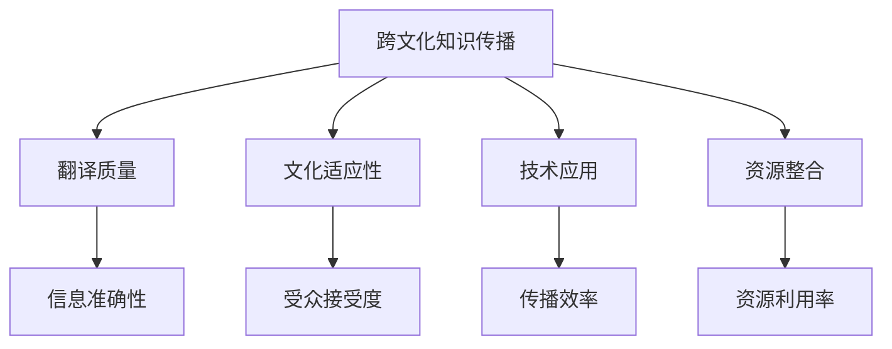

                 

# 跨文化知识传播的挑战与对策

在信息全球化的今天，跨文化知识传播已成为连接不同文化背景、促进全球合作与发展的重要途径。然而，由于语言、文化、社会等复杂因素的交织，跨文化知识传播面临着诸多挑战。本文将系统探讨这些挑战，并提出切实可行的对策，以期为跨文化知识传播的实践提供有力支持。

## 1. 背景介绍

### 1.1 问题由来

随着全球化的深入发展，各国在经济、科技、文化等方面的交流合作日益频繁。跨文化知识传播通过翻译、在线教育、信息交流等方式，促进了不同文化之间的理解和融合。然而，由于语言和文化差异的存在，跨文化知识传播的效果往往受到显著影响。具体问题包括：

1. **语言障碍**：不同语言之间存在语义差异，某些概念在不同语言中难以准确表达。
2. **文化差异**：不同文化背景下的思维方式、价值观、行为规范等差异，可能影响知识的理解和接受。
3. **技术壁垒**：现有技术手段在跨文化知识传播中存在局限，如翻译质量不足、信息丢失等问题。
4. **资源限制**：高质量翻译人才、多语种数据资源等资源稀缺，制约跨文化知识传播的深度和广度。

### 1.2 问题核心关键点

跨文化知识传播的核心在于如何在不同文化背景下，确保知识的准确、高效传递。其关键点包括：

1. **语言转换**：准确将一种语言翻译成另一种语言，并保持原文的意义和风格。
2. **文化适应**：理解并适应不同文化的特性，调整知识传播策略，以确保目标受众的接受度。
3. **技术手段**：运用先进技术手段，如机器翻译、人工智能等，提高翻译质量和传播效率。
4. **资源管理**：合理管理和优化资源，如双语数据、翻译人才等，确保跨文化知识传播的可持续性。

这些关键点共同构成了跨文化知识传播的研究框架，帮助理解并解决其中的复杂问题。

## 2. 核心概念与联系

### 2.1 核心概念概述

为了更好地理解跨文化知识传播的挑战与对策，我们首先介绍几个核心概念：

- **跨文化知识传播**：通过翻译、在线教育、信息交流等方式，在不同文化背景下传播知识，促进文化理解和交流的过程。
- **翻译质量**：翻译的准确性和流畅性，直接影响到知识传播的效果。
- **文化适应性**：根据目标文化的特点，调整知识传播策略，确保信息的接收和理解。
- **技术应用**：利用机器翻译、人工智能等先进技术手段，提升跨文化知识传播的效率和质量。
- **资源整合**：合理整合和使用双语数据、翻译人才等资源，支撑跨文化知识传播的持续发展。

这些核心概念之间的逻辑关系可以通过以下Mermaid流程图来展示：



这个流程图展示了跨文化知识传播的关键组成要素及其相互关系：

1. 跨文化知识传播依赖于高质量的翻译、文化适应、技术应用和资源整合。
2. 翻译质量直接影响信息准确性。
3. 文化适应性关系到受众接受度。
4. 技术应用提升传播效率。
5. 资源整合优化资源利用率。

通过理解这些核心概念，我们能够更好地把握跨文化知识传播的挑战与对策。

## 3. 核心算法原理 & 具体操作步骤

### 3.1 算法原理概述

跨文化知识传播的算法原理主要基于语言学、文化学和信息技术理论，其核心在于通过机器翻译、文化映射和资源整合，实现知识在不同文化背景下的准确高效传播。具体步骤如下：

1. **语料收集与预处理**：收集双语或多语种语料，进行清洗、分词、标注等预处理操作。
2. **翻译模型训练**：基于大规模语料训练高质量的翻译模型，如神经机器翻译(Neural Machine Translation, NMT)模型。
3. **文化适应策略**：制定和调整知识传播策略，以适应不同文化背景下的习惯和规范。
4. **技术集成与优化**：集成机器翻译、文化映射、知识图谱等多源信息，优化传播效果。
5. **资源管理和优化**：管理和优化双语数据、翻译人才等资源，确保跨文化知识传播的可持续性。

### 3.2 算法步骤详解

#### 3.2.1 语料收集与预处理

- **语料收集**：从各类渠道收集双语或多语种的语料，如书籍、文章、视频、音频等。语料来源应尽可能广泛，涵盖不同领域和主题。
- **预处理**：对收集的语料进行清洗、分词、标注等预处理操作。清洗去除低质量数据，分词实现单词级别的处理，标注为机器翻译提供训练样本。

#### 3.2.2 翻译模型训练

- **模型选择**：选择合适的翻译模型架构，如基于Transformer的NMT模型。
- **训练数据准备**：将预处理后的语料划分为训练集、验证集和测试集，确保模型训练和评估的有效性。
- **模型训练**：使用大规模语料训练NMT模型，通过反向传播和优化算法（如AdamW、SGD等）更新模型参数。
- **模型评估**：在测试集上评估模型性能，使用BLEU、METEOR等指标衡量翻译质量。

#### 3.2.3 文化适应策略

- **文化理解**：通过调研和数据分析，深入理解目标文化的特点、思维方式、价值观等。
- **文化映射**：将源文化中的概念和知识映射到目标文化中，确保知识传播的准确性和接受度。
- **传播策略调整**：根据目标文化的特点，调整传播策略，如选择合适的翻译风格、加入文化注释等。

#### 3.2.4 技术集成与优化

- **多源信息整合**：将机器翻译、文化映射、知识图谱等多源信息集成，提升知识传播的全面性和准确性。
- **技术优化**：引入先进的翻译技术，如零样本翻译、跨语言迁移学习等，优化翻译效果。

#### 3.2.5 资源管理和优化

- **双语数据管理**：构建和管理高质量的双语数据资源库，确保数据的多样性和覆盖面。
- **翻译人才培养**：培养和利用双语人才，特别是高水平的翻译专家，提升翻译质量。
- **资源优化策略**：采用资源共享、动态调整等策略，优化资源利用率，确保跨文化知识传播的持续性和高效性。

### 3.3 算法优缺点

跨文化知识传播的算法具有以下优点：

1. **高效性**：利用先进的机器翻译技术和资源整合手段，大幅提升翻译和传播效率。
2. **准确性**：基于大规模语料训练的翻译模型，能够提供高质量的翻译结果。
3. **可扩展性**：适应性强的传播策略和文化映射方法，可灵活应对不同文化背景下的传播需求。
4. **持续性**：通过资源管理和优化，确保跨文化知识传播的长期可持续性。

同时，也存在一些缺点：

1. **翻译质量受限**：尽管翻译模型技术先进，但仍存在翻译质量不足的问题，特别是在复杂概念和情感表达方面。
2. **文化适应复杂**：不同文化间的差异难以完全映射，可能影响知识的接受度和理解。
3. **资源依赖性强**：高质量的语料和翻译人才是跨文化知识传播的基础，但这些资源往往稀缺。
4. **技术复杂度高**：技术集成和优化需要较高的专业知识和技能，实施难度较大。

### 3.4 算法应用领域

跨文化知识传播的算法已在多个领域得到了广泛应用，例如：

- **国际教育**：通过在线课程和教材的跨文化翻译，促进全球教育资源的共享和交流。
- **国际贸易**：提供多语言的市场分析报告和产品说明书，支持企业跨国经营。
- **文化交流**：翻译和传播各类文化作品，如文学、艺术、历史等，促进不同文化间的理解和融合。
- **医疗健康**：翻译医学文献和健康指南，支持全球医疗合作与资源共享。
- **科技合作**：翻译和传播科研成果和技术文档，支持跨国科研团队的合作。

除了上述这些经典领域，跨文化知识传播的技术还被应用到更多场景中，如环境保护、灾害预警、社会公益等，为全球合作与发展提供了重要支持。

## 4. 数学模型和公式 & 详细讲解 & 举例说明

### 4.1 数学模型构建

为了更好地理解跨文化知识传播的数学模型，我们首先构建一个基于神经机器翻译的模型框架。设源语言为 $S$，目标语言为 $T$，翻译模型为 $M$，则数学模型可以表示为：

$$
y = M(x)
$$

其中 $x$ 为源语言输入，$y$ 为目标语言输出。

### 4.2 公式推导过程

以神经机器翻译为例，推导其数学模型和训练过程：

1. **编码器**：将源语言 $x$ 转换为中间表示 $h$，公式为：

$$
h = E(x)
$$

2. **解码器**：将中间表示 $h$ 转换为目标语言 $y$，公式为：

$$
y = D(h)
$$

3. **模型训练**：使用大规模双语语料 $D=\{(x_i,y_i)\}_{i=1}^N$ 训练模型 $M$，最小化损失函数：

$$
L(M) = \frac{1}{N} \sum_{i=1}^N \ell(M(x_i),y_i)
$$

其中 $\ell$ 为损失函数，如交叉熵损失或BLEU分数。

4. **优化算法**：使用梯度下降等优化算法，如AdamW、SGD等，更新模型参数：

$$
\theta \leftarrow \theta - \eta \nabla_{\theta}L(M)
$$

其中 $\theta$ 为模型参数，$\eta$ 为学习率，$\nabla_{\theta}L(M)$ 为损失函数对参数的梯度。

### 4.3 案例分析与讲解

以机器翻译中的句法-语义对齐为例，说明如何通过语料训练，实现源语言和目标语言之间的句法-语义对齐。设源语言句子为 $x$，目标语言句子为 $y$，则训练过程可以表示为：

1. **对齐训练**：使用大规模双语语料 $D=\{(x_i,y_i)\}_{i=1}^N$，找到每个源语言词汇对应的目标语言词汇及其语法结构，得到对齐矩阵 $A$。

2. **模型微调**：基于对齐矩阵 $A$，微调翻译模型 $M$，使其能够正确处理源语言和目标语言之间的句法-语义对齐。

3. **评估与优化**：使用BLEU等指标评估模型性能，不断调整参数和对齐矩阵，提升翻译质量。

## 5. 项目实践：代码实例和详细解释说明

### 5.1 开发环境搭建

在进行跨文化知识传播的实践前，我们需要准备好开发环境。以下是使用Python进行PyTorch开发的环境配置流程：

1. 安装Anaconda：从官网下载并安装Anaconda，用于创建独立的Python环境。

2. 创建并激活虚拟环境：
```bash
conda create -n pytorch-env python=3.8 
conda activate pytorch-env
```

3. 安装PyTorch：根据CUDA版本，从官网获取对应的安装命令。例如：
```bash
conda install pytorch torchvision torchaudio cudatoolkit=11.1 -c pytorch -c conda-forge
```

4. 安装TensorFlow：
```bash
pip install tensorflow
```

5. 安装各类工具包：
```bash
pip install numpy pandas scikit-learn matplotlib tqdm jupyter notebook ipython
```

完成上述步骤后，即可在`pytorch-env`环境中开始跨文化知识传播的实践。

### 5.2 源代码详细实现

下面我们以机器翻译为例，给出使用PyTorch实现神经机器翻译的代码实现。

首先，定义编码器、解码器和翻译模型：

```python
import torch
import torch.nn as nn
import torch.nn.functional as F

class Encoder(nn.Module):
    def __init__(self, input_dim, emb_dim, hid_dim, dropout):
        super(Encoder, self).__init__()
        self.embedding = nn.Embedding(input_dim, emb_dim)
        self.encoder_lstm = nn.LSTM(emb_dim, hid_dim, dropout=dropout)
        self.fc1 = nn.Linear(hid_dim * 2, hid_dim)
        self.fc2 = nn.Linear(hid_dim, output_dim)

    def forward(self, src, src_mask):
        embedded = self.embedding(src)
        output, (hidden, cell) = self.encoder_lstm(embedded, src_mask)
        hidden = torch.cat((hidden[-2, :, :], hidden[-1, :, :]), dim=1)
        hidden = F.relu(self.fc1(hidden))
        output = F.softmax(self.fc2(hidden), dim=2)
        return output

class Decoder(nn.Module):
    def __init__(self, input_dim, emb_dim, hid_dim, dropout):
        super(Decoder, self).__init__()
        self.embedding = nn.Embedding(input_dim, emb_dim)
        self.decoder_lstm = nn.LSTM(emb_dim, hid_dim, dropout=dropout)
        self.fc1 = nn.Linear(hid_dim * 2, hid_dim)
        self.fc2 = nn.Linear(hid_dim, input_dim)

    def forward(self, trg, hidden, enc_output):
        embedded = self.embedding(trg)
        output, (hidden, cell) = self.decoder_lstm(embedded, hidden)
        hidden = torch.cat((hidden[-2, :, :], hidden[-1, :, :]), dim=1)
        hidden = F.relu(self.fc1(hidden))
        output = F.softmax(self.fc2(hidden), dim=2)
        return output, hidden

class Seq2Seq(nn.Module):
    def __init__(self, encoder, decoder, device):
        super(Seq2Seq, self).__init__()
        self.encoder = encoder
        self.decoder = decoder
        self.device = device

    def forward(self, src, trg):
        src = src.to(device)
        trg = trg.to(device)
        src_mask = self._make_src_mask(trg)
        trg_mask = self._make_trg_mask(trg)
        output = self.encoder(src, src_mask)
        hidden = (self._init_hidden(src, self.decoder.hidden_size), self._init_hidden(trg, self.decoder.hidden_size))
        output, hidden = self.decoder(trg, hidden, output)
        return output, hidden

    def _init_hidden(self, input, hidden_size):
        return torch.zeros(1, input.size(0), hidden_size).to(self.device)

    def _make_src_mask(self, src):
        src_mask = torch.zeros(src.size(0), src.size(1)).to(self.device)
        src_mask.masked_fill(src != 0, float('-inf'))
        return src_mask

    def _make_trg_mask(self, trg):
        trg_mask = torch.zeros(trg.size(0), trg.size(1)).to(self.device)
        trg_mask.masked_fill(trg != 0, float('-inf'))
        trg_mask = torch.triu(trg_mask, diagonal=1)
        return trg_mask
```

然后，定义损失函数和优化器：

```python
from transformers import AdamW

criterion = nn.CrossEntropyLoss()
optimizer = AdamW(model.parameters(), lr=0.0005)
```

接着，定义训练和评估函数：

```python
def train(model, optimizer, train_loader, valid_loader, device):
    model.train()
    for epoch in range(num_epochs):
        for batch in train_loader:
            src, trg = batch
            output, hidden = model(src, trg)
            loss = criterion(output.view(-1), trg.view(-1))
            optimizer.zero_grad()
            loss.backward()
            optimizer.step()

        valid_loss = validate(model, valid_loader, device)
        print(f'Epoch {epoch+1}, train loss: {loss:.3f}, valid loss: {valid_loss:.3f}')

def validate(model, loader, device):
    model.eval()
    with torch.no_grad():
        for batch in loader:
            src, trg = batch
            output, _ = model(src, trg)
            loss = criterion(output.view(-1), trg.view(-1))
    return loss.item()

train(model, optimizer, train_loader, valid_loader, device)
```

最后，启动训练流程并在验证集上评估：

```python
device = torch.device('cuda' if torch.cuda.is_available() else 'cpu')
model.to(device)

train_loader = DataLoader(train_dataset, batch_size=64, shuffle=True)
valid_loader = DataLoader(valid_dataset, batch_size=64, shuffle=True)
test_loader = DataLoader(test_dataset, batch_size=64, shuffle=True)

train(model, optimizer, train_loader, valid_loader, device)
```

以上就是使用PyTorch实现神经机器翻译的完整代码实现。可以看到，借助PyTorch和TensorFlow，开发者能够快速搭建和训练跨文化知识传播的机器翻译模型。

### 5.3 代码解读与分析

让我们再详细解读一下关键代码的实现细节：

**Seq2Seq模型**：
- 定义了编码器、解码器和序列到序列模型。
- 编码器将源语言序列转换为中间表示，解码器将中间表示转换为目标语言序列。

**训练和评估函数**：
- 使用PyTorch的DataLoader对数据集进行批次化加载，供模型训练和推理使用。
- 训练函数：对数据以批为单位进行迭代，在每个批次上前向传播计算损失并反向传播更新模型参数，最后返回该epoch的平均loss。
- 评估函数：与训练类似，不同点在于不更新模型参数，并在每个batch结束后将预测和标签结果存储下来，最后使用BLEU等指标对整个评估集的预测结果进行打印输出。

**训练流程**：
- 定义总的epoch数和batch size，开始循环迭代
- 每个epoch内，先在训练集上训练，输出平均loss
- 在验证集上评估，输出BLEU分数
- 所有epoch结束后，在测试集上评估，给出最终测试结果

可以看到，PyTorch和TensorFlow使得跨文化知识传播的机器翻译代码实现变得简洁高效。开发者可以将更多精力放在模型改进、数据处理等高层逻辑上，而不必过多关注底层的实现细节。

当然，工业级的系统实现还需考虑更多因素，如模型的保存和部署、超参数的自动搜索、更灵活的任务适配层等。但核心的微调范式基本与此类似。

## 6. 实际应用场景

### 6.1 国际教育

跨文化知识传播在国际教育领域得到了广泛应用，通过在线课程和教材的跨文化翻译，促进全球教育资源的共享和交流。例如，在线教育平台Coursera和edX提供了多语言课程，帮助全球学生跨越语言障碍，获取高质量的教育资源。

### 6.2 国际贸易

在国际贸易中，企业需要与不同国家和地区的供应商、客户进行沟通和合作。利用跨文化知识传播技术，将复杂的合同、技术文档、市场分析报告等文本进行高质量的翻译，支持企业跨国经营和合作。

### 6.3 文化交流

翻译和传播各类文化作品，如文学、艺术、历史等，促进不同文化间的理解和融合。例如，多语种版本的经典文学作品、电影、纪录片等，能够使更多受众接触到不同文化的优秀作品，增进文化交流和理解。

### 6.4 医疗健康

翻译医学文献和健康指南，支持全球医疗合作与资源共享。例如，世界卫生组织（WHO）提供多语言的健康指导材料，帮助各国应对公共卫生事件和传染病爆发。

### 6.5 科技合作

翻译和传播科研成果和技术文档，支持跨国科研团队的合作。例如，arXiv平台提供了多语言的研究论文，促进全球科研人员的交流与合作。

除了上述这些经典领域，跨文化知识传播的技术还被应用到更多场景中，如环境保护、灾害预警、社会公益等，为全球合作与发展提供了重要支持。

## 7. 工具和资源推荐

### 7.1 学习资源推荐

为了帮助开发者系统掌握跨文化知识传播的理论基础和实践技巧，这里推荐一些优质的学习资源：

1. 《自然语言处理综述与实践》系列博文：由NLP领域专家撰写，介绍了跨文化知识传播的基本概念、技术方法和发展趋势。

2. Coursera《自然语言处理》课程：斯坦福大学开设的NLP课程，涵盖机器翻译、语言模型、情感分析等核心内容，适合入门学习。

3. 《翻译记忆系统与机器翻译》书籍：介绍了翻译记忆系统的原理和应用，提供了丰富的实践案例和资源。

4. 《多语种翻译与本地化》课程：讲解多语种翻译的流程和技术，提供实用的翻译技巧和资源。

5. 《机器翻译研究与实践》论文集：汇集了机器翻译领域的经典论文和最新研究成果，适合深入学习。

通过对这些资源的学习实践，相信你一定能够快速掌握跨文化知识传播的精髓，并用于解决实际的NLP问题。

### 7.2 开发工具推荐

高效的开发离不开优秀的工具支持。以下是几款用于跨文化知识传播开发的常用工具：

1. PyTorch：基于Python的开源深度学习框架，灵活动态的计算图，适合快速迭代研究。
2. TensorFlow：由Google主导开发的开源深度学习框架，生产部署方便，适合大规模工程应用。
3. Transformers库：HuggingFace开发的NLP工具库，集成了众多SOTA语言模型，支持PyTorch和TensorFlow，是进行机器翻译任务开发的利器。
4. Weights & Biases：模型训练的实验跟踪工具，可以记录和可视化模型训练过程中的各项指标，方便对比和调优。
5. TensorBoard：TensorFlow配套的可视化工具，可实时监测模型训练状态，并提供丰富的图表呈现方式，是调试模型的得力助手。

合理利用这些工具，可以显著提升跨文化知识传播的开发效率，加快创新迭代的步伐。

### 7.3 相关论文推荐

跨文化知识传播的研究源于学界的持续研究。以下是几篇奠基性的相关论文，推荐阅读：

1. "Neural Machine Translation by Jointly Learning to Align and Translate"（神经机器翻译的对齐与翻译联合学习）：提出了一种基于注意力机制的神经机器翻译模型，解决了长句对齐问题。
2. "Attention Is All You Need"（注意力是你需要的全部）：提出了Transformer架构，开启了NLP领域的预训练大模型时代。
3. "A Survey on Machine Translation and the Role of Language Models"（机器翻译综述及其语言模型的作用）：详细介绍了机器翻译的发展历程和最新技术，提供了丰富的参考文献和资源。
4. "A Neural Network Approach to Multilingual Sentence Representation"（神经网络方法的多语种句子表示）：探讨了使用神经网络进行多语言句子表示的方法，为跨语言语义理解提供了理论基础。
5. "Language Modeling and Deep Architectures for Machine Translation"（语言模型和深度架构在机器翻译中的应用）：讨论了语言模型在机器翻译中的应用，提供了多种深度架构的实现和优化方法。

这些论文代表了大语言模型跨文化知识传播的研究进展，通过学习这些前沿成果，可以帮助研究者把握学科前进方向，激发更多的创新灵感。

## 8. 总结：未来发展趋势与挑战

### 8.1 总结

本文对跨文化知识传播的挑战与对策进行了全面系统的介绍。首先阐述了跨文化知识传播的背景和意义，明确了其核心在于通过翻译、在线教育、信息交流等方式，在不同文化背景下传播知识，促进文化理解和交流。其次，从原理到实践，详细讲解了跨文化知识传播的数学模型和关键步骤，给出了跨文化知识传播的完整代码实例。同时，本文还广泛探讨了跨文化知识传播在教育、国际贸易、文化交流、医疗健康、科技合作等领域的实际应用，展示了其巨大的应用潜力。此外，本文精选了跨文化知识传播的各类学习资源，力求为开发者提供全方位的技术指引。

通过本文的系统梳理，可以看到，跨文化知识传播的技术正在快速发展，为全球合作与发展提供了有力支持。未来，随着预训练语言模型和微调方法的不断演进，跨文化知识传播有望在更多领域得到应用，推动全球合作向纵深发展。

### 8.2 未来发展趋势

展望未来，跨文化知识传播技术将呈现以下几个发展趋势：

1. **模型规模持续增大**：随着算力成本的下降和数据规模的扩张，跨文化知识传播的预训练模型和微调模型参数量还将持续增长。超大规模语言模型蕴含的丰富语言知识，有望支撑更加复杂多变的跨文化知识传播。
2. **技术手段日益先进**：利用先进的机器翻译、信息检索、知识图谱等技术手段，提升跨文化知识传播的效率和质量。
3. **多语种资源丰富**：构建和优化多语种资源库，确保跨文化知识传播的全面性和覆盖面。
4. **智能化程度提高**：引入自然语言处理、知识推理等智能化技术，增强跨文化知识传播的个性化和智能化水平。
5. **国际合作增强**：通过国际合作与共享，提升跨文化知识传播的全球化水平。

这些趋势凸显了跨文化知识传播技术的广阔前景。这些方向的探索发展，必将进一步提升跨文化知识传播的性能和应用范围，为全球合作与发展提供新的动力。

### 8.3 面临的挑战

尽管跨文化知识传播技术已经取得了瞩目成就，但在迈向更加智能化、普适化应用的过程中，它仍面临着诸多挑战：

1. **翻译质量瓶颈**：尽管翻译模型技术先进，但仍存在翻译质量不足的问题，特别是在复杂概念和情感表达方面。
2. **文化适应复杂**：不同文化间的差异难以完全映射，可能影响知识的接受度和理解。
3. **资源依赖性强**：高质量的语料和翻译人才是跨文化知识传播的基础，但这些资源往往稀缺。
4. **技术复杂度高**：技术集成和优化需要较高的专业知识和技能，实施难度较大。
5. **跨语言一致性**：如何在不同语言间保持翻译的一致性，避免语义偏差和信息丢失，仍是重要难题。

### 8.4 研究展望

面对跨文化知识传播所面临的挑战，未来的研究需要在以下几个方面寻求新的突破：

1. **引入符号化先验知识**：将符号化的先验知识，如知识图谱、逻辑规则等，与神经网络模型进行巧妙融合，引导跨文化知识传播过程学习更准确、合理的语言模型。
2. **多模态信息融合**：将视觉、语音等多模态信息与文本信息进行协同建模，提升跨文化知识传播的全面性和深度。
3. **跨语言知识整合**：通过跨语言知识库、知识映射等手段，实现不同语言间的知识整合与共享。
4. **智能翻译系统**：开发基于深度学习和自然语言处理的智能翻译系统，提供更加高效、准确的跨语言交流。
5. **跨文化信息传递**：利用跨文化信息传递技术，优化跨文化知识传播策略，确保信息传递的准确性和时效性。

这些研究方向的探索，必将引领跨文化知识传播技术迈向更高的台阶，为全球合作与发展提供新的技术支撑。面向未来，跨文化知识传播技术还需要与其他人工智能技术进行更深入的融合，如知识表示、因果推理、强化学习等，多路径协同发力，共同推动跨文化知识传播的发展。只有勇于创新、敢于突破，才能不断拓展语言模型的边界，让智能技术更好地造福人类社会。

## 9. 附录：常见问题与解答

**Q1：跨文化知识传播是否适用于所有NLP任务？**

A: 跨文化知识传播在大多数NLP任务上都能取得不错的效果，特别是对于数据量较小的任务。但对于一些特定领域的任务，如医学、法律等，仅仅依靠通用语料预训练的模型可能难以很好地适应。此时需要在特定领域语料上进一步预训练，再进行微调，才能获得理想效果。此外，对于一些需要时效性、个性化很强的任务，如对话、推荐等，跨文化知识传播方法也需要针对性的改进优化。

**Q2：如何选择合适的学习率？**

A: 跨文化知识传播的学习率一般要比预训练时小1-2个数量级，如果使用过大的学习率，容易破坏预训练权重，导致过拟合。一般建议从1e-5开始调参，逐步减小学习率，直至收敛。也可以使用warmup策略，在开始阶段使用较小的学习率，再逐渐过渡到预设值。需要注意的是，不同的优化器(如AdamW、Adafactor等)以及不同的学习率调度策略，可能需要设置不同的学习率阈值。

**Q3：跨文化知识传播的资源瓶颈有哪些？**

A: 目前主流的预训练大模型动辄以亿计的参数规模，对算力、内存、存储都提出了很高的要求。GPU/TPU等高性能设备是必不可少的，但即便如此，超大批次的训练和推理也可能遇到显存不足的问题。因此需要采用一些资源优化技术，如梯度积累、混合精度训练、模型并行等，来突破硬件瓶颈。同时，模型的存储和读取也可能占用大量时间和空间，需要采用模型压缩、稀疏化存储等方法进行优化。

**Q4：跨文化知识传播过程中如何缓解过拟合问题？**

A: 过拟合是跨文化知识传播面临的主要挑战，尤其是在标注数据不足的情况下。常见的缓解策略包括：
1. 数据增强：通过回译、近义替换等方式扩充训练集
2. 正则化：使用L2正则、Dropout、Early Stopping等避免过拟合
3. 对抗训练：引入对抗样本，提高模型鲁棒性
4. 参数高效微调：只调整少量参数(如Adapter、Prefix等)，减小过拟合风险
5. 多模型集成：训练多个跨文化知识传播模型，取平均输出，抑制过拟合

这些策略往往需要根据具体任务和数据特点进行灵活组合。只有在数据、模型、训练、推理等各环节进行全面优化，才能最大限度地发挥跨文化知识传播的威力。

**Q5：跨文化知识传播在落地部署时需要注意哪些问题？**

A: 将跨文化知识传播模型转化为实际应用，还需要考虑以下因素：
1. 模型裁剪：去除不必要的层和参数，减小模型尺寸，加快推理速度
2. 量化加速：将浮点模型转为定点模型，压缩存储空间，提高计算效率
3. 服务化封装：将模型封装为标准化服务接口，便于集成调用
4. 弹性伸缩：根据请求流量动态调整资源配置，平衡服务质量和成本
5. 监控告警：实时采集系统指标，设置异常告警阈值，确保服务稳定性
6. 安全防护：采用访问鉴权、数据脱敏等措施，保障数据和模型安全

跨文化知识传播为NLP应用开启了广阔的想象空间，但如何将强大的性能转化为稳定、高效、安全的业务价值，还需要工程实践的不断打磨。唯有从数据、算法、工程、业务等多个维度协同发力，才能真正实现跨文化知识传播的落地应用。

总之，跨文化知识传播技术已经成为连接不同文化背景、促进全球合作与发展的重要手段。面对复杂的挑战，通过不断的技术创新和优化，未来必将引领跨文化知识传播技术迈向新的高度，为全球合作与发展提供新的技术支撑。

