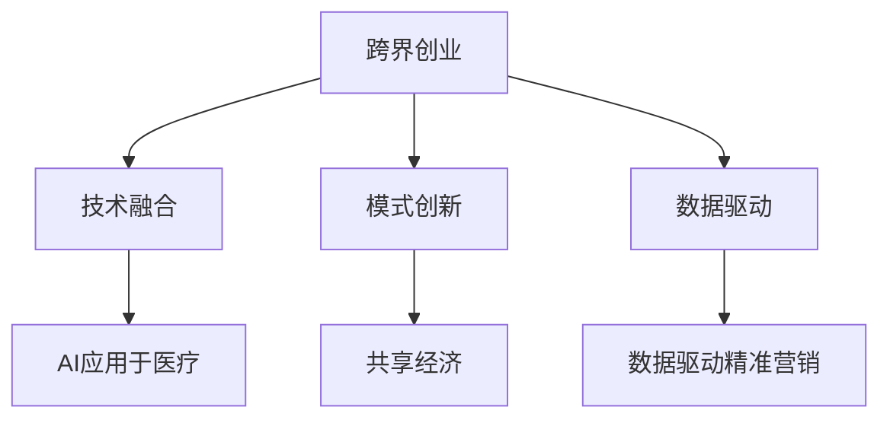

                 

# 跨界创业：打破行业界限的创新

## 1. 背景介绍

### 1.1 问题由来
在数字化时代，技术进步和市场需求的变化不断加速。各行各业都在探索新的增长点和创新模式，试图在竞争中脱颖而出。传统行业内的企业面临着转型升级的压力，而新兴领域的创业公司则寻求新的突破。跨界创业，即将技术和知识应用于不同领域，打破行业界限的创新，正成为推动行业变革的重要驱动力。

### 1.2 问题核心关键点
跨界创业的关键在于找到新的技术应用场景，结合行业需求，实现创新突破。这不仅要求创业团队具备跨领域的知识技能，还需要在市场洞察、业务模式创新、用户需求分析等方面具备敏锐的洞察力。在实际应用中，常用的跨界创业方式包括技术融合、模式创新、数据驱动等。

## 2. 核心概念与联系

### 2.1 核心概念概述

为了更好地理解跨界创业的创新模式，本节将介绍几个密切相关的核心概念：

- 跨界创业(Cross-Boundary Innovation)：指将一种行业的核心技术和理念应用于另一个领域的创业实践。这种模式通过技术、市场、业务模式等的融合，创造出新的产品和服务，打破了传统的行业界限。
- 技术融合(Technology Fusion)：指将不同领域的技术进行整合，形成互补，实现功能增强和应用拓展。如将AI技术应用于医疗、金融、教育等领域。
- 模式创新(Business Model Innovation)：指通过颠覆性思维，设计新的商业模式，改变行业运作方式。如共享经济、订阅经济、按需服务模式等。
- 数据驱动(Data-Driven)：指在决策和运营中充分利用大数据和AI技术，提升效率和精准度。数据驱动的企业能够快速响应市场变化，实现精准营销和个性化服务。

这些核心概念之间的逻辑关系可以通过以下Mermaid流程图来展示：



这个流程图展示了跨界创业的主要路径和关键环节：

1. 跨界创业依托技术融合，通过将不同领域的技术整合，增强产品功能。
2. 模式创新通过颠覆性思维，设计新的商业模式，改变行业运作方式。
3. 数据驱动利用大数据和AI技术，提升决策和运营的精准度。

这些概念共同构成了跨界创业的基础框架，帮助企业实现创新和突破。

## 3. 核心算法原理 & 具体操作步骤

### 3.1 算法原理概述

跨界创业的创新过程，本质上是一个跨领域的知识应用和模式创新的过程。其核心思想是：在特定行业的需求和特点的基础上，将来自其他行业的先进技术、理念和商业模式进行整合，形成全新的产品和服务。

### 3.2 算法步骤详解

跨界创业通常包括以下几个关键步骤：

**Step 1: 市场调研与需求分析**
- 对目标行业的市场现状、痛点问题、用户需求等进行全面调研，找出行业发展中的瓶颈。
- 分析现有技术解决方案的不足，寻找改进和创新的机会。

**Step 2: 技术与业务模式整合**
- 选择适合的跨界技术或业务模式，如AI、大数据、区块链等，评估其与目标行业的契合度。
- 设计创新的业务模式，如按需服务、订阅经济、共享经济等，满足目标用户的需求。

**Step 3: 原型开发与验证**
- 根据市场需求和技术整合方案，开发初步原型，并针对关键功能进行测试。
- 收集用户反馈，进行原型优化，形成初步的产品方案。

**Step 4: 商业化落地**
- 制定详细的商业计划，包括市场定位、推广策略、营收模式等。
- 组建团队，启动项目，逐步扩大市场份额，实现商业化运作。

### 3.3 算法优缺点

跨界创业的优点在于能够迅速利用现有技术和新模式，迅速进入新市场，快速迭代和优化产品。其缺点包括：

- 技术整合难度高：不同领域的技术标准、接口和规范不同，整合难度大。
- 跨领域理解挑战：跨界创业需要团队具备跨领域的知识和经验，较难找到合适的技术人才。
- 模式创新风险高：颠覆性模式往往面临较大的市场接受度风险，需要较强的市场预见和创新能力。
- 数据隐私和安全问题：跨界创业涉及大量数据共享，需要严格的数据隐私和安全保障措施。

尽管存在这些挑战，但跨界创业依然成为推动行业创新和发展的有力手段。

### 3.4 算法应用领域

跨界创业的创新模式已经广泛应用于多个领域，例如：

- 医疗健康：将AI技术应用于医学影像诊断、病历分析、个性化治疗等，提升医疗服务水平。
- 金融科技：将区块链、大数据技术应用于金融风险控制、反欺诈、智能投顾等，提升金融服务的效率和安全性。
- 零售电商：将AI、物联网技术应用于智能推荐、库存管理、智能客服等，提升用户体验和运营效率。
- 教育培训：将AI技术应用于个性化学习、智能评估、在线教育等，推动教育公平和质量提升。
- 智能制造：将物联网、自动化技术应用于智能工厂、智慧物流、设备维护等，提升制造业的自动化和智能化水平。

这些应用展示了跨界创业在推动行业创新和发展中的巨大潜力。

## 4. 数学模型和公式 & 详细讲解 & 举例说明

### 4.1 数学模型构建

跨界创业的数学模型构建主要基于市场需求和技术整合方案，以下是一些常见的模型构建方法：

- **用户需求模型**：通过调查问卷、用户访谈等方式，收集用户需求数据，构建用户需求模型。
- **技术能力模型**：评估现有技术和资源，构建技术能力模型，明确技术应用的范围和限制。
- **市场趋势模型**：分析市场趋势和竞争对手情况，构建市场趋势模型，预测市场变化。

### 4.2 公式推导过程

以AI应用于医疗影像诊断为例，以下是一些基本公式和推导过程：

**用户需求模型**：
- 收集用户反馈，构建用户需求模型：
  $$
  U = \{ x_1, x_2, ..., x_n \}
  $$
  其中 $x_i$ 为第 $i$ 个用户的反馈数据。

**技术能力模型**：
- 评估现有技术资源，构建技术能力模型：
  $$
  T = \{ y_1, y_2, ..., y_m \}
  $$
  其中 $y_i$ 为第 $i$ 项技术资源的能力参数。

**市场趋势模型**：
- 分析市场趋势和竞争对手情况，构建市场趋势模型：
  $$
  M = \{ z_1, z_2, ..., z_k \}
  $$
  其中 $z_i$ 为第 $i$ 个市场趋势的特征值。

### 4.3 案例分析与讲解

**案例：AI应用于智能制造**

- **市场需求分析**：
  - 收集制造业企业的需求数据，发现生产线效率低、设备故障率高、维护成本高等问题。
  - 用户需求模型为：$U = \{ 效率, 故障率, 维护成本 \}$。

- **技术整合方案**：
  - 选择物联网、自动化技术进行整合，构建智能工厂方案。
  - 技术能力模型为：$T = \{ 传感器精度, 自动化控制精度, 数据分析能力 \}$。

- **市场趋势模型**：
  - 分析市场趋势和竞争对手情况，发现智能制造领域竞争激烈，但市场潜力巨大。
  - 市场趋势模型为：$M = \{ 市场规模, 增长率, 技术更新速度 \}$。

## 5. 项目实践：代码实例和详细解释说明

### 5.1 开发环境搭建

在进行跨界创业的实践时，需要准备好开发环境。以下是使用Python进行Web开发的开发环境配置流程：

1. 安装Anaconda：从官网下载并安装Anaconda，用于创建独立的Python环境。

2. 创建并激活虚拟环境：
```bash
conda create -n web-dev python=3.8 
conda activate web-dev
```

3. 安装Web开发工具包：
```bash
pip install flask
```

4. 安装数据库：
```bash
pip install psycopg2
```

5. 安装前端框架：
```bash
pip install django
```

完成上述步骤后，即可在`web-dev`环境中开始跨界创业的Web开发实践。

### 5.2 源代码详细实现

以下是使用Django框架进行跨界创业Web开发的代码实现。

首先，定义模型的数据结构和视图：

```python
from django.db import models
from django.shortcuts import render
from django.http import HttpResponse

# 定义数据模型
class User(models.Model):
    name = models.CharField(max_length=100)
    age = models.IntegerField()

# 定义视图函数
def index(request):
    users = User.objects.all()
    return render(request, 'index.html', {'users': users})

def user_detail(request, user_id):
    user = User.objects.get(id=user_id)
    return render(request, 'user_detail.html', {'user': user})
```

然后，定义URL路由：

```python
from django.urls import path

urlpatterns = [
    path('', index, name='index'),
    path('user/<int:user_id>/', user_detail, name='user_detail'),
]
```

最后，启动Web服务并访问测试：

```python
from django.core.wsgi import get_wsgi_application
from django.http import HttpResponse

application = get_wsgi_application()

def index(request):
    users = User.objects.all()
    return HttpResponse(f"Hello, users are: {users}")

if __name__ == '__main__':
    application.run()
```

通过以上代码，我们实现了Web开发的基本功能，并在Django框架下，可以快速迭代和测试跨界创业的应用。

### 5.3 代码解读与分析

以下是关键代码的详细解读：

**models.py**：
- 定义数据模型，包含用户信息的基本属性。

**views.py**：
- 定义视图函数，分别处理首页和用户详情页面。
- 使用Django的ORM工具，从数据库中获取用户数据，并渲染到模板中。

**urls.py**：
- 定义URL路由，将视图函数与URL路径进行绑定。

**wsgi.py**：
- 启动Web服务，将视图函数暴露给HTTP请求。

以上代码展示了Django框架下跨界创业Web开发的基本流程，通过模板、视图、路由等组件，可以快速构建Web应用。

## 6. 实际应用场景

### 6.1 智能制造

智能制造是制造业领域跨界创业的热点方向之一。通过将物联网、自动化和AI技术应用到生产线，可以实现智能调度、设备维护、质量监控等功能，大幅提升生产效率和产品质量。

**案例：智能工厂**

- **市场需求分析**：
  - 收集制造业企业的需求数据，发现生产线效率低、设备故障率高、维护成本高等问题。
  - 用户需求模型为：$U = \{ 效率, 故障率, 维护成本 \}$。

- **技术整合方案**：
  - 选择物联网、自动化技术进行整合，构建智能工厂方案。
  - 技术能力模型为：$T = \{ 传感器精度, 自动化控制精度, 数据分析能力 \}$。

- **市场趋势模型**：
  - 分析市场趋势和竞争对手情况，发现智能制造领域竞争激烈，但市场潜力巨大。
  - 市场趋势模型为：$M = \{ 市场规模, 增长率, 技术更新速度 \}$。

**技术实现**：
- 使用物联网传感器收集设备运行数据。
- 通过数据分析，实现设备的智能调度和故障预测。
- 应用机器学习算法，实现质量监控和预测维护。

### 6.2 医疗健康

医疗健康领域的跨界创业，通过将AI技术应用于医学影像诊断、病历分析、个性化治疗等，提升医疗服务的水平和效率。

**案例：智能影像诊断**

- **市场需求分析**：
  - 收集医院和医生的需求数据，发现影像诊断速度慢、准确率低、数据管理复杂等问题。
  - 用户需求模型为：$U = \{ 诊断速度, 准确率, 数据管理 \}$。

- **技术整合方案**：
  - 选择AI技术进行整合，构建智能影像诊断系统。
  - 技术能力模型为：$T = \{ 算法精度, 模型训练数据量, 硬件计算能力 \}$。

- **市场趋势模型**：
  - 分析市场趋势和竞争对手情况，发现医疗影像诊断领域需求巨大，但市场竞争激烈。
  - 市场趋势模型为：$M = \{ 市场规模, 增长率, 技术更新速度 \}$。

**技术实现**：
- 使用深度学习算法，训练医学影像分类和识别模型。
- 集成多模态数据，包括CT、MRI、超声等，提升诊断准确率。
- 实现数据管理平台，方便医生访问和共享影像数据。

### 6.3 金融科技

金融科技领域的跨界创业，通过将区块链、大数据技术应用于金融风险控制、反欺诈、智能投顾等，提升金融服务的效率和安全性。

**案例：智能投顾**

- **市场需求分析**：
  - 收集金融机构的客户需求数据，发现个性化投资顾问服务稀缺、投资决策依赖经验等问题。
  - 用户需求模型为：$U = \{ 个性化服务, 投资建议, 风险控制 \}$。

- **技术整合方案**：
  - 选择大数据、AI技术进行整合，构建智能投顾系统。
  - 技术能力模型为：$T = \{ 数据处理能力, 算法复杂度, 安全保障能力 \}$。

- **市场趋势模型**：
  - 分析市场趋势和竞争对手情况，发现金融科技领域需求巨大，但市场竞争激烈。
  - 市场趋势模型为：$M = \{ 市场规模, 增长率, 技术更新速度 \}$。

**技术实现**：
- 使用机器学习算法，分析客户历史投资数据，提供个性化投资建议。
- 应用区块链技术，确保投资数据和交易的安全性。
- 实现智能投顾平台，提供24小时投资咨询服务。

## 7. 工具和资源推荐

### 7.1 学习资源推荐

为了帮助创业团队系统掌握跨界创业的技术和方法，这里推荐一些优质的学习资源：

1. **《创新驱动发展战略纲要》**：由国务院发布，指导我国创新驱动发展的政策文件，涵盖了技术、产业、人才等多方面的创新路径。
2. **《未来简史》**：由尤瓦尔·赫拉利所著，探讨了技术进步、人工智能和人类未来等话题，为跨界创业提供了广阔的视野。
3. **Coursera《创业成功：从0到1》**：斯坦福大学开设的在线课程，讲解了创业的各个环节，涵盖市场调研、产品开发、商业模式等。
4. **《创业维艰》**：由彼得·蒂尔所著，记录了Y Combinator孵化的创业公司经历，提供了宝贵的创业经验。
5. **MBA《创新管理》**：商学院的课程，讲解了创新管理的理论和实践，帮助创业团队提升管理能力。

通过对这些资源的学习实践，相信你一定能够快速掌握跨界创业的精髓，并用于解决实际的创新问题。

### 7.2 开发工具推荐

高效的开发离不开优秀的工具支持。以下是几款用于跨界创业开发的常用工具：

1. **Jupyter Notebook**：一个开源的Web应用程序，支持交互式代码编写和数据可视化，适合快速迭代研究。

2. **PyCharm**：一款功能强大的Python IDE，支持代码高亮、自动补全、调试等功能，适合高效开发。

3. **Visual Studio Code**：一款轻量级的代码编辑器，支持多种编程语言和插件，适合跨平台开发。

4. **Git**：一个版本控制系统，支持代码管理、协作开发、代码审查等功能，适合团队开发。

5. **Kaggle**：一个数据科学竞赛平台，提供了丰富的数据集和算法模型，适合数据驱动的创新。

6. **Angular/React/Vue**：流行的前端框架，支持高效构建Web应用，适合跨界创业的展示和交互。

合理利用这些工具，可以显著提升跨界创业的开发效率，加快创新迭代的步伐。

### 7.3 相关论文推荐

跨界创业的创新模式已经吸引了众多学者的关注。以下是几篇奠基性的相关论文，推荐阅读：

1. **《跨界创新：打破行业界限的新路径》**：探讨了跨界创新的基本原理和成功案例，提出了创新的关键要素。
2. **《技术融合与业务创新：跨界创业的新方向》**：分析了技术融合与业务模式创新的关系，提出了创新的实现路径。
3. **《数据驱动的跨界创业》**：研究了数据在跨界创业中的作用，提出了数据驱动的创新方法。
4. **《颠覆性创新与持续创新：跨界创业的双重路径》**：讨论了颠覆性创新和持续创新在跨界创业中的应用，提出了创新组合策略。

这些论文代表了大跨界创业的研究进展，为跨界创业提供了理论指导和方法借鉴。

## 8. 总结：未来发展趋势与挑战

### 8.1 总结

本文对跨界创业的创新模式进行了全面系统的介绍。首先阐述了跨界创业的背景和核心关键点，明确了技术整合、业务模式创新和数据驱动等关键要素。其次，从原理到实践，详细讲解了跨界创业的数学模型和具体操作步骤，给出了Web开发等实践案例。同时，本文还广泛探讨了跨界创业在智能制造、医疗健康、金融科技等多个领域的应用前景，展示了跨界创业的巨大潜力。此外，本文精选了跨界创业的技术学习资源，力求为读者提供全方位的技术指引。

通过本文的系统梳理，可以看到，跨界创业在推动行业创新和发展中的重要地位。借助技术和知识的力量，企业能够打破行业界限，创造新的商业机会和价值。未来，伴随技术的发展和应用场景的拓展，跨界创业必将在更多领域大放异彩，成为驱动行业变革的重要动力。

### 8.2 未来发展趋势

展望未来，跨界创业的创新模式将呈现以下几个发展趋势：

1. **技术融合加速**：随着技术进步和跨界需求的增加，技术融合的速度将进一步加快。越来越多的先进技术将被应用于不同领域，形成互补和协同效应。

2. **模式创新多样化**：随着市场的不断变化和竞争的加剧，颠覆性模式和持续创新将并存，推动跨界创业不断突破现有框架。

3. **数据驱动深入**：数据驱动将成为跨界创业的核心驱动力，通过大数据和AI技术，实现更精准的市场预测和业务决策。

4. **跨界合作增强**：跨界创业需要更多跨领域的合作，以整合资源和能力，提升创新效率和成功率。

5. **全球化布局**：跨界创业的创新模式将跨越地域限制，全球范围内的合作和竞争将加速行业变革。

6. **伦理和社会责任**：跨界创业不仅追求商业价值，还需要关注伦理和社会责任，确保技术应用的正当性和可持续性。

以上趋势凸显了跨界创业的广阔前景。这些方向的探索发展，必将进一步推动跨界创业的成熟和应用，为行业带来更深刻的变革。

### 8.3 面临的挑战

尽管跨界创业在推动行业创新中展现了巨大潜力，但仍面临诸多挑战：

1. **技术整合难度高**：不同领域的标准和接口不同，技术整合难度大，需要跨领域的专家和经验。

2. **模式创新风险高**：颠覆性模式面临较高的市场接受度风险，需要较强的市场预见和创新能力。

3. **数据隐私和安全问题**：跨界创业涉及大量数据共享，需要严格的数据隐私和安全保障措施。

4. **市场接受度不确定**：新模式和新产品面临较高的市场接受度风险，需要详细的市场调研和用户测试。

5. **资源配置复杂**：跨界创业需要整合多种资源，包括技术、资金、人才等，资源配置复杂。

6. **用户需求难以把握**：跨界创业需要精准把握用户需求，避免陷入产品同质化的陷阱。

正视跨界创业面临的这些挑战，积极应对并寻求突破，将是大跨界创业走向成熟的必由之路。相信随着学界和产业界的共同努力，这些挑战终将一一被克服，跨界创业必将在构建人机协同的智能时代中扮演越来越重要的角色。

### 8.4 研究展望

面对跨界创业所面临的挑战，未来的研究需要在以下几个方面寻求新的突破：

1. **技术融合新范式**：探索更加灵活、高效的技术融合范式，提升技术整合的成功率。

2. **模式创新新理论**：研究新的颠覆性模式和持续创新理论，为跨界创业提供更多的创新路径。

3. **数据驱动新方法**：开发更加高效、精准的数据驱动方法，提升数据驱动的决策和预测能力。

4. **跨界合作新机制**：研究跨界合作的机制和平台，促进跨领域资源的整合和共享。

5. **伦理和社会责任新框架**：建立跨界创业的伦理和社会责任框架，确保技术应用的正当性和可持续性。

6. **用户需求新模型**：构建更加全面、精准的用户需求模型，提升跨界创业的精准度和成功率。

这些研究方向的探索，必将引领跨界创业技术迈向更高的台阶，为构建安全、可靠、可解释、可控的智能系统铺平道路。面向未来，跨界创业技术还需要与其他人工智能技术进行更深入的融合，如知识表示、因果推理、强化学习等，多路径协同发力，共同推动自然语言理解和智能交互系统的进步。只有勇于创新、敢于突破，才能不断拓展跨界创业的边界，让智能技术更好地造福人类社会。

## 9. 附录：常见问题与解答

**Q1：跨界创业如何找到合适的技术应用场景？**

A: 跨界创业的关键在于找到新的技术应用场景。以下是一些建议：
1. 深入了解目标行业的需求和痛点。
2. 分析现有技术解决方案的不足，寻找改进和创新的机会。
3. 参考相关案例和研究，了解技术在类似场景中的应用效果。
4. 进行市场调研和用户访谈，获取真实需求和反馈。

**Q2：跨界创业面临的最大挑战是什么？**

A: 跨界创业面临的最大挑战主要包括：
1. 技术整合难度高，需要跨领域的专家和经验。
2. 模式创新风险高，需要较强的市场预见和创新能力。
3. 数据隐私和安全问题，需要严格的数据隐私和安全保障措施。
4. 市场接受度不确定，需要详细的市场调研和用户测试。
5. 资源配置复杂，需要整合多种资源，包括技术、资金、人才等。
6. 用户需求难以把握，需要精准把握用户需求，避免陷入产品同质化的陷阱。

**Q3：如何提升跨界创业的成功率？**

A: 提升跨界创业的成功率需要从多个方面进行优化：
1. 深入了解目标行业的需求和痛点，找到合适的技术应用场景。
2. 进行详细的市场调研和用户访谈，获取真实需求和反馈。
3. 开发灵活、高效的技术整合方案，提升技术整合的成功率。
4. 设计创新的业务模式，提高市场接受度。
5. 强化团队的多学科背景，提升跨界能力。
6. 持续关注技术发展趋势，及时调整创新策略。

通过系统化的分析和实践，跨界创业的成功率将大幅提升。

---

作者：禅与计算机程序设计艺术 / Zen and the Art of Computer Programming

