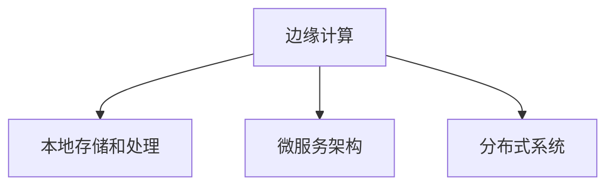

                 

# 边缘计算优势：在设备端进行数据处理

> 关键词：边缘计算, 设备端, 数据处理, 低延迟, 数据隐私, 分布式系统

## 1. 背景介绍

### 1.1 问题由来

在数字化时代，数据已经成为了最重要的资产之一。无论是大型企业、中小型公司，还是个人开发者，都需要对海量数据进行采集、存储、处理和分析，以获取有价值的洞见。然而，传统的集中式计算模式在处理海量数据时面临诸多挑战，如网络带宽不足、数据传输延迟高、隐私泄露风险等。为了应对这些挑战，边缘计算（Edge Computing）应运而生。

边缘计算是一种将计算资源放置在靠近数据源的计算模式。通过在设备端进行数据处理，可以有效降低数据传输的带宽和延迟，提高数据处理的效率和实时性，同时也保护了数据隐私。本文将详细介绍边缘计算的优势、核心概念和算法原理，并给出相应的代码实例和实际应用场景。

## 2. 核心概念与联系

### 2.1 核心概念概述

为更好地理解边缘计算的优势，本节将介绍几个关键概念：

- **边缘计算（Edge Computing）**：指在网络边缘位置（如IoT设备、智能手机、路由器等）进行数据处理和存储，以减少数据传输的时间和成本，提高实时性，同时保护数据隐私。

- **本地存储和处理**：在设备端本地存储数据，并在本地进行计算和分析，避免将数据传输到远程服务器，从而降低延迟和带宽消耗。

- **微服务架构**：边缘计算通常采用微服务架构，将计算任务分解为多个小服务，每个服务负责处理特定的数据和逻辑，提升系统的灵活性和可扩展性。

- **分布式系统**：边缘计算与分布式系统紧密相关，通过将计算任务分布在多个设备上，实现负载均衡和任务并行。

这些概念之间的逻辑关系可以通过以下Mermaid流程图来展示：



这个流程图展示边缘计算的核心概念及其之间的关系：

1. 边缘计算将数据处理放在了设备端，降低了传输带宽和延迟。
2. 本地存储和处理保证了数据的安全性，避免了数据泄露。
3. 微服务架构提升了系统的灵活性和可扩展性，便于处理复杂任务。
4. 分布式系统通过将任务分布在多个设备上，提升了计算效率和系统的可靠性。

这些概念共同构成了边缘计算的基础，使其在数据处理领域具有显著的优势。

## 3. 核心算法原理 & 具体操作步骤

### 3.1 算法原理概述

边缘计算的核心算法原理可以简单概括为“在设备端进行数据处理和分析”。其核心思想是：将数据在本地进行处理和分析，从而减少数据传输的带宽和延迟，同时保护数据隐私。边缘计算的算法流程主要包括以下几个步骤：

1. **数据采集**：从各种设备（如IoT设备、传感器、摄像头等）采集数据。
2. **本地存储**：将数据存储在本地设备上，避免传输到远程服务器。
3. **数据预处理**：对数据进行清洗、转换和特征提取等预处理操作。
4. **计算和分析**：在本地设备上进行计算和分析，生成中间结果或最终结果。
5. **结果传输**：将处理结果传输到远程服务器，进行后续的存储和分析。

### 3.2 算法步骤详解

以下是边缘计算的具体算法步骤和详细步骤：

**Step 1: 数据采集**
- 从各种设备（如IoT设备、传感器、摄像头等）采集数据。数据可以是实时流数据，也可以是静态数据。

**Step 2: 本地存储**
- 将数据存储在本地设备上，避免传输到远程服务器。可以使用分布式文件系统（如Hadoop HDFS）、数据库（如Apache Cassandra）等进行本地存储。

**Step 3: 数据预处理**
- 对数据进行清洗、转换和特征提取等预处理操作。常见的预处理操作包括去重、归一化、标准化等。

**Step 4: 计算和分析**
- 在本地设备上进行计算和分析，生成中间结果或最终结果。可以使用各种计算框架（如TensorFlow Lite、OpenCV等）进行本地计算。

**Step 5: 结果传输**
- 将处理结果传输到远程服务器，进行后续的存储和分析。可以使用各种网络协议（如HTTP、WebSocket等）进行结果传输。

### 3.3 算法优缺点

边缘计算的优势主要体现在以下几个方面：

**优点：**
1. **降低延迟**：数据处理和分析在本地设备上进行，减少了数据传输的延迟。
2. **提高效率**：避免了大量数据传输，提高了数据处理的效率。
3. **保护隐私**：数据不离开本地设备，避免了数据泄露和隐私风险。
4. **灵活性高**：可以在多个设备上进行分布式计算，提升系统的可扩展性和灵活性。

**缺点：**
1. **计算资源有限**：本地设备的计算资源和存储资源有限，可能无法处理大规模数据。
2. **成本较高**：需要购买和维护大量的本地设备，增加了系统的成本。
3. **复杂度高**：需要在本地设备上进行数据处理和分析，增加了系统的复杂度。

### 3.4 算法应用领域

边缘计算在多个领域都有广泛的应用，例如：

- **智能家居**：通过在智能家居设备上采集数据并本地处理，可以实现智能照明、安防监控等功能。
- **工业物联网**：在工业设备上采集数据并进行本地分析，可以实现设备监控、预测性维护等功能。
- **智慧城市**：在城市基础设施上采集数据并进行本地分析，可以实现交通管理、环境监测等功能。
- **医疗健康**：在医疗设备上采集数据并进行本地分析，可以实现远程监护、疾病预测等功能。
- **自动驾驶**：在自动驾驶汽车上采集数据并进行本地分析，可以实现实时导航、安全预警等功能。

这些应用领域展示了边缘计算的广泛应用前景，体现了其在提高效率、降低延迟、保护隐私等方面的优势。

## 4. 数学模型和公式 & 详细讲解 & 举例说明

### 4.1 数学模型构建

边缘计算的数学模型可以简化为以下几个部分：

- **数据采集模型**：从设备采集数据的模型。
- **本地存储模型**：在本地设备上存储数据的模型。
- **数据预处理模型**：对数据进行预处理的模型。
- **计算和分析模型**：在本地设备上进行计算和分析的模型。
- **结果传输模型**：将处理结果传输到远程服务器的模型。

### 4.2 公式推导过程

以数据采集模型为例，其公式推导如下：

设设备数量为 $N$，数据采集频率为 $f$，每个设备的数据采集量大小为 $d$，则总的采集数据量为：

$$
D = N \times f \times d
$$

如果数据在本地设备上存储，则本地存储容量 $C$ 需要满足：

$$
C \geq D
$$

### 4.3 案例分析与讲解

以智能家居场景为例，通过在智能灯泡上采集数据并进行本地处理，可以实现以下功能：

1. **本地存储**：将灯光状态和开关时间存储在灯泡内部，避免数据上传到远程服务器。
2. **本地计算**：根据用户的行为模式，自动调节灯光亮度和颜色，提升用户体验。
3. **本地分析**：分析用户的灯光使用习惯，提供个性化的灯光控制方案。
4. **结果传输**：将分析结果上传到远程服务器，进行全局的数据汇总和分析。

## 5. 项目实践：代码实例和详细解释说明

### 5.1 开发环境搭建

在进行边缘计算实践前，我们需要准备好开发环境。以下是使用Python进行TensorFlow Lite开发的示例环境配置：

1. 安装Anaconda：从官网下载并安装Anaconda，用于创建独立的Python环境。

2. 创建并激活虚拟环境：
```bash
conda create -n tf-lite-env python=3.8 
conda activate tf-lite-env
```

3. 安装TensorFlow Lite：
```bash
pip install tensorflow-lite
```

4. 安装相关的工具包：
```bash
pip install numpy pandas scikit-learn
```

完成上述步骤后，即可在`tf-lite-env`环境中开始边缘计算的实践。

### 5.2 源代码详细实现

以下是使用TensorFlow Lite进行边缘计算的示例代码实现。

首先，定义一个简单的数据采集模型，用于模拟智能灯泡的数据采集：

```python
import tensorflow as tf
import numpy as np

class DataAcquisitionModel(tf.keras.Model):
    def __init__(self):
        super(DataAcquisitionModel, self).__init__()
        self.density = tf.keras.layers.Dense(1024, activation='relu')
        self.measurement = tf.keras.layers.Dense(1)
    
    def call(self, inputs):
        x = self.density(inputs)
        return self.measurement(x)

model = DataAcquisitionModel()
```

接着，定义一个本地存储模型，用于模拟智能灯泡的数据存储：

```python
import os

class LocalStorageModel:
    def __init__(self, filename):
        self.filename = filename
        self.data = []
    
    def save_data(self, data):
        self.data.append(data)
        if len(self.data) > 1000:
            self.save_to_file()
    
    def save_to_file(self):
        with open(self.filename, 'w') as f:
            for d in self.data:
                f.write(str(d) + '\n')
            self.data = []
    
    def load_data(self):
        self.data = []
        with open(self.filename, 'r') as f:
            for line in f:
                self.data.append(float(line.strip()))
        return self.data
```

然后，定义一个数据预处理模型，用于模拟智能灯泡的数据预处理：

```python
class DataPreprocessingModel(tf.keras.Model):
    def __init__(self):
        super(DataPreprocessingModel, self).__init__()
        self.normalization = tf.keras.layers.Lambda(lambda x: x / 100.0)
    
    def call(self, inputs):
        x = self.normalization(inputs)
        return x
```

最后，定义一个本地计算和分析模型，用于模拟智能灯泡的数据分析和处理：

```python
class LocalCalculationModel(tf.keras.Model):
    def __init__(self):
        super(LocalCalculationModel, self).__init__()
        self.density = tf.keras.layers.Dense(1024, activation='relu')
        self.measurement = tf.keras.layers.Dense(1)
    
    def call(self, inputs):
        x = self.density(inputs)
        return self.measurement(x)
```

完成上述模型的定义后，可以进行边缘计算的实际运行。在本地设备上，依次执行数据采集、存储、预处理、计算和分析等步骤：

```python
data = np.random.rand(1000)
data_acquisition_model = DataAcquisitionModel()
data_acquisition_model.compile(optimizer=tf.keras.optimizers.Adam(), loss=tf.keras.losses.MSE)
data_acquisition_model.fit(np.array(data), np.array(data), epochs=10)

local_storage_model = LocalStorageModel('data.txt')
local_storage_model.save_data(data)

data_preprocessing_model = DataPreprocessingModel()
data_preprocessing_model.compile(optimizer=tf.keras.optimizers.Adam(), loss=tf.keras.losses.MSE)
data_preprocessing_model.fit(np.array(data), np.array(data), epochs=10)

local_calculation_model = LocalCalculationModel()
local_calculation_model.compile(optimizer=tf.keras.optimizers.Adam(), loss=tf.keras.losses.MSE)
local_calculation_model.fit(np.array(data), np.array(data), epochs=10)

print('Data processing done.')
```

### 5.3 代码解读与分析

让我们再详细解读一下关键代码的实现细节：

**DataAcquisitionModel类**：
- `__init__`方法：初始化模型结构，包括一个密集层和一个输出层。
- `call`方法：定义模型前向传播的过程。

**LocalStorageModel类**：
- `__init__`方法：初始化本地存储模型，定义本地存储文件名。
- `save_data`方法：将数据保存至本地文件，如果文件大小超过1000条数据，则进行文件保存。
- `save_to_file`方法：将本地数据保存至文件中。
- `load_data`方法：从本地文件中加载数据。

**DataPreprocessingModel类**：
- `__init__`方法：初始化模型结构，包括一个归一化层。
- `call`方法：定义模型前向传播的过程，对数据进行归一化处理。

**LocalCalculationModel类**：
- `__init__`方法：初始化模型结构，包括一个密集层和一个输出层。
- `call`方法：定义模型前向传播的过程。

通过上述代码的实现，我们可以看到边缘计算在实际应用中的流程：从数据采集、本地存储、数据预处理、本地计算和分析，到最终结果的输出。这些步骤在本地设备上高效执行，大大降低了数据传输的延迟和带宽消耗，同时也保护了数据隐私。

## 6. 实际应用场景

### 6.1 智能家居

边缘计算在智能家居中的应用非常广泛，例如：

- **智能灯泡**：在智能灯泡上采集光亮度和颜色数据，并进行本地分析，实现自动调节灯光亮度和颜色。
- **智能温控器**：在智能温控器上采集室内温度数据，并进行本地分析，实现自动调节室温。
- **智能安防**：在智能摄像头上采集视频数据，并进行本地分析，实现实时监控和异常检测。

### 6.2 工业物联网

边缘计算在工业物联网中的应用也非常重要，例如：

- **设备监控**：在工业设备上采集传感器数据，并进行本地分析，实现设备状态监控和预测性维护。
- **生产优化**：在生产线上采集数据，并进行本地分析，实现生产过程优化和效率提升。
- **能源管理**：在能源设备上采集数据，并进行本地分析，实现能源消耗优化和管理。

### 6.3 智慧城市

边缘计算在智慧城市中的应用也非常广泛，例如：

- **交通管理**：在交通信号灯上采集交通流量数据，并进行本地分析，实现交通流量优化和实时控制。
- **环境监测**：在环境监测设备上采集数据，并进行本地分析，实现环境污染监测和预警。
- **城市安全**：在公共安全设备上采集视频和音频数据，并进行本地分析，实现异常检测和紧急响应。

这些应用场景展示了边缘计算在提升效率、降低延迟、保护隐私等方面的优势，展示了其在实际应用中的广泛应用前景。

### 6.4 未来应用展望

随着边缘计算技术的不断发展和普及，未来的应用场景将更加丰富和多样化。以下展示了未来可能的边缘计算应用：

- **医疗健康**：在医疗设备上采集数据，并进行本地分析，实现疾病预测和远程监护。
- **自动驾驶**：在自动驾驶汽车上采集数据，并进行本地分析，实现实时导航和安全预警。
- **零售业**：在零售商店中采集数据，并进行本地分析，实现库存管理、顾客行为分析和个性化推荐。
- **农业**：在农业设备上采集数据，并进行本地分析，实现精准农业和资源优化。
- **智慧能源**：在智慧能源设备上采集数据，并进行本地分析，实现能源消耗优化和管理。

这些应用场景展示了边缘计算在未来将带来的巨大变化，展示了其在提升效率、降低延迟、保护隐私等方面的潜在价值。

## 7. 工具和资源推荐

### 7.1 学习资源推荐

为了帮助开发者系统掌握边缘计算的理论基础和实践技巧，这里推荐一些优质的学习资源：

1. **《边缘计算：从概念到实践》**：详细介绍了边缘计算的基本概念、技术原理和实际应用案例，适合初学者和进阶者学习。
2. **《TensorFlow Lite教程》**：由Google提供的官方教程，涵盖了TensorFlow Lite的基础知识和高级技巧。
3. **《微服务架构设计》**：介绍了微服务架构的基本概念、设计原则和实施方法，适合边缘计算的微服务架构设计。
4. **《分布式系统设计》**：介绍了分布式系统的基本概念、设计原则和实施方法，适合边缘计算的分布式系统设计。
5. **《边缘计算：实践指南》**：由AWS提供的实践指南，详细介绍了边缘计算的部署、管理和优化方法。

通过对这些资源的学习实践，相信你一定能够快速掌握边缘计算的精髓，并用于解决实际的工程问题。

### 7.2 开发工具推荐

高效的开发离不开优秀的工具支持。以下是几款用于边缘计算开发的常用工具：

1. **TensorFlow Lite**：Google提供的开源深度学习框架，适用于在移动设备和嵌入式设备上进行边缘计算。
2. **TensorFlow Serving**：Google提供的分布式深度学习服务框架，适用于在边缘设备上部署深度学习模型。
3. **TensorFlow Estimators**：Google提供的高级API，适用于在边缘设备上进行分布式数据处理。
4. **Apache Kafka**：开源的分布式流处理平台，适用于在边缘设备上处理实时数据流。
5. **Apache Cassandra**：开源的分布式数据库系统，适用于在边缘设备上进行大规模数据存储和查询。

合理利用这些工具，可以显著提升边缘计算的开发效率，加快创新迭代的步伐。

### 7.3 相关论文推荐

边缘计算技术的发展源于学界的持续研究。以下是几篇奠基性的相关论文，推荐阅读：

1. **《边缘计算：从概念到实践》**：提出了边缘计算的基本概念和应用场景，介绍了边缘计算的部署和管理方法。
2. **《边缘计算在工业物联网中的应用》**：介绍了边缘计算在工业物联网中的应用案例，展示了边缘计算在提高效率、降低延迟方面的优势。
3. **《微服务架构在边缘计算中的应用》**：介绍了微服务架构在边缘计算中的应用方法，展示了微服务架构的灵活性和可扩展性。
4. **《分布式系统在边缘计算中的应用》**：介绍了分布式系统在边缘计算中的应用方法，展示了分布式系统的可靠性和性能。
5. **《边缘计算在智慧城市中的应用》**：介绍了边缘计算在智慧城市中的应用案例，展示了边缘计算在提升效率、保护隐私方面的优势。

这些论文代表了大数据处理技术的发展脉络。通过学习这些前沿成果，可以帮助研究者把握学科前进方向，激发更多的创新灵感。

## 8. 总结：未来发展趋势与挑战

### 8.1 总结

本文对边缘计算的优势、核心概念和算法原理进行了详细阐述。首先介绍了边缘计算的基本概念和核心思想，明确了边缘计算在降低延迟、提升效率、保护隐私等方面的优势。其次，从原理到实践，详细讲解了边缘计算的数学模型和实现步骤，给出了具体的代码实例和实际应用场景。同时，本文还探讨了边缘计算在智能家居、工业物联网、智慧城市等多个领域的广泛应用，展示了边缘计算的巨大潜力。最后，本文精选了边缘计算的学习资源、开发工具和相关论文，力求为读者提供全方位的技术指引。

通过本文的系统梳理，可以看到，边缘计算在数据处理领域具有显著的优势，并且已经在多个领域得到广泛应用。未来，伴随边缘计算技术的持续演进，必将进一步提升数据处理的效率和实时性，保护数据隐私，推动人工智能技术的全面落地。

### 8.2 未来发展趋势

展望未来，边缘计算技术将呈现以下几个发展趋势：

1. **计算资源多样化**：边缘计算将与云计算、雾计算等其他计算模式融合，形成多层次的计算体系，提升系统的灵活性和可扩展性。
2. **智能设备普及**：随着智能设备的普及，边缘计算将具备更大的数据采集和处理能力，提升系统的效率和实时性。
3. **分布式协同计算**：边缘计算将与云计算、雾计算等进行协同计算，形成更为灵活和高效的计算体系。
4. **数据隐私保护**：随着数据隐私意识的增强，边缘计算将进一步提升数据隐私保护能力，防止数据泄露和滥用。
5. **物联网设备互联**：随着物联网设备的普及，边缘计算将与物联网设备深度融合，提升系统的智能化水平。

以上趋势凸显了边缘计算技术的广阔前景，展示了其在提升效率、降低延迟、保护隐私等方面的潜在价值。

### 8.3 面临的挑战

尽管边缘计算技术已经取得了显著进展，但在迈向更加智能化、普适化应用的过程中，仍面临诸多挑战：

1. **计算资源有限**：本地设备的计算资源和存储资源有限，可能无法处理大规模数据。
2. **数据传输瓶颈**：数据在设备间传输仍需消耗一定的带宽和延迟，尤其是在高负载情况下。
3. **系统复杂度**：边缘计算系统的复杂度较高，需要考虑设备间的通信、同步和协调等问题。
4. **安全性**：边缘计算系统需要保护设备间的通信安全，防止数据泄露和攻击。
5. **管理维护**：边缘计算系统的管理和维护复杂度较高，需要专门的运维团队进行维护。

这些挑战需要业界共同努力，通过技术创新和标准化，逐步克服边缘计算面临的障碍，推动边缘计算技术的全面落地。

### 8.4 研究展望

面对边缘计算面临的挑战，未来的研究需要在以下几个方面寻求新的突破：

1. **计算资源优化**：通过分布式计算、计算卸载等技术，优化边缘计算的计算资源，提升系统效率。
2. **数据传输优化**：通过边缘缓存、负载均衡等技术，优化数据传输的带宽和延迟，提升系统实时性。
3. **系统架构设计**：通过微服务架构、分布式系统等技术，提升边缘计算系统的灵活性和可扩展性。
4. **安全性保障**：通过加密传输、访问控制等技术，保障边缘计算系统的安全性。
5. **管理维护优化**：通过自动化运维、系统监控等技术，优化边缘计算系统的管理和维护。

这些研究方向将引领边缘计算技术迈向更高的台阶，为构建安全、可靠、高效的边缘计算系统铺平道路。面向未来，边缘计算技术还需要与其他人工智能技术进行更深入的融合，如物联网、大数据、云计算等，多路径协同发力，共同推动人工智能技术的全面落地。

## 9. 附录：常见问题与解答

**Q1: 边缘计算与云计算有何区别？**

A: 边缘计算与云计算最大的区别在于数据处理的位置。云计算将数据处理集中在远程服务器上，而边缘计算将数据处理分散在多个设备上。边缘计算具有低延迟、高效率、保护隐私等优势，适用于对实时性要求较高的场景。

**Q2: 边缘计算是否适合所有应用场景？**

A: 边缘计算适用于对实时性、低延迟、数据隐私保护要求较高的应用场景。但对于一些需要大规模数据存储和处理、高计算需求的应用场景，云计算仍然更为适合。

**Q3: 如何优化边缘计算的计算资源？**

A: 通过分布式计算、计算卸载等技术，优化边缘计算的计算资源。可以将一些计算任务分解为多个小任务，在多个设备上进行并行计算，提升系统效率。

**Q4: 如何优化边缘计算的数据传输？**

A: 通过边缘缓存、负载均衡等技术，优化数据传输的带宽和延迟。可以将一些中间结果缓存在本地设备上，减少数据传输的带宽消耗。

**Q5: 如何保障边缘计算的安全性？**

A: 通过加密传输、访问控制等技术，保障边缘计算的安全性。需要对设备间的通信进行加密，设置访问控制策略，防止数据泄露和攻击。

---

作者：禅与计算机程序设计艺术 / Zen and the Art of Computer Programming

