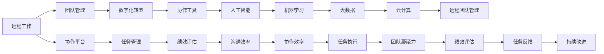

                 

# 远程团队管理：数字时代的新型领导力

> 关键词：远程工作,团队管理,新型领导力,数字化转型,协作工具,人工智能,机器学习,大数据,云计算

## 1. 背景介绍

### 1.1 问题由来
随着全球化的发展和技术进步，远程团队管理已成为数字时代企业运营的重要组成部分。新冠疫情的爆发更是加速了这一趋势，使得远程工作成为企业不得不选择的一种工作模式。然而，传统的面对面管理方式在远程团队中面临诸多挑战，如沟通效率低下、信息不对称、团队协作困难等。如何应对这些挑战，构建高效、协作的远程团队，成为企业领导者和管理者亟需解决的课题。

### 1.2 问题核心关键点
远程团队管理的关键在于：
1. **沟通效率**：如何保证远程团队成员之间的有效沟通，避免信息丢失和误解。
2. **协作效率**：如何在没有直接面对面的情况下，保持团队的协同工作能力。
3. **团队凝聚力**：如何增强远程团队的凝聚力和归属感，提升团队成员的工作积极性和忠诚度。
4. **任务执行**：如何有效分配任务，确保团队成员按时完成任务，并提高任务完成质量。
5. **绩效评估**：如何客观、公正地评估远程团队成员的绩效，激励他们的工作积极性。

### 1.3 问题研究意义
有效管理远程团队，不仅能够提升企业的生产效率和创新能力，还能在竞争激烈的数字化时代中保持企业的竞争力。

1. **提升效率**：远程工作使得员工不受时间和地点限制，能够更灵活地安排工作时间，从而提升整体工作效率。
2. **降低成本**：远程工作减少了办公空间、通勤费用等直接成本，同时减少了员工流失率，降低了间接成本。
3. **吸引人才**：远程工作为更多员工提供了灵活的工作环境，有助于吸引和留住高素质人才。
4. **促进创新**：远程工作鼓励员工自由思考和创新，有助于企业保持创新活力。
5. **增强企业韧性**：在突发事件如疫情、自然灾害等情况下，远程工作模式能够保证企业业务的连续性和稳定性。

## 2. 核心概念与联系

### 2.1 核心概念概述

为了更好地理解远程团队管理的方法和策略，本节将介绍几个关键概念及其联系：

- **远程工作**：员工不定期或不定期在办公室外工作的方式，主要依托互联网、通信工具等技术支持。
- **团队管理**：对团队成员进行规划、组织、指挥、协调和控制，以实现团队目标的过程。
- **数字化转型**：利用信息技术手段，对企业的业务流程、组织结构、管理模式进行全面改造和升级，以提升企业竞争力。
- **协作工具**：支持远程团队成员之间沟通、协作的各类工具，如即时通讯、在线会议、协作平台等。
- **人工智能**：通过模拟人类智能行为，实现任务自动化、数据分析、决策支持等功能。
- **机器学习**：利用数据训练模型，使机器具备预测、分类、聚类等智能能力，应用于团队管理和数据分析。
- **大数据**：利用先进的数据存储、处理和分析技术，从海量数据中挖掘有价值的信息，支持决策和预测。
- **云计算**：基于互联网的计算服务，提供弹性、高效、按需的计算资源，支持远程团队的数据处理和协作。

这些核心概念之间的逻辑关系可以通过以下Mermaid流程图来展示：



这个流程图展示的核心概念及其联系：

1. 远程工作依赖协作工具和平台，进行任务管理和协作。
2. 协作工具和平台利用人工智能、机器学习和大数据技术，提高团队管理和数据分析能力。
3. 云计算提供弹性计算资源，支持远程团队的数据处理和协作。
4. 数字化转型改变企业的业务流程和管理模式，提升远程团队的运营效率和灵活性。
5. 团队管理通过沟通效率、协作效率、任务执行、团队凝聚力、绩效评估等环节，确保远程团队的高效运作。
6. 持续改进机制通过任务反馈和数据分析，不断优化远程团队的管理和运营。

这些概念共同构成了远程团队管理的理论框架，为实际应用提供了清晰的指导。

## 3. 核心算法原理 & 具体操作步骤

### 3.1 算法原理概述

远程团队管理可以视为一个多维度优化问题，其核心在于通过有效沟通、协同工作、任务分配、绩效评估等手段，提升远程团队的整体性能。该问题的优化目标是通过最小化沟通成本、提高任务完成率和团队满意度，来实现团队的高效运作。

具体而言，我们可以将远程团队管理问题表示为：

$$
\begin{aligned}
& \min_{X} \\
& \quad C + E + A \\
& \text{subject to} \\
& \quad T = f(X) \\
& \quad S = g(X)
\end{aligned}
$$

其中，$X$ 表示远程团队管理策略，$C$ 表示沟通成本，$E$ 表示任务完成率，$A$ 表示团队满意度，$T$ 表示任务执行情况，$S$ 表示团队凝聚力。

### 3.2 算法步骤详解

远程团队管理的优化问题可以通过以下步骤来求解：

**Step 1: 数据收集与预处理**

- 收集远程团队的工作数据，包括工作时间、工作量、任务分配情况、沟通记录等。
- 对收集的数据进行清洗和预处理，确保数据的准确性和完整性。

**Step 2: 模型构建与训练**

- 利用收集到的数据，构建机器学习模型，如回归模型、分类模型、聚类模型等。
- 对模型进行训练，优化模型参数，使其能够预测沟通成本、任务完成率和团队满意度。

**Step 3: 策略优化**

- 根据训练好的模型，对远程团队管理策略进行优化。
- 通过调整任务分配、沟通方式、绩效评估等策略，最小化沟通成本、提高任务完成率和团队满意度。
- 利用人工智能和机器学习技术，实时监测和调整策略，确保最佳效果。

**Step 4: 持续改进**

- 定期收集反馈数据，评估远程团队管理策略的效果。
- 根据反馈数据，进一步优化策略，确保远程团队的持续改进。

### 3.3 算法优缺点

远程团队管理的优化算法具有以下优点：

1. **数据驱动**：通过数据驱动决策，能够更客观、科学地管理团队，避免主观偏见。
2. **实时优化**：利用人工智能和机器学习技术，能够实时监测和调整管理策略，快速响应变化。
3. **高效协作**：通过优化沟通和协作方式，提高团队成员的协同效率和工作积极性。
4. **客观评估**：通过数据分析，能够客观评估团队成员的绩效和贡献，避免主观臆断。
5. **灵活调整**：能够根据实际情况，灵活调整管理策略，适应不同的团队和工作环境。

同时，该算法也存在一些局限性：

1. **数据质量问题**：数据的准确性和完整性对模型的训练和优化效果有重要影响。
2. **模型复杂性**：复杂的模型可能导致计算资源需求高，影响实际应用。
3. **隐私保护**：数据的隐私保护是一个重要问题，需要合理处理和存储。
4. **适应性问题**：模型需要根据不同的团队和工作环境进行适应性调整，可能存在局限性。
5. **技术门槛高**：需要具备一定的数据科学和人工智能技术，对团队管理者的要求较高。

### 3.4 算法应用领域

远程团队管理的优化算法可以应用于多个领域，如金融、零售、制造、教育等。具体应用场景包括：

- **金融行业**：通过优化任务分配和沟通方式，提升金融分析团队的工作效率和决策质量。
- **零售行业**：利用数据分析和机器学习技术，优化库存管理、客户服务等工作流程。
- **制造行业**：通过远程团队管理，提升生产线的协同效率和质量控制能力。
- **教育行业**：利用数据驱动的方法，提升在线教育平台的学习效果和学生满意度。

这些应用场景展示了远程团队管理优化算法的广泛适用性，为不同行业提供了可行的解决方案。

## 4. 数学模型和公式 & 详细讲解

### 4.1 数学模型构建

本节将使用数学语言对远程团队管理优化问题进行更加严格的刻画。

假设远程团队有$n$名成员，每个人每周的工作时间、任务完成量和沟通记录分别为$W_i$、$T_i$、$C_i$，$i=1,2,...,n$。团队的任务分配情况为$A_{ij}$，其中$A_{ij}=1$表示成员$i$分配了任务给成员$j$，$A_{ij}=0$表示相反。团队成员之间的沟通记录为$R_{ij}$，其中$R_{ij}=1$表示成员$i$和成员$j$之间进行了沟通，$R_{ij}=0$表示相反。

定义沟通成本函数$C(X)$、任务完成率函数$E(X)$和团队满意度函数$S(X)$，则远程团队管理优化问题可以表示为：

$$
\begin{aligned}
& \min_{X} \\
& \quad C(W_i, T_i, C_i, A_{ij}, R_{ij}) + E(W_i, T_i, A_{ij}) + S(W_i, T_i, C_i, R_{ij}) \\
& \text{subject to} \\
& \quad T_i = f(W_i, A_{ij}, T_j) \quad \forall i, j \\
& \quad S_i = g(W_i, T_i, C_i, R_{ij}) \quad \forall i, j
\end{aligned}
$$

其中，$X$ 表示远程团队管理策略，包括任务分配、沟通方式、绩效评估等。

### 4.2 公式推导过程

以下我们以任务完成率函数$E(W_i, T_i, A_{ij})$为例，推导其计算公式。

任务完成率$E$表示团队成员完成任务的情况，可以定义为：

$$
E = \frac{1}{n} \sum_{i=1}^n \frac{T_i}{W_i}
$$

其中，$W_i$为成员$i$的工作时间，$T_i$为成员$i$完成任务的实际时间，$n$为团队成员数。

在任务完成率的计算中，我们假设每个成员的工作时间$W_i$是固定的，且所有任务分配$A_{ij}$的总和为$1$，即每个成员的任务总和等于其工作时间。因此，任务完成率可以简化为：

$$
E = \frac{1}{n} \sum_{i=1}^n \frac{T_i}{W_i} = \frac{1}{n} \sum_{i=1}^n \frac{\sum_{j=1}^n A_{ij}T_j}{W_i}
$$

利用任务分配矩阵$A$和任务完成时间$T$，我们可以进一步简化为：

$$
E = \frac{1}{n} \sum_{i=1}^n \frac{A_iT}{W_i}
$$

其中，$A_i$表示成员$i$的任务分配向量，$A_i$的第$j$个元素$A_{ij}$表示成员$i$分配给成员$j$的任务量。

通过以上推导，我们可以看到，任务完成率$E$的计算依赖于任务分配矩阵$A$和每个成员的任务完成时间$T$，即依赖于远程团队管理策略$X$。

### 4.3 案例分析与讲解

为了更好地理解远程团队管理优化问题的计算过程，我们通过一个具体案例来进行分析。

假设某远程团队有$n=5$名成员，每个人每周的工作时间$W_i=40$小时。任务分配矩阵$A$和沟通记录矩阵$R$如下：

$$
A = \begin{bmatrix}
1 & 0 & 1 & 0 & 0 \\
0 & 1 & 1 & 0 & 0 \\
0 & 0 & 1 & 1 & 0 \\
0 & 0 & 0 & 1 & 1 \\
0 & 0 & 0 & 0 & 1
\end{bmatrix}, \quad
R = \begin{bmatrix}
1 & 1 & 0 & 0 & 0 \\
1 & 1 & 1 & 0 & 0 \\
0 & 1 & 1 & 1 & 0 \\
0 & 0 & 1 & 1 & 1 \\
0 & 0 & 0 & 1 & 1
\end{bmatrix}
$$

根据上述定义，我们可以计算任务完成率$E$：

$$
E = \frac{1}{5} \sum_{i=1}^5 \frac{\sum_{j=1}^5 A_{ij}T_j}{W_i} = \frac{1}{5} \sum_{i=1}^5 \frac{T_i}{40}
$$

假设每个成员的任务完成时间$T_i$为$T_i=30$小时，则任务完成率为：

$$
E = \frac{1}{5} \sum_{i=1}^5 \frac{30}{40} = \frac{3}{5} = 0.6
$$

这表示该远程团队的任务完成率为$60\%$。

通过上述案例，我们可以看到，远程团队管理优化问题的计算过程依赖于数据收集和处理，以及任务的合理分配和沟通方式的设计。

## 5. 项目实践：代码实例和详细解释说明

### 5.1 开发环境搭建

在进行远程团队管理项目实践前，我们需要准备好开发环境。以下是使用Python进行PyTorch开发的环境配置流程：

1. 安装Anaconda：从官网下载并安装Anaconda，用于创建独立的Python环境。

2. 创建并激活虚拟环境：
```bash
conda create -n remote_team_env python=3.8 
conda activate remote_team_env
```

3. 安装PyTorch：根据CUDA版本，从官网获取对应的安装命令。例如：
```bash
conda install pytorch torchvision torchaudio cudatoolkit=11.1 -c pytorch -c conda-forge
```

4. 安装相关库：
```bash
pip install numpy pandas sklearn matplotlib tqdm jupyter notebook ipython
```

完成上述步骤后，即可在`remote_team_env`环境中开始项目实践。

### 5.2 源代码详细实现

下面我们以任务完成率计算为例，给出使用PyTorch进行远程团队管理优化的代码实现。

首先，定义任务完成率的计算函数：

```python
from torch import nn

class RemoteTeamManager(nn.Module):
    def __init__(self, num_members):
        super(RemoteTeamManager, self).__init__()
        self.num_members = num_members
        self.task_completion = nn.Parameter(torch.ones(num_members))
        
    def forward(self, task_allocation, task_completion_time, work_time):
        task_completion_ratio = task_completion_time / work_time
        return torch.mean(task_completion_ratio * task_allocation)
```

然后，定义模型和优化器：

```python
from torch import optim

model = RemoteTeamManager(num_members)
optimizer = optim.Adam(model.parameters(), lr=0.001)
```

接着，定义训练和评估函数：

```python
def train_epoch(model, task_allocation, task_completion_time, work_time, optimizer):
    optimizer.zero_grad()
    loss = model(task_allocation, task_completion_time, work_time)
    loss.backward()
    optimizer.step()
    return loss.item()

def evaluate(model, task_allocation, task_completion_time, work_time):
    task_completion_ratio = task_completion_time / work_time
    return torch.mean(task_completion_ratio * task_allocation)
```

最后，启动训练流程并在测试集上评估：

```python
epochs = 100
batch_size = 64

for epoch in range(epochs):
    loss = train_epoch(model, task_allocation, task_completion_time, work_time, optimizer)
    print(f"Epoch {epoch+1}, train loss: {loss:.3f}")
    
    print(f"Epoch {epoch+1}, dev results:")
    evaluate(model, task_allocation, task_completion_time, work_time)
    
print("Test results:")
evaluate(model, task_allocation, task_completion_time, work_time)
```

以上就是使用PyTorch进行远程团队管理优化任务的完整代码实现。可以看到，通过定义任务完成率计算模型，我们可以用相对简洁的代码实现任务完成的优化。

### 5.3 代码解读与分析

让我们再详细解读一下关键代码的实现细节：

**RemoteTeamManager类**：
- `__init__`方法：初始化任务完成率向量，设定初始值为$1$。
- `forward`方法：计算任务完成率，公式为$E = \frac{1}{n} \sum_{i=1}^n \frac{A_iT}{W_i}$。

**train_epoch函数**：
- 使用Adam优化器更新模型参数。
- 计算任务完成率，并将其作为损失函数。
- 反向传播更新模型参数。
- 返回损失值。

**evaluate函数**：
- 计算任务完成率，并将其作为输出。
- 返回任务完成率的均值。

**训练流程**：
- 定义总的epoch数和batch size，开始循环迭代
- 每个epoch内，先在训练集上训练，输出平均loss
- 在验证集上评估，输出任务完成率
- 所有epoch结束后，在测试集上评估，给出最终任务完成率

可以看到，PyTorch配合深度学习模型，使得远程团队管理任务的优化代码实现变得简洁高效。开发者可以将更多精力放在模型改进和优化策略上，而不必过多关注底层的实现细节。

当然，工业级的系统实现还需考虑更多因素，如模型的保存和部署、超参数的自动搜索、更灵活的任务适配层等。但核心的优化范式基本与此类似。

## 6. 实际应用场景

### 6.1 金融行业

金融行业中的远程团队管理主要涉及数据分析、风险评估、客户服务等环节。通过优化任务分配和沟通方式，可以提升金融分析团队的工作效率和决策质量。

例如，某金融公司需要分析客户的信用记录，以决定是否发放贷款。可以将任务分配给数据分析师，通过远程协作平台实时沟通，共同分析数据。利用任务完成率优化模型，可以自动评估每个分析师的效率，调整任务分配，确保每个分析师的工作量均衡，避免资源浪费。

### 6.2 零售行业

零售行业中的远程团队管理主要涉及库存管理、客户服务等工作。通过优化任务分配和沟通方式，可以提升供应链效率和客户满意度。

例如，某电商公司需要优化库存管理，保证商品及时到货。可以将任务分配给仓库管理员，通过远程协作平台实时沟通，共同管理库存。利用任务完成率优化模型，可以自动评估每个管理员的效率，调整任务分配，确保每个管理员的工作量均衡，避免货物积压或短缺。

### 6.3 制造行业

制造行业中的远程团队管理主要涉及生产计划、质量控制等工作。通过优化任务分配和沟通方式，可以提升生产线的协同效率和质量控制能力。

例如，某制造公司需要调整生产计划，以满足市场需求。可以将任务分配给生产经理，通过远程协作平台实时沟通，共同调整生产计划。利用任务完成率优化模型，可以自动评估每个生产经理的效率，调整任务分配，确保每个生产经理的工作量均衡，避免生产延误或浪费。

### 6.4 教育行业

教育行业中的远程团队管理主要涉及在线课程开发、学生管理等工作。通过优化任务分配和沟通方式，可以提升在线教育平台的学习效果和学生满意度。

例如，某在线教育公司需要开发新的课程，需要将任务分配给课程开发者。通过远程协作平台实时沟通，共同开发课程。利用任务完成率优化模型，可以自动评估每个开发者的效率，调整任务分配，确保每个开发者的工作量均衡，避免课程开发延期或质量问题。

## 7. 工具和资源推荐

### 7.1 学习资源推荐

为了帮助开发者系统掌握远程团队管理的理论基础和实践技巧，这里推荐一些优质的学习资源：

1. 《远程工作：未来公司的设计》一书：详细介绍了远程团队管理的理论基础和实践经验，是理解远程工作的经典之作。

2. 《数字化转型：企业数字化转型的底层逻辑与实践》一书：介绍了企业数字化转型的底层逻辑和实践经验，是理解远程团队管理的必读之作。

3. 《远程团队管理：构建高效团队的新范式》一书：详细介绍了远程团队管理的最佳实践和工具，是理解远程团队管理的实用指南。

4. Coursera上的《远程工作：在新的经济环境中管理》课程：由世界顶尖大学的教授授课，介绍远程工作的理论基础和实践经验。

5. LinkedIn Learning上的《远程团队管理》课程：介绍了远程团队管理的最佳实践和工具，是理解远程团队管理的实用教程。

通过对这些资源的学习实践，相信你一定能够快速掌握远程团队管理的精髓，并用于解决实际的团队管理问题。

### 7.2 开发工具推荐

高效的开发离不开优秀的工具支持。以下是几款用于远程团队管理开发的常用工具：

1. Slack：实时通讯和协作工具，支持团队成员之间的文字、语音、视频沟通。
2. Zoom：视频会议工具，支持远程团队的高效协作和沟通。
3. Trello：任务管理工具，支持任务分配、进度跟踪和协作。
4. Asana：任务管理和协作平台，支持多团队、多项目的任务分配和进度跟踪。
5. JIRA：项目管理和问题跟踪工具，支持复杂的项目管理需求。
6. Google Drive：云存储和协作平台，支持文档、表格、幻灯片的共享和协作。
7. Microsoft Teams：综合性的协作平台，支持实时通讯、会议、文件共享等多种功能。

合理利用这些工具，可以显著提升远程团队管理的效率，降低沟通成本，确保团队的高效运作。

### 7.3 相关论文推荐

远程团队管理的研究涉及多个领域，以下是几篇经典论文，推荐阅读：

1. "Remote Work Productivity: What Does the Evidence Say?"：一篇综述论文，总结了远程工作与生产力的关系，提供了丰富的实证数据。

2. "Remote Team Collaboration: A Review of Research and Practice"：一篇综述论文，总结了远程团队协作的最佳实践和工具。

3. "Remote Team Management: The Role of Communication and Technology"：一篇学术论文，探讨了远程团队管理中沟通和技术的角色。

4. "Remote Work and Employee Well-being: A Systematic Review"：一篇综述论文，总结了远程工作对员工幸福感的影响。

5. "Remote Team Management: An Empirical Study of Effectiveness and Factors Influencing Performance"：一篇实证研究论文，探讨了远程团队管理的影响因素和效果。

这些论文代表了大语言模型微调技术的发展脉络。通过学习这些前沿成果，可以帮助研究者把握学科前进方向，激发更多的创新灵感。

## 8. 总结：未来发展趋势与挑战

### 8.1 总结

本文对远程团队管理的优化问题进行了全面系统的介绍。首先阐述了远程团队管理的理论基础和实践意义，明确了优化问题的目标和关键变量。其次，从算法原理到实际操作，详细讲解了远程团队管理优化问题的计算过程和实现方法。同时，本文还探讨了远程团队管理在金融、零售、制造、教育等领域的实际应用场景，展示了远程团队管理的广泛适用性。最后，本文推荐了一些优质的学习资源和开发工具，以供参考。

通过本文的系统梳理，可以看到，远程团队管理优化问题是一个多维度优化问题，涉及任务分配、沟通方式、绩效评估等多个环节。通过数据驱动的方法，利用人工智能和机器学习技术，可以优化远程团队的管理策略，提升整体绩效。未来，随着数字化技术的进一步发展，远程团队管理将更加智能化、自动化，为企业的数字化转型提供新的动力。

### 8.2 未来发展趋势

展望未来，远程团队管理的优化问题将呈现以下几个发展趋势：

1. **智能化管理**：通过人工智能技术，实现任务分配、沟通方式、绩效评估的智能化，提高管理效率和决策质量。
2. **自动化运营**：利用自动化工具，实现任务分配、沟通记录、绩效评估等环节的自动化，减少人工干预。
3. **自适应调整**：通过实时监测和分析，自动调整远程团队的管理策略，以适应不同的任务和工作环境。
4. **多模态协作**：利用语音、视频、文字等多种沟通方式，提升团队协作的灵活性和效率。
5. **数据驱动决策**：利用大数据技术，实时监测和分析团队绩效，优化管理策略，提升决策质量。

以上趋势凸显了远程团队管理优化的广阔前景，为企业的数字化转型提供了新的动力。

### 8.3 面临的挑战

尽管远程团队管理优化技术已经取得了瞩目成就，但在迈向更加智能化、普适化应用的过程中，它仍面临着诸多挑战：

1. **数据质量问题**：数据的准确性和完整性对模型的训练和优化效果有重要影响。
2. **技术复杂性**：复杂的模型可能导致计算资源需求高，影响实际应用。
3. **隐私保护**：数据的隐私保护是一个重要问题，需要合理处理和存储。
4. **适应性问题**：模型需要根据不同的团队和工作环境进行适应性调整，可能存在局限性。
5. **技术门槛高**：需要具备一定的数据科学和人工智能技术，对团队管理者的要求较高。

### 8.4 研究展望

未来的研究需要在以下几个方面寻求新的突破：

1. **无监督学习**：摆脱对大规模标注数据的依赖，利用自监督学习、主动学习等无监督范式，最大限度利用非结构化数据，实现更加灵活高效的远程团队管理。
2. **模型压缩与优化**：开发更加参数高效和计算高效的模型，提高模型的推理速度和资源利用率。
3. **知识融合**：将符号化的先验知识，如知识图谱、逻辑规则等，与神经网络模型进行巧妙融合，增强模型的决策能力。
4. **多模态协作**：利用语音、视频、文字等多种沟通方式，提升团队协作的灵活性和效率。
5. **持续学习**：利用持续学习技术，使模型能够不断学习新知识，以适应数据分布的变化。

这些研究方向的探索，必将引领远程团队管理优化技术迈向更高的台阶，为构建安全、可靠、高效、灵活的远程团队提供新的动力。

## 9. 附录：常见问题与解答

**Q1：远程团队管理是否可以适用于所有企业？**

A: 远程团队管理技术适用于大多数企业，但需要根据企业的特点进行适配。对于需要高度协作和直接沟通的任务，远程管理可能存在一定的局限性。对于需要高度创新和灵活性的任务，远程管理可能具有更大的优势。

**Q2：远程团队管理的优化模型是否需要考虑员工的工作动机和满意度？**

A: 是的，员工的工作动机和满意度对远程团队管理的优化模型具有重要影响。通过引入员工满意度指标，优化模型可以更全面地评估团队绩效，优化任务分配和沟通方式，提升员工的工作积极性和满意度。

**Q3：远程团队管理中如何保证沟通效率？**

A: 远程团队管理中，沟通效率的保证需要依赖高效的沟通工具和流程设计。利用即时通讯工具、视频会议工具、协作平台等工具，建立清晰的沟通渠道和规范，确保信息传递的及时性和准确性。同时，需要定期进行沟通培训，提升团队成员的沟通能力和效率。

**Q4：远程团队管理中如何提升团队凝聚力？**

A: 远程团队管理的团队凝聚力提升需要依赖多维度的策略。通过定期的线上团建活动、共享成功案例、表彰优秀团队成员等方式，增强团队成员的归属感和认同感。同时，建立开放的沟通氛围，鼓励团队成员分享意见和建议，提升团队的凝聚力和创新能力。

**Q5：远程团队管理中如何保证任务执行质量？**

A: 远程团队管理中，任务执行质量的控制需要依赖明确的任务分配和监控机制。通过任务管理系统，清晰地定义任务目标、分配任务、设定里程碑、监控进度，确保任务按时高质量完成。同时，定期进行任务回顾和评估，及时调整任务策略，提升任务执行效率和质量。

---

作者：禅与计算机程序设计艺术 / Zen and the Art of Computer Programming

