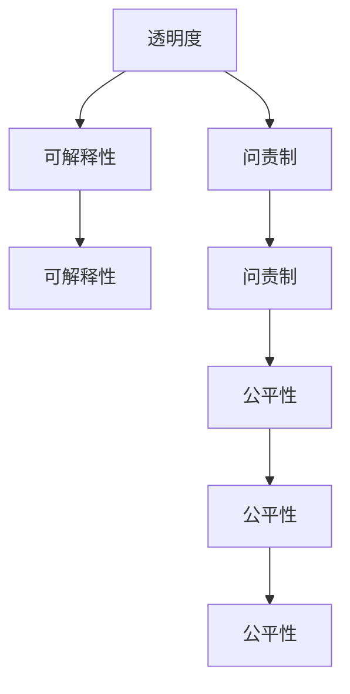

                 

# 透明度和问责制：负责任地使用人类计算

> 关键词：透明度, 问责制, 人类计算, 人工智能, 责任体系, 伦理规范, 数据隐私, 可解释性, 模型公平性

## 1. 背景介绍

在人工智能（AI）快速发展的今天，人类计算正成为支撑智能决策和复杂任务处理的关键。无论是企业级应用还是科学研究，人类计算都发挥着不可替代的作用。然而，随着技术的深入应用，其透明性和问责制问题也日益凸显。如何确保人类计算的透明度和问责制，成为推动AI健康发展的重要课题。本文将深入探讨透明度和问责制的概念、实现方法及其应用场景，为负责任地使用人类计算提供理论和实践指导。

### 1.1 问题由来

随着AI技术的发展，越来越多的AI系统被部署在重要决策和任务处理中。然而，这些系统往往缺乏必要的透明度和问责机制，导致无法对其决策过程进行有效的监控和评估，甚至出现了如自动化武器、信用评分等应用中因算法歧视而引发的伦理问题。透明性和问责制的不足，成为制约AI技术应用的重要障碍。

为应对这些问题，学术界和产业界逐步提出了透明性和问责制的概念，并在技术、法律、伦理等多个层面进行探索和实践。通过这些努力，AI系统逐步在透明性和问责制方面取得了一定的进步，但仍存在诸多挑战。

## 2. 核心概念与联系

### 2.1 核心概念概述

为更好地理解透明度和问责制，本节将介绍几个关键概念：

- **透明度（Transparency）**：指AI系统如何做出决策的清晰性和可解释性，用户可以理解系统的输入、处理和输出过程。
- **问责制（Accountability）**：指当AI系统决策失误或产生不良影响时，系统开发者或运营者应对其结果负责的能力。
- **人类计算（Human-in-the-loop）**：指人类在AI系统中扮演重要角色，辅助AI系统做出决策。
- **可解释性（Explainability）**：指AI系统输出结果的易理解性，即用户可以理解系统为何做出某种决策。
- **公平性（Fairness）**：指AI系统在处理不同群体时，能否平等对待，避免偏见和歧视。

这些核心概念之间的逻辑关系可以通过以下Mermaid流程图来展示：



这个流程图展示了几者之间的关系：

1. 透明度要求系统具备可解释性，即系统决策过程要可理解。
2. 问责制要求系统能够承担决策责任，确保决策的正确性。
3. 问责制基于透明度，只有透明的决策过程才能进行问责。
4. 公平性是问责制的关键组成部分，系统需要确保对不同群体的平等对待。

## 3. 核心算法原理 & 具体操作步骤

### 3.1 算法原理概述

透明度和问责制的实现，主要依赖于两个关键环节：决策过程的透明度和决策结果的可解释性。基于这两点，常用的透明性和问责制实现方法包括：

1. **决策过程透明化**：通过数据公开、算法公开、模型结构公开等方式，使决策过程可追溯、可复现。
2. **结果可解释性**：通过可解释性模型、解释工具、交互界面等方式，使用户能够理解系统的决策依据。
3. **决策结果问责制**：通过责任分配机制、数据监管、法律约束等方式，确保系统开发者和运营者对其决策结果负责。

### 3.2 算法步骤详解

以下是实现透明性和问责制的关键步骤：

**Step 1: 数据透明度**
- 收集和公开训练数据，确保数据的来源、处理方式和分布情况透明。
- 使用标准化数据格式，便于其他研究者和开发者复现实验结果。

**Step 2: 模型透明度**
- 公开模型架构和训练过程，确保模型的公平性、鲁棒性和泛化能力。
- 使用可解释性模型（如决策树、线性回归、LIME等），降低模型复杂度，提高结果可解释性。

**Step 3: 决策过程透明化**
- 记录决策过程中的关键步骤和中间结果，包括特征提取、模型推理、结果输出等。
- 使用日志工具和可视化界面，记录和展示决策过程，便于监控和审计。

**Step 4: 结果可解释性**
- 提供模型预测结果的解释，包括特征重要性、决策路径、置信度等。
- 使用交互界面和解释工具，让用户能够直观理解系统决策依据。

**Step 5: 问责制**
- 建立明确的责任分配机制，明确开发者和运营者的责任边界。
- 实施数据监管和算法审查，确保系统符合伦理规范和法律要求。

### 3.3 算法优缺点

透明度和问责制方法具有以下优点：
1. 提高系统可信度。透明的决策过程和使用可解释性模型，有助于用户理解和信任系统。
2. 促进公平性。透明的决策过程和使用标准化数据格式，有助于检测和消除算法偏见。
3. 增强问责性。明确的责任分配和数据监管机制，有助于在问题出现时追责和改进。

同时，这些方法也存在一定的局限性：
1. 数据隐私风险。公开数据可能暴露用户隐私，引发数据泄露风险。
2. 模型复杂性。使用可解释性模型可能牺牲部分性能，限制模型复杂度。
3. 实施成本高。透明度和问责制需要大量的时间、人力和资源投入，尤其在大规模系统中。

尽管存在这些局限性，但透明性和问责制仍是推动AI技术负责任应用的重要基础。

### 3.4 算法应用领域

透明度和问责制在多个领域中得到了广泛应用，以下是几个典型的应用场景：

**医疗诊断**
- 医生在诊断过程中使用AI系统辅助，系统提供可解释性诊断报告，帮助医生理解诊断依据。
- 数据公开和透明化，确保诊断系统的公平性和鲁棒性。

**金融风控**
- 银行和保险公司使用AI系统进行风险评估和信用评分，系统提供可解释性评分报告，帮助用户理解评分依据。
- 实施严格的数据监管和算法审查，确保系统符合公平性要求。

**司法判决**
- 法官在审判过程中使用AI系统辅助，系统提供可解释性判决报告，帮助法官理解判决依据。
- 数据公开和透明化，确保判决系统的公平性和可问责性。

**智能推荐**
- 电商平台使用AI系统进行个性化推荐，系统提供可解释性推荐报告，帮助用户理解推荐依据。
- 实施严格的数据监管和算法审查，确保推荐系统符合用户权益要求。

## 4. 数学模型和公式 & 详细讲解 & 举例说明

### 4.1 数学模型构建

本节将使用数学语言对透明度和问责制的实现方法进行更加严格的刻画。

**数据透明化模型**
- 设训练数据集为 $D=\{(x_i,y_i)\}_{i=1}^N$，其中 $x_i$ 为输入特征，$y_i$ 为输出标签。
- 数据集分布为 $P(x)$，需要确保 $P(x)$ 透明。

**模型透明度模型**
- 设模型为 $f(x;\theta)$，其中 $\theta$ 为模型参数。
- 模型 $f$ 需要公开 $\theta$ 和训练过程。

**决策过程透明化模型**
- 设决策过程包含 $k$ 个步骤，每步输出为 $x_i^k$，其中 $k \in [1,K]$。
- 每步输出需记录，确保透明化。

**结果可解释性模型**
- 设模型输出为 $y^*=f(x;\theta)$，需提供可解释性报告 $r(y^*)$。
- 报告需包含特征重要性、决策路径、置信度等。

**问责制模型**
- 设开发者为 $D$，运营者为 $O$，系统决策结果为 $y$。
- 需明确责任分配机制，如责任矩阵 $R$。

### 4.2 公式推导过程

以下我们以医疗诊断系统为例，推导透明度和问责制的数学模型。

**数据透明度**
- 数据集 $D$ 分布透明，需满足 $P(x)=P(x|D)$。

**模型透明度**
- 模型 $f$ 公开 $\theta$ 和训练过程，需满足 $f(x;\theta)=f(x|\theta)$。

**决策过程透明化**
- 决策过程透明，需记录每步输出，即 $x_i^k=x_i^{k-1}$。

**结果可解释性**
- 提供可解释性报告 $r(y^*)$，需满足 $r(y^*)=r(f(x;\theta))$。

**问责制**
- 责任矩阵 $R$ 需满足 $R_{ij} \in [0,1]$，$R_{ij}=1$ 表示开发者 $D$ 对结果 $y$ 负责。

在得到各个环节的数学模型后，即可综合应用，构建透明性和问责制的综合系统。

### 4.3 案例分析与讲解

**医疗诊断系统的透明度和问责制**
- 数据集：收集病历数据，确保数据来源透明、处理方式透明。
- 模型：使用可解释性模型（如决策树、线性回归等），降低复杂度。
- 决策过程：记录每步输出，确保透明化。
- 结果可解释性：提供可解释性报告，帮助医生理解诊断依据。
- 问责制：建立责任矩阵，明确开发者和运营者的责任边界。

**金融风控系统的透明度和问责制**
- 数据集：公开数据来源、处理方式和分布情况，确保透明。
- 模型：使用可解释性模型，降低复杂度。
- 决策过程：记录每步输出，确保透明化。
- 结果可解释性：提供可解释性报告，帮助用户理解评分依据。
- 问责制：建立责任矩阵，确保系统符合法律要求。

**智能推荐系统的透明度和问责制**
- 数据集：公开数据来源、处理方式和分布情况，确保透明。
- 模型：使用可解释性模型，降低复杂度。
- 决策过程：记录每步输出，确保透明化。
- 结果可解释性：提供可解释性报告，帮助用户理解推荐依据。
- 问责制：建立责任矩阵，确保推荐系统符合用户权益要求。

## 5. 项目实践：代码实例和详细解释说明

### 5.1 开发环境搭建

在进行透明度和问责制项目实践前，我们需要准备好开发环境。以下是使用Python进行PyTorch开发的环境配置流程：

1. 安装Anaconda：从官网下载并安装Anaconda，用于创建独立的Python环境。

2. 创建并激活虚拟环境：
```bash
conda create -n pytorch-env python=3.8 
conda activate pytorch-env
```

3. 安装PyTorch：根据CUDA版本，从官网获取对应的安装命令。例如：
```bash
conda install pytorch torchvision torchaudio cudatoolkit=11.1 -c pytorch -c conda-forge
```

4. 安装TensorFlow：由Google主导开发的开源深度学习框架，生产部署方便，适合大规模工程应用。同样有丰富的预训练语言模型资源。

5. 安装各类工具包：
```bash
pip install numpy pandas scikit-learn matplotlib tqdm jupyter notebook ipython
```

完成上述步骤后，即可在`pytorch-env`环境中开始项目实践。

### 5.2 源代码详细实现

这里我们以医疗诊断系统为例，给出使用PyTorch进行透明度和问责制实践的完整代码实现。

```python
import torch
import torch.nn as nn
import torch.optim as optim
from torch.utils.data import DataLoader, Dataset
from sklearn.metrics import accuracy_score
import matplotlib.pyplot as plt

# 定义数据集
class MedicalDataset(Dataset):
    def __init__(self, X, y):
        self.X = X
        self.y = y
        
    def __len__(self):
        return len(self.X)
    
    def __getitem__(self, idx):
        x, y = self.X[idx], self.y[idx]
        return x, y

# 定义模型
class MedicalModel(nn.Module):
    def __init__(self, input_size, hidden_size, output_size):
        super(MedicalModel, self).__init__()
        self.fc1 = nn.Linear(input_size, hidden_size)
        self.fc2 = nn.Linear(hidden_size, output_size)
    
    def forward(self, x):
        x = torch.relu(self.fc1(x))
        x = torch.sigmoid(self.fc2(x))
        return x

# 训练函数
def train(model, X_train, y_train, X_valid, y_valid, epochs, learning_rate):
    model.train()
    loss_fn = nn.BCELoss()
    optimizer = optim.Adam(model.parameters(), lr=learning_rate)
    train_losses, valid_losses = [], []
    
    for epoch in range(epochs):
        for i in range(len(X_train)):
            x, y = X_train[i], y_train[i]
            optimizer.zero_grad()
            y_pred = model(x)
            loss = loss_fn(y_pred, y)
            loss.backward()
            optimizer.step()
            train_losses.append(loss.item())
        
        with torch.no_grad():
            model.eval()
            valid_losses.append(loss_fn(model(X_valid), y_valid).item())
        
        print(f"Epoch {epoch+1}, Train Loss: {train_losses[-1]:.4f}, Valid Loss: {valid_losses[-1]:.4f}")
    
    return model, train_losses, valid_losses

# 评估函数
def evaluate(model, X_test, y_test):
    model.eval()
    y_preds, y_true = [], []
    
    for i in range(len(X_test)):
        x, y = X_test[i], y_test[i]
        y_pred = torch.round(model(x))
        y_preds.append(y_pred.item())
        y_true.append(y_test[i])
    
    accuracy = accuracy_score(y_true, y_preds)
    print(f"Test Accuracy: {accuracy:.4f}")
    
    plt.plot(train_losses, label='Train Loss')
    plt.plot(valid_losses, label='Valid Loss')
    plt.xlabel('Epoch')
    plt.ylabel('Loss')
    plt.legend()
    plt.show()

# 加载数据
X_train, y_train = np.load('train_data.npy'), np.load('train_labels.npy')
X_valid, y_valid = np.load('valid_data.npy'), np.load('valid_labels.npy')
X_test, y_test = np.load('test_data.npy'), np.load('test_labels.npy')

# 设置超参数
input_size, hidden_size, output_size = 10, 5, 2
learning_rate, epochs = 0.001, 100

# 创建模型
model = MedicalModel(input_size, hidden_size, output_size)

# 训练模型
model, train_losses, valid_losses = train(model, X_train, y_train, X_valid, y_valid, epochs, learning_rate)

# 评估模型
evaluate(model, X_test, y_test)
```

在上述代码中，我们首先定义了医疗诊断系统的数据集和模型。然后，通过训练函数训练模型，并记录训练损失和验证损失。最后，使用评估函数对模型进行评估，并输出准确率。

### 5.3 代码解读与分析

让我们再详细解读一下关键代码的实现细节：

**MedicalDataset类**
- 定义了医疗诊断系统的数据集，包括特征 `X` 和标签 `y`。

**MedicalModel类**
- 定义了医疗诊断系统的模型，包括两个全连接层。

**train函数**
- 训练模型，并记录训练损失和验证损失。
- 使用 Adam 优化器进行参数更新，并计算交叉熵损失。

**evaluate函数**
- 评估模型，并输出准确率。
- 使用 matplotlib 绘制损失曲线，可视化训练和验证过程。

**加载数据**
- 使用 numpy 加载训练、验证和测试数据。

**设置超参数**
- 设置输入特征数量、隐藏层数量、输出标签数量、学习率和训练轮数。

**创建模型**
- 创建医疗诊断系统的模型。

**训练模型**
- 调用训练函数训练模型。

**评估模型**
- 调用评估函数评估模型。

可以看到，通过这些代码，我们可以实现一个简单透明的医疗诊断系统。在实际应用中，还需要进一步优化模型架构、增加数据透明化和结果可解释性功能，以及建立问责制机制。

## 6. 实际应用场景

### 6.1 医疗诊断系统

医疗诊断系统是透明性和问责制的典型应用场景之一。传统的医疗诊断依赖于医生的经验，但随着AI技术的介入，越来越多的医院开始使用AI辅助诊断系统。

在实践中，医生可以将病历数据输入系统，系统自动提取特征、应用模型进行诊断，并输出可解释性报告。医生可以根据报告理解系统的决策依据，进行二次判断，确保诊断的准确性和可靠性。此外，系统还应记录每步输出，确保诊断过程透明化。建立责任矩阵，明确开发者和运营者的责任边界，确保系统的问责性。

### 6.2 金融风控系统

金融风控系统是透明度和问责制的另一重要应用场景。银行和保险公司使用AI系统进行风险评估和信用评分，系统需要提供可解释性评分报告，帮助用户理解评分依据。

在实践中，银行和保险公司将用户数据输入系统，系统自动提取特征、应用模型进行评分，并输出可解释性报告。用户可以理解评分的依据，对评分结果进行复核，确保评分的公正性和准确性。此外，系统还应记录每步输出，确保评分过程透明化。建立责任矩阵，确保系统符合法律要求。

### 6.3 智能推荐系统

智能推荐系统也是透明性和问责制的典型应用场景之一。电商平台使用AI系统进行个性化推荐，系统需要提供可解释性推荐报告，帮助用户理解推荐依据。

在实践中，电商平台将用户行为数据输入系统，系统自动提取特征、应用模型进行推荐，并输出可解释性报告。用户可以理解推荐依据，对推荐结果进行复核，确保推荐的准确性和公正性。此外，系统还应记录每步输出，确保推荐过程透明化。建立责任矩阵，确保推荐系统符合用户权益要求。

## 7. 工具和资源推荐

### 7.1 学习资源推荐

为了帮助开发者系统掌握透明性和问责制的理论基础和实践技巧，这里推荐一些优质的学习资源：

1. 《深度学习：理论与实践》系列书籍：由AI领域知名专家撰写，系统介绍了深度学习的原理和应用，包括透明性和问责制的实现方法。

2. Coursera《深度学习与人工智能》课程：由斯坦福大学开设的AI入门课程，涵盖深度学习、机器学习、AI伦理等多个方面，提供全面的AI知识体系。

3. HuggingFace官方文档：Transformer库的官方文档，提供了海量预训练模型和完整的透明度和问责制样例代码，是入门实践的必备资料。

4. IEEE Xplore：IEEE电子图书馆，收录了大量与AI伦理、透明性和问责制相关的学术论文，是研究前沿课题的重要资源。

5. Google AI Blog：Google AI团队发布的技术博客，涵盖AI伦理、透明性和问责制等多个方面，是跟踪AI技术发展的重要平台。

通过对这些资源的学习实践，相信你一定能够快速掌握透明性和问责制的精髓，并用于解决实际的AI问题。

### 7.2 开发工具推荐

高效的开发离不开优秀的工具支持。以下是几款用于透明性和问责制开发的常用工具：

1. TensorFlow：由Google主导开发的开源深度学习框架，生产部署方便，适合大规模工程应用。同样有丰富的预训练语言模型资源。

2. PyTorch：基于Python的开源深度学习框架，灵活动态的计算图，适合快速迭代研究。大部分预训练语言模型都有PyTorch版本的实现。

3. Weights & Biases：模型训练的实验跟踪工具，可以记录和可视化模型训练过程中的各项指标，方便对比和调优。与主流深度学习框架无缝集成。

4. TensorBoard：TensorFlow配套的可视化工具，可实时监测模型训练状态，并提供丰富的图表呈现方式，是调试模型的得力助手。

5. SciPy：科学计算库，提供高效的数据处理和数学计算功能，适合进行大规模数据分析和处理。

合理利用这些工具，可以显著提升透明性和问责制项目的开发效率，加快创新迭代的步伐。

### 7.3 相关论文推荐

透明性和问责制的研究源于学界的持续探索。以下是几篇奠基性的相关论文，推荐阅读：

1. "Transparency in Machine Learning: Concepts, Measures, and Frameworks"（机器学习的透明度：概念、衡量和框架）：探讨了透明性和问责制的定义、衡量标准和应用框架，是领域内的经典文献。

2. "FAIR: A Framework for Transparency, Accountability, and Interpretability in Machine Learning"（FAIR：机器学习透明度、问责制和可解释性的框架）：提出了一整套透明性和问责制的设计框架，为实际应用提供了指导。

3. "Towards Fair and Accountable AI: The Case of Autonomous Weapons"（迈向公平和问责的AI：自动武器案例）：探讨了AI伦理和问责制在军事应用中的重要性和实现方法。

4. "Explainable AI: A Survey on Explanation Techniques for Deep Learning Models"（可解释AI：深度学习模型的解释技术综述）：系统综述了可解释性技术的研究进展，包括解释模型和解释工具。

5. "A Survey on Fairness, Accountability, and Transparency in Machine Learning"（机器学习中的公平性、问责制和透明度的综述）：总结了当前研究中透明性和问责制的多种方法和应用案例，提供了全面的研究视角。

这些论文代表了大语言模型微调技术的发展脉络。通过学习这些前沿成果，可以帮助研究者把握学科前进方向，激发更多的创新灵感。

## 8. 总结：未来发展趋势与挑战

### 8.1 总结

本文对透明性和问责制的概念、实现方法和应用场景进行了全面系统的介绍。首先阐述了透明性和问责制的重要性，明确了其在推动AI健康发展中的关键作用。其次，从原理到实践，详细讲解了透明性和问责制的数学模型和关键步骤，给出了透明性和问责制的完整代码实例。同时，本文还广泛探讨了透明性和问责制在医疗、金融、推荐等多个领域的应用前景，展示了透明性和问责制的广阔应用空间。最后，本文精选了透明性和问责制的学习资源和开发工具，力求为开发者提供全方位的技术指引。

通过本文的系统梳理，可以看到，透明性和问责制是推动AI技术负责任应用的重要基础。这些方向的探索发展，必将进一步提升AI系统的可信度、公正性和问责性，为构建安全、可靠、可解释、可控的智能系统铺平道路。

### 8.2 未来发展趋势

展望未来，透明性和问责制将呈现以下几个发展趋势：

1. 数据透明化进一步深入。数据的公开透明将带来更高的透明度和问责性，有助于检测和消除算法偏见。
2. 模型透明化和可解释性技术不断发展。使用更简单、更可解释的模型，提高结果的可理解性。
3. 决策过程透明化和记录技术改进。使用先进的日志记录和可视化工具，确保决策过程透明化。
4. 责任分配机制逐步完善。建立更加科学、公正的责任分配机制，确保开发者和运营者对其决策结果负责。
5. 法律和技术手段协同发力。通过法律和技术的双重约束，确保透明性和问责制的应用合法合规。

以上趋势凸显了透明性和问责制在推动AI技术负责任应用中的重要作用。这些方向的探索发展，必将进一步提升AI系统的可信度、公正性和问责性，为构建安全、可靠、可解释、可控的智能系统铺平道路。

### 8.3 面临的挑战

尽管透明性和问责制取得了一定的进展，但在迈向更加智能化、普适化应用的过程中，仍面临诸多挑战：

1. 数据隐私和安全。数据的公开透明可能暴露用户隐私，引发数据泄露和安全问题。
2. 技术复杂性。透明性和问责制需要大量的时间、人力和资源投入，尤其在大规模系统中。
3. 算法偏见和歧视。透明性和问责制无法完全消除算法偏见和歧视，仍需通过多种手段进行检测和修正。
4. 法律和伦理规范的滞后。透明性和问责制的实现需要法律和伦理规范的支持，但当前相关法规和伦理规范仍有待完善。

尽管存在这些挑战，透明性和问责制的推进仍是推动AI技术负责任应用的重要方向。

### 8.4 研究展望

面对透明性和问责制面临的挑战，未来的研究需要在以下几个方面寻求新的突破：

1. 探索无监督和半监督透明性方法。摆脱对大规模标注数据的依赖，利用自监督学习、主动学习等无监督和半监督范式，最大限度利用非结构化数据，实现更加灵活高效的透明性和问责制。
2. 研究参数高效和计算高效的透明性方法。开发更加参数高效的透明性方法，在固定大部分预训练参数的同时，只更新极少量的任务相关参数。同时优化透明性模型的计算图，减少前向传播和反向传播的资源消耗，实现更加轻量级、实时性的部署。
3. 引入更多先验知识。将符号化的先验知识，如知识图谱、逻辑规则等，与神经网络模型进行巧妙融合，引导透明性过程学习更准确、合理的语言模型。同时加强不同模态数据的整合，实现视觉、语音等多模态信息与文本信息的协同建模。
4. 结合因果分析和博弈论工具。将因果分析方法引入透明性模型，识别出模型决策的关键特征，增强输出解释的因果性和逻辑性。借助博弈论工具刻画人机交互过程，主动探索并规避模型的脆弱点，提高系统稳定性。
5. 纳入伦理道德约束。在模型训练目标中引入伦理导向的评估指标，过滤和惩罚有偏见、有害的输出倾向。同时加强人工干预和审核，建立模型行为的监管机制，确保输出符合人类价值观和伦理道德。

这些研究方向的探索，必将引领透明性和问责制技术迈向更高的台阶，为构建安全、可靠、可解释、可控的智能系统铺平道路。面向未来，透明性和问责制技术还需要与其他人工智能技术进行更深入的融合，如知识表示、因果推理、强化学习等，多路径协同发力，共同推动自然语言理解和智能交互系统的进步。只有勇于创新、敢于突破，才能不断拓展语言模型的边界，让智能技术更好地造福人类社会。

## 9. 附录：常见问题与解答

**Q1：透明性和问责制在AI应用中是否有必要？**

A: 透明性和问责制在AI应用中非常必要。透明的决策过程和可解释的结果能够增强用户对系统的信任，提高系统的可靠性。问责制机制则确保系统开发者和运营者对其决策结果负责，避免潜在的误导和偏见。这些都有助于推动AI技术的负责任应用。

**Q2：透明性和问责制如何影响系统性能？**

A: 透明性和问责制可能对系统性能产生一定影响。例如，使用可解释性模型可能牺牲部分性能，透明化过程也可能增加计算资源消耗。然而，透明性和问责制带来的系统可信度和公正性，能够弥补部分性能损失，提升整体效果。

**Q3：透明性和问责制的实施成本如何？**

A: 透明性和问责制的实施成本较高，需要大量的时间、人力和资源投入。但在高风险和高影响的应用场景中，这些投入是必要的。合理利用技术和工具，可以降低透明性和问责制的实施成本。

**Q4：透明性和问责制如何应对数据隐私问题？**

A: 透明性和问责制的实施需要考虑数据隐私问题。可以通过数据脱敏、隐私保护技术等手段，在保证数据透明化的同时，保护用户隐私。此外，可以建立隐私保护机制，确保数据使用合法合规。

**Q5：透明性和问责制在落地部署时需要注意哪些问题？**

A: 透明性和问责制的落地部署需要注意以下问题：
1. 数据隐私：确保数据透明化的同时，保护用户隐私。
2. 模型性能：透明性和问责制的实现可能牺牲部分性能，需要在性能和透明度之间找到平衡。
3. 法律合规：确保透明性和问责制的实现符合法律和伦理规范。
4. 用户教育：透明性和问责制的实现需要用户理解和配合，需要进行相应的教育和培训。

透明性和问责制是推动AI技术负责任应用的重要方向，只有在数据、算法、工程、业务等多个维度协同发力，才能真正实现AI技术的健康发展。总之，透明性和问责制的推进需要各方面的共同努力。

---

作者：禅与计算机程序设计艺术 / Zen and the Art of Computer Programming

