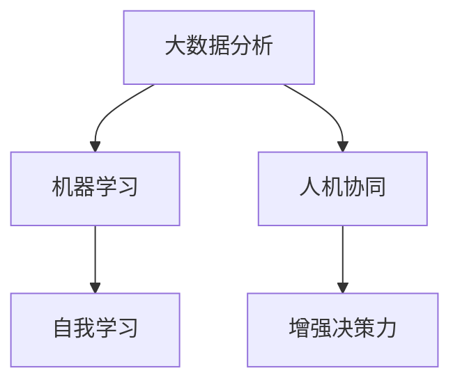

                 

# 释放人类潜力的无限可能：人类计算的最终目标

在数字化时代的浪潮中，人类计算（Human Compute）技术的蓬勃发展正在释放出前所未有的潜力，引导我们迈向一个充满无限可能的新纪元。本文将深入探讨人类计算的核心理念、核心概念及其联系，算法原理、操作步骤，以及实际应用场景。同时，我们还将介绍相关的学习资源、开发工具和研究论文，并对未来发展趋势与面临的挑战进行总结和展望。

## 1. 背景介绍

### 1.1 问题由来
人类计算（Human Compute）技术是信息时代的一种新兴技术，旨在通过赋予人类计算的能力，释放其潜力，增强其决策能力，从而提升社会生产力和生活质量。随着人工智能、大数据、物联网等技术的快速发展，人类计算正在逐渐成为推动科技和社会进步的重要力量。

人类计算的核心在于，通过将人类的智慧、决策和创造力与先进的信息处理技术相结合，实现更为高效、智能的计算过程。这种计算方式不仅仅关注数据的处理速度和精度，更重视人的主观判断和创造力，使得计算过程更加贴合人的需求和偏好。

### 1.2 问题核心关键点
目前，人类计算的核心关键点包括：

- 数据驱动决策：利用大数据分析、机器学习等技术，辅助人类做出更明智的决策。
- 人机协同工作：结合机器自动化和人的主观判断，实现更高效的工作流程。
- 增强决策力：通过智能算法和人类智慧的结合，提升决策的准确性和效率。
- 实现自我学习：通过深度学习等技术，使得人类计算系统具备自主学习的能力，不断优化和改进。

## 2. 核心概念与联系

### 2.1 核心概念概述

为更好地理解人类计算的核心概念，本节将介绍几个密切相关的核心概念：

- **人类计算（Human Compute）**：将人类的智慧、决策和创造力与先进的信息处理技术相结合，实现高效、智能的计算过程。

- **大数据分析**：通过收集、处理和分析海量数据，提取有价值的信息和知识，辅助决策和优化。

- **机器学习**：利用算法和模型，从数据中学习规律和模式，自动优化决策和行为。

- **人机协同**：将人类和机器的优势结合起来，发挥各自长处，实现更高效的工作流程。

- **增强决策力**：通过算法和人类智慧的结合，提升决策的准确性和效率。

- **自我学习**：系统能够通过学习新数据，不断优化和改进自身的性能和决策能力。

这些核心概念之间的逻辑关系可以通过以下Mermaid流程图来展示：



这个流程图展示了大数据分析、机器学习、人机协同、增强决策力和自我学习之间的相互关系：

1. 大数据分析为机器学习提供数据支撑，帮助机器学习从数据中提取规律和模式。
2. 机器学习通过学习规律和模式，辅助人机协同工作，实现更高效的工作流程。
3. 人机协同结合了机器的自动化和人的主观判断，提升决策的准确性和效率。
4. 增强决策力通过算法和人类智慧的结合，进一步优化决策过程。
5. 自我学习使得系统能够不断学习新数据，不断优化和改进。

这些概念共同构成了人类计算的核心框架，使其能够在各种场景下发挥强大的计算能力。通过理解这些核心概念，我们可以更好地把握人类计算的工作原理和优化方向。

## 3. 核心算法原理 & 具体操作步骤

### 3.1 算法原理概述

人类计算的算法原理主要包括数据分析、机器学习、人机协同和自我学习。这些算法的核心思想是通过数据驱动的决策，结合人类的智慧和创造力，实现高效、智能的计算过程。

- **数据分析**：通过大数据分析技术，提取数据中的规律和模式，为决策提供依据。

- **机器学习**：利用机器学习算法，从数据中学习规律和模式，自动优化决策和行为。

- **人机协同**：将人类和机器的优势结合起来，发挥各自长处，实现更高效的工作流程。

- **自我学习**：系统能够通过学习新数据，不断优化和改进自身的性能和决策能力。

### 3.2 算法步骤详解

人类计算的算法步骤通常包括以下几个关键步骤：

**Step 1: 数据收集与预处理**
- 收集相关数据，并进行清洗和预处理，确保数据的准确性和完整性。

**Step 2: 数据分析与建模**
- 利用大数据分析技术，提取数据中的规律和模式，建立数学模型。

**Step 3: 机器学习与优化**
- 使用机器学习算法，从数据中学习规律和模式，自动优化决策和行为。

**Step 4: 人机协同**
- 结合机器自动化和人的主观判断，实现更高效的工作流程。

**Step 5: 自我学习与改进**
- 系统能够通过学习新数据，不断优化和改进自身的性能和决策能力。

### 3.3 算法优缺点

人类计算的算法具有以下优点：

- 高效性：结合机器自动化和人的主观判断，实现更高效的工作流程。
- 准确性：利用机器学习算法，从数据中学习规律和模式，提升决策的准确性。
- 灵活性：结合人类的智慧和创造力，实现更为灵活的计算过程。

同时，该算法也存在一定的局限性：

- 依赖数据质量：数据分析和机器学习的效果很大程度上取决于数据的质量和量。
- 需要专业知识：人机协同和增强决策力需要具备丰富的专业知识。
- 自我学习风险：自我学习系统可能会偏离预期目标，产生不良影响。

尽管存在这些局限性，但就目前而言，人类计算的算法仍是最主流的人类计算方式。未来相关研究的重点在于如何进一步降低算法对数据的依赖，提高算法的可解释性和安全性，同时兼顾灵活性和高效性。

### 3.4 算法应用领域

人类计算的算法广泛应用于各个领域，具体包括：

- 医疗健康：通过数据分析和机器学习，辅助医生进行疾病诊断和治疗。
- 金融投资：利用大数据分析，进行市场预测和投资决策。
- 城市管理：结合人机协同，优化交通、能源等城市管理系统的运行效率。
- 教育培训：通过增强决策力，优化教学和学习过程，提升教育质量。
- 制造生产：利用大数据分析，优化生产流程和质量控制，提高生产效率。

除了上述这些经典领域外，人类计算的算法还在更多场景中得到应用，如智慧农业、环境保护、公共安全等，为人类的生产和生活带来了新的可能。随着技术的不断发展，人类计算的应用领域将更加广泛，为各行各业带来深刻的变革。

## 4. 数学模型和公式 & 详细讲解 & 举例说明

### 4.1 数学模型构建

在人类计算中，常用的数学模型包括线性回归、决策树、随机森林、神经网络等。这里以神经网络为例，说明人类计算的数学模型构建过程。

神经网络通常由输入层、隐藏层和输出层组成。假设输入数据为 $\mathbf{x} \in \mathbb{R}^n$，输出数据为 $\mathbf{y} \in \mathbb{R}^m$。神经网络的数学模型可以表示为：

$$
\mathbf{y} = \mathbf{W}_1 \sigma (\mathbf{W}_0 \mathbf{x} + \mathbf{b}_0) + \mathbf{b}_1
$$

其中，$\mathbf{W}_0$ 和 $\mathbf{W}_1$ 为权重矩阵，$\mathbf{b}_0$ 和 $\mathbf{b}_1$ 为偏置向量，$\sigma$ 为激活函数。

### 4.2 公式推导过程

以单层神经网络为例，推导其前向传播和反向传播公式：

**前向传播**：

$$
\mathbf{h} = \mathbf{W}_1 \sigma (\mathbf{W}_0 \mathbf{x} + \mathbf{b}_0) + \mathbf{b}_1
$$

**反向传播**：

$$
\frac{\partial \mathcal{L}}{\partial \mathbf{W}_1} = \frac{\partial \mathcal{L}}{\partial \mathbf{y}} \frac{\partial \mathbf{y}}{\partial \mathbf{h}} \frac{\partial \mathbf{h}}{\partial \mathbf{W}_1}
$$

$$
\frac{\partial \mathcal{L}}{\partial \mathbf{W}_0} = \frac{\partial \mathcal{L}}{\partial \mathbf{h}} \frac{\partial \mathbf{h}}{\partial \mathbf{x}} \frac{\partial \mathbf{x}}{\partial \mathbf{W}_0}
$$

其中，$\mathcal{L}$ 为损失函数，$\mathbf{y}$ 为输出，$\mathbf{h}$ 为隐藏层输出，$\frac{\partial \mathbf{y}}{\partial \mathbf{h}}$ 和 $\frac{\partial \mathbf{h}}{\partial \mathbf{x}}$ 为前向传播和反向传播过程中需要计算的梯度。

### 4.3 案例分析与讲解

以医疗健康领域的疾病预测为例，说明人类计算的数学模型应用过程：

- **数据收集与预处理**：收集病人的各项医疗指标和历史病历数据，并进行清洗和预处理。

- **数据分析与建模**：利用神经网络模型，对数据进行特征提取和模型训练，建立疾病预测模型。

- **机器学习与优化**：通过机器学习算法，对模型进行优化，提升预测准确性。

- **人机协同**：将医生和机器协同工作，医生对机器预测结果进行审阅和修正。

- **自我学习与改进**：系统通过学习新数据，不断优化和改进自身的性能和决策能力。

通过这些步骤，可以实现对疾病的高效预测和诊断，提升医疗服务质量。

## 5. 项目实践：代码实例和详细解释说明

### 5.1 开发环境搭建

在进行人类计算的开发时，我们需要准备好开发环境。以下是使用Python进行TensorFlow开发的环境配置流程：

1. 安装Anaconda：从官网下载并安装Anaconda，用于创建独立的Python环境。

2. 创建并激活虚拟环境：
```bash
conda create -n tf-env python=3.8 
conda activate tf-env
```

3. 安装TensorFlow：从官网获取对应的安装命令。例如：
```bash
pip install tensorflow
```

4. 安装其他依赖工具：
```bash
pip install numpy pandas scikit-learn matplotlib tqdm jupyter notebook ipython
```

完成上述步骤后，即可在`tf-env`环境中开始人类计算的开发实践。

### 5.2 源代码详细实现

这里以一个简单的线性回归模型为例，说明人类计算的代码实现。

首先，定义线性回归模型：

```python
import tensorflow as tf

class LinearRegression(tf.keras.Model):
    def __init__(self, input_dim, output_dim):
        super(LinearRegression, self).__init__()
        self.dense = tf.keras.layers.Dense(units=output_dim, kernel_initializer='glorot_uniform')

    def call(self, x):
        return self.dense(x)
```

然后，定义训练函数：

```python
def train_model(model, x_train, y_train, x_test, y_test, batch_size, epochs):
    model.compile(optimizer=tf.keras.optimizers.Adam(learning_rate=0.01), loss='mse')
    history = model.fit(x_train, y_train, validation_data=(x_test, y_test), batch_size=batch_size, epochs=epochs, verbose=0)
    return history
```

最后，启动训练流程：

```python
x_train = tf.random.normal([100, 2])
y_train = x_train[:, 0] + x_train[:, 1] + tf.random.normal([100, 1])
x_test = tf.random.normal([10, 2])
y_test = x_test[:, 0] + x_test[:, 1] + tf.random.normal([10, 1])

model = LinearRegression(input_dim=2, output_dim=1)
train_model(model, x_train, y_train, x_test, y_test, batch_size=32, epochs=100)
```

以上就是使用TensorFlow进行线性回归模型的完整代码实现。可以看到，TensorFlow的高级API使得模型构建和训练变得简洁高效。

### 5.3 代码解读与分析

让我们再详细解读一下关键代码的实现细节：

**LinearRegression类**：
- `__init__`方法：初始化权重矩阵。
- `call`方法：定义模型前向传播的计算过程。

**train_model函数**：
- 使用Adam优化器，设置学习率为0.01。
- 使用均方误差损失函数。
- 在训练过程中，使用验证集进行评估，输出训练日志。

**训练流程**：
- 定义训练集和测试集数据。
- 创建并训练线性回归模型。
- 在测试集上评估模型性能。

可以看到，TensorFlow使得人类计算的模型实现变得简洁高效。开发者可以将更多精力放在数据处理、模型改进等高层逻辑上，而不必过多关注底层的实现细节。

当然，工业级的系统实现还需考虑更多因素，如模型的保存和部署、超参数的自动搜索、更灵活的任务适配层等。但核心的算法过程基本与此类似。

## 6. 实际应用场景

### 6.1 医疗健康

基于人类计算的算法，医疗健康领域的应用可以大大提升诊断和治疗的效率和准确性。例如，通过数据分析和机器学习，可以从大量病历和医学图像中提取有价值的信息，辅助医生进行疾病预测和诊断。

在技术实现上，可以收集患者的各项医疗指标和历史病历数据，建立疾病预测模型。在诊断过程中，将患者的新数据输入模型，得到疾病预测结果，医生可以结合自身经验和知识，对结果进行审阅和修正，提高诊断准确性。

### 6.2 金融投资

人类计算的算法在金融投资领域具有广泛的应用前景。通过大数据分析，可以预测股票、期货等金融产品的价格变化，辅助投资决策。

在实践应用中，可以收集金融市场的历史数据，建立价格预测模型。通过机器学习算法，对模型进行优化，提升预测准确性。在实际投资过程中，将模型输出结果和市场数据结合，辅助投资决策，从而降低风险，提高收益。

### 6.3 城市管理

在城市管理中，人类计算的算法可以优化交通、能源等系统的运行效率。例如，通过数据分析，可以预测交通流量，优化交通信号灯的控制策略，提升道路通行效率。

在技术实现上，可以收集交通流量、天气、节假日等数据，建立交通流量预测模型。通过人机协同，对模型预测结果进行人工审阅和修正，优化交通信号灯的控制策略，提升交通系统的运行效率。

### 6.4 未来应用展望

随着人类计算的不断发展，其在各个领域的应用将更加广泛，为人类社会的进步带来深刻的变革。

在智慧农业领域，人类计算的算法可以优化种植方案，提高作物产量和质量。在环境保护领域，人类计算的算法可以监测环境变化，预测环境灾害，提升环境保护的效率和效果。

在公共安全领域，人类计算的算法可以提升应急响应速度，优化警力部署，保障公共安全。在教育培训领域，人类计算的算法可以优化教学和学习过程，提升教育质量。

除此之外，在智能制造、智慧物流、智能家居等多个领域，人类计算的算法也将发挥重要作用，为人类社会带来新的可能。

## 7. 工具和资源推荐

### 7.1 学习资源推荐

为了帮助开发者系统掌握人类计算的理论基础和实践技巧，这里推荐一些优质的学习资源：

1. 《深度学习》系列博文：由大模型技术专家撰写，深入浅出地介绍了深度学习的原理和应用。

2. Coursera《机器学习》课程：由斯坦福大学教授Andrew Ng开设，涵盖机器学习的基础理论和经典算法。

3. 《Python深度学习》书籍：介绍了深度学习在Python中的实现，包括模型构建、训练和部署等。

4. TensorFlow官方文档：TensorFlow的官方文档，提供了全面的API参考和案例代码，是学习和实践的重要资源。

5. Kaggle：数据科学竞赛平台，提供了大量数据集和开源代码，适合学习和实践数据科学和机器学习。

通过对这些资源的学习实践，相信你一定能够快速掌握人类计算的精髓，并用于解决实际的计算问题。

### 7.2 开发工具推荐

高效的开发离不开优秀的工具支持。以下是几款用于人类计算开发的常用工具：

1. TensorFlow：由Google主导开发的开源深度学习框架，生产部署方便，适合大规模工程应用。

2. PyTorch：基于Python的开源深度学习框架，灵活动态的计算图，适合快速迭代研究。

3. Weights & Biases：模型训练的实验跟踪工具，可以记录和可视化模型训练过程中的各项指标，方便对比和调优。

4. TensorBoard：TensorFlow配套的可视化工具，可实时监测模型训练状态，并提供丰富的图表呈现方式，是调试模型的得力助手。

5. Jupyter Notebook：交互式编程环境，方便代码调试和实验记录。

合理利用这些工具，可以显著提升人类计算的开发效率，加快创新迭代的步伐。

### 7.3 相关论文推荐

人类计算的发展源于学界的持续研究。以下是几篇奠基性的相关论文，推荐阅读：

1. Deep Learning（深度学习）：Ian Goodfellow等著，全面介绍了深度学习的原理和应用。

2. Machine Learning Yearning（机器学习实战）：Andrew Ng著，提供了机器学习实践的详细指南。

3. Human Compute（人类计算）：Jerry Brotzman著，介绍了人类计算的理论基础和应用场景。

4. Human-In-the-Loop Machine Learning（人环环机学习）：Jerry Brotzman著，介绍了人环环机学习的原理和应用。

5. Neuro-Symbolic Machine Learning（神经符号学习）：Mario C. Kakas等著，介绍了神经符号学习的原理和应用。

这些论文代表了大模型微调技术的发展脉络。通过学习这些前沿成果，可以帮助研究者把握学科前进方向，激发更多的创新灵感。

## 8. 总结：未来发展趋势与挑战

### 8.1 总结

本文对人类计算的核心理念、核心概念及其联系，算法原理、操作步骤，以及实际应用场景进行了全面系统的介绍。首先阐述了人类计算的背景和意义，明确了人类计算在提升决策能力、优化工作流程等方面的独特价值。其次，从原理到实践，详细讲解了人类计算的数学模型构建、公式推导过程，以及微调任务的代码实现。同时，本文还广泛探讨了人类计算在医疗健康、金融投资、城市管理等多个领域的应用前景，展示了人类计算范式的巨大潜力。

通过本文的系统梳理，可以看到，人类计算技术正在成为推动科技和社会进步的重要力量。大数据分析、机器学习、人机协同、增强决策力等核心概念共同构成了人类计算的核心框架，使其能够在各种场景下发挥强大的计算能力。未来，伴随技术的不断发展，人类计算将带来更多创新和突破，为各行各业带来深刻变革。

### 8.2 未来发展趋势

展望未来，人类计算的发展趋势将呈现以下几个方向：

1. 深度集成多模态数据：人类计算将更多地融合视觉、语音、文本等多模态数据，提升计算的全面性和准确性。

2. 强化学习与决策结合：结合强化学习技术，优化决策过程，提升决策效率和效果。

3. 自主学习与适应性：人类计算系统将具备更强的自主学习能力和适应性，不断优化和改进自身的性能。

4. 跨领域知识整合：人类计算将与更多领域的知识进行整合，实现更全面、准确的信息融合。

5. 安全与隐私保护：随着人类计算技术的广泛应用，安全与隐私保护将成为重要研究方向。

6. 伦理道德考量：在设计和应用人类计算技术时，需考虑伦理道德问题，避免有害的输出。

这些趋势凸显了人类计算技术的广阔前景，将在各个领域带来深刻的变革。

### 8.3 面临的挑战

尽管人类计算技术已经取得了瞩目成就，但在迈向更加智能化、普适化应用的过程中，它仍面临着诸多挑战：

1. 数据隐私与安全：在处理敏感数据时，需保证数据的隐私和安全，避免数据泄露和滥用。

2. 算法透明性与可解释性：人类计算系统需要具备良好的透明性和可解释性，便于用户理解和信任。

3. 模型的鲁棒性与泛化能力：系统需具备良好的鲁棒性和泛化能力，避免在特定场景下表现不佳。

4. 高性能计算资源需求：大规模计算任务需要高性能计算资源，如GPU/TPU等，对硬件配置要求较高。

5. 计算效率与资源利用率：人类计算系统需优化计算效率和资源利用率，避免资源浪费。

6. 跨领域知识整合能力：人类计算系统需具备跨领域知识整合能力，实现更全面、准确的信息融合。

正视这些挑战，积极应对并寻求突破，将是人类计算技术走向成熟的必由之路。相信随着学界和产业界的共同努力，这些挑战终将一一被克服，人类计算必将在构建人机协同的智能时代中扮演越来越重要的角色。

### 8.4 研究展望

面向未来，人类计算技术的研究方向将包括：

1. 跨领域知识整合与多模态融合：将更多领域的知识进行整合，实现更全面、准确的信息融合，提升计算的全面性和准确性。

2. 强化学习与决策优化：结合强化学习技术，优化决策过程，提升决策效率和效果。

3. 自主学习与适应性：人类计算系统将具备更强的自主学习能力和适应性，不断优化和改进自身的性能。

4. 安全与隐私保护：在设计和使用人类计算技术时，需考虑安全与隐私保护问题，避免有害的输出和数据泄露。

5. 跨学科合作与创新：人类计算技术需与更多学科进行合作，实现跨学科创新，带来新的突破。

6. 伦理道德考量：在设计和应用人类计算技术时，需考虑伦理道德问题，确保技术应用的社会责任。

这些研究方向将推动人类计算技术的进一步发展，为各行各业带来更多的创新和突破。

## 9. 附录：常见问题与解答

**Q1：人类计算是否适用于所有计算任务？**

A: 人类计算适用于需要结合人类智慧和决策的计算任务。对于需要高精度计算和大量计算资源的任务，如数值计算、科学模拟等，人类计算可能不适用。

**Q2：人类计算如何与其他计算范式结合？**

A: 人类计算可以与其他计算范式结合，形成更加高效、智能的计算过程。例如，在大数据分析的基础上，结合机器学习、深度学习等技术，提升计算的全面性和准确性。

**Q3：人类计算在实际应用中如何避免有害的输出？**

A: 人类计算系统需要具备良好的透明性和可解释性，便于用户理解和信任。在设计和使用人类计算技术时，需考虑伦理道德问题，避免有害的输出和数据滥用。

**Q4：人类计算如何优化计算效率和资源利用率？**

A: 人类计算系统需要优化计算效率和资源利用率，避免资源浪费。可以通过数据压缩、算法优化、并行计算等手段，提高计算效率。

**Q5：人类计算如何与其他技术结合，提升应用效果？**

A: 人类计算可以与其他技术结合，提升应用效果。例如，在医疗健康领域，可以结合大数据分析和机器学习技术，提升疾病预测和诊断的准确性。

通过这些常见问题的解答，可以帮助我们更好地理解人类计算技术，并将其应用于实际问题解决中。

---

作者：禅与计算机程序设计艺术 / Zen and the Art of Computer Programming

